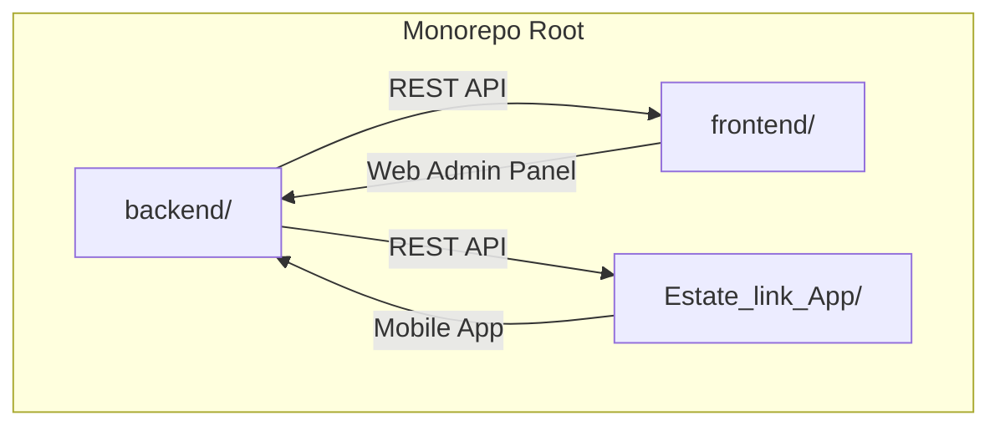
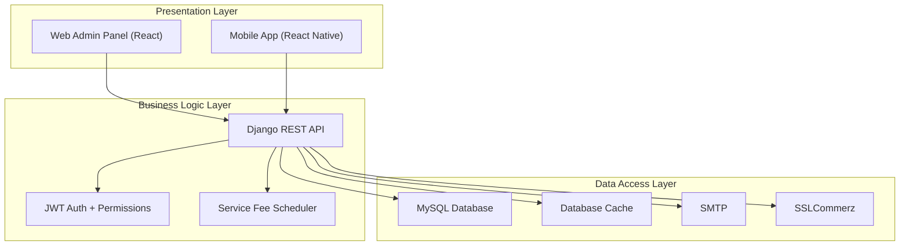
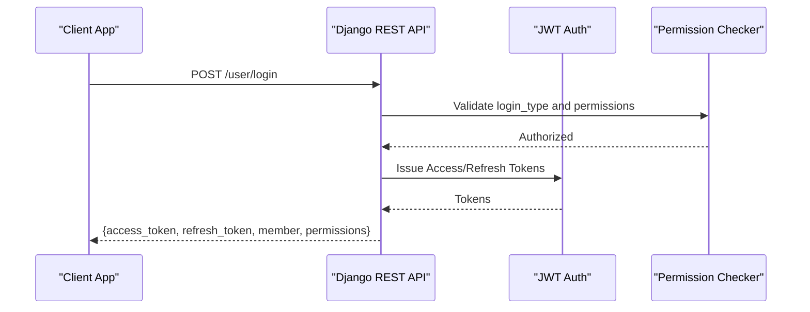
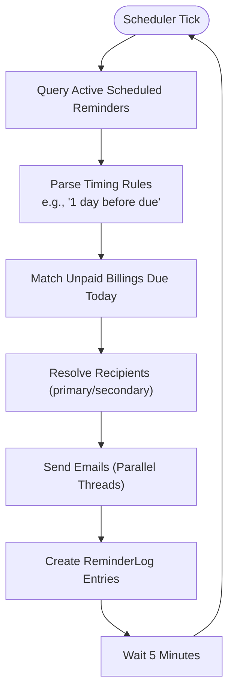
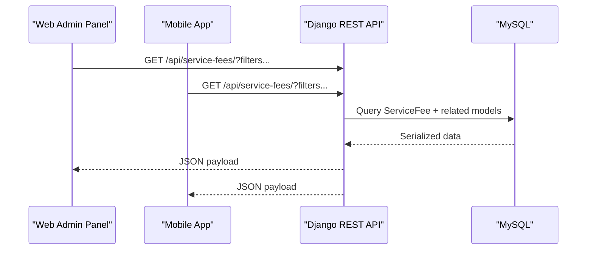
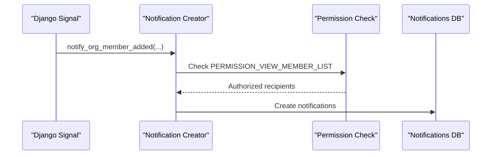
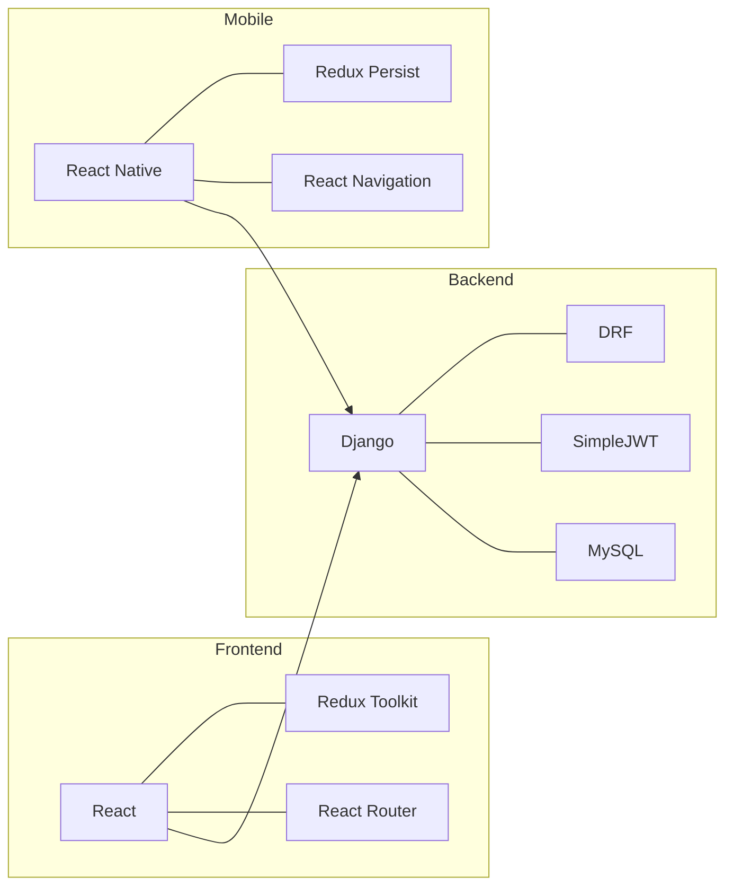

# Architecture Overview

<cite>
**Referenced Files in This Document**
- [backend/settings.py](file://backend/backend/settings.py)
- [backend/urls.py](file://backend/backend/urls.py)
- [backend/user/views.py](file://backend/user/views.py)
- [backend/service_fee/views.py](file://backend/service_fee/views.py)
- [backend/service_fee_management/ARCHITECTURE_DIAGRAM.md](file://backend/service_fee_management/ARCHITECTURE_DIAGRAM.md)
- [backend/IMPLEMENTATION_SUMMARY.md](file://backend/IMPLEMENTATION_SUMMARY.md)
- [frontend/package.json](file://frontend/package.json)
- [frontend/src/main.jsx](file://frontend/src/main.jsx)
- [frontend/src/App.jsx](file://frontend/src/App.jsx)
- [frontend/src/redux/store.js](file://frontend/src/redux/store.js)
- [frontend/src/Routes/Routes.jsx](file://frontend/src/Routes/Routes.jsx)
- [Estate_link_App/package.json](file://Estate_link_App/package.json)
- [Estate_link_App/App.tsx](file://Estate_link_App/App.tsx)
- [Estate_link_App/src/store/index.ts](file://Estate_link_App/src/store/index.ts)
- [backend/requirements.txt](file://backend/requirements.txt)
</cite>

## Table of Contents
1. [Introduction](#introduction)
2. [Project Structure](#project-structure)
3. [Core Components](#core-components)
4. [Architecture Overview](#architecture-overview)
5. [Detailed Component Analysis](#detailed-component-analysis)
6. [Dependency Analysis](#dependency-analysis)
7. [Performance Considerations](#performance-considerations)
8. [Security Architecture](#security-architecture)
9. [Scalability and Deployment Topology](#scalability-and-deployment-topology)
10. [Troubleshooting Guide](#troubleshooting-guide)
11. [Conclusion](#conclusion)

## Introduction
This document presents the architecture overview of the Estate Link system, a cross-platform property management platform comprising a Django backend, a React-based web admin panel, and a React Native mobile application. The system follows a monorepo-like organization under a single repository with three major applications: backend, frontend, and Estate_link_App. It employs a layered architecture with clear separation between presentation, business logic, and data access layers, and integrates JWT-based authentication, permission-driven visibility, and scheduled background tasks for service fee reminders.

## Project Structure
The repository organizes code into three primary applications:
- Backend: Django-based REST API with modular apps for user management, communication, towers/units, service fees, notifications, and financial accounting.
- Frontend: React web admin panel with Redux Toolkit for state management, protected routing, and permission-based UI.
- Estate_link_App: React Native mobile application with Redux Persist for offline-capable state and push notification integration.

**Diagram sources**
- [backend/urls.py](file://backend/backend/urls.py#L36-L55)
- [frontend/src/Routes/Routes.jsx](file://frontend/src/Routes/Routes.jsx#L265-L286)
- [Estate_link_App/App.tsx](file://Estate_link_App/App.tsx#L118-L415)

**Section sources**
- [backend/urls.py](file://backend/backend/urls.py#L36-L55)
- [frontend/src/Routes/Routes.jsx](file://frontend/src/Routes/Routes.jsx#L265-L286)
- [Estate_link_App/App.tsx](file://Estate_link_App/App.tsx#L118-L415)

## Core Components
- Backend (Django)
  - Modular apps: user, announcements, bulletins, noticeboard, service_fee, service_fee_management, contacts, company_settings, bill_categories, accounts, notifications, audit_trail, group_role, towers.
  - Authentication: JWT via SimpleJWT with access/refresh tokens and blacklist support.
  - Middleware: CORS, session, CSRF, X-Frame-Options.
  - Database: MySQL with Django ORM; cache via database-backed cache.
  - Email: SMTP configuration for OTPs and reminders.
  - Payment gateway: SSLCommerz sandbox configuration.

- Frontend (React)
  - Redux store with slices for all domain features (members, roles, groups, towers, units, service fees, payments, notifications).
  - Protected routing with permission checks.
  - Lazy-loaded routes and modern loading animations.

- Mobile App (React Native)
  - Redux Persist for selective persistence (auth, company settings).
  - Push notification service integration and navigation lifecycle management.
  - Cross-platform UI with native navigation and safe area providers.

**Section sources**
- [backend/settings.py](file://backend/backend/settings.py#L53-L78)
- [backend/settings.py](file://backend/backend/settings.py#L95-L138)
- [backend/settings.py](file://backend/backend/settings.py#L169-L197)
- [backend/settings.py](file://backend/backend/settings.py#L261-L279)
- [frontend/src/redux/store.js](file://frontend/src/redux/store.js#L26-L54)
- [frontend/src/Routes/Routes.jsx](file://frontend/src/Routes/Routes.jsx#L265-L286)
- [Estate_link_App/src/store/index.ts](file://Estate_link_App/src/store/index.ts#L15-L36)
- [Estate_link_App/App.tsx](file://Estate_link_App/App.tsx#L149-L206)

## Architecture Overview
The system follows a client-server pattern with three distinct clients:
- Web Admin Panel (React): Administrative controls for members, roles, towers, units, service fees, and communications.
- Mobile App (React Native): Consumer-facing features for announcements, bulletins, notices, service fee payments, and notifications.
- Backend (Django REST API): Centralized business logic, data access, and integrations.

**Diagram sources**
- [backend/settings.py](file://backend/backend/settings.py#L169-L197)
- [backend/settings.py](file://backend/backend/settings.py#L261-L279)
- [backend/service_fee_management/ARCHITECTURE_DIAGRAM.md](file://backend/service_fee_management/ARCHITECTURE_DIAGRAM.md#L1-L138)

## Detailed Component Analysis

### Authentication and Authorization
- JWT-based authentication with access/refresh tokens and rotation/blacklist.
- Permission gates enforced at view level using custom permission classes.
- Login supports organization/community member types and first-login password reset flow.

**Diagram sources**
- [backend/user/views.py](file://backend/user/views.py#L603-L658)
- [backend/user/views.py](file://backend/user/views.py#L600-L732)

**Section sources**
- [backend/user/views.py](file://backend/user/views.py#L603-L658)
- [backend/user/views.py](file://backend/user/views.py#L600-L732)

### Service Fee Management and Reminders
- Background scheduler sends timely email reminders based on configurable rules and audience filters.
- Duplicate prevention via reminder logs; thread-per-recipient for concurrency.
- Integration with bill uploads and payment tracking.

**Diagram sources**
- [backend/service_fee_management/ARCHITECTURE_DIAGRAM.md](file://backend/service_fee_management/ARCHITECTURE_DIAGRAM.md#L1-L138)

**Section sources**
- [backend/service_fee_management/ARCHITECTURE_DIAGRAM.md](file://backend/service_fee_management/ARCHITECTURE_DIAGRAM.md#L1-L138)

### Data Flow: Backend API, Web Admin Panel, Mobile App
- Web Admin Panel and Mobile App both consume the same Django REST API endpoints.
- Frontend Redux slices mirror backend domain models for consistent state.
- Mobile app persists critical slices (auth, company settings) for offline readiness.

**Diagram sources**
- [backend/service_fee/views.py](file://backend/service_fee/views.py#L32-L105)
- [frontend/src/redux/store.js](file://frontend/src/redux/store.js#L26-L54)
- [Estate_link_App/src/store/index.ts](file://Estate_link_App/src/store/index.ts#L23-L36)

**Section sources**
- [backend/service_fee/views.py](file://backend/service_fee/views.py#L32-L105)
- [frontend/src/redux/store.js](file://frontend/src/redux/store.js#L26-L54)
- [Estate_link_App/src/store/index.ts](file://Estate_link_App/src/store/index.ts#L23-L36)

### Notification System and Permission-Based Visibility
- Organization member notifications with strict permission-based visibility and non-retroactive behavior.
- Signals trigger notifications upon role/group membership changes and new member additions.
- Frontend integration requires handling new notification types and click actions.

**Diagram sources**
- [backend/IMPLEMENTATION_SUMMARY.md](file://backend/IMPLEMENTATION_SUMMARY.md#L68-L82)

**Section sources**
- [backend/IMPLEMENTATION_SUMMARY.md](file://backend/IMPLEMENTATION_SUMMARY.md#L68-L82)

## Dependency Analysis
- Technology stack highlights:
  - Backend: Django, Django REST Framework, SimpleJWT, MySQL, Django CORS Headers.
  - Frontend: React, Redux Toolkit, React Router, Tailwind CSS, Axios.
  - Mobile: React Native, Expo, Redux Persist, React Navigation, Expo Notifications.

**Diagram sources**
- [backend/requirements.txt](file://backend/requirements.txt#L1-L31)
- [frontend/package.json](file://frontend/package.json#L15-L43)
- [Estate_link_App/package.json](file://Estate_link_App/package.json#L22-L68)

**Section sources**
- [backend/requirements.txt](file://backend/requirements.txt#L1-L31)
- [frontend/package.json](file://frontend/package.json#L15-L43)
- [Estate_link_App/package.json](file://Estate_link_App/package.json#L22-L68)

## Performance Considerations
- Caching: Database-backed cache for OTPs and rate-limiting to reduce DB load.
- Upload limits: Increased upload sizes for attachments to support bulletin media.
- Pagination and filtering: Backend endpoints support search, filters, and ordering to minimize payload sizes.
- Asynchronous email sending: Parallel threads per recipient for reminder emails.
- Client-side caching: Redux Persist for offline-ready state; selective whitelisting to avoid bloating storage.

[No sources needed since this section provides general guidance]

## Security Architecture
- Authentication: JWT with access/refresh tokens, rotation, and blacklist support.
- Authorization: Permission-based gating at view level and UI level via route protection.
- CORS: Enabled with credentials support for cross-origin requests.
- Email security: SMTP configuration for secure delivery of OTPs and reminders.
- Payment security: SSLCommerz sandbox configuration for payment processing.

**Section sources**
- [backend/settings.py](file://backend/backend/settings.py#L95-L138)
- [backend/settings.py](file://backend/backend/settings.py#L79-L90)
- [backend/settings.py](file://backend/backend/settings.py#L261-L279)

## Scalability and Deployment Topology
- Monorepo organization simplifies CI/CD and reduces operational overhead.
- Horizontal scaling: Django workers behind a reverse proxy; separate static/media serving.
- Database: MySQL with proper indexing and constraints; consider read replicas for reporting.
- Background tasks: Separate scheduler daemon for reminders; monitor thread health and resource usage.
- CDN: Serve static/media assets via CDN for improved global latency.
- Observability: Add structured logging, metrics, and tracing for API and background jobs.

[No sources needed since this section provides general guidance]

## Troubleshooting Guide
- Authentication failures: Verify JWT configuration, token validity, and refresh token blacklisting.
- Permission denied: Confirm required permission IDs and user membership type (organization/community).
- Email delivery issues: Check SMTP settings and sender credentials; review Django email backend configuration.
- Payment gateway errors: Validate SSLCommerz credentials and sandbox vs production endpoints.
- Mobile push notifications: Ensure device token registration and navigation ref setup during app lifecycle.

**Section sources**
- [backend/user/views.py](file://backend/user/views.py#L600-L732)
- [backend/settings.py](file://backend/backend/settings.py#L261-L279)

## Conclusion
Estate Link employs a cohesive, layered architecture with a Django backend, React web admin panel, and React Native mobile application. The system emphasizes cross-platform consistency, robust authentication and authorization, permission-driven visibility, and scalable background processing for reminders. The monorepo structure and modular backend apps facilitate maintainability and future enhancements.