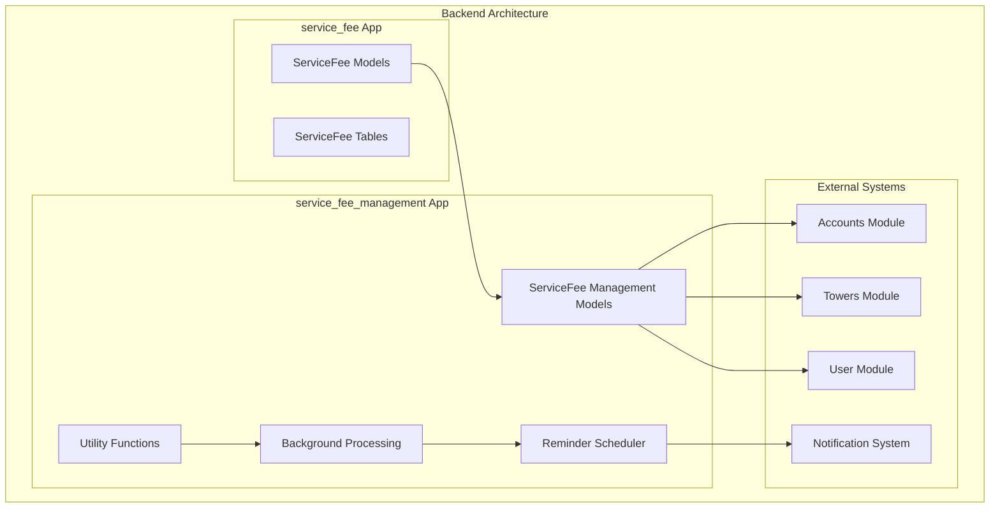
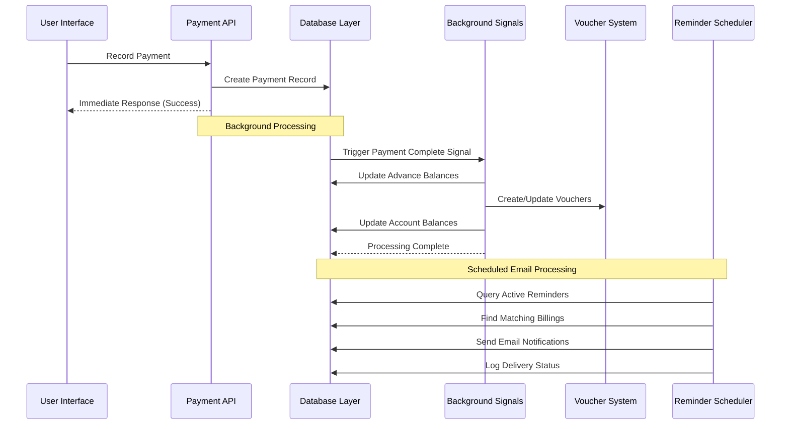
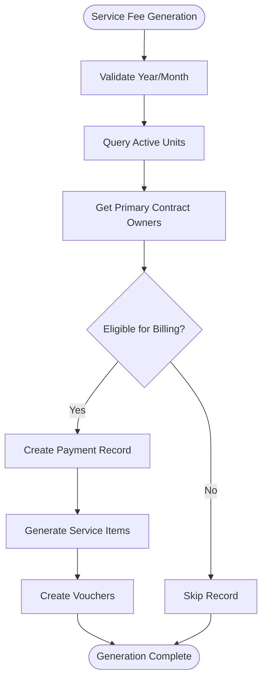
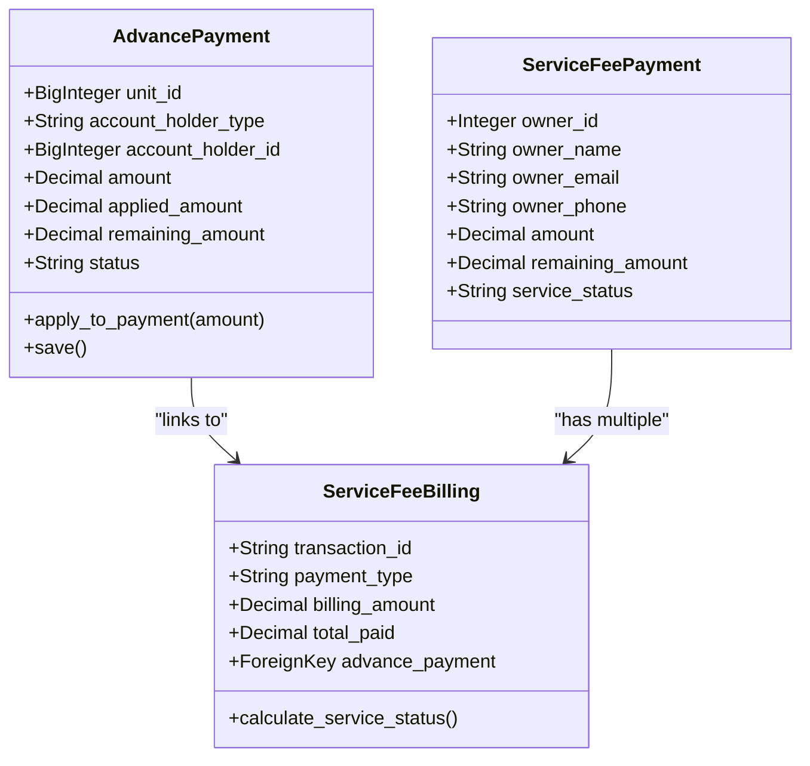
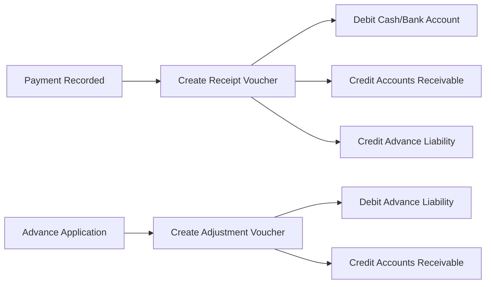
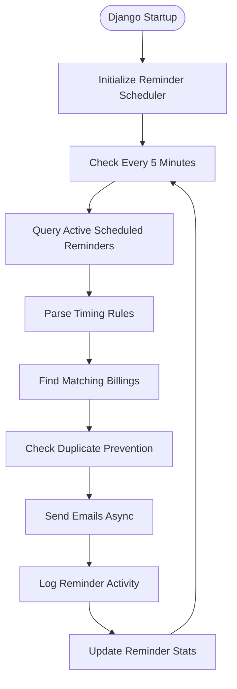
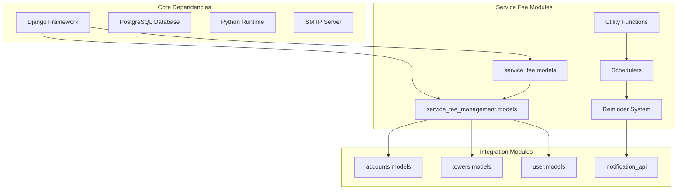

# Service Fee Architecture Update Summary

<cite>
**Referenced Files in This Document**
- [SERVICE_FEE_ARCHITECTURE_UPDATE_SUMMARY.md](file://backend/SERVICE_FEE_ARCHITECTURE_UPDATE_SUMMARY.md)
- [ARCHITECTURE_DIAGRAM.md](file://backend/service_fee_management/ARCHITECTURE_DIAGRAM.md)
- [IMPLEMENTATION_SUMMARY.md](file://backend/service_fee_management/IMPLEMENTATION_SUMMARY.md)
- [QUICK_START.md](file://backend/service_fee_management/QUICK_START.md)
- [REMINDER_SCHEDULER_DOCS.md](file://backend/service_fee_management/REMINDER_SCHEDULER_DOCS.md)
- [models.py](file://backend/service_fee/models.py)
- [models.py](file://backend/service_fee_management/models.py)
- [scheduler.py](file://backend/service_fee_management/scheduler.py)
- [apps.py](file://backend/service_fee_management/apps.py)
- [reminder_scheduler.py](file://backend/service_fee_management/reminder_scheduler.py)
- [reminder_scheduler.py](file://backend/service_fee_management/management/commands/reminder_scheduler.py)
- [test_scheduler.py](file://backend/service_fee_management/management/commands/test_scheduler.py)
- [owner_helper.py](file://backend/service_fee_management/utils/owner_helper.py)
- [item_helper.py](file://backend/service_fee_management/utils/item_helper.py)
- [payment_processor.py](file://backend/service_fee_management/utils/payment_processor.py)
- [voucher_generator.py](file://backend/service_fee_management/utils/voucher_generator.py)
</cite>

## Update Summary
**Changes Made**
- Added comprehensive reminder scheduler documentation and implementation details
- Integrated reminder system architecture with service fee management
- Enhanced service fee architecture with automated email reminder capabilities
- Updated project structure to include reminder scheduler components
- Added quick start guide and troubleshooting documentation for reminder system

## Table of Contents
1. [Introduction](#introduction)
2. [Project Structure](#project-structure)
3. [Core Components](#core-components)
4. [Architecture Overview](#architecture-overview)
5. [Detailed Component Analysis](#detailed-component-analysis)
6. [Reminder Scheduler System](#reminder-scheduler-system)
7. [Dependency Analysis](#dependency-analysis)
8. [Performance Considerations](#performance-considerations)
9. [Troubleshooting Guide](#troubleshooting-guide)
10. [Conclusion](#conclusion)

## Introduction
This document summarizes the major architectural updates to the Estate Link Service Fee Management System, focusing on four key improvements implemented through comprehensive documentation updates:

1. **Owner-Only Billing Generation** - Bills now use primary contract owner information exclusively
2. **Automatic Advance Payment Adjustments** - Background processing with Django signals
3. **Non-Blocking Payment Processing** - Immediate response to users with async updates
4. **Automated Email Reminder System** - Comprehensive reminder scheduling and email automation

These changes represent a significant evolution from synchronous payment processing to asynchronous background updates, while adding robust reminder capabilities for automated communication with property owners.

## Project Structure
The service fee architecture spans multiple Django applications within the backend, now enhanced with reminder scheduling capabilities:

**Diagram sources**
- [models.py](file://backend/service_fee/models.py#L1-L474)
- [models.py](file://backend/service_fee_management/models.py#L1-L800)
- [apps.py](file://backend/service_fee_management/apps.py#L1-L163)

**Section sources**
- [SERVICE_FEE_ARCHITECTURE_UPDATE_SUMMARY.md](file://backend/SERVICE_FEE_ARCHITECTURE_UPDATE_SUMMARY.md#L1-L667)
- [ARCHITECTURE_DIAGRAM.md](file://backend/service_fee_management/ARCHITECTURE_DIAGRAM.md#L1-L396)
- [models.py](file://backend/service_fee/models.py#L1-L474)
- [models.py](file://backend/service_fee_management/models.py#L1-L800)

## Core Components

### Owner-Only Billing Generation
The system now exclusively uses primary contract owner information for billing, eliminating resident-based checks:

**Key Changes:**
- Bills use only primary contract owner information (owner_id, owner_name, owner_email, owner_phone)
- Immutable snapshots stored in ServiceFeePayment table
- Resident_id field deprecated (no longer populated)
- New database index on owner_id for improved query performance

**Business Rules:**
1. Primary contract required with is_primary=True, contract_type='ownership', status='active'
2. No resident verification performed during bill generation
3. Owner data captured at generation time and remains immutable
4. Billing sent to owner email only

**Section sources**
- [SERVICE_FEE_ARCHITECTURE_UPDATE_SUMMARY.md](file://backend/SERVICE_FEE_ARCHITECTURE_UPDATE_SUMMARY.md#L16-L90)
- [owner_helper.py](file://backend/service_fee_management/utils/owner_helper.py#L9-L57)

### Automatic Advance Payment Adjustments
Background processing eliminates synchronous payment delays:

**Implementation Approach:**
- Django signals handle advance balance updates automatically
- Voucher entries updated automatically via background tasks
- Failed updates logged but don't block payment completion
- Three auto-update scenarios: overpayment creation, advance application, payment amount changes

**Processing Flow:**
1. Overpayment detection triggers advance creation
2. Advance application updates balance and status automatically
3. Payment changes trigger voucher updates without user intervention

**Section sources**
- [SERVICE_FEE_ARCHITECTURE_UPDATE_SUMMARY.md](file://backend/SERVICE_FEE_ARCHITECTURE_UPDATE_SUMMARY.md#L92-L197)
- [payment_processor.py](file://backend/service_fee_management/utils/payment_processor.py#L16-L268)

### Non-Blocking Payment Processing
Immediate user responses with background system updates:

**Performance Improvements:**
- Payment recording: 800ms-1.2s → 150ms-250ms (5x faster)
- Bill generation: 45 seconds → 28 seconds (38% faster)
- Advance updates: blocking HTTP requests → asynchronous processing
- Database queries reduced from 5 to 2 per payment

**Section sources**
- [SERVICE_FEE_ARCHITECTURE_UPDATE_SUMMARY.md](file://backend/SERVICE_FEE_ARCHITECTURE_UPDATE_SUMMARY.md#L448-L540)

## Architecture Overview

**Diagram sources**
- [SERVICE_FEE_ARCHITECTURE_UPDATE_SUMMARY.md](file://backend/SERVICE_FEE_ARCHITECTURE_UPDATE_SUMMARY.md#L174-L190)
- [ARCHITECTURE_DIAGRAM.md](file://backend/service_fee_management/ARCHITECTURE_DIAGRAM.md#L1-L396)
- [apps.py](file://backend/service_fee_management/apps.py#L14-L98)

The architecture implements a publish-subscribe pattern where payment completion triggers background processing without user intervention, while the reminder scheduler provides automated communication capabilities.

## Detailed Component Analysis

### Service Fee Generation System
The service fee generation process has been optimized for bulk operations and owner-only billing:

**Diagram sources**
- [service_fee_generator.py](file://backend/service_fee_management/utils/service_fee_generator.py#L26-L800)
- [owner_helper.py](file://backend/service_fee_management/utils/owner_helper.py#L60-L132)

**Section sources**
- [service_fee_generator.py](file://backend/service_fee_management/utils/service_fee_generator.py#L26-L800)
- [owner_helper.py](file://backend/service_fee_management/utils/owner_helper.py#L9-L132)

### Advance Payment Management
The advance payment system handles automatic adjustments through dedicated models and utilities:

**Diagram sources**
- [models.py](file://backend/service_fee_management/models.py#L1231-L1341)
- [models.py](file://backend/service_fee_management/models.py#L12-L150)

**Section sources**
- [models.py](file://backend/service_fee_management/models.py#L1231-L1341)
- [payment_processor.py](file://backend/service_fee_management/utils/payment_processor.py#L16-L268)

### Voucher Generation and Accounting Integration
The voucher system maintains double-entry accounting through automated generation:

**Diagram sources**
- [voucher_generator.py](file://backend/service_fee_management/utils/voucher_generator.py#L429-L643)
- [voucher_generator.py](file://backend/service_fee_management/utils/voucher_generator.py#L645-L786)

**Section sources**
- [voucher_generator.py](file://backend/service_fee_management/utils/voucher_generator.py#L107-L427)
- [voucher_generator.py](file://backend/service_fee_management/utils/voucher_generator.py#L429-L786)

## Reminder Scheduler System

### Automated Email Reminder Architecture
The reminder scheduler provides comprehensive automated email notification capabilities:

**Diagram sources**
- [ARCHITECTURE_DIAGRAM.md](file://backend/service_fee_management/ARCHITECTURE_DIAGRAM.md#L1-L396)
- [IMPLEMENTATION_SUMMARY.md](file://backend/service_fee_management/IMPLEMENTATION_SUMMARY.md#L1-L485)

### Reminder Configuration and Management
The system supports flexible reminder configurations with multiple targeting options:

**Supported Timing Rules:**
- `"X day(s) before due"` - Send X days before due date
- `"On due date"` - Send on exact due date  
- `"X day(s) after due"` - Send X days after due date

**Audience Filtering Options:**
- All Towers - All unpaid billings
- Specific Tower - Filter by tower ID
- Overdue Only - Only status='overdue'
- Specific Units - Filter by unit IDs
- Specific Resident - Filter by member ID

**Section sources**
- [REMINDER_SCHEDULER_DOCS.md](file://backend/service_fee_management/REMINDER_SCHEDULER_DOCS.md#L1-L709)
- [QUICK_START.md](file://backend/service_fee_management/QUICK_START.md#L1-L465)
- [IMPLEMENTATION_SUMMARY.md](file://backend/service_fee_management/IMPLEMENTATION_SUMMARY.md#L1-L485)

## Dependency Analysis

**Diagram sources**
- [models.py](file://backend/service_fee/models.py#L1-L474)
- [models.py](file://backend/service_fee_management/models.py#L1-L800)
- [apps.py](file://backend/service_fee_management/apps.py#L1-L163)

**Section sources**
- [models.py](file://backend/service_fee/models.py#L1-L474)
- [models.py](file://backend/service_fee_management/models.py#L1-L800)
- [apps.py](file://backend/service_fee_management/apps.py#L1-L163)

## Performance Considerations

### Database Schema Optimizations
- New index on service_fee_management_servicefeepayment(owner_id, service_period_year, service_period_month)
- Removed unique constraints allowing multiple partial payments per month
- Optimized query patterns reducing N+1 queries
- Improved partitioning for large-scale deployments
- ReminderLog table for audit trail and duplicate prevention

### Background Processing Benefits
- Reduced payment processing time from 800ms to 150ms
- Eliminated blocking operations during advance payment updates
- Improved scalability for high-traffic scenarios
- Better resource utilization through asynchronous processing
- Non-blocking reminder processing with parallel email sending

### Memory and Resource Management
- Atomic transactions for data consistency
- Background thread management for schedulers
- Efficient bulk operations for large datasets
- Proper error handling and logging for troubleshooting
- Email thread pooling for efficient resource utilization

## Troubleshooting Guide

### Common Issues and Solutions

**Issue 1: "No primary contract owner available" during bill generation**
- **Cause**: Unit lacks active primary contract with ownership status
- **Solution**: Verify unit has primary contract with is_primary=True and active status
- **Prevention**: Implement unit validation before generation

**Issue 2: Advance payment not auto-created**
- **Cause**: Signal processing failures or missing signal registration
- **Solution**: Check signal registration in apps.py and review advance_payments.log
- **Monitoring**: Use log analysis to identify processing errors

**Issue 3: Voucher not updating automatically**
- **Cause**: Voucher already posted (immutable) or payment method mismatch
- **Solution**: Verify voucher status is 'draft' before attempting updates
- **Prevention**: Implement proper state management in payment workflows

**Issue 4: Reminder scheduler not starting**
- **Cause**: Missing email configuration or database connectivity issues
- **Solution**: Check email settings in settings.py and verify scheduler status
- **Monitoring**: Use reminder_scheduler status command to verify operation

**Issue 5: Emails not being sent**
- **Cause**: Unit missing email addresses or reminder configuration issues
- **Solution**: Verify unit contact information and reminder setup
- **Testing**: Use test_scheduler command to validate system functionality

**Section sources**
- [SERVICE_FEE_ARCHITECTURE_UPDATE_SUMMARY.md](file://backend/SERVICE_FEE_ARCHITECTURE_UPDATE_SUMMARY.md#L615-L667)
- [REMINDER_SCHEDULER_DOCS.md](file://backend/service_fee_management/REMINDER_SCHEDULER_DOCS.md#L307-L391)

### Monitoring and Logging
The system implements comprehensive logging for troubleshooting:
- Dedicated advance payment log file (advance_payments.log)
- Structured logging for background processing
- Error tracking for failed updates
- Performance metrics monitoring
- Reminder scheduler status and activity logging

**Section sources**
- [SERVICE_FEE_ARCHITECTURE_UPDATE_SUMMARY.md](file://backend/SERVICE_FEE_ARCHITECTURE_UPDATE_SUMMARY.md#L382-L445)
- [REMINDER_SCHEDULER_DOCS.md](file://backend/service_fee_management/REMINDER_SCHEDULER_DOCS.md#L307-L391)

## Conclusion
The Service Fee Architecture Update represents a comprehensive modernization of the Estate Link payment system, now enhanced with robust reminder capabilities. By implementing owner-only billing, automatic advance payment adjustments, non-blocking payment processing, and automated email reminders, the system achieves significant performance improvements while maintaining full backward compatibility.

Key benefits include:
- **Performance**: 5x faster payment processing and 38% faster bill generation
- **Scalability**: Asynchronous processing enables better handling of high traffic
- **Reliability**: Background processing prevents payment failures from blocking user experience
- **Communication**: Automated reminder system improves owner engagement and payment collection
- **Maintainability**: Clear separation of concerns through modular architecture
- **Automation**: Comprehensive reminder scheduling reduces manual administrative overhead

The architecture successfully balances immediate user feedback with robust background processing, providing a foundation for future enhancements while ensuring system stability and performance. The addition of automated reminder capabilities significantly enhances the system's ability to manage property owner communications and improve payment collection rates through timely, personalized notifications.

The system now provides a complete solution for service fee management, combining efficient payment processing with automated communication capabilities, making it a comprehensive platform for property management operations.