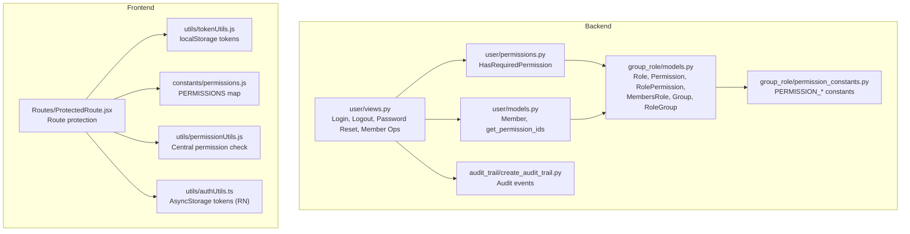
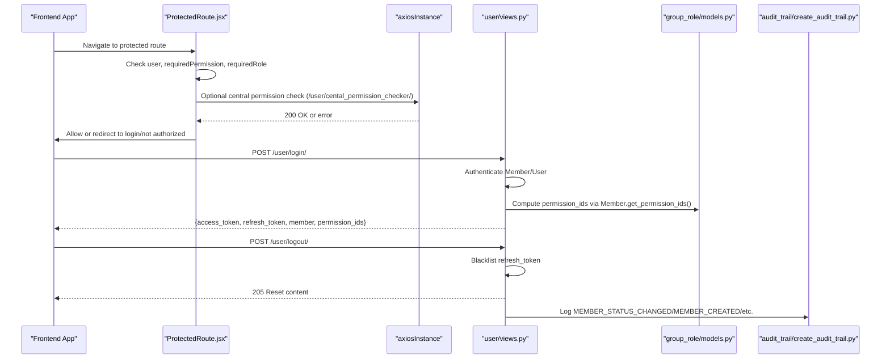
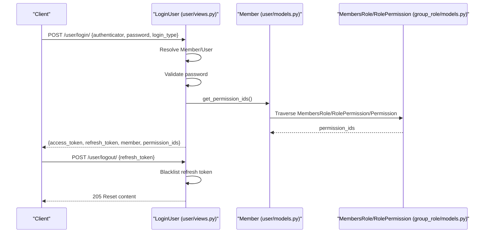
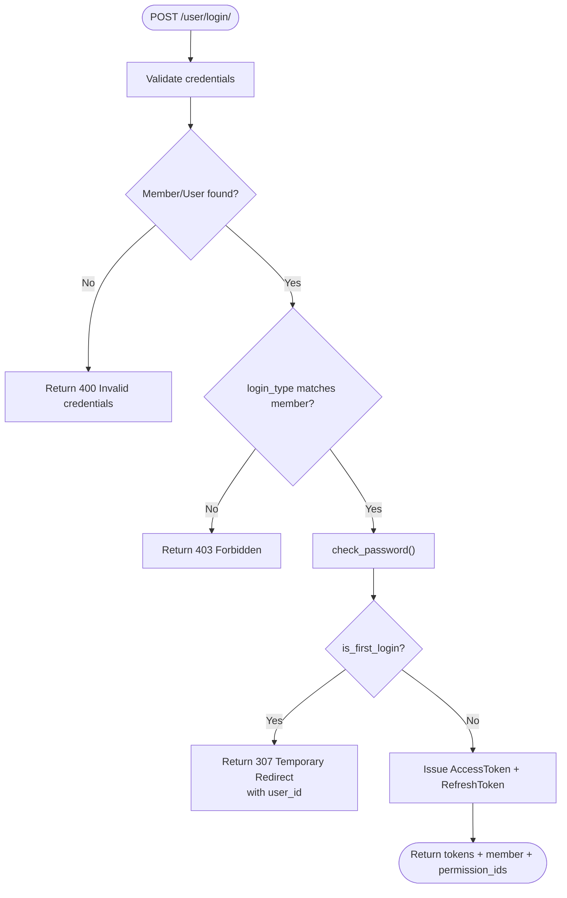
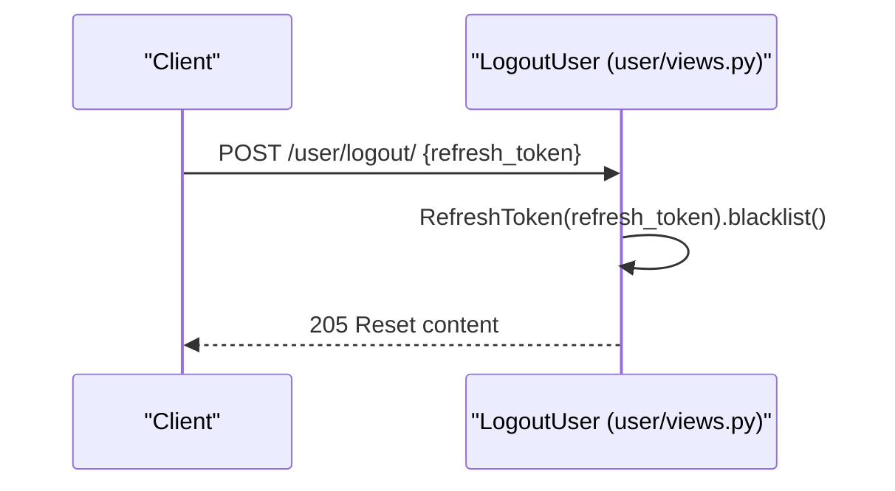
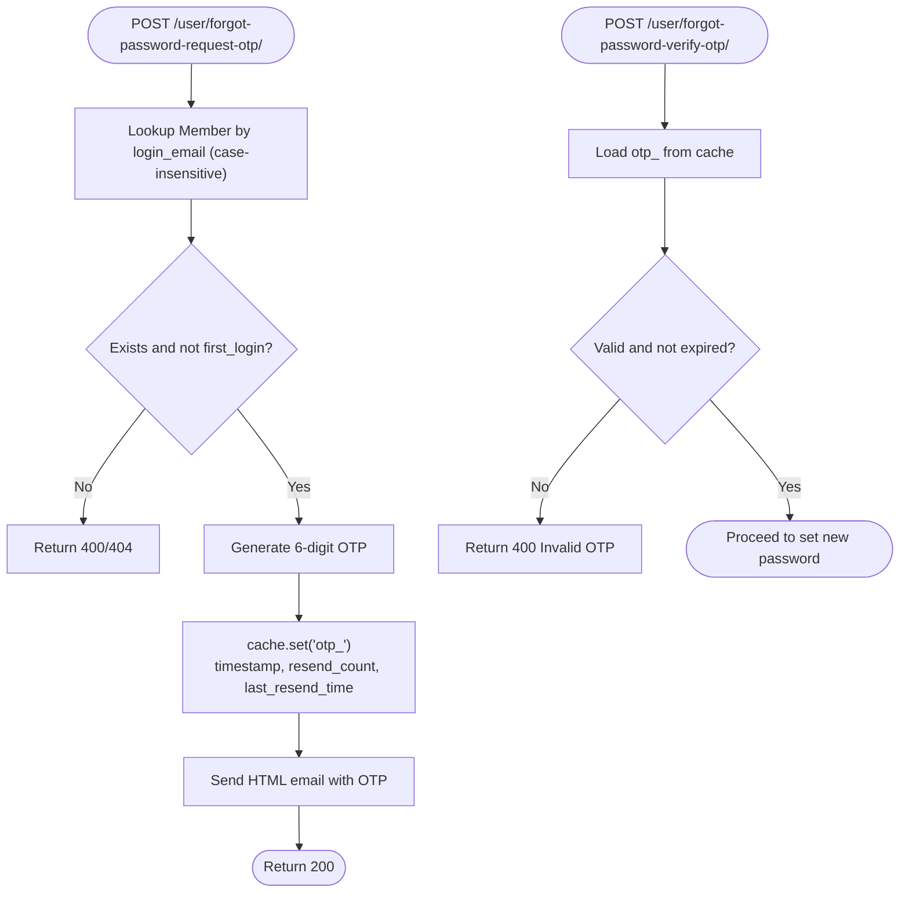
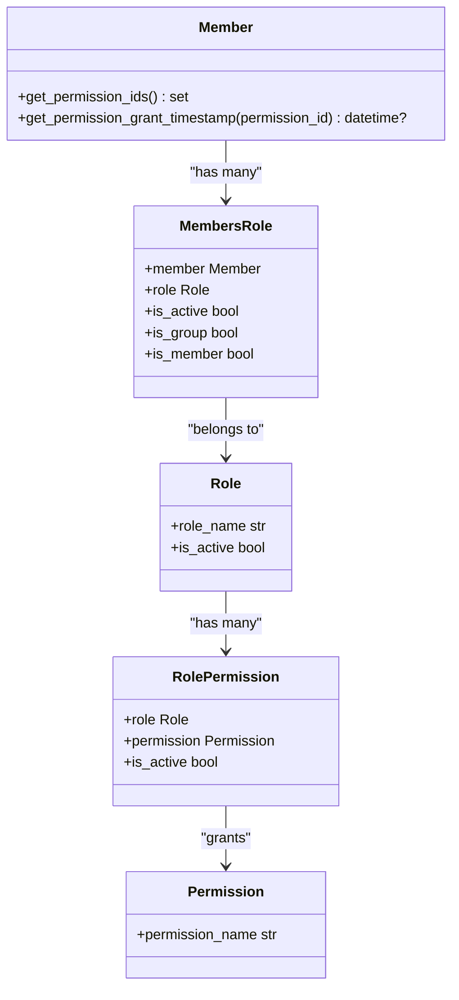
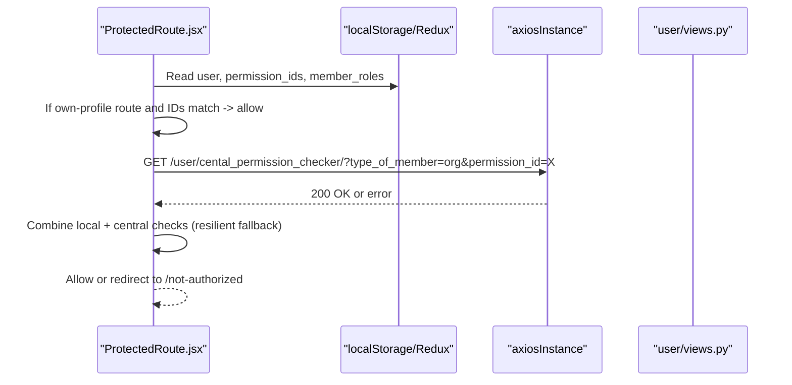
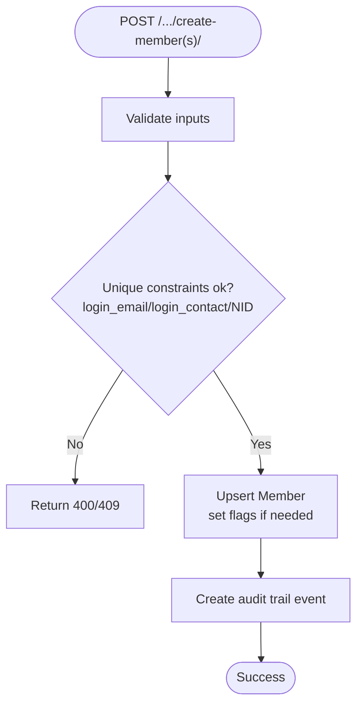
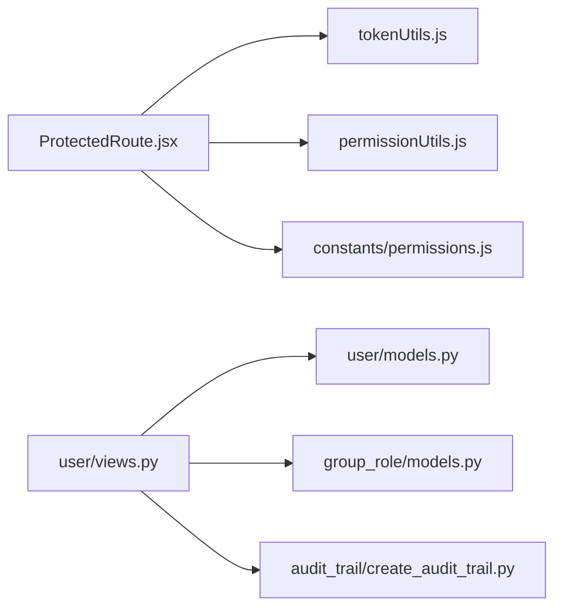

# Authentication & Authorization

<cite>
**Referenced Files in This Document**
- [backend/user/views.py](file://backend/user/views.py)
- [backend/user/models.py](file://backend/user/models.py)
- [backend/user/permissions.py](file://backend/user/permissions.py)
- [backend/group_role/models.py](file://backend/group_role/models.py)
- [backend/group_role/permission_constants.py](file://backend/group_role/permission_constants.py)
- [backend/group_role/auto_populate_permissions.py](file://backend/group_role/auto_populate_permissions.py)
- [backend/audit_trail/create_audit_trail.py](file://backend/audit_trail/create_audit_trail.py)
- [frontend/src/utils/tokenUtils.js](file://frontend/src/utils/tokenUtils.js)
- [frontend/src/utils/authUtils.ts](file://frontend/src/utils/authUtils.ts)
- [frontend/src/Routes/ProtectedRoute.jsx](file://frontend/src/Routes/ProtectedRoute.jsx)
- [frontend/src/constants/permissions.js](file://frontend/src/constants/permissions.js)
- [frontend/src/utils/permissionUtils.js](file://frontend/src/utils/permissionUtils.js)
</cite>

## Table of Contents
1. [Introduction](#introduction)
2. [Project Structure](#project-structure)
3. [Core Components](#core-components)
4. [Architecture Overview](#architecture-overview)
5. [Detailed Component Analysis](#detailed-component-analysis)
6. [Dependency Analysis](#dependency-analysis)
7. [Performance Considerations](#performance-considerations)
8. [Troubleshooting Guide](#troubleshooting-guide)
9. [Conclusion](#conclusion)
10. [Appendices](#appendices)

## Introduction
This document describes the authentication and authorization system for the Estate Link platform. It covers JWT token implementation, login/logout flows, session management, role-based access control (RBAC), permission hierarchy, group-based permissions, user registration, password reset, and account verification. It also documents security measures such as password hashing, token refresh, rate limiting considerations, multi-device session management, account security features, and audit logging. Finally, it explains how authentication integrates with frontend route protection.

## Project Structure
The authentication system spans both the backend (Django REST Framework + Django Auth) and the frontend (React + Redux). Key areas:
- Backend: User and Member models, JWT login/logout, password reset with OTP, permission enforcement, audit trail integration.
- Frontend: Token persistence and retrieval, protected routing, permission checks, and centralized permission constants.

**Diagram sources**
- [backend/user/views.py](file://backend/user/views.py#L603-L732)
- [backend/user/models.py](file://backend/user/models.py#L59-L77)
- [backend/user/permissions.py](file://backend/user/permissions.py#L7-L75)
- [backend/group_role/models.py](file://backend/group_role/models.py#L47-L94)
- [backend/group_role/permission_constants.py](file://backend/group_role/permission_constants.py#L9-L178)
- [frontend/src/Routes/ProtectedRoute.jsx](file://frontend/src/Routes/ProtectedRoute.jsx#L10-L199)
- [frontend/src/utils/tokenUtils.js](file://frontend/src/utils/tokenUtils.js#L1-L26)
- [frontend/src/utils/authUtils.ts](file://frontend/src/utils/authUtils.ts#L1-L219)
- [frontend/src/constants/permissions.js](file://frontend/src/constants/permissions.js#L1-L84)
- [frontend/src/utils/permissionUtils.js](file://frontend/src/utils/permissionUtils.js#L1-L32)

**Section sources**
- [backend/user/views.py](file://backend/user/views.py#L603-L732)
- [backend/user/models.py](file://backend/user/models.py#L59-L77)
- [backend/user/permissions.py](file://backend/user/permissions.py#L7-L75)
- [backend/group_role/models.py](file://backend/group_role/models.py#L47-L94)
- [backend/group_role/permission_constants.py](file://backend/group_role/permission_constants.py#L9-L178)
- [frontend/src/Routes/ProtectedRoute.jsx](file://frontend/src/Routes/ProtectedRoute.jsx#L10-L199)
- [frontend/src/utils/tokenUtils.js](file://frontend/src/utils/tokenUtils.js#L1-L26)
- [frontend/src/utils/authUtils.ts](file://frontend/src/utils/authUtils.ts#L1-L219)
- [frontend/src/constants/permissions.js](file://frontend/src/constants/permissions.js#L1-L84)
- [frontend/src/utils/permissionUtils.js](file://frontend/src/utils/permissionUtils.js#L1-L32)

## Core Components
- JWT Login/Logout: Stateless JWT with refresh token blacklisting.
- Password Reset: OTP via cache/email with validity and resend limits.
- RBAC: Member → Roles → RolePermission → Permissions; community vs organization member behavior.
- Frontend Route Protection: ProtectedRoute enforces permission and role checks, with fallback to local checks.
- Audit Logging: Centralized audit trail creation for sensitive actions.

**Section sources**
- [backend/user/views.py](file://backend/user/views.py#L603-L732)
- [backend/user/models.py](file://backend/user/models.py#L59-L77)
- [backend/user/permissions.py](file://backend/user/permissions.py#L7-L75)
- [frontend/src/Routes/ProtectedRoute.jsx](file://frontend/src/Routes/ProtectedRoute.jsx#L10-L199)
- [backend/audit_trail/create_audit_trail.py](file://backend/audit_trail/create_audit_trail.py)

## Architecture Overview
The authentication pipeline connects frontend route guards with backend endpoints and permission enforcement.

**Diagram sources**
- [frontend/src/Routes/ProtectedRoute.jsx](file://frontend/src/Routes/ProtectedRoute.jsx#L120-L174)
- [frontend/src/utils/permissionUtils.js](file://frontend/src/utils/permissionUtils.js#L11-L31)
- [backend/user/views.py](file://backend/user/views.py#L603-L732)
- [backend/user/models.py](file://backend/user/models.py#L59-L77)
- [backend/audit_trail/create_audit_trail.py](file://backend/audit_trail/create_audit_trail.py)

## Detailed Component Analysis

### JWT Token Implementation and Session Management
- Access and refresh tokens are generated upon successful login.
- Logout invalidates the refresh token by blacklisting it.
- Frontend stores tokens in localStorage (web) and AsyncStorage/SecureStore (React Native) for resilience and security.

**Diagram sources**
- [backend/user/views.py](file://backend/user/views.py#L603-L732)
- [backend/user/models.py](file://backend/user/models.py#L59-L77)
- [backend/group_role/models.py](file://backend/group_role/models.py#L81-L94)
- [frontend/src/utils/tokenUtils.js](file://frontend/src/utils/tokenUtils.js#L12-L21)
- [frontend/src/utils/authUtils.ts](file://frontend/src/utils/authUtils.ts#L41-L59)

**Section sources**
- [backend/user/views.py](file://backend/user/views.py#L603-L732)
- [backend/user/models.py](file://backend/user/models.py#L59-L77)
- [backend/group_role/models.py](file://backend/group_role/models.py#L81-L94)
- [frontend/src/utils/tokenUtils.js](file://frontend/src/utils/tokenUtils.js#L1-L26)
- [frontend/src/utils/authUtils.ts](file://frontend/src/utils/authUtils.ts#L1-L219)

### Login Flow
- Accepts login via email, phone, or username.
- Enforces membership type (organization/community) access.
- On first-time login, prompts for password change; otherwise issues JWT tokens.

**Diagram sources**
- [backend/user/views.py](file://backend/user/views.py#L603-L654)

**Section sources**
- [backend/user/views.py](file://backend/user/views.py#L603-L654)

### Logout Flow
- Requires refresh token; blacklists it to invalidate sessions.
- Returns reset content to clear client-side state.

**Diagram sources**
- [backend/user/views.py](file://backend/user/views.py#L716-L731)

**Section sources**
- [backend/user/views.py](file://backend/user/views.py#L716-L731)

### Password Reset (OTP-based)
- Requests OTP for registered email; OTP stored in cache with validity and resend limits.
- Verifies OTP against cache; sends HTML email with OTP template.
- After verification, clients proceed to set new password.

**Diagram sources**
- [backend/user/views.py](file://backend/user/views.py#L740-L800)

**Section sources**
- [backend/user/views.py](file://backend/user/views.py#L740-L800)

### Role-Based Access Control (RBAC)
- Member → Roles (MembersRole) → RolePermissions → Permissions.
- Permission IDs are computed dynamically and returned on login.
- Permission enforcement:
  - Community members: automatic access (no permission check).
  - Organization members: require at least one matching permission ID.
  - Own-profile exceptions: users can access their own profile without permission checks.

**Diagram sources**
- [backend/user/models.py](file://backend/user/models.py#L59-L77)
- [backend/group_role/models.py](file://backend/group_role/models.py#L81-L94)
- [backend/group_role/models.py](file://backend/group_role/models.py#L55-L65)
- [backend/group_role/models.py](file://backend/group_role/models.py#L47-L53)

**Section sources**
- [backend/user/models.py](file://backend/user/models.py#L59-L77)
- [backend/user/permissions.py](file://backend/user/permissions.py#L7-L75)
- [backend/group_role/models.py](file://backend/group_role/models.py#L81-L94)
- [backend/group_role/permission_constants.py](file://backend/group_role/permission_constants.py#L9-L178)

### Frontend Route Protection
- ProtectedRoute enforces:
  - Authentication presence.
  - Optional requiredPermission (via local permission_ids and optional central API check).
  - Optional requiredRole (case-insensitive role name match).
  - Own-profile exceptions handled synchronously using localStorage/Redux/headingData.
- Central permission checker endpoint validates permission against organization membership.

**Diagram sources**
- [frontend/src/Routes/ProtectedRoute.jsx](file://frontend/src/Routes/ProtectedRoute.jsx#L120-L174)
- [frontend/src/utils/permissionUtils.js](file://frontend/src/utils/permissionUtils.js#L11-L31)
- [backend/user/views.py](file://backend/user/views.py#L60-L78)

**Section sources**
- [frontend/src/Routes/ProtectedRoute.jsx](file://frontend/src/Routes/ProtectedRoute.jsx#L10-L199)
- [frontend/src/utils/permissionUtils.js](file://frontend/src/utils/permissionUtils.js#L1-L32)
- [backend/user/views.py](file://backend/user/views.py#L60-L78)

### User Registration and Account Verification
- Registration endpoints support creating/updating members and enforcing uniqueness of login credentials and NID.
- Verification pathways:
  - First-time login triggers password change.
  - OTP-based password reset for existing users.
  - Membership flags (is_org_member, is_comm_member) gate access to organization/community features.

**Diagram sources**
- [backend/user/views.py](file://backend/user/views.py#L345-L442)
- [backend/user/views.py](file://backend/user/views.py#L443-L551)
- [backend/audit_trail/create_audit_trail.py](file://backend/audit_trail/create_audit_trail.py)

**Section sources**
- [backend/user/views.py](file://backend/user/views.py#L345-L442)
- [backend/user/views.py](file://backend/user/views.py#L443-L551)
- [backend/audit_trail/create_audit_trail.py](file://backend/audit_trail/create_audit_trail.py)

### Security Measures
- Password hashing: handled by Django User.set_password; backend verifies with check_password.
- Token refresh: refresh tokens are blacklisted on logout; outstanding token tracking via DRF SimpleJWT blacklist app.
- Rate limiting considerations: OTP resend attempts and lock windows are enforced via cache metadata; consider adding IP-based rate limiting at the API gateway or middleware for broader protection.
- Multi-device sessions: JWT access tokens are stateless; refresh tokens are single-use per session; blacklisting ensures logout affects the issuing device.
- Audit logging: sensitive actions (member created/updated/status changed) emit audit trail entries.

**Section sources**
- [backend/user/views.py](file://backend/user/views.py#L630-L639)
- [backend/user/views.py](file://backend/user/views.py#L716-L731)
- [backend/user/views.py](file://backend/user/views.py#L786-L800)
- [backend/audit_trail/create_audit_trail.py](file://backend/audit_trail/create_audit_trail.py)

## Dependency Analysis
- Backend depends on:
  - Django Auth (User) and DRF SimpleJWT for tokens.
  - group_role models for RBAC resolution.
  - Django cache for OTP lifecycle.
  - Audit trail module for compliance events.
- Frontend depends on:
  - ProtectedRoute for route gating.
  - tokenUtils and authUtils for token persistence.
  - permissionUtils for central permission checks.
  - constants/permissions for permission ID mapping.

**Diagram sources**
- [frontend/src/Routes/ProtectedRoute.jsx](file://frontend/src/Routes/ProtectedRoute.jsx#L1-L208)
- [frontend/src/utils/tokenUtils.js](file://frontend/src/utils/tokenUtils.js#L1-L26)
- [frontend/src/utils/permissionUtils.js](file://frontend/src/utils/permissionUtils.js#L1-L32)
- [frontend/src/constants/permissions.js](file://frontend/src/constants/permissions.js#L1-L84)
- [backend/user/views.py](file://backend/user/views.py#L1-L50)
- [backend/user/models.py](file://backend/user/models.py#L1-L50)
- [backend/group_role/models.py](file://backend/group_role/models.py#L1-L40)
- [backend/audit_trail/create_audit_trail.py](file://backend/audit_trail/create_audit_trail.py)

**Section sources**
- [frontend/src/Routes/ProtectedRoute.jsx](file://frontend/src/Routes/ProtectedRoute.jsx#L1-L208)
- [frontend/src/utils/tokenUtils.js](file://frontend/src/utils/tokenUtils.js#L1-L26)
- [frontend/src/utils/permissionUtils.js](file://frontend/src/utils/permissionUtils.js#L1-L32)
- [frontend/src/constants/permissions.js](file://frontend/src/constants/permissions.js#L1-L84)
- [backend/user/views.py](file://backend/user/views.py#L1-L50)
- [backend/user/models.py](file://backend/user/models.py#L1-L50)
- [backend/group_role/models.py](file://backend/group_role/models.py#L1-L40)
- [backend/audit_trail/create_audit_trail.py](file://backend/audit_trail/create_audit_trail.py)

## Performance Considerations
- Permission computation: Member.get_permission_ids() traverses MembersRole → Role → RolePermission → Permission; keep role hierarchies lean and cache permission_ids client-side to minimize repeated server calls.
- Token refresh: Prefer short-lived access tokens and long-lived refresh tokens; ensure blacklist cleanup jobs are scheduled to maintain token store size.
- OTP caching: Use efficient cache backends (Redis) and TTL-aware invalidation to reduce memory pressure.
- Frontend checks: Local permission checks are O(n) over permission_ids; ensure permission_ids are small sets and normalized to strings for fast inclusion checks.

[No sources needed since this section provides general guidance]

## Troubleshooting Guide
- Login returns 403 “You do not have access”:
  - Verify member flags (is_org_member/is_comm_member) and requested login_type.
- Permission denied despite having permission_ids:
  - Confirm requiredPermission aligns with PERMISSION_* constants and that the user’s membership type grants access.
- Central permission check fails:
  - ProtectedRoute falls back to local checks; if both fail, route blocks access.
- Logout does not revoke access:
  - Ensure refresh_token is provided and successfully blacklisted; confirm client clears tokens.
- OTP not received or expired:
  - Check cache keys and validity periods; verify email template rendering and sender configuration.

**Section sources**
- [backend/user/views.py](file://backend/user/views.py#L603-L654)
- [backend/user/views.py](file://backend/user/views.py#L716-L731)
- [backend/user/views.py](file://backend/user/views.py#L740-L800)
- [frontend/src/Routes/ProtectedRoute.jsx](file://frontend/src/Routes/ProtectedRoute.jsx#L120-L174)
- [frontend/src/utils/permissionUtils.js](file://frontend/src/utils/permissionUtils.js#L11-L31)

## Conclusion
The system combines Django’s robust authentication with DRF SimpleJWT for stateless session tokens, a flexible RBAC model grounded in roles and permissions, and a resilient frontend route protection mechanism. Security is strengthened by password hashing, token refresh blacklisting, OTP-based password reset, and comprehensive audit logging. To further harden the system, consider adding IP-based rate limiting for OTP requests and optimizing permission computation with caching.

[No sources needed since this section summarizes without analyzing specific files]

## Appendices

### Permission Constants Reference
- Permission IDs and names are centrally defined and mirrored on the frontend for UI and route decisions.

**Section sources**
- [backend/group_role/permission_constants.py](file://backend/group_role/permission_constants.py#L9-L178)
- [frontend/src/constants/permissions.js](file://frontend/src/constants/permissions.js#L1-L84)

### Token Storage Utilities
- Web: localStorage for access/refresh tokens and member data.
- React Native: AsyncStorage for persisted state and SecureStore for password suggestions.

**Section sources**
- [frontend/src/utils/tokenUtils.js](file://frontend/src/utils/tokenUtils.js#L1-L26)
- [frontend/src/utils/authUtils.ts](file://frontend/src/utils/authUtils.ts#L1-L219)