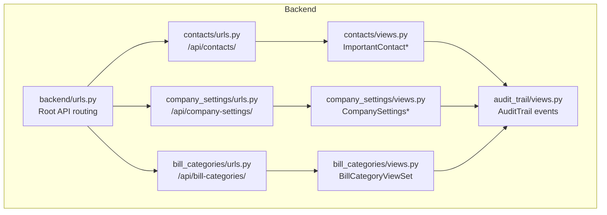
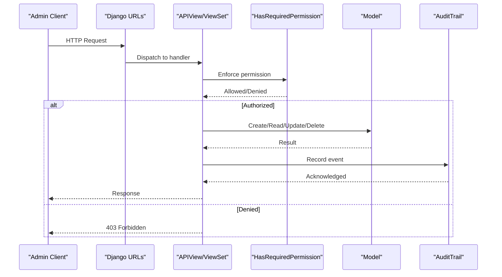
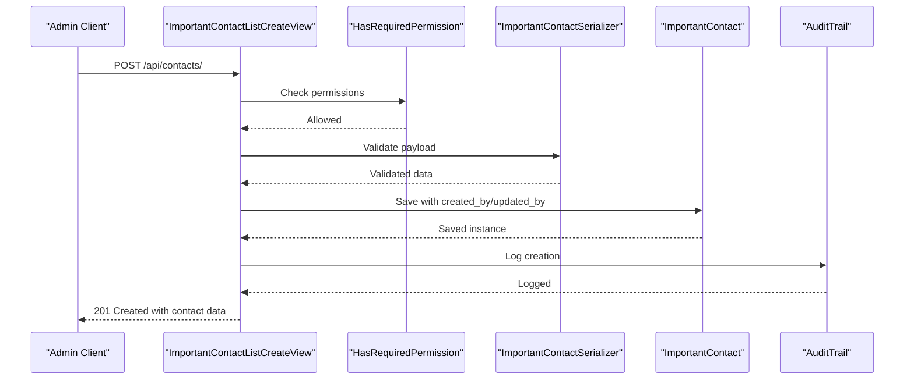
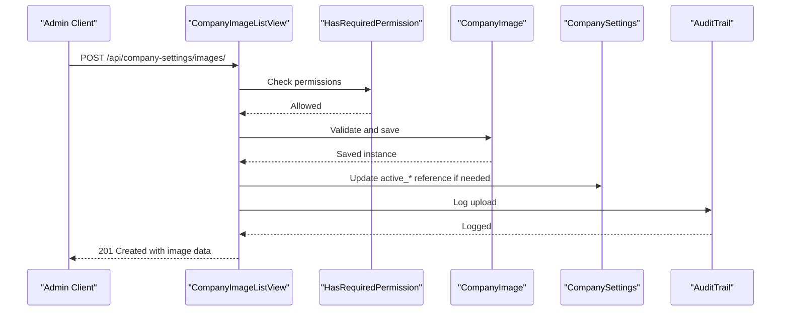
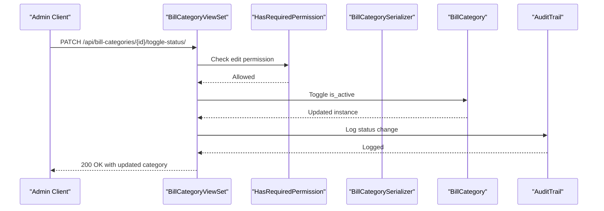
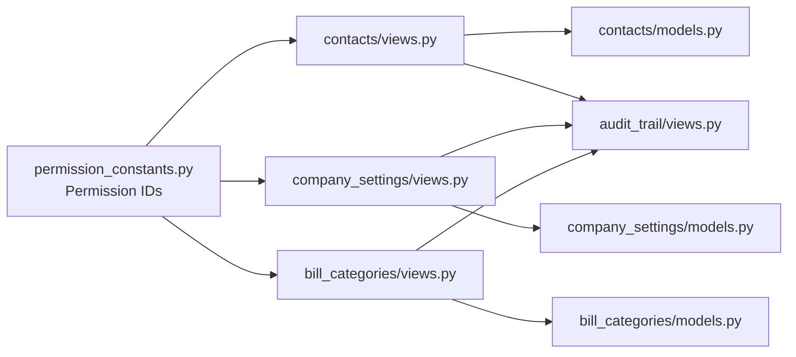

# Administrative & Utility API

<cite>
**Referenced Files in This Document**
- [backend/urls.py](file://backend/backend/urls.py)
- [contacts/urls.py](file://backend/contacts/urls.py)
- [company_settings/urls.py](file://backend/company_settings/urls.py)
- [bill_categories/urls.py](file://backend/bill_categories/urls.py)
- [permission_constants.py](file://backend/group_role/permission_constants.py)
- [contacts/views.py](file://backend/contacts/views.py)
- [contacts/models.py](file://backend/contacts/models.py)
- [contacts/serializers.py](file://backend/contacts/serializers.py)
- [company_settings/views.py](file://backend/company_settings/views.py)
- [company_settings/models.py](file://backend/company_settings/models.py)
- [company_settings/serializers.py](file://backend/company_settings/serializers.py)
- [bill_categories/views.py](file://backend/bill_categories/views.py)
- [bill_categories/models.py](file://backend/bill_categories/models.py)
- [bill_categories/serializers.py](file://backend/bill_categories/serializers.py)
- [audit_trail/views.py](file://backend/audit_trail/views.py)
- [audit_trail/models.py](file://backend/audit_trail/models.py)
- [user/views_system.py](file://backend/user/views_system.py)
- [user/permissions.py](file://backend/user/permissions.py)
- [frontend/src/api/contactsApi.js](file://frontend/src/api/contactsApi.js)
- [frontend/src/api/companySettingsApi.js](file://frontend/src/api/companySettingsApi.js)
- [frontend/src/api/billCategoriesApi.js](file://frontend/src/api/billCategoriesApi.js)
</cite>

## Table of Contents
1. [Introduction](#introduction)
2. [Project Structure](#project-structure)
3. [Core Components](#core-components)
4. [Architecture Overview](#architecture-overview)
5. [Detailed Component Analysis](#detailed-component-analysis)
6. [Dependency Analysis](#dependency-analysis)
7. [Performance Considerations](#performance-considerations)
8. [Troubleshooting Guide](#troubleshooting-guide)
9. [Conclusion](#conclusion)
10. [Appendices](#appendices)

## Introduction
This document describes administrative and utility APIs for managing important contacts, company branding, and bill categories. It also covers system configuration endpoints, data import utilities, and administrative utilities. The documentation includes endpoint definitions, request/response schemas, validation rules, business constraints, permission requirements, and operational workflows.

## Project Structure
The backend exposes administrative endpoints under the /api/ namespace. The primary modules covered here are:
- Important Contacts: CRUD for important contacts backed by organization members
- Company Settings: Branding configuration and image management
- Bill Categories: CRUD plus status toggling and active listing
- Audit Trail: Event logging for administrative changes
- System Utilities: Administrative endpoints for system configuration and maintenance

**Diagram sources**
- [backend/urls.py](file://backend/backend/urls.py#L36-L55)
- [contacts/urls.py](file://backend/contacts/urls.py#L10-L21)
- [company_settings/urls.py](file://backend/company_settings/urls.py#L10-L16)
- [bill_categories/urls.py](file://backend/bill_categories/urls.py#L6-L9)
- [contacts/views.py](file://backend/contacts/views.py#L18-L126)
- [company_settings/views.py](file://backend/company_settings/views.py#L13-L278)
- [bill_categories/views.py](file://backend/bill_categories/views.py#L18-L269)
- [audit_trail/views.py](file://backend/audit_trail/views.py)

**Section sources**
- [backend/urls.py](file://backend/backend/urls.py#L36-L55)

## Core Components
- Important Contacts: Manage critical organization contacts with strict validation and audit trail.
- Company Settings: Centralized branding configuration with image uploads and activation.
- Bill Categories: Manage service bill categories with status control and active listing.
- Audit Trail: Track administrative changes for compliance and governance.
- System Utilities: Administrative endpoints for system configuration and maintenance.

**Section sources**
- [contacts/views.py](file://backend/contacts/views.py#L18-L126)
- [company_settings/views.py](file://backend/company_settings/views.py#L13-L278)
- [bill_categories/views.py](file://backend/bill_categories/views.py#L18-L269)
- [audit_trail/views.py](file://backend/audit_trail/views.py)

## Architecture Overview
The administrative APIs follow a layered architecture:
- URL routing maps endpoints to views
- Views enforce authentication and permission checks
- Serializers validate and transform data
- Models encapsulate business rules and relationships
- Audit trail captures administrative events

**Diagram sources**
- [backend/urls.py](file://backend/backend/urls.py#L36-L55)
- [user/permissions.py](file://backend/user/permissions.py)
- [permission_constants.py](file://backend/group_role/permission_constants.py#L106-L178)
- [audit_trail/views.py](file://backend/audit_trail/views.py)

## Detailed Component Analysis

### Important Contacts API
Endpoints:
- GET /api/contacts/ — List and optionally filter important contacts
- POST /api/contacts/ — Create an important contact (requires member selection)
- GET /api/contacts/{id}/ — Retrieve a specific contact
- PATCH /api/contacts/{id}/ — Partial update (disabled)
- PUT /api/contacts/{id}/ — Full update (disabled)
- DELETE /api/contacts/{id}/ — Delete a contact

Permissions:
- View: PERMISSION_VIEW_IMPORTANT_CONTACTS
- Add: PERMISSION_ADD_IMPORTANT_CONTACTS
- Edit: PERMISSION_EDIT_IMPORTANT_CONTACTS

Constraints:
- Only organization members can be added as important contacts
- Duplicate entries per organization member are prevented
- Update operations are disabled; use delete and re-add if necessary

Request/Response Schemas:
- Creation payload requires org_member (primary key of an organization member)
- Response includes derived fields (name, phone_number, email, designation, photo_url) and audit metadata

Validation Rules:
- org_member must be present and marked as an organization member
- org_member must not already be registered as an important contact
- On create, the requester must be linked to a member record

Operational Notes:
- Frontend supports multipart/form-data for photo uploads when applicable

**Diagram sources**
- [contacts/views.py](file://backend/contacts/views.py#L18-L74)
- [contacts/serializers.py](file://backend/contacts/serializers.py#L7-L124)
- [contacts/models.py](file://backend/contacts/models.py#L7-L51)
- [audit_trail/views.py](file://backend/audit_trail/views.py)

**Section sources**
- [contacts/urls.py](file://backend/contacts/urls.py#L10-L21)
- [contacts/views.py](file://backend/contacts/views.py#L18-L126)
- [contacts/serializers.py](file://backend/contacts/serializers.py#L7-L124)
- [contacts/models.py](file://backend/contacts/models.py#L7-L95)
- [permission_constants.py](file://backend/group_role/permission_constants.py#L46-L49)
- [frontend/src/api/contactsApi.js](file://frontend/src/api/contactsApi.js#L34-L51)

### Company Settings API
Endpoints:
- GET /api/company-settings/ — Get/update company settings (authenticated)
- GET /api/company-settings/public/ — Get company settings (public)
- GET /api/company-settings/images/ — List company images (optional type filter)
- POST /api/company-settings/images/ — Upload a new company image (auto-replaces same type)
- GET /api/company-settings/images/{id}/ — Get a specific company image
- PUT /api/company-settings/images/{id}/ — Update a company image
- DELETE /api/company-settings/images/{id}/ — Delete a company image
- POST /api/company-settings/images/{id}/set-active/ — Set an image as active logo/login image

Permissions:
- VIEW_COMPANY_SETTINGS for all listed endpoints

Request/Response Schemas:
- CompanySettings: branding fields, active logo/reference, active login image/reference
- CompanyImage: image_type (enum), image file, metadata

Validation Rules:
- Single image policy per type (upload replaces existing)
- Active image references updated automatically upon upload
- Deleting an active image clears the corresponding active reference

Operational Notes:
- Frontend uses multipart/form-data for image uploads
- Public endpoint allows unauthenticated access for login page rendering

**Diagram sources**
- [company_settings/views.py](file://backend/company_settings/views.py#L93-L161)
- [company_settings/models.py](file://backend/company_settings/models.py)
- [company_settings/serializers.py](file://backend/company_settings/serializers.py)
- [audit_trail/views.py](file://backend/audit_trail/views.py)

**Section sources**
- [company_settings/urls.py](file://backend/company_settings/urls.py#L10-L16)
- [company_settings/views.py](file://backend/company_settings/views.py#L13-L278)
- [permission_constants.py](file://backend/group_role/permission_constants.py#L83-L84)
- [frontend/src/api/companySettingsApi.js](file://frontend/src/api/companySettingsApi.js#L61-L72)

### Bill Categories API
Endpoints:
- GET /api/bill-categories/ — List categories (supports is_active filter and search)
- POST /api/bill-categories/ — Create a category
- GET /api/bill-categories/{id}/ — Retrieve a category
- PUT /api/bill-categories/{id}/ — Update a category
- PATCH /api/bill-categories/{id}/ — Partial update a category
- DELETE /api/bill-categories/{id}/ — Delete a category
- PATCH /api/bill-categories/{id}/toggle-status/ — Toggle active status
- GET /api/bill-categories/active/ — List only active categories
- GET /api/bill-categories/choices/ — Enum choices for icons and colors

Permissions:
- View/Add/Edit via granular permissions

Request/Response Schemas:
- Category fields include name, description, icon, color, is_active, timestamps, and audit metadata

Validation Rules:
- Status toggling flips is_active atomically
- Active listing filters by is_active=True
- Choices endpoint returns available icon/color options

**Diagram sources**
- [bill_categories/views.py](file://backend/bill_categories/views.py#L203-L242)
- [bill_categories/serializers.py](file://backend/bill_categories/serializers.py)
- [bill_categories/models.py](file://backend/bill_categories/models.py)
- [audit_trail/views.py](file://backend/audit_trail/views.py)

**Section sources**
- [bill_categories/urls.py](file://backend/bill_categories/urls.py#L6-L9)
- [bill_categories/views.py](file://backend/bill_categories/views.py#L18-L269)
- [permission_constants.py](file://backend/group_role/permission_constants.py#L86-L89)
- [frontend/src/api/billCategoriesApi.js](file://frontend/src/api/billCategoriesApi.js#L30-L33)

### Audit Trail API
Endpoints:
- Events logged for administrative changes across modules (company settings, company images, bill categories, important contacts)
- Events capture old/new data snapshots and actor context

Operational Notes:
- Audit trail creation is attempted during updates/deletes and is resilient to failures

**Section sources**
- [audit_trail/views.py](file://backend/audit_trail/views.py)
- [audit_trail/models.py](file://backend/audit_trail/models.py)

### System Configuration and Administrative Utilities
- System configuration endpoints reside under the user app and support administrative tasks
- These endpoints are intended for system-level operations and maintenance

**Section sources**
- [user/views_system.py](file://backend/user/views_system.py)

## Dependency Analysis
Key dependencies and relationships:
- Permission enforcement relies on centralized constants and the HasRequiredPermission class
- Views depend on serializers for validation and on models for business rules
- Audit trail integrates across modules to maintain compliance

**Diagram sources**
- [permission_constants.py](file://backend/group_role/permission_constants.py#L106-L178)
- [contacts/views.py](file://backend/contacts/views.py#L18-L126)
- [company_settings/views.py](file://backend/company_settings/views.py#L13-L278)
- [bill_categories/views.py](file://backend/bill_categories/views.py#L18-L269)
- [contacts/models.py](file://backend/contacts/models.py#L7-L95)
- [company_settings/models.py](file://backend/company_settings/models.py)
- [bill_categories/models.py](file://backend/bill_categories/models.py)
- [audit_trail/views.py](file://backend/audit_trail/views.py)

**Section sources**
- [permission_constants.py](file://backend/group_role/permission_constants.py#L106-L178)
- [user/permissions.py](file://backend/user/permissions.py)

## Performance Considerations
- Use select_related in list views to minimize database queries
- Prefer lightweight serializers for list endpoints to reduce payload size
- Apply filters (e.g., is_active, search) server-side to limit result sets
- Batch operations should leverage atomic transactions where appropriate

## Troubleshooting Guide
Common issues and resolutions:
- Permission denied: Ensure the user possesses the required permission IDs for the target operation
- Validation errors on creation: Confirm org_member is an organization member and not already added
- Update disabled: Updates are intentionally disabled for important contacts; delete and re-add if necessary
- Image upload replacement: Uploading a new image of the same type replaces the existing one; active references are updated accordingly
- Audit trail failures: Logging failures do not block operations; check logs for details

**Section sources**
- [contacts/views.py](file://backend/contacts/views.py#L42-L63)
- [company_settings/views.py](file://backend/company_settings/views.py#L115-L136)
- [bill_categories/views.py](file://backend/bill_categories/views.py#L203-L242)
- [audit_trail/views.py](file://backend/audit_trail/views.py)

## Conclusion
The administrative and utility APIs provide robust controls for managing important contacts, company branding, and bill categories. They enforce strict permissions, apply comprehensive validation, and maintain an audit trail for governance. Administrators can rely on these endpoints for system configuration, data imports, and maintenance procedures while adhering to business constraints and data governance policies.

## Appendices

### Endpoint Reference Summary
- Important Contacts
  - GET /api/contacts/ — List
  - POST /api/contacts/ — Create
  - GET /api/contacts/{id}/ — Retrieve
  - PATCH /api/contacts/{id}/ — Partial update (disabled)
  - PUT /api/contacts/{id}/ — Full update (disabled)
  - DELETE /api/contacts/{id}/ — Delete

- Company Settings
  - GET /api/company-settings/ — Get/update settings
  - GET /api/company-settings/public/ — Public settings
  - GET /api/company-settings/images/ — List images
  - POST /api/company-settings/images/ — Upload image
  - GET /api/company-settings/images/{id}/ — Retrieve image
  - PUT /api/company-settings/images/{id}/ — Update image
  - DELETE /api/company-settings/images/{id}/ — Delete image
  - POST /api/company-settings/images/{id}/set-active/ — Set active image

- Bill Categories
  - GET /api/bill-categories/ — List (filters supported)
  - POST /api/bill-categories/ — Create
  - GET /api/bill-categories/{id}/ — Retrieve
  - PUT /api/bill-categories/{id}/ — Update
  - PATCH /api/bill-categories/{id}/ — Partial update
  - DELETE /api/bill-categories/{id}/ — Delete
  - PATCH /api/bill-categories/{id}/toggle-status/ — Toggle status
  - GET /api/bill-categories/active/ — Active list
  - GET /api/bill-categories/choices/ — Icon/color choices

- System Configuration
  - Endpoints under user app for administrative tasks

**Section sources**
- [backend/urls.py](file://backend/backend/urls.py#L39-L51)
- [contacts/urls.py](file://backend/contacts/urls.py#L10-L21)
- [company_settings/urls.py](file://backend/company_settings/urls.py#L10-L16)
- [bill_categories/urls.py](file://backend/bill_categories/urls.py#L6-L9)
- [user/views_system.py](file://backend/user/views_system.py)