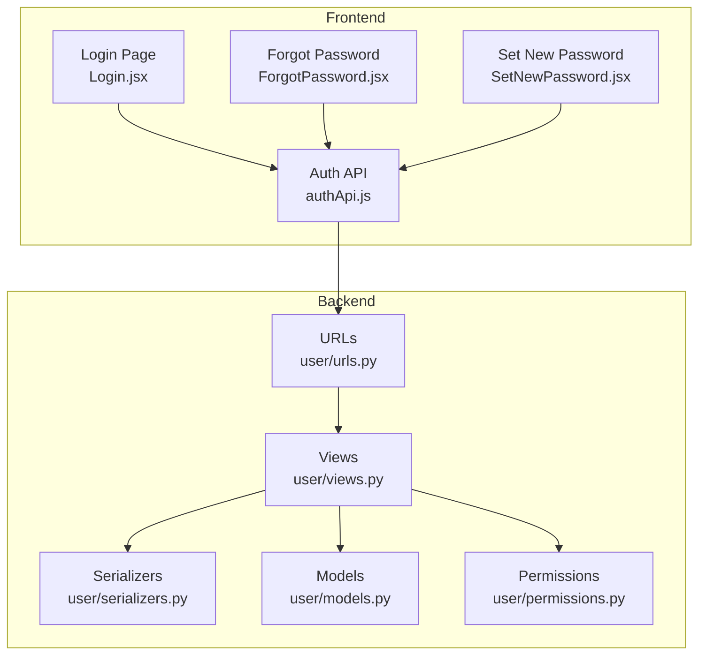
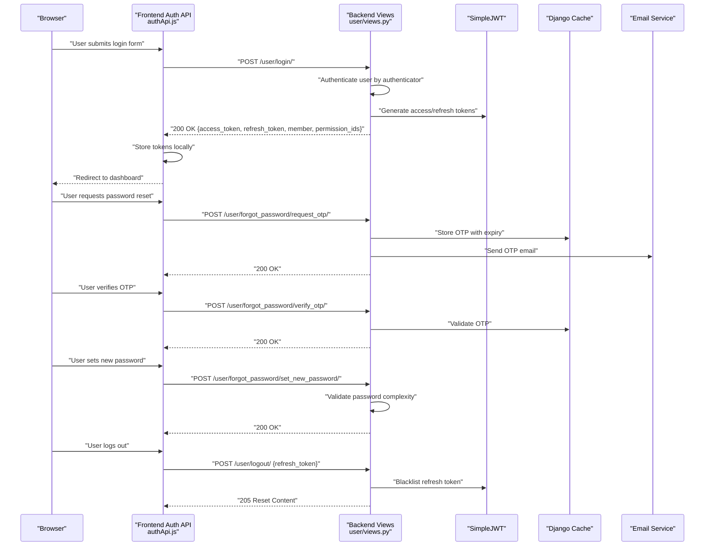
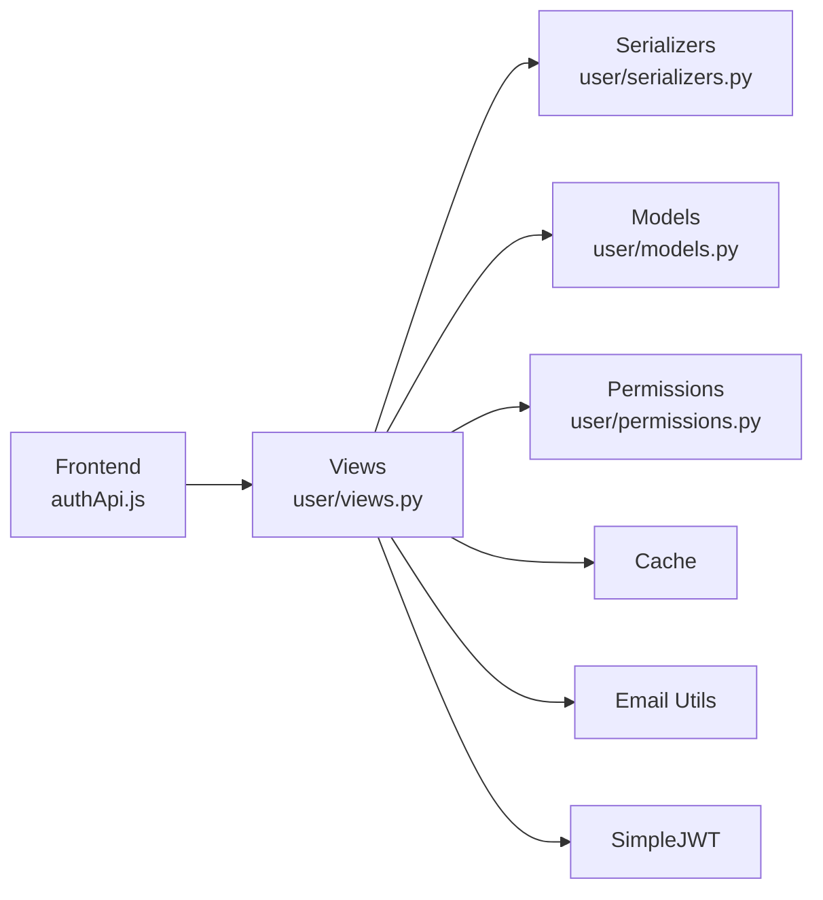

# Authentication & User Management API

<cite>
**Referenced Files in This Document**
- [backend/user/urls.py](file://backend/user/urls.py)
- [backend/user/views.py](file://backend/user/views.py)
- [backend/user/serializers.py](file://backend/user/serializers.py)
- [backend/user/models.py](file://backend/user/models.py)
- [backend/user/permissions.py](file://backend/user/permissions.py)
- [frontend/src/api/authApi/authApi.js](file://frontend/src/api/authApi/authApi.js)
- [frontend/src/Authentication/Login/Login.jsx](file://frontend/src/Authentication/Login/Login.jsx)
- [frontend/src/Authentication/ForgotPassword/ForgotPassword.jsx](file://frontend/src/Authentication/ForgotPassword/ForgotPassword.jsx)
- [frontend/src/Authentication/SetNewPassword/SetNewPassword.jsx](file://frontend/src/Authentication/SetNewPassword/SetNewPassword.jsx)
</cite>

## Table of Contents
1. [Introduction](#introduction)
2. [Project Structure](#project-structure)
3. [Core Components](#core-components)
4. [Architecture Overview](#architecture-overview)
5. [Detailed Component Analysis](#detailed-component-analysis)
6. [Dependency Analysis](#dependency-analysis)
7. [Performance Considerations](#performance-considerations)
8. [Troubleshooting Guide](#troubleshooting-guide)
9. [Conclusion](#conclusion)

## Introduction
This document provides comprehensive API documentation for authentication and user management endpoints in the EstateLink platform. It covers login/logout, password reset functionality, user registration, profile management, and permission-based access control. It also details JWT token handling, session management, role-based authorization patterns, request/response schemas, security measures, rate limiting, error handling strategies, and practical examples of authenticated requests.

## Project Structure
The authentication and user management system spans the backend Django REST framework and the frontend React application:
- Backend endpoints are defined under `/user` and include authentication, password reset, user registration, member management, and profile operations.
- Frontend integrates with the backend via Axios-based API actions and Redux slices for state management.

**Diagram sources**
- [backend/user/urls.py](file://backend/user/urls.py#L11-L72)
- [backend/user/views.py](file://backend/user/views.py#L603-L732)
- [backend/user/serializers.py](file://backend/user/serializers.py#L107-L123)
- [backend/user/models.py](file://backend/user/models.py#L15-L51)
- [backend/user/permissions.py](file://backend/user/permissions.py#L7-L76)
- [frontend/src/api/authApi/authApi.js](file://frontend/src/api/authApi/authApi.js#L18-L49)

**Section sources**
- [backend/user/urls.py](file://backend/user/urls.py#L11-L72)
- [frontend/src/api/authApi/authApi.js](file://frontend/src/api/authApi/authApi.js#L18-L49)

## Core Components
- Authentication endpoints: login, logout, token refresh, password reset (request OTP, verify OTP, resend OTP, set new password), and status checks.
- User registration and member management: create member, update member, member lists, and member details.
- Profile management: current user’s profile retrieval and updates.
- Permission-based access control: central permission checker and role-based authorization.
- JWT token handling: access and refresh tokens with blacklist on logout.

Key backend endpoints:
- POST /user/login/
- POST /user/logout/
- POST /user/token/refresh/
- POST /user/check_status/
- POST /user/set_password/
- POST /user/forgot_password/request_otp/
- POST /user/forgot_password/verify_otp/
- POST /user/forgot_password/resend_otp/
- POST /user/forgot_password/set_new_password/
- GET /user/my_profile/
- PUT /user/my_profile/
- GET /user/my_permissions/
- GET /user/cental_permission_checker/

**Section sources**
- [backend/user/urls.py](file://backend/user/urls.py#L14-L28)
- [backend/user/urls.py](file://backend/user/urls.py#L51-L52)
- [backend/user/urls.py](file://backend/user/urls.py#L61-L61)

## Architecture Overview
The authentication flow integrates frontend UI components with backend views and serializers, using Django REST framework and SimpleJWT for token management. Authorization leverages custom permission classes and role-permission mapping.

**Diagram sources**
- [frontend/src/api/authApi/authApi.js](file://frontend/src/api/authApi/authApi.js#L21-L49)
- [backend/user/views.py](file://backend/user/views.py#L603-L658)
- [backend/user/views.py](file://backend/user/views.py#L740-L782)
- [backend/user/views.py](file://backend/user/views.py#L786-L813)
- [backend/user/views.py](file://backend/user/views.py#L866-L915)
- [backend/user/views.py](file://backend/user/views.py#L817-L862)
- [backend/user/views.py](file://backend/user/views.py#L716-L731)

## Detailed Component Analysis

### Authentication Endpoints

#### Login
- Endpoint: POST /user/login/
- Purpose: Authenticate user by username, email, or phone number; supports organization or community login types.
- Request body:
  - authenticator: string (username, email, or phone number)
  - password: string
  - login_type: string ("org" or "comm")
- Response (success):
  - message: string
  - access_token: string
  - refresh_token: string
  - member: object (serialized Member)
  - permission_ids: array<number>
- Response (failure):
  - error: string or 400/403/404 depending on failure reason

Behavior highlights:
- Supports multiple authenticator types and membership types.
- Returns redirect-like behavior for first-time login requiring password change.

**Section sources**
- [backend/user/urls.py](file://backend/user/urls.py#L14-L14)
- [backend/user/views.py](file://backend/user/views.py#L603-L658)

#### Logout
- Endpoint: POST /user/logout/
- Purpose: Invalidate refresh token on logout.
- Request body:
  - refresh_token: string
- Response (success): 205 Reset Content
- Response (failure): 400 Bad Request with error details

Security note:
- Uses SimpleJWT RefreshToken blacklisting to invalidate sessions server-side.

**Section sources**
- [backend/user/urls.py](file://backend/user/urls.py#L15-L15)
- [backend/user/views.py](file://backend/user/views.py#L716-L731)

#### Token Refresh
- Endpoint: POST /user/token/refresh/
- Purpose: Obtain a new access token using a valid refresh token.
- Request body:
  - refresh: string
- Response (success): 200 OK with new access token
- Response (failure): 400 Bad Request

**Section sources**
- [backend/user/urls.py](file://backend/user/urls.py#L16-L16)

#### Check Status (First-time Login)
- Endpoint: POST /user/check_status/
- Purpose: Determine if a user needs to set a new password on first login.
- Request body:
  - authenticator: string
- Response (success):
  - is_first_login: boolean
  - user_id: number
  - is_comm_member: boolean
  - is_org_member: boolean
- Response (failure): 404 Not Found or error message

**Section sources**
- [backend/user/urls.py](file://backend/user/urls.py#L22-L22)
- [backend/user/views.py](file://backend/user/views.py#L685-L712)

#### Set Password (First-time Users)
- Endpoint: POST /user/set_password/
- Purpose: Set a new password for first-time login.
- Request body:
  - user_id: number
  - new_password: string
  - old_password: string
  - confirm_password: string
- Response (success): 200 OK with success message
- Response (failure): 400 Bad Request with validation errors

Validation:
- Password complexity enforced (length, uppercase, lowercase, digit, special character).
- Old password verification against stored hash.

**Section sources**
- [backend/user/urls.py](file://backend/user/urls.py#L21-L21)
- [backend/user/views.py](file://backend/user/views.py#L662-L681)
- [backend/user/serializers.py](file://backend/user/serializers.py#L858-L883)

#### Password Reset Workflow

##### Request OTP
- Endpoint: POST /user/forgot_password/request_otp/
- Purpose: Send OTP to registered email for password reset.
- Request body:
  - email: string
- Response (success): 200 OK with message
- Response (failure): 400/404 Bad Request

OTP storage:
- Stored in cache with validity period and resend limits.

**Section sources**
- [backend/user/urls.py](file://backend/user/urls.py#L25-L25)
- [backend/user/views.py](file://backend/user/views.py#L740-L782)

##### Verify OTP
- Endpoint: POST /user/forgot_password/verify_otp/
- Purpose: Validate OTP and allow proceeding to reset password.
- Request body:
  - email: string
  - otp: string
- Response (success): 200 OK with message
- Response (failure): 400 Bad Request

**Section sources**
- [backend/user/urls.py](file://backend/user/urls.py#L26-L26)
- [backend/user/views.py](file://backend/user/views.py#L786-L813)

##### Resend OTP
- Endpoint: POST /user/forgot_password/resend_otp/
- Purpose: Resend OTP with rate limiting.
- Request body:
  - email: string
- Response (success): 200 OK with message
- Response (failure): 400/429 Bad Request

Rate limiting:
- Maximum resend attempts and lockout window enforced.

**Section sources**
- [backend/user/urls.py](file://backend/user/urls.py#L28-L28)
- [backend/user/views.py](file://backend/user/views.py#L866-L915)

##### Set New Password
- Endpoint: POST /user/forgot_password/set_new_password/
- Purpose: Set new password after OTP verification.
- Request body:
  - email: string
  - new_password: string
- Response (success): 200 OK with success message
- Response (failure): 400/404 Bad Request

Validation:
- Enforces same password complexity rules as first-time password setting.

**Section sources**
- [backend/user/urls.py](file://backend/user/urls.py#L27-L27)
- [backend/user/views.py](file://backend/user/views.py#L817-L862)

### User Registration and Member Management

#### Create Member
- Endpoint: POST /user/create_member/
- Purpose: Register a new member; supports existing member reuse and login credentials assignment.
- Request body: Member fields (e.g., full_name, general_email, general_contact, delivery_method, etc.)
- Response (success): 201 Created or 200 OK depending on reuse
- Response (failure): 400 Bad Request with validation errors

Notes:
- Validates uniqueness of email/contact and NID.
- Supports assigning login credentials via email or phone.

**Section sources**
- [backend/user/urls.py](file://backend/user/urls.py#L35-L35)
- [backend/user/views.py](file://backend/user/views.py#L345-L441)

#### Create Member for Unit
- Endpoint: POST /user/create_member_for_unit/
- Purpose: Register a community member for a specific unit.
- Request body: Member fields plus unit context
- Response (success): 201 Created or 200 OK
- Response (failure): 400 Bad Request

**Section sources**
- [backend/user/urls.py](file://backend/user/urls.py#L36-L36)
- [backend/user/views.py](file://backend/user/views.py#L443-L551)

#### Member Lists and Details
- GET /user/member_list/
- GET /user/member_list_search_sort/
- GET /user/member_details/{id}/
- GET /user/update_member/{id}/
- POST /user/change_member_status/{id}/

Authorization:
- Require IsAuthenticated and HasRequiredPermission with specific permission IDs.

**Section sources**
- [backend/user/urls.py](file://backend/user/urls.py#L37-L43)
- [backend/user/views.py](file://backend/user/views.py#L100-L130)
- [backend/user/views.py](file://backend/user/views.py#L168-L203)
- [backend/user/views.py](file://backend/user/views.py#L206-L234)
- [backend/user/views.py](file://backend/user/views.py#L236-L279)

#### Member Type List
- GET /user/member_type_list/
- Response: Array of member types

**Section sources**
- [backend/user/urls.py](file://backend/user/urls.py#L45-L45)
- [backend/user/views.py](file://backend/user/views.py#L89-L95)

### Profile Management

#### Current User Profile
- GET /user/my_profile/
- PUT /user/my_profile/
- Purpose: Retrieve and update current user’s profile; enforces uniqueness constraints for NID and login credentials.
- Response (GET): Serialized member and related ownership/residency/staff records
- Response (PUT): Updated serialized member data

**Section sources**
- [backend/user/urls.py](file://backend/user/urls.py#L51-L52)
- [backend/user/views.py](file://backend/user/views.py#L1424-L1516)

#### User Permissions
- GET /user/my_permissions/
- Purpose: Return current user’s permission IDs for frontend caching.

**Section sources**
- [backend/user/urls.py](file://backend/user/urls.py#L52-L52)
- [backend/user/views.py](file://backend/user/views.py#L1572-L1586)

### Permission-Based Access Control

#### Central Permission Checker
- GET /user/cental_permission_checker/?permission_id={id}&type_of_member={org|comm}
- Purpose: Validate if the authenticated user has a specific permission for a given membership type.
- Response (success): 200 OK
- Response (missing type/permission): 404 Not Found
- Response (unauthorized): 401 Unauthorized
- Response (forbidden): 403 Forbidden

Authorization logic:
- Community members can access without permission checks.
- Organization-only members require permission validation.

**Section sources**
- [backend/user/urls.py](file://backend/user/urls.py#L17-L17)
- [backend/user/views.py](file://backend/user/views.py#L60-L78)
- [backend/user/permissions.py](file://backend/user/permissions.py#L7-L76)

#### Role-Based Authorization
- Custom permission class checks:
  - Membership flags (is_comm_member, is_org_member)
  - Required permission IDs mapped from roles
  - Self-profile access bypass for detail views

**Section sources**
- [backend/user/permissions.py](file://backend/user/permissions.py#L7-L76)

### JWT Token Handling and Session Management
- Access tokens are issued upon successful login.
- Refresh tokens are used to obtain new access tokens.
- Logout invalidates refresh tokens via blacklisting.
- Token refresh endpoint provided by SimpleJWT.

Frontend integration:
- Tokens stored locally; login action dispatches Redux and navigates to dashboard.

**Section sources**
- [backend/user/views.py](file://backend/user/views.py#L638-L651)
- [backend/user/views.py](file://backend/user/views.py#L716-L731)
- [frontend/src/api/authApi/authApi.js](file://frontend/src/api/authApi/authApi.js#L21-L49)

### Request/Response Schemas

#### Login Request
- authenticator: string
- password: string
- login_type: "org" | "comm"

#### Login Response
- message: string
- access_token: string
- refresh_token: string
- member: Member object
- permission_ids: number[]

#### Check Status Response
- is_first_login: boolean
- user_id: number
- is_comm_member: boolean
- is_org_member: boolean

#### Set Password Request
- user_id: number
- new_password: string
- old_password: string
- confirm_password: string

#### Password Reset OTP Flow
- Request OTP: email (string)
- Verify OTP: email (string), otp (string)
- Resend OTP: email (string)
- Set New Password: email (string), new_password (string)

**Section sources**
- [backend/user/views.py](file://backend/user/views.py#L603-L658)
- [backend/user/views.py](file://backend/user/views.py#L685-L712)
- [backend/user/views.py](file://backend/user/views.py#L740-L782)
- [backend/user/views.py](file://backend/user/views.py#L786-L813)
- [backend/user/views.py](file://backend/user/views.py#L866-L915)
- [backend/user/views.py](file://backend/user/views.py#L817-L862)
- [backend/user/serializers.py](file://backend/user/serializers.py#L858-L883)

### Security Measures and Rate Limiting
- OTP validity period and resend limits enforced via cache.
- Rate limiting for OTP resend attempts.
- Password complexity enforced for both first-time and reset flows.
- Token blacklisting on logout.
- Unique constraints on login credentials and NID.
- Permission-based access control for protected endpoints.

**Section sources**
- [backend/user/views.py](file://backend/user/views.py#L734-L738)
- [backend/user/views.py](file://backend/user/views.py#L866-L915)
- [backend/user/views.py](file://backend/user/views.py#L817-L862)
- [backend/user/permissions.py](file://backend/user/permissions.py#L7-L76)

### Examples of Authenticated Requests

#### Successful Login
- Frontend dispatches loginUser with authenticator, password, and login_type.
- Backend responds with tokens and user data.
- Frontend stores tokens and navigates to dashboard.

**Section sources**
- [frontend/src/api/authApi/authApi.js](file://frontend/src/api/authApi/authApi.js#L21-L49)
- [frontend/src/Authentication/Login/Login.jsx](file://frontend/src/Authentication/Login/Login.jsx#L200-L233)

#### Password Reset Flow
- Request OTP: submit email → verify OTP → set new password → success message.

**Section sources**
- [frontend/src/Authentication/ForgotPassword/ForgotPassword.jsx](file://frontend/src/Authentication/ForgotPassword/ForgotPassword.jsx#L40-L78)
- [frontend/src/Authentication/SetNewPassword/SetNewPassword.jsx](file://frontend/src/Authentication/SetNewPassword/SetNewPassword.jsx#L76-L105)

## Dependency Analysis
The authentication system depends on:
- Django REST framework for API views and serializers.
- SimpleJWT for token generation and refresh.
- Django cache for OTP storage and rate limiting.
- Email utilities for sending OTP and credential emails.
- Custom permission classes for role-based access control.

**Diagram sources**
- [frontend/src/api/authApi/authApi.js](file://frontend/src/api/authApi/authApi.js#L18-L49)
- [backend/user/views.py](file://backend/user/views.py#L603-L658)
- [backend/user/serializers.py](file://backend/user/serializers.py#L107-L123)
- [backend/user/models.py](file://backend/user/models.py#L15-L51)
- [backend/user/permissions.py](file://backend/user/permissions.py#L7-L76)

**Section sources**
- [backend/user/views.py](file://backend/user/views.py#L603-L658)
- [backend/user/permissions.py](file://backend/user/permissions.py#L7-L76)

## Performance Considerations
- Use pagination for member lists and search endpoints.
- Cache frequently accessed permission IDs per user session.
- Minimize database queries by selecting related fields efficiently.
- Compress images for profile uploads and maintain low-resolution thumbnails.

## Troubleshooting Guide
Common issues and resolutions:
- Invalid credentials on login: verify authenticator and password; ensure membership flags align with login_type.
- OTP expired or invalid: request a new OTP; check resend limits.
- Password complexity errors: ensure new password meets minimum requirements.
- Permission denied: confirm membership type and required permission IDs.
- Logout failures: ensure refresh token is present and valid.

**Section sources**
- [backend/user/views.py](file://backend/user/views.py#L656-L658)
- [backend/user/views.py](file://backend/user/views.py#L800-L813)
- [backend/user/views.py](file://backend/user/views.py#L817-L862)
- [backend/user/views.py](file://backend/user/views.py#L60-L78)

## Conclusion
The authentication and user management system provides robust, secure, and flexible APIs for login, logout, password reset, user registration, profile management, and permission-based access control. With JWT token handling, OTP-based password reset, and role-based authorization, it supports both organizational and community member workflows while maintaining strong security and usability.