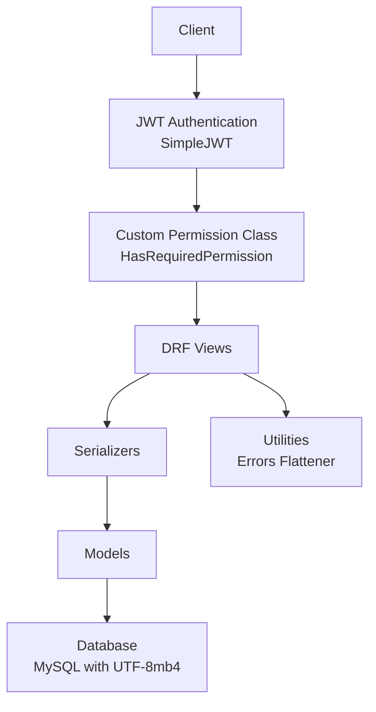
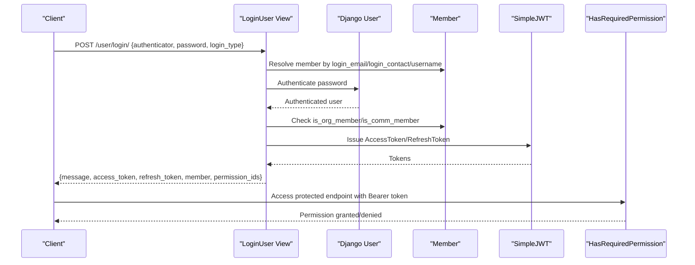
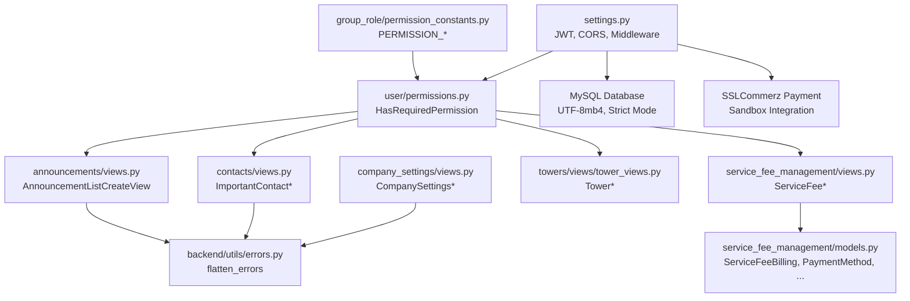

# Backend API Documentation

<cite>
**Referenced Files in This Document**
- [backend/settings.py](file://backend/backend/settings.py)
- [backend/urls.py](file://backend/backend/urls.py)
- [user/views.py](file://backend/user/views.py)
- [user/permissions.py](file://backend/user/permissions.py)
- [group_role/permission_constants.py](file://backend/group_role/permission_constants.py)
- [announcements/views.py](file://backend/announcements/views.py)
- [contacts/views.py](file://backend/contacts/views.py)
- [company_settings/views.py](file://backend/company_settings/views.py)
- [towers/views/tower_views.py](file://backend/towers/views/tower_views.py)
- [service_fee_management/views.py](file://backend/service_fee_management/views.py)
- [service_fee_management/models.py](file://backend/service_fee_management/models.py)
- [backend/utils/errors.py](file://backend/backend/utils/errors.py)
</cite>

## Update Summary
**Changes Made**
- Updated Django settings configuration documentation to reflect ALLOWED_HOSTS modifications for multi-environment deployment
- Added database configuration details for MySQL setup with connection pooling and charset settings
- Enhanced CORS configuration documentation with broad origin support
- Updated environment variable loading mechanism documentation
- Added SSLCommerz payment gateway configuration details
- Expanded email backend configuration documentation

## Table of Contents
1. [Introduction](#introduction)
2. [Project Structure](#project-structure)
3. [Core Components](#core-components)
4. [Architecture Overview](#architecture-overview)
5. [Detailed Component Analysis](#detailed-component-analysis)
6. [Dependency Analysis](#dependency-analysis)
7. [Performance Considerations](#performance-considerations)
8. [Troubleshooting Guide](#troubleshooting-guide)
9. [Conclusion](#conclusion)
10. [Appendices](#appendices)

## Introduction
This document provides comprehensive API documentation for the Django REST Framework backend. It covers authentication and authorization, endpoint categories (user management, property management, communication portal, financial management, administrative functions), request/response schemas, filtering and pagination, CORS and security headers, and testing approaches. The backend uses JWT authentication via SimpleJWT and role-based permissions enforced by a custom permission class.

**Updated** Enhanced with detailed Django settings configuration including multi-host ALLOWED_HOSTS, MySQL database setup, SSLCommerz payment integration, and comprehensive CORS configuration.

## Project Structure
The backend exposes REST endpoints under a modular URL scheme. The root URL configuration includes dedicated namespaces for each functional area, enabling clear separation of concerns.

```mermaid
graph TB
Root["Root URLConf<br/>backend/backend/urls.py"]
Admin["Admin Site<br/>/admin"]
UserApp["User Module<br/>/user/"]
GroupRoleApp["Group & Role Module<br/>/group_role/"]
TowersApp["Towers Module<br/>/towers/"]
AnnouncementsAPI["Announcements API<br/>/api/..."]
BulletinsAPI["Bulletins API<br/>/api/..."]
NoticeboardAPI["Noticeboard API<br/>/api/noticeboard/"]
ServiceFeesAPI["Service Fees API<br/>/api/service-fees/"]
ServiceFeeManagementAPI["Service Fee Management API<br/>/api/service-fee-management/"]
ContactsAPI["Contacts API<br/>/api/contacts/"]
CompanySettingsAPI["Company Settings API<br/>/api/company-settings/"]
BillCategoriesAPI["Bill Categories API<br/>/api/..."]
AccountsAPI["Accounts API<br/>/api/accounts/"]
NotificationsAPI["Notifications API<br/>/api/notifications/"]
Root --> Admin
Root --> UserApp
Root --> GroupRoleApp
Root --> TowersApp
Root --> AnnouncementsAPI
Root --> BulletinsAPI
Root --> NoticeboardAPI
Root --> ServiceFeesAPI
Root --> ServiceFeeManagementAPI
Root --> ContactsAPI
Root --> CompanySettingsAPI
Root --> BillCategoriesAPI
Root --> AccountsAPI
Root --> NotificationsAPI
```

**Diagram sources**
- [backend/urls.py](file://backend/backend/urls.py#L36-L55)

**Section sources**
- [backend/urls.py](file://backend/backend/urls.py#L36-L55)

## Core Components
- Authentication and Authorization
  - JWT-based authentication using SimpleJWT with access and refresh tokens.
  - Custom permission class enforcing role-based access control and community member privileges.
  - Permission constants centralized for granular control across modules.

- CORS and Security Headers
  - CORS enabled with credentials allowed and broad origins permitted.
  - Security middleware configured for CSRF, clickjacking protection, and session handling.

- Pagination and Filtering
  - Pagination implemented for announcements with configurable page size.
  - Filtering and search supported via query parameters across multiple endpoints.

- Error Handling
  - Utility to flatten DRF serializer errors into a single message string.

- Database Configuration
  - MySQL database configured with UTF-8mb4 charset and strict SQL mode.
  - Connection pooling and character set optimization for internationalization support.

**Updated** Enhanced database configuration with MySQL settings, SSLCommerz payment gateway integration, and comprehensive CORS setup.

**Section sources**
- [backend/settings.py](file://backend/backend/settings.py#L79-L138)
- [user/permissions.py](file://backend/user/permissions.py#L7-L76)
- [group_role/permission_constants.py](file://backend/group_role/permission_constants.py#L9-L178)
- [announcements/views.py](file://backend/announcements/views.py#L35-L134)
- [backend/utils/errors.py](file://backend/backend/utils/errors.py#L1-L16)

## Architecture Overview
The backend follows a layered architecture:
- URL routing delegates to app-specific URL patterns.
- Views implement API logic with permission checks.
- Serializers handle request/response marshalling.
- Models encapsulate data and relationships.
- Utilities centralize cross-cutting concerns like error flattening.

**Diagram sources**
- [backend/settings.py](file://backend/backend/settings.py#L94-L138)
- [user/permissions.py](file://backend/user/permissions.py#L7-L76)
- [backend/utils/errors.py](file://backend/backend/utils/errors.py#L1-L16)

## Detailed Component Analysis

### Authentication and User Management
Endpoints for login, logout, password reset, profile management, and member administration.

- Authentication Flow
  - Login: Accepts authenticator (email/phone/username), password, and login_type (org/comm). Validates credentials and membership type, returns access and refresh tokens along with member details and permission IDs.
  - Logout: Expects refresh token; blacklists it.
  - Password Reset (OTP-based): Request OTP, verify OTP, resend OTP, set new password. OTP stored in cache with validity and rate limits.

- Profile and Permissions
  - MyProfile: GET/PUT current user's profile; PUT enforces uniqueness constraints for NID and delivery method.
  - MyPermissions: Returns current user's permission IDs.
  - Accept Terms and Conditions: Records acceptance timestamp and version.
  - Check Terms Status: Returns current acceptance state.
  - Central Permission Checker: Validates if a member has a required permission for a given type (org/comm).

- Member Administration
  - MemberList/Search/Sort: Lists members with filters by type and roles, supports search by name/contact/email/role.
  - MemberDetails: Retrieves member plus associated owners/residents/staff.
  - ChangeMemberStatus: Toggles org/comm membership flags.
  - CreateMember/CreateMemberForUnit: Creates or updates member and sets appropriate flags; validates uniqueness of NID and delivery method.
  - UpdateMember: Updates member with uniqueness checks.
  - CompanyView: Lists companies with optional search; supports creation/update within a transaction with audit trail.

- Request/Response Examples
  - Login request body includes authenticator, password, login_type.
  - Login response includes message, tokens, member data, and permission IDs.
  - Password reset steps require email and OTP; OTP verification returns success; setting new password requires email and new_password.
  - MyProfile PUT accepts member fields; returns updated member data.
  - Central Permission Checker GET requires permission_id and type_of_member query parameters.

- Permissions and Roles
  - Endpoint-level permissions enforced via required_permission_id mapped to centralized constants.
  - Community members bypass permission checks; organization members require matching permission IDs.

- Error Handling
  - Validation errors flattened to a single message string for cleaner client handling.

**Section sources**
- [user/views.py](file://backend/user/views.py#L603-L915)
- [user/views.py](file://backend/user/views.py#L1424-L1587)
- [user/views.py](file://backend/user/views.py#L100-L203)
- [user/views.py](file://backend/user/views.py#L236-L441)
- [user/views.py](file://backend/user/views.py#L443-L551)
- [user/views.py](file://backend/user/views.py#L555-L598)
- [user/views.py](file://backend/user/views.py#L939-L1255)
- [user/permissions.py](file://backend/user/permissions.py#L7-L76)
- [group_role/permission_constants.py](file://backend/group_role/permission_constants.py#L9-L70)
- [backend/utils/errors.py](file://backend/backend/utils/errors.py#L1-L16)

### Property Management
Endpoints for towers and units, including listing, creation, updates, and retrieval.

- Tower Operations
  - GetLastTowerNumber: Returns next available tower number.
  - CreateTower: Creates a new tower with permission checks.
  - TowerList: Returns towers with floors and units pre-fetched to avoid N+1 queries.
  - UpdateTower: Validates unit status and associations before allowing updates.
  - TowerDetails: Retrieves a single tower.
  - DeleteTower: Validates unit status and associations before deletion.

- Unit Operations
  - UnitSideDetails: Retrieves unit details with related floor and tower.
  - UpdateUnit: Updates unit details.

- Request/Response Examples
  - TowerList GET returns paginated and optimized tower data.
  - UpdateTower PUT requires valid unit constraints; returns success or specific error messages.

- Permissions and Roles
  - Tower create/update/view permissions enforced via required_permission_id constants.

**Section sources**
- [towers/views/tower_views.py](file://backend/towers/views/tower_views.py#L18-L200)

### Communication Portal
Endpoints for announcements, bulletins, notices, and important contacts.

- Announcements
  - AnnouncementListCreateView: GET supports filtering by status, priority, label, search, and my_posts; uses optimized select/prefetch; supports pagination; POST creates announcements with attachments and target towers/units.
  - Pagination: Configurable page size with max limit.

- Important Contacts
  - ImportantContactListCreateView: GET lists with related metadata; POST validates org member requirement and permission; creation saves created_by/updated_by.
  - ImportantContactRetrieveUpdateDestroyView: GET/DELETE supported; PUT/PATCH disabled with explicit error.

- Permissions and Roles
  - Announcements: Add/Edit/View permissions enforced.
  - Important Contacts: View/Add/Edit permissions enforced.

- Filtering and Search
  - Announcements: status, priority, label, search, my_posts, limit; optimized queries with select_related/prefetch_related.

**Section sources**
- [announcements/views.py](file://backend/announcements/views.py#L35-L134)
- [announcements/views.py](file://backend/announcements/views.py#L136-L200)
- [contacts/views.py](file://backend/contacts/views.py#L18-L126)

### Financial Management
Endpoints for service fees and payments, including generation schedules, billing, payments, reminders, and bill uploads.

- Service Fee Options
  - ServiceFeeOptionsView: Returns minimal fields for frontend selects with optional is_active and tower_ids filters.

- Tower List for Service Fee Management
  - TowerListOptimizedView: Returns towers with id and name.

- Payment Eligibility and Validation
  - validate_payment_eligibility: Computes remaining amount, total paid, and eligibility for a given unit/service fee/month/year.

- Data Models Overview
  - ServiceFeeBilling: Billing records with amounts, currency, payment method, dates, and audit fields; includes calculated service status and payment percentage.
  - ServiceFeePayment: Payment transactions with status choices and related billing records.
  - PaymentMethod: Available payment methods with display attributes.
  - PenaltyWaiver: Tracks penalty waivers with types and amounts.

- Request/Response Examples
  - ServiceFeeOptionsView GET supports is_active, tower_ids, and ordering; returns id, fee_amount, currency, and tower_names.
  - TowerListOptimizedView GET returns id and name arrays.

- Permissions and Roles
  - Granular permissions for service fee settings, overview, payment recording, schedule configuration, reminders, and generation/delete actions.

**Section sources**
- [service_fee_management/views.py](file://backend/service_fee_management/views.py#L41-L129)
- [service_fee_management/views.py](file://backend/service_fee_management/views.py#L62-L148)
- [service_fee_management/views.py](file://backend/service_fee_management/views.py#L151-L198)
- [service_fee_management/models.py](file://backend/service_fee_management/models.py#L11-L122)
- [service_fee_management/models.py](file://backend/service_fee_management/models.py#L124-L166)
- [service_fee_management/models.py](file://backend/service_fee_management/models.py#L168-L188)
- [service_fee_management/models.py](file://backend/service_fee_management/models.py#L190-L200)
- [group_role/permission_constants.py](file://backend/group_role/permission_constants.py#L53-L71)

### Administrative Functions
Endpoints for company settings and images.

- CompanySettingsView
  - GET returns current company settings.
  - PUT/PATCH updates settings with audit trail creation.

- CompanySettingsPublicView
  - GET returns company settings for public access (no auth).

- CompanyImageListView
  - GET lists images with optional type filter.
  - POST uploads a new image, replaces existing of same type, and updates active references; creates audit trail.

- CompanyImageDetailView
  - GET returns a specific image.
  - PUT updates an image; PATCH not implemented.

- Permissions and Roles
  - VIEW_COMPANY_SETTINGS permission enforced.

**Section sources**
- [company_settings/views.py](file://backend/company_settings/views.py#L13-L200)

### Payment Gateway Integration
The backend integrates with SSLCommerz payment gateway for secure online transactions.

- SSLCommerz Configuration
  - Store ID and Password configured for sandbox/testing environment
  - Session API endpoint for payment initiation
  - Validation API endpoint for payment verification
  - Sandbox mode enabled for development testing

- Payment Processing Workflow
  - Payment initiation through session API
  - Transaction validation via validation API
  - Secure payment processing with token-based authentication

**Section sources**
- [backend/settings.py](file://backend/backend/settings.py#L254-L262)

### Conceptual Overview
The following sequence diagram illustrates the typical user authentication flow.

**Diagram sources**
- [user/views.py](file://backend/user/views.py#L603-L658)
- [user/permissions.py](file://backend/user/permissions.py#L7-L76)
- [backend/settings.py](file://backend/backend/settings.py#L94-L99)

## Dependency Analysis
- Authentication and Authorization
  - JWT settings configured globally; authentication class set to SimpleJWT.
  - Custom permission class integrates with Member model to compute permission IDs and enforce access rules.

- Cross-Cutting Concerns
  - CORS configured broadly with credentials allowed.
  - Error flattening utility simplifies serializer error messages.

- Module Coupling
  - Views depend on serializers and models; permissions rely on centralized constants.
  - Service fee management models reference both service_fee and towers models.

- Database Dependencies
  - MySQL database configured with PyMySQL adapter
  - Database cache backend for shared caching across workers
  - UTF-8mb4 charset for internationalization support

**Diagram sources**
- [backend/settings.py](file://backend/backend/settings.py#L79-L138)
- [user/permissions.py](file://backend/user/permissions.py#L7-L76)
- [group_role/permission_constants.py](file://backend/group_role/permission_constants.py#L9-L178)
- [announcements/views.py](file://backend/announcements/views.py#L44-L134)
- [contacts/views.py](file://backend/contacts/views.py#L18-L126)
- [company_settings/views.py](file://backend/company_settings/views.py#L13-L200)
- [towers/views/tower_views.py](file://backend/towers/views/tower_views.py#L18-L200)
- [service_fee_management/views.py](file://backend/service_fee_management/views.py#L41-L129)
- [service_fee_management/models.py](file://backend/service_fee_management/models.py#L11-L122)
- [backend/utils/errors.py](file://backend/backend/utils/errors.py#L1-L16)

**Section sources**
- [backend/settings.py](file://backend/backend/settings.py#L79-L138)
- [user/permissions.py](file://backend/user/permissions.py#L7-L76)
- [group_role/permission_constants.py](file://backend/group_role/permission_constants.py#L9-L178)
- [announcements/views.py](file://backend/announcements/views.py#L44-L134)
- [contacts/views.py](file://backend/contacts/views.py#L18-L126)
- [company_settings/views.py](file://backend/company_settings/views.py#L13-L200)
- [towers/views/tower_views.py](file://backend/towers/views/tower_views.py#L18-L200)
- [service_fee_management/views.py](file://backend/service_fee_management/views.py#L41-L129)
- [service_fee_management/models.py](file://backend/service_fee_management/models.py#L11-L122)
- [backend/utils/errors.py](file://backend/backend/utils/errors.py#L1-L16)

## Performance Considerations
- Pagination
  - Announcements list uses PageNumberPagination with configurable page_size and max_page_size to limit payload sizes.
- Query Optimization
  - select_related and prefetch_related used in announcements and contacts to avoid N+1 queries.
- Caching
  - OTP stored in cache with combined validity and resend lock timeouts to reduce database load.
- File Upload Limits
  - Increased upload limits to support larger attachments for bulletins.
- Database Optimization
  - MySQL UTF-8mb4 charset with strict SQL mode for data integrity
  - Database cache backend for shared caching across multiple workers

**Updated** Enhanced with database performance optimizations including UTF-8mb4 charset and strict SQL mode configuration.

**Section sources**
- [announcements/views.py](file://backend/announcements/views.py#L35-L134)
- [backend/settings.py](file://backend/backend/settings.py#L251-L256)
- [backend/settings.py](file://backend/backend/settings.py#L167-L180)

## Troubleshooting Guide
- Authentication Failures
  - Ensure Bearer token is included in Authorization header for protected endpoints.
  - Verify login_type matches member's is_org_member/is_comm_member flags.

- Permission Denied
  - Confirm required_permission_id matches user's permission IDs; community members bypass permission checks.

- Validation Errors
  - Use flattened error messages returned by the error utility for concise client-side handling.

- Rate Limits
  - OTP resend attempts are rate-limited; excessive attempts trigger a 429 response.

- Database Connection Issues
  - Verify MySQL server is running and accessible
  - Check database credentials and connection parameters
  - Ensure UTF-8mb4 charset support is available

- CORS Configuration Problems
  - Verify ALLOWED_HOSTS includes the requesting domain/IP
  - Check CORS_ALLOW_ALL_ORIGINS setting for development environments

**Updated** Added troubleshooting guidance for database connections and CORS configuration issues.

**Section sources**
- [user/views.py](file://backend/user/views.py#L603-L658)
- [user/permissions.py](file://backend/user/permissions.py#L7-L76)
- [backend/utils/errors.py](file://backend/backend/utils/errors.py#L1-L16)
- [user/views.py](file://backend/user/views.py#L866-L915)
- [backend/settings.py](file://backend/backend/settings.py#L46-L46)
- [backend/settings.py](file://backend/backend/settings.py#L167-L180)

## Conclusion
The backend provides a robust, permission-driven REST API with clear separation of concerns across modules. JWT authentication, CORS configuration, and optimized queries enable scalable and secure operations. Centralized permission constants and a custom permission class simplify access control enforcement. The documentation above should serve as a comprehensive guide for integrating with the backend across user management, property management, communication portal, financial management, and administrative functions.

**Updated** Enhanced with comprehensive Django settings documentation covering multi-host deployment, MySQL database configuration, SSLCommerz payment integration, and advanced CORS setup for enterprise-scale deployments.

## Appendices

### Authentication Methods
- JWT Bearer tokens
  - Access token lifetime and refresh token lifetime configured.
  - Token rotation and blacklist enabled.

**Section sources**
- [backend/settings.py](file://backend/backend/settings.py#L94-L138)

### CORS Configuration
- Origins allowed with credentials.
- Middleware stack includes CORS.
- Broad origin support for development and production environments.

**Updated** Enhanced CORS configuration supporting multiple deployment environments.

**Section sources**
- [backend/settings.py](file://backend/backend/settings.py#L77-L88)

### Database Configuration
- MySQL database with UTF-8mb4 charset
- Strict SQL mode for data integrity
- Connection pooling and character set optimization
- Database cache backend for shared caching

**Updated** Comprehensive MySQL database setup with internationalization support.

**Section sources**
- [backend/settings.py](file://backend/backend/settings.py#L167-L190)

### Payment Gateway Configuration
- SSLCommerz sandbox integration for testing
- Secure payment processing with token-based authentication
- Production-ready configuration options

**Updated** Added SSLCommerz payment gateway integration documentation.

**Section sources**
- [backend/settings.py](file://backend/backend/settings.py#L254-L262)

### Environment Variable Management
- Optional .env file loading from backend directory
- System environment variables fallback
- Development and production environment support

**Updated** Enhanced environment variable loading mechanism for flexible deployment.

**Section sources**
- [backend/settings.py](file://backend/backend/settings.py#L23-L34)

### Pagination Patterns
- PageNumberPagination with page_size and page_size_query_param for announcements.

**Section sources**
- [announcements/views.py](file://backend/announcements/views.py#L35-L42)

### Filtering Capabilities
- Announcements: status, priority, label, search, my_posts, limit.
- Contacts: created_by/org_member metadata selection.
- Towers: optimized select/prefetch for floors/units.

**Section sources**
- [announcements/views.py](file://backend/announcements/views.py#L82-L127)
- [contacts/views.py](file://backend/contacts/views.py#L35-L40)
- [towers/views/tower_views.py](file://backend/towers/views/tower_views.py#L41-L63)

### API Versioning Strategy
- No explicit version prefix observed in URL patterns; versioning not implemented at the URL level.

**Section sources**
- [backend/urls.py](file://backend/backend/urls.py#L36-L55)

### Rate Limiting
- OTP resend attempts limited with cooldown; cache-based enforcement.

**Section sources**
- [user/views.py](file://backend/user/views.py#L734-L738)
- [user/views.py](file://backend/user/views.py#L866-L915)

### Security Headers
- CSRF, clickjacking protection, and session middleware configured.

**Section sources**
- [backend/settings.py](file://backend/backend/settings.py#L79-L90)

### API Testing Approaches
- Use bearer token in Authorization header for protected endpoints.
- Validate permission IDs via MyPermissions endpoint.
- Test announcements filtering/search via query parameters.
- Validate company settings updates with audit trail verification.
- Test payment gateway integration in sandbox mode.

**Updated** Added payment gateway testing approach for SSLCommerz integration.

**Section sources**
- [user/views.py](file://backend/user/views.py#L1572-L1587)
- [announcements/views.py](file://backend/announcements/views.py#L61-L134)
- [company_settings/views.py](file://backend/company_settings/views.py#L24-L76)
- [backend/settings.py](file://backend/backend/settings.py#L254-L262)

### Multi-Environment Deployment
- ALLOWED_HOSTS configured for multiple IP addresses and domains
- Development, staging, and production host configurations
- Flexible deployment across different network environments

**Updated** Comprehensive multi-environment deployment configuration documentation.

**Section sources**
- [backend/settings.py](file://backend/backend/settings.py#L46-L46)