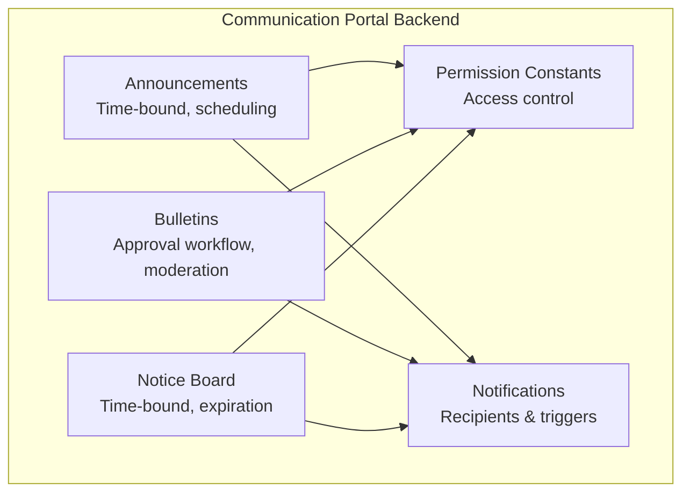
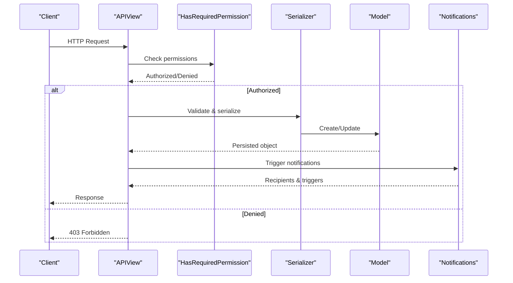
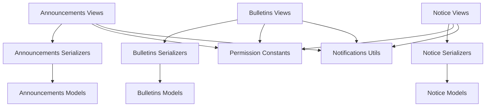

# Communication Portal API

<cite>
**Referenced Files in This Document**
- [announcements/views.py](file://backend/announcements/views.py)
- [announcements/urls.py](file://backend/announcements/urls.py)
- [announcements/models.py](file://backend/announcements/models.py)
- [announcements/serializers.py](file://backend/announcements/serializers.py)
- [bulletins/views.py](file://backend/bulletins/views.py)
- [bulletins/urls.py](file://backend/bulletins/urls.py)
- [bulletins/models.py](file://backend/bulletins/models.py)
- [bulletins/serializers.py](file://backend/bulletins/serializers.py)
- [noticeboard/views.py](file://backend/noticeboard/views.py)
- [noticeboard/urls.py](file://backend/noticeboard/urls.py)
- [noticeboard/models.py](file://backend/noticeboard/models.py)
- [noticeboard/serializers.py](file://backend/noticeboard/serializers.py)
- [group_role/permission_constants.py](file://backend/group_role/permission_constants.py)
- [notifications/utils.py](file://backend/notifications/utils.py)
</cite>

## Table of Contents
1. [Introduction](#introduction)
2. [Project Structure](#project-structure)
3. [Core Components](#core-components)
4. [Architecture Overview](#architecture-overview)
5. [Detailed Component Analysis](#detailed-component-analysis)
6. [Dependency Analysis](#dependency-analysis)
7. [Performance Considerations](#performance-considerations)
8. [Troubleshooting Guide](#troubleshooting-guide)
9. [Conclusion](#conclusion)

## Introduction
This document provides comprehensive API documentation for the Communication Portal, covering three core systems:
- Announcements: Time-bound, priority-driven communications with visibility controls and scheduling
- Bulletins: Multi-tiered approval workflow with moderation and reporting
- Notice Board: Time-bound notices with targeted distribution and expiration controls

The API supports content creation, approval workflows, scheduling, user targeting, and notification triggers. It enforces permission-based access, visibility rules, and content moderation features.

## Project Structure
The Communication Portal is organized into three Django applications under the backend directory, each implementing:
- URL routing for endpoints
- View classes handling CRUD operations and workflows
- Models defining data structures and relationships
- Serializers for request/response schemas
- Permission constants for access control

**Diagram sources**
- [announcements/views.py](file://backend/announcements/views.py#L1-L800)
- [bulletins/views.py](file://backend/bulletins/views.py#L1-L800)
- [noticeboard/views.py](file://backend/noticeboard/views.py#L1-L800)
- [group_role/permission_constants.py](file://backend/group_role/permission_constants.py#L1-L205)
- [notifications/utils.py](file://backend/notifications/utils.py#L1-L800)

**Section sources**
- [announcements/urls.py](file://backend/announcements/urls.py#L1-L40)
- [bulletins/urls.py](file://backend/bulletins/urls.py#L1-L40)
- [noticeboard/urls.py](file://backend/noticeboard/urls.py#L1-L40)

## Core Components
This section outlines the primary components and their responsibilities across the three communication systems.

- Announcements
  - Purpose: Publish time-bound communications with priority levels and visibility controls
  - Key features: Scheduling, pinning, expiration, attachment support, audience targeting by towers/units
  - Endpoints: List/create, detail, status grouping, pin toggle, view increment, force expire, restore, status update, attachments

- Bulletins
  - Purpose: Multi-tiered approval workflow with moderation and reporting capabilities
  - Key features: Approval/rejection, history tracking, pin limits, archive, report submission, audience targeting
  - Endpoints: List/create, detail, status grouping, pin toggle, view increment, approve/reject, add comment, move to archive, restore, attachments, history, labels, reports

- Notice Board
  - Purpose: Time-bound notices with expiration controls and targeted distribution
  - Key features: Scheduling, expiration, pinning, attachment support, audience targeting by towers/units
  - Endpoints: List/create, detail, status grouping, pin toggle, view increment, force expire, restore, status update, attachments

**Section sources**
- [announcements/models.py](file://backend/announcements/models.py#L1-L184)
- [bulletins/models.py](file://backend/bulletins/models.py#L1-L166)
- [noticeboard/models.py](file://backend/noticeboard/models.py#L1-L195)

## Architecture Overview
The Communication Portal follows a layered architecture:
- Views: Handle HTTP requests, enforce permissions, orchestrate workflows, and trigger notifications
- Serializers: Define request/response schemas and handle data transformation
- Models: Define data structures, relationships, and business logic (e.g., status calculation)
- Permissions: Centralized permission constants and access control enforcement
- Notifications: Dynamic recipient computation and visibility filtering

**Diagram sources**
- [announcements/views.py](file://backend/announcements/views.py#L44-L254)
- [bulletins/views.py](file://backend/bulletins/views.py#L34-L399)
- [noticeboard/views.py](file://backend/noticeboard/views.py#L32-L279)
- [group_role/permission_constants.py](file://backend/group_role/permission_constants.py#L106-L205)
- [notifications/utils.py](file://backend/notifications/utils.py#L337-L408)

## Detailed Component Analysis

### Announcements API
Endpoints:
- GET /api/announcements/ - List announcements with filters and pagination
- POST /api/announcements/ - Create announcement with attachments
- GET /api/announcements/{id}/ - Retrieve announcement details
- PUT/PATCH /api/announcements/{id}/ - Update announcement with attachments and deletions
- DELETE /api/announcements/{id}/ - Delete announcement
- GET /api/announcements/by_status/ - Group announcements by status
- POST /api/announcements/{id}/toggle_pin/ - Toggle pin status
- POST /api/announcements/{id}/increment_views/ - Increment view count
- POST /api/announcements/{id}/force_expire/ - Force expiration
- POST /api/announcements/{id}/restore/ - Restore from manual expiration
- POST /api/announcements/update_statuses/ - Batch update statuses
- GET /api/announcements/labels/ - Retrieve available labels
- GET /api/attachments/ - List attachments
- POST /api/attachments/ - Create attachment
- GET /api/attachments/{id}/ - Retrieve attachment
- GET /api/towers/ - List towers for targeting
- GET /api/units/ - List units for targeting
- GET /api/bulk-user-count/ - Get user counts

Request/Response Schemas:
- Announcement (write): title, description, post_as, posted_group, posted_member, priority, label, start_date, start_time, end_date, end_time, target_tower_ids[], target_unit_ids[]
- Announcement (read): Includes attachments, target_towers_data, target_units_data, history, status, views, is_pinned, manually_expired, timestamps
- Attachment: file, file_name, file_type, file_size, created_at

Visibility and Scheduling:
- Status calculated based on current date/time and manual expiration flag
- Pinning supported with visibility prioritization
- Targeting by towers and units with flexible ID formats

Approval and Workflows:
- Automatic notifications on status transitions (published, upcoming, ongoing, updated)
- Manual expiration and restoration with notification handling

**Section sources**
- [announcements/views.py](file://backend/announcements/views.py#L44-L799)
- [announcements/serializers.py](file://backend/announcements/serializers.py#L97-L520)
- [announcements/models.py](file://backend/announcements/models.py#L11-L148)
- [announcements/urls.py](file://backend/announcements/urls.py#L19-L39)

### Bulletins API
Endpoints:
- GET /api/bulletins/ - List bulletins with filters and user-specific visibility
- POST /api/bulletins/ - Create bulletin with approval workflow
- GET /api/bulletins/{id}/ - Retrieve bulletin details
- PATCH /api/bulletins/{id}/ - Update bulletin (always sets status to pending)
- DELETE /api/bulletins/{id}/ - Delete bulletin
- GET /api/bulletins/by_status/ - Group bulletins by status
- POST /api/bulletins/{id}/toggle_pin/ - Toggle pin status (with pin limit)
- POST /api/bulletins/{id}/increment_views/ - Increment view count
- POST /api/bulletins/{id}/approve/ - Approve bulletin (sets status to current)
- POST /api/bulletins/{id}/reject/ - Reject bulletin (sets status to pending)
- POST /api/bulletins/{id}/add_comment/ - Add comment to history
- POST /api/bulletins/{id}/move_to_archive/ - Move to archive
- POST /api/bulletins/{id}/restore/ - Restore from archive
- GET /api/bulletins/labels/ - Retrieve available labels
- GET /api/bulletins/{id}/report/ - Submit report
- GET /api/bulletins/{id}/history/ - Retrieve history
- GET /api/bulletin-attachments/ - List attachments
- POST /api/bulletin-attachments/ - Create attachment
- GET /api/bulletin-attachments/{id}/ - Retrieve attachment

Request/Response Schemas:
- Bulletin (write): title, description, post_as, posted_group, posted_member, priority, label, target_tower_ids[], target_unit_ids[]
- Bulletin (read): Includes attachments, target_towers_data, target_units_data, history, status, views, is_pinned
- Attachment: file, file_name, file_type, file_size, created_at
- Report: reason, details, status

Approval Workflow:
- New bulletins start as pending
- Approval requires specific permissions; approvers receive notifications
- Updates automatically set status to pending and trigger update notifications
- Pin limit enforced at 3 concurrent pinned bulletins

Moderation and Reporting:
- Reports with predefined reasons and optional details
- History tracking with comments and actions

**Section sources**
- [bulletins/views.py](file://backend/bulletins/views.py#L34-L780)
- [bulletins/serializers.py](file://backend/bulletins/serializers.py#L54-L389)
- [bulletins/models.py](file://backend/bulletins/models.py#L10-L166)
- [bulletins/urls.py](file://backend/bulletins/urls.py#L19-L39)

### Notice Board API
Endpoints:
- GET /api/notices/ - List notices with filters and pagination
- POST /api/notices/ - Create notice with attachments
- GET /api/notices/{id}/ - Retrieve notice details
- PUT/PATCH /api/notices/{id}/ - Update notice with attachments and deletions
- DELETE /api/notices/{id}/ - Delete notice
- GET /api/notices/by_status/ - Group notices by status
- POST /api/notices/{id}/toggle_pin/ - Toggle pin status
- POST /api/notices/{id}/increment_views/ - Increment view count
- POST /api/notices/{id}/force_expire/ - Force expiration
- POST /api/notices/{id}/restore/ - Restore from manual expiration
- POST /api/notices/update_statuses/ - Batch update statuses
- GET /api/notice-labels/ - Retrieve available labels
- GET /api/towers/ - List towers for targeting
- GET /api/units/ - List units for targeting
- GET /api/bulk-user-count/ - Get user counts
- GET /api/notice-attachments/ - List attachments
- POST /api/notice-attachments/ - Create attachment
- GET /api/notice-attachments/{id}/ - Retrieve attachment

Request/Response Schemas:
- Notice (write): internal_title, post_as, posted_group, posted_member, priority, label, start_date, start_time, end_date, end_time, target_tower_ids[], target_unit_ids[]
- Notice (read): Includes attachments, target_towers_data, target_units_data, history, status, views, is_pinned, manually_expired, timestamps
- Attachment: file, file_name, file_type, file_size, created_at

Visibility and Scheduling:
- Status calculated based on current date/time and manual expiration flag
- Pinning supported with visibility prioritization
- Targeting by towers and units with flexible ID formats

**Section sources**
- [noticeboard/views.py](file://backend/noticeboard/views.py#L32-L772)
- [noticeboard/serializers.py](file://backend/noticeboard/serializers.py#L107-L361)
- [noticeboard/models.py](file://backend/noticeboard/models.py#L10-L166)
- [noticeboard/urls.py](file://backend/noticeboard/urls.py#L19-L39)

### Permission-Based Access Control
The system uses centralized permission constants mapped to granular permissions for each communication module:
- Announcements: Add, View, Edit, Expire, Pin
- Bulletins: Add, View, Edit, Archive, Approve/Reject
- Notice Board: Add, View, Edit, Expire

Access control enforcement:
- Views require HasRequiredPermission with specific permission IDs
- Recipients filtered dynamically based on current permissions
- Retroactive filtering prevents users from seeing notifications for content created before they gained view permissions

**Section sources**
- [group_role/permission_constants.py](file://backend/group_role/permission_constants.py#L106-L205)
- [announcements/views.py](file://backend/announcements/views.py#L44-L134)
- [bulletins/views.py](file://backend/bulletins/views.py#L34-L187)
- [noticeboard/views.py](file://backend/noticeboard/views.py#L32-L140)
- [notifications/utils.py](file://backend/notifications/utils.py#L337-L408)

### Notification Triggers and Visibility Rules
Notification system:
- Dynamic recipient computation based on targeting (towers/units) and permission checks
- Visibility filtering ensures retroactive prevention and permission-based access
- Priority determination considers entity type and entity-specific priority

Announcements:
- Published, upcoming, ongoing, updated, and status transition notifications
- Recipients filtered by view permission and retroactive rules

Bulletins:
- Posted, needs approval, updated, archived, restored notifications
- Approval notifications sent to approvers only

Notices:
- Posted notifications triggered on status transition from upcoming to ongoing
- Recipients filtered by view permission and retroactive rules

**Section sources**
- [notifications/utils.py](file://backend/notifications/utils.py#L20-L800)
- [announcements/views.py](file://backend/announcements/views.py#L223-L253)
- [bulletins/views.py](file://backend/bulletins/views.py#L364-L398)
- [noticeboard/views.py](file://backend/noticeboard/views.py#L266-L279)

## Dependency Analysis
The Communication Portal components share common dependencies and patterns:
- Shared models for towers and units enable cross-system targeting
- Unified permission constants ensure consistent access control
- Notifications utilities provide shared recipient computation and filtering
- Serializers define consistent request/response schemas across systems

**Diagram sources**
- [announcements/views.py](file://backend/announcements/views.py#L1-L800)
- [bulletins/views.py](file://backend/bulletins/views.py#L1-L800)
- [noticeboard/views.py](file://backend/noticeboard/views.py#L1-L800)
- [announcements/serializers.py](file://backend/announcements/serializers.py#L1-L520)
- [bulletins/serializers.py](file://backend/bulletins/serializers.py#L1-L389)
- [noticeboard/serializers.py](file://backend/noticeboard/serializers.py#L1-L361)
- [announcements/models.py](file://backend/announcements/models.py#L1-L184)
- [bulletins/models.py](file://backend/bulletins/models.py#L1-L166)
- [noticeboard/models.py](file://backend/noticeboard/models.py#L1-L195)
- [group_role/permission_constants.py](file://backend/group_role/permission_constants.py#L106-L205)
- [notifications/utils.py](file://backend/notifications/utils.py#L1-L800)

**Section sources**
- [announcements/urls.py](file://backend/announcements/urls.py#L1-L40)
- [bulletins/urls.py](file://backend/bulletins/urls.py#L1-L40)
- [noticeboard/urls.py](file://backend/noticeboard/urls.py#L1-L40)

## Performance Considerations
- Pagination and caching: List endpoints use pagination and cache headers to optimize performance
- Select-related and prefetch-related: Views optimize database queries by selecting only necessary fields and prefetching related data
- Indexes: Models include indexes on frequently queried fields (status, priority, dates)
- Efficient serializers: Lightweight list serializers minimize payload sizes for list views
- Batch operations: Status update endpoints support batch processing for efficient maintenance

[No sources needed since this section provides general guidance]

## Troubleshooting Guide
Common issues and resolutions:
- Validation failures: Check request payloads against serializer requirements; ensure required fields (e.g., posted_group for group posts) are provided
- File upload limits: Attachments have size and type restrictions; verify file types and sizes before upload
- Permission denied: Ensure the requesting user has the appropriate view/add/edit permissions for the endpoint
- Notification delivery: Verify recipient permissions and retroactive filtering; check approval permissions for bulletin approvals
- Status transitions: Confirm date/time configurations align with intended scheduling and expiration behavior

**Section sources**
- [announcements/views.py](file://backend/announcements/views.py#L202-L205)
- [bulletins/views.py](file://backend/bulletins/views.py#L338-L341)
- [noticeboard/views.py](file://backend/noticeboard/views.py#L244-L247)
- [notifications/utils.py](file://backend/notifications/utils.py#L337-L408)

## Conclusion
The Communication Portal API provides a robust, permission-controlled platform for managing announcements, bulletins, and notices. Its multi-tiered approval workflows, scheduling capabilities, and dynamic notification system ensure effective and secure communication across diverse audiences. The modular architecture and shared utilities facilitate maintainability and scalability while enforcing strict access control and visibility rules.