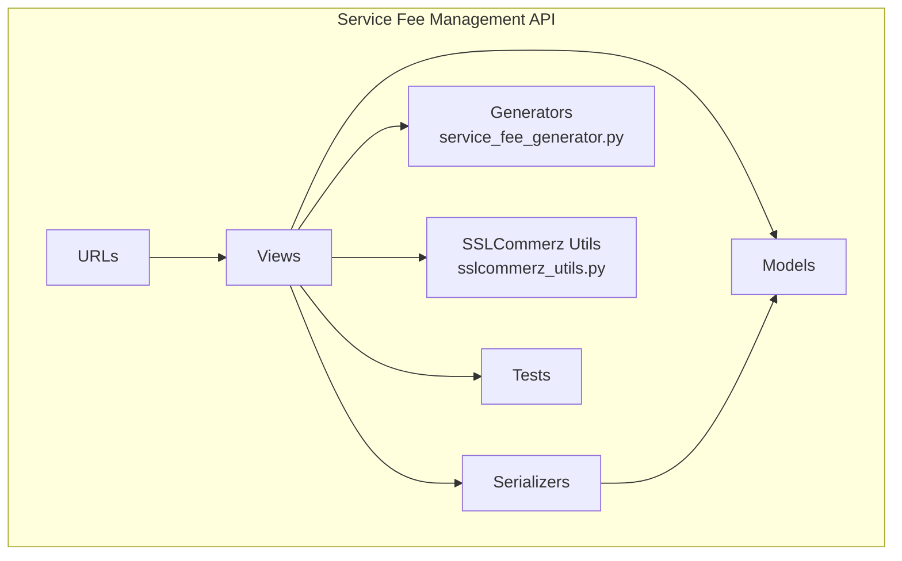
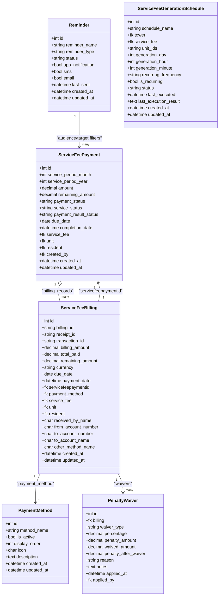
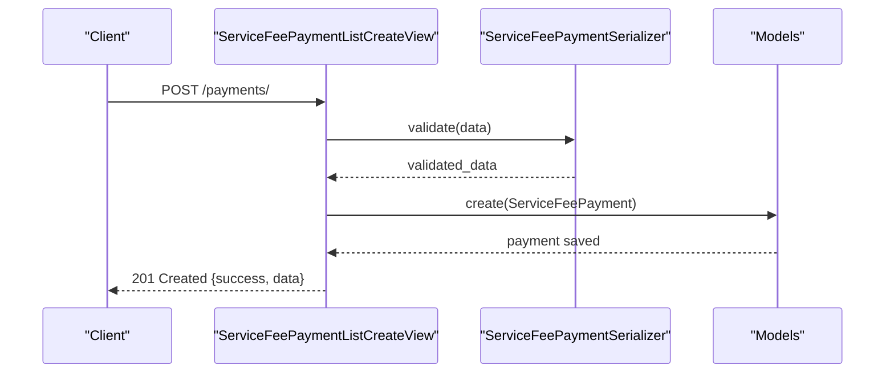
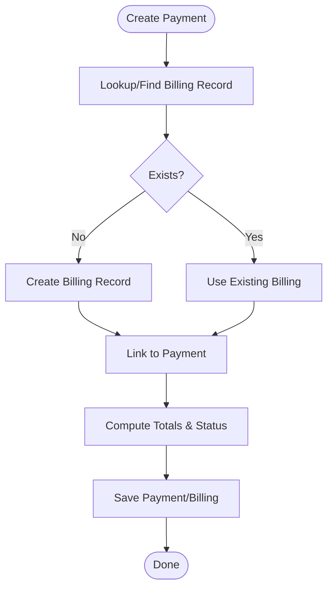
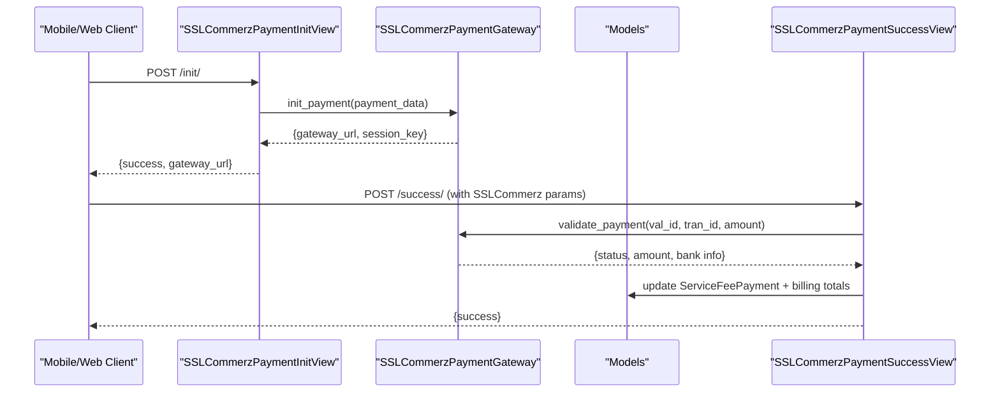
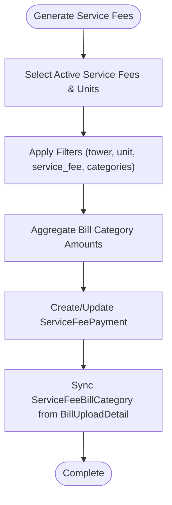
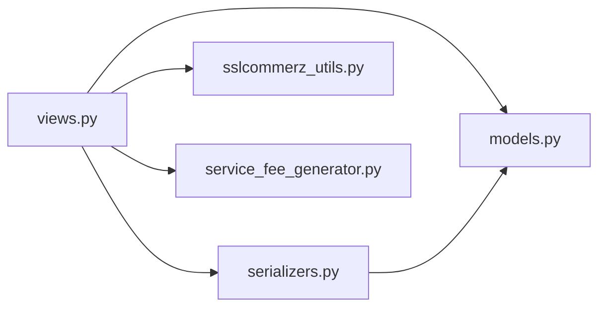

# Financial Management API

<cite>
**Referenced Files in This Document**
- [backend/service_fee_management/urls.py](file://backend/service_fee_management/urls.py)
- [backend/service_fee_management/views.py](file://backend/service_fee_management/views.py)
- [backend/service_fee_management/serializers.py](file://backend/service_fee_management/serializers.py)
- [backend/service_fee_management/models.py](file://backend/service_fee_management/models.py)
- [backend/service_fee_management/utils/sslcommerz_utils.py](file://backend/service_fee_management/utils/sslcommerz_utils.py)
- [backend/service_fee_management/utils/service_fee_generator.py](file://backend/service_fee_management/utils/service_fee_generator.py)
- [backend/service_fee_management/tests/test_payment_system.py](file://backend/service_fee_management/tests/test_payment_system.py)
- [backend/service_fee_management/migrations/0050_sslcommerztransactionmapping.py](file://backend/service_fee_management/migrations/0050_sslcommerztransactionmapping.py)
</cite>

## Table of Contents
1. [Introduction](#introduction)
2. [Project Structure](#project-structure)
3. [Core Components](#core-components)
4. [Architecture Overview](#architecture-overview)
5. [Detailed Component Analysis](#detailed-component-analysis)
6. [Dependency Analysis](#dependency-analysis)
7. [Performance Considerations](#performance-considerations)
8. [Troubleshooting Guide](#troubleshooting-guide)
9. [Conclusion](#conclusion)
10. [Appendices](#appendices)

## Introduction
This document provides comprehensive API documentation for the financial management system covering service fees, billing, payments, and accounting. It details automated service fee generation, payment processing workflows, penalty calculations, and payment history tracking. It also documents SSLCommerz payment integration, transaction validation, and receipt generation. The document includes request/response schemas for financial operations, payment methods, and account balances, along with practical examples of payment workflows, billing cycles, and financial reporting scenarios.

## Project Structure
The financial management API resides under the service_fee_management Django app. Key areas:
- URL routing defines endpoints for payments, billing, reminders, generation schedules, bill uploads, and SSLCommerz callbacks.
- Views implement business logic for payment creation, updates, completion, and retrieval, plus generation and reporting utilities.
- Serializers define request/response schemas and validation rules.
- Models encapsulate the domain entities for payments, billing, penalties, reminders, and generation schedules.
- Utilities provide SSLCommerz integration and automated service fee generation.
- Tests validate payment flows, SSLCommerz integration, and mobile APIs.

**Diagram sources**
- [backend/service_fee_management/urls.py](file://backend/service_fee_management/urls.py#L1-L152)
- [backend/service_fee_management/views.py](file://backend/service_fee_management/views.py#L1-L800)
- [backend/service_fee_management/serializers.py](file://backend/service_fee_management/serializers.py#L1-L800)
- [backend/service_fee_management/models.py](file://backend/service_fee_management/models.py#L1-L800)
- [backend/service_fee_management/utils/service_fee_generator.py](file://backend/service_fee_management/utils/service_fee_generator.py#L1-L800)
- [backend/service_fee_management/utils/sslcommerz_utils.py](file://backend/service_fee_management/utils/sslcommerz_utils.py#L1-L336)
- [backend/service_fee_management/tests/test_payment_system.py](file://backend/service_fee_management/tests/test_payment_system.py#L1-L612)

**Section sources**
- [backend/service_fee_management/urls.py](file://backend/service_fee_management/urls.py#L1-L152)
- [backend/service_fee_management/views.py](file://backend/service_fee_management/views.py#L1-L800)

## Core Components
- Payments: Create, update, and reconcile payments; compute service status and payment result status.
- Billing: Normalize billing records with transaction/receipt IDs, payment method linkage, and payment totals.
- Penalties and Waivers: Track penalty amounts, waiver types, and adjustments.
- Reminders: Automated reminder configuration and logs with timing rules and audience targeting.
- Generation Schedules: Configure automatic monthly service fee generation with tower/service filters.
- Bill Uploads: Manage uploaded bills and sync them into payment obligations.
- SSLCommerz Integration: Initialize sessions, validate transactions, and process IPN callbacks.

**Section sources**
- [backend/service_fee_management/models.py](file://backend/service_fee_management/models.py#L11-L800)
- [backend/service_fee_management/serializers.py](file://backend/service_fee_management/serializers.py#L1-L800)
- [backend/service_fee_management/utils/service_fee_generator.py](file://backend/service_fee_management/utils/service_fee_generator.py#L1-L800)
- [backend/service_fee_management/utils/sslcommerz_utils.py](file://backend/service_fee_management/utils/sslcommerz_utils.py#L1-L336)

## Architecture Overview
The system separates payment transactions from billing records to normalize data and enable accurate reconciliation. Payments aggregate into billing records per month/year per unit/service fee. Penalty waivers adjust billing penalties. Reminders are configured with timing rules and audience filters. SSLCommerz integration manages external payment sessions and validations.

**Diagram sources**
- [backend/service_fee_management/models.py](file://backend/service_fee_management/models.py#L11-L800)

## Detailed Component Analysis

### Payment Endpoints
- List/Create Payments
  - Method: GET/POST
  - Path: /api/service-fee-management/payments/
  - Description: Retrieve paginated payment records with filters and create new payments.
  - Permissions: Requires view overview permission for listing; record payment permission for creation.
  - Request body (creation): See “Payment Request Schema” below.
  - Response body: Success flag, data payload, and count.
- Retrieve Payment Details
  - Method: GET
  - Path: /api/service-fee-management/payments/{payment_id}/
  - Description: Get detailed payment with billing linkage and computed fields.
- Update/Delete Payment
  - Method: PUT/PATCH/DELETE
  - Path: /api/service-fee-management/payments/{payment_id}/
  - Description: Update payment details and related billing; delete payment with constraints.
- Complete Pending Payment
  - Method: POST
  - Path: /api/service-fee-management/payments/complete-pending/
  - Description: Mark a pending payment as completed and compute service status.
  - Request body: { payment_id: integer }
  - Response body: Success flag and message.

Payment Request Schema (write fields)
- unit: integer (required)
- service_fee: integer (required)
- amount: number (required, > 0)
- currency: string (default BDT)
- payment_status: enum (pending, completed, failed, cancelled, refunded)
- service_period_month: integer (1–12)
- service_period_year: integer
- residentId: integer (optional)
- receipt_id, transaction_id, reference_number, notes: string (optional)
- received_by_name, from_account_number, to_account_number, to_account_name, other_method_name: string (optional)

Payment Response Schema (read fields)
- id, receipt_id, transaction_id, billing_id, billing_amount, billing_remaining
- service_fee_amount, unit_display, tower_name, resident_name
- base_service_amount, additional_bill_charges, amount, remaining_amount, currency
- payment_status, service_status, payment_result_status, payment_result_display
- is_overdue, is_fully_paid, is_partial_payment
- due_date, completion_date, payment_date
- payment_method_display, method_display
- created_by_name, created_at, updated_at
- Detailed tracking fields: received_by_name, from_account_number, to_account_number, to_account_name, other_method_name

**Diagram sources**
- [backend/service_fee_management/views.py](file://backend/service_fee_management/views.py#L769-L800)
- [backend/service_fee_management/serializers.py](file://backend/service_fee_management/serializers.py#L229-L531)
- [backend/service_fee_management/models.py](file://backend/service_fee_management/models.py#L190-L323)

**Section sources**
- [backend/service_fee_management/urls.py](file://backend/service_fee_management/urls.py#L89-L93)
- [backend/service_fee_management/views.py](file://backend/service_fee_management/views.py#L769-L800)
- [backend/service_fee_management/serializers.py](file://backend/service_fee_management/serializers.py#L126-L227)

### Billing Endpoints
- List/Create Billings
  - Method: GET/POST
  - Path: /api/service-fee-management/billings/
  - Description: Retrieve billing records with computed fields and create billing entries linked to payments.
- Retrieve Billing Details
  - Method: GET
  - Path: /api/service-fee-management/billings/{billing_id}/
  - Description: Get billing details including payment method, totals, and penalty waivers.

Billing Response Schema
- id, billing_id, receipt_id, transaction_id
- service_fee, unit, resident
- billing_amount, total_paid, remaining_amount, currency
- service_period_month, service_period_year, service_period_display
- service_status, due_date, is_overdue, payment_percentage
- unit_display, tower_name, resident_name, service_fee_amount
- created_by_name, created_at, updated_at
- payments_count, waivers
- Detailed tracking fields: received_by_name, from_account_number, to_account_number, to_account_name, other_method_name

**Diagram sources**
- [backend/service_fee_management/serializers.py](file://backend/service_fee_management/serializers.py#L332-L531)
- [backend/service_fee_management/models.py](file://backend/service_fee_management/models.py#L11-L122)

**Section sources**
- [backend/service_fee_management/urls.py](file://backend/service_fee_management/urls.py#L84-L87)
- [backend/service_fee_management/serializers.py](file://backend/service_fee_management/serializers.py#L74-L114)

### Penalty Waivers
- Endpoint: GET/POST /api/service-fee-management/penalty-waivers/{pk}/
- Description: Retrieve or create penalty waivers associated with a billing record.
- Schema: id, billing, waiver_type, percentage, penalty_amount, waived_amount, penalty_after_waiver, reason, notes, applied_by, applied_by_name, applied_at

**Section sources**
- [backend/service_fee_management/urls.py](file://backend/service_fee_management/urls.py#L87-L87)
- [backend/service_fee_management/models.py](file://backend/service_fee_management/models.py#L124-L165)
- [backend/service_fee_management/serializers.py](file://backend/service_fee_management/serializers.py#L61-L71)

### Reminders
- List/Detail/Creation/Send Logs/Process Scheduled
  - Paths: /reminders/, /reminders/create/, /reminders/{pk}/, /reminders/{pk}/send/, /reminders/{pk}/logs/, /reminder-logs/, /process-scheduled-reminders/, /reminders/test/
- Reminders support timing rules, audience targeting, and channel selection (app, SMS, email).
- Reminder timing rules are normalized into separate tables with timing types and offsets.

**Section sources**
- [backend/service_fee_management/urls.py](file://backend/service_fee_management/urls.py#L111-L121)
- [backend/service_fee_management/models.py](file://backend/service_fee_management/models.py#L342-L540)

### Service Fee Generation Schedules
- List/Detail
  - Paths: /generation-schedules/, /generation-schedules/{pk}/
- Configure automatic monthly generation with tower/service filters, recurrence, and due date logic.

**Section sources**
- [backend/service_fee_management/urls.py](file://backend/service_fee_management/urls.py#L137-L139)
- [backend/service_fee_management/models.py](file://backend/service_fee_management/models.py#L711-L800)

### Bill Uploads
- List/Detail/CSV Parser/Previous Reading
  - Paths: /bill-uploads/service-fees/, /bill-uploads/service-fee-items/, /bill-uploads/, /bill-uploads/{upload_id}/, /bill-uploads/csv-parser/, /bill-uploads/previous-reading/
- Upload bill items and synchronize with payment obligations.

**Section sources**
- [backend/service_fee_management/urls.py](file://backend/service_fee_management/urls.py#L143-L149)
- [backend/service_fee_management/serializers.py](file://backend/service_fee_management/serializers.py#L24-L59)

### Payment History and Reporting
- Payment History
  - Path: /payment-history/
  - Description: Retrieve historical payment records with computed fields and service status.
- Unit Payment History
  - Path: /unit-ledger/ (commented; similar concept)
- Service Fee Options and Counts
  - Paths: /service-fee-options/, /service-fee-unit-counts/
- Filter Options and Choices
  - Paths: /filter-options/, /payment-choices/

**Section sources**
- [backend/service_fee_management/urls.py](file://backend/service_fee_management/urls.py#L95-L106)
- [backend/service_fee_management/views.py](file://backend/service_fee_management/views.py#L544-L663)

### SSLCommerz Payment Integration
- Initiate Payment
  - Path: /payments/sslcommerz/init/
  - Description: Initialize SSLCommerz session and return gateway URL and session key.
- Callbacks
  - Paths: /payments/sslcommerz/success/, /payments/sslcommerz/fail/, /payments/sslcommerz/cancel/, /payments/sslcommerz/ipn/
  - Description: Handle success/failure/cancellation and IPN callbacks; validate and reconcile payments.
- Manual Cancel
  - Path: /payments/sslcommerz/manual-cancel/
  - Description: Manually cancel a pending payment.
- Transaction Mapping
  - Model: SSLCommerzTransactionMapping (stores SSLCommerz transaction_id ↔ payment IDs with expiry).

**Diagram sources**
- [backend/service_fee_management/utils/sslcommerz_utils.py](file://backend/service_fee_management/utils/sslcommerz_utils.py#L52-L163)
- [backend/service_fee_management/utils/sslcommerz_utils.py](file://backend/service_fee_management/utils/sslcommerz_utils.py#L164-L266)
- [backend/service_fee_management/utils/sslcommerz_utils.py](file://backend/service_fee_management/utils/sslcommerz_utils.py#L313-L334)
- [backend/service_fee_management/models.py](file://backend/service_fee_management/models.py#L11-L82)
- [backend/service_fee_management/migrations/0050_sslcommerztransactionmapping.py](file://backend/service_fee_management/migrations/0050_sslcommerztransactionmapping.py#L14-L23)

**Section sources**
- [backend/service_fee_management/urls.py](file://backend/service_fee_management/urls.py#L128-L135)
- [backend/service_fee_management/utils/sslcommerz_utils.py](file://backend/service_fee_management/utils/sslcommerz_utils.py#L1-L336)
- [backend/service_fee_management/migrations/0050_sslcommerztransactionmapping.py](file://backend/service_fee_management/migrations/0050_sslcommerztransactionmapping.py#L1-L31)

### Automated Service Fee Generation
- Generate Service Fee
  - Path: /generate-service-fee/
  - Description: Generate monthly service fee records for active units and service fees, including bill category aggregation.
- Generate Missing Months
  - Path: /generate-missing-months/
  - Description: Generate service fees across a date range.
- Delete Generated Service Fee
  - Path: /delete-generated-fee/
  - Description: Delete generated records with safeguards.

**Diagram sources**
- [backend/service_fee_management/utils/service_fee_generator.py](file://backend/service_fee_management/utils/service_fee_generator.py#L15-L707)

**Section sources**
- [backend/service_fee_management/urls.py](file://backend/service_fee_management/urls.py#L80-L82)
- [backend/service_fee_management/utils/service_fee_generator.py](file://backend/service_fee_management/utils/service_fee_generator.py#L1-L800)

## Dependency Analysis
- Views depend on Serializers for validation and on Models for persistence.
- Payment creation/update depends on Billing records and payment method resolution.
- SSLCommerz integration depends on environment settings and gateway utilities.
- Generation utilities depend on bill upload details and service fee metadata.

**Diagram sources**
- [backend/service_fee_management/views.py](file://backend/service_fee_management/views.py#L1-L800)
- [backend/service_fee_management/serializers.py](file://backend/service_fee_management/serializers.py#L1-L800)
- [backend/service_fee_management/models.py](file://backend/service_fee_management/models.py#L1-L800)
- [backend/service_fee_management/utils/sslcommerz_utils.py](file://backend/service_fee_management/utils/sslcommerz_utils.py#L1-L336)
- [backend/service_fee_management/utils/service_fee_generator.py](file://backend/service_fee_management/utils/service_fee_generator.py#L1-L800)

**Section sources**
- [backend/service_fee_management/views.py](file://backend/service_fee_management/views.py#L1-L800)
- [backend/service_fee_management/serializers.py](file://backend/service_fee_management/serializers.py#L1-L800)

## Performance Considerations
- Raw SQL queries in optimized views reduce Python-side loops and improve throughput.
- Bulk operations for generation minimize database round-trips.
- Indexes on frequently queried fields (e.g., payment status, unit/service period) improve query performance.
- Connection pooling and retry strategies in SSLCommerz client reduce latency and failures.

[No sources needed since this section provides general guidance]

## Troubleshooting Guide
Common issues and resolutions:
- Payment amount exceeds remaining: Validation prevents overpayments; adjust amount or check billing totals.
- Duplicate payment within short window: Prevented by duplicate detection; wait before retrying.
- SSLCommerz validation failure: Check transaction ID match, amount precision, and gateway credentials.
- Missing billing record: Creation logic attempts to create billing on payment save; ensure unit/service fee linkage.
- Email receipt not sent: Logging indicates failure; verify email availability and template data.

**Section sources**
- [backend/service_fee_management/tests/test_payment_system.py](file://backend/service_fee_management/tests/test_payment_system.py#L107-L202)
- [backend/service_fee_management/views.py](file://backend/service_fee_management/views.py#L273-L542)
- [backend/service_fee_management/utils/sslcommerz_utils.py](file://backend/service_fee_management/utils/sslcommerz_utils.py#L164-L266)

## Conclusion
The financial management API provides robust capabilities for service fee billing, payment processing, penalty management, reminders, and automated generation. SSLCommerz integration ensures secure online payments with validation and IPN handling. The schema-driven serializers and normalized models support accurate reconciliation and reporting.

[No sources needed since this section summarizes without analyzing specific files]

## Appendices

### Example Workflows

- Payment Workflow (Manual Entry)
  - Steps: Create payment → Billing record auto-linked → Totals updated → Service status computed → Optional email receipt.
  - Endpoints: POST /payments/, GET /payments/{id}/

- Payment Workflow (SSLCommerz)
  - Steps: Initiate payment → Redirect to gateway → Success callback → Validation → Completion → Receipt generation.
  - Endpoints: POST /payments/sslcommerz/init/, POST /payments/sslcommerz/success/

- Billing Cycle
  - Steps: Generate monthly fees → Apply bill categories → Create payment records → Track partial/full payments → Apply penalties/waivers.

- Financial Reporting
  - Use payment history and unit payment history endpoints to compile reports on receivables, collections, and overdue balances.

**Section sources**
- [backend/service_fee_management/urls.py](file://backend/service_fee_management/urls.py#L89-L106)
- [backend/service_fee_management/utils/sslcommerz_utils.py](file://backend/service_fee_management/utils/sslcommerz_utils.py#L52-L163)
- [backend/service_fee_management/tests/test_payment_system.py](file://backend/service_fee_management/tests/test_payment_system.py#L371-L393)