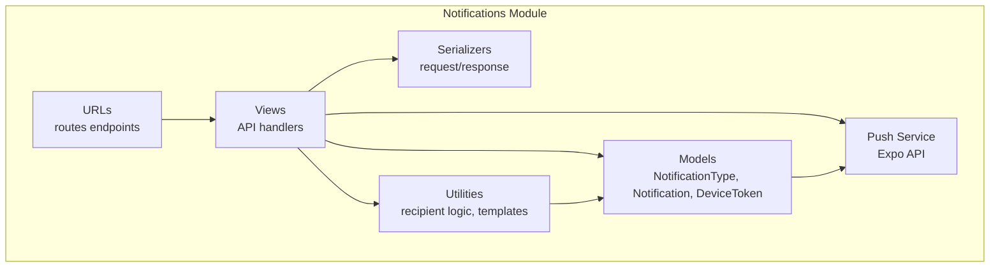
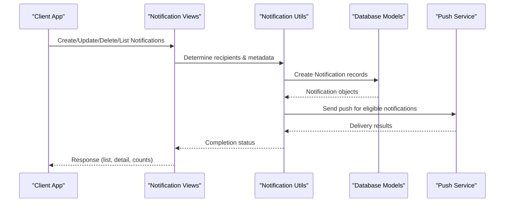
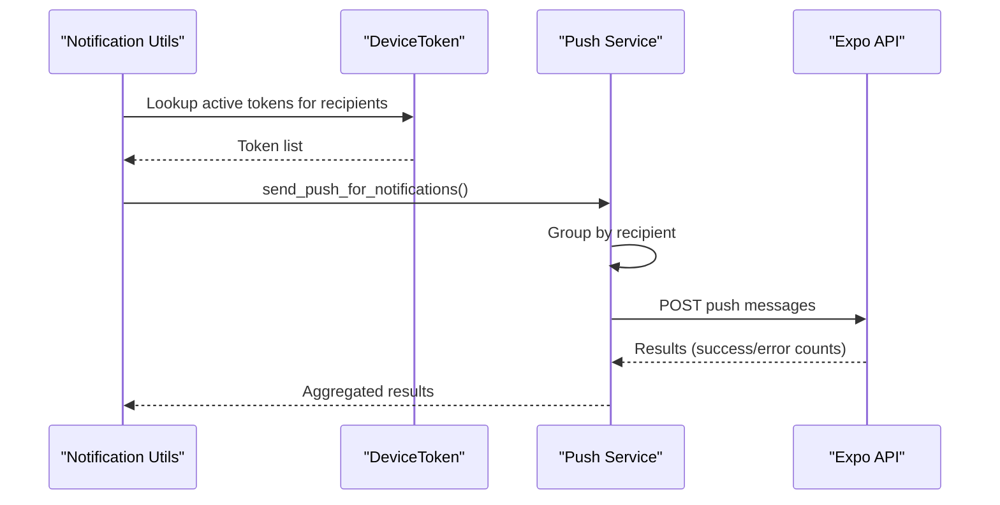
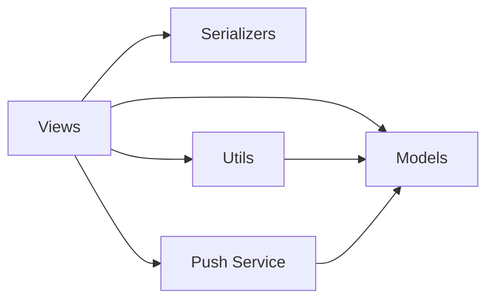

# Notification System API

<cite>
**Referenced Files in This Document**
- [models.py](file://backend/notifications/models.py)
- [views.py](file://backend/notifications/views.py)
- [urls.py](file://backend/notifications/urls.py)
- [serializers.py](file://backend/notifications/serializers.py)
- [push_service.py](file://backend/notifications/push_service.py)
- [utils.py](file://backend/notifications/utils.py)
</cite>

## Table of Contents
1. [Introduction](#introduction)
2. [Project Structure](#project-structure)
3. [Core Components](#core-components)
4. [Architecture Overview](#architecture-overview)
5. [Detailed Component Analysis](#detailed-component-analysis)
6. [Dependency Analysis](#dependency-analysis)
7. [Performance Considerations](#performance-considerations)
8. [Troubleshooting Guide](#troubleshooting-guide)
9. [Conclusion](#conclusion)

## Introduction
This document provides comprehensive API documentation for the notification system, covering push notifications, in-app messaging, and user preference management. It explains endpoints for listing, reading, and marking notifications, managing device tokens for push delivery, and batch operations. It also documents notification templates, scheduling, and delivery optimization strategies implemented in the backend.

## Project Structure
The notification system is implemented in the backend under the `backend/notifications` module. Key components include:
- URL routing for notification endpoints
- Views implementing CRUD and utility operations
- Serializers for request/response marshalling
- Models defining notification types, notifications, and device tokens
- Push service for sending push notifications via Expo
- Utilities for creating notifications, determining recipients, and enforcing non-retroactive delivery

**Diagram sources**
- [urls.py](file://backend/notifications/urls.py#L1-L19)
- [views.py](file://backend/notifications/views.py#L1-L523)
- [serializers.py](file://backend/notifications/serializers.py#L1-L128)
- [models.py](file://backend/notifications/models.py#L1-L264)
- [push_service.py](file://backend/notifications/push_service.py#L1-L305)
- [utils.py](file://backend/notifications/utils.py#L1-L4750)

**Section sources**
- [urls.py](file://backend/notifications/urls.py#L1-L19)
- [views.py](file://backend/notifications/views.py#L1-L523)
- [serializers.py](file://backend/notifications/serializers.py#L1-L128)
- [models.py](file://backend/notifications/models.py#L1-L264)
- [push_service.py](file://backend/notifications/push_service.py#L1-L305)
- [utils.py](file://backend/notifications/utils.py#L1-L4750)

## Core Components
- NotificationType: Dynamic master table for notification categories with entity type mapping, activation flag, and priority.
- Notification: Stores individual notifications with recipient, type, entity reference, title, message, priority, read status, and metadata.
- DeviceToken: Stores push tokens per user with platform and activity tracking.

Key capabilities:
- Non-retroactive delivery: Users only receive notifications for content created after permission grants.
- Priority-driven push delivery: Urgent/High priority triggers push; Low priority remains in-app.
- Permission-aware recipient filtering: Recipients must have view permissions for the entity type.
- Push delivery via Expo: Consolidated push sending with token lookup and result reporting.

**Section sources**
- [models.py](file://backend/notifications/models.py#L6-L90)
- [models.py](file://backend/notifications/models.py#L93-L198)
- [models.py](file://backend/notifications/models.py#L200-L262)

## Architecture Overview
The notification system integrates Django REST Framework views, serializers, and models with a push service and utility functions. The flow below illustrates how notifications are created and delivered.

**Diagram sources**
- [views.py](file://backend/notifications/views.py#L24-L191)
- [utils.py](file://backend/notifications/utils.py#L889-L1153)
- [push_service.py](file://backend/notifications/push_service.py#L172-L258)

## Detailed Component Analysis

### Endpoint Catalog
- GET /notifications/
  - Purpose: List authenticated user's notifications with filtering and pagination.
  - Filters: is_read, type (code or ID), entity_type.
  - Pagination: page_size with max limit.
  - Response: Results array with metadata and load metrics.
- GET /notifications/<id>/
  - Purpose: Retrieve a specific notification detail.
- PATCH /notifications/<id>/
  - Purpose: Update notification (only is_read supported).
  - Behavior: On behalf of other users, creates a personal notification if none exists.
- POST /notifications/mark-all-read/
  - Purpose: Mark all unread notifications as read for the authenticated user.
- GET /notifications/unread-count/
  - Purpose: Get unread notification count respecting permissions and retroactivity.
- POST /notifications/batch_owner_notification/
  - Purpose: Create batch owner-added notifications for multiple owners.
- POST /notifications/device-token/
  - Purpose: Register or update a device token for push notifications.
- DELETE /notifications/device-token/
  - Purpose: Deactivate a device token.

**Section sources**
- [urls.py](file://backend/notifications/urls.py#L11-L18)
- [views.py](file://backend/notifications/views.py#L24-L191)
- [views.py](file://backend/notifications/views.py#L194-L295)
- [views.py](file://backend/notifications/views.py#L297-L330)
- [views.py](file://backend/notifications/views.py#L332-L384)
- [views.py](file://backend/notifications/views.py#L386-L445)
- [views.py](file://backend/notifications/views.py#L447-L523)

### Request/Response Schemas

#### Notification List Response
- Fields: id, notification_type_code, notification_type_name, notification_type_icon, entity_type, entity_id, title, message, priority, is_read, metadata, created_at
- Read-only: id, created_at

#### Notification Detail Response
- Fields: id, notification_type, notification_type_code, notification_type_name, notification_type_icon, entity_type, entity_id, entity_reference, title, message, priority, is_read, metadata, created_at, read_at
- Read-only: id, created_at, read_at, entity_reference

#### Device Token Request/Response
- Request: member, token, platform, device_id, is_active, last_used_at, created_at, updated_at
- Validation: token must be non-empty.

#### Batch Owner Notification Request
- Fields: owner_ids (array), unit_id (required).

#### Unread Count Response
- Fields: unread_count (integer)

#### Load Metrics (included in list response)
- Fields: complexity, load_time_ms, processed_count, description

**Section sources**
- [serializers.py](file://backend/notifications/serializers.py#L25-L63)
- [serializers.py](file://backend/notifications/serializers.py#L66-L101)
- [serializers.py](file://backend/notifications/serializers.py#L103-L122)
- [views.py](file://backend/notifications/views.py#L180-L191)

### Notification Creation and Templates
- Dynamic notification types: NotificationType supports dynamic creation with code/name/entity_type/priority.
- Template-driven creation: Utilities build titles/messages based on entity type and priority, with metadata for push optimization.
- Examples of templates:
  - Announcement published/scheduled/ongoing/updated with priority-aware titles and short push messages.
  - Bulletin posted/approval/update/rejection/admin comment with status metadata.
  - Notice posted with web/mobile split content and push eligibility based on priority.
- Recipient determination:
  - Announcements/Bulletins/Notices: Target units/towers with permission-aware filtering.
  - Organization member additions, role/group assignments, resident/unit staff actions: permission-based or direct assignment.

**Section sources**
- [utils.py](file://backend/notifications/utils.py#L889-L1153)
- [utils.py](file://backend/notifications/utils.py#L1373-L1466)
- [utils.py](file://backend/notifications/utils.py#L1933-L2090)
- [utils.py](file://backend/notifications/utils.py#L2677-L2766)
- [utils.py](file://backend/notifications/utils.py#L2768-L2884)
- [utils.py](file://backend/notifications/utils.py#L2886-L2979)
- [utils.py](file://backend/notifications/utils.py#L2981-L3185)

### Push Notification Delivery
- Push eligibility: Urgent/High priority triggers push; Low priority remains in-app.
- Push payload: Includes notificationId, type, entityType, entityId, and entity-specific metadata.
- Delivery: Uses Expo Push API with batching and result reporting; tokens retrieved from DeviceToken.
- Batch sending: Group notifications by recipient to avoid duplicates.

**Diagram sources**
- [push_service.py](file://backend/notifications/push_service.py#L109-L170)
- [push_service.py](file://backend/notifications/push_service.py#L261-L305)

**Section sources**
- [push_service.py](file://backend/notifications/push_service.py#L17-L107)
- [push_service.py](file://backend/notifications/push_service.py#L109-L170)
- [push_service.py](file://backend/notifications/push_service.py#L172-L258)
- [push_service.py](file://backend/notifications/push_service.py#L261-L305)

### User Preference Management
- Device token registration: Users register tokens with platform and device_id; tokens marked active upon registration.
- Token deactivation: Tokens can be deactivated (e.g., logout/uninstall).
- Permission-aware delivery: Non-retroactive delivery enforced; users only receive notifications for content created after permission grants.
- Role/Group notifications: Personal notifications (role_assigned, group_added) are always shown to the affected user.

**Section sources**
- [views.py](file://backend/notifications/views.py#L447-L523)
- [utils.py](file://backend/notifications/utils.py#L74-L265)
- [utils.py](file://backend/notifications/utils.py#L2768-L2884)
- [utils.py](file://backend/notifications/utils.py#L2886-L2979)

### Batch Operations
- Batch owner notification: Create owner-added notifications for multiple owners in a single request.
- Bulk notification creation: Utility supports creating notifications for multiple recipients with shared metadata.

**Section sources**
- [views.py](file://backend/notifications/views.py#L386-L445)
- [utils.py](file://backend/notifications/utils.py#L1286-L1341)

### Delivery Tracking and Monitoring
- Push results: Success/error counts per batch; logs include token counts and per-result statuses.
- Last-used timestamps: DeviceToken.last_used_at updated when push messages are sent.
- Retroactivity checks: should_show_notification filters out notifications for entities created before permission grants.

**Section sources**
- [push_service.py](file://backend/notifications/push_service.py#L158-L169)
- [utils.py](file://backend/notifications/utils.py#L74-L265)

### Scheduling and Retry Mechanisms
- Announcement lifecycle: Separate templates for published, scheduled, ongoing, and updated states.
- Notice lifecycle: Posted notifications created when status transitions to ongoing; upcoming notices skip immediate notifications.
- Retry strategy: Push service returns results with success/error counts; application-level retries can be implemented around push sending.

**Section sources**
- [utils.py](file://backend/notifications/utils.py#L1155-L1223)
- [utils.py](file://backend/notifications/utils.py#L1933-L2090)
- [push_service.py](file://backend/notifications/push_service.py#L84-L106)

### Failure Handling
- Validation failures: Device token serializer validates non-empty tokens.
- Permission denials: Views filter out unauthorized recipients; API returns empty sets when no permissions exist.
- Duplicate prevention: get_or_create patterns prevent duplicate notifications.
- Graceful degradation: Push failures do not block notification creation.

**Section sources**
- [serializers.py](file://backend/notifications/serializers.py#L123-L128)
- [views.py](file://backend/notifications/views.py#L38-L111)
- [utils.py](file://backend/notifications/utils.py#L1094-L1128)

## Dependency Analysis
The notification system exhibits clear separation of concerns:
- Views depend on serializers, models, and utilities.
- Push service depends on models and external APIs.
- Utilities encapsulate business logic for recipients, templates, and retroactivity.

**Diagram sources**
- [views.py](file://backend/notifications/views.py#L1-L523)
- [serializers.py](file://backend/notifications/serializers.py#L1-L128)
- [models.py](file://backend/notifications/models.py#L1-L264)
- [utils.py](file://backend/notifications/utils.py#L1-L4750)
- [push_service.py](file://backend/notifications/push_service.py#L1-L305)

**Section sources**
- [views.py](file://backend/notifications/views.py#L1-L523)
- [serializers.py](file://backend/notifications/serializers.py#L1-L128)
- [models.py](file://backend/notifications/models.py#L1-L264)
- [utils.py](file://backend/notifications/utils.py#L1-L4750)
- [push_service.py](file://backend/notifications/push_service.py#L1-L305)

## Performance Considerations
- Database indexing: Notification and DeviceToken models include strategic indexes for filtering and lookups.
- Efficient queries: Views use select_related and filtered querysets to minimize overhead.
- Pagination: List endpoint supports configurable page sizes with upper bounds.
- Bulk operations: Mark-all-read uses bulk updates for speed.
- Push batching: Grouping by recipient reduces redundant sends.

[No sources needed since this section provides general guidance]

## Troubleshooting Guide
Common issues and resolutions:
- Empty notification lists: Verify user permissions and retroactivity filters; ensure entity targets match user units/towers.
- Push delivery failures: Check device token validity and platform; inspect push results for error details.
- Duplicate notifications: Confirm get_or_create usage and entity uniqueness constraints.
- Permission denied errors: Ensure users have appropriate view permissions for the entity type.

**Section sources**
- [views.py](file://backend/notifications/views.py#L38-L111)
- [push_service.py](file://backend/notifications/push_service.py#L84-L106)
- [utils.py](file://backend/notifications/utils.py#L1094-L1128)

## Conclusion
The notification system provides a robust, permission-aware, and scalable foundation for delivering announcements, bulletins, notices, and administrative updates across web and mobile channels. Its modular design, dynamic templates, and non-retroactive delivery ensure timely and relevant communication while maintaining performance and reliability.