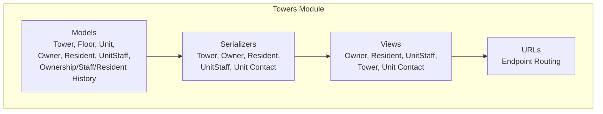
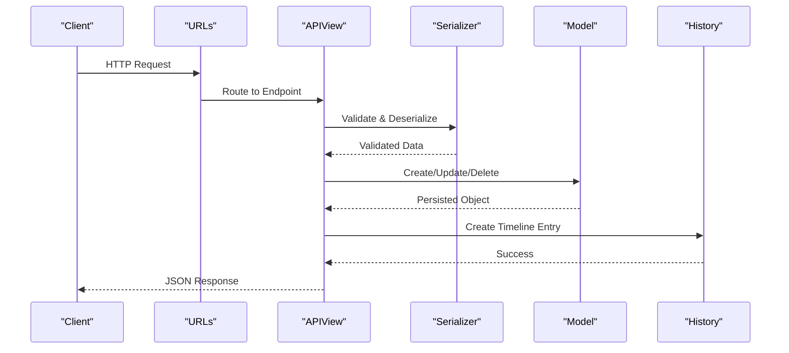
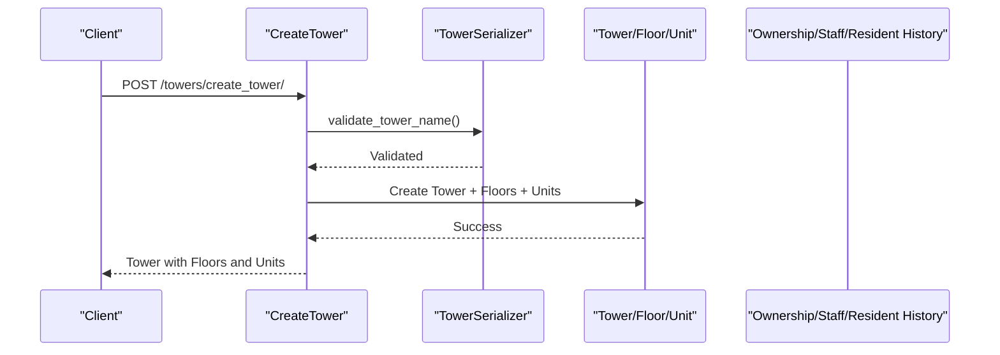
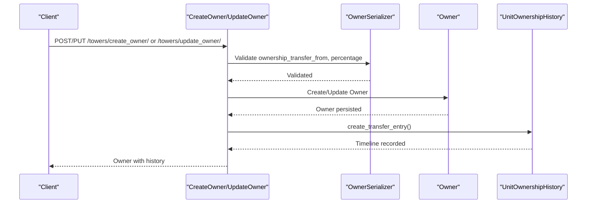
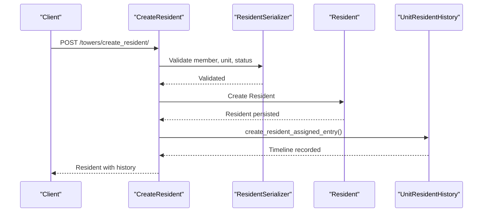
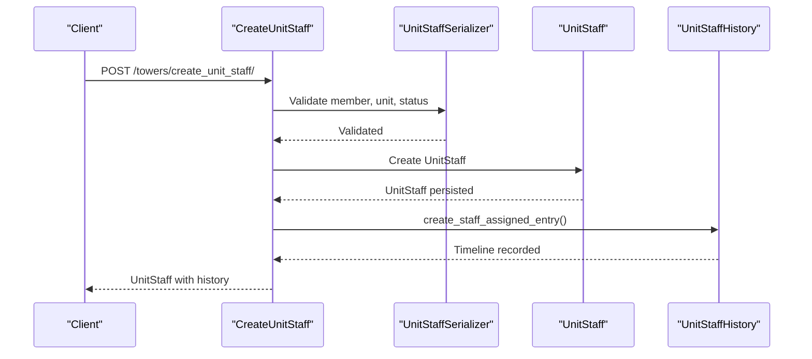
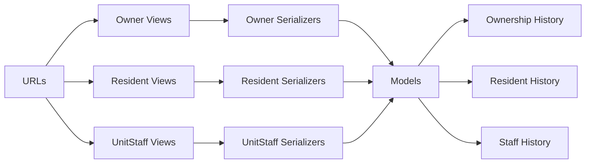

# Property Management API

<cite>
**Referenced Files in This Document**
- [models.py](file://backend/towers/models.py)
- [urls.py](file://backend/towers/urls.py)
- [tower_serializers.py](file://backend/towers/serializers/tower_serializers.py)
- [owner_serializers.py](file://backend/towers/serializers/owner_serializers.py)
- [resident_serializers.py](file://backend/towers/serializers/resident_serializers.py)
- [unitStaff_serializers.py](file://backend/towers/serializers/unitStaff_serializers.py)
- [owner_views.py](file://backend/towers/views/owner_views.py)
- [resident_views.py](file://backend/towers/views/resident_views.py)
- [unitStaff_views.py](file://backend/towers/views/unitStaff_views.py)
</cite>

## Table of Contents
1. [Introduction](#introduction)
2. [Project Structure](#project-structure)
3. [Core Components](#core-components)
4. [Architecture Overview](#architecture-overview)
5. [Detailed Component Analysis](#detailed-component-analysis)
6. [Dependency Analysis](#dependency-analysis)
7. [Performance Considerations](#performance-considerations)
8. [Troubleshooting Guide](#troubleshooting-guide)
9. [Conclusion](#conclusion)

## Introduction
This document provides comprehensive API documentation for property management endpoints focused on towers, units, ownership tracking, and resident management. It covers CRUD operations for property inventory, ownership transfer processes, unit status management, and staff assignments. The API supports property search, filtering by tower/unit status, and bulk operations. It also documents request/response schemas, validation rules, business constraints, and data integrity requirements, along with practical workflow examples.

## Project Structure
The property management module resides under `backend/towers` and consists of:
- Models defining domain entities (Tower, Floor, Unit, Owner, Resident, UnitStaff, and history tables)
- Serializers validating and transforming data for API requests/responses
- Views implementing business logic and endpoints
- URL routing mapping endpoints to views

**Diagram sources**
- [models.py](file://backend/towers/models.py#L1-L1332)
- [tower_serializers.py](file://backend/towers/serializers/tower_serializers.py#L1-L490)
- [owner_serializers.py](file://backend/towers/serializers/owner_serializers.py#L1-L382)
- [resident_serializers.py](file://backend/towers/serializers/resident_serializers.py#L1-L656)
- [unitStaff_serializers.py](file://backend/towers/serializers/unitStaff_serializers.py#L1-L249)
- [urls.py](file://backend/towers/urls.py#L1-L86)

**Section sources**
- [models.py](file://backend/towers/models.py#L1-L1332)
- [urls.py](file://backend/towers/urls.py#L1-L86)

## Core Components
- Tower: Building entity with configurable unit layout, naming scheme, and photos
- Floor: Floors within a tower
- Unit: Individual unit with status tracking and contact details
- Owner: Ownership records per unit with transfer history and documents
- Resident: Residents/tenants per unit with status and financial details
- UnitStaff: Staff assigned to units with status tracking
- History Tables: Ownership, Staff, and Resident histories for auditability

Key capabilities:
- Create, update, delete towers and units
- Track ownership changes with detailed history
- Manage resident and staff assignments with timelines
- Upload and manage documents for owners and residents
- Bulk operations for owners and staff

**Section sources**
- [models.py](file://backend/towers/models.py#L7-L1332)
- [tower_serializers.py](file://backend/towers/serializers/tower_serializers.py#L63-L490)
- [owner_serializers.py](file://backend/towers/serializers/owner_serializers.py#L10-L382)
- [resident_serializers.py](file://backend/towers/serializers/resident_serializers.py#L19-L656)
- [unitStaff_serializers.py](file://backend/towers/serializers/unitStaff_serializers.py#L10-L249)

## Architecture Overview
The API follows a layered architecture:
- URL routing defines endpoints
- Views implement request handling and orchestrate business logic
- Serializers validate and transform data
- Models define persistence and relationships
- History tables capture immutable audit trails

**Diagram sources**
- [urls.py](file://backend/towers/urls.py#L9-L85)
- [owner_views.py](file://backend/towers/views/owner_views.py#L141-L576)
- [resident_views.py](file://backend/towers/views/resident_views.py#L38-L102)
- [unitStaff_views.py](file://backend/towers/views/unitStaff_views.py#L31-L116)
- [models.py](file://backend/towers/models.py#L257-L587)

## Detailed Component Analysis

### Towers and Units API

#### Endpoints
- GET `/towers/get_last_tower_number/` - Get next tower number
- POST `/towers/create_tower/` - Create a new tower with floors and units
- GET `/towers/tower_list/` - List towers with floor details
- GET `/towers/community_towers/` - List towers accessible to community members
- GET `/towers/community_units/` - List units accessible to community members
- PUT `/towers/update_tower/<int:pk>/` - Update tower (regenerates floors/units)
- GET `/towers/tower_details/<int:pk>/` - Get tower details with floors
- DELETE `/towers/delete_tower/<int:pk>/` - Delete tower
- GET `/towers/units_side_details/<int:pk>/` - Get unit side details
- PUT `/towers/update_unit/<int:pk>/` - Update unit (documents supported)
- GET `/towers/unit_details/<int:pk>/` - Get unit details

#### Request/Response Schemas
- Tower Creation/Update
  - Request: Fields include tower_name, description, photo, num_floors, num_units, units_per_floor, unit_naming_type, add_tower_number_to_unit_name, number_of_units[]
  - Response: Full Tower object with nested Floors and Units
- Unit Update
  - Request: Supports updating unit fields and managing documents via multipart/form-data
  - Response: Updated Unit object with related documents

Validation rules:
- Tower name uniqueness enforced
- Unit naming depends on selected naming scheme and configuration
- Photo upload validation for allowed extensions and size
- Documents upload validation for allowed types and size limits

**Section sources**
- [urls.py](file://backend/towers/urls.py#L10-L21)
- [tower_serializers.py](file://backend/towers/serializers/tower_serializers.py#L149-L468)
- [tower_serializers.py](file://backend/towers/serializers/tower_serializers.py#L44-L116)

#### Sequence: Tower Creation Workflow

**Diagram sources**
- [tower_serializers.py](file://backend/towers/serializers/tower_serializers.py#L164-L185)
- [tower_serializers.py](file://backend/towers/serializers/tower_serializers.py#L206-L304)

### Ownership Management API

#### Endpoints
- GET `/towers/add_owner_search/` - Search members across owners, residents, staff, and organization/company members
- POST `/towers/create_owner/` - Create owner with optional ownership transfer and document uploads
- POST `/towers/bulk_create_owner/` - Bulk create owners for a unit
- PUT `/towers/update_owner/<int:owner_id>/` - Update owner (supports transfers and document management)
- DELETE `/towers/delete_owner/<int:owner_id>/` - Delete owner
- GET `/towers/owner_details/<int:unit_id>/<int:owner_id>/` - Get owner details
- GET `/towers/unit_ownership_by_member/<int:member_id>/` - List units owned by a member
- GET `/towers/owner_list_of_unit/<int:unit_id>/` - List owners of a unit
- GET `/towers/unit_ownership_history/<int:unit_id>/` - View ownership timeline
- POST `/towers/owners/bulk-upload/` - Bulk owner upload endpoint

#### Request/Response Schemas
- Create Owner
  - Request: member, unit, ownership_percentage, date_of_ownership, ownership_transfer_from, owner_docs_upload[], docs_to_delete[], docs_to_update[]
  - Response: Owner object with unit and tower details, attached documents
- Update Owner
  - Request: Similar to create with optional transfer fields and document operations
  - Response: Updated Owner object with history entries
- Ownership History
  - Response: Timeline entries with ownership_state_before/after snapshots

Validation rules:
- Member existence validation
- Ownership percentage and date validation
- Transfer source validation and lifecycle handling
- Document upload validation and deletion coordination with history entries

Business constraints:
- Ownership percentages must sum to 100% for a unit
- Transfer events create immutable history entries
- Last transfer date tracked for ownership records
- Initial ownership entry created upon first owner assignment

**Section sources**
- [urls.py](file://backend/towers/urls.py#L30-L39)
- [owner_serializers.py](file://backend/towers/serializers/owner_serializers.py#L10-L138)
- [owner_serializers.py](file://backend/towers/serializers/owner_serializers.py#L141-L288)
- [owner_serializers.py](file://backend/towers/serializers/owner_serializers.py#L349-L382)
- [owner_views.py](file://backend/towers/views/owner_views.py#L28-L139)
- [owner_views.py](file://backend/towers/views/owner_views.py#L141-L576)
- [owner_views.py](file://backend/towers/views/owner_views.py#L579-L748)
- [owner_views.py](file://backend/towers/views/owner_views.py#L751-L1599)
- [models.py](file://backend/towers/models.py#L257-L587)

#### Sequence: Ownership Transfer Workflow

**Diagram sources**
- [owner_views.py](file://backend/towers/views/owner_views.py#L161-L558)
- [owner_views.py](file://backend/towers/views/owner_views.py#L836-L1452)
- [models.py](file://backend/towers/models.py#L257-L473)

### Resident Management API

#### Endpoints
- POST `/towers/create_resident/` - Create resident with optional documents
- POST `/towers/resident/bulk-upload/` - Bulk resident upload
- GET `/towers/residents_list/<int:unit_pk>/` - List residents of a unit
- GET `/towers/resident_details/<int:unit_id>/<int:resident_id>/` - Get resident details
- PATCH `/towers/inactivate_residents/` - Inactivate residents
- DELETE `/towers/delete_residents/` - Bulk delete residents
- PATCH `/towers/resident_info_edit/<int:resident_id>/` - Edit resident info
- GET `/towers/unit_resident_history/<int:unit_id>/` - View resident timeline

#### Request/Response Schemas
- Create Resident
  - Request: member (existing or new), unit, is_resident_or_tenant, unit_rent_fee, advance_payment, notice_period, docs[]
  - Response: Resident object with unit and tower details, attached documents
- Resident History
  - Response: Timeline entries with resident_state_before/after snapshots

Validation rules:
- Member uniqueness per unit for active residents
- Tenant-specific fields validation based on status
- Document upload validation and deletion coordination with history entries

Business constraints:
- Unit status updated to occupied upon resident assignment
- Resident removal recorded with move-out date extraction from history
- Self-notifications for resident actions

**Section sources**
- [urls.py](file://backend/towers/urls.py#L22-L24)
- [urls.py](file://backend/towers/urls.py#L49-L58)
- [resident_serializers.py](file://backend/towers/serializers/resident_serializers.py#L19-L243)
- [resident_serializers.py](file://backend/towers/serializers/resident_serializers.py#L245-L388)
- [resident_serializers.py](file://backend/towers/serializers/resident_serializers.py#L578-L656)
- [resident_views.py](file://backend/towers/views/resident_views.py#L38-L102)
- [resident_views.py](file://backend/towers/views/resident_views.py#L122-L155)
- [models.py](file://backend/towers/models.py#L964-L1332)

#### Sequence: Resident Assignment Workflow

**Diagram sources**
- [resident_views.py](file://backend/towers/views/resident_views.py#L38-L102)
- [models.py](file://backend/towers/models.py#L964-L1217)

### Staff Assignments API

#### Endpoints
- POST `/towers/create_unit_staff/` - Create unit staff with optional documents
- GET `/towers/unit_staff_list/<int:unit_pk>/` - List active unit staff
- POST `/towers/unit-staff/bulk-upload/` - Bulk unit staff upload
- PATCH `/towers/unit-staff/update-status/<int:pk>/` - Update staff status
- DELETE `/towers/unit-staff/bulk-delete/` - Soft delete multiple staff
- GET `/towers/unit_staff_history/<int:unit_id>/` - View staff timeline

#### Request/Response Schemas
- Create Unit Staff
  - Request: member (existing or new), unit, unit_staff_status, is_active
  - Response: UnitStaff object with unit and tower details
- Staff History
  - Response: Timeline entries with staff_state_before/after snapshots

Validation rules:
- Member uniqueness per unit for active staff
- Staff status validation (Live-in/Part-time)
- Document upload validation and deletion coordination with history entries

Business constraints:
- Unit status updated to occupied upon resident assignment
- Staff removal recorded with timeline entries
- Self-notifications for staff actions

**Section sources**
- [urls.py](file://backend/towers/urls.py#L25-L28)
- [urls.py](file://backend/towers/urls.py#L74-L77)
- [unitStaff_serializers.py](file://backend/towers/serializers/unitStaff_serializers.py#L10-L151)
- [unitStaff_serializers.py](file://backend/towers/serializers/unitStaff_serializers.py#L153-L249)
- [unitStaff_views.py](file://backend/towers/views/unitStaff_views.py#L31-L116)
- [unitStaff_views.py](file://backend/towers/views/unitStaff_views.py#L138-L200)
- [models.py](file://backend/towers/models.py#L701-L961)

#### Sequence: Staff Assignment Workflow

**Diagram sources**
- [unitStaff_views.py](file://backend/towers/views/unitStaff_views.py#L31-L116)
- [models.py](file://backend/towers/models.py#L815-L866)

### Search and Filtering APIs
- GET `/towers/add_owner_search/?search=<term>&unit_id=<id>` - Unified search across owners, residents, staff, and organization/company members
- GET `/towers/unit_contact_list/` - Optimized endpoint for unit contact list

Filtering capabilities:
- Search by full name across multiple member categories
- Optional unit-scoped filtering
- Organization/company member inclusion

**Section sources**
- [urls.py](file://backend/towers/urls.py#L2-L7)
- [owner_views.py](file://backend/towers/views/owner_views.py#L28-L139)

## Dependency Analysis
The towers module exhibits clear separation of concerns:
- Models encapsulate domain logic and relationships
- Serializers enforce validation and data shaping
- Views coordinate transactions and history entries
- URL routing decouples endpoints from implementation

**Diagram sources**
- [urls.py](file://backend/towers/urls.py#L1-L85)
- [owner_views.py](file://backend/towers/views/owner_views.py#L1-L27)
- [resident_views.py](file://backend/towers/views/resident_views.py#L1-L37)
- [unitStaff_views.py](file://backend/towers/views/unitStaff_views.py#L1-L27)
- [owner_serializers.py](file://backend/towers/serializers/owner_serializers.py#L1-L10)
- [resident_serializers.py](file://backend/towers/serializers/resident_serializers.py#L1-L10)
- [unitStaff_serializers.py](file://backend/towers/serializers/unitStaff_serializers.py#L1-L10)
- [models.py](file://backend/towers/models.py#L257-L1332)

**Section sources**
- [urls.py](file://backend/towers/urls.py#L1-L85)
- [models.py](file://backend/towers/models.py#L1-L1332)

## Performance Considerations
- Efficient serialization with select_related/prefetch_related to minimize N+1 queries
- Transaction boundaries around multi-entity updates to maintain consistency
- Indexes on frequently queried fields (unit, entry_type, timestamps)
- File upload validation to prevent oversized payloads
- History entries stored separately to avoid bloating main entities

## Troubleshooting Guide
Common issues and resolutions:
- Validation errors: Review serializer error messages for missing or invalid fields
- Ownership transfer conflicts: Ensure transfer_from is explicitly provided for internal transfers
- Document upload failures: Verify file types and sizes meet validation criteria
- Duplicate membership: Unique constraints prevent duplicate residents/staff per unit
- History inconsistencies: Use history endpoints to audit ownership/tenant/staff changes

**Section sources**
- [owner_serializers.py](file://backend/towers/serializers/owner_serializers.py#L67-L91)
- [resident_serializers.py](file://backend/towers/serializers/resident_serializers.py#L124-L160)
- [unitStaff_serializers.py](file://backend/towers/serializers/unitStaff_serializers.py#L61-L84)
- [owner_views.py](file://backend/towers/views/owner_views.py#L561-L576)

## Conclusion
The Property Management API provides a robust, auditable system for managing towers, units, ownership, residents, and staff. Its design emphasizes data integrity through validation, transactional updates, and immutable history entries. The documented endpoints, schemas, and workflows enable efficient property administration with support for bulk operations and comprehensive search/filtering.