# Communication & Content Models

<cite>
**Referenced Files in This Document**
- [announcements/models.py](file://backend/announcements/models.py)
- [announcements/serializers.py](file://backend/announcements/serializers.py)
- [announcements/views.py](file://backend/announcements/views.py)
- [announcements/scheduler.py](file://backend/announcements/scheduler.py)
- [bulletins/models.py](file://backend/bulletins/models.py)
- [bulletins/serializers.py](file://backend/bulletins/serializers.py)
- [bulletins/views.py](file://backend/bulletins/views.py)
- [noticeboard/models.py](file://backend/noticeboard/models.py)
- [noticeboard/serializers.py](file://backend/noticeboard/serializers.py)
- [noticeboard/views.py](file://backend/noticeboard/views.py)
- [noticeboard/scheduler.py](file://backend/noticeboard/scheduler.py)
- [notifications/models.py](file://backend/notifications/models.py)
- [notifications/serializers.py](file://backend/notifications/serializers.py)
- [notifications/utils.py](file://backend/notifications/utils.py)
</cite>

## Table of Contents
1. [Introduction](#introduction)
2. [Project Structure](#project-structure)
3. [Core Components](#core-components)
4. [Architecture Overview](#architecture-overview)
5. [Detailed Component Analysis](#detailed-component-analysis)
6. [Dependency Analysis](#dependency-analysis)
7. [Performance Considerations](#performance-considerations)
8. [Troubleshooting Guide](#troubleshooting-guide)
9. [Conclusion](#conclusion)

## Introduction
This document provides comprehensive data model documentation for the communication portal, covering announcements, bulletins, and the notice board systems. It explains content management models for multi-tiered communication channels, the visibility targeting system for groups, towers, and individual members, the priority system, scheduling mechanisms, and approval workflows. It also documents attachment handling for documents and images, content history tracking, moderation systems, notification triggers, and the relationship between published content and user notifications. Finally, it covers content lifecycle management, archiving processes, and content versioning.

## Project Structure
The communication portal is implemented as a Django backend with three primary content types:
- Announcements: time-bound, priority-driven communications with draft/upcoming/ongoing/expired lifecycle and status automation.
- Bulletins: editorial-style posts with approval workflow and moderation reporting.
- Notice Board: time-bound notices similar to announcements with admin-managed lifecycle.

Each content type includes:
- Models defining fields, relationships, and indexes
- Serializers for API input/output and history tracking
- Views implementing CRUD, filtering, and notification triggers
- Schedulers for automatic status transitions
- Notifications utilities for recipient computation and retroactive filtering

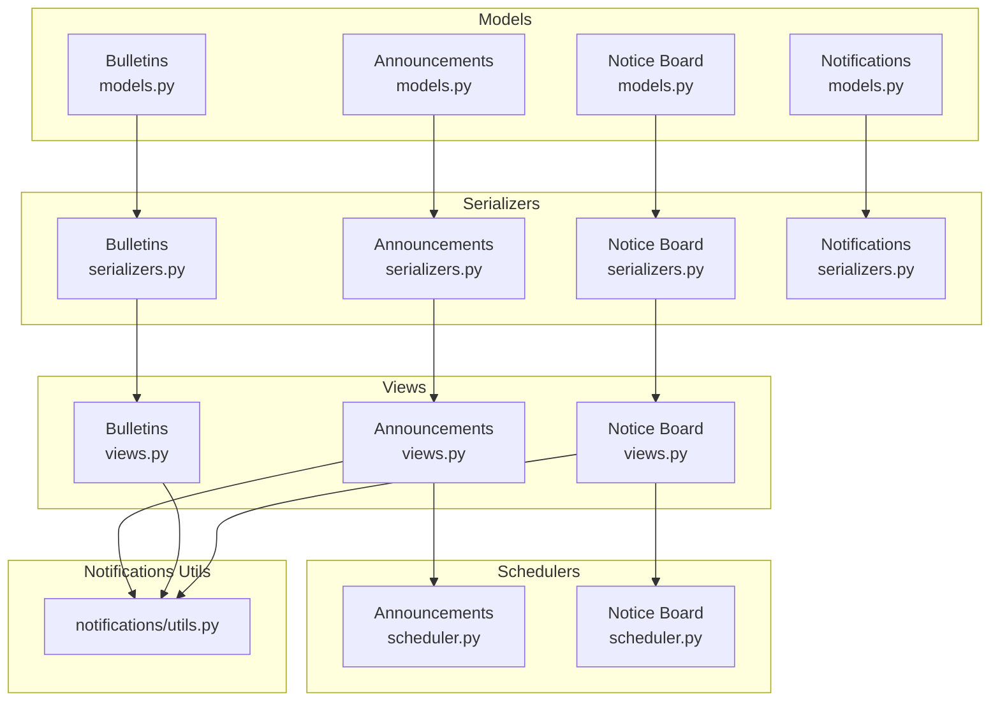

**Diagram sources**
- [announcements/models.py](file://backend/announcements/models.py#L11-L148)
- [bulletins/models.py](file://backend/bulletins/models.py#L10-L121)
- [noticeboard/models.py](file://backend/noticeboard/models.py#L10-L146)
- [notifications/models.py](file://backend/notifications/models.py#L6-L184)
- [announcements/serializers.py](file://backend/announcements/serializers.py#L97-L520)
- [bulletins/serializers.py](file://backend/bulletins/serializers.py#L54-L389)
- [noticeboard/serializers.py](file://backend/noticeboard/serializers.py#L107-L361)
- [notifications/serializers.py](file://backend/notifications/serializers.py#L25-L128)
- [announcements/views.py](file://backend/announcements/views.py#L44-L800)
- [bulletins/views.py](file://backend/bulletins/views.py#L34-L800)
- [noticeboard/views.py](file://backend/noticeboard/views.py#L32-L800)
- [announcements/scheduler.py](file://backend/announcements/scheduler.py#L13-L120)
- [noticeboard/scheduler.py](file://backend/noticeboard/scheduler.py#L13-L122)
- [notifications/utils.py](file://backend/notifications/utils.py#L1-L800)

**Section sources**
- [announcements/models.py](file://backend/announcements/models.py#L11-L148)
- [bulletins/models.py](file://backend/bulletins/models.py#L10-L121)
- [noticeboard/models.py](file://backend/noticeboard/models.py#L10-L146)
- [notifications/models.py](file://backend/notifications/models.py#L6-L184)

## Core Components
- Announcement model: time-bound content with priority, visibility targeting, status automation, and history tracking.
- Bulletin model: editorial content with approval workflow, status lifecycle, moderation reports, and history tracking.
- Notice model: time-bound notices with priority, visibility targeting, status automation, and history tracking.
- Notification model: centralized notification system with dynamic types, priority levels, and retroactive filtering.
- Schedulers: background tasks to automatically transition content from upcoming to ongoing and trigger notifications.

Key capabilities:
- Visibility targeting via many-to-many relationships with towers and units.
- Priority system mapped to urgency levels.
- Scheduling and status automation for time-bound content.
- Approval workflows for bulletins.
- Moderation reporting for bulletins.
- Comprehensive content history tracking.
- Dynamic notification generation and retroactive filtering.

**Section sources**
- [announcements/models.py](file://backend/announcements/models.py#L11-L148)
- [bulletins/models.py](file://backend/bulletins/models.py#L10-L121)
- [noticeboard/models.py](file://backend/noticeboard/models.py#L10-L146)
- [notifications/models.py](file://backend/notifications/models.py#L6-L184)
- [announcements/scheduler.py](file://backend/announcements/scheduler.py#L13-L120)
- [noticeboard/scheduler.py](file://backend/noticeboard/scheduler.py#L13-L122)

## Architecture Overview
The system separates concerns across models, serializers, views, schedulers, and notification utilities. Views orchestrate creation, updates, and status transitions, invoking notification utilities to compute recipients and apply retroactive filtering. Schedulers periodically check upcoming content and trigger automated transitions and notifications.

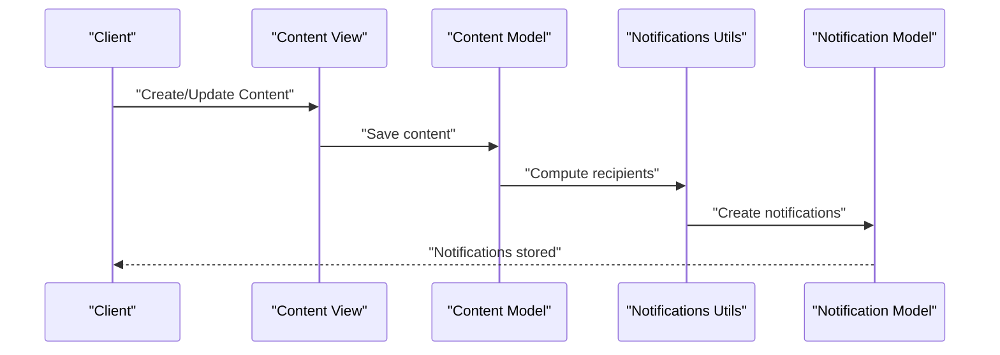

**Diagram sources**
- [announcements/views.py](file://backend/announcements/views.py#L136-L254)
- [bulletins/views.py](file://backend/bulletins/views.py#L266-L399)
- [noticeboard/views.py](file://backend/noticeboard/views.py#L142-L279)
- [notifications/utils.py](file://backend/notifications/utils.py#L410-L800)
- [notifications/models.py](file://backend/notifications/models.py#L93-L184)

## Detailed Component Analysis

### Announcement System
- Data model: includes title, description, authoring metadata (post_as, posted_group, posted_member), priority, label, visibility timing, status, audience targeting (towers/units), pins, views, and timestamps. Status is calculated based on current date/time and supports manual expiration.
- Attachments: file uploads with validation and storage metadata.
- History: tracks edits with JSON-encoded field changes.
- Lifecycle: draft → upcoming → ongoing → expired; scheduler monitors upcoming to ongoing transitions.
- Notifications: triggered on publish, schedule, ongoing, update, and restoration events.

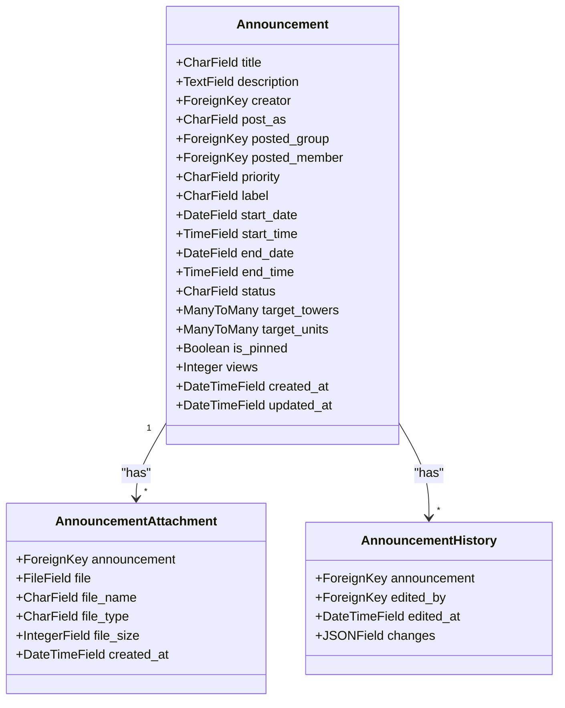

**Diagram sources**
- [announcements/models.py](file://backend/announcements/models.py#L11-L148)
- [announcements/models.py](file://backend/announcements/models.py#L150-L184)

**Section sources**
- [announcements/models.py](file://backend/announcements/models.py#L11-L148)
- [announcements/models.py](file://backend/announcements/models.py#L150-L184)
- [announcements/serializers.py](file://backend/announcements/serializers.py#L97-L520)
- [announcements/views.py](file://backend/announcements/views.py#L44-L800)
- [announcements/scheduler.py](file://backend/announcements/scheduler.py#L13-L120)

### Bulletin System
- Data model: editorial content with status lifecycle (current/pending/archive), priority, label, audience targeting, pins, and views.
- Attachments: file uploads with validation.
- History: tracks edits with comments and actions (created/updated/approved/rejected/archived/restored).
- Moderation: reports with predefined reasons and status tracking.
- Workflow: creation sets status to pending; approvals change to current and notify recipients; rejections remain pending; archived bulletins are hidden from feeds.
- Notifications: sent on creation, pending updates, approval, and rejection.

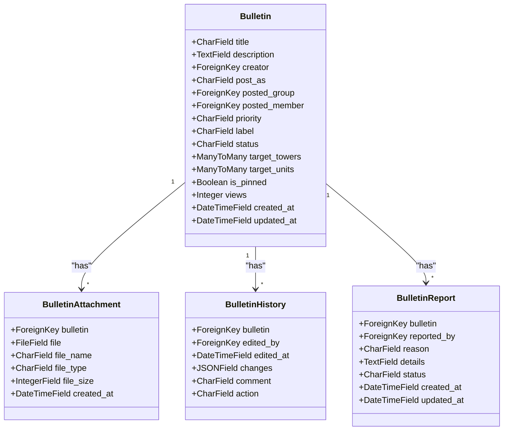

**Diagram sources**
- [bulletins/models.py](file://backend/bulletins/models.py#L10-L121)
- [bulletins/models.py](file://backend/bulletins/models.py#L123-L166)

**Section sources**
- [bulletins/models.py](file://backend/bulletins/models.py#L10-L121)
- [bulletins/models.py](file://backend/bulletins/models.py#L123-L166)
- [bulletins/serializers.py](file://backend/bulletins/serializers.py#L54-L389)
- [bulletins/views.py](file://backend/bulletins/views.py#L34-L800)

### Notice Board System
- Data model: time-bound notices with internal titles, authoring metadata, priority, label, visibility timing, status, audience targeting, pins, views, and timestamps. Status is calculated based on current date/time and supports manual expiration.
- Attachments: image and PDF uploads with validation.
- History: tracks edits with JSON-encoded field changes.
- Lifecycle: draft → upcoming → ongoing → expired; scheduler monitors upcoming to ongoing transitions.
- Notifications: triggered on creation when notices become ongoing.

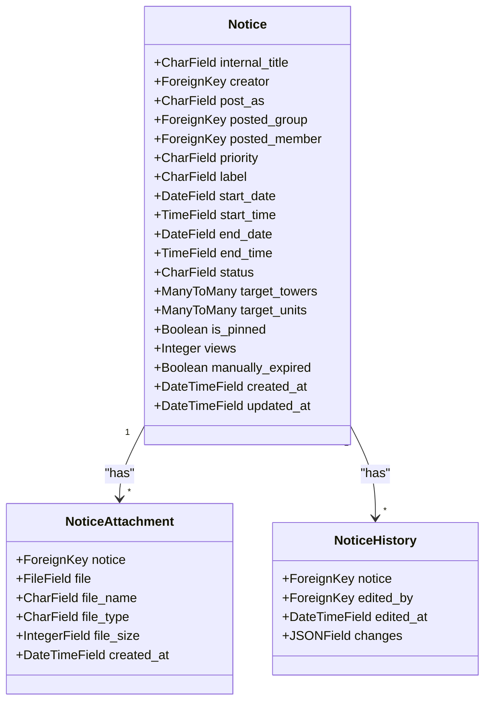

**Diagram sources**
- [noticeboard/models.py](file://backend/noticeboard/models.py#L10-L146)
- [noticeboard/models.py](file://backend/noticeboard/models.py#L161-L195)

**Section sources**
- [noticeboard/models.py](file://backend/noticeboard/models.py#L10-L146)
- [noticeboard/models.py](file://backend/noticeboard/models.py#L161-L195)
- [noticeboard/serializers.py](file://backend/noticeboard/serializers.py#L107-L361)
- [noticeboard/views.py](file://backend/noticeboard/views.py#L32-L800)
- [noticeboard/scheduler.py](file://backend/noticeboard/scheduler.py#L13-L122)

### Notification System
- NotificationType: master table for dynamic notification types with entity types, codes, names, descriptions, icons, activity flags, and priority.
- Notification: stores per-user notifications with entity references, priority, read status, and metadata.
- Utilities: compute recipients by permission, enforce retroactive filtering, and determine notification priority based on entity type and priority.

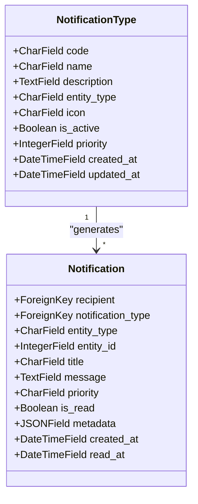

**Diagram sources**
- [notifications/models.py](file://backend/notifications/models.py#L6-L184)
- [notifications/serializers.py](file://backend/notifications/serializers.py#L25-L128)

**Section sources**
- [notifications/models.py](file://backend/notifications/models.py#L6-L184)
- [notifications/serializers.py](file://backend/notifications/serializers.py#L25-L128)
- [notifications/utils.py](file://backend/notifications/utils.py#L20-L800)

### Visibility Targeting System
- Announcements and Notices use many-to-many relationships with towers and units to define audience scope.
- Bulletins use the same relationships; if none are selected, notifications are sent to all eligible members with view permissions.
- Recipients are computed dynamically at notification creation time and filtered by current permissions and retroactive timestamps.

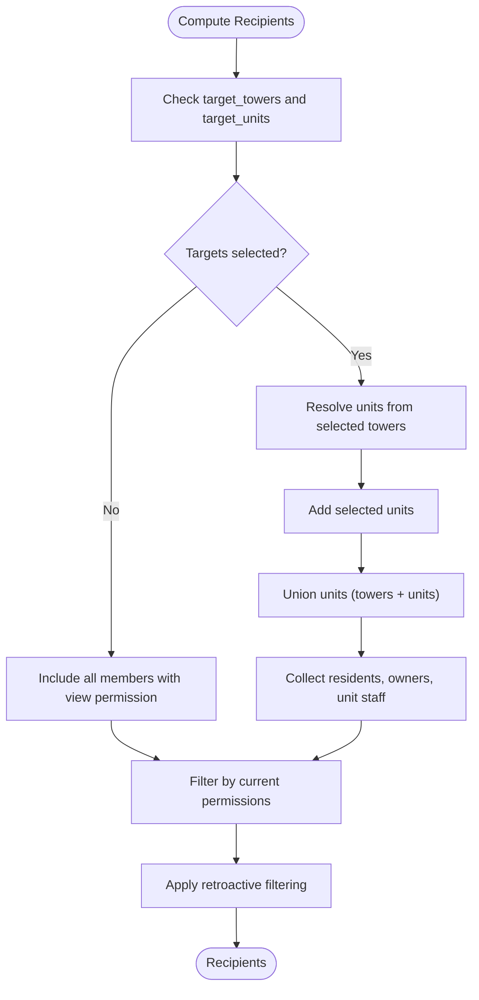

**Diagram sources**
- [announcements/views.py](file://backend/announcements/views.py#L224-L253)
- [bulletins/views.py](file://backend/bulletins/views.py#L364-L399)
- [noticeboard/views.py](file://backend/noticeboard/views.py#L266-L279)
- [notifications/utils.py](file://backend/notifications/utils.py#L410-L800)

**Section sources**
- [announcements/views.py](file://backend/announcements/views.py#L224-L253)
- [bulletins/views.py](file://backend/bulletins/views.py#L364-L399)
- [noticeboard/views.py](file://backend/noticeboard/views.py#L266-L279)
- [notifications/utils.py](file://backend/notifications/utils.py#L410-L800)

### Priority System and Scheduling Mechanisms
- Priority levels: urgent, high, normal/medium, low.
- Priority mapping: entity-specific priority overrides defaults; certain notification codes elevate priority.
- Schedulers: background threads check upcoming announcements/notices every minute and transition them to ongoing, then trigger notifications.

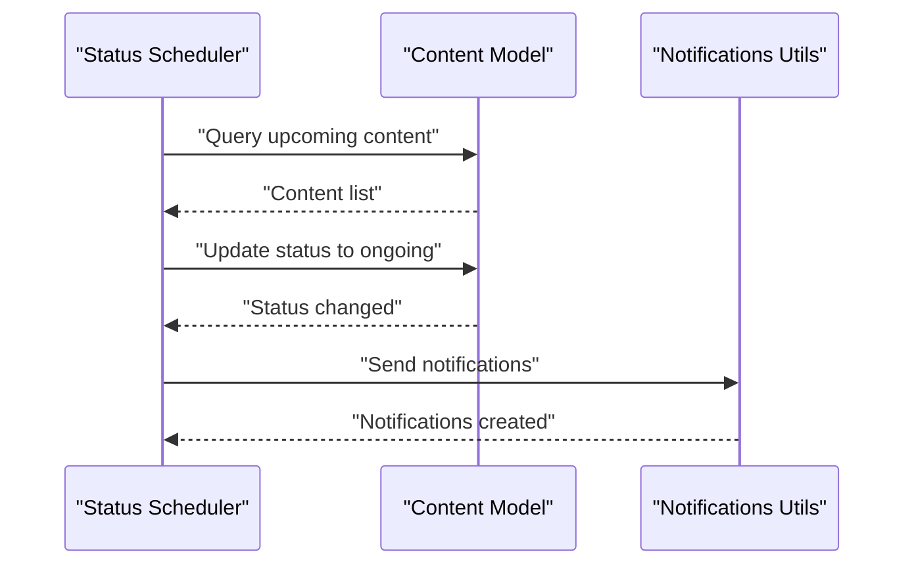

**Diagram sources**
- [announcements/scheduler.py](file://backend/announcements/scheduler.py#L51-L100)
- [noticeboard/scheduler.py](file://backend/noticeboard/scheduler.py#L51-L101)
- [notifications/utils.py](file://backend/notifications/utils.py#L20-L72)

**Section sources**
- [announcements/scheduler.py](file://backend/announcements/scheduler.py#L13-L120)
- [noticeboard/scheduler.py](file://backend/noticeboard/scheduler.py#L13-L122)
- [notifications/utils.py](file://backend/notifications/utils.py#L20-L72)

### Approval Workflows and Moderation
- Bulletins: creation sets status to pending; upon approval, status becomes current and notifications are sent; rejections keep pending; archived bulletins are hidden.
- Moderation reports: members can report bulletins with predefined reasons and optional details; reports track status (pending/reviewed/resolved/dismissed).

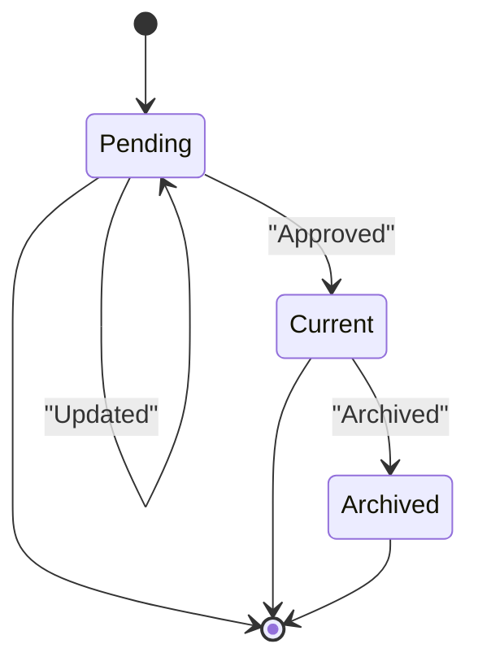

**Diagram sources**
- [bulletins/models.py](file://backend/bulletins/models.py#L24-L49)
- [bulletins/views.py](file://backend/bulletins/views.py#L508-L679)
- [bulletins/models.py](file://backend/bulletins/models.py#L123-L166)

**Section sources**
- [bulletins/models.py](file://backend/bulletins/models.py#L24-L49)
- [bulletins/views.py](file://backend/bulletins/views.py#L508-L679)
- [bulletins/models.py](file://backend/bulletins/models.py#L123-L166)

### Attachment Handling and Content History
- Attachments: validated file types and sizes; stored with metadata; supported formats differ by content type (announcements/bulletins vs notices).
- History: captures field changes and edit metadata; announcements and notices store JSON-encoded diffs; bulletins capture comments and actions.

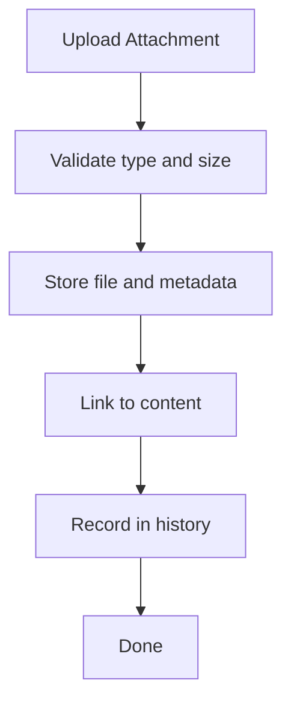

**Diagram sources**
- [announcements/models.py](file://backend/announcements/models.py#L150-L168)
- [bulletins/models.py](file://backend/bulletins/models.py#L78-L94)
- [noticeboard/models.py](file://backend/noticeboard/models.py#L161-L178)
- [announcements/serializers.py](file://backend/announcements/serializers.py#L138-L281)
- [bulletins/serializers.py](file://backend/bulletins/serializers.py#L138-L234)
- [noticeboard/serializers.py](file://backend/noticeboard/serializers.py#L143-L218)

**Section sources**
- [announcements/models.py](file://backend/announcements/models.py#L150-L168)
- [bulletins/models.py](file://backend/bulletins/models.py#L78-L94)
- [noticeboard/models.py](file://backend/noticeboard/models.py#L161-L178)
- [announcements/serializers.py](file://backend/announcements/serializers.py#L138-L281)
- [bulletins/serializers.py](file://backend/bulletins/serializers.py#L138-L234)
- [noticeboard/serializers.py](file://backend/noticeboard/serializers.py#L143-L218)

### Notification Triggers and Relationship to Published Content
- Announcements: notifications on publish (ongoing), scheduled (upcoming), status change (upcoming→ongoing), update, and restoration.
- Bulletins: notifications on creation (pending), pending updates, approval, and rejection.
- Notices: notifications on creation; status transitions from upcoming to ongoing trigger posting notifications.
- Retroactive filtering: recipients only see notifications for content created after they gained view permission.

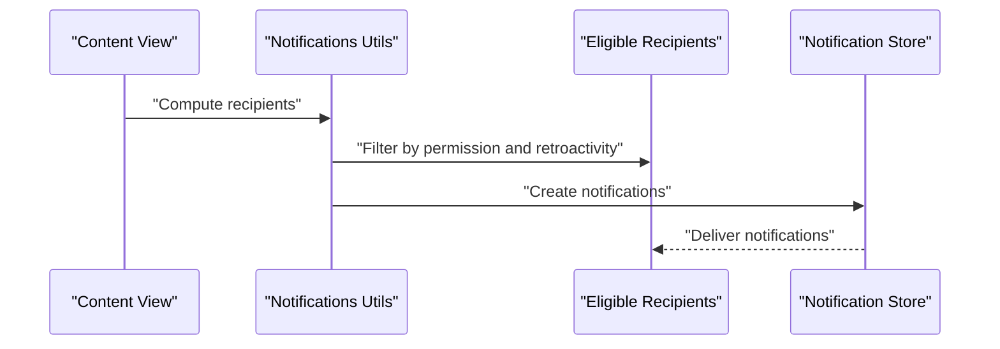

**Diagram sources**
- [announcements/views.py](file://backend/announcements/views.py#L224-L253)
- [bulletins/views.py](file://backend/bulletins/views.py#L364-L399)
- [noticeboard/views.py](file://backend/noticeboard/views.py#L266-L279)
- [notifications/utils.py](file://backend/notifications/utils.py#L74-L265)

**Section sources**
- [announcements/views.py](file://backend/announcements/views.py#L224-L253)
- [bulletins/views.py](file://backend/bulletins/views.py#L364-L399)
- [noticeboard/views.py](file://backend/noticeboard/views.py#L266-L279)
- [notifications/utils.py](file://backend/notifications/utils.py#L74-L265)

### Content Lifecycle Management, Archiving, and Versioning
- Lifecycle: announcements and notices follow draft/upcoming/ongoing/expired; bulletins follow pending/current/archive.
- Archiving: bulletins can be archived; archived bulletins are excluded from feeds.
- Versioning: content history records changes with JSON-encoded diffs; bulletins include comments/actions for audit trails.
- Restoration: announcements can be restored from expired state; status recalculated and notifications resent if applicable.

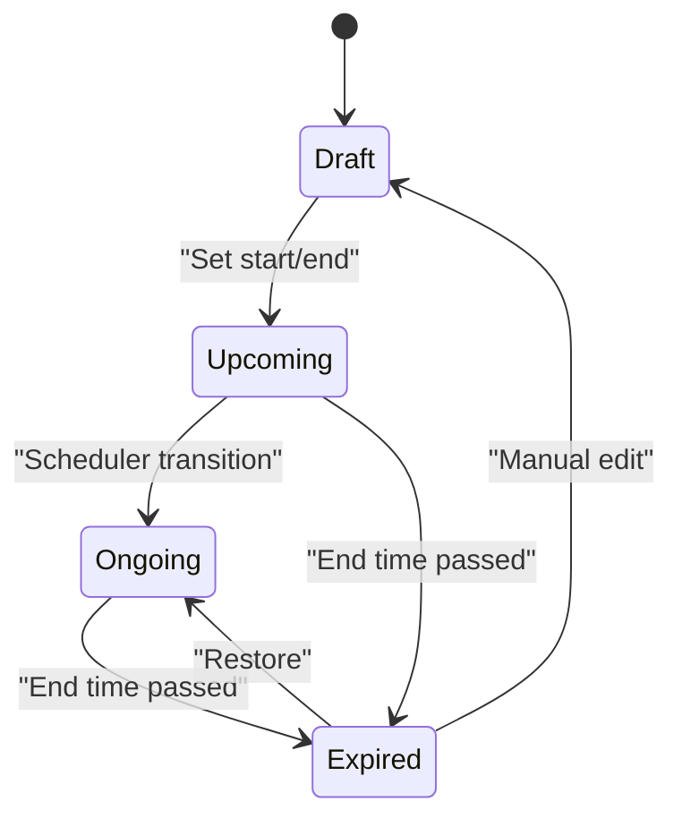

**Diagram sources**
- [announcements/models.py](file://backend/announcements/models.py#L91-L124)
- [noticeboard/models.py](file://backend/noticeboard/models.py#L113-L146)
- [bulletins/models.py](file://backend/bulletins/models.py#L24-L49)

**Section sources**
- [announcements/models.py](file://backend/announcements/models.py#L91-L124)
- [noticeboard/models.py](file://backend/noticeboard/models.py#L113-L146)
- [bulletins/models.py](file://backend/bulletins/models.py#L24-L49)

## Dependency Analysis
The system exhibits clear separation of concerns:
- Views depend on models and serializers for persistence and validation.
- Notifications utilities depend on models and permission systems to compute recipients.
- Schedulers depend on models to query upcoming content and on notifications utilities to dispatch alerts.
- Serializers encapsulate complex logic for history tracking and relationship updates.

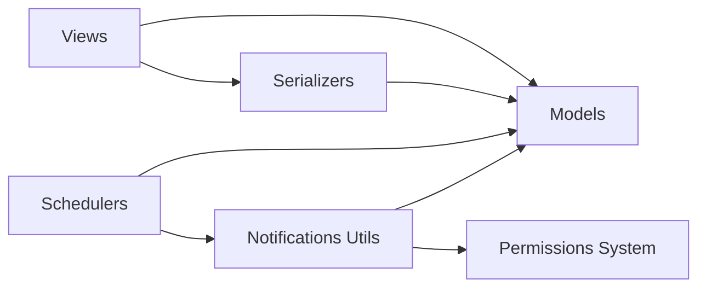

**Diagram sources**
- [announcements/views.py](file://backend/announcements/views.py#L44-L800)
- [bulletins/views.py](file://backend/bulletins/views.py#L34-L800)
- [noticeboard/views.py](file://backend/noticeboard/views.py#L32-L800)
- [announcements/scheduler.py](file://backend/announcements/scheduler.py#L51-L100)
- [noticeboard/scheduler.py](file://backend/noticeboard/scheduler.py#L51-L101)
- [notifications/utils.py](file://backend/notifications/utils.py#L410-L800)

**Section sources**
- [announcements/views.py](file://backend/announcements/views.py#L44-L800)
- [bulletins/views.py](file://backend/bulletins/views.py#L34-L800)
- [noticeboard/views.py](file://backend/noticeboard/views.py#L32-L800)
- [announcements/scheduler.py](file://backend/announcements/scheduler.py#L51-L100)
- [noticeboard/scheduler.py](file://backend/noticeboard/scheduler.py#L51-L101)
- [notifications/utils.py](file://backend/notifications/utils.py#L410-L800)

## Performance Considerations
- Indexes: models define composite indexes for status, priority, dates, and creator to optimize filtering and ordering.
- Select/Prefetch: views use select_related and prefetch_related to minimize N+1 queries and reduce payload sizes.
- Pagination: list views support pagination and caching headers to improve responsiveness.
- Background schedulers: periodic checks avoid real-time overhead and batch status updates.

[No sources needed since this section provides general guidance]

## Troubleshooting Guide
Common issues and resolutions:
- Status not updating: verify schedulers are running and that start/end times are set; check manual expiration flags.
- Notifications not sent: confirm recipients meet permission and retroactive criteria; inspect notification creation logs.
- Attachment failures: validate file types and sizes; review serializers’ validation logic.
- History not recorded: ensure changes are detected and serializer writes history entries.

**Section sources**
- [announcements/scheduler.py](file://backend/announcements/scheduler.py#L13-L120)
- [noticeboard/scheduler.py](file://backend/noticeboard/scheduler.py#L13-L122)
- [notifications/utils.py](file://backend/notifications/utils.py#L74-L265)
- [announcements/serializers.py](file://backend/announcements/serializers.py#L218-L281)
- [bulletins/serializers.py](file://backend/bulletins/serializers.py#L615-L664)
- [noticeboard/serializers.py](file://backend/noticeboard/serializers.py#L167-L218)

## Conclusion
The communication portal’s data models provide robust support for multi-tiered content distribution with precise visibility targeting, dynamic priority levels, automated scheduling, and comprehensive approval/moderation workflows. The notification system ensures timely, permission-aware delivery of content updates, while history and moderation features maintain transparency and governance. Together, these components enable scalable, secure, and user-centric communication across announcements, bulletins, and notices.