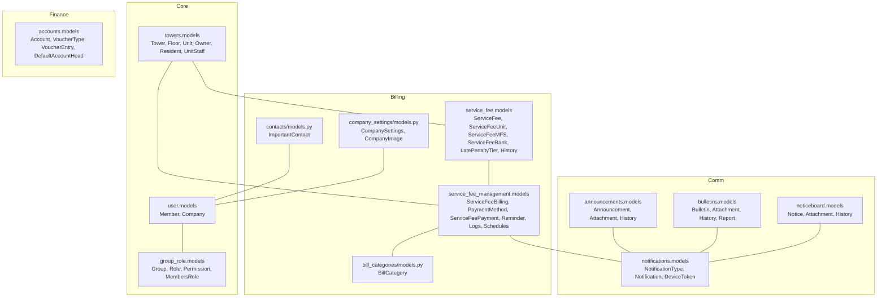
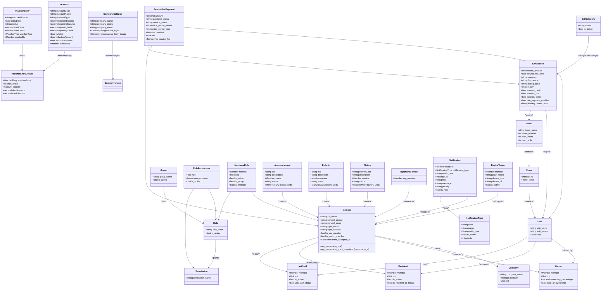
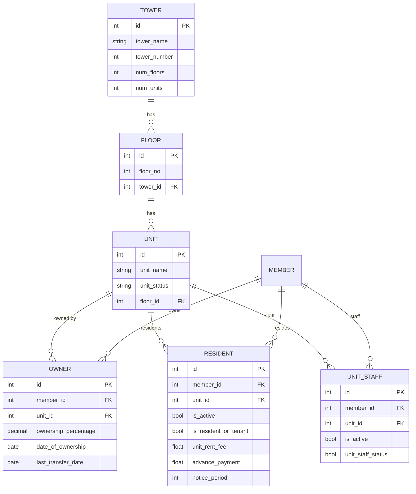
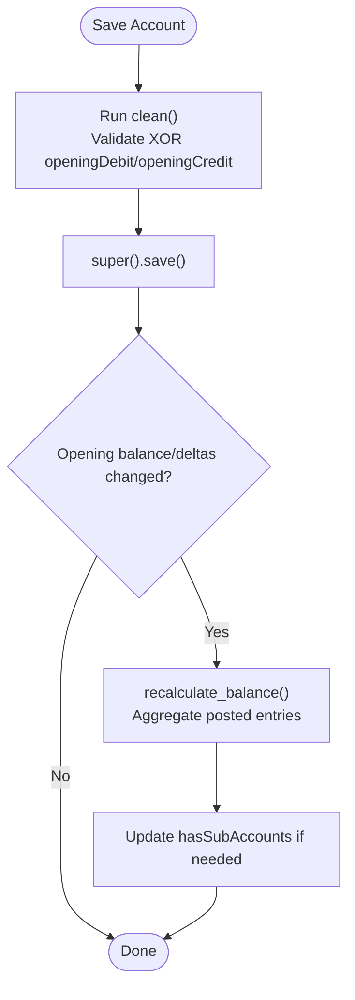
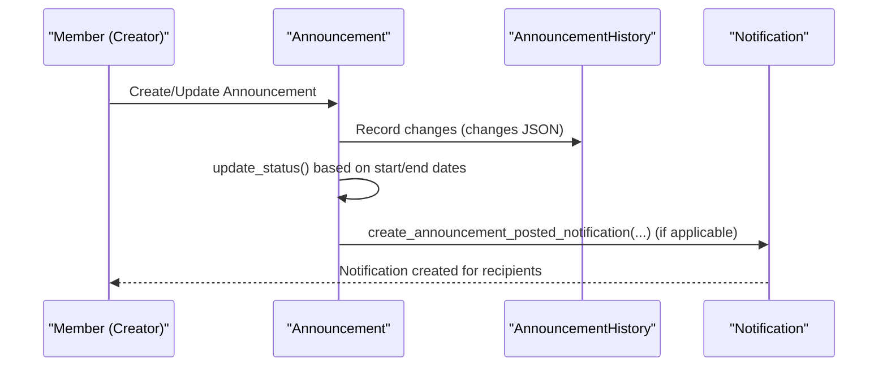
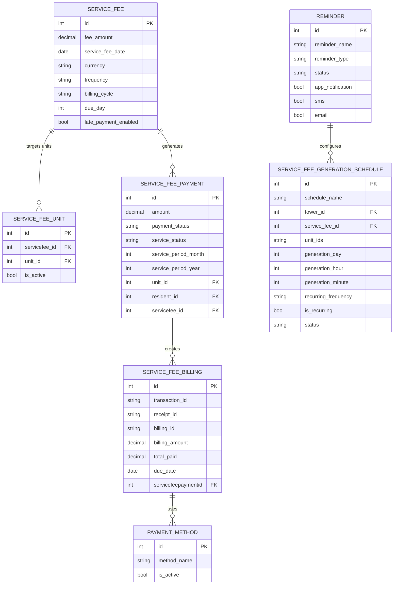
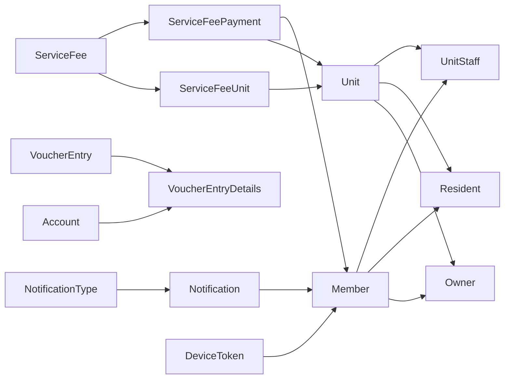

# Database Schema & Models

<cite>
**Referenced Files in This Document**
- [backend/settings.py](file://backend/settings.py)
- [user/models.py](file://user/models.py)
- [towers/models.py](file://towers/models.py)
- [group_role/models.py](file://group_role/models.py)
- [accounts/models.py](file://accounts/models.py)
- [accounts/migrations/0017_fix_opening_balance_columns.py](file://accounts/migrations/0017_fix_opening_balance_columns.py)
- [accounts/migrations/0018_account_openingcredit_account_openingdebit.py](file://accounts/migrations/0018_account_openingcredit_account_openingdebit.py)
- [accounts/migrations/0019_fix_account_field_defaults.py](file://accounts/migrations/0019_fix_account_field_defaults.py)
- [announcements/models.py](file://announcements/models.py)
- [bulletins/models.py](file://bulletins/models.py)
- [noticeboard/models.py](file://noticeboard/models.py)
- [service_fee/models.py](file://service_fee/models.py)
- [service_fee_management/models.py](file://service_fee_management/models.py)
- [bill_categories/models.py](file://bill_categories/models.py)
- [contacts/models.py](file://contacts/models.py)
- [company_settings/models.py](file://company_settings/models.py)
- [notifications/models.py](file://notifications/models.py)
- [notifications/migrations/0015_rename_token_fields.py](file://notifications/migrations/0015_rename_token_fields.py)
- [notifications/migrations/0016_remove_devicetoken_unique_constraint.py](file://notifications/migrations/0016_remove_devicetoken_unique_constraint.py)
- [notifications/views.py](file://notifications/views.py)
</cite>

## Update Summary
**Changes Made**
- Updated notification system documentation to reflect removal of unique constraint from DeviceToken model
- Updated migration strategy documentation to include SeparateDatabaseAndState pattern for improved database operation control
- Enhanced DeviceToken model documentation to reflect flexible registration allowing multiple device token instances
- Updated troubleshooting guidance for notification system changes and improved device token management
- Added comprehensive coverage of database operations vs state operations separation

## Table of Contents
1. [Introduction](#introduction)
2. [Project Structure](#project-structure)
3. [Core Components](#core-components)
4. [Architecture Overview](#architecture-overview)
5. [Detailed Component Analysis](#detailed-component-analysis)
6. [Dependency Analysis](#dependency-analysis)
7. [Performance Considerations](#performance-considerations)
8. [Troubleshooting Guide](#troubleshooting-guide)
9. [Conclusion](#conclusion)

## Introduction
This document provides comprehensive data model documentation for the Django ORM models across the backend applications. It covers entity relationships, field definitions, data types, primary/foreign keys, indexes, and database constraints. It also explains how models relate to API endpoints (as implemented by views and serializers), outlines validation rules and business logic constraints, and describes the migration strategy, schema evolution patterns, and data seeding processes. Performance considerations, query optimization, and indexing strategies are addressed to guide efficient usage of the models.

## Project Structure
The backend is organized into multiple Django apps, each encapsulating a domain area:
- user: Membership, profiles, and authentication-related entities
- towers: Buildings, floors, units, ownership, residency, staff, and histories
- group_role: Groups, roles, permissions, and global permission settings
- accounts: Chart of accounts, voucher types, entries, and default account heads
- announcements, bulletins, noticeboard: Community communication content and attachments
- service_fee: Service fee configurations and related metadata
- service_fee_management: Billing, payments, reminders, and penalty management
- bill_categories: Utility bill categories used in service fee management
- contacts: Important organizational contacts
- company_settings: Company-wide settings and images
- notifications: Dynamic notification types and delivery records

**Diagram sources**
- [user/models.py](file://user/models.py#L15-L51)
- [towers/models.py](file://towers/models.py#L7-L24)
- [group_role/models.py](file://group_role/models.py#L7-L93)
- [accounts/models.py](file://accounts/models.py#L9-L64)
- [announcements/models.py](file://announcements/models.py#L11-L89)
- [bulletins/models.py](file://bulletins/models.py#L10-L75)
- [noticeboard/models.py](file://noticeboard/models.py#L10-L83)
- [service_fee/models.py](file://service_fee/models.py#L10-L84)
- [service_fee_management/models.py](file://service_fee_management/models.py#L11-L62)
- [bill_categories/models.py](file://bill_categories/models.py#L5-L86)
- [contacts/models.py](file://contacts/models.py#L7-L56)
- [company_settings/models.py](file://company_settings/models.py#L21-L71)
- [notifications/models.py](file://notifications/models.py#L6-L90)

**Section sources**
- [backend/settings.py](file://backend/settings.py#L53-L78)

## Core Components
This section summarizes the principal models and their responsibilities.

- user.models
  - Member: Person with personal details, photos, organization membership flags, terms acceptance, and audit fields
  - Company: Links to Member and Unit, with audit fields
- towers.models
  - Tower, Floor, Unit: Building hierarchy and unit metadata
  - Owner, Resident, UnitStaff: Ownership, residency, and staff relationships
  - UnitOwnershipHistory, UnitStaffHistory, UnitResidentHistory: Timeline/history of changes
- group_role.models
  - Group, Role, Permission, RolePermission, RoleGroup, MembersRole, GlobalRolePermission: Role-based access control
- accounts.models
  - Account, VoucherType, VoucherEntry, VoucherEntryDetails, DefaultAccountHead: Chart of accounts and accounting entries
- communications
  - announcements.models: Announcement content, attachments, history
  - bulletins.models: Bulletin content, attachments, history, reports
  - noticeboard.models: Notice content, attachments, history
  - notifications.models: Notification types, notifications, device tokens
- service_fee and service_fee_management
  - service_fee.models: Service fee settings, MFS/Bank accounts, late penalty tiers, history
  - service_fee_management.models: Billing records, payments, reminders, logs, schedules
- bill_categories.models: Bill categories for service fee management
- contacts.models: Important contacts derived from Member
- company_settings.models: Singleton company settings and images

**Section sources**
- [user/models.py](file://user/models.py#L15-L51)
- [towers/models.py](file://towers/models.py#L7-L24)
- [group_role/models.py](file://group_role/models.py#L7-L93)
- [accounts/models.py](file://accounts/models.py#L9-L64)
- [announcements/models.py](file://announcements/models.py#L11-L89)
- [bulletins/models.py](file://bulletins/models.py#L10-L75)
- [noticeboard/models.py](file://noticeboard/models.py#L10-L83)
- [service_fee/models.py](file://service_fee/models.py#L10-L84)
- [service_fee_management/models.py](file://service_fee_management/models.py#L11-L62)
- [bill_categories/models.py](file://bill_categories/models.py#L5-L86)
- [contacts/models.py](file://contacts/models.py#L7-L56)
- [company_settings/models.py](file://company_settings/models.py#L21-L71)
- [notifications/models.py](file://notifications/models.py#L6-L90)

## Architecture Overview
The system follows a layered architecture:
- Domain models encapsulate business entities and relationships
- Views and serializers expose REST endpoints mapped to models
- Notifications integrate with communication workflows
- Accounting and finance modules maintain integrity via validation and constraints
- Migration files evolve schema safely across releases

**Diagram sources**
- [user/models.py](file://user/models.py#L15-L51)
- [towers/models.py](file://towers/models.py#L7-L24)
- [group_role/models.py](file://group_role/models.py#L7-L93)
- [accounts/models.py](file://accounts/models.py#L9-L64)
- [announcements/models.py](file://announcements/models.py#L11-L89)
- [bulletins/models.py](file://bulletins/models.py#L10-L75)
- [noticeboard/models.py](file://noticeboard/models.py#L10-L83)
- [service_fee/models.py](file://service_fee/models.py#L10-L84)
- [service_fee_management/models.py](file://service_fee_management/models.py#L190-L267)
- [bill_categories/models.py](file://bill_categories/models.py#L5-L86)
- [contacts/models.py](file://contacts/models.py#L7-L56)
- [company_settings/models.py](file://company_settings/models.py#L21-L71)
- [notifications/models.py](file://notifications/models.py#L93-L184)
- [notifications/models.py](file://notifications/models.py#L177-L229)

## Detailed Component Analysis

### User and Organization Models
- Member
  - Fields: personal identifiers, contact info, photos, organization flags, terms acceptance, audit fields
  - Relationships: OneToOne with Django User, foreign keys to self for created_by/updated_by, many-to-many via MembersRole
  - Constraints: unique login_email, unique login_contact, unique nid_number; File extensions validated for photos
  - Business logic: permission resolution via MembersRole and RolePermission; permission grant timestamps computed for notification filtering
- Company
  - Links Member and Unit; audit fields; unique constraints enforced via related_name usage

**Section sources**
- [user/models.py](file://user/models.py#L15-L51)
- [user/models.py](file://user/models.py#L175-L199)

### Towers and Units
- Tower, Floor, Unit
  - Hierarchical structure; Unit has status and metadata; UnitDocs and ResidentDocs store attachments
- Ownership, Residency, Staff
  - Owner: ownership percentage, transfer tracking, audit fields
  - Resident: residency status, rent and advance info, notice period
  - UnitStaff: staff status (live-in/part-time)
- Histories
  - UnitOwnershipHistory, UnitStaffHistory, UnitResidentHistory: JSON snapshots of state before/after events, supporting timeline views

**Diagram sources**
- [towers/models.py](file://towers/models.py#L7-L24)
- [towers/models.py](file://towers/models.py#L60-L121)
- [towers/models.py](file://towers/models.py#L193-L221)
- [towers/models.py](file://towers/models.py#L149-L167)
- [towers/models.py](file://towers/models.py#L240-L254)

**Section sources**
- [towers/models.py](file://towers/models.py#L7-L24)
- [towers/models.py](file://towers/models.py#L60-L121)
- [towers/models.py](file://towers/models.py#L149-L167)
- [towers/models.py](file://towers/models.py#L193-L221)
- [towers/models.py](file://towers/models.py#L257-L357)
- [towers/models.py](file://towers/models.py#L701-L810)
- [towers/models.py](file://towers/models.py#L964-L1057)

### Access Control (Group & Role)
- Group, Role, Permission: core RBAC entities
- RolePermission: many-to-many with activation flag
- MembersRole: links members to roles with activation and type flags
- GlobalRolePermission: global defaults and protection flags

**Section sources**
- [group_role/models.py](file://group_role/models.py#L7-L93)
- [group_role/models.py](file://group_role/models.py#L96-L140)

### Accounting (Chart of Accounts)
- Account: hierarchical chart of accounts with balances, opening balances, and type classification
- VoucherType: receipt/payment/journal/contra types
- VoucherEntry: header with status and totals; VoucherEntryDetails: line items with debit/credit validation
- DefaultAccountHead: default mappings for transaction types

**Updated** Enhanced accounting system with comprehensive default constraints through migration 0019_fix_account_field_defaults.py

The accounting system now enforces strict default constraints across all monetary and boolean fields to prevent null pointer exceptions and ensure data integrity:

- **Monetary Fields (DECIMAL(15, 2))**: openingBalance, currentBalance, openingDebit, openingCredit, totalDebit, totalCredit, debitAmount, creditAmount all have NOT NULL DEFAULT 0
- **Status Fields (VARCHAR(20))**: status fields default to 'draft' for proper workflow initialization
- **Boolean Fields (TINYINT(1)/BOOLEAN)**: isActive, isSystemAccount, hasSubAccounts, and related fields default to appropriate values (true for active, false for inactive)
- **Line Number Field**: lineNumber defaults to 1 for proper sequential ordering

These constraints are enforced at the database level through raw SQL operations in the migration, ensuring consistent behavior across all accounting operations. The migration handles different database vendors (MySQL, PostgreSQL, SQLite) with appropriate SQL syntax for each platform.

**Diagram sources**
- [accounts/models.py](file://accounts/models.py#L66-L126)
- [accounts/models.py](file://accounts/models.py#L127-L156)

**Section sources**
- [accounts/models.py](file://accounts/models.py#L9-L64)
- [accounts/models.py](file://accounts/models.py#L201-L284)
- [accounts/models.py](file://accounts/models.py#L286-L331)
- [accounts/models.py](file://accounts/models.py#L333-L410)
- [accounts/migrations/0017_fix_opening_balance_columns.py](file://accounts/migrations/0017_fix_opening_balance_columns.py#L1-L122)
- [accounts/migrations/0018_account_openingcredit_account_openingdebit.py](file://accounts/migrations/0018_account_openingcredit_account_openingdebit.py#L1-L29)
- [accounts/migrations/0019_fix_account_field_defaults.py](file://accounts/migrations/0019_fix_account_field_defaults.py#L1-L255)

### Communications (Announcements, Bulletins, Notices)
- Announcement: title/description, author/posting context, priority/label, visibility window, status, audience (towers/units), attachments, history
- Bulletin: similar structure with manual status and reporting
- Notice: title/description, author/posting context, priority/label, visibility window, status, audience (towers/units), attachments, history
- Notifications: dynamic types and delivery records

**Diagram sources**
- [announcements/models.py](file://announcements/models.py#L91-L124)
- [announcements/models.py](file://announcements/models.py#L170-L184)
- [noticeboard/models.py](file://noticeboard/models.py#L113-L159)
- [noticeboard/models.py](file://noticeboard/models.py#L161-L179)
- [notifications/models.py](file://notifications/models.py#L93-L184)

**Section sources**
- [announcements/models.py](file://announcements/models.py#L11-L89)
- [bulletins/models.py](file://bulletins/models.py#L10-L75)
- [noticeboard/models.py](file://noticeboard/models.py#L10-L83)
- [notifications/models.py](file://notifications/models.py#L6-L90)
- [notifications/models.py](file://notifications/models.py#L93-L184)

### Service Fees and Payments
- ServiceFee: fee amount, currency, frequency, billing cycle, due day, accepted payment methods, reminders, late payment enablement, M2M towers/units via ServiceFeeUnit
- ServiceFeeMFS, ServiceFeeBank: payment method details with validations
- LatePenaltyTier: tiered penalty percentages by days overdue
- ServiceFeeHistory: audit trail of changes
- service_fee_management:
  - ServiceFeeBilling: normalized billing records with transaction/receipt/billing IDs, payment method, dates, totals
  - ServiceFeePayment: payment transactions with status/result, service period, relations to resident/unit/service_fee
  - PaymentMethod: payment method catalog
  - Reminder, ReminderTiming, ReminderPaymentStatus, ReminderTower, ReminderSpecificTarget, ReminderLog: reminder configuration and delivery logs
  - ServiceFeeGenerationSchedule: automatic generation schedules

**Diagram sources**
- [service_fee/models.py](file://service_fee/models.py#L10-L84)
- [service_fee/models.py](file://service_fee/models.py#L162-L179)
- [service_fee/models.py](file://service_fee/models.py#L182-L250)
- [service_fee/models.py](file://service_fee/models.py#L251-L310)
- [service_fee/models.py](file://service_fee/models.py#L312-L371)
- [service_fee/models.py](file://service_fee/models.py#L373-L414)
- [service_fee_management/models.py](file://service_fee_management/models.py#L11-L83)
- [service_fee_management/models.py](file://service_fee_management/models.py#L190-L267)
- [service_fee_management/models.py](file://service_fee_management/models.py#L168-L187)
- [service_fee_management/models.py](file://service_fee_management/models.py#L342-L540)
- [service_fee_management/models.py](file://service_fee_management/models.py#L711-L800)

**Section sources**
- [service_fee/models.py](file://service_fee/models.py#L10-L84)
- [service_fee/models.py](file://service_fee/models.py#L162-L179)
- [service_fee/models.py](file://service_fee/models.py#L182-L250)
- [service_fee/models.py](file://service_fee/models.py#L251-L310)
- [service_fee/models.py](file://service_fee/models.py#L312-L371)
- [service_fee/models.py](file://service_fee/models.py#L373-L414)
- [service_fee_management/models.py](file://service_fee_management/models.py#L11-L83)
- [service_fee_management/models.py](file://service_fee_management/models.py#L190-L267)
- [service_fee_management/models.py](file://service_fee_management/models.py#L168-L187)
- [service_fee_management/models.py](file://service_fee_management/models.py#L342-L540)
- [service_fee_management/models.py](file://service_fee_management/models.py#L711-L800)

### Bill Categories and Contacts
- BillCategory: utility categories with icons/colors and activity flag
- ImportantContact: references an organization Member and exposes derived fields

**Section sources**
- [bill_categories/models.py](file://bill_categories/models.py#L5-L86)
- [contacts/models.py](file://contacts/models.py#L7-L56)

### Company Settings and Notifications
- CompanySettings: singleton settings with active logo/login image references; enforces single instance
- CompanyImage: logos and login images with type classification
- NotificationType: dynamic types with entity mapping and priority
- Notification: recipient, type, generic entity reference, content, priority, read status, metadata
- DeviceToken: push notification tokens per member/platform with enhanced field naming and flexible registration

**Updated** Enhanced notification system with flexible device token registration and improved migration control

The notification system has undergone significant improvements in both schema design and migration management:

- **Flexible Device Token Registration**: Unique constraint removed from DeviceToken model, allowing multiple device token registrations per member. This addresses scenarios like cache clearing, user re-registration, or multi-device support without unique constraint violations.
- **Enhanced Device Support**: New 'device_id' field captures device identifiers for better device management and tracking.
- **Improved Migration Strategy**: Migration 0016 now uses SeparateDatabaseAndState pattern for better database operation control, separating database schema changes from Django state operations.
- **Advanced Database Operations**: Custom RunPython operations handle constraint detection and removal with proper fallback mechanisms for reverse migrations.

**Section sources**
- [company_settings/models.py](file://company_settings/models.py#L21-L71)
- [company_settings/models.py](file://company_settings/models.py#L74-L99)
- [notifications/models.py](file://notifications/models.py#L6-L90)
- [notifications/models.py](file://notifications/models.py#L93-L184)
- [notifications/models.py](file://notifications/models.py#L177-L229)
- [notifications/migrations/0015_rename_token_fields.py](file://notifications/migrations/0015_rename_token_fields.py#L1-L75)
- [notifications/migrations/0016_remove_devicetoken_unique_constraint.py](file://notifications/migrations/0016_remove_devicetoken_unique_constraint.py#L1-L73)
- [notifications/views.py](file://notifications/views.py#L570-L676)

## Dependency Analysis
Key dependencies and relationships:
- user.Member is central to ownership, residency, staff, and permissions
- towers.Unit is the core audience for announcements/notices/bulletins and service fee billing
- service_fee.ServiceFee targets towers/units via ServiceFeeUnit; service_fee_management.ServiceFeePayment references units/members/service_fee
- notifications.NotificationType drives dynamic notifications; notifications.Notification references entities generically
- accounts.Account integrates with voucher entries; DefaultAccountHead constrains default mappings
- **Enhanced**: DeviceToken now supports multiple registrations per member for improved user experience

**Diagram sources**
- [user/models.py](file://user/models.py#L15-L51)
- [towers/models.py](file://towers/models.py#L60-L121)
- [service_fee/models.py](file://service_fee/models.py#L162-L179)
- [service_fee_management/models.py](file://service_fee_management/models.py#L190-L267)
- [notifications/models.py](file://notifications/models.py#L93-L184)
- [accounts/models.py](file://accounts/models.py#L286-L331)
- [notifications/models.py](file://notifications/models.py#L177-L229)

**Section sources**
- [user/models.py](file://user/models.py#L15-L51)
- [towers/models.py](file://towers/models.py#L60-L121)
- [service_fee/models.py](file://service_fee/models.py#L162-L179)
- [service_fee_management/models.py](file://service_fee_management/models.py#L190-L267)
- [notifications/models.py](file://notifications/models.py#L93-L184)
- [accounts/models.py](file://accounts/models.py#L286-L331)
- [notifications/models.py](file://notifications/models.py#L177-L229)

## Performance Considerations
- Indexes
  - Announcement, Bulletin, Notice: composite and selective indexes on status, priority, creator, and date ranges
  - VoucherEntry: indexes on voucherNumber, entryDate, status, and composite ordering
  - VoucherEntryDetails: indexes on (voucherEntry, lineNumber) and account
  - Account: indexes on accountCode, isActive, accountType
  - Notifications: indexes on recipient, notification_type, entity_type+entity_id, priority, read status
  - **Enhanced**: DeviceToken indexes optimized for member/device token lookups with flexible registration support
  - CompanySettings: singleton enforcement via save/get_or_create pattern
- Query patterns
  - Prefetch related for many-to-many audiences on announcements/notices/bulletins
  - Select related for foreign keys to reduce N+1 queries
  - Aggregation for totals (e.g., billing total_paid) and balance recalculation
- Validation and constraints
  - Unique constraints on login_email, login_contact, nid_number
  - Unique constraints on important contact per org member
  - Unique constraints on payment method/account combinations
  - Debit/Credit XOR validation in voucher lines; posted entry equality validation
  - **Enhanced**: Database-level default constraints prevent null pointer exceptions across accounting operations
  - **Enhanced**: Flexible DeviceToken registration allows multiple device tokens per member with improved indexing
- Data seeding and migrations
  - Management commands for populating default account heads, voucher types, and demo data
  - Migrations evolve schema safely; indexes added incrementally; legacy unique constraints removed and normalized
  - **Enhanced**: Notification system migrations handle field renaming, constraint modifications, and advanced database operation separation

**Updated** Enhanced data integrity through comprehensive default constraints in migration 0019_fix_account_field_defaults.py

The accounting system now benefits from robust database-level constraints that prevent null pointer exceptions and ensure consistent data behavior:

- Monetary fields automatically default to 0, eliminating division-by-zero and calculation errors
- Status fields initialize to 'draft', preventing workflow inconsistencies
- Boolean fields maintain appropriate defaults (active/inactive), ensuring proper filtering and display
- Line numbering ensures sequential processing order in voucher entries

**Updated** Improved notification system performance through optimized indexing and flexible device token management

The notification system now offers better performance and user experience:

- **Optimized Indexes**: Enhanced indexing on DeviceToken for faster member and token lookups
- **Flexible Registration**: Multiple device token registrations per member are now fully supported without unique constraint overhead
- **Improved Field Naming**: Clearer semantics with 'push_token' and 'device_type' fields
- **Better Device Tracking**: New 'device_id' field enables granular device identification
- **Advanced Migration Control**: SeparateDatabaseAndState pattern ensures precise database operation control during schema changes

**Section sources**
- [accounts/migrations/0019_fix_account_field_defaults.py](file://accounts/migrations/0019_fix_account_field_defaults.py#L10-L53)
- [notifications/migrations/0015_rename_token_fields.py](file://notifications/migrations/0015_rename_token_fields.py#L1-L75)
- [notifications/migrations/0016_remove_devicetoken_unique_constraint.py](file://notifications/migrations/0016_remove_devicetoken_unique_constraint.py#L1-L73)

## Troubleshooting Guide
Common issues and resolutions:
- Duplicate unit assignment in active service fees
  - Detected via service fee validation; logs warning and defers to serializer-level error handling
- MFS account number validation
  - Strict validation for Bangladeshi mobile number format and prefixes
- Bank account validation
  - Numeric-only, length constraints per Bangladesh bank standards
- Voucher posting validation
  - Posted entries require totalDebit == totalCredit; otherwise raises validation error
- Notification delivery
  - Device tokens tracked per platform; ensure tokens are active and not duplicated
  - **Enhanced**: Multiple device tokens per member now supported; check 'push_token' field instead of legacy 'token'
- History snapshots
  - Ownership/resident/staff histories store JSON snapshots; verify before/after states for audits
- **New**: Accounting field validation failures
  - Database-level default constraints now prevent null values in critical accounting fields
  - Monetary calculations automatically handle zero defaults without explicit checks
  - Status fields consistently initialize to 'draft' for proper workflow progression
- **New**: Device token registration conflicts
  - Unique constraint removed; multiple registrations per member are now supported
  - Check for duplicate 'push_token' values within the same member using flexible filtering
  - Use 'device_id' field for device-specific tracking and management
  - Migration operations handled via SeparateDatabaseAndState for precise database control
- **New**: Migration operation failures
  - Custom RunPython operations provide fallback mechanisms for constraint detection
  - Reverse migrations properly restore unique constraints when needed
  - Database operations separated from state operations for better rollback control

**Updated** Added troubleshooting guidance for accounting field validation failures and notification system changes

**Updated** Enhanced troubleshooting for notification system field naming changes, flexible device token management, and advanced migration operation control

**Section sources**
- [service_fee/models.py](file://service_fee/models.py#L86-L149)
- [service_fee/models.py](file://service_fee/models.py#L210-L249)
- [service_fee/models.py](file://service_fee/models.py#L279-L310)
- [accounts/models.py](file://accounts/models.py#L267-L277)
- [notifications/models.py](file://notifications/models.py#L200-L262)
- [towers/models.py](file://towers/models.py#L257-L357)
- [towers/models.py](file://towers/models.py#L701-L810)
- [towers/models.py](file://towers/models.py#L964-L1057)
- [accounts/migrations/0019_fix_account_field_defaults.py](file://accounts/migrations/0019_fix_account_field_defaults.py#L11-L51)
- [notifications/migrations/0015_rename_token_fields.py](file://notifications/migrations/0015_rename_token_fields.py#L1-L75)
- [notifications/migrations/0016_remove_devicetoken_unique_constraint.py](file://notifications/migrations/0016_remove_devicetoken_unique_constraint.py#L1-L73)
- [notifications/views.py](file://notifications/views.py#L570-L676)

## Conclusion
The Django ORM models form a cohesive, well-indexed, and constraint-enforced schema supporting estate management workflows. Relationships are carefully designed to reflect real-world entities and processes, while validation and business logic ensure data integrity. The migration strategy and normalization efforts (e.g., reminder configuration, billing/payment separation) support scalable evolution. 

**Enhanced** Recent improvements through migration 0019_fix_account_field_defaults.py significantly strengthen the accounting system's reliability by establishing comprehensive default constraints at the database level. These changes eliminate potential null pointer exceptions, ensure consistent data initialization, and provide robust foundation for financial operations across the platform.

**Enhanced** The notification system has been modernized with improved field naming conventions, flexible device token registration, and optimized performance characteristics. The removal of unique constraints on DeviceToken allows for better user experience during device re-registration scenarios while maintaining data integrity through proper indexing and validation. The introduction of SeparateDatabaseAndState pattern in migration management provides precise control over database operations and improved rollback capabilities.

**Enhanced** Advanced migration strategies now separate database schema changes from Django state operations, enabling more reliable and predictable schema evolution. Custom RunPython operations provide sophisticated constraint management with proper fallback mechanisms for both forward and reverse migrations.

Proper indexing and query strategies are essential for performance, especially for high-volume communications and financial transactions. The enhanced default constraints across monetary, status, and boolean fields across the accounting system provide improved data integrity and prevent common operational errors. The notification system improvements ensure reliable push notification delivery with better device management capabilities and flexible registration patterns that support modern mobile application requirements.