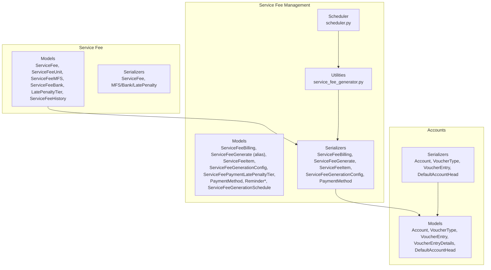
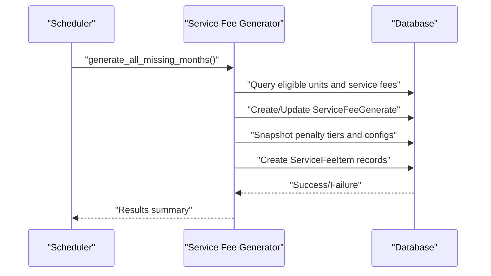
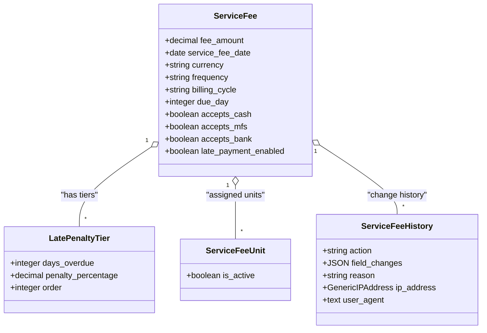
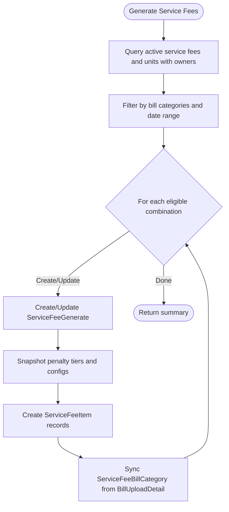
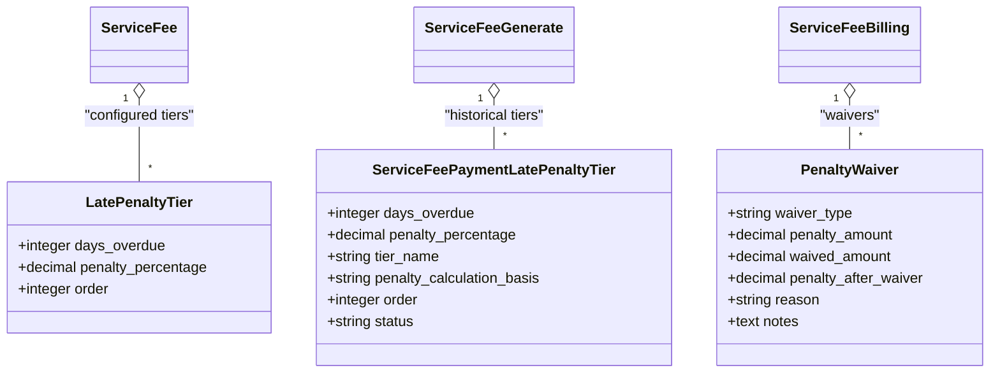
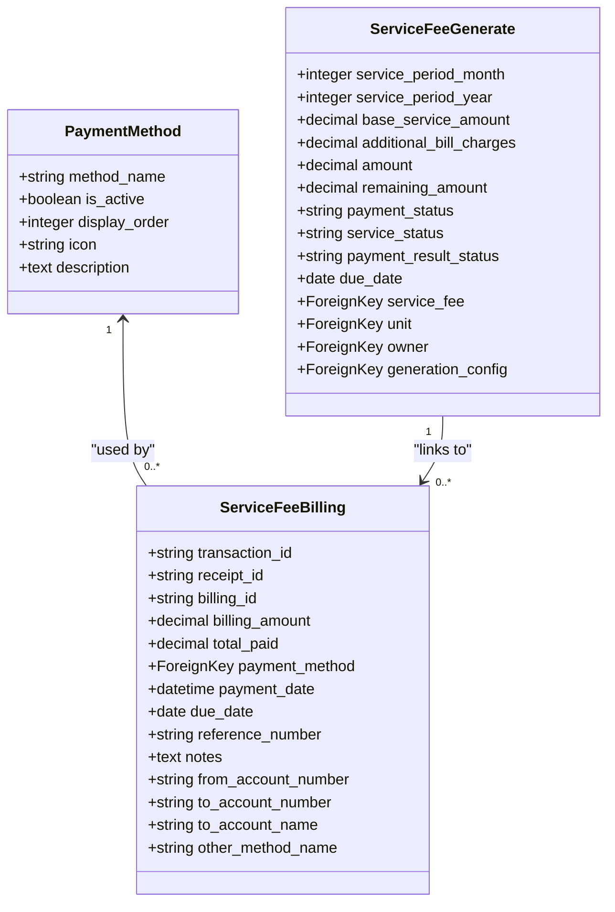
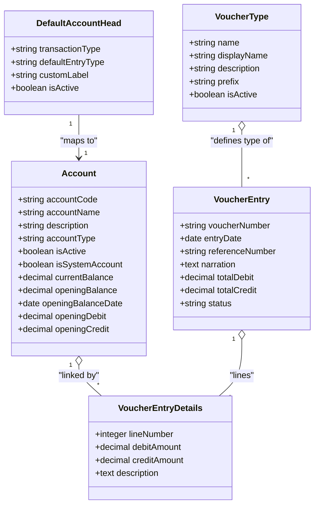
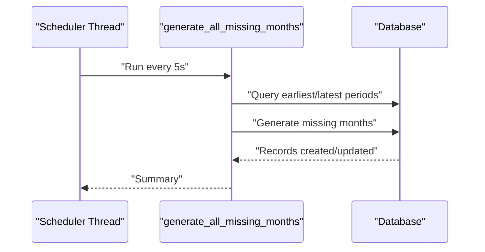
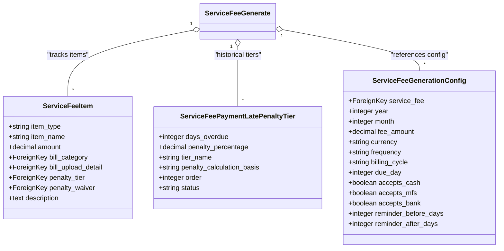
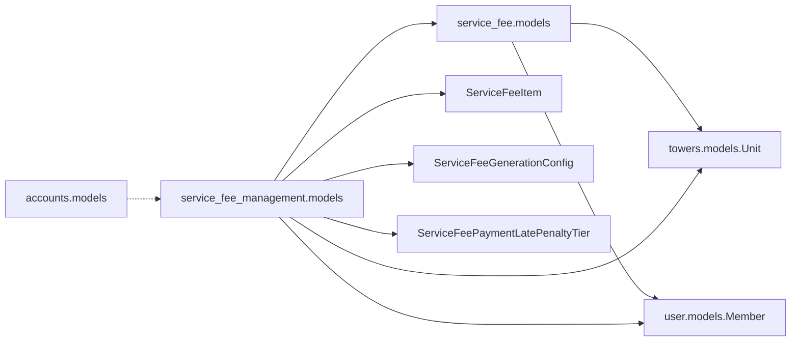

# Financial & Payment Models

<cite>
**Referenced Files in This Document**
- [backend/service_fee/models.py](file://backend/service_fee/models.py)
- [backend/service_fee/serializers.py](file://backend/service_fee/serializers.py)
- [backend/service_fee_management/models.py](file://backend/service_fee_management/models.py)
- [backend/service_fee_management/serializers.py](file://backend/service_fee_management/serializers.py)
- [backend/service_fee_management/utils/service_fee_generator.py](file://backend/service_fee_management/utils/service_fee_generator.py)
- [backend/service_fee_management/scheduler.py](file://backend/service_fee_management/scheduler.py)
- [backend/accounts/models.py](file://backend/accounts/models.py)
- [backend/accounts/serializers.py](file://backend/accounts/serializers.py)
</cite>

## Update Summary
**Changes Made**
- Added comprehensive documentation for new ServiceFeeItem model for tracking individual service fee components
- Updated ServiceFeeGenerate alias documentation with semantic clarity explanation
- Added ServiceFeeGenerationConfig documentation for configuration snapshots
- Enhanced penalty tier tracking with ServiceFeePaymentLatePenaltyTier
- Updated payment distribution and allocation mechanisms
- Added advanced indexing and foreign key relationship documentation

## Table of Contents
1. [Introduction](#introduction)
2. [Project Structure](#project-structure)
3. [Core Components](#core-components)
4. [Architecture Overview](#architecture-overview)
5. [Detailed Component Analysis](#detailed-component-analysis)
6. [Dependency Analysis](#dependency-analysis)
7. [Performance Considerations](#performance-considerations)
8. [Troubleshooting Guide](#troubleshooting-guide)
9. [Conclusion](#conclusion)

## Introduction
This document describes the financial management system covering service fees, billing, payments, and accounting. It explains how service fee settings are modeled, how billing and payment records are structured, how late penalties and waivers are handled, and how accounting integrates with journal entries and financial reporting. It also documents payment distribution across months, reconciliation processes, and audit trails.

**Updated** Enhanced with new ServiceFeeItem tracking system, ServiceFeeGenerate semantic alias, and comprehensive configuration management.

## Project Structure
The financial system spans three Django applications:
- service_fee: Defines service fee settings, payment methods, late penalty tiers, and historical changes.
- service_fee_management: Manages billing records, payment transactions, reminders, generation utilities, and detailed fee item tracking.
- accounts: Implements chart of accounts, voucher types, and journal entries for accounting integration.

**Diagram sources**
- [backend/service_fee/models.py](file://backend/service_fee/models.py#L10-L470)
- [backend/service_fee/serializers.py](file://backend/service_fee/serializers.py#L1-L800)
- [backend/service_fee_management/models.py](file://backend/service_fee_management/models.py#L11-L800)
- [backend/service_fee_management/serializers.py](file://backend/service_fee_management/serializers.py#L1-L800)
- [backend/service_fee_management/utils/service_fee_generator.py](file://backend/service_fee_management/utils/service_fee_generator.py#L15-L818)
- [backend/service_fee_management/scheduler.py](file://backend/service_fee_management/scheduler.py#L10-L78)
- [backend/accounts/models.py](file://backend/accounts/models.py#L9-L410)
- [backend/accounts/serializers.py](file://backend/accounts/serializers.py#L1-L513)

**Section sources**
- [backend/service_fee/models.py](file://backend/service_fee/models.py#L10-L470)
- [backend/service_fee/serializers.py](file://backend/service_fee/serializers.py#L135-L800)
- [backend/service_fee_management/models.py](file://backend/service_fee_management/models.py#L11-L800)
- [backend/service_fee_management/serializers.py](file://backend/service_fee_management/serializers.py#L1-L800)
- [backend/service_fee_management/utils/service_fee_generator.py](file://backend/service_fee_management/utils/service_fee_generator.py#L15-L818)
- [backend/service_fee_management/scheduler.py](file://backend/service_fee_management/scheduler.py#L10-L78)
- [backend/accounts/models.py](file://backend/accounts/models.py#L9-L410)
- [backend/accounts/serializers.py](file://backend/accounts/serializers.py#L1-L513)

## Core Components
- ServiceFee: Central fee configuration with billing cycle, due day, accepted payment methods, and late payment enablement.
- ServiceFeeUnit: Through model supporting soft-deletable unit assignments to active service fees.
- PaymentMethods: Configurable payment methods (Cash, MFS providers, Bank transfers).
- ServiceFeeBilling: Normalized billing records with transaction/receipt identifiers, payment method linkage, and payment tracking.
- ServiceFeeGenerate (alias for ServiceFeePayment): Individual payment transactions with service period, amounts, status, and result classification.
- ServiceFeeItem: New model for tracking individual service fee components and bill categories.
- ServiceFeeGenerationConfig: Configuration snapshot for service fee settings at generation time.
- ServiceFeePaymentLatePenaltyTier: Penalty tier tracking with historical snapshots.
- PenaltyWaiver: Records penalty waivers with type, amount, and notes.
- Account/VoucherEntry: Chart of accounts and voucher entries for accounting integration.

**Updated** Added ServiceFeeItem for detailed fee component tracking, ServiceFeeGenerationConfig for configuration snapshots, and enhanced penalty tier management.

**Section sources**
- [backend/service_fee/models.py](file://backend/service_fee/models.py#L10-L180)
- [backend/service_fee_management/models.py](file://backend/service_fee_management/models.py#L11-L260)
- [backend/service_fee_management/models.py](file://backend/service_fee_management/models.py#L1429-L1520)
- [backend/service_fee_management/models.py](file://backend/service_fee_management/models.py#L1590-L1635)
- [backend/service_fee_management/models.py](file://backend/service_fee_management/models.py#L1522-L1587)
- [backend/accounts/models.py](file://backend/accounts/models.py#L9-L200)

## Architecture Overview
The system separates billing generation from payment processing and integrates with accounting via voucher entries. Billing records are created per unit and service fee per month/year. Payments are linked to billing records and update payment totals and status. Accounting entries can be created from payments and other financial events.

**Updated** Enhanced with ServiceFeeItem tracking for detailed fee breakdowns and ServiceFeeGenerationConfig for historical configuration management.

**Diagram sources**
- [backend/service_fee_management/scheduler.py](file://backend/service_fee_management/scheduler.py#L10-L66)
- [backend/service_fee_management/utils/service_fee_generator.py](file://backend/service_fee_management/utils/service_fee_generator.py#L710-L818)

## Detailed Component Analysis

### Service Fee Configuration and Calculation
- ServiceFee defines fee amount, currency, frequency, billing cycle, due day, accepted payment methods, and late payment enablement.
- LatePenaltyTier defines tiers keyed by days overdue and penalty percentage, ordered ascending.
- ServiceFeeUnit enables soft-deletable unit assignments to active service fees.
- ServiceFeeHistory tracks changes with field-level diffs, actor, IP, and user-agent.

**Diagram sources**
- [backend/service_fee/models.py](file://backend/service_fee/models.py#L10-L180)
- [backend/service_fee/models.py](file://backend/service_fee/models.py#L312-L347)
- [backend/service_fee/models.py](file://backend/service_fee/models.py#L162-L180)
- [backend/service_fee/models.py](file://backend/service_fee/models.py#L373-L470)

**Section sources**
- [backend/service_fee/models.py](file://backend/service_fee/models.py#L10-L180)
- [backend/service_fee/models.py](file://backend/service_fee/models.py#L312-L347)
- [backend/service_fee/models.py](file://backend/service_fee/models.py#L162-L180)
- [backend/service_fee/models.py](file://backend/service_fee/models.py#L373-L470)

### Enhanced Billing Generation and Payment Distribution
- ServiceFeeBilling holds billing identifiers, amounts, payment method, and payment tracking fields.
- ServiceFeeGenerate (alias for ServiceFeePayment) stores per-month payment transactions, amounts, remaining, status, and result classification.
- ServiceFeeItem tracks individual service fee components with detailed breakdowns.
- ServiceFeeGenerationConfig provides configuration snapshots for historical accuracy.
- ServiceFeePaymentLatePenaltyTier manages penalty tier tracking with historical snapshots.
- The generator creates or updates ServiceFeeGenerate records per unit/service fee/month/year, aggregates bill categories, and syncs ServiceFeeBillCategory.
- Payment validation prevents overpayments and duplicate recent payments.

**Updated** Enhanced with ServiceFeeItem tracking for detailed fee breakdowns and ServiceFeeGenerationConfig for configuration snapshots.

**Diagram sources**
- [backend/service_fee_management/utils/service_fee_generator.py](file://backend/service_fee_management/utils/service_fee_generator.py#L15-L200)
- [backend/service_fee_management/utils/service_fee_generator.py](file://backend/service_fee_management/utils/service_fee_generator.py#L262-L436)
- [backend/service_fee_management/utils/service_fee_generator.py](file://backend/service_fee_management/utils/service_fee_generator.py#L818-L899)

**Section sources**
- [backend/service_fee_management/models.py](file://backend/service_fee_management/models.py#L11-L122)
- [backend/service_fee_management/models.py](file://backend/service_fee_management/models.py#L228-L480)
- [backend/service_fee_management/models.py](file://backend/service_fee_management/models.py#L1429-L1520)
- [backend/service_fee_management/models.py](file://backend/service_fee_management/models.py#L1590-L1635)
- [backend/service_fee_management/models.py](file://backend/service_fee_management/models.py#L1522-L1587)
- [backend/service_fee_management/utils/service_fee_generator.py](file://backend/service_fee_management/utils/service_fee_generator.py#L15-L200)
- [backend/service_fee_management/utils/service_fee_generator.py](file://backend/service_fee_management/utils/service_fee_generator.py#L262-L436)
- [backend/service_fee_management/serializers.py](file://backend/service_fee_management/serializers.py#L229-L331)

### Late Penalties and Waivers
- Late penalties are configured via tiers with ascending days overdue and percentages.
- ServiceFeePaymentLatePenaltyTier provides historical penalty tier snapshots for accurate payment processing.
- PenaltyWaiver captures waiver type (full/partial percentage/fixed), amounts, and notes, and maintains penalty state pre/post waiver.

**Updated** Enhanced penalty tier management with historical snapshots for accurate payment processing.

**Diagram sources**
- [backend/service_fee/models.py](file://backend/service_fee/models.py#L312-L347)
- [backend/service_fee_management/models.py](file://backend/service_fee_management/models.py#L1522-L1587)
- [backend/service_fee_management/models.py](file://backend/service_fee_management/models.py#L150-L193)

**Section sources**
- [backend/service_fee/models.py](file://backend/service_fee/models.py#L312-L347)
- [backend/service_fee_management/models.py](file://backend/service_fee_management/models.py#L1522-L1587)
- [backend/service_fee_management/models.py](file://backend/service_fee_management/models.py#L150-L193)

### Payment Methods and Transaction Recording
- PaymentMethod defines configurable payment methods with display order and metadata.
- ServiceFeeBilling links to PaymentMethod and stores transaction/receipt identifiers, payment date, and detailed tracking fields.
- ServiceFeeGenerate (alias for ServiceFeePayment) stores per-month payment transactions, amounts, remaining, status, and result classification.

**Updated** ServiceFeeGenerate now includes owner information and enhanced payment tracking fields.

**Diagram sources**
- [backend/service_fee_management/models.py](file://backend/service_fee_management/models.py#L205-L226)
- [backend/service_fee_management/models.py](file://backend/service_fee_management/models.py#L12-L111)
- [backend/service_fee_management/models.py](file://backend/service_fee_management/models.py#L228-L480)

**Section sources**
- [backend/service_fee_management/models.py](file://backend/service_fee_management/models.py#L205-L226)
- [backend/service_fee_management/models.py](file://backend/service_fee_management/models.py#L12-L111)
- [backend/service_fee_management/models.py](file://backend/service_fee_management/models.py#L228-L480)

### Account Head System and Voucher Entry Models
- Account defines chart of accounts with type, parent, opening balances, and current balance.
- VoucherType defines voucher categories (Receipt, Payment, Journal, Contra).
- VoucherEntry and VoucherEntryDetails represent journal entries with debits/credits and line items.
- DefaultAccountHead maps transaction types to default account heads with entry type preference.

**Diagram sources**
- [backend/accounts/models.py](file://backend/accounts/models.py#L9-L65)
- [backend/accounts/models.py](file://backend/accounts/models.py#L159-L200)
- [backend/accounts/models.py](file://backend/accounts/models.py#L201-L285)
- [backend/accounts/models.py](file://backend/accounts/models.py#L286-L331)
- [backend/accounts/models.py](file://backend/accounts/models.py#L333-L410)

**Section sources**
- [backend/accounts/models.py](file://backend/accounts/models.py#L9-L65)
- [backend/accounts/models.py](file://backend/accounts/models.py#L159-L200)
- [backend/accounts/models.py](file://backend/accounts/models.py#L201-L285)
- [backend/accounts/models.py](file://backend/accounts/models.py#L286-L331)
- [backend/accounts/models.py](file://backend/accounts/models.py#L333-L410)

### Reminder and Automated Generation
- Reminder models define scheduling rules, audience targeting, and channel preferences.
- ServiceFeeGenerationSchedule configures automatic generation per tower/service fee and unit filters.
- Scheduler periodically invokes the generator to fill gaps.

**Diagram sources**
- [backend/service_fee_management/scheduler.py](file://backend/service_fee_management/scheduler.py#L10-L66)
- [backend/service_fee_management/utils/service_fee_generator.py](file://backend/service_fee_management/utils/service_fee_generator.py#L710-L818)

**Section sources**
- [backend/service_fee_management/models.py](file://backend/service_fee_management/models.py#L711-L800)
- [backend/service_fee_management/scheduler.py](file://backend/service_fee_management/scheduler.py#L10-L66)

### ServiceFeeItem Tracking System
- ServiceFeeItem tracks individual service fee components with detailed breakdowns.
- Supports base service fees, bill categories, penalties, and unit-specific charges.
- Links to bill upload details for consumption-based billing.
- Provides historical tracking with penalty tier and waiver references.

**New** Comprehensive service fee item tracking system for detailed fee breakdowns.

**Diagram sources**
- [backend/service_fee_management/models.py](file://backend/service_fee_management/models.py#L1429-L1520)
- [backend/service_fee_management/models.py](file://backend/service_fee_management/models.py#L1590-L1635)
- [backend/service_fee_management/models.py](file://backend/service_fee_management/models.py#L1522-L1587)

**Section sources**
- [backend/service_fee_management/models.py](file://backend/service_fee_management/models.py#L1429-L1520)
- [backend/service_fee_management/models.py](file://backend/service_fee_management/models.py#L1590-L1635)
- [backend/service_fee_management/models.py](file://backend/service_fee_management/models.py#L1522-L1587)

## Dependency Analysis
- service_fee depends on towers.Unit and user.Member for unit ownership and creator context.
- service_fee_management depends on service_fee models for billing and payment linkage, and on accounts for accounting integration.
- ServiceFeeItem depends on ServiceFeeGenerate, bill categories, and penalty tier models.
- ServiceFeeGenerationConfig provides configuration snapshots for historical accuracy.
- accounts is independent and provides foundational accounting primitives.

**Updated** Added dependencies for new ServiceFeeItem, ServiceFeeGenerationConfig, and enhanced penalty tier tracking.

**Diagram sources**
- [backend/service_fee/models.py](file://backend/service_fee/models.py#L4-L6)
- [backend/service_fee_management/models.py](file://backend/service_fee_management/models.py#L3-L5)
- [backend/accounts/models.py](file://backend/accounts/models.py#L5-L6)

**Section sources**
- [backend/service_fee/models.py](file://backend/service_fee/models.py#L4-L6)
- [backend/service_fee_management/models.py](file://backend/service_fee_management/models.py#L3-L5)
- [backend/accounts/models.py](file://backend/accounts/models.py#L5-L6)

## Performance Considerations
- Bulk operations: The generator uses bulk_create and bulk_update to minimize database round-trips.
- Atomic transactions: Payment creation/updating wraps billing lookup/creation and remaining amount calculation in a transaction.
- Advanced indexing: New indexes on ServiceFeeItem, ServiceFeeGenerate, and ServiceFeeGenerationConfig improve query performance.
- Foreign key relationships: Proper foreign key constraints ensure data integrity and efficient joins.
- Historical tracking: Penalty tier snapshots prevent recomputation and maintain historical accuracy.
- Validation caching: Serializers validate only provided fields for partial updates to reduce overhead.

**Updated** Enhanced with new indexing strategies and foreign key relationships for improved performance.

## Troubleshooting Guide
- Duplicate unit assignment: Validation prevents assigning the same unit to multiple active service fees; conflicts are logged and surfaced via serializer validation.
- Payment overpayment: Payment serializer validates that total payments do not exceed the billing amount and flags recent duplicate payments.
- Billing synchronization: The generator syncs ServiceFeeBillCategory from BillUploadDetail; ensure bill categories exist for the given month/year and unit/service fee.
- Accounting balance: Account recalculation aggregates posted voucher details; ensure voucher entries are posted and balanced.
- ServiceFeeItem tracking: Verify that ServiceFeeItem records are created for each ServiceFeeGenerate instance and properly linked to bill categories.
- Configuration snapshots: Ensure ServiceFeeGenerationConfig records exist for each service fee and period combination.
- Penalty tier accuracy: Check that penalty tier snapshots are properly linked to ServiceFeeGenerate instances for historical accuracy.

**Updated** Added troubleshooting guidance for new ServiceFeeItem tracking and configuration management.

**Section sources**
- [backend/service_fee/models.py](file://backend/service_fee/models.py#L86-L160)
- [backend/service_fee_management/serializers.py](file://backend/service_fee_management/serializers.py#L229-L331)
- [backend/service_fee_management/utils/service_fee_generator.py](file://backend/service_fee_management/utils/service_fee_generator.py#L510-L660)
- [backend/accounts/models.py](file://backend/accounts/models.py#L127-L156)
- [backend/service_fee_management/models.py](file://backend/service_fee_management/models.py#L1429-L1520)
- [backend/service_fee_management/models.py](file://backend/service_fee_management/models.py#L1590-L1635)
- [backend/service_fee_management/models.py](file://backend/service_fee_management/models.py#L1522-L1587)

## Conclusion
The financial management system provides a robust framework for configuring service fees, generating monthly bills, processing payments, applying penalties and waivers, and integrating with accounting through voucher entries. The separation of concerns between billing generation, payment processing, and accounting ensures scalability and maintainability, while normalization and validation enforce data integrity.

**Updated** Enhanced with comprehensive ServiceFeeItem tracking, ServiceFeeGenerationConfig for historical accuracy, and improved penalty tier management, providing detailed fee breakdowns and accurate historical records for financial reporting and audit purposes.