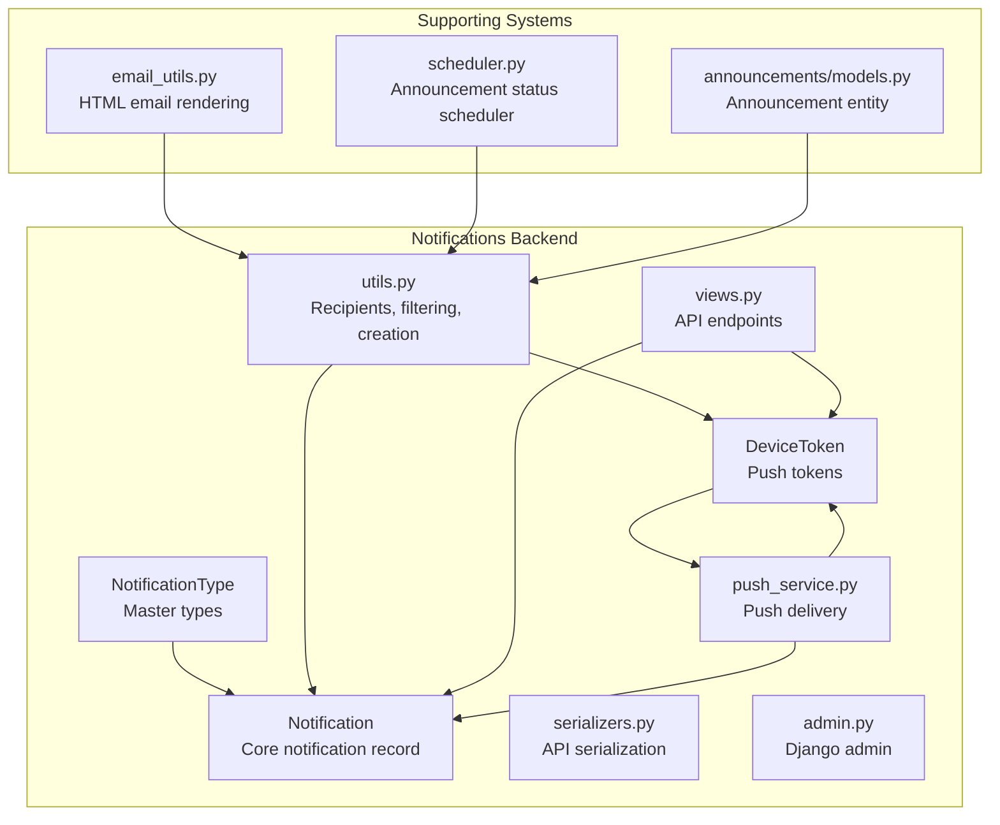
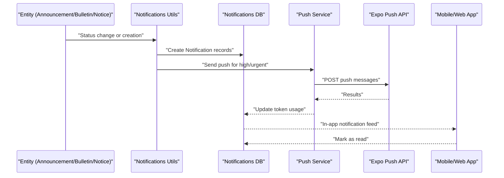
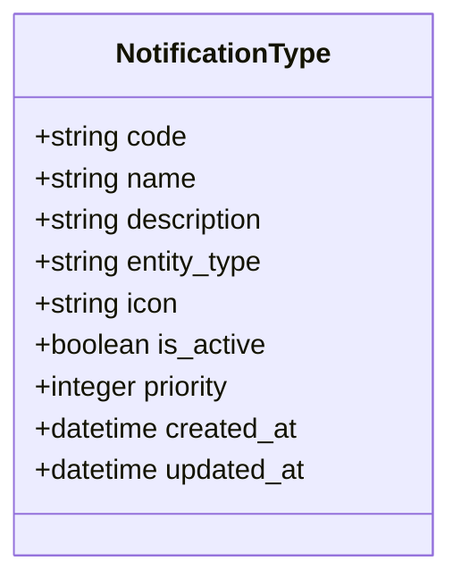
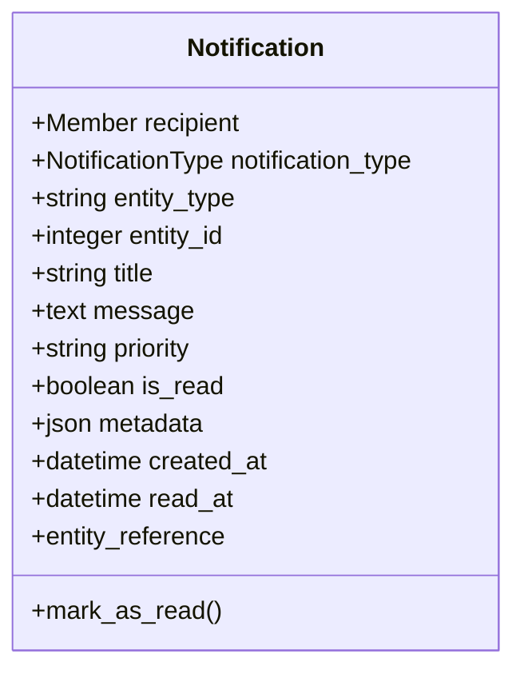
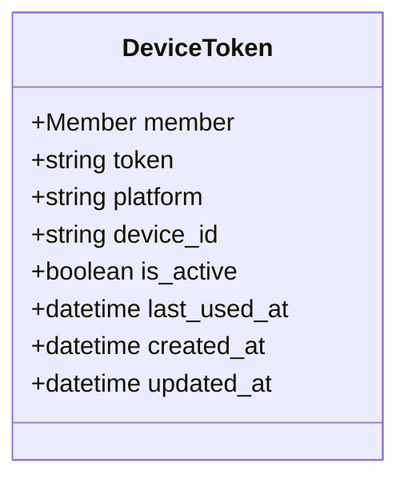
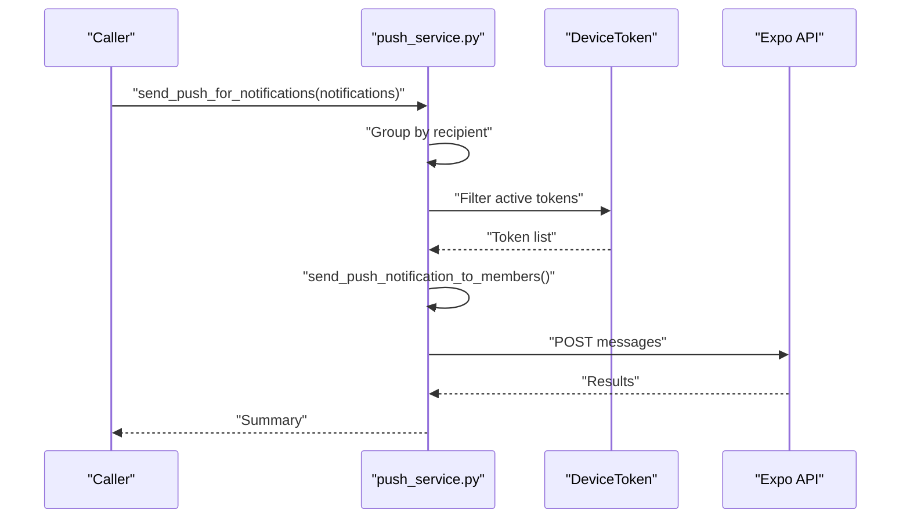
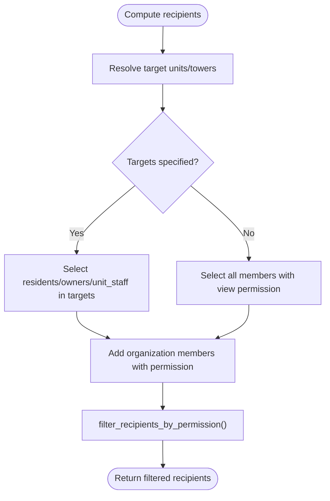
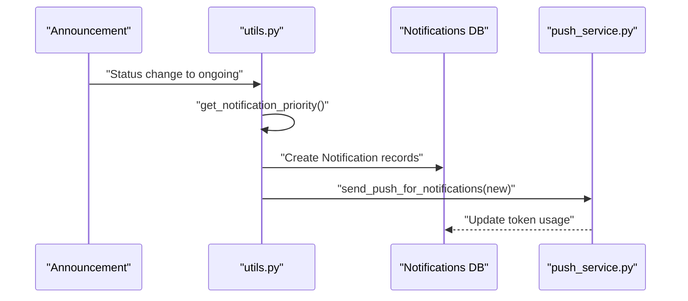
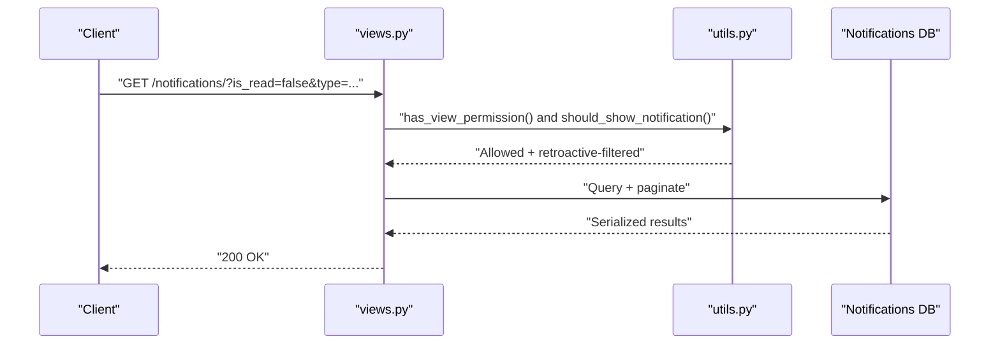
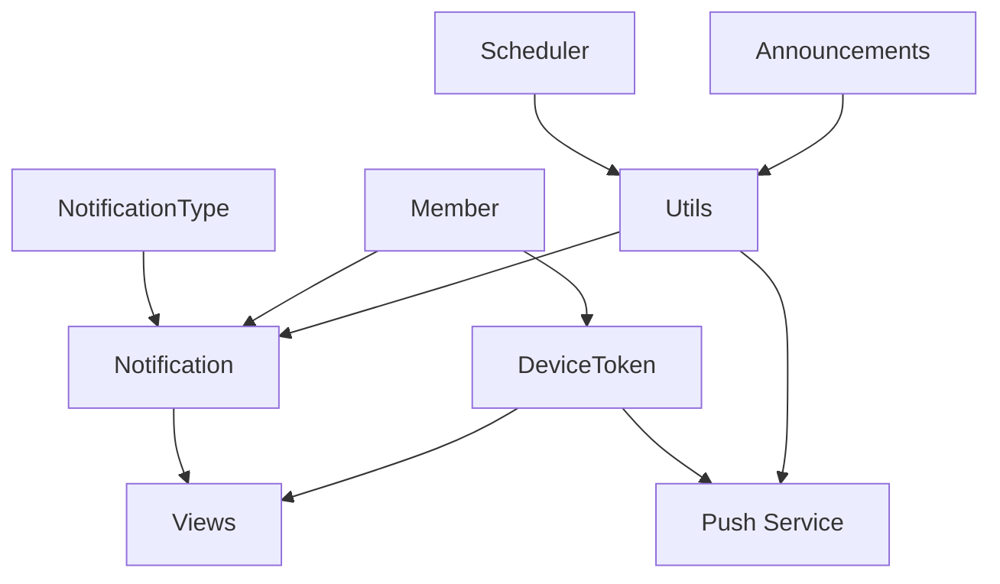

# Notification & Alert Models

<cite>
**Referenced Files in This Document**
- [models.py](file://backend/notifications/models.py)
- [push_service.py](file://backend/notifications/push_service.py)
- [utils.py](file://backend/notifications/utils.py)
- [views.py](file://backend/notifications/views.py)
- [serializers.py](file://backend/notifications/serializers.py)
- [admin.py](file://backend/notifications/admin.py)
- [CHANGES_SUMMARY.md](file://backend/notifications/CHANGES_SUMMARY.md)
- [NEW_MEMBER_NOTIFICATION_LOGIC.md](file://backend/notifications/NEW_MEMBER_NOTIFICATION_LOGIC.md)
- [email_utils.py](file://backend/user/email_utils.py)
- [scheduler.py](file://backend/announcements/scheduler.py)
- [models.py](file://backend/announcements/models.py)
</cite>

## Table of Contents
1. [Introduction](#introduction)
2. [Project Structure](#project-structure)
3. [Core Components](#core-components)
4. [Architecture Overview](#architecture-overview)
5. [Detailed Component Analysis](#detailed-component-analysis)
6. [Dependency Analysis](#dependency-analysis)
7. [Performance Considerations](#performance-considerations)
8. [Troubleshooting Guide](#troubleshooting-guide)
9. [Conclusion](#conclusion)

## Introduction
This document provides comprehensive data model documentation for the notification system, covering push notifications, email alerts, and in-app messaging. It details notification types, recipient targeting, delivery mechanisms, device token management, scheduling, priority systems, dynamic configuration, template system, multi-channel delivery, history tracking, read/unread status management, user preferences, external service integrations, retry/failure handling, filtering, bulk operations, and performance optimization for large-scale deployments.

## Project Structure
The notification system spans backend Django models, utilities, views, serializers, and admin configurations, plus supporting components for push delivery, email templating, and scheduling.

**Diagram sources**
- [models.py](file://backend/notifications/models.py#L6-L90)
- [models.py](file://backend/notifications/models.py#L93-L198)
- [models.py](file://backend/notifications/models.py#L200-L262)
- [utils.py](file://backend/notifications/utils.py#L20-L72)
- [views.py](file://backend/notifications/views.py#L24-L192)
- [push_service.py](file://backend/notifications/push_service.py#L17-L107)
- [serializers.py](file://backend/notifications/serializers.py#L5-L128)
- [admin.py](file://backend/notifications/admin.py#L5-L57)
- [email_utils.py](file://backend/user/email_utils.py#L9-L48)
- [scheduler.py](file://backend/announcements/scheduler.py#L13-L120)
- [models.py](file://backend/announcements/models.py#L11-L89)

**Section sources**
- [models.py](file://backend/notifications/models.py#L1-L264)
- [push_service.py](file://backend/notifications/push_service.py#L1-L305)
- [utils.py](file://backend/notifications/utils.py#L1-L4750)
- [views.py](file://backend/notifications/views.py#L1-L523)
- [serializers.py](file://backend/notifications/serializers.py#L1-L128)
- [admin.py](file://backend/notifications/admin.py#L1-L57)
- [email_utils.py](file://backend/user/email_utils.py#L1-L48)
- [scheduler.py](file://backend/announcements/scheduler.py#L1-L120)
- [models.py](file://backend/announcements/models.py#L1-L184)

## Core Components
- NotificationType: Dynamic master table for notification categories with entity-type mapping, priority, and activation controls.
- Notification: Stores per-user notification records with generic entity references, priority, read status, and metadata.
- DeviceToken: Manages push notification tokens per user, including platform and activity tracking.
- Push Service: Sends push notifications via external API, aggregates results, and tracks success/error counts.
- Utilities: Priority calculation, recipient filtering, permission checks, and notification creation for announcements, bulletins, and notices.
- Views: REST endpoints for listing, retrieving, updating, deleting notifications; marking all as read; unread count; device token registration/deactivation; batch owner notifications.
- Serializers: Full and lightweight serializers for notifications and device tokens.
- Admin: Django admin interface for managing notification types and notifications.
- Email Utilities: HTML email rendering and sending using Django templates.
- Scheduler: Background scheduler for announcement status transitions and notification triggers.

**Section sources**
- [models.py](file://backend/notifications/models.py#L6-L90)
- [models.py](file://backend/notifications/models.py#L93-L198)
- [models.py](file://backend/notifications/models.py#L200-L262)
- [push_service.py](file://backend/notifications/push_service.py#L17-L107)
- [utils.py](file://backend/notifications/utils.py#L20-L72)
- [views.py](file://backend/notifications/views.py#L24-L192)
- [serializers.py](file://backend/notifications/serializers.py#L5-L128)
- [admin.py](file://backend/notifications/admin.py#L5-L57)
- [email_utils.py](file://backend/user/email_utils.py#L9-L48)
- [scheduler.py](file://backend/announcements/scheduler.py#L13-L120)

## Architecture Overview
The system integrates multiple channels:
- In-app feed: Notification records with read/unread tracking and filtering.
- Push notifications: DeviceTokens linked to users; push delivery via external API with priority routing.
- Email alerts: HTML email templates rendered and sent for eligible events.
- Scheduling: Background scheduler monitors entity status changes and triggers notifications.

**Diagram sources**
- [utils.py](file://backend/notifications/utils.py#L1065-L1203)
- [push_service.py](file://backend/notifications/push_service.py#L172-L258)
- [models.py](file://backend/notifications/models.py#L93-L198)

## Detailed Component Analysis

### Data Models

#### NotificationType
- Purpose: Central registry of notification categories with dynamic activation and priority.
- Fields: code, name, description, entity_type, icon, is_active, priority, timestamps.
- Indexes: code uniqueness, entity_type+is_active for filtering.
- Ordering: priority desc, name asc.

**Diagram sources**
- [models.py](file://backend/notifications/models.py#L6-L90)

**Section sources**
- [models.py](file://backend/notifications/models.py#L6-L90)

#### Notification
- Purpose: Per-user notification records with generic entity linkage and priority.
- Fields: recipient, notification_type, entity_type, entity_id, title, message, priority, is_read, metadata, timestamps.
- Methods: mark_as_read(), entity_reference property.
- Indexes: recipient+created_at, recipient+is_read, notification_type, entity_type+entity_id, priority+is_read.
- Ordering: created_at desc.

**Diagram sources**
- [models.py](file://backend/notifications/models.py#L93-L198)

**Section sources**
- [models.py](file://backend/notifications/models.py#L93-L198)

#### DeviceToken
- Purpose: Store push tokens per user with platform and activity tracking.
- Fields: member, token (unique), platform, device_id, is_active, last_used_at, timestamps.
- Indexes: member+is_active, token, platform+is_active; unique constraint on member+token.
- Usage: Fetch active tokens for push delivery.

**Diagram sources**
- [models.py](file://backend/notifications/models.py#L200-L262)

**Section sources**
- [models.py](file://backend/notifications/models.py#L200-L262)

### Push Delivery Service
- send_push_notification: Posts messages to external API, aggregates results, logs successes/errors.
- send_push_notification_to_members: Resolves active tokens for recipients, updates last_used_at, invokes send_push_notification.
- send_push_for_notification: Applies metadata-driven routing (push vs in-app), constructs data payload, handles entity-specific metadata.
- send_push_for_notifications: Groups by recipient to avoid duplicates and returns aggregated results.

**Diagram sources**
- [push_service.py](file://backend/notifications/push_service.py#L261-L305)
- [push_service.py](file://backend/notifications/push_service.py#L109-L169)
- [push_service.py](file://backend/notifications/push_service.py#L17-L107)

**Section sources**
- [push_service.py](file://backend/notifications/push_service.py#L17-L107)
- [push_service.py](file://backend/notifications/push_service.py#L109-L169)
- [push_service.py](file://backend/notifications/push_service.py#L172-L258)
- [push_service.py](file://backend/notifications/push_service.py#L261-L305)

### Recipient Targeting and Filtering
- Priority determination: get_notification_priority considers entity type and explicit entity priority, with special-casing for certain notification type codes.
- Permission-based filtering: has_view_permission checks SuperAdmin and explicit permission IDs; filter_recipients_by_permission ensures creators are included and enforces non-retroactive behavior.
- Entity-specific recipient computation:
  - get_announcement_recipients: builds recipient sets from target units/towers, falls back to all members, includes organization members, and filters by current permissions.
  - get_notice_recipients: similar logic with broader inclusion of organization members with notice view permission.
  - get_bulletin_recipients: includes residents, owners, unit staff in target units/towers, plus organization members; filters by current permissions.
- Retroactivity enforcement: should_show_notification compares entity timestamps against permission grant timestamps to hide retroactive notifications.

**Diagram sources**
- [utils.py](file://backend/notifications/utils.py#L74-L265)
- [utils.py](file://backend/notifications/utils.py#L337-L408)
- [utils.py](file://backend/notifications/utils.py#L410-L541)
- [utils.py](file://backend/notifications/utils.py#L543-L674)
- [utils.py](file://backend/notifications/utils.py#L676-L725)

**Section sources**
- [utils.py](file://backend/notifications/utils.py#L20-L72)
- [utils.py](file://backend/notifications/utils.py#L74-L265)
- [utils.py](file://backend/notifications/utils.py#L337-L408)
- [utils.py](file://backend/notifications/utils.py#L410-L541)
- [utils.py](file://backend/notifications/utils.py#L543-L674)
- [utils.py](file://backend/notifications/utils.py#L676-L725)

### Notification Creation Workflows
- Announcements: create_announcement_notification and status-triggered send functions (published, scheduled, ongoing, updated) compute priority, build metadata, create notifications, and conditionally send push for high/urgent.
- Notices: create_notice_posted_notification computes web/mobile titles/messages, determines push eligibility by priority, resolves recipients, and sends push for newly created notifications.
- Bulletins: create_bulletin_posted_notification follows similar pattern with bulletin-specific metadata and approval timestamp handling.

**Diagram sources**
- [utils.py](file://backend/notifications/utils.py#L920-L1203)
- [utils.py](file://backend/notifications/utils.py#L1065-L1203)
- [push_service.py](file://backend/notifications/push_service.py#L261-L305)

**Section sources**
- [utils.py](file://backend/notifications/utils.py#L920-L1203)
- [utils.py](file://backend/notifications/utils.py#L1065-L1203)
- [utils.py](file://backend/notifications/utils.py#L1976-L2090)

### API Endpoints and Read/Unread Management
- List notifications with filtering by read status, type, and entity type; permission-aware display; pagination; performance metrics.
- Retrieve/update/delete individual notifications; on PATCH, users with view permission can create on-the-fly notifications for entities they can view.
- Mark all as read: bulk update unread notifications to read.
- Unread count: permission-aware unread count with retroactive filtering.
- Device token registration and deactivation endpoints.

**Diagram sources**
- [views.py](file://backend/notifications/views.py#L24-L192)
- [utils.py](file://backend/notifications/utils.py#L74-L265)

**Section sources**
- [views.py](file://backend/notifications/views.py#L24-L192)
- [views.py](file://backend/notifications/views.py#L194-L295)
- [views.py](file://backend/notifications/views.py#L297-L384)
- [views.py](file://backend/notifications/views.py#L447-L523)
- [utils.py](file://backend/notifications/utils.py#L74-L265)

### Email Alerts
- HTML email rendering and sending using Django templates with plain-text fallback.
- Used for initial credentials and other alert scenarios.

**Section sources**
- [email_utils.py](file://backend/user/email_utils.py#L9-L48)

### Scheduling and Status Transitions
- AnnouncementStatusScheduler runs in a background thread, periodically checking upcoming announcements and transitioning them to ongoing, then triggering notifications.

**Section sources**
- [scheduler.py](file://backend/announcements/scheduler.py#L13-L120)

### Dynamic Configuration and Templates
- NotificationType enables dynamic addition of notification categories and prioritization.
- Notification metadata stores entity-specific context enabling flexible templates and routing.
- Push payloads include entity identifiers and metadata for deep linking and contextual display.

**Section sources**
- [models.py](file://backend/notifications/models.py#L6-L90)
- [models.py](file://backend/notifications/models.py#L93-L198)
- [push_service.py](file://backend/notifications/push_service.py#L210-L258)

### Multi-Channel Delivery
- In-app: Notification records with read/unread tracking and filtering.
- Push: DeviceTokens with platform and token resolution; push delivery with priority routing.
- Email: HTML templates with plain-text fallback for credentials and alerts.

**Section sources**
- [models.py](file://backend/notifications/models.py#L200-L262)
- [push_service.py](file://backend/notifications/push_service.py#L17-L107)
- [email_utils.py](file://backend/user/email_utils.py#L9-L48)

### History Tracking and Read/Unread Status
- Notification records maintain created_at and read_at timestamps; read/unread toggling via API.
- Retroactive filtering ensures users do not see notifications for content created before permission grants.

**Section sources**
- [models.py](file://backend/notifications/models.py#L166-L169)
- [views.py](file://backend/notifications/views.py#L297-L384)
- [utils.py](file://backend/notifications/utils.py#L74-L265)

### User Preference Handling
- Permission-based visibility: has_view_permission and filter_recipients_by_permission enforce current permissions.
- Non-retroactive behavior: should_show_notification hides notifications for entities created before permission grants.

**Section sources**
- [utils.py](file://backend/notifications/utils.py#L267-L335)
- [utils.py](file://backend/notifications/utils.py#L337-L408)
- [utils.py](file://backend/notifications/utils.py#L74-L265)

### Integration with External Services
- Push delivery via external API with request/response handling and error logging.
- Email delivery via Django’s EmailMultiAlternatives with HTML and plain-text content.

**Section sources**
- [push_service.py](file://backend/notifications/push_service.py#L17-L107)
- [email_utils.py](file://backend/user/email_utils.py#L9-L48)

### Retry Mechanisms and Failure Handling
- Push service logs failures and returns structured results with success/error counts.
- Notification creation uses get_or_create to prevent duplicates; errors are caught and logged without failing the entire operation.
- Scheduler wraps checks in try/catch blocks and logs errors.

**Section sources**
- [push_service.py](file://backend/notifications/push_service.py#L80-L107)
- [utils.py](file://backend/notifications/utils.py#L2059-L2065)
- [scheduler.py](file://backend/announcements/scheduler.py#L44-L47)

### Notification Filtering and Bulk Processes
- Filtering by read status, type, entity type, and permission-aware visibility.
- Bulk mark-all-as-read endpoint performs efficient bulk updates.
- Batch owner notification endpoint supports batch creation for multiple owners.

**Section sources**
- [views.py](file://backend/notifications/views.py#L24-L192)
- [views.py](file://backend/notifications/views.py#L297-L330)
- [views.py](file://backend/notifications/views.py#L386-L445)

## Dependency Analysis
- Notification depends on NotificationType and Member.
- DeviceToken depends on Member.
- Push service depends on DeviceToken and external API.
- Views depend on Notification, DeviceToken, and utils for permission checks.
- Utils depend on entity models (Announcements, Bulletins, Notices) and permission constants.
- Scheduler depends on Announcement model and utils.

**Diagram sources**
- [models.py](file://backend/notifications/models.py#L6-L90)
- [models.py](file://backend/notifications/models.py#L93-L198)
- [models.py](file://backend/notifications/models.py#L200-L262)
- [push_service.py](file://backend/notifications/push_service.py#L17-L107)
- [views.py](file://backend/notifications/views.py#L24-L192)
- [utils.py](file://backend/notifications/utils.py#L20-L72)
- [scheduler.py](file://backend/announcements/scheduler.py#L13-L120)
- [models.py](file://backend/announcements/models.py#L11-L89)

**Section sources**
- [models.py](file://backend/notifications/models.py#L6-L262)
- [push_service.py](file://backend/notifications/push_service.py#L17-L107)
- [views.py](file://backend/notifications/views.py#L24-L192)
- [utils.py](file://backend/notifications/utils.py#L20-L72)
- [scheduler.py](file://backend/announcements/scheduler.py#L13-L120)
- [models.py](file://backend/announcements/models.py#L11-L89)

## Performance Considerations
- Database indexes: recipient+created_at, recipient+is_read, notification_type, entity_type+entity_id, priority+is_read.
- Pagination: custom pagination with configurable page sizes.
- Efficient bulk updates: bulk mark-all-as-read uses update() to minimize overhead.
- Permission checks: performed at query time where possible; filtered lists applied in Python only when necessary.
- Push batching: grouping by recipient to reduce redundant sends.

[No sources needed since this section provides general guidance]

## Troubleshooting Guide
- Push delivery failures: Inspect push_service results and logs for error counts and statuses.
- Missing recipients: Verify target units/towers and permission grants; confirm should_show_notification filtering.
- Retroactive notifications appearing: Check permission grant timestamps and entity timestamps.
- Device token issues: Confirm token registration, is_active status, and last_used_at updates.
- Email delivery: Validate template paths and sender configuration.

**Section sources**
- [push_service.py](file://backend/notifications/push_service.py#L80-L107)
- [utils.py](file://backend/notifications/utils.py#L74-L265)
- [views.py](file://backend/notifications/views.py#L24-L192)
- [models.py](file://backend/notifications/models.py#L200-L262)
- [email_utils.py](file://backend/user/email_utils.py#L9-L48)

## Conclusion
The notification system provides a robust, extensible foundation for multi-channel communication. Its dynamic notification types, permission-aware targeting, and non-retroactive logic ensure relevance and compliance. Push delivery, in-app feeds, and email alerts integrate seamlessly, supported by scheduling, bulk operations, and performance-conscious design.