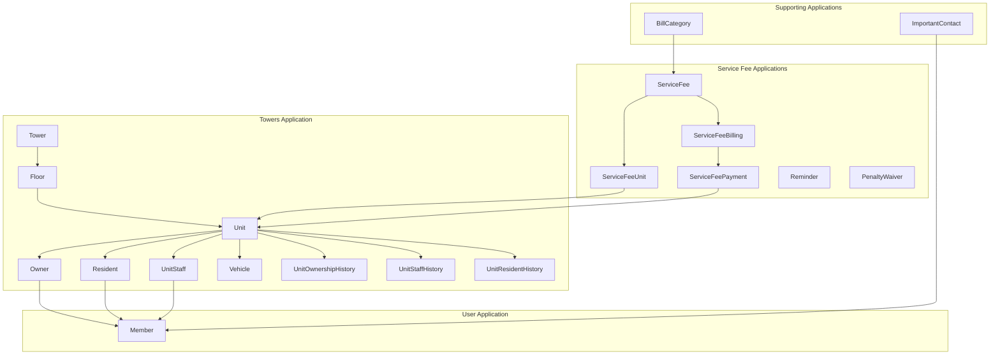
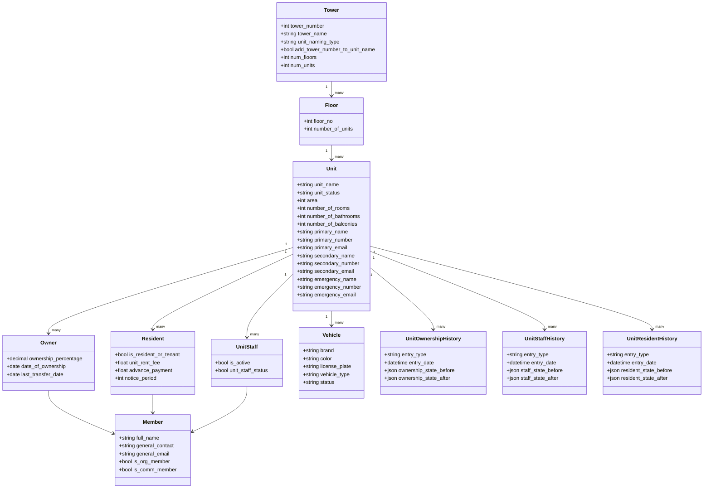
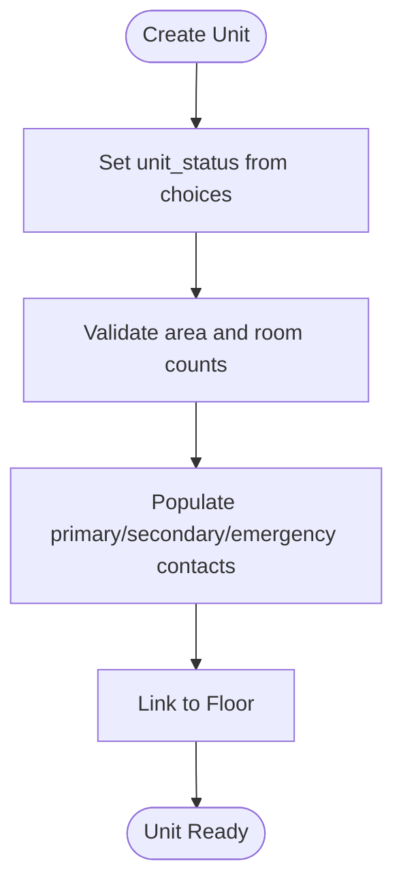
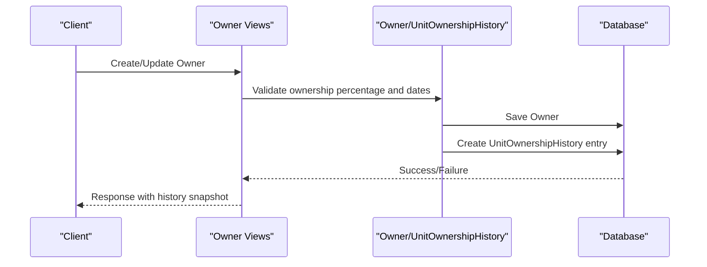
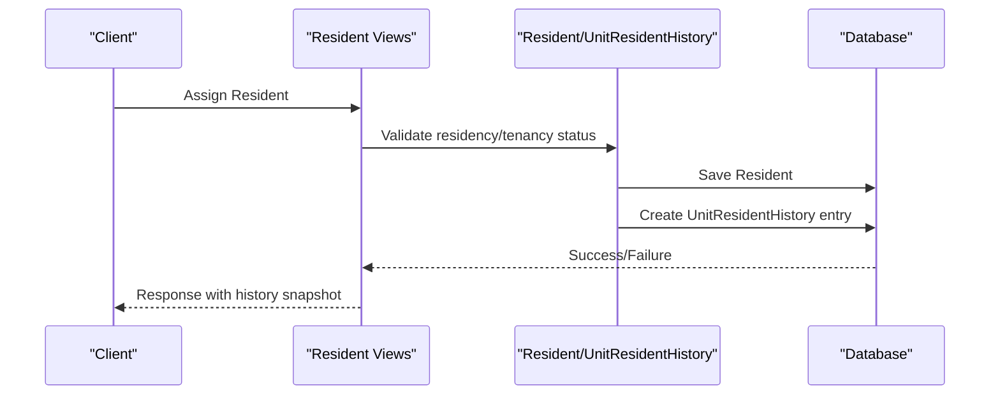
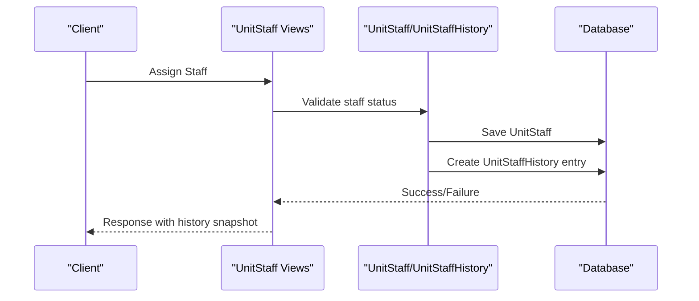
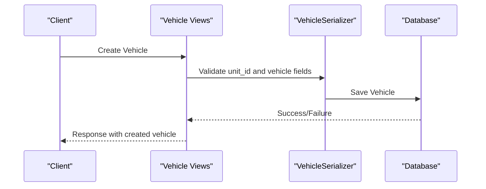
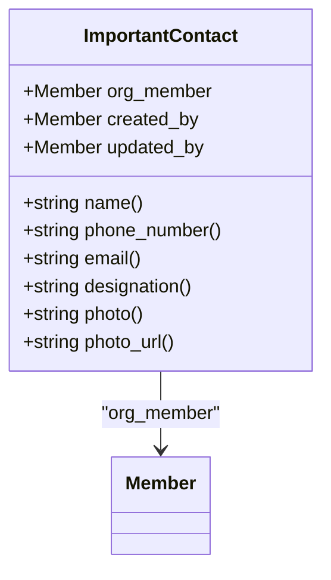
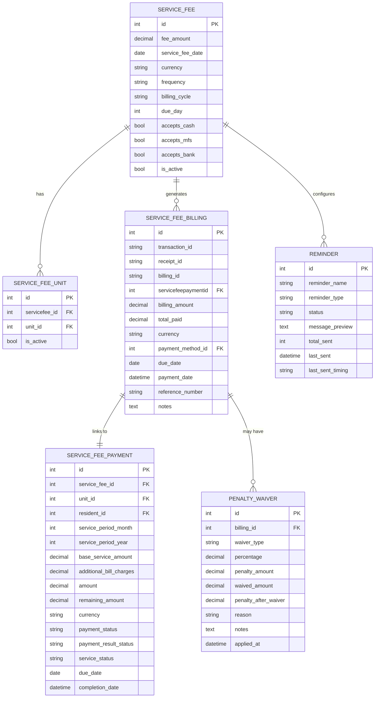
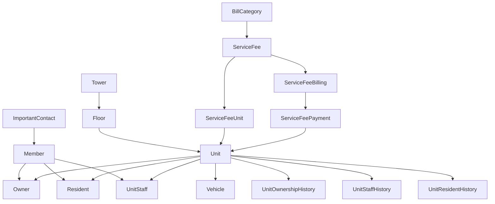

# Property Management Models

<cite>
**Referenced Files in This Document**
- [models.py](file://backend/towers/models.py)
- [models.py](file://backend/user/models.py)
- [models.py](file://backend/service_fee/models.py)
- [models.py](file://backend/service_fee_management/models.py)
- [models.py](file://backend/contacts/models.py)
- [models.py](file://backend/bulletins/models.py)
- [models.py](file://backend/bill_categories/models.py)
- [0007_vehicle.py](file://backend/towers/migrations/0007_vehicle.py)
- [0012_unitownershiphistory.py](file://backend/towers/migrations/0012_unitownershiphistory.py)
- [0016_unitstaffhistory.py](file://backend/towers/migrations/0016_unitstaffhistory.py)
- [0018_unitresidenthistory.py](file://backend/towers/migrations/0018_unitresidenthistory.py)
- [vehicle_views.py](file://backend/towers/views/vehicle_views.py)
- [vehicle_serializers.py](file://backend/towers/serializers/vehicle_serializers.py)
- [urls.py](file://backend/towers/urls.py)
</cite>

## Table of Contents
1. [Introduction](#introduction)
2. [Project Structure](#project-structure)
3. [Core Components](#core-components)
4. [Architecture Overview](#architecture-overview)
5. [Detailed Component Analysis](#detailed-component-analysis)
6. [Dependency Analysis](#dependency-analysis)
7. [Performance Considerations](#performance-considerations)
8. [Troubleshooting Guide](#troubleshooting-guide)
9. [Conclusion](#conclusion)

## Introduction
This document provides comprehensive data model documentation for property management entities within the estate-link system. It covers the hierarchical structure of towers, floors, and units, along with ownership, residency, staff, and vehicle registration models. It also documents unit status management, contact management, and the relationship between properties and service fees, billing cycles, and payment tracking. Validation rules for property assignments, occupancy status changes, and transfer processes are explained, alongside historical tracking mechanisms for ownership, staff, and residents.

## Project Structure
The property management domain spans several Django applications:
- towers: Contains building hierarchy (Tower, Floor, Unit), ownership, residency, staff, and vehicle registration.
- user: Defines Member profiles and organizational membership flags.
- service_fee: Manages service fee settings and billing cycle configuration.
- service_fee_management: Handles billing records, payments, reminders, and penalty waivers.
- contacts: Important contacts derived from organization members.
- bill_categories: Utility bill categories used in service fee management.
- bulletins: Related communication models (contextual to property management workflows).

**Diagram sources**
- [models.py](file://backend/towers/models.py#L7-L1332)
- [models.py](file://backend/user/models.py#L15-L199)
- [models.py](file://backend/service_fee/models.py#L10-L470)
- [models.py](file://backend/service_fee_management/models.py#L11-L1088)
- [models.py](file://backend/contacts/models.py#L7-L95)
- [models.py](file://backend/bill_categories/models.py#L5-L86)

**Section sources**
- [models.py](file://backend/towers/models.py#L1-L1332)
- [models.py](file://backend/user/models.py#L1-L199)
- [models.py](file://backend/service_fee/models.py#L1-L470)
- [models.py](file://backend/service_fee_management/models.py#L1-L1088)
- [models.py](file://backend/contacts/models.py#L1-L95)
- [models.py](file://backend/bill_categories/models.py#L1-L86)

## Core Components
This section outlines the primary models and their responsibilities:

- Tower: Represents a building with metadata, unit naming configuration, and counts.
- Floor: Associates floors to a Tower with unit counts.
- Unit: Core property unit with status, area, and primary/secondary/emergency contact fields.
- Owner: Links a Member to a Unit with ownership percentage and transfer tracking.
- Resident: Links a Member to a Unit with residency/tenancy status and financial details.
- UnitStaff: Links staff to a Unit with live-in/part-time status.
- Vehicle: Registration model for vehicles assigned to Units.
- UnitOwnershipHistory: Timeline of ownership events and state snapshots.
- UnitStaffHistory: Timeline of staff assignments and status changes.
- UnitResidentHistory: Timeline of resident assignments and updates.
- Member: Organization member profile with personal and contact details.
- ServiceFee: Service fee configuration including towers/units, billing cycle, due date, and payment methods.
- ServiceFeeUnit: Through model for soft-deleted unit assignments to service fees.
- ServiceFeeBilling: Normalized billing records with amounts and payment tracking.
- ServiceFeePayment: Payment transactions with status and result tracking.
- Reminder: Automated reminder configuration with timing rules and audience targeting.
- PenaltyWaiver: Records of penalty waivers against billing records.
- ImportantContact: Important contacts derived from organization members.
- BillCategory: Categorization of utility bills used in service fee management.

**Section sources**
- [models.py](file://backend/towers/models.py#L7-L1332)
- [models.py](file://backend/user/models.py#L15-L199)
- [models.py](file://backend/service_fee/models.py#L10-L470)
- [models.py](file://backend/service_fee_management/models.py#L11-L1088)
- [models.py](file://backend/contacts/models.py#L7-L95)
- [models.py](file://backend/bill_categories/models.py#L5-L86)

## Architecture Overview
The property management system follows a layered architecture:
- Domain models encapsulate business entities and relationships.
- Service fee models separate billing configuration from payment processing.
- Historical tracking models maintain immutable timelines for ownership, staff, and residents.
- Supporting models provide contact management and bill categorization.

**Diagram sources**
- [models.py](file://backend/towers/models.py#L7-L1332)
- [models.py](file://backend/user/models.py#L15-L199)

## Detailed Component Analysis

### Building Hierarchy: Towers, Floors, Units
- Tower: Stores building-level metadata, unit naming scheme, and counts. It links to Floors via foreign keys.
- Floor: Associates a floor number and unit count to a Tower.
- Unit: Contains unit-specific details including status, area, rooms, bathrooms, balconies, and contact fields. It links to Floor and supports Owner, Resident, UnitStaff, Vehicle, and history models.

**Diagram sources**
- [models.py](file://backend/towers/models.py#L60-L122)

**Section sources**
- [models.py](file://backend/towers/models.py#L38-L122)

### Ownership Management
- Owner: Links a Member to a Unit with ownership percentage and transfer tracking. Includes last transfer date and initial ownership date.
- UnitOwnershipHistory: Immutable timeline of ownership events including initial ownership, ownership transfer, and ownership state updates. Stores complete ownership state before and after each event as JSON arrays.

**Diagram sources**
- [models.py](file://backend/towers/models.py#L193-L360)

**Section sources**
- [models.py](file://backend/towers/models.py#L193-L360)
- [0012_unitownershiphistory.py](file://backend/towers/migrations/0012_unitownershiphistory.py#L1-L54)

### Resident Management and Movement Tracking
- Resident: Links a Member to a Unit with residency/tenancy status, rent fee, advance payment, and notice period.
- UnitResidentHistory: Timeline of resident assignments, removals, status changes, and information updates. Stores complete resident state before and after each event as JSON arrays.

**Diagram sources**
- [models.py](file://backend/towers/models.py#L149-L192)
- [models.py](file://backend/towers/models.py#L964-L1332)

**Section sources**
- [models.py](file://backend/towers/models.py#L149-L192)
- [models.py](file://backend/towers/models.py#L964-L1332)
- [0018_unitresidenthistory.py](file://backend/towers/migrations/0018_unitresidenthistory.py#L1-L38)

### Staff Assignments and History
- UnitStaff: Links a Member to a Unit with live-in/part-time status and active flag.
- UnitStaffHistory: Timeline of staff assignments, removals, and status changes. Stores complete staff state before and after each event as JSON arrays.

**Diagram sources**
- [models.py](file://backend/towers/models.py#L240-L255)
- [models.py](file://backend/towers/models.py#L701-L961)

**Section sources**
- [models.py](file://backend/towers/models.py#L240-L255)
- [models.py](file://backend/towers/models.py#L701-L961)
- [0016_unitstaffhistory.py](file://backend/towers/migrations/0016_unitstaffhistory.py#L1-L56)

### Vehicle Registration Model
- Vehicle: Registration model for vehicles assigned to Units with brand, color, license plate, type, and status. License plate is unique.
- Vehicle endpoints support listing, filtering by tower/unit/status, retrieval, creation, update, deletion, and status toggling.

**Diagram sources**
- [models.py](file://backend/towers/migrations/0007_vehicle.py#L14-L26)
- [vehicle_views.py](file://backend/towers/views/vehicle_views.py#L150-L165)
- [vehicle_serializers.py](file://backend/towers/serializers/vehicle_serializers.py#L42-L85)

**Section sources**
- [models.py](file://backend/towers/migrations/0007_vehicle.py#L1-L28)
- [vehicle_views.py](file://backend/towers/views/vehicle_views.py#L74-L105)
- [vehicle_views.py](file://backend/towers/views/vehicle_views.py#L107-L131)
- [vehicle_views.py](file://backend/towers/views/vehicle_views.py#L134-L146)
- [vehicle_views.py](file://backend/towers/views/vehicle_views.py#L150-L165)
- [vehicle_views.py](file://backend/towers/views/vehicle_views.py#L166-L170)
- [vehicle_views.py](file://backend/towers/views/vehicle_views.py#L174-L181)
- [vehicle_views.py](file://backend/towers/views/vehicle_views.py#L184-L198)
- [vehicle_views.py](file://backend/towers/views/vehicle_views.py#L201-L228)
- [vehicle_views.py](file://backend/towers/views/vehicle_views.py#L232-L238)
- [vehicle_serializers.py](file://backend/towers/serializers/vehicle_serializers.py#L42-L85)

### Contact Management for Properties
- ImportantContact: References organization members and exposes their details (name, phone, email, designation, photo) via properties. Validates that the referenced member is an organization member.

**Diagram sources**
- [models.py](file://backend/contacts/models.py#L7-L95)

**Section sources**
- [models.py](file://backend/contacts/models.py#L7-L95)

### Service Fees, Billing Cycles, and Payment Tracking
- ServiceFee: Central configuration for service fees including towers/units, billing cycle, due day, accepted payment methods, and reminder settings.
- ServiceFeeUnit: Through model supporting soft-deleted unit assignments to service fees.
- ServiceFeeBilling: Normalized billing records with amounts, currency, payment method, and payment tracking.
- ServiceFeePayment: Payment transactions with status, result status, and service period.
- Reminder: Automated reminder configuration with timing rules and audience targeting.
- PenaltyWaiver: Records of penalty waivers against billing records.

**Diagram sources**
- [models.py](file://backend/service_fee/models.py#L10-L470)
- [models.py](file://backend/service_fee_management/models.py#L11-L1088)

**Section sources**
- [models.py](file://backend/service_fee/models.py#L10-L470)
- [models.py](file://backend/service_fee_management/models.py#L11-L1088)

### Data Validation Rules
- Property Assignments:
  - ServiceFee: Prevents duplicate unit assignments across active service fees by checking overlapping units between active fees.
  - Vehicle: License plate uniqueness enforced at model level.
- Occupancy Status Changes:
  - Unit status choices constrained to predefined values.
  - UnitResidentHistory enforces consistent state transitions for resident assignments/removals/status changes.
- Transfer Processes:
  - UnitOwnershipHistory validates and sorts ownership state snapshots, filtering zero or negative shares.
  - UnitOwnershipHistory.calculate_ownership_state_after_transfer computes new shares and determines source owner removal.

**Section sources**
- [models.py](file://backend/service_fee/models.py#L86-L159)
- [models.py](file://backend/towers/models.py#L64-L90)
- [models.py](file://backend/towers/models.py#L590-L698)

## Dependency Analysis
The following diagram highlights key dependencies among models:

**Diagram sources**
- [models.py](file://backend/towers/models.py#L7-L1332)
- [models.py](file://backend/user/models.py#L15-L199)
- [models.py](file://backend/service_fee/models.py#L10-L470)
- [models.py](file://backend/service_fee_management/models.py#L11-L1088)
- [models.py](file://backend/contacts/models.py#L7-L95)
- [models.py](file://backend/bill_categories/models.py#L5-L86)

**Section sources**
- [models.py](file://backend/towers/models.py#L1-L1332)
- [models.py](file://backend/user/models.py#L1-L199)
- [models.py](file://backend/service_fee/models.py#L1-L470)
- [models.py](file://backend/service_fee_management/models.py#L1-L1088)
- [models.py](file://backend/contacts/models.py#L1-L95)
- [models.py](file://backend/bill_categories/models.py#L1-L86)

## Performance Considerations
- Indexes: Ownership, staff, and resident history tables include composite indexes on unit and entry date to optimize chronological queries.
- JSON Fields: State snapshots (ownership_state_before/after, staff_state_before/after, resident_state_before/after) enable fast historical reconstruction but require careful querying to avoid large payload loads.
- Soft Deletes: ServiceFeeUnit uses is_active to avoid cascade deletions while maintaining referential integrity.
- Unique Constraints: Vehicle license plate uniqueness prevents duplicates; ServiceFee M2M validation avoids overlapping unit assignments across active fees.

[No sources needed since this section provides general guidance]

## Troubleshooting Guide
- Duplicate Unit Assignments: ServiceFee validation logs warnings when overlapping units are found across active service fees; ensure units are uniquely assigned.
- Ownership State Integrity: UnitOwnershipHistory filters zero or negative shares and sorts by share percentage; verify ownership percentages sum to 100% for initial ownership lists.
- Vehicle Creation Failures: VehicleSerializer requires license_plate; ensure unique license plates and valid unit_id during creation.
- Payment Status Updates: ServiceFeePayment updates completion_date on status change to completed; ensure payment_status transitions are logged correctly.

**Section sources**
- [models.py](file://backend/service_fee/models.py#L86-L159)
- [models.py](file://backend/towers/models.py#L257-L588)
- [vehicle_serializers.py](file://backend/towers/serializers/vehicle_serializers.py#L42-L85)
- [models.py](file://backend/service_fee_management/models.py#L190-L327)

## Conclusion
The property management models establish a robust, hierarchical structure for buildings, units, and occupants, with comprehensive historical tracking for ownership, staff, and residents. Service fee configuration integrates seamlessly with billing and payment systems, while vehicle registration and contact management provide practical utilities for property administration. Validation rules and indexing strategies ensure data integrity and query performance across the system.