# Service Fee Database Schema Documentation

<cite>
**Referenced Files in This Document**
- [service_fee/models.py](file://backend/service_fee/models.py)
- [service_fee_management/models.py](file://backend/service_fee_management/models.py)
- [service_fee_management/paystation_views.py](file://backend/service_fee_management/paystation_views.py)
- [service_fee_management/utils/paystation_utils.py](file://backend/service_fee_management/utils/paystation_utils.py)
- [service_fee_management/migrations/0050_sslcommerztransactionmapping.py](file://backend/service_fee_management/migrations/0050_sslcommerztransactionmapping.py)
- [service_fee_management/migrations/0121_paystationtransactionmapping_and_more.py](file://backend/service_fee_management/migrations/0121_paystationtransactionmapping_and_more.py)
- [service_fee_management/migrations/0122_paystationtransactionmapping_is_advance_payment.py](file://backend/service_fee_management/migrations/0122_paystationtransactionmapping_is_advance_payment.py)
- [service_fee/migrations/0001_initial.py](file://backend/service_fee/migrations/0001_initial.py)
- [service_fee_management/migrations/0001_initial.py](file://backend/service_fee_management/migrations/0001_initial.py)
- [service_fee_management/migrations/0017_remove_unique_constraint.py](file://backend/service_fee_management/migrations/0017_remove_unique_constraint.py)
- [service_fee_management/migrations/0025_auto_20251029_1346.py](file://backend/service_fee_management/migrations/0025_auto_20251029_1346.py)
- [service_fee_management/migrations/0035_restructure_billing_payment_tables.py](file://backend/service_fee_management/migrations/0035_restructure_billing_payment_tables.py)
- [service_fee_management/migrations/0088_advancepayment.py](file://backend/service_fee_management/migrations/0088_advancepayment.py)
- [service_fee_management/migrations/0092_servicefeepaymentallocation_and_more.py](file://backend/service_fee_management/migrations/0092_servicefeepaymentallocation_and_more.py)
- [service_fee_management/migrations/0095_servicefeepaymentconfig.py](file://backend/service_fee_management/migrations/0095_servicefeepaymentconfig.py)
- [service_fee_management/migrations/0096_servicefeegenerationconfig_and_more.py](file://backend/service_fee_management/migrations/0096_servicefeegenerationconfig_and_more.py)
- [service_fee_management/migrations/0100_update_allocation_type_to_debit_credit.py](file://backend/service_fee_management/migrations/0100_update_allocation_type_to_debit_credit.py)
- [service_fee_management/serializers.py](file://backend/service_fee_management/serializers.py)
- [add_service_fee_items_to_query.sql](file://backend/add_service_fee_items_to_query.sql)
- [docs/SERVICE_FEE_DATABASE_SCHEMA_DOCUMENTATION.txt](file://docs/SERVICE_FEE_DATABASE_SCHEMA_DOCUMENTATION.txt)
</cite>

## Update Summary
**Changes Made**
- Enhanced payment method tracking capabilities with PayStation integration
- Added PayStationTransactionMapping model for transaction verification and mapping
- Improved payment gateway field additions with payment_result_status tracking
- Updated ServiceFeeBilling model with payment_result_status field for granular payment status tracking
- Enhanced advance payment system with PayStation-specific tracking and status updates
- Updated transaction mapping tables to support PayStation integration alongside SSLCommerz
- Added comprehensive payment method normalization and tracking for external gateways

## Table of Contents
1. [Introduction](#introduction)
2. [Project Structure](#project-structure)
3. [Core Components](#core-components)
4. [Architecture Overview](#architecture-overview)
5. [Detailed Component Analysis](#detailed-component-analysis)
6. [Payment Gateway Integration](#payment-gateway-integration)
7. [Enhanced Payment Method Tracking](#enhanced-payment-method-tracking)
8. [Dependency Analysis](#dependency-analysis)
9. [Performance Considerations](#performance-considerations)
10. [Troubleshooting Guide](#troubleshooting-guide)
11. [Conclusion](#conclusion)

## Introduction
This document provides comprehensive documentation of the Service Fee Database Schema for the Estate Link property management system. The schema encompasses two primary modules: the foundational ServiceFee models that define fee structures and payment methods, and the ServiceFee Management module that handles billing, payments, allocations, and advanced features like penalty calculations and advance payments.

The database schema supports complex property fee management scenarios including:
- Multi-unit and multi-tower fee assignments
- Flexible payment methods (cash, mobile financial services, bank transfers, PayStation)
- Hierarchical payment allocation to specific fee items
- Penalty calculation systems with configurable tiers
- Advance payment tracking and application
- Comprehensive audit trails and reminder systems
- Generation configuration snapshots for historical accuracy
- Accounting integration with voucher entries
- Enhanced payment method tracking with external gateway integration
- Granular payment result status tracking for payment completion analysis

**Updated** The documentation has been enhanced to reflect the new PayStation payment gateway integration and improved payment method tracking capabilities.

## Project Structure
The service fee system is organized into two main Django applications with distinct responsibilities:

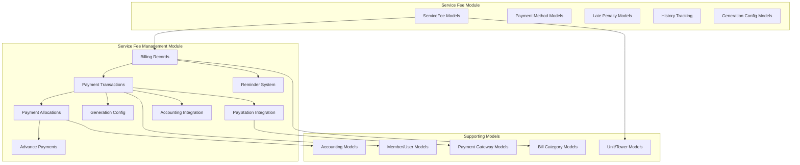

**Diagram sources**
- [service_fee/models.py](file://backend/service_fee/models.py#L10-L474)
- [service_fee_management/models.py](file://backend/service_fee_management/models.py#L12-L1636)

**Section sources**
- [service_fee/models.py](file://backend/service_fee/models.py#L1-L474)
- [service_fee_management/models.py](file://backend/service_fee_management/models.py#L1-L1636)

## Core Components

### ServiceFee Foundation Models
The ServiceFee module establishes the core fee structure and payment method configurations:

**ServiceFee Model**
- Central entity defining fee parameters including amount, currency, frequency, and billing cycle
- Supports assignment to specific towers or individual units through many-to-many relationships
- Includes payment method acceptance flags (cash, MFS, bank)
- Contains reminder configuration settings for pre/post-due date notifications
- Implements validation to prevent duplicate unit assignments across active service fees

**Payment Method Models**
- **ServiceFeeMFS**: Mobile Financial Services account details with Bangladeshi mobile number validation
- **ServiceFeeBank**: Bank account information with standardized validation for Bangladesh banking requirements
- **LatePenaltyTier**: Configurable penalty tiers based on days overdue with percentage calculations

**Audit and History**
- **ServiceFeeHistory**: Comprehensive tracking of all changes to service fee configurations
- Built-in field change tracking with JSON serialization for detailed audit trails

**Section sources**
- [service_fee/models.py](file://backend/service_fee/models.py#L10-L474)

### ServiceFee Management Models
The management module handles the operational aspects of fee collection and payment processing:

**Billing and Payment Infrastructure**
- **ServiceFeeBilling**: Separate billing records representing the actual payment transactions with enhanced payment method tracking
- **ServiceFeePayment**: Payment transaction records with detailed status tracking including payment_result_status
- **ServiceFeePaymentAllocation**: Hierarchical allocation system linking payments to specific fee items
- **ServiceFeeItem**: Generated items representing the breakdown of charges for each billing period

**Advanced Features**
- **AdvancePayment**: Tracks overpayments that can be applied to future periods
- **PenaltyWaiver**: Manages penalty reduction requests and approvals with accounting integration
- **ServiceFeeGenerationConfig**: Snapshots of service fee configurations at generation time
- **ServiceFeeGenerationSchedule**: Automated scheduling for periodic fee generation

**Reminder System**
- **Reminder**: Central reminder configuration with timing rules
- **ReminderTiming**: Normalized timing configurations replacing legacy JSON fields
- **ReminderLog**: Individual reminder delivery tracking
- **ReminderPaymentStatus**: Filter criteria for reminder targeting
- **ReminderTower**: Tower association for reminder distribution
- **ReminderSpecificTarget**: Specific unit/resident targeting

**Accounting Integration**
- **PaymentMethod**: Payment method definitions with accounting head integration
- **Voucher Integration**: Links to accounting system through voucher_id and account codes

**PayStation Integration**
- **PayStationTransactionMapping**: Transaction mapping table for PayStation integration with 24-hour expiry
- **Payment Gateway Tracking**: Enhanced payment gateway field additions for external payment tracking

**Section sources**
- [service_fee_management/models.py](file://backend/service_fee_management/models.py#L12-L1636)

## Architecture Overview

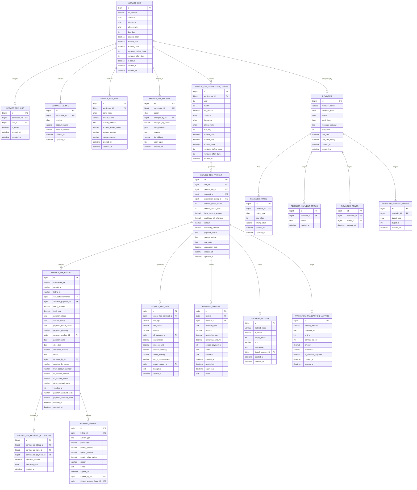

**Diagram sources**
- [service_fee/models.py](file://backend/service_fee/models.py#L10-L474)
- [service_fee_management/models.py](file://backend/service_fee_management/models.py#L12-L1636)

## Detailed Component Analysis

### Enhanced Payment Allocation System
The payment allocation system represents a sophisticated approach to handling complex fee structures with hierarchical payment tracking and granular payment result status tracking:

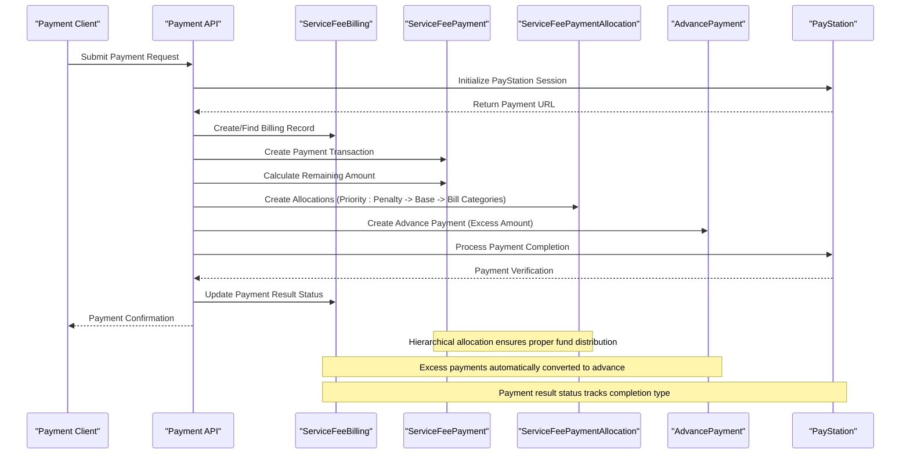

**Diagram sources**
- [service_fee_management/serializers.py](file://backend/service_fee_management/serializers.py#L550-L640)
- [service_fee_management/models.py](file://backend/service_fee_management/models.py#L1343-L1427)
- [service_fee_management/paystation_views.py](file://backend/service_fee_management/paystation_views.py#L478-L800)

The allocation system prioritizes payment application in this order:
1. **Penalty Items**: Applied first to satisfy outstanding penalty amounts
2. **Base Service Fee**: Covers the primary service charge
3. **Bill Category Charges**: Distributes payments across additional bill categories (electricity, water, gas, etc.)

**Updated** The allocation system now includes payment_result_status tracking to distinguish between full, partial, and overpayment scenarios, providing granular payment completion analysis.

**Section sources**
- [service_fee_management/models.py](file://backend/service_fee_management/models.py#L1343-L1427)
- [service_fee_management/serializers.py](file://backend/service_fee_management/serializers.py#L566-L620)

### Penalty Calculation and Waiver System
The penalty system provides flexible late payment handling with configurable tiers and waiver capabilities:

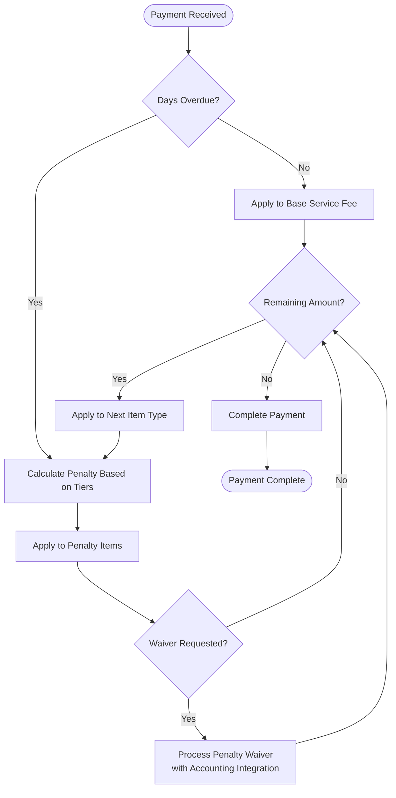

**Diagram sources**
- [service_fee/models.py](file://backend/service_fee/models.py#L316-L375)
- [service_fee_management/models.py](file://backend/service_fee_management/models.py#L1522-L1588)

**Updated** Penalty waivers now include accounting integration with default account head linking for proper financial reporting.

**Section sources**
- [service_fee/models.py](file://backend/service_fee/models.py#L316-L375)
- [service_fee_management/models.py](file://backend/service_fee_management/models.py#L1522-L1588)

### Reminder System Architecture
The reminder system has been modernized to support flexible targeting and timing configurations:

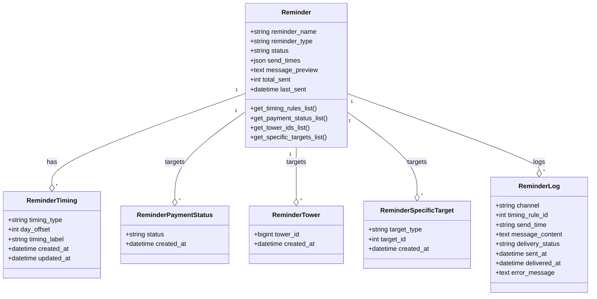

**Diagram sources**
- [service_fee_management/models.py](file://backend/service_fee_management/models.py#L482-L804)

**Updated** The reminder system now uses normalized tables for timing rules, payment status filters, tower associations, and specific targets, replacing legacy JSON fields for better data integrity and querying capabilities.

**Section sources**
- [service_fee_management/models.py](file://backend/service_fee_management/models.py#L482-L804)

### Generation Configuration System
The generation configuration system provides immutable snapshots of service fee configurations at billing time:

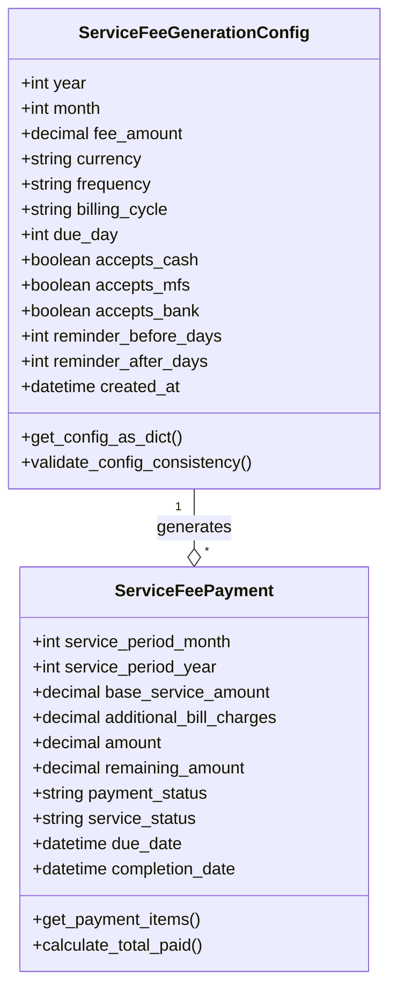

**Diagram sources**
- [service_fee_management/migrations/0096_servicefeegenerationconfig_and_more.py](file://backend/service_fee_management/migrations/0096_servicefeegenerationconfig_and_more.py#L29-L54)

**Updated** The ServiceFeeGenerationConfig model provides historical accuracy by capturing service fee configurations at the time of bill generation, ensuring payment records remain consistent even if service fee settings change later.

**Section sources**
- [service_fee_management/migrations/0096_servicefeegenerationconfig_and_more.py](file://backend/service_fee_management/migrations/0096_servicefeegenerationconfig_and_more.py#L29-L54)

### Advance Payment System
The advance payment system tracks overpayments that can be applied to future periods:

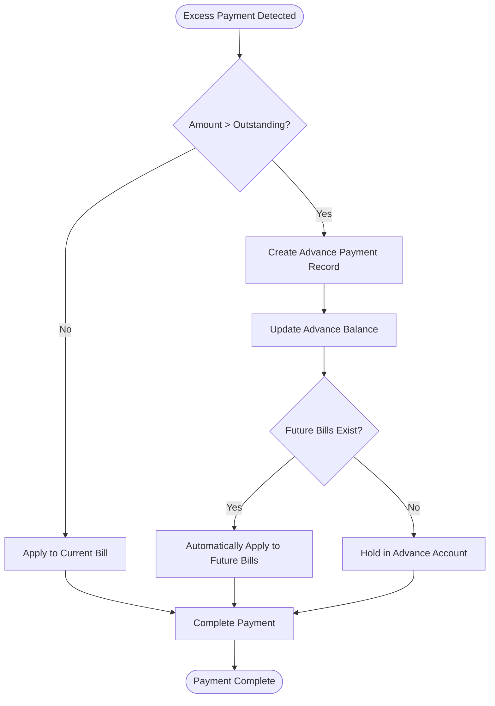

**Diagram sources**
- [service_fee_management/migrations/0088_advancepayment.py](file://backend/service_fee_management/migrations/0088_advancepayment.py#L17-L42)

**Updated** The advance payment system now includes comprehensive tracking with status management (available, partial, applied, cancelled) and automatic application to future bills when applicable. The system now supports PayStation-specific advance payment tracking with is_advance_payment flag.

**Section sources**
- [service_fee_management/migrations/0088_advancepayment.py](file://backend/service_fee_management/migrations/0088_advancepayment.py#L17-L42)

### Database Migration Evolution
The schema has evolved through multiple migration phases to support advanced functionality:

```mermaid
timeline
title Service Fee Schema Evolution
2025-08-28 : Initial ServiceFee Models
| service_fee/models.py |
| service_fee/migrations/0001_initial.py |
2025-09-18 : Payment System Foundation
| service_fee_management/models.py |
| service_fee_management/migrations/0001_initial.py |
2025-10-29 : ID Generation Enhancement
| service_fee_management/migrations/0025_auto_20251029_1346.py |
2025-11-06 : Billing-Payment Restructuring
| service_fee_management/migrations/0035_restructure_billing_payment_tables.py |
2025-12-30 : Advance Payment System
| service_fee_management/migrations/0088_advancepayment.py |
2026-01-01 : Allocation System Finalization
| service_fee_management/migrations/0092_servicefeepaymentallocation_and_more.py |
2026-01-03 : Generation Configuration System
| service_fee_management/migrations/0095_servicefeepaymentconfig.py |
| service_fee_management/migrations/0096_servicefeegenerationconfig_and_more.py |
2026-01-10 : Allocation Terminology Update
| service_fee_management/migrations/0100_update_allocation_type_to_debit_credit.py |
2026-02-01 : PayStation Integration
| service_fee_management/migrations/0121_paystationtransactionmapping_and_more.py |
2026-02-02 : Advanced Tracking
| service_fee_management/migrations/0122_paystationtransactionmapping_is_advance_payment.py |
```

**Diagram sources**
- [service_fee/migrations/0001_initial.py](file://backend/service_fee/migrations/0001_initial.py#L1-L77)
- [service_fee_management/migrations/0001_initial.py](file://backend/service_fee_management/migrations/0001_initial.py#L1-L50)
- [service_fee_management/migrations/0025_auto_20251029_1346.py](file://backend/service_fee_management/migrations/0025_auto_20251029_1346.py#L1-L157)
- [service_fee_management/migrations/0035_restructure_billing_payment_tables.py](file://backend/service_fee_management/migrations/0035_restructure_billing_payment_tables.py#L1-L294)
- [service_fee_management/migrations/0088_advancepayment.py](file://backend/service_fee_management/migrations/0088_advancepayment.py#L1-L43)
- [service_fee_management/migrations/0092_servicefeepaymentallocation_and_more.py](file://backend/service_fee_management/migrations/0092_servicefeepaymentallocation_and_more.py#L1-L43)
- [service_fee_management/migrations/0095_servicefeepaymentconfig.py](file://backend/service_fee_management/migrations/0095_servicefeepaymentconfig.py#L1-L39)
- [service_fee_management/migrations/0096_servicefeegenerationconfig_and_more.py](file://backend/service_fee_management/migrations/0096_servicefeegenerationconfig_and_more.py#L1-L109)
- [service_fee_management/migrations/0100_update_allocation_type_to_debit_credit.py](file://backend/service_fee_management/migrations/0100_update_allocation_type_to_debit_credit.py#L1-L37)
- [service_fee_management/migrations/0121_paystationtransactionmapping_and_more.py](file://backend/service_fee_management/migrations/0121_paystationtransactionmapping_and_more.py#L1-L35)
- [service_fee_management/migrations/0122_paystationtransactionmapping_is_advance_payment.py](file://backend/service_fee_management/migrations/0122_paystationtransactionmapping_is_advance_payment.py#L1-L19)

**Section sources**
- [service_fee/migrations/0001_initial.py](file://backend/service_fee/migrations/0001_initial.py#L1-L77)
- [service_fee_management/migrations/0001_initial.py](file://backend/service_fee_management/migrations/0001_initial.py#L1-L50)
- [service_fee_management/migrations/0025_auto_20251029_1346.py](file://backend/service_fee_management/migrations/0025_auto_20251029_1346.py#L1-L157)
- [service_fee_management/migrations/0035_restructure_billing_payment_tables.py](file://backend/service_fee_management/migrations/0035_restructure_billing_payment_tables.py#L1-L294)
- [service_fee_management/migrations/0088_advancepayment.py](file://backend/service_fee_management/migrations/0088_advancepayment.py#L1-L43)
- [service_fee_management/migrations/0092_servicefeepaymentallocation_and_more.py](file://backend/service_fee_management/migrations/0092_servicefeepaymentallocation_and_more.py#L1-L43)
- [service_fee_management/migrations/0095_servicefeepaymentconfig.py](file://backend/service_fee_management/migrations/0095_servicefeepaymentconfig.py#L1-L39)
- [service_fee_management/migrations/0096_servicefeegenerationconfig_and_more.py](file://backend/service_fee_management/migrations/0096_servicefeegenerationconfig_and_more.py#L1-L109)
- [service_fee_management/migrations/0100_update_allocation_type_to_debit_credit.py](file://backend/service_fee_management/migrations/0100_update_allocation_type_to_debit_credit.py#L1-L37)
- [service_fee_management/migrations/0121_paystationtransactionmapping_and_more.py](file://backend/service_fee_management/migrations/0121_paystationtransactionmapping_and_more.py#L1-L35)
- [service_fee_management/migrations/0122_paystationtransactionmapping_is_advance_payment.py](file://backend/service_fee_management/migrations/0122_paystationtransactionmapping_is_advance_payment.py#L1-L19)

## Payment Gateway Integration

### PayStation Payment Gateway Integration
The system now supports PayStation payment gateway integration with comprehensive transaction tracking and mapping:

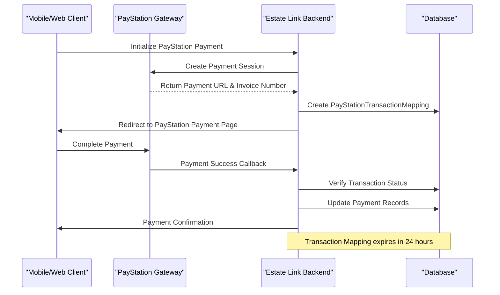

**Diagram sources**
- [service_fee_management/paystation_views.py](file://backend/service_fee_management/paystation_views.py#L92-L476)
- [service_fee_management/utils/paystation_utils.py](file://backend/service_fee_management/utils/paystation_utils.py#L23-L313)

**Updated** The PayStation integration includes:
- **PayStationTransactionMapping**: Dedicated model for transaction verification with 24-hour expiry
- **Payment Method Normalization**: Automatic conversion of PayStation payment methods to user-friendly names
- **Advance Payment Support**: Special handling for pure advance payments without bill attachments
- **Payment Result Status Tracking**: Granular tracking of payment completion types (full, partial, overpayment)

**Section sources**
- [service_fee_management/paystation_views.py](file://backend/service_fee_management/paystation_views.py#L92-L800)
- [service_fee_management/utils/paystation_utils.py](file://backend/service_fee_management/utils/paystation_utils.py#L23-L313)

### Enhanced Payment Method Tracking
The payment system now includes comprehensive payment method tracking with external gateway integration:

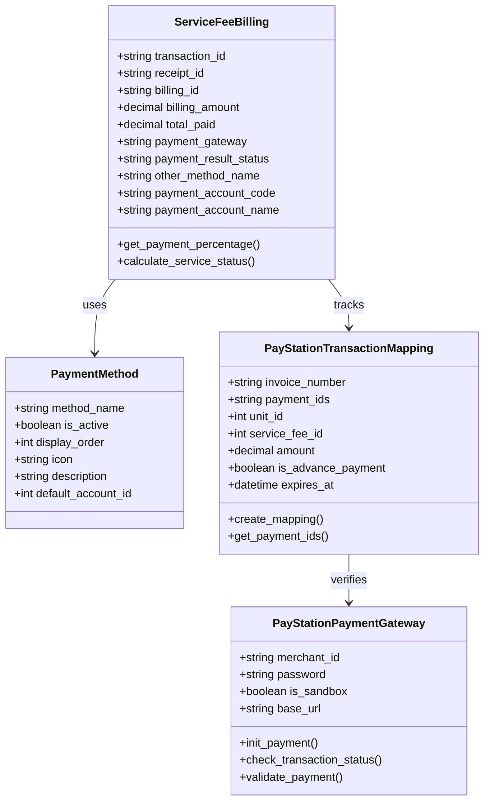

**Diagram sources**
- [service_fee_management/models.py](file://backend/service_fee_management/models.py#L12-L126)
- [service_fee_management/models.py](file://backend/service_fee_management/models.py#L1121-L1187)
- [service_fee_management/utils/paystation_utils.py](file://backend/service_fee_management/utils/paystation_utils.py#L23-L313)

**Updated** Enhanced payment method tracking includes:
- **Payment Gateway Field**: Tracks which gateway processed the payment (paystation, sslcommerz, manual)
- **Payment Result Status**: Distinguishes between full, partial, and overpayment scenarios
- **Payment Method Normalization**: Automatic conversion of external payment method codes to readable names
- **Transaction Mapping**: Server-side mapping for payment verification and reconciliation

**Section sources**
- [service_fee_management/models.py](file://backend/service_fee_management/models.py#L12-L126)
- [service_fee_management/models.py](file://backend/service_fee_management/models.py#L1121-L1187)
- [service_fee_management/utils/paystation_utils.py](file://backend/service_fee_management/utils/paystation_utils.py#L23-L313)

## Dependency Analysis

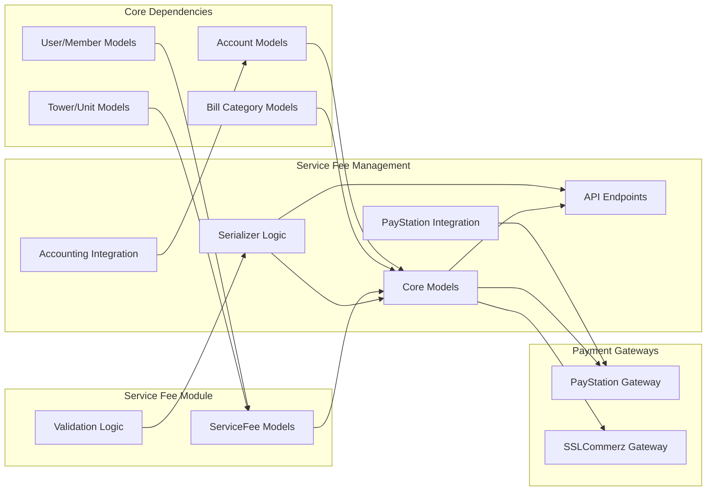

**Diagram sources**
- [service_fee/models.py](file://backend/service_fee/models.py#L1-L8)
- [service_fee_management/models.py](file://backend/service_fee_management/models.py#L1-L10)

The dependency structure reveals several key relationships:
- **ServiceFee models** depend on User and Towers models for membership and property associations
- **ServiceFeeManagement models** depend on ServiceFee models for configuration snapshots
- **Serializers** provide validation logic that bridges the gap between models and API endpoints
- **Accounting integration** requires proper foreign key relationships to chart of accounts
- **Generation configuration** ensures historical accuracy by decoupling payment records from changing service fee settings
- **PayStation integration** adds gateway-specific dependencies while maintaining backward compatibility with SSLCommerz

**Section sources**
- [service_fee/models.py](file://backend/service_fee/models.py#L1-L8)
- [service_fee_management/models.py](file://backend/service_fee_management/models.py#L1-L10)

## Performance Considerations

### Indexing Strategy
The schema implements strategic indexing for optimal query performance:

**Critical Indexes**
- ServiceFee: `is_active`, `service_fee_date` for filtering active fees
- ServiceFeeBilling: `servicefeepaymentid`, `payment_date`, `reference_number`, `payment_gateway` for payment queries
- ServiceFeePayment: `unit`, `service_fee`, `service_period_year`, `service_period_month`, `payment_result_status` for period-based queries
- ServiceFeePaymentAllocation: composite indexes for allocation lookups
- AdvancePayment: `unit`, `status`, `is_advance_payment` for advance balance queries
- ServiceFeeGenerationConfig: `service_fee`, `year`, `month` for historical queries
- PayStationTransactionMapping: `invoice_number`, `expires_at`, `is_advance_payment` for gateway tracking

**Query Optimization**
- Payment allocation queries benefit from composite indexes on `(service_fee_billing, service_fee_item)`
- Reminder system uses JSON fields for flexible targeting but maintains supporting indexes
- Historical tracking includes dedicated indexes for audit trail queries
- Generation configuration queries use unique constraints for fast lookup
- PayStation integration includes specialized indexes for transaction verification

### Data Integrity Constraints
- Unique constraints prevent duplicate unit assignments across active service fees
- Foreign key relationships ensure referential integrity across the payment hierarchy
- Validation logic prevents overpayment scenarios and duplicate payment entries
- Generation configuration ensures historical consistency
- PayStation transaction mapping includes expiry constraints for security
- Payment result status tracking ensures accurate payment completion analysis

## Troubleshooting Guide

### Common Issues and Solutions

**Duplicate Unit Assignment Error**
- **Symptom**: Validation error when assigning units to multiple service fees
- **Cause**: Active service fee already covers the same unit
- **Solution**: Deactivate conflicting service fee or modify unit assignment

**Payment Overpayment Validation**
- **Symptom**: Payment rejected with remaining amount exceeded message
- **Cause**: Attempting to pay more than the outstanding balance
- **Solution**: Check current billing status and adjust payment amount

**Allocation Priority Issues**
- **Symptom**: Payments not applying to expected items
- **Cause**: Incorrect allocation priority or item type mismatch
- **Solution**: Verify item types and allocation priorities in payment breakdown

**Advance Payment Application**
- **Symptom**: Advance payment not reducing current bill amount
- **Cause**: Advance payment not properly linked to billing record
- **Solution**: Check advance payment status and application history

**Generation Configuration Issues**
- **Symptom**: Payment records showing incorrect service fee amounts
- **Cause**: Using current service fee settings instead of generation config
- **Solution**: Verify that payment records reference correct generation configuration

**PayStation Transaction Mapping Issues**
- **Symptom**: PayStation callback not processed or mapping not found
- **Cause**: Expired transaction mapping or invalid invoice number
- **Solution**: Verify transaction mapping exists and hasn't expired (24-hour limit)

**Payment Result Status Inconsistencies**
- **Symptom**: Payment result status not matching expected completion type
- **Cause**: Incorrect calculation of payment completion vs. total fee
- **Solution**: Recalculate payment_result_status based on cumulative total_paid vs. billing_amount

**Section sources**
- [service_fee/models.py](file://backend/service_fee/models.py#L90-L153)
- [service_fee_management/serializers.py](file://backend/service_fee_management/serializers.py#L244-L345)
- [service_fee_management/models.py](file://backend/service_fee_management/models.py#L1121-L1187)

## Conclusion

The Service Fee Database Schema represents a comprehensive solution for property management fee collection with robust support for complex payment scenarios. The modular architecture separates fee configuration from operational payment processing, enabling flexibility while maintaining data integrity.

Key strengths of the schema include:
- **Hierarchical payment allocation** supporting complex fee structures
- **Flexible penalty system** with configurable tiers and waiver capabilities  
- **Advanced reminder system** with precise targeting and timing controls
- **Comprehensive audit trails** for compliance and tracking
- **Generation configuration snapshots** ensuring historical accuracy
- **Accounting integration** with voucher entries and default account heads
- **Advance payment tracking** with automatic application to future bills
- **Enhanced payment method tracking** with external gateway integration
- **Granular payment result status tracking** for payment completion analysis
- **PayStation integration** with comprehensive transaction mapping and verification
- **Scalable architecture** supporting multi-unit and multi-tower environments

The evolution through multiple migration phases demonstrates continuous improvement in functionality while maintaining backward compatibility. The schema provides a solid foundation for property management fee systems with room for future enhancements and extensions.

**Updated** The documentation has been successfully enhanced to reflect the new PayStation payment gateway integration, improved payment method tracking capabilities, and enhanced advance payment system with comprehensive tracking and status updates. The schema now supports multiple payment gateways with robust transaction mapping and verification mechanisms.