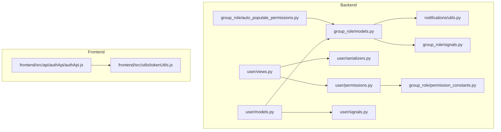
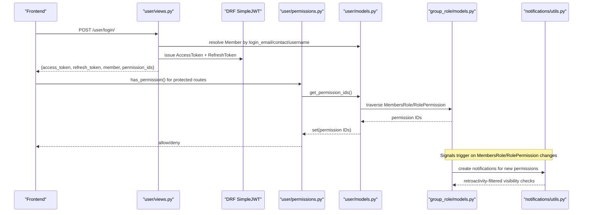
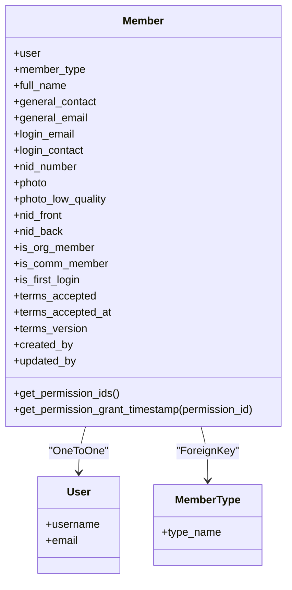
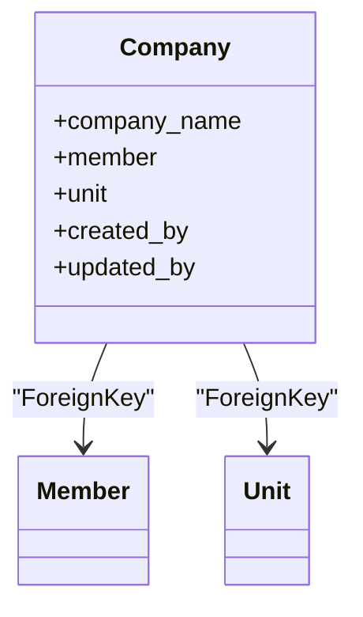
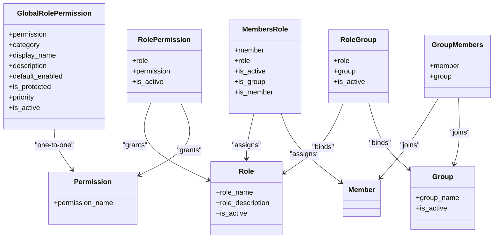
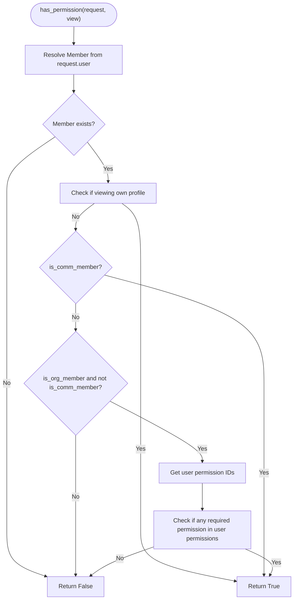
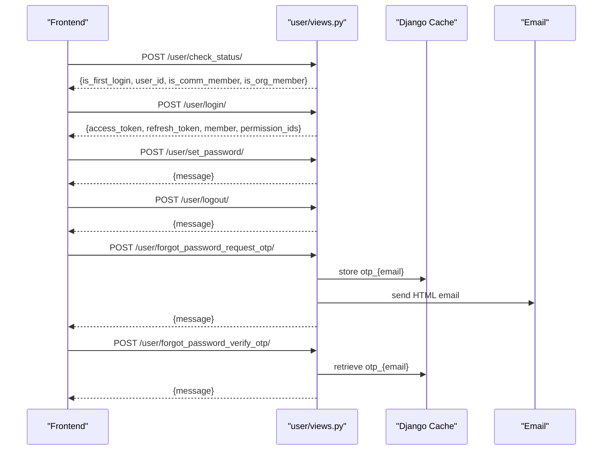
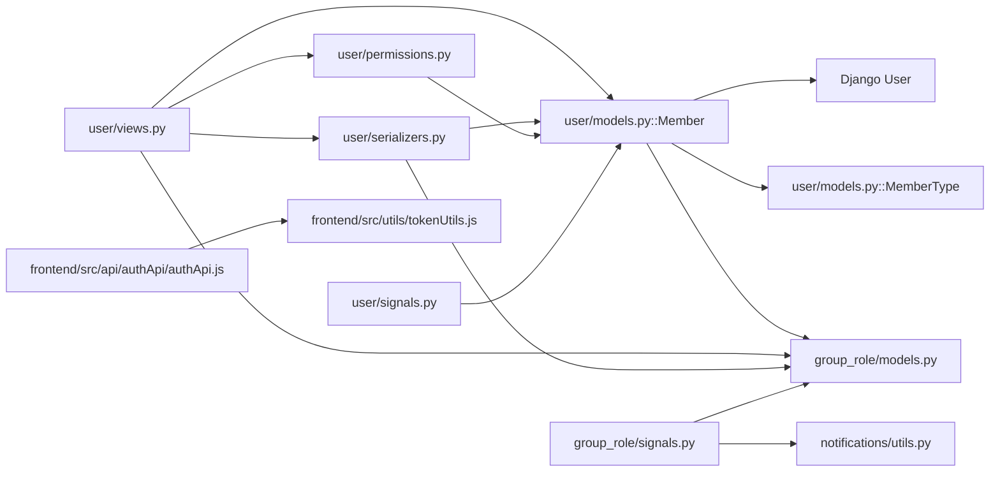

# User & Authentication Models

<cite>
**Referenced Files in This Document**
- [user/models.py](file://backend/user/models.py)
- [group_role/models.py](file://backend/group_role/models.py)
- [user/permissions.py](file://backend/user/permissions.py)
- [group_role/permission_constants.py](file://backend/group_role/permission_constants.py)
- [user/views.py](file://backend/user/views.py)
- [user/serializers.py](file://backend/user/serializers.py)
- [group_role/auto_populate_permissions.py](file://backend/group_role/auto_populate_permissions.py)
- [user/migrations/0003_member_terms_accepted_member_terms_accepted_at_and_more.py](file://backend/user/migrations/0003_member_terms_accepted_member_terms_accepted_at_and_more.py)
- [user/signals.py](file://backend/user/signals.py)
- [group_role/signals.py](file://backend/group_role/signals.py)
- [notifications/utils.py](file://backend/notifications/utils.py)
- [frontend/src/utils/tokenUtils.js](file://frontend/src/utils/tokenUtils.js)
- [frontend/src/api/authApi/authApi.js](file://frontend/src/api/authApi/authApi.js)
</cite>

## Table of Contents
1. [Introduction](#introduction)
2. [Project Structure](#project-structure)
3. [Core Components](#core-components)
4. [Architecture Overview](#architecture-overview)
5. [Detailed Component Analysis](#detailed-component-analysis)
6. [Dependency Analysis](#dependency-analysis)
7. [Performance Considerations](#performance-considerations)
8. [Troubleshooting Guide](#troubleshooting-guide)
9. [Conclusion](#conclusion)

## Introduction
This document provides comprehensive data model documentation for user management and authentication systems. It covers the Member, Company, and MemberType models, the permission system architecture with MemberRole, Role, and Permission models, role-based access control (RBAC) implementation, permission inheritance patterns, user authorization mechanisms, authentication flows, session management, security-related fields, terms acceptance system, user verification processes, and account lifecycle management. It also documents data validation rules, unique constraints, and business logic for user registration and profile management.

## Project Structure
The user and authentication system spans backend Django models and views, frontend token utilities and API bindings, and supporting notification and permission utilities. The key areas are:
- Backend models: user and group_role apps
- Authorization: custom permission class and permission constants
- Authentication: JWT-based login, password set, logout, and OTP-based password reset
- Frontend: token storage and authentication API integration

**Diagram sources**
- [user/models.py](file://backend/user/models.py#L15-L199)
- [group_role/models.py](file://backend/group_role/models.py#L1-L140)
- [user/views.py](file://backend/user/views.py#L1-L800)
- [user/serializers.py](file://backend/user/serializers.py#L1-L907)
- [user/permissions.py](file://backend/user/permissions.py#L1-L76)
- [group_role/permission_constants.py](file://backend/group_role/permission_constants.py#L1-L205)
- [group_role/auto_populate_permissions.py](file://backend/group_role/auto_populate_permissions.py#L1-L47)
- [notifications/utils.py](file://backend/notifications/utils.py#L1-L800)
- [user/signals.py](file://backend/user/signals.py#L1-L36)
- [group_role/signals.py](file://backend/group_role/signals.py#L1-L278)
- [frontend/src/api/authApi/authApi.js](file://frontend/src/api/authApi/authApi.js#L1-L107)
- [frontend/src/utils/tokenUtils.js](file://frontend/src/utils/tokenUtils.js#L1-L26)

**Section sources**
- [user/models.py](file://backend/user/models.py#L15-L199)
- [group_role/models.py](file://backend/group_role/models.py#L1-L140)
- [user/views.py](file://backend/user/views.py#L1-L800)
- [user/serializers.py](file://backend/user/serializers.py#L1-L907)
- [user/permissions.py](file://backend/user/permissions.py#L1-L76)
- [group_role/permission_constants.py](file://backend/group_role/permission_constants.py#L1-L205)
- [group_role/auto_populate_permissions.py](file://backend/group_role/auto_populate_permissions.py#L1-L47)
- [notifications/utils.py](file://backend/notifications/utils.py#L1-L800)
- [user/signals.py](file://backend/user/signals.py#L1-L36)
- [group_role/signals.py](file://backend/group_role/signals.py#L1-L278)
- [frontend/src/api/authApi/authApi.js](file://frontend/src/api/authApi/authApi.js#L1-L107)
- [frontend/src/utils/tokenUtils.js](file://frontend/src/utils/tokenUtils.js#L1-L26)

## Core Components
- Member model: central user entity with profile, identity, verification, and lifecycle flags; integrates with Django User and links to MemberType; exposes permission computation and grant timestamp logic.
- Company model: associates a Member and a Unit under a unique company_name; tracks creators and timestamps.
- MemberType model: categorizes members (e.g., resident, owner, staff).
- Role, Permission, MembersRole, RolePermission, Group, GroupMembers, RoleGroup: RBAC backbone enabling role assignment, permission grants, and group-based inheritance.
- Custom permission class: enforces access control per view using Member.get_permission_ids() and special-case allowances for community members.
- Permission constants: centralized mapping of permission IDs to human-readable names and grouped permissions.
- Authentication views: login, password set, logout, first-login check, and OTP-based password reset.
- Serializers: validation, normalization, and creation/update logic for Member, User, and Company; handles images and credentials.
- Signals: notifications for new member addition and role/permission changes.
- Notifications utilities: retroactive-safe visibility filtering and recipient computation.

**Section sources**
- [user/models.py](file://backend/user/models.py#L8-L199)
- [group_role/models.py](file://backend/group_role/models.py#L7-L140)
- [user/permissions.py](file://backend/user/permissions.py#L7-L76)
- [group_role/permission_constants.py](file://backend/group_role/permission_constants.py#L1-L205)
- [user/views.py](file://backend/user/views.py#L603-L800)
- [user/serializers.py](file://backend/user/serializers.py#L124-L907)
- [user/signals.py](file://backend/user/signals.py#L9-L36)
- [group_role/signals.py](file://backend/group_role/signals.py#L16-L278)
- [notifications/utils.py](file://backend/notifications/utils.py#L74-L408)

## Architecture Overview
The system implements JWT-based authentication with role-based authorization. The frontend stores access and refresh tokens locally and coordinates login, password setting, and logout with backend APIs. Backend enforces authorization via a custom permission class that consults Member permission IDs and special-case flags. Permission inheritance flows through MembersRole and RolePermission, with group-based propagation via RoleGroup and GroupMembers. Notifications are created upon role/permission changes and filtered retroactively at display time.

**Diagram sources**
- [user/views.py](file://backend/user/views.py#L603-L651)
- [user/permissions.py](file://backend/user/permissions.py#L7-L76)
- [user/models.py](file://backend/user/models.py#L59-L154)
- [group_role/models.py](file://backend/group_role/models.py#L81-L140)
- [notifications/utils.py](file://backend/notifications/utils.py#L74-L408)

## Detailed Component Analysis

### Member Model
- Identity and linking:
  - OneToOne link to Django User via user field.
  - ForeignKey to MemberType via member_type.
- Contact and identification:
  - login_email and login_contact are unique and optional; general_email and general_contact are required.
  - nid_number is optional and unique.
- Verification and lifecycle:
  - is_first_login flag toggled until SetPassword completes.
  - terms_accepted, terms_accepted_at, terms_version track terms acceptance.
  - is_org_member and is_comm_member flags gate access categories.
  - org_member_ever_created and comm_member_ever_created track historical membership.
- Images and documents:
  - photo, photo_low_quality, nid_front, nid_back with validators for allowed extensions.
- Audit trail:
  - created_by/updated_by with created_at/updated_at.
- Permission computation:
  - get_permission_ids(): traverses MembersRole → Role → RolePermission → Permission to collect active permission IDs.
  - get_permission_grant_timestamp(permission_id): computes the latest effective grant timestamp across role assignment and permission grant timestamps, ensuring non-retroactive notifications.

**Diagram sources**
- [user/models.py](file://backend/user/models.py#L15-L199)

**Section sources**
- [user/models.py](file://backend/user/models.py#L15-L199)

### Company Model
- Associates a Member and a Unit under a unique company_name.
- Tracks creators and timestamps for auditing.

**Diagram sources**
- [user/models.py](file://backend/user/models.py#L175-L199)

**Section sources**
- [user/models.py](file://backend/user/models.py#L175-L199)

### MemberType Model
- Provides categorization for members (e.g., resident, owner, staff).

**Section sources**
- [user/models.py](file://backend/user/models.py#L8-L10)

### Role-Based Access Control (RBAC)
- Roles and Permissions:
  - Role: named role with activation flag and audit fields.
  - Permission: named permission.
  - RolePermission: many-to-many bridge with activation and audit fields.
- Role Assignment:
  - MembersRole: assigns Role to Member with flags is_member/is_group and audit fields.
  - GroupMembers: associates Member with Group; RoleGroup: associates Role with Group.
- Permission Inheritance:
  - Active GroupMembers → RoleGroup → RolePermission → Permission.
  - Direct MembersRole → RolePermission → Permission.
- Global Role Permissions:
  - GlobalRolePermission defines default-enabled categories and protection flags.

**Diagram sources**
- [group_role/models.py](file://backend/group_role/models.py#L33-L140)

**Section sources**
- [group_role/models.py](file://backend/group_role/models.py#L33-L140)

### Permission System Architecture and Constants
- Centralized permission IDs mapped to names and grouped by functional domains.
- Auto-population script ensures required permissions exist in the database.

**Section sources**
- [group_role/permission_constants.py](file://backend/group_role/permission_constants.py#L1-L205)
- [group_role/auto_populate_permissions.py](file://backend/group_role/auto_populate_permissions.py#L18-L47)

### Authorization Mechanism
- Custom permission class:
  - Resolves Member from request.user.
  - Allows access for:
    - Viewing own profile (bypass).
    - Community members (is_comm_member) without permission checks.
    - Organization members (is_org_member and not is_comm_member) with intersection of required and user’s permission IDs.
  - Falls back to denying access if user is neither.

**Diagram sources**
- [user/permissions.py](file://backend/user/permissions.py#L7-L76)

**Section sources**
- [user/permissions.py](file://backend/user/permissions.py#L7-L76)

### Authentication Flow and Session Management
- Login:
  - Supports authenticator (email, phone, username) and login_type (org/comm).
  - On success, issues AccessToken and RefreshToken; returns member data and permission IDs.
  - On first login, indicates need to set new password.
- Set Password:
  - Validates old password and enforces complexity rules; sets user password and clears first-login flag.
- Logout:
  - Requires refresh_token; blacklists refresh token.
- First-login check:
  - Returns is_first_login, user_id, and membership flags.
- OTP-based password reset:
  - Requests OTP via email; verifies OTP using cache with validity and resend limits.

**Diagram sources**
- [user/views.py](file://backend/user/views.py#L603-L800)
- [user/serializers.py](file://backend/user/serializers.py#L858-L884)
- [frontend/src/api/authApi/authApi.js](file://frontend/src/api/authApi/authApi.js#L21-L107)
- [frontend/src/utils/tokenUtils.js](file://frontend/src/utils/tokenUtils.js#L4-L26)

**Section sources**
- [user/views.py](file://backend/user/views.py#L603-L800)
- [user/serializers.py](file://backend/user/serializers.py#L858-L884)
- [frontend/src/api/authApi/authApi.js](file://frontend/src/api/authApi/authApi.js#L21-L107)
- [frontend/src/utils/tokenUtils.js](file://frontend/src/utils/tokenUtils.js#L4-L26)

### Terms Acceptance System and User Verification
- Terms fields:
  - terms_accepted (Boolean), terms_accepted_at (DateTime), terms_version (CharField).
- Migration adds these fields to Member.
- Business logic:
  - Member serializer normalizes empty NID values to None to avoid unique constraint violations.
  - First-login flag triggers password update flow.

**Section sources**
- [user/migrations/0003_member_terms_accepted_member_terms_accepted_at_and_more.py](file://backend/user/migrations/0003_member_terms_accepted_member_terms_accepted_at_and_more.py#L12-L28)
- [user/models.py](file://backend/user/models.py#L45-L47)
- [user/serializers.py](file://backend/user/serializers.py#L209-L221)
- [user/views.py](file://backend/user/views.py#L662-L682)

### User Registration and Profile Management
- Registration:
  - CreateMember: validates uniqueness against full_name+general_email+general_contact; supports delivery_method (email or phone) to provision credentials; updates existing members to org or comm membership as applicable.
  - CreateMemberForUnit: forces is_comm_member=True and restricts cross-unit email usage.
- Profile update:
  - MemberSerializer.update: handles date parsing, image processing, NID normalization, role assignment/deletion, and credential updates with validation.
- Validation rules and constraints:
  - Unique constraints on company_name, login_email, login_contact, nid_number.
  - General contact length validation.
  - Image extension validators for photos and NIDs.
  - Password complexity enforced in SetPasswordSerializer.

**Section sources**
- [user/views.py](file://backend/user/views.py#L345-L551)
- [user/serializers.py](file://backend/user/serializers.py#L124-L907)
- [user/models.py](file://backend/user/models.py#L17-L51)

### Signals and Notification Lifecycle
- user/signals:
  - notify_org_member_added: creates notifications for new org members when “View Member List” permission holders exist.
- group_role/signals:
  - handle_members_role_change: creates notifications for bulletin/announcement/notice view permissions when roles are assigned or updated.
  - handle_role_permission_change: notifies all members with a role when view permissions are added to the role.
  - notify_member_role_assigned: notifies recipient and assigner on new role assignments.
  - notify_member_group_added: notifies recipient and assigner on new group memberships.
- notifications/utils:
  - should_show_notification: enforces non-retroactive visibility by comparing entity timestamps with permission grant timestamps.
  - filter_recipients_by_permission: filters recipients by current view permissions and creator bypass.

**Section sources**
- [user/signals.py](file://backend/user/signals.py#L9-L36)
- [group_role/signals.py](file://backend/group_role/signals.py#L16-L278)
- [notifications/utils.py](file://backend/notifications/utils.py#L74-L408)

## Dependency Analysis
- Member depends on Django User and MemberType; computes permissions via group_role models.
- Views depend on serializers, permissions, and models; use DRF SimpleJWT for tokens.
- Signals depend on notifications utilities and group_role models.
- Frontend depends on token utilities and auth API.

**Diagram sources**
- [user/models.py](file://backend/user/models.py#L15-L199)
- [group_role/models.py](file://backend/group_role/models.py#L1-L140)
- [user/views.py](file://backend/user/views.py#L1-L800)
- [user/serializers.py](file://backend/user/serializers.py#L1-L907)
- [user/permissions.py](file://backend/user/permissions.py#L1-L76)
- [user/signals.py](file://backend/user/signals.py#L1-L36)
- [group_role/signals.py](file://backend/group_role/signals.py#L1-L278)
- [notifications/utils.py](file://backend/notifications/utils.py#L1-L800)
- [frontend/src/api/authApi/authApi.js](file://frontend/src/api/authApi/authApi.js#L1-L107)
- [frontend/src/utils/tokenUtils.js](file://frontend/src/utils/tokenUtils.js#L1-L26)

**Section sources**
- [user/models.py](file://backend/user/models.py#L15-L199)
- [group_role/models.py](file://backend/group_role/models.py#L1-L140)
- [user/views.py](file://backend/user/views.py#L1-L800)
- [user/serializers.py](file://backend/user/serializers.py#L1-L907)
- [user/permissions.py](file://backend/user/permissions.py#L1-L76)
- [user/signals.py](file://backend/user/signals.py#L1-L36)
- [group_role/signals.py](file://backend/group_role/signals.py#L1-L278)
- [notifications/utils.py](file://backend/notifications/utils.py#L1-L800)
- [frontend/src/api/authApi/authApi.js](file://frontend/src/api/authApi/authApi.js#L1-L107)
- [frontend/src/utils/tokenUtils.js](file://frontend/src/utils/tokenUtils.js#L1-L26)

## Performance Considerations
- Permission traversal:
  - Member.get_permission_ids() performs joins across MembersRole, Role, RolePermission, and Permission; ensure indexes on foreign keys and is_active flags for performance.
- Notification filtering:
  - should_show_notification compares timestamps; caching permission grant timestamps at the view layer can reduce repeated computations.
- Image processing:
  - Low-quality image generation occurs during serializer save; consider asynchronous processing for large-scale uploads.
- OTP cache:
  - Cache keys use normalized email; ensure cache backend is tuned for high throughput and TTL alignment with OTP validity.

[No sources needed since this section provides general guidance]

## Troubleshooting Guide
- Login failures:
  - Verify authenticator format and login_type; ensure Member flags (is_org_member/is_comm_member) match requested login_type.
- Permission denied:
  - Confirm required_permission_id is set on the view and matches permission constants; ensure Member.get_permission_ids() returns expected IDs.
- First-login redirect:
  - After successful login with is_first_login=True, call SetPassword endpoint to finalize credentials.
- OTP issues:
  - Check cache availability and key format; ensure email is normalized to lowercase and stripped of whitespace.
- Retroactive notifications:
  - If users do not see expected items, verify get_permission_grant_timestamp and should_show_notification logic; ensure entity timestamps are after permission grant.

**Section sources**
- [user/views.py](file://backend/user/views.py#L603-L732)
- [user/permissions.py](file://backend/user/permissions.py#L7-L76)
- [user/serializers.py](file://backend/user/serializers.py#L858-L884)
- [notifications/utils.py](file://backend/notifications/utils.py#L74-L408)

## Conclusion
The user and authentication system combines robust RBAC with JWT-based sessions, strict validation, and non-retroactive notifications. Member encapsulates identity, verification, and permission computation, while Company ties members to units. The permission system leverages roles, permissions, and groups with clear inheritance and global defaults. Frontend token utilities integrate seamlessly with backend APIs to deliver secure, auditable user experiences.