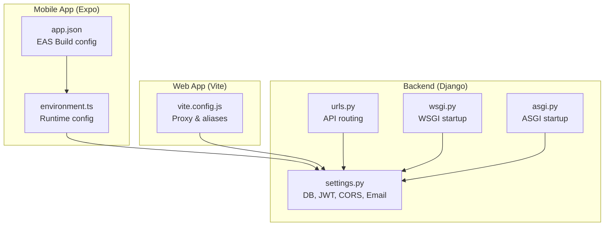
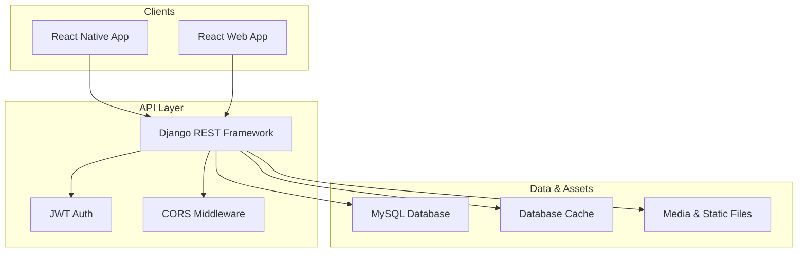
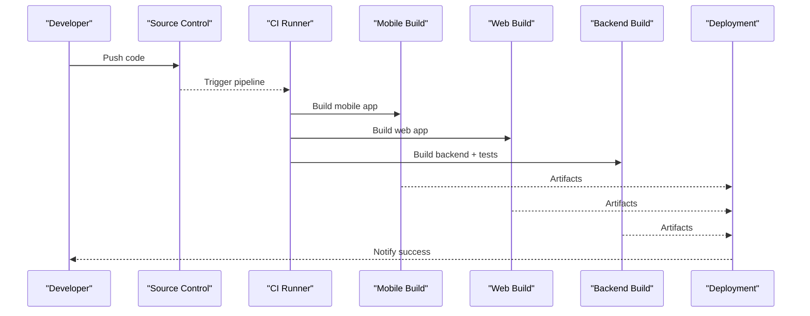
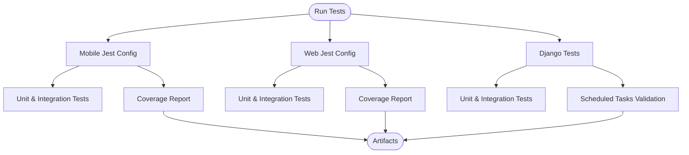
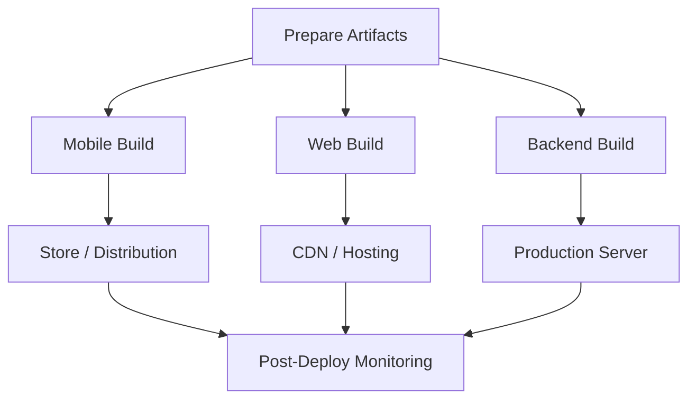
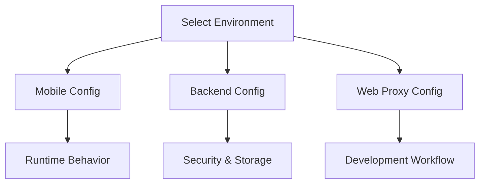
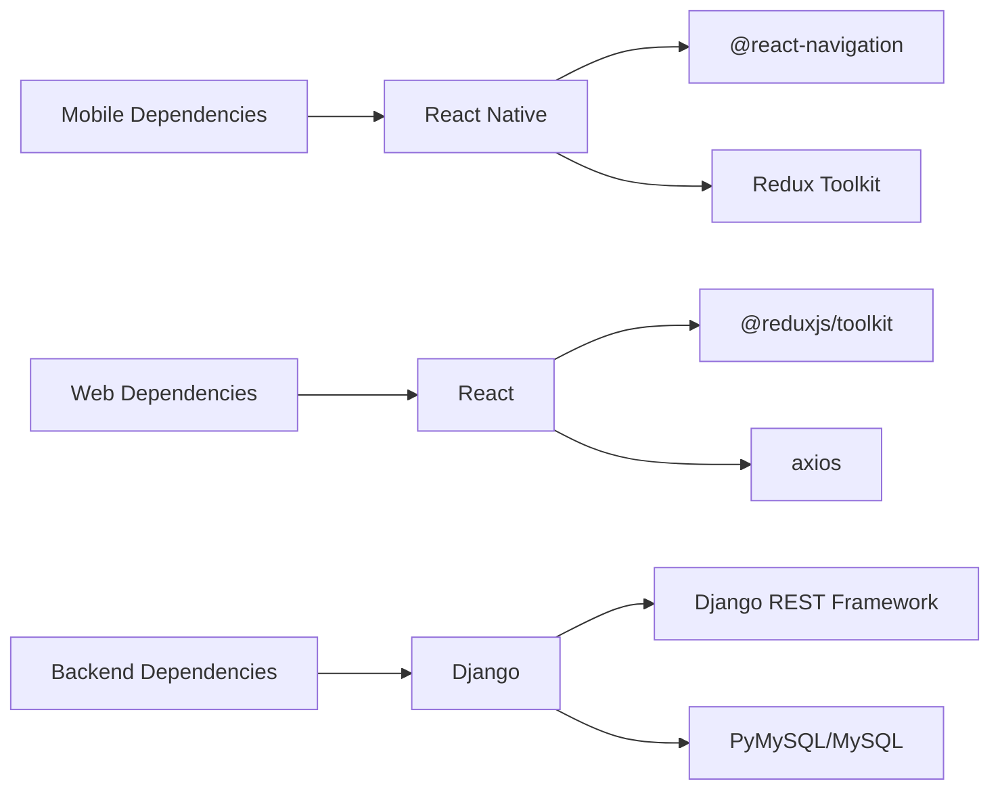
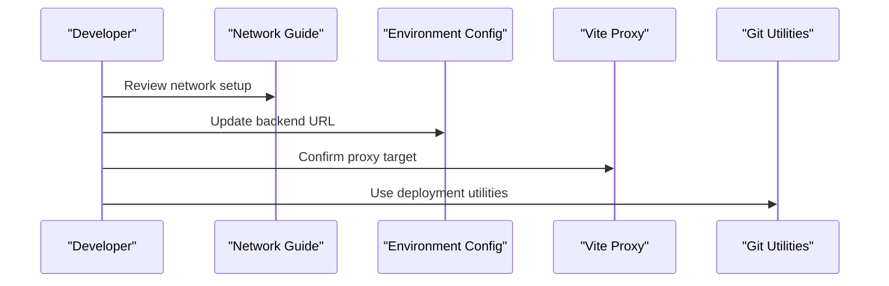

# Deployment & DevOps

<cite>
**Referenced Files in This Document**
- [package.json](file://Estate_link_App/package.json)
- [app.json](file://Estate_link_App/app.json)
- [environment.ts](file://Estate_link_App/src/config/environment.ts)
- [jest.config.js](file://Estate_link_App/jest.config.js)
- [README-NETWORK.md](file://Estate_link_App/README-NETWORK.md)
- [package.json](file://backend/manage.py)
- [settings.py](file://backend/backend/settings.py)
- [urls.py](file://backend/backend/urls.py)
- [wsgi.py](file://backend/backend/wsgi.py)
- [requirements.txt](file://backend/requirements.txt)
- [vite.config.js](file://frontend/vite.config.js)
- [package.json](file://frontend/package.json)
- [.gitignore](file://Estate_link_App/.gitignore)
- [asgi.py](file://backend/backend/asgi.py)
</cite>

## Table of Contents
1. [Introduction](#introduction)
2. [Project Structure](#project-structure)
3. [Core Components](#core-components)
4. [Architecture Overview](#architecture-overview)
5. [Detailed Component Analysis](#detailed-component-analysis)
6. [Dependency Analysis](#dependency-analysis)
7. [Performance Considerations](#performance-considerations)
8. [Troubleshooting Guide](#troubleshooting-guide)
9. [Conclusion](#conclusion)
10. [Appendices](#appendices)

## Introduction
This document provides comprehensive guidance for deployment and DevOps processes across the Estate Link platform. It covers CI/CD pipeline configuration, automated testing integration, deployment strategies, environment configuration management, secrets handling, infrastructure provisioning, containerization approaches, cloud deployment options, scaling considerations, monitoring and logging, backup procedures, disaster recovery planning, performance optimization, CDN configuration, and security hardening for production environments.

## Project Structure
The repository follows a multi-repo structure with three primary components:
- Mobile application (React Native + Expo): Estate_link_App
- Web application (React + Vite): frontend
- Backend (Django + Django REST Framework): backend

Key characteristics:
- Mobile app uses Expo for cross-platform builds and EAS Build for native binaries.
- Frontend uses Vite for fast builds and development.
- Backend uses Django with REST framework, JWT authentication, CORS, and MySQL database.
- Both mobile and web frontends communicate with the Django backend via HTTP APIs.

**Diagram sources**
- [app.json](file://Estate_link_App/app.json#L1-L66)
- [environment.ts](file://Estate_link_App/src/config/environment.ts#L1-L42)
- [vite.config.js](file://frontend/vite.config.js#L1-L50)
- [settings.py](file://backend/backend/settings.py#L1-L286)
- [urls.py](file://backend/backend/urls.py#L1-L55)
- [wsgi.py](file://backend/backend/wsgi.py#L1-L43)
- [asgi.py](file://backend/backend/asgi.py#L1-L17)

**Section sources**
- [package.json](file://Estate_link_App/package.json#L1-L93)
- [app.json](file://Estate_link_App/app.json#L1-L66)
- [environment.ts](file://Estate_link_App/src/config/environment.ts#L1-L42)
- [vite.config.js](file://frontend/vite.config.js#L1-L50)
- [settings.py](file://backend/backend/settings.py#L1-L286)
- [urls.py](file://backend/backend/urls.py#L1-L55)
- [wsgi.py](file://backend/backend/wsgi.py#L1-L43)
- [asgi.py](file://backend/backend/asgi.py#L1-L17)

## Core Components
- Mobile app configuration and build:
  - EAS Build configuration and plugin setup for Android and iOS.
  - Runtime environment configuration for backend URLs, timeouts, retries, and discovery.
- Web app configuration:
  - Vite proxy configuration to the Django backend for local development.
  - Aliases for components and utilities to streamline imports.
- Backend configuration:
  - Django settings for database, JWT tokens, CORS, caching, media/static files, email, and payment gateway.
  - URL routing for API endpoints.
  - WSGI/ASGI startup with pre-deploy permission population and Django initialization.

**Section sources**
- [app.json](file://Estate_link_App/app.json#L1-L66)
- [environment.ts](file://Estate_link_App/src/config/environment.ts#L1-L42)
- [vite.config.js](file://frontend/vite.config.js#L1-L50)
- [settings.py](file://backend/backend/settings.py#L1-L286)
- [urls.py](file://backend/backend/urls.py#L1-L55)
- [wsgi.py](file://backend/backend/wsgi.py#L1-L43)
- [asgi.py](file://backend/backend/asgi.py#L1-L17)

## Architecture Overview
The system comprises:
- Mobile client (React Native) consuming REST APIs from Django backend.
- Web client (React/Vite) consuming the same REST APIs.
- Django backend serving:
  - Authentication via JWT.
  - Cross-origin requests via CORS.
  - File uploads and media serving.
  - Scheduled tasks and background jobs.
- Database: MySQL with PyMySQL adapter.
- Optional caching via database-backed cache.

**Diagram sources**
- [settings.py](file://backend/backend/settings.py#L1-L286)
- [urls.py](file://backend/backend/urls.py#L1-L55)

## Detailed Component Analysis

### CI/CD Pipeline Configuration
Recommended CI/CD pipeline stages:
- Build:
  - Mobile: Use EAS Build to generate development, preview, and production builds. Configure build profiles in EAS Build and integrate with version control for automated builds on commits to release branches.
  - Web: Build with Vite and publish artifacts to a CDN or static hosting provider.
  - Backend: Install Python dependencies, run migrations, and build static assets for production.
- Test:
  - Mobile: Run Jest tests with coverage collection and custom reporter.
  - Web: Run Jest tests with coverage and lint checks.
  - Backend: Run Django tests and linters; ensure database migrations are applied.
- Deploy:
  - Mobile: Publish to stores via EAS Submit or distribution channels.
  - Web: Deploy built assets to CDN or static hosting.
  - Backend: Deploy to production servers or containers, ensuring environment variables are injected securely.
- Release:
  - Tag releases, generate changelogs, and notify stakeholders.

[No sources needed since this diagram shows conceptual workflow, not actual code structure]

### Automated Testing Integration
- Mobile:
  - Jest configuration includes custom setup files, test environment, coverage collection, and exclusion patterns for problematic CSS interop tests.
  - Scripts for running various test suites and watch mode.
- Web:
  - Jest configuration for React testing with DOM environment, coverage reporting, and asset transforms.
- Backend:
  - Django test runner and management commands for scheduled tasks and data maintenance.

**Section sources**
- [jest.config.js](file://Estate_link_App/jest.config.js#L1-L82)
- [package.json](file://Estate_link_App/package.json#L1-L93)
- [package.json](file://frontend/package.json#L1-L70)

### Deployment Strategies
- Mobile:
  - Use EAS Build for reproducible builds and EAS Submit for distribution.
  - Maintain separate build profiles for dev, preview, and production.
- Web:
  - Build with Vite and deploy to static hosting or CDN.
  - Configure environment-specific base URLs and proxy settings for development.
- Backend:
  - Use WSGI/ASGI servers for production deployments.
  - Ensure database migrations are applied before starting services.
  - Serve static and media files via the web server (nginx/Apache) in production.

**Section sources**
- [app.json](file://Estate_link_App/app.json#L1-L66)
- [vite.config.js](file://frontend/vite.config.js#L1-L50)
- [wsgi.py](file://backend/backend/wsgi.py#L1-L43)
- [asgi.py](file://backend/backend/asgi.py#L1-L17)

### Environment Configuration Management
- Mobile runtime configuration:
  - Centralized environment configuration with DEV, LOCAL, and PROD profiles.
  - Automatic backend URL discovery and retry logic.
- Backend configuration:
  - Django settings for database, JWT, CORS, caching, media/static files, email, and payment gateway.
  - Allowed hosts configured for both local and production domains.
- Web development proxy:
  - Vite proxy configuration to route API calls to the Django backend during development.

**Section sources**
- [environment.ts](file://Estate_link_App/src/config/environment.ts#L1-L42)
- [settings.py](file://backend/backend/settings.py#L1-L286)
- [vite.config.js](file://frontend/vite.config.js#L1-L50)

### Secrets Handling
- Backend secrets:
  - Keep sensitive values like database credentials, email credentials, and JWT signing keys out of version control.
  - Use environment variables or a secrets manager to inject values at runtime.
- Mobile and Web:
  - Avoid embedding backend URLs and API keys directly in source code.
  - Use environment variables or build-time configuration for endpoints and feature flags.

[No sources needed since this section provides general guidance]

### Infrastructure Provisioning
- Backend infrastructure:
  - Provision a Linux server or use managed hosting with a web server (nginx/Apache), WSGI/ASGI application server, and MySQL database.
  - Configure firewall rules, SSL/TLS termination, and reverse proxy to the Django application.
- Mobile and Web:
  - Use CDN for static assets and consider edge caching for API responses.
  - Configure DNS records and SSL certificates for production domains.

[No sources needed since this section provides general guidance]

### Containerization Approaches
- Backend container:
  - Use a Python base image, install dependencies from requirements.txt, expose port 8000, and run the WSGI/ASGI server.
  - Mount persistent volumes for media and logs.
- Frontend container:
  - Use a minimal Nginx image to serve Vite-built static assets.
- Mobile:
  - Build native binaries with EAS Build and distribute via stores or enterprise channels.

[No sources needed since this section provides general guidance]

### Cloud Deployment Options
- Backend:
  - Platform-as-a-Service (PaaS) with Python support or container-based platforms.
  - Managed databases (e.g., managed MySQL) and CDN for static/media delivery.
- Frontend:
  - Static hosting providers or CDN-backed hosting.
- Mobile:
  - Store-based distribution via EAS Submit or enterprise distribution.

[No sources needed since this section provides general guidance]

### Scaling Considerations
- Horizontal scaling:
  - Use multiple backend instances behind a load balancer.
  - Ensure shared storage for media and a shared cache backend.
- Database:
  - Use read replicas and connection pooling; monitor slow queries.
- CDN and caching:
  - Cache static assets and frequently accessed API responses.
- Asynchronous tasks:
  - Offload long-running tasks to background workers or queues.

[No sources needed since this section provides general guidance]

### Monitoring and Logging Setup
- Backend:
  - Centralized logging with structured logs and log aggregation.
  - Health checks and uptime monitoring.
  - Metrics collection for response times, error rates, and resource utilization.
- Frontend:
  - Client-side error reporting and performance monitoring.
- Mobile:
  - Crash reporting and analytics integration.

[No sources needed since this section provides general guidance]

### Backup Procedures and Disaster Recovery Planning
- Database backups:
  - Schedule regular logical backups and verify restore procedures.
- File backups:
  - Back up uploaded media and logs.
- DR plan:
  - Define RPO/RTO targets, failover procedures, and recovery verification steps.

[No sources needed since this section provides general guidance]

## Dependency Analysis
- Mobile app depends on Expo SDK, navigation libraries, Redux, and React Native ecosystem.
- Web app depends on React, Vite, and related tooling.
- Backend depends on Django, REST framework, PyMySQL, and related packages.

**Diagram sources**
- [package.json](file://Estate_link_App/package.json#L22-L68)
- [package.json](file://frontend/package.json#L15-L42)
- [requirements.txt](file://backend/requirements.txt#L1-L31)

**Section sources**
- [package.json](file://Estate_link_App/package.json#L1-L93)
- [package.json](file://frontend/package.json#L1-L70)
- [requirements.txt](file://backend/requirements.txt#L1-L31)

## Performance Considerations
- Optimize asset delivery with CDN and compression.
- Minimize bundle sizes and use lazy loading.
- Use pagination and efficient queries on the backend.
- Implement caching strategies for static and dynamic content.
- Monitor and tune database indexes and queries.

[No sources needed since this section provides general guidance]

## Troubleshooting Guide
- Network connectivity:
  - Use the provided network configuration guide to adjust backend URLs and test connectivity.
- Backend URL configuration:
  - Update environment.ts to reflect the correct backend host and port.
- Development proxy:
  - Ensure Vite proxy is configured to forward API requests to the Django backend during development.
- Git-based deployment utilities:
  - Backend includes utilities for branch switching and pulling changes; ensure proper permissions and error handling.

**Section sources**
- [README-NETWORK.md](file://Estate_link_App/README-NETWORK.md#L1-L61)
- [environment.ts](file://Estate_link_App/src/config/environment.ts#L1-L42)
- [vite.config.js](file://frontend/vite.config.js#L35-L43)
- [wsgi.py](file://backend/backend/wsgi.py#L32-L39)

## Conclusion
This document outlines a practical DevOps strategy for the Estate Link platform, covering CI/CD, testing, deployment, configuration management, infrastructure, and operational excellence. By following the recommended practices and leveraging the existing configuration files, teams can achieve reliable, scalable, and secure deployments across mobile, web, and backend components.

## Appendices
- Version control hygiene:
  - Keep secrets out of version control and use .gitignore for sensitive files.
- Security hardening:
  - Enforce HTTPS, secure cookies, CSRF protection, and strict content security policies.
- CDN configuration:
  - Configure caching headers and origin pull for optimal performance.

**Section sources**
- [.gitignore](file://Estate_link_App/.gitignore#L1-L23)