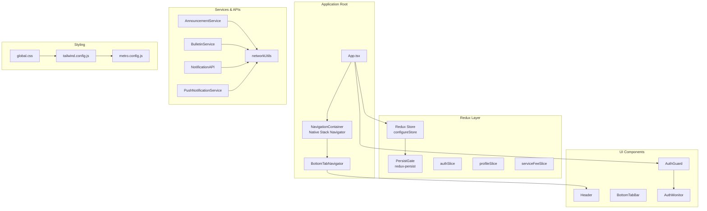
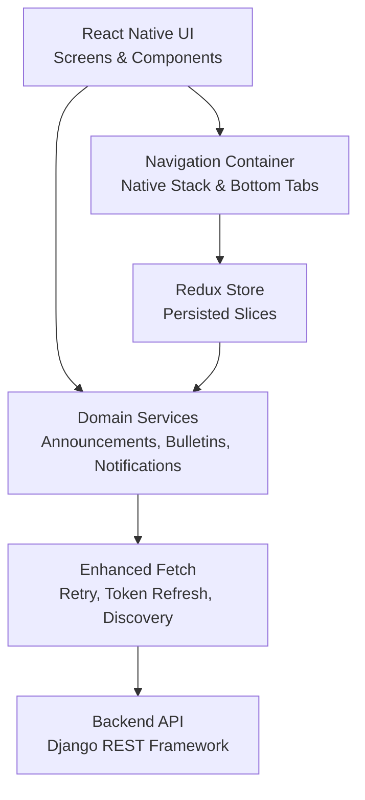
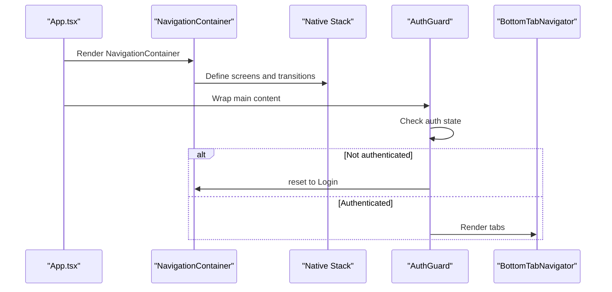
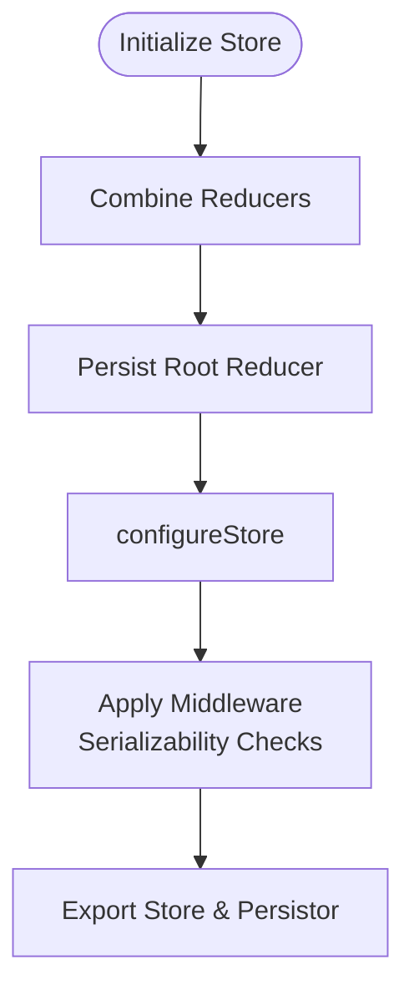
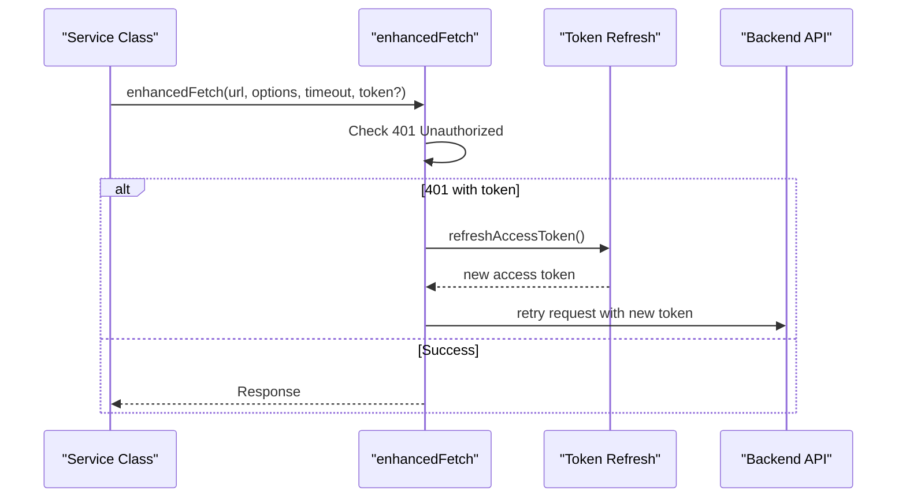
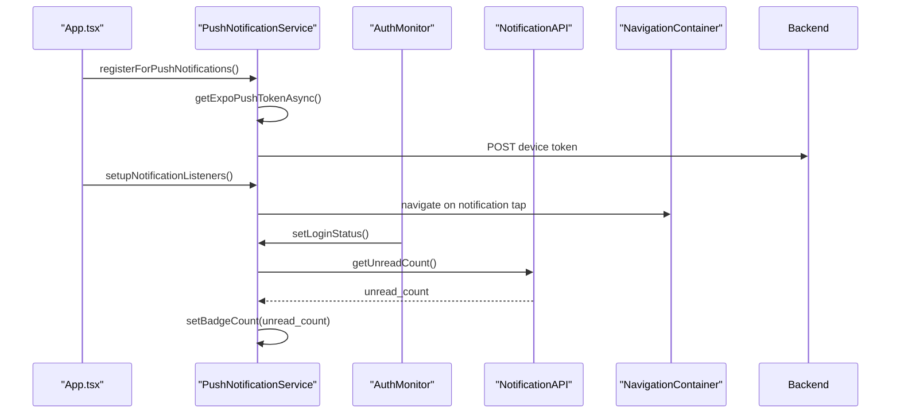
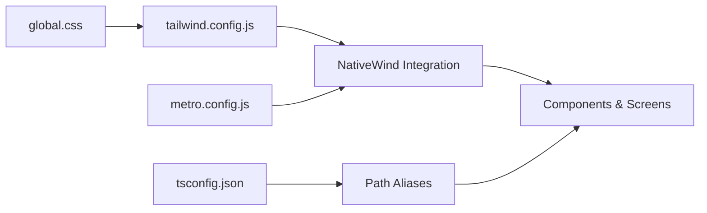
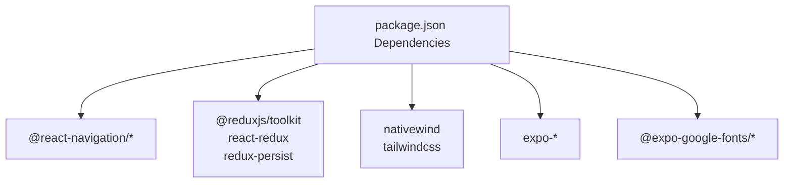

# Application Architecture

<cite>
**Referenced Files in This Document**
- [App.tsx](file://Estate_link_App/App.tsx)
- [package.json](file://Estate_link_App/package.json)
- [metro.config.js](file://Estate_link_App/metro.config.js)
- [tailwind.config.js](file://Estate_link_App/tailwind.config.js)
- [tsconfig.json](file://Estate_link_App/tsconfig.json)
- [index.ts](file://Estate_link_App/src/store/index.ts)
- [hooks.ts](file://Estate_link_App/src/store/hooks.ts)
- [BottomTabBar.tsx](file://Estate_link_App/components/BottomTabBar.tsx)
- [AuthGuard.tsx](file://Estate_link_App/src/components/AuthGuard.tsx)
- [AuthMonitor.tsx](file://Estate_link_App/src/components/AuthMonitor.tsx)
- [global.css](file://Estate_link_App/global.css)
- [announcementService.ts](file://Estate_link_App/src/services/announcementService.ts)
- [bulletinService.ts](file://Estate_link_App/src/services/bulletinService.ts)
- [notificationApi.ts](file://Estate_link_App/src/services/notificationApi.ts)
- [pushNotificationService.ts](file://Estate_link_App/src/services/pushNotificationService.ts)
- [networkUtils.ts](file://Estate_link_App/src/utils/networkUtils.ts)
</cite>

## Table of Contents
1. [Introduction](#introduction)
2. [Project Structure](#project-structure)
3. [Core Components](#core-components)
4. [Architecture Overview](#architecture-overview)
5. [Detailed Component Analysis](#detailed-component-analysis)
6. [Dependency Analysis](#dependency-analysis)
7. [Performance Considerations](#performance-considerations)
8. [Troubleshooting Guide](#troubleshooting-guide)
9. [Conclusion](#conclusion)

## Introduction
This document describes the React Native-based web application architecture for the Estate Link project. It covers the application structure, component hierarchy, routing system, state management with Redux, design system and styling, responsive design, API integration patterns, and operational concerns such as error handling, network resilience, and push notifications. The focus is on the mobile-first React Native stack integrated with Expo, Redux Toolkit for state management, and a robust network utility layer for reliable API communication.

## Project Structure
The application follows a modular, feature-centric structure with clear separation of concerns:
- Application entry and navigation orchestration in the root App component
- Feature screens organized under dedicated folders
- Shared components and utilities under components and src/utils
- Redux store configuration and typed hooks
- Services encapsulating API interactions
- Styling via Tailwind CSS with NativeWind and a global stylesheet
- Metro bundler configuration with path aliases and NativeWind integration

**Diagram sources**
- [App.tsx](file://Estate_link_App/App.tsx#L118-L414)
- [BottomTabBar.tsx](file://Estate_link_App/components/BottomTabBar.tsx#L15-L159)
- [src/store/index.ts](file://Estate_link_App/src/store/index.ts#L1-L79)
- [src/services/announcementService.ts](file://Estate_link_App/src/services/announcementService.ts#L1-L341)
- [src/services/bulletinService.ts](file://Estate_link_App/src/services/bulletinService.ts#L1-L705)
- [src/services/notificationApi.ts](file://Estate_link_App/src/services/notificationApi.ts#L1-L231)
- [src/services/pushNotificationService.ts](file://Estate_link_App/src/services/pushNotificationService.ts#L1-L767)
- [src/utils/networkUtils.ts](file://Estate_link_App/src/utils/networkUtils.ts#L1-L511)
- [global.css](file://Estate_link_App/global.css#L1-L6)
- [tailwind.config.js](file://Estate_link_App/tailwind.config.js#L1-L82)
- [metro.config.js](file://Estate_link_App/metro.config.js#L1-L33)

**Section sources**
- [App.tsx](file://Estate_link_App/App.tsx#L118-L414)
- [package.json](file://Estate_link_App/package.json#L1-L93)
- [tsconfig.json](file://Estate_link_App/tsconfig.json#L1-L65)
- [metro.config.js](file://Estate_link_App/metro.config.js#L1-L33)
- [tailwind.config.js](file://Estate_link_App/tailwind.config.js#L1-L82)
- [global.css](file://Estate_link_App/global.css#L1-L6)

## Core Components
- Application bootstrap and navigation: The root App component initializes fonts, splash screen, navigation container, Redux provider, and push notification setup. It defines the entire navigation tree including authentication screens, main dashboard tabs, and feature-specific screens.
- Authentication guard and monitor: AuthGuard redirects unauthenticated users to the login flow, while AuthMonitor synchronizes push notification login status with Redux state.
- Bottom tab navigator: Centralized tab navigation with a shared header and platform-aware insets for iOS and Android.
- Redux store: Centralized state with persisted slices for authentication and company settings, plus typed hooks for dispatch and selector usage.
- Services: Encapsulated API clients for announcements, bulletins, notifications, and push notifications with robust error handling and token refresh logic.
- Styling: Tailwind CSS with NativeWind for responsive styling, global CSS imports, and safelisted dynamic classes.

**Section sources**
- [App.tsx](file://Estate_link_App/App.tsx#L118-L414)
- [src/components/AuthGuard.tsx](file://Estate_link_App/src/components/AuthGuard.tsx#L1-L42)
- [src/components/AuthMonitor.tsx](file://Estate_link_App/src/components/AuthMonitor.tsx#L1-L27)
- [components/BottomTabBar.tsx](file://Estate_link_App/components/BottomTabBar.tsx#L15-L159)
- [src/store/index.ts](file://Estate_link_App/src/store/index.ts#L1-L79)
- [src/store/hooks.ts](file://Estate_link_App/src/store/hooks.ts#L1-L6)
- [src/services/announcementService.ts](file://Estate_link_App/src/services/announcementService.ts#L1-L341)
- [src/services/bulletinService.ts](file://Estate_link_App/src/services/bulletinService.ts#L1-L705)
- [src/services/notificationApi.ts](file://Estate_link_App/src/services/notificationApi.ts#L1-L231)
- [src/services/pushNotificationService.ts](file://Estate_link_App/src/services/pushNotificationService.ts#L1-L767)
- [tailwind.config.js](file://Estate_link_App/tailwind.config.js#L1-L82)
- [global.css](file://Estate_link_App/global.css#L1-L6)

## Architecture Overview
The application follows a layered architecture:
- Presentation layer: React Native components and navigators
- Domain services: Service classes for announcements, bulletins, notifications, and push notifications
- Data access: Enhanced fetch wrapper with retry, token refresh, and network discovery
- State management: Redux Toolkit with persisted slices
- Styling: Tailwind CSS with NativeWind and Metro configuration

**Diagram sources**
- [App.tsx](file://Estate_link_App/App.tsx#L236-L414)
- [src/store/index.ts](file://Estate_link_App/src/store/index.ts#L1-L79)
- [src/services/announcementService.ts](file://Estate_link_App/src/services/announcementService.ts#L1-L341)
- [src/services/bulletinService.ts](file://Estate_link_App/src/services/bulletinService.ts#L1-L705)
- [src/services/notificationApi.ts](file://Estate_link_App/src/services/notificationApi.ts#L1-L231)
- [src/services/pushNotificationService.ts](file://Estate_link_App/src/services/pushNotificationService.ts#L1-L767)
- [src/utils/networkUtils.ts](file://Estate_link_App/src/utils/networkUtils.ts#L295-L511)

## Detailed Component Analysis

### Navigation and Routing
- Native Stack Navigator orchestrates authentication flows and main feature screens with slide animations and gesture controls.
- BottomTabNavigator centralizes tabbed navigation with a shared header and platform-aware insets.
- AuthGuard enforces authentication by redirecting unauthenticated users and rendering children only when authenticated.
- AuthMonitor synchronizes login status with push notification service and badge counts.

**Diagram sources**
- [App.tsx](file://Estate_link_App/App.tsx#L236-L414)
- [src/components/AuthGuard.tsx](file://Estate_link_App/src/components/AuthGuard.tsx#L10-L41)
- [components/BottomTabBar.tsx](file://Estate_link_App/components/BottomTabBar.tsx#L15-L159)

**Section sources**
- [App.tsx](file://Estate_link_App/App.tsx#L243-L407)
- [src/components/AuthGuard.tsx](file://Estate_link_App/src/components/AuthGuard.tsx#L10-L41)
- [components/BottomTabBar.tsx](file://Estate_link_App/components/BottomTabBar.tsx#L15-L159)

### State Management with Redux
- Store configuration combines reducers and applies persistence to selected slices.
- Serializability middleware ignores specific actions/paths to prevent warnings.
- Typed hooks simplify dispatch and selector usage across the app.

**Diagram sources**
- [src/store/index.ts](file://Estate_link_App/src/store/index.ts#L23-L79)
- [src/store/hooks.ts](file://Estate_link_App/src/store/hooks.ts#L1-L6)

**Section sources**
- [src/store/index.ts](file://Estate_link_App/src/store/index.ts#L1-L79)
- [src/store/hooks.ts](file://Estate_link_App/src/store/hooks.ts#L1-L6)

### API Integration and Network Utilities
- Enhanced fetch provides timeouts, retries, token refresh, and centralized error handling.
- Dynamic backend discovery scans common IPs and ports to adapt to network changes.
- Service classes encapsulate CRUD operations for announcements, bulletins, and notifications.

**Diagram sources**
- [src/utils/networkUtils.ts](file://Estate_link_App/src/utils/networkUtils.ts#L382-L508)
- [src/services/announcementService.ts](file://Estate_link_App/src/services/announcementService.ts#L16-L92)
- [src/services/bulletinService.ts](file://Estate_link_App/src/services/bulletinService.ts#L156-L213)

**Section sources**
- [src/utils/networkUtils.ts](file://Estate_link_App/src/utils/networkUtils.ts#L1-L511)
- [src/services/announcementService.ts](file://Estate_link_App/src/services/announcementService.ts#L1-L341)
- [src/services/bulletinService.ts](file://Estate_link_App/src/services/bulletinService.ts#L1-L705)
- [src/services/notificationApi.ts](file://Estate_link_App/src/services/notificationApi.ts#L1-L231)

### Push Notifications and Badge Management
- PushNotificationService manages device token registration, background/foreground handlers, and navigation on tap.
- Badge count synchronization with backend ensures accurate unread counts.
- AuthMonitor updates login status to conditionally show notifications.

**Diagram sources**
- [src/services/pushNotificationService.ts](file://Estate_link_App/src/services/pushNotificationService.ts#L89-L180)
- [src/services/pushNotificationService.ts](file://Estate_link_App/src/services/pushNotificationService.ts#L234-L491)
- [src/services/notificationApi.ts](file://Estate_link_App/src/services/notificationApi.ts#L129-L149)
- [src/components/AuthMonitor.tsx](file://Estate_link_App/src/components/AuthMonitor.tsx#L10-L26)

**Section sources**
- [src/services/pushNotificationService.ts](file://Estate_link_App/src/services/pushNotificationService.ts#L1-L767)
- [src/services/notificationApi.ts](file://Estate_link_App/src/services/notificationApi.ts#L1-L231)
- [src/components/AuthMonitor.tsx](file://Estate_link_App/src/components/AuthMonitor.tsx#L1-L27)

### Design System, Styling, and Responsive Design
- Tailwind CSS with NativeWind enables utility-first styling and responsive utilities.
- Global CSS imports Tailwind directives and custom fonts.
- Metro config integrates NativeWind and sets path aliases for components, store, hooks, validation, and types.
- Safelisted dynamic classes prevent purge and ensure runtime-generated styles remain intact.

**Diagram sources**
- [global.css](file://Estate_link_App/global.css#L1-L6)
- [tailwind.config.js](file://Estate_link_App/tailwind.config.js#L1-L82)
- [metro.config.js](file://Estate_link_App/metro.config.js#L1-L33)
- [tsconfig.json](file://Estate_link_App/tsconfig.json#L27-L49)

**Section sources**
- [global.css](file://Estate_link_App/global.css#L1-L6)
- [tailwind.config.js](file://Estate_link_App/tailwind.config.js#L1-L82)
- [metro.config.js](file://Estate_link_App/metro.config.js#L1-L33)
- [tsconfig.json](file://Estate_link_App/tsconfig.json#L1-L65)

## Dependency Analysis
Key dependencies and their roles:
- Navigation: @react-navigation/native, @react-navigation/native-stack, @react-navigation/bottom-tabs
- State: @reduxjs/toolkit, react-redux, redux-persist
- Styling: nativewind, tailwindcss
- Networking: expo-notifications, expo-device, expo-constants
- Fonts: @expo-google-fonts/*
- Utilities: expo-splash-screen, expo-font, expo-image-picker, react-native-safe-area-context

**Diagram sources**
- [package.json](file://Estate_link_App/package.json#L22-L68)

**Section sources**
- [package.json](file://Estate_link_App/package.json#L1-L93)

## Performance Considerations
- Network resilience: enhancedFetch implements timeouts, retries, and automatic token refresh to minimize failures and improve reliability.
- Dynamic backend discovery: adaptive server detection reduces downtime when network topology changes.
- Splash screen and font loading: controlled startup sequence prevents layout shifts and improves perceived performance.
- Persisted state: redux-persist reduces reinitialization overhead by restoring critical slices (auth, company settings).
- Styling efficiency: Tailwind with safelisted dynamic classes avoids unnecessary purging and supports runtime class generation.

[No sources needed since this section provides general guidance]

## Troubleshooting Guide
Common issues and resolutions:
- Authentication redirects: AuthGuard triggers navigation to Login when not authenticated; verify token presence and expiration.
- Push notification visibility: Foreground notifications are suppressed when logged out; ensure AuthMonitor updates login status.
- Network connectivity: enhancedFetch detects network errors and suggests actionable messages; use getNetworkErrorMessage for user feedback.
- Token refresh failures: 401 responses initiate token refresh; confirm refresh token availability and backend token endpoints.
- Metro warnings: Metro config suppresses known deprecation and Reanimated warnings; ensure alias paths match actual directories.

**Section sources**
- [src/components/AuthGuard.tsx](file://Estate_link_App/src/components/AuthGuard.tsx#L14-L23)
- [src/services/pushNotificationService.ts](file://Estate_link_App/src/services/pushNotificationService.ts#L14-L35)
- [src/utils/networkUtils.ts](file://Estate_link_App/src/utils/networkUtils.ts#L240-L269)
- [src/utils/networkUtils.ts](file://Estate_link_App/src/utils/networkUtils.ts#L429-L490)
- [metro.config.js](file://Estate_link_App/metro.config.js#L7-L21)

## Conclusion
The Estate Link application employs a clean, layered architecture leveraging React Native, Expo, Redux Toolkit, and Tailwind CSS with NativeWind. The navigation system, robust API utilities, and push notification service integrate seamlessly with the Redux store to deliver a responsive, resilient, and maintainable user experience. The documented patterns and configurations provide a strong foundation for continued development and scaling.