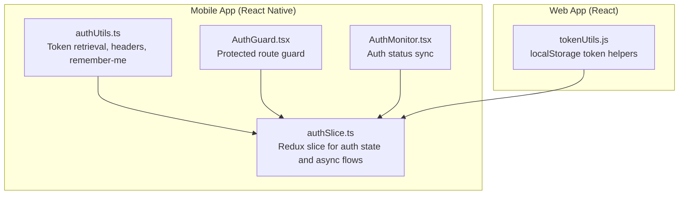
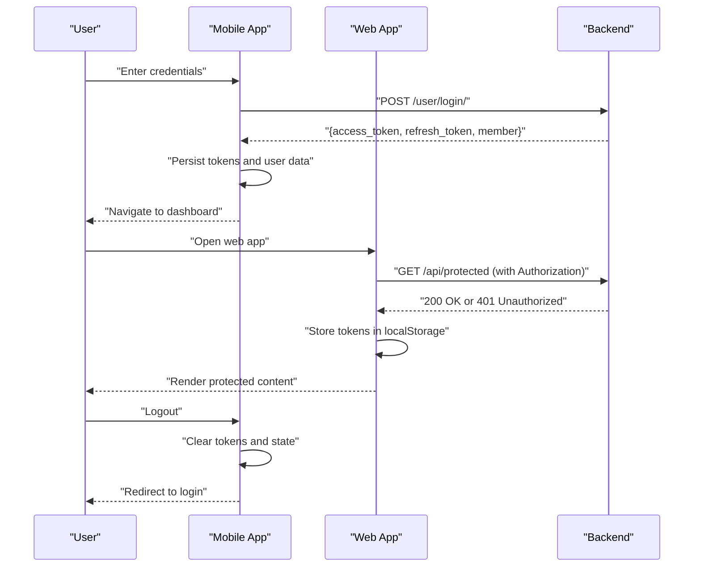
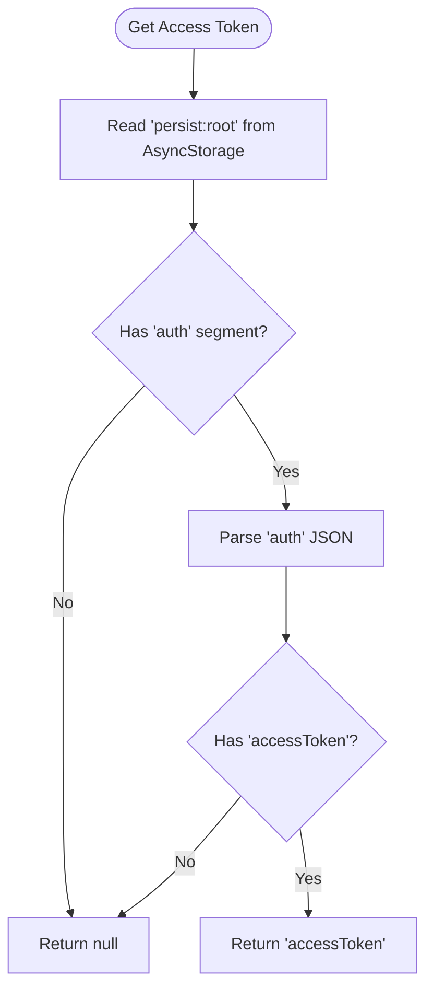
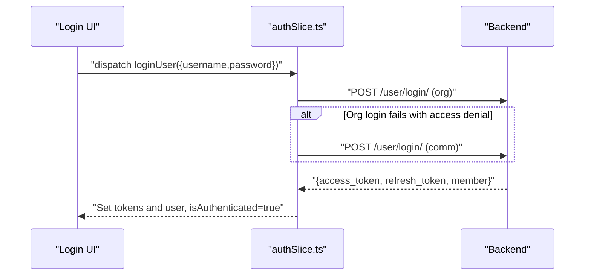
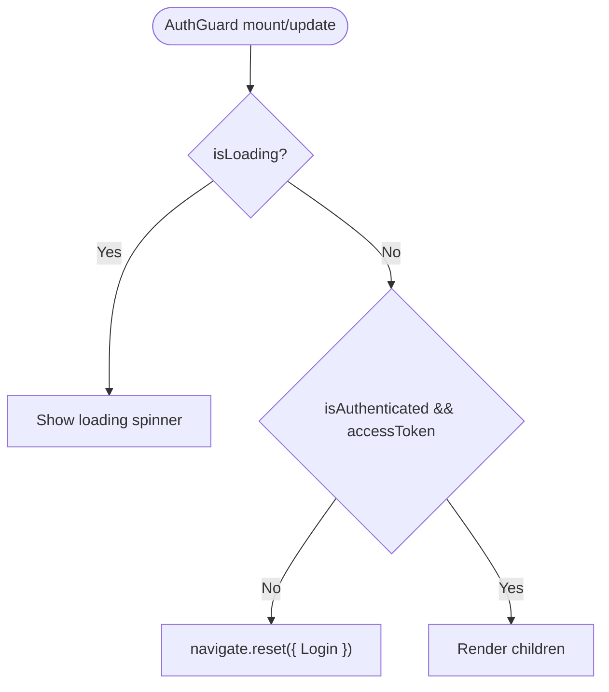
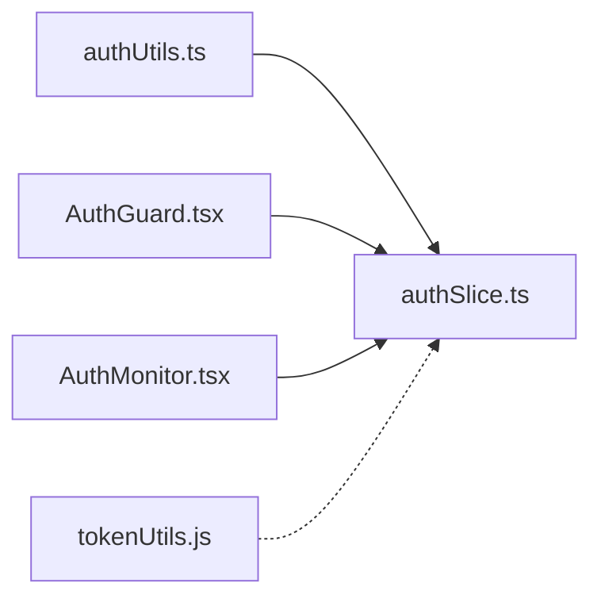

# Authentication System

<cite>
**Referenced Files in This Document**
- [authUtils.ts](file://Estate_link_App/src/utils/authUtils.ts)
- [authSlice.ts](file://Estate_link_App/src/store/slices/authSlice.ts)
- [AuthGuard.tsx](file://Estate_link_App/src/components/AuthGuard.tsx)
- [AuthMonitor.tsx](file://Estate_link_App/src/components/AuthMonitor.tsx)
- [tokenUtils.js](file://frontend/src/utils/tokenUtils.js)
</cite>

## Table of Contents
1. [Introduction](#introduction)
2. [Project Structure](#project-structure)
3. [Core Components](#core-components)
4. [Architecture Overview](#architecture-overview)
5. [Detailed Component Analysis](#detailed-component-analysis)
6. [Dependency Analysis](#dependency-analysis)
7. [Performance Considerations](#performance-considerations)
8. [Troubleshooting Guide](#troubleshooting-guide)
9. [Conclusion](#conclusion)

## Introduction
This document describes the authentication and authorization system for the estate management application. It covers JWT token management, login/logout flows, session handling, protected route implementation, permission checking, role-based access control, token storage, refresh mechanisms, and automatic logout functionality. It also documents API authentication headers, error handling for unauthorized requests, and user session persistence. Finally, it outlines the integration with backend authentication endpoints and the user interface components for login and profile management.

## Project Structure
The authentication system spans two applications:
- React Native mobile app (Estate_link_App): handles local token storage, login/logout, protected routing, and session monitoring.
- React web app (frontend): manages token lifecycle via localStorage and integrates with backend endpoints.

Key areas:
- Token utilities for AsyncStorage (mobile) and localStorage (web)
- Redux slice managing auth state, async flows, and user metadata
- Guard component enforcing protected routes
- Auth monitor syncing login state with push notifications

**Diagram sources**
- [authUtils.ts](file://Estate_link_App/src/utils/authUtils.ts#L1-L219)
- [authSlice.ts](file://Estate_link_App/src/store/slices/authSlice.ts#L1-L564)
- [AuthGuard.tsx](file://Estate_link_App/src/components/AuthGuard.tsx#L1-L42)
- [AuthMonitor.tsx](file://Estate_link_App/src/components/AuthMonitor.tsx#L1-L27)
- [tokenUtils.js](file://frontend/src/utils/tokenUtils.js#L1-L26)

**Section sources**
- [authUtils.ts](file://Estate_link_App/src/utils/authUtils.ts#L1-L219)
- [authSlice.ts](file://Estate_link_App/src/store/slices/authSlice.ts#L1-L564)
- [AuthGuard.tsx](file://Estate_link_App/src/components/AuthGuard.tsx#L1-L42)
- [AuthMonitor.tsx](file://Estate_link_App/src/components/AuthMonitor.tsx#L1-L27)
- [tokenUtils.js](file://frontend/src/utils/tokenUtils.js#L1-L26)

## Core Components
- Token utilities (mobile): retrieve access/refresh tokens, build Authorization headers, manage "remember me" username history, and secure password suggestions.
- Auth slice (mobile): orchestrates login, OTP flows, password setting, and stores user and token state in Redux.
- Auth guard (mobile): redirects unauthenticated users to the login screen and renders children only when authenticated.
- Auth monitor (mobile): synchronizes login state with push notification service and updates badge counts upon login.
- Token utilities (web): manage access/refresh tokens in localStorage and clear session data.

**Section sources**
- [authUtils.ts](file://Estate_link_App/src/utils/authUtils.ts#L1-L219)
- [authSlice.ts](file://Estate_link_App/src/store/slices/authSlice.ts#L1-L564)
- [AuthGuard.tsx](file://Estate_link_App/src/components/AuthGuard.tsx#L1-L42)
- [AuthMonitor.tsx](file://Estate_link_App/src/components/AuthMonitor.tsx#L1-L27)
- [tokenUtils.js](file://frontend/src/utils/tokenUtils.js#L1-L26)

## Architecture Overview
The system uses JWT tokens returned by backend endpoints. On mobile, tokens are stored in AsyncStorage and integrated with Redux. On web, tokens are stored in localStorage. Protected routes are enforced by a guard component that checks authentication state. Push notification service is notified of login/logout events.

**Diagram sources**
- [authSlice.ts](file://Estate_link_App/src/store/slices/authSlice.ts#L200-L289)
- [authUtils.ts](file://Estate_link_App/src/utils/authUtils.ts#L41-L72)
- [tokenUtils.js](file://frontend/src/utils/tokenUtils.js#L12-L21)

## Detailed Component Analysis

### Mobile Token Utilities (authUtils.ts)
Responsibilities:
- Retrieve access and refresh tokens from persisted state
- Update tokens in persisted state
- Build Authorization headers for JSON and FormData requests
- Manage "remember me" username and suggestions
- Securely store password suggestions per username

Key behaviors:
- Access tokens are retrieved from a persisted Redux state snapshot in AsyncStorage.
- Headers include Content-Type for JSON payloads and Authorization for bearer tokens.
- Username history and secure password vault leverage AsyncStorage and Expo SecureStore respectively.

**Diagram sources**
- [authUtils.ts](file://Estate_link_App/src/utils/authUtils.ts#L5-L20)

**Section sources**
- [authUtils.ts](file://Estate_link_App/src/utils/authUtils.ts#L1-L219)

### Mobile Auth Slice (authSlice.ts)
Responsibilities:
- Define AuthState shape including user metadata, authentication flags, tokens, and OTP data.
- Implement async thunks for:
  - User status check
  - OTP request, verification, resend
  - Password setting
  - Login with dual login types (org and comm)
  - Password change
- Manage Redux reducers for loading, errors, OTP attempts, logout, and user updates.

Processing logic highlights:
- Login tries org login first; if access denied, falls back to comm login.
- Successful login populates user metadata and sets tokens.
- OTP flows update OTP attempts and timestamps.
- Logout clears tokens and resets auth state.

**Diagram sources**
- [authSlice.ts](file://Estate_link_App/src/store/slices/authSlice.ts#L200-L289)

**Section sources**
- [authSlice.ts](file://Estate_link_App/src/store/slices/authSlice.ts#L1-L564)

### Protected Route Guard (AuthGuard.tsx)
Responsibilities:
- Enforce authentication for protected screens.
- Redirect to the login route when not authenticated.
- Render a loading indicator while authentication is being checked.

Behavior:
- Reads authentication state from Redux.
- Resets navigation to the Login route if not authenticated.
- Renders children only when authenticated.

**Diagram sources**
- [AuthGuard.tsx](file://Estate_link_App/src/components/AuthGuard.tsx#L10-L41)

**Section sources**
- [AuthGuard.tsx](file://Estate_link_App/src/components/AuthGuard.tsx#L1-L42)

### Auth Monitor (AuthMonitor.tsx)
Responsibilities:
- Sync authentication status with push notification service.
- Update badge counts upon login.

Behavior:
- Subscribes to Redux auth state.
- Calls push notification service to set login status.
- Updates badge count when logged in.

**Section sources**
- [AuthMonitor.tsx](file://Estate_link_App/src/components/AuthMonitor.tsx#L1-L27)

### Web Token Utilities (tokenUtils.js)
Responsibilities:
- Retrieve and set access/refresh tokens in localStorage.
- Clear tokens and associated member data.
- Check presence of access token.

Behavior:
- Uses localStorage for token persistence.
- Provides helpers to check token existence.

**Section sources**
- [tokenUtils.js](file://frontend/src/utils/tokenUtils.js#L1-L26)

## Dependency Analysis
Relationships:
- authUtils.ts depends on AsyncStorage and Expo SecureStore for token and credential storage.
- authSlice.ts depends on enhancedFetch and API configuration for backend communication.
- AuthGuard.tsx depends on Redux selectors and navigation to enforce protection.
- AuthMonitor.tsx depends on push notification service to synchronize login state.
- tokenUtils.js provides localStorage-based token helpers for the web app.

**Diagram sources**
- [authUtils.ts](file://Estate_link_App/src/utils/authUtils.ts#L1-L219)
- [authSlice.ts](file://Estate_link_App/src/store/slices/authSlice.ts#L1-L564)
- [AuthGuard.tsx](file://Estate_link_App/src/components/AuthGuard.tsx#L1-L42)
- [AuthMonitor.tsx](file://Estate_link_App/src/components/AuthMonitor.tsx#L1-L27)
- [tokenUtils.js](file://frontend/src/utils/tokenUtils.js#L1-L26)

**Section sources**
- [authUtils.ts](file://Estate_link_App/src/utils/authUtils.ts#L1-L219)
- [authSlice.ts](file://Estate_link_App/src/store/slices/authSlice.ts#L1-L564)
- [AuthGuard.tsx](file://Estate_link_App/src/components/AuthGuard.tsx#L1-L42)
- [AuthMonitor.tsx](file://Estate_link_App/src/components/AuthMonitor.tsx#L1-L27)
- [tokenUtils.js](file://frontend/src/utils/tokenUtils.js#L1-L26)

## Performance Considerations
- Retry logic with exponential backoff is applied to selected async operations to improve resilience against transient network failures.
- Loading indicators are shown during authentication checks to prevent unnecessary re-renders and improve UX.
- Token retrieval reads a single persisted snapshot to minimize repeated I/O operations.

[No sources needed since this section provides general guidance]

## Troubleshooting Guide
Common issues and resolutions:
- Unauthorized requests: Ensure Authorization header is present with Bearer token when calling protected endpoints. On mobile, use the Authorization header builder; on web, ensure tokens are stored in localStorage and included in requests.
- Login failures: Verify credentials and that the correct login type is attempted (org then comm fallback). Check for specific error messages indicating invalid credentials or access denial.
- OTP issues: Confirm OTP request and verification flows are executed in order. Monitor OTP attempts and last attempt timestamps.
- Session persistence: On mobile, tokens are persisted in AsyncStorage; on web, in localStorage. Clear tokens on logout to force re-authentication.
- Protected route rendering: If protected content does not appear, confirm that AuthGuard is wrapping the route and that authentication state reflects isAuthenticated and accessToken.

**Section sources**
- [authUtils.ts](file://Estate_link_App/src/utils/authUtils.ts#L62-L83)
- [authSlice.ts](file://Estate_link_App/src/store/slices/authSlice.ts#L44-L79)
- [AuthGuard.tsx](file://Estate_link_App/src/components/AuthGuard.tsx#L14-L23)
- [tokenUtils.js](file://frontend/src/utils/tokenUtils.js#L12-L21)

## Conclusion
The authentication system combines mobile and web token management with robust Redux-driven flows, protected routing, and push notification synchronization. Tokens are securely stored and consistently applied via Authorization headers. The system supports dual login types, OTP-based password recovery, and logout with session cleanup. Protected routes are enforced by a dedicated guard component, ensuring only authenticated users can access sensitive parts of the application.