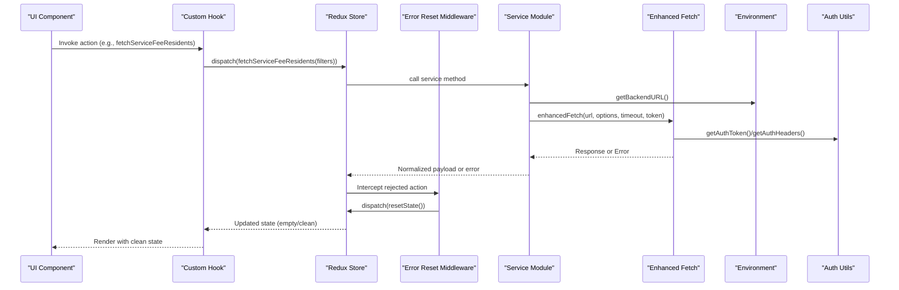
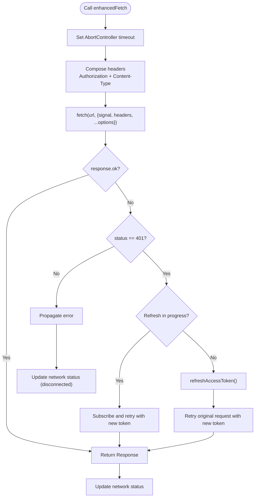
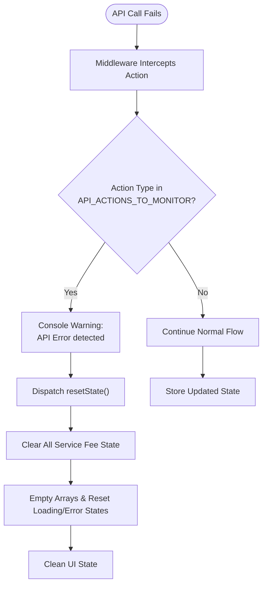
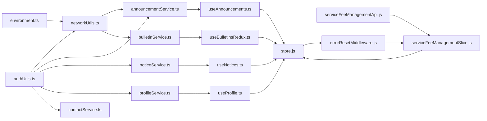

# Data Fetching & API Integration

<cite>
**Referenced Files in This Document**
- [environment.ts](file://Estate_link_App/src/config/environment.ts)
- [networkUtils.ts](file://Estate_link_App/src/utils/networkUtils.ts)
- [authUtils.ts](file://Estate_link_App/src/utils/authUtils.ts)
- [announcementService.ts](file://Estate_link_App/src/services/announcementService.ts)
- [bulletinService.ts](file://Estate_link_App/src/services/bulletinService.ts)
- [noticeService.ts](file://Estate_link_App/src/services/noticeService.ts)
- [profileService.ts](file://Estate_link_App/src/services/profileService.ts)
- [contactService.ts](file://Estate_link_App/src/services/contactService.ts)
- [useAnnouncements.ts](file://Estate_link_App/src/hooks/useAnnouncements.ts)
- [useNotices.ts](file://Estate_link_App/src/hooks/useNotices.ts)
- [useBulletinsRedux.ts](file://Estate_link_App/src/hooks/useBulletinsRedux.ts)
- [useProfile.ts](file://Estate_link_App/src/hooks/useProfile.ts)
- [useServiceFee.ts](file://Estate_link_App/src/hooks/useServiceFee.ts)
- [index.ts](file://Estate_link_App/src/store/index.ts)
- [hooks.ts](file://Estate_link_App/src/store/hooks.ts)
- [errorResetMiddleware.js](file://frontend/src/redux/middleware/errorResetMiddleware.js)
- [store.js](file://frontend/src/redux/store.js)
- [serviceFeeManagementSlice.js](file://frontend/src/redux/slices/serviceFeeManagement/serviceFeeManagementSlice.js)
- [serviceFeeManagementApi.js](file://frontend/src/redux/slices/api/serviceFeeManagement/serviceFeeManagementApi.js)
</cite>

## Update Summary
**Changes Made**
- Added documentation for the new global error reset middleware implementation
- Updated Redux store configuration to include the new middleware
- Documented the serviceFeeManagement slice's resetState functionality
- Added comprehensive error handling strategies for service fee operations
- Updated architecture diagrams to reflect the new middleware layer

## Table of Contents
1. [Introduction](#introduction)
2. [Project Structure](#project-structure)
3. [Core Components](#core-components)
4. [Architecture Overview](#architecture-overview)
5. [Detailed Component Analysis](#detailed-component-analysis)
6. [Enhanced Error Handling Middleware](#enhanced-error-handling-middleware)
7. [Dependency Analysis](#dependency-analysis)
8. [Performance Considerations](#performance-considerations)
9. [Troubleshooting Guide](#troubleshooting-guide)
10. [Conclusion](#conclusion)
11. [Appendices](#appendices)

## Introduction
This document explains the data fetching and API integration patterns used across the application. It covers environment-driven configuration, network utilities, authentication helpers, service-layer APIs, custom React hooks for state orchestration, Redux-based caching and synchronization, and testing approaches. It also documents optimistic updates, error recovery, loading state management, and the newly implemented global error reset middleware for service fee operations.

## Project Structure
The data fetching stack is organized around:
- Environment configuration for backend URLs, timeouts, retries, and discovery
- Network utilities for connectivity checks, backend discovery, enhanced fetch, and token refresh
- Authentication utilities for token retrieval and header composition
- Service modules encapsulating API endpoints and request/response handling
- Custom hooks that integrate with Redux to orchestrate data fetching, caching, and state synchronization
- Redux store configuration with persistence, typed hooks, and global error handling middleware
- Global error reset middleware for automatic state cleanup on API failures

```mermaid
graph TB
subgraph "Environment"
ENV["environment.ts"]
end
subgraph "Network Layer"
NET["networkUtils.ts"]
AUTH["authUtils.ts"]
end
subgraph "Services"
ANN["announcementService.ts"]
BUT["bulletinService.ts"]
NOT["noticeService.ts"]
PROF["profileService.ts"]
CON["contactService.ts"]
SF["serviceFeeManagementApi.js"]
end
subgraph "Hooks"
H1["useAnnouncements.ts"]
H2["useNotices.ts"]
H3["useBulletinsRedux.ts"]
H4["useProfile.ts"]
H5["useServiceFee.ts"]
END
subgraph "Redux Store"
STORE["store.js"]
MIDDLEWARE["errorResetMiddleware.js"]
SLICE["serviceFeeManagementSlice.js"]
HOOKS["store/hooks.ts"]
end
ENV --> NET
AUTH --> NET
NET --> ANN
NET --> BUT
NET --> NOT
AUTH --> ANN
AUTH --> NOT
AUTH --> PROF
AUTH --> CON
ANN --> H1
NOT --> H2
BUT --> H3
PROF --> H4
CON --> H1
H1 --> STORE
H2 --> STORE
H3 --> STORE
H4 --> STORE
H5 --> STORE
STORE --> MIDDLEWARE
MIDDLEWARE --> SLICE
SLICE --> STORE
STORE --> HOOKS
SF --> SLICE
```

**Diagram sources**
- [environment.ts](file://Estate_link_App/src/config/environment.ts#L1-L84)
- [networkUtils.ts](file://Estate_link_App/src/utils/networkUtils.ts#L1-L511)
- [authUtils.ts](file://Estate_link_App/src/utils/authUtils.ts#L1-L219)
- [announcementService.ts](file://Estate_link_App/src/services/announcementService.ts#L1-L341)
- [bulletinService.ts](file://Estate_link_App/src/services/bulletinService.ts#L1-L705)
- [noticeService.ts](file://Estate_link_App/src/services/noticeService.ts#L1-L376)
- [profileService.ts](file://Estate_link_App/src/services/profileService.ts#L1-L295)
- [contactService.ts](file://Estate_link_App/src/services/contactService.ts#L1-L226)
- [serviceFeeManagementApi.js](file://frontend/src/redux/slices/api/serviceFeeManagement/serviceFeeManagementApi.js#L1-L343)
- [useAnnouncements.ts](file://Estate_link_App/src/hooks/useAnnouncements.ts#L1-L247)
- [useNotices.ts](file://Estate_link_App/src/hooks/useNotices.ts#L1-L253)
- [useBulletinsRedux.ts](file://Estate_link_App/src/hooks/useBulletinsRedux.ts#L1-L226)
- [useProfile.ts](file://Estate_link_App/src/hooks/useProfile.ts#L1-L183)
- [useServiceFee.ts](file://Estate_link_App/src/hooks/useServiceFee.ts#L1-L188)
- [store.js](file://frontend/src/redux/store.js#L1-L63)
- [errorResetMiddleware.js](file://frontend/src/redux/middleware/errorResetMiddleware.js#L1-L51)
- [serviceFeeManagementSlice.js](file://frontend/src/redux/slices/serviceFeeManagement/serviceFeeManagementSlice.js#L1-L688)
- [index.ts](file://Estate_link_App/src/store/index.ts#L1-L79)

**Section sources**
- [environment.ts](file://Estate_link_App/src/config/environment.ts#L1-L84)
- [networkUtils.ts](file://Estate_link_App/src/utils/networkUtils.ts#L1-L511)
- [authUtils.ts](file://Estate_link_App/src/utils/authUtils.ts#L1-L219)
- [index.ts](file://Estate_link_App/src/store/index.ts#L1-L79)

## Core Components
- Environment configuration: Centralizes backend URL, timeouts, retry attempts, auto-discovery, and network check intervals.
- Network utilities: Provide enhanced fetch with automatic retry, token refresh, backend discovery, connectivity checks, and network status tracking.
- Authentication utilities: Retrieve and update tokens from storage, compose headers for JSON and FormData requests.
- Service modules: Encapsulate endpoint-specific logic, request formatting, response parsing, and error handling.
- Custom hooks: Bridge UI components to Redux actions and selectors, exposing computed values and state synchronization.
- Redux store: Provides caching, persistence, typed hooks, and global error handling middleware.
- Global error reset middleware: Automatically clears Redux state when service fee management API calls fail.

**Section sources**
- [environment.ts](file://Estate_link_App/src/config/environment.ts#L1-L84)
- [networkUtils.ts](file://Estate_link_App/src/utils/networkUtils.ts#L295-L511)
- [authUtils.ts](file://Estate_link_App/src/utils/authUtils.ts#L61-L83)
- [useAnnouncements.ts](file://Estate_link_App/src/hooks/useAnnouncements.ts#L23-L247)
- [index.ts](file://Estate_link_App/src/store/index.ts#L1-L79)

## Architecture Overview
The system follows a layered architecture with enhanced error handling:
- UI layer uses custom hooks to trigger Redux actions.
- Redux orchestrates data fetching via service modules and stores results in slices.
- Global error reset middleware automatically monitors API failures and clears stale state.
- Services use environment and network utilities for URL resolution, timeouts, retries, and token refresh.
- Authentication utilities supply headers and manage tokens.



**Diagram sources**
- [useServiceFee.ts](file://Estate_link_App/src/hooks/useServiceFee.ts#L60-L66)
- [serviceFeeManagementApi.js](file://frontend/src/redux/slices/api/serviceFeeManagement/serviceFeeManagementApi.js#L23-L70)
- [errorResetMiddleware.js](file://frontend/src/redux/middleware/errorResetMiddleware.js#L36-L48)
- [serviceFeeManagementSlice.js](file://frontend/src/redux/slices/serviceFeeManagement/serviceFeeManagementSlice.js#L97-L98)

## Detailed Component Analysis

### Environment Configuration
- Defines environment profiles (DEV, LOCAL, PROD) with backend URLs, timeouts, retry attempts, auto-discovery, and network check intervals.
- Provides helpers to get current backend URL, timeout, and toggles for auto-discovery and network checks.
- Supports runtime updates to backend URL and fallback URL lists for discovery.

**Section sources**
- [environment.ts](file://Estate_link_App/src/config/environment.ts#L3-L34)
- [environment.ts](file://Estate_link_App/src/config/environment.ts#L44-L84)

### Network Utilities
- Dynamic backend discovery: Attempts configured URL, common IPs, subnet scanning, and port probing to locate backend.
- Connectivity checks: Validates backend reachability and falls back to external connectivity checks.
- Enhanced fetch: Adds timeouts, retries, token refresh on 401, and proper header handling for JSON and FormData.
- Token refresh: Manages concurrent refresh attempts, subscriber notifications, and safe retry of failed requests.
- Network status tracking: Tracks connectivity, last known IP, and retry count.



**Diagram sources**
- [networkUtils.ts](file://Estate_link_App/src/utils/networkUtils.ts#L382-L508)
- [networkUtils.ts](file://Estate_link_App/src/utils/networkUtils.ts#L330-L380)

**Section sources**
- [networkUtils.ts](file://Estate_link_App/src/utils/networkUtils.ts#L13-L155)
- [networkUtils.ts](file://Estate_link_App/src/utils/networkUtils.ts#L168-L226)
- [networkUtils.ts](file://Estate_link_App/src/utils/networkUtils.ts#L228-L238)
- [networkUtils.ts](file://Estate_link_App/src/utils/networkUtils.ts#L382-L508)

### Authentication Utilities
- Token retrieval: Reads access and refresh tokens from persisted state.
- Token updates: Persists updated tokens back to storage.
- Header composition: Supplies JSON headers and FormData-compatible headers with optional Authorization.

**Section sources**
- [authUtils.ts](file://Estate_link_App/src/utils/authUtils.ts#L5-L59)
- [authUtils.ts](file://Estate_link_App/src/utils/authUtils.ts#L61-L83)

### Service Modules

#### Announcement Service
- Endpoints: Fetch announcements with filters, get by ID, create, update, delete, toggle pin, increment views, force expire, restore, status counts, towers, units, labels.
- Request formatting: Uses FormData for multipart uploads and JSON for other operations.
- Response parsing: Returns parsed JSON; handles 403 permission errors distinctly.
- Error handling: Parses error responses and throws descriptive messages.

**Section sources**
- [announcementService.ts](file://Estate_link_App/src/services/announcementService.ts#L14-L341)

#### Bulletin Service
- Endpoints: Create, get, update, delete, archive, labels, history, and status-related operations.
- Request formatting: Converts attachments to base64 for mobile app usage; sends FormData with base64_attachments and target IDs.
- Response parsing: Returns normalized bulletin data; includes history when requested.
- Error handling: Comprehensive error parsing with status-specific messages.

**Section sources**
- [bulletinService.ts](file://Estate_link_App/src/services/bulletinService.ts#L73-L213)
- [bulletinService.ts](file://Estate_link_App/src/services/bulletinService.ts#L215-L348)
- [bulletinService.ts](file://Estate_link_App/src/services/bulletinService.ts#L350-L583)
- [bulletinService.ts](file://Estate_link_App/src/services/bulletinService.ts#L647-L705)

#### Notice Service
- Endpoints: Similar to announcements but under a different base path (/api/noticeboard/notices).
- Request formatting: Uses FormData for attachments and JSON for metadata.
- Response parsing and error handling: Mirrors announcement service patterns.

**Section sources**
- [noticeService.ts](file://Estate_link_App/src/services/noticeService.ts#L14-L376)

#### Profile Service
- Endpoints: My profile, member details by ID, update profile, member types, user tower/unit, change member status.
- Request formatting: Uses FormData for file uploads; handles arrays and explicit null-to-empty-string conversion for sensitive fields.
- Response parsing: Returns structured profile data including relationships.

**Section sources**
- [profileService.ts](file://Estate_link_App/src/services/profileService.ts#L112-L295)

#### Contact Service
- Endpoints: List, get by ID, create, update, delete.
- Robust error handling: Detects HTML responses, parses JSON errors, and maps common HTTP statuses to user-friendly messages.
- Response normalization: Handles arrays and object wrappers with results/data fields.

**Section sources**
- [contactService.ts](file://Estate_link_App/src/services/contactService.ts#L7-L226)

#### Service Fee Management API
- Endpoints: Comprehensive service fee management operations including residents data, payments, reminders, reports, and generation.
- Request formatting: Uses FormData for file uploads and JSON for API calls.
- Response parsing: Returns structured data with pagination support and statistics.
- Error handling: Standardized error handling with rejectWithValue for Redux Thunks.

**Section sources**
- [serviceFeeManagementApi.js](file://frontend/src/redux/slices/api/serviceFeeManagement/serviceFeeManagementApi.js#L1-L343)

### Custom Hooks for Data Fetching and State Synchronization

#### useAnnouncements
- Exposes actions to fetch announcements, create/update/delete, toggle pin, increment views, force expire/restore, and fetch towers/units/labels.
- Provides computed values: filtered announcements, status counts, pinned/urgent/active sets.
- Integrates with Redux selectors and dispatches thunks/actions.

**Section sources**
- [useAnnouncements.ts](file://Estate_link_App/src/hooks/useAnnouncements.ts#L23-L247)

#### useNotices
- Mirrors announcement hooks for notices with similar actions and computed values.
- Includes direct service call for bulk status updates.

**Section sources**
- [useNotices.ts](file://Estate_link_App/src/hooks/useNotices.ts#L24-L253)

#### useBulletinsRedux
- Manages current/pending/archive bulletins with separate loading/error/filters per status.
- Provides optimistic updates via add/remove/update helpers and supports forced refresh without clearing all data.
- Exposes filter utilities and last-fetched timestamps for cache freshness.

**Section sources**
- [useBulletinsRedux.ts](file://Estate_link_App/src/hooks/useBulletinsRedux.ts#L33-L226)

#### useProfile
- Loads current user profile, auto-refreshes on user changes, and updates profile with proper error propagation.
- Defensive destructuring and error clearing utilities.

**Section sources**
- [useProfile.ts](file://Estate_link_App/src/hooks/useProfile.ts#L21-L183)

#### useServiceFee
- Orchestrates access checks, unit/payment queries, upcoming billings, and filter options.
- Computes derived metrics (upcoming, paid, outstanding) and aggregates loading/error states.
- **Updated**: Now includes resetServiceFeeState action for manual state cleanup.

**Section sources**
- [useServiceFee.ts](file://Estate_link_App/src/hooks/useServiceFee.ts#L24-L188)

### Redux Store and Caching
- Root reducer combines slices for announcements, notices, bulletins, profile, service fee, contacts, and company settings.
- Persistence: Whitelisted slices persisted to AsyncStorage.
- Middleware: Redux-Persist ignores for specific fulfilled actions to maintain serializability.
- Typed hooks: Strongly typed dispatch and selector wrappers.
- **Updated**: Global error reset middleware automatically clears service fee state on API failures.

**Section sources**
- [index.ts](file://Estate_link_App/src/store/index.ts#L23-L79)
- [hooks.ts](file://Estate_link_App/src/store/hooks.ts#L1-L6)
- [store.js](file://frontend/src/redux/store.js#L26-L59)

## Enhanced Error Handling Middleware

### Global Error Reset Middleware
A new global middleware has been implemented to automatically handle API errors across all service fee management operations. This middleware monitors specific API actions and automatically dispatches resetState() to clear stale Redux data.

#### Implementation Details
- **File**: `frontend/src/redux/middleware/errorResetMiddleware.js`
- **Monitored Actions**: fetchServiceFeeResidents.rejected, fetchServiceFeeResidentsSingle.rejected, fetchFilterOptions.rejected, recordPayment.rejected, updatePayment.rejected, deletePayment.rejected, generateServiceFee.rejected
- **Automatic Behavior**: On any API failure, the middleware dispatches resetState() to clear all service fee management data
- **Global Coverage**: Works across all pages that use service fee APIs

#### How It Works


**Diagram sources**
- [errorResetMiddleware.js](file://frontend/src/redux/middleware/errorResetMiddleware.js#L36-L48)
- [serviceFeeManagementSlice.js](file://frontend/src/redux/slices/serviceFeeManagement/serviceFeeManagementSlice.js#L97-L98)

#### Benefits
- ✅ **Global Coverage** - Works across ALL pages that use service fee APIs
- ✅ **No Code Duplication** - Error handling in one place (middleware)
- ✅ **Automatic** - No manual error checking needed in components
- ✅ **Consistent** - Same error behavior everywhere
- ✅ **Scalable** - Easy to add more API actions to monitor

#### Affected Pages
- Payments Table (PaymentsTable.jsx)
- Service Fee Overview (Overview.jsx)
- Reports (Reports.jsx)
- Unit Payment History (UnitPaymentHistoryPage.jsx)
- Unit Ledger (UnitLedgerPage.jsx)
- Unit Receivables (UnitReceivablesPage.jsx)
- Any future pages using monitored APIs

**Section sources**
- [errorResetMiddleware.js](file://frontend/src/redux/middleware/errorResetMiddleware.js#L1-L51)
- [store.js](file://frontend/src/redux/store.js#L26-L59)
- [serviceFeeManagementSlice.js](file://frontend/src/redux/slices/serviceFeeManagement/serviceFeeManagementSlice.js#L97-L98)

## Dependency Analysis
The following diagram highlights key dependencies among modules involved in data fetching and API integration, including the new error handling middleware.



**Diagram sources**
- [environment.ts](file://Estate_link_App/src/config/environment.ts#L1-L84)
- [networkUtils.ts](file://Estate_link_App/src/utils/networkUtils.ts#L1-L511)
- [authUtils.ts](file://Estate_link_App/src/utils/authUtils.ts#L1-L219)
- [announcementService.ts](file://Estate_link_App/src/services/announcementService.ts#L1-L341)
- [bulletinService.ts](file://Estate_link_App/src/services/bulletinService.ts#L1-L705)
- [noticeService.ts](file://Estate_link_App/src/services/noticeService.ts#L1-L376)
- [profileService.ts](file://Estate_link_App/src/services/profileService.ts#L1-L295)
- [contactService.ts](file://Estate_link_App/src/services/contactService.ts#L1-L226)
- [serviceFeeManagementApi.js](file://frontend/src/redux/slices/api/serviceFeeManagement/serviceFeeManagementApi.js#L1-L343)
- [serviceFeeManagementSlice.js](file://frontend/src/redux/slices/serviceFeeManagement/serviceFeeManagementSlice.js#L1-L688)
- [store.js](file://frontend/src/redux/store.js#L1-L63)
- [errorResetMiddleware.js](file://frontend/src/redux/middleware/errorResetMiddleware.js#L1-L51)

**Section sources**
- [index.ts](file://Estate_link_App/src/store/index.ts#L1-L79)

## Performance Considerations
- Timeouts and retries: Configure per environment to balance responsiveness and reliability.
- Backend discovery: Subnet scanning and port probing can be expensive; limit frequency and cache results.
- FormData vs JSON: Prefer JSON for small payloads; use FormData for binary attachments to avoid base64 overhead where supported.
- Pagination and filtering: Apply filters server-side via query parameters to reduce payload sizes.
- Caching: Use Redux slices to cache data locally; invalidate selectively on mutations.
- Optimistic updates: Apply immediately in UI, then reconcile with server response to minimize perceived latency.
- **Updated**: Global error reset middleware adds minimal overhead with automatic state cleanup on failures.

## Troubleshooting Guide
Common issues and strategies:
- Network connectivity failures: Use connectivity checks and fallback to discovery routines; surface user-friendly messages.
- 401 Unauthorized: Trigger token refresh and retry; propagate errors if refresh fails.
- HTML error pages: Detect non-JSON responses and show actionable messages.
- Infinite loops during refresh: Ensure refresh guards prevent concurrent refresh attempts.
- Token persistence: Verify tokens are updated in storage after refresh.
- **Updated**: API failures: Global error reset middleware automatically clears state; check browser console for "API Error detected" warnings.

**Section sources**
- [networkUtils.ts](file://Estate_link_App/src/utils/networkUtils.ts#L240-L269)
- [networkUtils.ts](file://Estate_link_App/src/utils/networkUtils.ts#L330-L380)
- [contactService.ts](file://Estate_link_App/src/services/contactService.ts#L22-L67)
- [errorResetMiddleware.js](file://frontend/src/redux/middleware/errorResetMiddleware.js#L42-L44)

## Conclusion
The application employs a robust, layered approach to data fetching and API integration. Environment-driven configuration, enhanced fetch with automatic retry and token refresh, and comprehensive error handling provide resilience. Custom hooks and Redux enable efficient caching, state synchronization, and optimistic updates. **The new global error reset middleware enhances this system by automatically clearing stale data across all service fee management pages when API calls fail, ensuring consistent user experience and preventing data inconsistency.** Together, these patterns deliver a reliable and responsive user experience across announcements, notices, bulletins, profiles, and contacts.

## Appendices

### API Endpoint Organization and Request Formatting
- Announcements: GET /api/announcements/, GET /api/announcements/{id}/, POST/PUT/DELETE with FormData for attachments.
- Notices: GET /api/noticeboard/notices/, GET /api/noticeboard/notices/{id}/, POST/PUT/DELETE with FormData for attachments.
- Profiles: GET /user/my_profile/, PUT /user/my_profile/, GET /user/member_details/{id}/, GET /user/member_type_list/, GET /user/user_tower_unit/.
- Contacts: GET /api/contacts/, GET /api/contacts/{id}/, POST/PATCH/DELETE with JSON bodies.
- Bulletins: POST/GET/PATCH/DELETE /api/bulletins/, POST /api/bulletins/{id}/move_to_archive/, GET /api/bulletins/labels/.
- **Updated**: Service Fee Management: Comprehensive endpoints for residents, payments, reminders, reports, and generation.

**Section sources**
- [announcementService.ts](file://Estate_link_App/src/services/announcementService.ts#L12-L341)
- [noticeService.ts](file://Estate_link_App/src/services/noticeService.ts#L12-L376)
- [profileService.ts](file://Estate_link_App/src/services/profileService.ts#L4-L295)
- [contactService.ts](file://Estate_link_App/src/services/contactService.ts#L5-L226)
- [bulletinService.ts](file://Estate_link_App/src/services/bulletinService.ts#L73-L705)
- [serviceFeeManagementApi.js](file://frontend/src/redux/slices/api/serviceFeeManagement/serviceFeeManagementApi.js#L1-L343)

### Error Handling Strategies
- Parse JSON errors and extract detail/message fields.
- Distinguish 403 permission errors and surface user-friendly messages.
- Detect HTML responses and map to actionable errors.
- Surface network timeouts and connectivity issues with retry guidance.
- **Updated**: Global error reset middleware automatically clears state on API failures.

**Section sources**
- [announcementService.ts](file://Estate_link_App/src/services/announcementService.ts#L37-L91)
- [noticeService.ts](file://Estate_link_App/src/services/noticeService.ts#L42-L115)
- [contactService.ts](file://Estate_link_App/src/services/contactService.ts#L22-L89)
- [errorResetMiddleware.js](file://frontend/src/redux/middleware/errorResetMiddleware.js#L42-L44)

### Optimistic Updates and Loading States
- Optimistic updates: Hooks expose add/remove/update helpers for bulletins; apply UI changes immediately and reconcile on server response.
- Loading states: Derived loading booleans from Redux slices; centralized in hooks for announcements/notices/service fee.
- Error states: Dedicated error fields per slice; clear errors via dedicated actions.
- **Updated**: Global error reset middleware provides automatic cleanup of stale data.

**Section sources**
- [useBulletinsRedux.ts](file://Estate_link_App/src/hooks/useBulletinsRedux.ts#L193-L224)
- [useAnnouncements.ts](file://Estate_link_App/src/hooks/useAnnouncements.ts#L211-L245)
- [useServiceFee.ts](file://Estate_link_App/src/hooks/useServiceFee.ts#L133-L186)
- [serviceFeeManagementSlice.js](file://frontend/src/redux/slices/serviceFeeManagement/serviceFeeManagementSlice.js#L97-L98)

### Integration with Redux
- Store configuration: Combined reducers, persisted slices, serializable middleware exceptions, and global error handling middleware.
- Typed hooks: Strong typing for dispatch and selectors.
- Slice actions: Asynchronous thunks and reducers manage loading/error/data transitions.
- **Updated**: Global error reset middleware automatically monitors API failures and clears state.

**Section sources**
- [index.ts](file://Estate_link_App/src/store/index.ts#L15-L79)
- [hooks.ts](file://Estate_link_App/src/store/hooks.ts#L1-L6)
- [store.js](file://frontend/src/redux/store.js#L26-L59)

### Testing Approaches for API Interactions
- Mock environment configuration to isolate backend dependencies.
- Stub enhanced fetch to simulate network conditions and error responses.
- Use Redux mocks to test action creators and reducers.
- Validate hooks by asserting dispatched actions and state updates.
- Snapshot tests for UI rendering under loading/error states.
- **Updated**: Test global error reset middleware by simulating API failures and verifying state cleanup.