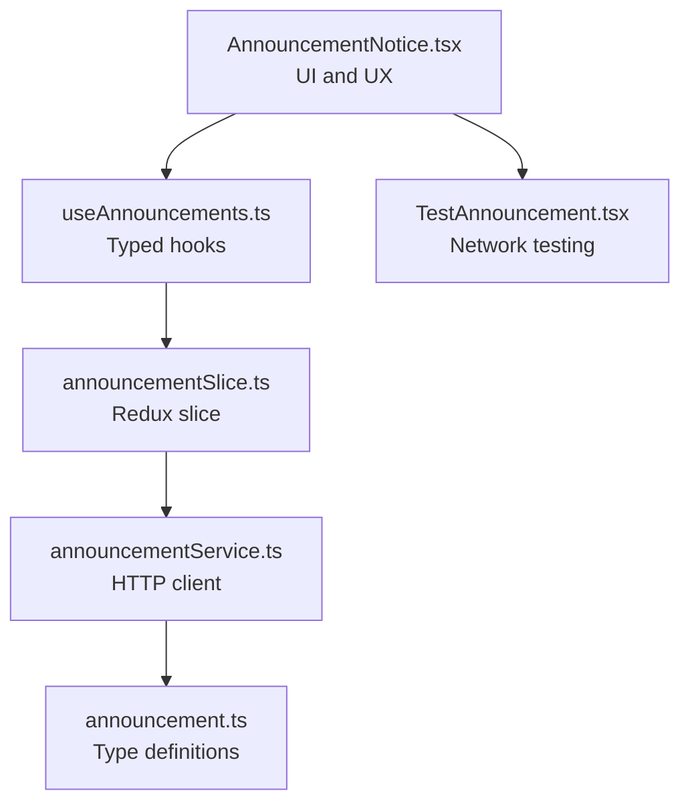
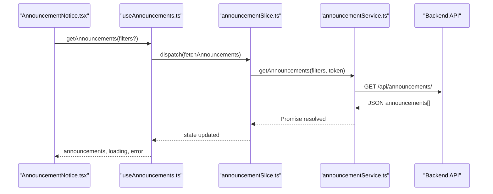
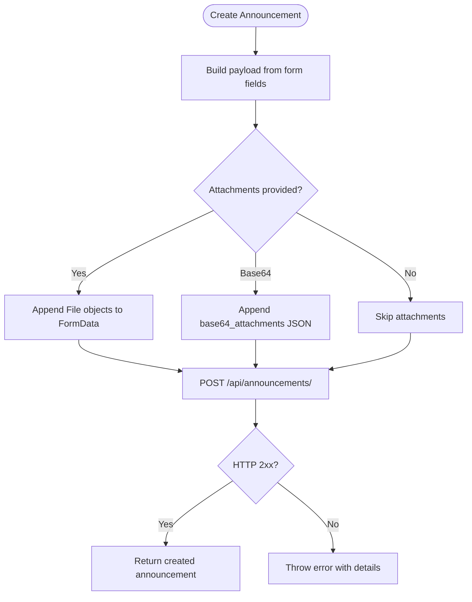
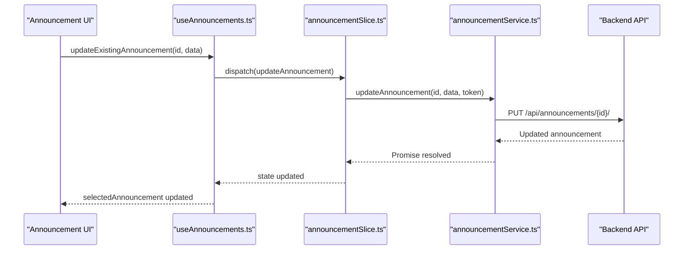
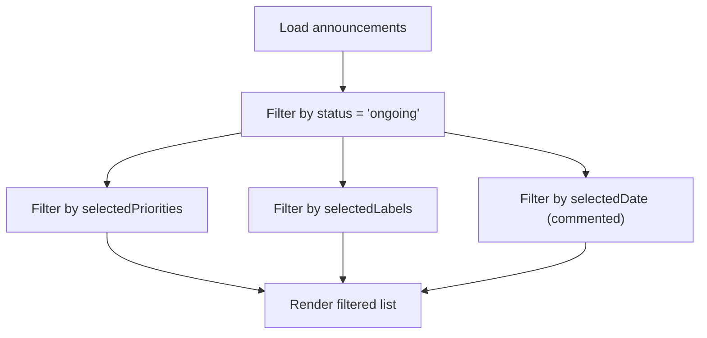
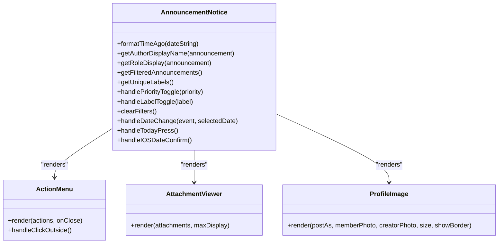
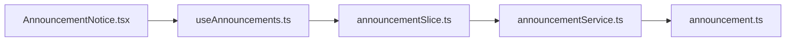

# Announcement System

<cite>
**Referenced Files in This Document**
- [AnnouncementNotice.tsx](file://Estate_link_App/src/Features/Announcement&NoticeScreen/AnnouncementNotice.tsx)
- [useAnnouncements.ts](file://Estate_link_App/src/hooks/useAnnouncements.ts)
- [announcementService.ts](file://Estate_link_App/src/services/announcementService.ts)
- [announcementSlice.ts](file://Estate_link_App/src/store/slices/announcementSlice.ts)
- [announcement.ts](file://Estate_link_App/src/types/announcement.ts)
- [TestAnnouncement.tsx](file://Estate_link_App/src/Features/Announcement&NoticeScreen/TestAnnouncement.tsx)
</cite>

## Table of Contents
1. [Introduction](#introduction)
2. [Project Structure](#project-structure)
3. [Core Components](#core-components)
4. [Architecture Overview](#architecture-overview)
5. [Detailed Component Analysis](#detailed-component-analysis)
6. [Dependency Analysis](#dependency-analysis)
7. [Performance Considerations](#performance-considerations)
8. [Troubleshooting Guide](#troubleshooting-guide)
9. [Conclusion](#conclusion)

## Introduction
This document provides comprehensive documentation for the announcement system functionality. It covers the announcement creation workflow (form validation, file uploads, content formatting), editing capabilities (draft saving and revision tracking), listing interface (filtering, sorting, and display modes), components (action menus, preview modals, visibility controls, author information), utilities and helper functions (date handling, user count calculations, content formatting), and practical examples of workflows, visibility configurations, and distribution mechanisms.

## Project Structure
The announcement system spans three primary layers:
- UI Layer: The main screen component renders announcements, filters, and actions.
- Hooks Layer: Provides typed hooks to interact with the Redux store and services.
- Data Layer: Redux slice manages state, async thunks orchestrate API calls, and the service encapsulates backend communication.

**Diagram sources**
- [AnnouncementNotice.tsx](file://Estate_link_App/src/Features/Announcement&NoticeScreen/AnnouncementNotice.tsx#L42-L1189)
- [useAnnouncements.ts](file://Estate_link_App/src/hooks/useAnnouncements.ts#L23-L246)
- [announcementSlice.ts](file://Estate_link_App/src/store/slices/announcementSlice.ts#L139-L324)
- [announcementService.ts](file://Estate_link_App/src/services/announcementService.ts#L14-L341)
- [announcement.ts](file://Estate_link_App/src/types/announcement.ts#L24-L109)
- [TestAnnouncement.tsx](file://Estate_link_App/src/Features/Announcement&NoticeScreen/TestAnnouncement.tsx#L27-L293)

**Section sources**
- [AnnouncementNotice.tsx](file://Estate_link_App/src/Features/Announcement&NoticeScreen/AnnouncementNotice.tsx#L42-L1189)
- [useAnnouncements.ts](file://Estate_link_App/src/hooks/useAnnouncements.ts#L23-L246)
- [announcementSlice.ts](file://Estate_link_App/src/store/slices/announcementSlice.ts#L139-L324)
- [announcementService.ts](file://Estate_link_App/src/services/announcementService.ts#L14-L341)
- [announcement.ts](file://Estate_link_App/src/types/announcement.ts#L24-L109)
- [TestAnnouncement.tsx](file://Estate_link_App/src/Features/Announcement&NoticeScreen/TestAnnouncement.tsx#L27-L293)

## Core Components
- Announcement model and filters define the data contract and UI filtering options.
- Service layer exposes CRUD and operational endpoints for announcements.
- Redux slice orchestrates asynchronous operations and state updates.
- Hooks provide a typed interface to dispatch actions and compute derived values.
- UI screen renders announcements, applies filters, and manages navigation and highlights.

Key responsibilities:
- Data fetching, filtering, and computed selections (hooks and slice).
- HTTP communication and error handling (service).
- UI rendering, highlighting, and user interactions (screen).

**Section sources**
- [announcement.ts](file://Estate_link_App/src/types/announcement.ts#L24-L109)
- [announcementService.ts](file://Estate_link_App/src/services/announcementService.ts#L14-L341)
- [announcementSlice.ts](file://Estate_link_App/src/store/slices/announcementSlice.ts#L139-L324)
- [useAnnouncements.ts](file://Estate_link_App/src/hooks/useAnnouncements.ts#L23-L246)
- [AnnouncementNotice.tsx](file://Estate_link_App/src/Features/Announcement&NoticeScreen/AnnouncementNotice.tsx#L42-L1189)

## Architecture Overview
The system follows a unidirectional data flow:
- UI triggers actions via hooks.
- Hooks dispatch Redux thunks.
- Thunks call the service layer.
- Service performs HTTP requests and returns normalized data.
- Reducers update the store, and the UI re-renders.

**Diagram sources**
- [AnnouncementNotice.tsx](file://Estate_link_App/src/Features/Announcement&NoticeScreen/AnnouncementNotice.tsx#L140-L177)
- [useAnnouncements.ts](file://Estate_link_App/src/hooks/useAnnouncements.ts#L36-L41)
- [announcementSlice.ts](file://Estate_link_App/src/store/slices/announcementSlice.ts#L31-L38)
- [announcementService.ts](file://Estate_link_App/src/services/announcementService.ts#L16-L92)

## Detailed Component Analysis

### Announcement Creation Workflow
The creation workflow supports:
- Form fields: title, description, posting context (creator/group/member), priority, label, scheduling (start/end date/time), targets (towers/units), and attachments.
- File upload validation: attachments can be provided as native File objects or base64-encoded metadata; the service serializes them into multipart/form-data.
- Content formatting: description is stored as plain text; labels are comma-separated strings; priorities are enum-like strings.

**Diagram sources**
- [announcementService.ts](file://Estate_link_App/src/services/announcementService.ts#L109-L157)
- [announcement.ts](file://Estate_link_App/src/types/announcement.ts#L65-L86)

**Section sources**
- [announcementService.ts](file://Estate_link_App/src/services/announcementService.ts#L109-L157)
- [announcement.ts](file://Estate_link_App/src/types/announcement.ts#L65-L86)

### Announcement Editing and Draft Management
Editing supports partial updates and maintains a revision-like state:
- Update endpoint accepts selective fields; the service constructs FormData accordingly.
- Status transitions: draft, upcoming, ongoing, expired; manual expiration and restoration endpoints are exposed.
- Revision tracking: the backend returns history entries that can be displayed in a modal.

**Diagram sources**
- [useAnnouncements.ts](file://Estate_link_App/src/hooks/useAnnouncements.ts#L60-L65)
- [announcementSlice.ts](file://Estate_link_App/src/store/slices/announcementSlice.ts#L58-L65)
- [announcementService.ts](file://Estate_link_App/src/services/announcementService.ts#L159-L212)

**Section sources**
- [announcementService.ts](file://Estate_link_App/src/services/announcementService.ts#L159-L212)
- [announcementSlice.ts](file://Estate_link_App/src/store/slices/announcementSlice.ts#L213-L232)

### Listing Interface: Filtering, Sorting, and Display Modes
The listing interface provides:
- Filtering: priority and label selection with multi-select toggles; date filter is present but currently commented out in the UI.
- Sorting: announcements are filtered by status "ongoing" and then further filtered by selected criteria.
- Display: grid-like cards with author info, labels, and attachments.

**Diagram sources**
- [AnnouncementNotice.tsx](file://Estate_link_App/src/Features/Announcement&NoticeScreen/AnnouncementNotice.tsx#L579-L611)

**Section sources**
- [AnnouncementNotice.tsx](file://Estate_link_App/src/Features/Announcement&NoticeScreen/AnnouncementNotice.tsx#L579-L656)

### Components: Action Menus, Preview Modals, Visibility Controls, Author Information
- Action menu: contextual actions (edit, history, pin/unpin, move to expired, restore, delete) rendered as a dropdown.
- Preview modal: full-detail view with attachment viewer and action triggers.
- Visibility controls: pin/unpin toggles and status transitions (upcoming/ongoing/expired).
- Author information: displays author name and role based on post_as context (creator/group/member).

**Diagram sources**
- [AnnouncementNotice.tsx](file://Estate_link_App/src/Features/Announcement&NoticeScreen/AnnouncementNotice.tsx#L541-L727)
- [AnnouncementNotice.tsx](file://Estate_link_App/src/Features/Announcement&NoticeScreen/AnnouncementNotice.tsx#L1007-L1172)

**Section sources**
- [AnnouncementNotice.tsx](file://Estate_link_App/src/Features/Announcement&NoticeScreen/AnnouncementNotice.tsx#L541-L727)
- [AnnouncementNotice.tsx](file://Estate_link_App/src/Features/Announcement&NoticeScreen/AnnouncementNotice.tsx#L1007-L1172)

### Utilities and Helper Functions
- Date handling: human-readable relative timestamps ("Just now", "X minutes/hours/days ago") and status badge coloring.
- User count calculations: not directly implemented in the mobile app; however, the backend provides endpoints for towers, units, and labels, enabling targeted distribution calculations.
- Content formatting: labels are comma-separated strings; attachments are handled via the service layer.

**Section sources**
- [AnnouncementNotice.tsx](file://Estate_link_App/src/Features/Announcement&NoticeScreen/AnnouncementNotice.tsx#L541-L727)
- [announcementService.ts](file://Estate_link_App/src/services/announcementService.ts#L294-L339)

### Examples: Workflows, Visibility Configurations, and Distribution Mechanisms
- Example workflow: create announcement with title, description, priority, label, scheduling, and attachments; publish; monitor status; pin important posts; manage expiration.
- Visibility configuration: use pin/unpin to elevate posts; filter by priority/label to surface relevant content.
- Distribution mechanism: target towers/units via dedicated endpoints; labels and statuses enable audience segmentation.

**Section sources**
- [announcementService.ts](file://Estate_link_App/src/services/announcementService.ts#L109-L157)
- [announcementService.ts](file://Estate_link_App/src/services/announcementService.ts#L294-L339)
- [AnnouncementNotice.tsx](file://Estate_link_App/src/Features/Announcement&NoticeScreen/AnnouncementNotice.tsx#L579-L656)

## Dependency Analysis
The system exhibits clean separation of concerns:
- UI depends on hooks for actions and computed values.
- Hooks depend on Redux slice for state and async thunks.
- Slice depends on service for HTTP operations.
- Service depends on shared types for request/response shapes.

**Diagram sources**
- [AnnouncementNotice.tsx](file://Estate_link_App/src/Features/Announcement&NoticeScreen/AnnouncementNotice.tsx#L42-L1189)
- [useAnnouncements.ts](file://Estate_link_App/src/hooks/useAnnouncements.ts#L23-L246)
- [announcementSlice.ts](file://Estate_link_App/src/store/slices/announcementSlice.ts#L139-L324)
- [announcementService.ts](file://Estate_link_App/src/services/announcementService.ts#L14-L341)
- [announcement.ts](file://Estate_link_App/src/types/announcement.ts#L24-L109)

**Section sources**
- [AnnouncementNotice.tsx](file://Estate_link_App/src/Features/Announcement&NoticeScreen/AnnouncementNotice.tsx#L42-L1189)
- [useAnnouncements.ts](file://Estate_link_App/src/hooks/useAnnouncements.ts#L23-L246)
- [announcementSlice.ts](file://Estate_link_App/src/store/slices/announcementSlice.ts#L139-L324)
- [announcementService.ts](file://Estate_link_App/src/services/announcementService.ts#L14-L341)
- [announcement.ts](file://Estate_link_App/src/types/announcement.ts#L24-L109)

## Performance Considerations
- Debounced tab switching and scroll-to-highlight logic reduce unnecessary re-renders and layout thrashing.
- Loading states are scoped to first loads to avoid spinner flicker on refresh.
- Filtering is client-side against already-fetched data to minimize network requests.
- Consider lazy-loading attachments and virtualizing long lists for large datasets.

## Troubleshooting Guide
- Authentication checks: the UI conditionally renders based on auth state and redirects to login if unauthenticated.
- Network testing: a dedicated test screen validates backend connectivity and reports response times.
- Error handling: service methods parse error responses and surface user-friendly messages; the slice stores error state for UI feedback.

**Section sources**
- [AnnouncementNotice.tsx](file://Estate_link_App/src/Features/Announcement&NoticeScreen/AnnouncementNotice.tsx#L732-L756)
- [TestAnnouncement.tsx](file://Estate_link_App/src/Features/Announcement&NoticeScreen/TestAnnouncement.tsx#L98-L152)
- [announcementService.ts](file://Estate_link_App/src/services/announcementService.ts#L37-L91)
- [announcementSlice.ts](file://Estate_link_App/src/store/slices/announcementSlice.ts#L177-L180)

## Conclusion
The announcement system integrates a robust UI, typed hooks, and a Redux-powered data layer with a well-defined service interface. It supports creation with file uploads, editing with status transitions, and a flexible listing interface with filtering and highlighting. While user count calculations are not implemented in the mobile app, the backend endpoints enable precise targeting and distribution strategies.