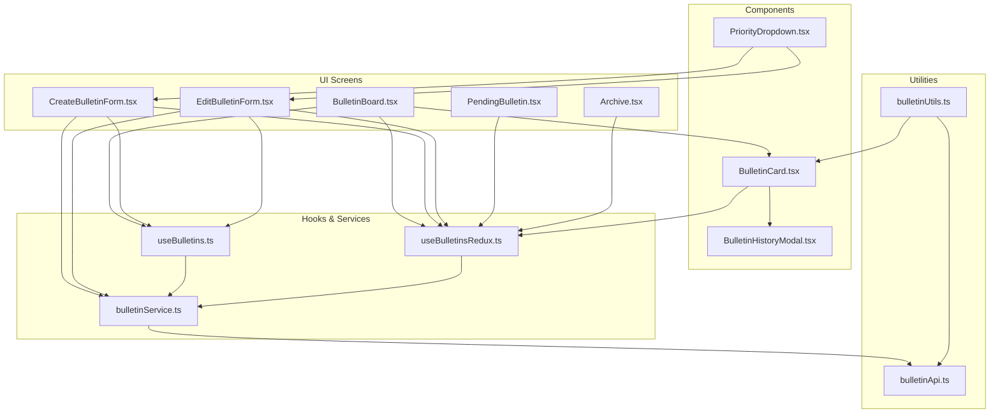
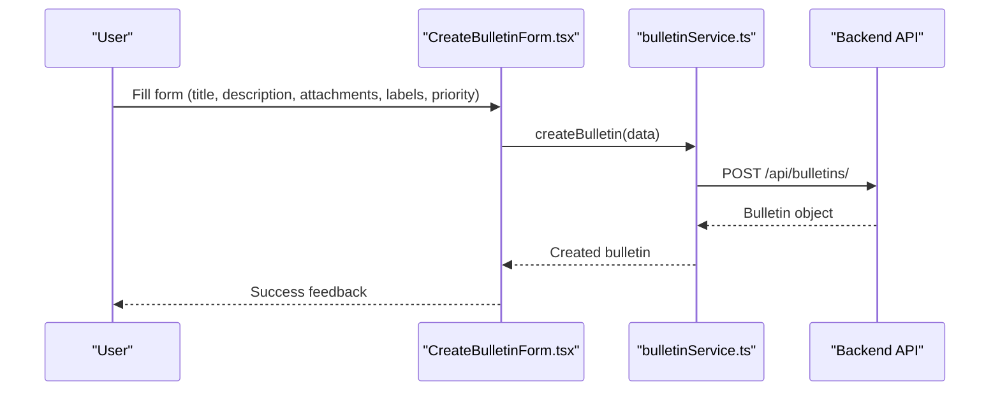
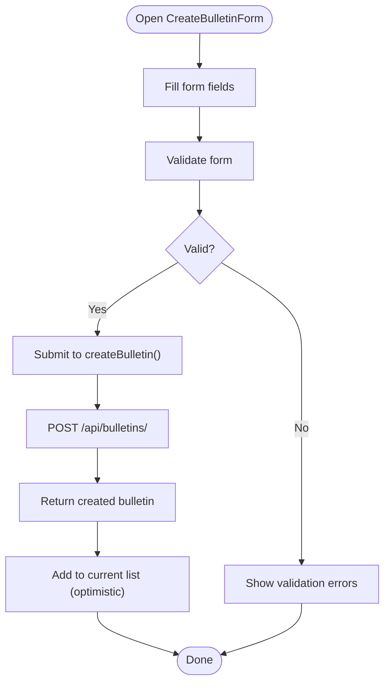
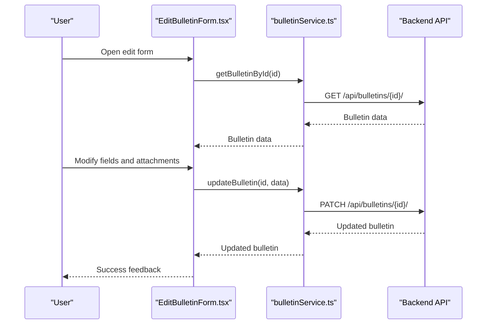
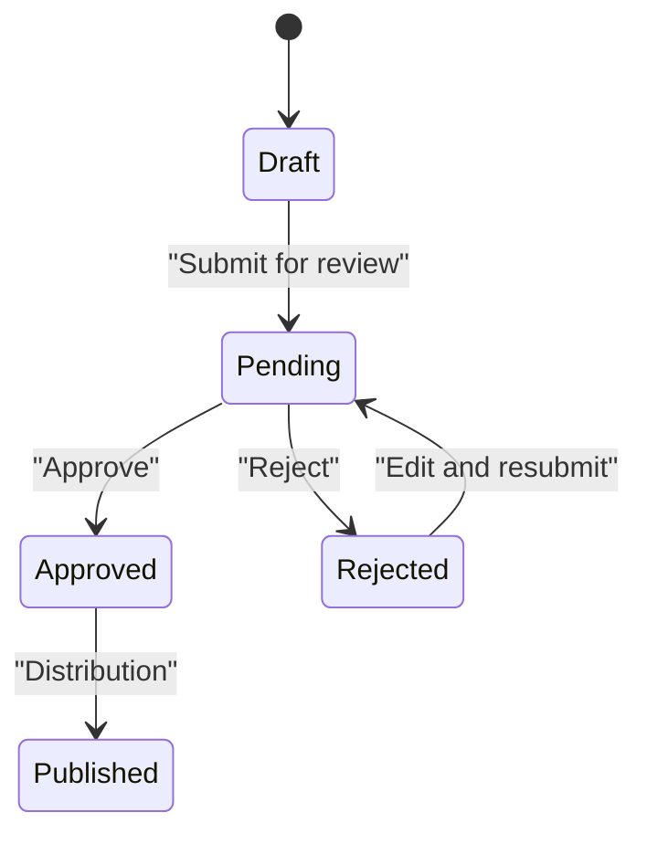
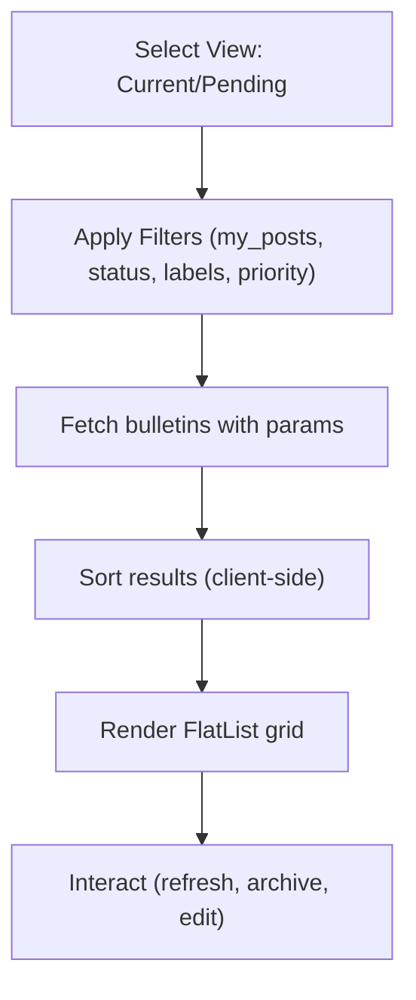
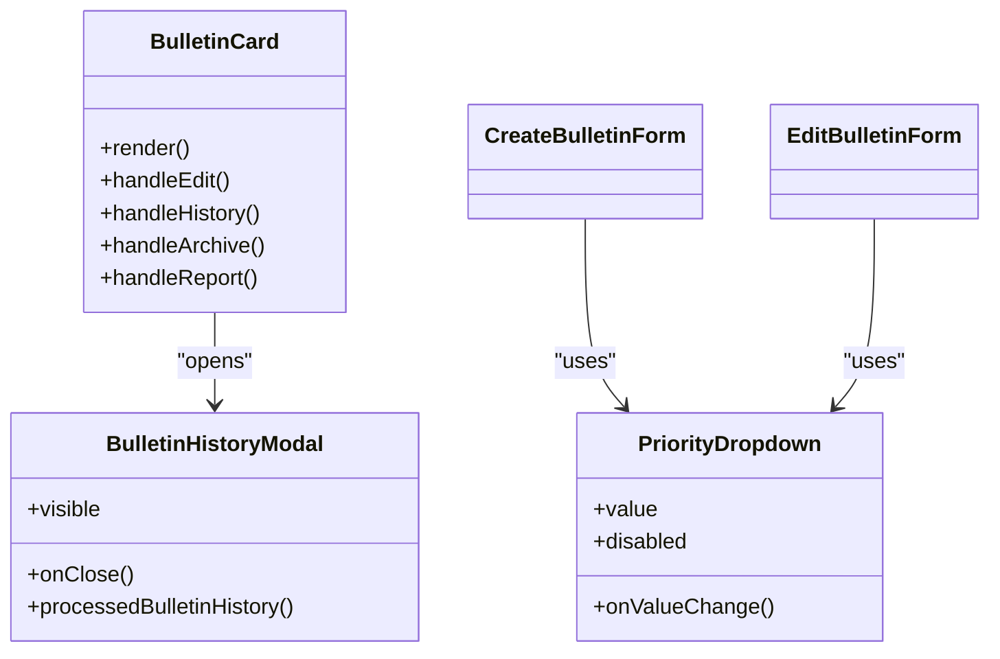
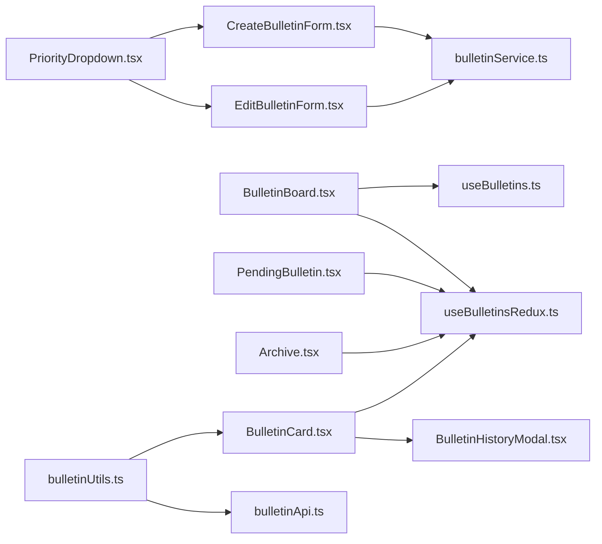

# Bulletin Board

<cite>
**Referenced Files in This Document**
- [bulletinService.ts](file://Estate_link_App/src/services/bulletinService.ts)
- [useBulletins.ts](file://Estate_link_App/src/hooks/useBulletins.ts)
- [useBulletinsRedux.ts](file://Estate_link_App/src/hooks/useBulletinsRedux.ts)
- [BulletinBoard.tsx](file://Estate_link_App/src/Features/BulletinScreen/BulletinBoard.tsx)
- [CreateBulletinForm.tsx](file://Estate_link_App/src/Features/BulletinScreen/CreateBulletinForm.tsx)
- [EditBulletinForm.tsx](file://Estate_link_App/src/Features/BulletinScreen/EditBulletinForm.tsx)
- [PendingBulletin.tsx](file://Estate_link_App/src/Features/BulletinScreen/PendingBulletin.tsx)
- [Archive.tsx](file://Estate_link_App/src/Features/BulletinScreen/Archive.tsx)
- [BulletinCard.tsx](file://Estate_link_App/src/Features/BulletinScreen/BulletinCard.tsx)
- [PriorityDropdown.tsx](file://Estate_link_App/src/Features/BulletinScreen/components/PriorityDropdown.tsx)
- [BulletinHistoryModal.tsx](file://Estate_link_App/src/Features/BulletinScreen/components/BulletinHistoryModal.tsx)
- [bulletinUtils.ts](file://Estate_link_App/src/Features/BulletinScreen/utils/bulletinUtils.ts)
- [bulletinApi.ts](file://Estate_link_App/src/Features/BulletinScreen/utils/bulletinApi.ts)
</cite>

## Table of Contents
1. [Introduction](#introduction)
2. [Project Structure](#project-structure)
3. [Core Components](#core-components)
4. [Architecture Overview](#architecture-overview)
5. [Detailed Component Analysis](#detailed-component-analysis)
6. [Dependency Analysis](#dependency-analysis)
7. [Performance Considerations](#performance-considerations)
8. [Troubleshooting Guide](#troubleshooting-guide)
9. [Conclusion](#conclusion)

## Introduction
This document describes the bulletin board system, covering bulletin creation and editing workflows with approval processes and status tracking, listing interfaces with grid/table views and filtering/sorting, bulletin components (action menus, detail modals, label selectors, priority dropdowns), utilities for data formatting/validation, and the approval workflow with history tracking and status management. It also includes practical examples of creation, approval processes, and distribution patterns.

## Project Structure
The bulletin board system is implemented primarily under the Estate_link_App/src/Features/BulletinScreen directory, with supporting services, hooks, utilities, and components. The system integrates with backend APIs for CRUD operations, approvals, archives, and history retrieval.

**Diagram sources**
- [BulletinBoard.tsx](file://Estate_link_App/src/Features/BulletinScreen/BulletinBoard.tsx#L1-L756)
- [CreateBulletinForm.tsx](file://Estate_link_App/src/Features/BulletinScreen/CreateBulletinForm.tsx#L1-L800)
- [EditBulletinForm.tsx](file://Estate_link_App/src/Features/BulletinScreen/EditBulletinForm.tsx#L1-L800)
- [PendingBulletin.tsx](file://Estate_link_App/src/Features/BulletinScreen/PendingBulletin.tsx#L1-L284)
- [Archive.tsx](file://Estate_link_App/src/Features/BulletinScreen/Archive.tsx#L1-L265)
- [BulletinCard.tsx](file://Estate_link_App/src/Features/BulletinScreen/BulletinCard.tsx#L1-L816)
- [PriorityDropdown.tsx](file://Estate_link_App/src/Features/BulletinScreen/components/PriorityDropdown.tsx#L1-L270)
- [BulletinHistoryModal.tsx](file://Estate_link_App/src/Features/BulletinScreen/components/BulletinHistoryModal.tsx#L1-L455)
- [useBulletins.ts](file://Estate_link_App/src/hooks/useBulletins.ts#L1-L196)
- [useBulletinsRedux.ts](file://Estate_link_App/src/hooks/useBulletinsRedux.ts#L1-L226)
- [bulletinService.ts](file://Estate_link_App/src/services/bulletinService.ts#L1-L705)
- [bulletinUtils.ts](file://Estate_link_App/src/Features/BulletinScreen/utils/bulletinUtils.ts#L1-L401)
- [bulletinApi.ts](file://Estate_link_App/src/Features/BulletinScreen/utils/bulletinApi.ts#L1-L342)

**Section sources**
- [BulletinBoard.tsx](file://Estate_link_App/src/Features/BulletinScreen/BulletinBoard.tsx#L1-L756)
- [bulletinService.ts](file://Estate_link_App/src/services/bulletinService.ts#L1-L705)

## Core Components
- Bulletin listing and navigation: BulletinBoard manages current/pending/archive views, filtering, and refresh logic.
- Creation and editing: CreateBulletinForm and EditBulletinForm handle form validation, attachments, labels, and distribution targets.
- Approval workflow: PendingBulletin provides approve/reject actions; Archive displays archived bulletins.
- Components and modals: BulletinCard renders cards with action menus, history modal, and media viewer; PriorityDropdown selects priority; BulletinHistoryModal shows detailed history.
- Hooks and services: useBulletins and useBulletinsRedux orchestrate data fetching, caching, and Redux state; bulletinService abstracts API calls.

**Section sources**
- [BulletinBoard.tsx](file://Estate_link_App/src/Features/BulletinScreen/BulletinBoard.tsx#L1-L756)
- [CreateBulletinForm.tsx](file://Estate_link_App/src/Features/BulletinScreen/CreateBulletinForm.tsx#L1-L800)
- [EditBulletinForm.tsx](file://Estate_link_App/src/Features/BulletinScreen/EditBulletinForm.tsx#L1-L800)
- [PendingBulletin.tsx](file://Estate_link_App/src/Features/BulletinScreen/PendingBulletin.tsx#L1-L284)
- [Archive.tsx](file://Estate_link_App/src/Features/BulletinScreen/Archive.tsx#L1-L265)
- [BulletinCard.tsx](file://Estate_link_App/src/Features/BulletinScreen/BulletinCard.tsx#L1-L816)
- [PriorityDropdown.tsx](file://Estate_link_App/src/Features/BulletinScreen/components/PriorityDropdown.tsx#L1-L270)
- [BulletinHistoryModal.tsx](file://Estate_link_App/src/Features/BulletinScreen/components/BulletinHistoryModal.tsx#L1-L455)
- [useBulletins.ts](file://Estate_link_App/src/hooks/useBulletins.ts#L1-L196)
- [useBulletinsRedux.ts](file://Estate_link_App/src/hooks/useBulletinsRedux.ts#L1-L226)
- [bulletinService.ts](file://Estate_link_App/src/services/bulletinService.ts#L1-L705)

## Architecture Overview
The system follows a layered architecture:
- UI Layer: Screens and components render and collect user input.
- Hook Layer: useBulletins and useBulletinsRedux encapsulate data fetching, caching, and Redux actions.
- Service Layer: bulletinService defines typed interfaces and orchestrates API calls.
- Utility Layer: bulletinUtils and bulletinApi provide formatting, validation, and API helpers.

**Diagram sources**
- [CreateBulletinForm.tsx](file://Estate_link_App/src/Features/BulletinScreen/CreateBulletinForm.tsx#L1-L800)
- [bulletinService.ts](file://Estate_link_App/src/services/bulletinService.ts#L73-L213)

**Section sources**
- [bulletinService.ts](file://Estate_link_App/src/services/bulletinService.ts#L1-L705)
- [bulletinUtils.ts](file://Estate_link_App/src/Features/BulletinScreen/utils/bulletinUtils.ts#L1-L401)
- [bulletinApi.ts](file://Estate_link_App/src/Features/BulletinScreen/utils/bulletinApi.ts#L1-L342)

## Detailed Component Analysis

### Bulletin Creation Workflow
- Form collects title, description, attachments, labels, priority, and distribution targets (towers/units).
- Validation runs via useBulletinValidation and local helpers.
- On submit, createBulletin converts attachments to base64 and sends multipart/form-data to the backend.
- Optimistic UI updates add the new bulletin to the list immediately.

**Diagram sources**
- [CreateBulletinForm.tsx](file://Estate_link_App/src/Features/BulletinScreen/CreateBulletinForm.tsx#L1-L800)
- [bulletinService.ts](file://Estate_link_App/src/services/bulletinService.ts#L73-L213)
- [useBulletins.ts](file://Estate_link_App/src/hooks/useBulletins.ts#L58-L81)

**Section sources**
- [CreateBulletinForm.tsx](file://Estate_link_App/src/Features/BulletinScreen/CreateBulletinForm.tsx#L1-L800)
- [bulletinService.ts](file://Estate_link_App/src/services/bulletinService.ts#L1-L705)
- [useBulletins.ts](file://Estate_link_App/src/hooks/useBulletins.ts#L1-L196)

### Bulletin Editing Workflow
- EditBulletinForm loads existing data from Redux or API, supports selective attachment updates, and preserves labels/targets.
- Validates changes and submits PATCH updates with base64 attachments for new files and attachment IDs for deletions.
- Uses optimistic updates and refreshes related lists.

**Diagram sources**
- [EditBulletinForm.tsx](file://Estate_link_App/src/Features/BulletinScreen/EditBulletinForm.tsx#L1-L800)
- [bulletinService.ts](file://Estate_link_App/src/services/bulletinService.ts#L280-L310)
- [bulletinService.ts](file://Estate_link_App/src/services/bulletinService.ts#L350-L521)

**Section sources**
- [EditBulletinForm.tsx](file://Estate_link_App/src/Features/BulletinScreen/EditBulletinForm.tsx#L1-L800)
- [bulletinService.ts](file://Estate_link_App/src/services/bulletinService.ts#L1-L705)

### Approval Workflow and Status Management
- PendingBulletin lists bulletins awaiting review with Approve/Reject actions.
- Approve/Reject actions dispatch Redux actions that call backend endpoints.
- Status transitions: draft → pending → approved/rejected; approved bulletins appear in current list; rejected bulletins remain in pending until repost/edit.

**Diagram sources**
- [PendingBulletin.tsx](file://Estate_link_App/src/Features/BulletinScreen/PendingBulletin.tsx#L1-L284)
- [useBulletinsRedux.ts](file://Estate_link_App/src/hooks/useBulletinsRedux.ts#L1-L226)

**Section sources**
- [PendingBulletin.tsx](file://Estate_link_App/src/Features/BulletinScreen/PendingBulletin.tsx#L1-L284)
- [useBulletinsRedux.ts](file://Estate_link_App/src/hooks/useBulletinsRedux.ts#L1-L226)

### Listing Interfaces: Grid/Table Views and Filtering
- BulletinBoard presents two primary views: Current (approved) and Pending (awaiting approval), with toggle and archive navigation.
- Filtering: my_posts toggle, status filters, and backend query params.
- Sorting: client-side sorting utilities support created_at, updated_at, priority, title, views_count.
- Infinite/flat list rendering for performance.

**Diagram sources**
- [BulletinBoard.tsx](file://Estate_link_App/src/Features/BulletinScreen/BulletinBoard.tsx#L1-L756)
- [bulletinUtils.ts](file://Estate_link_App/src/Features/BulletinScreen/utils/bulletinUtils.ts#L182-L213)
- [bulletinService.ts](file://Estate_link_App/src/services/bulletinService.ts#L215-L278)

**Section sources**
- [BulletinBoard.tsx](file://Estate_link_App/src/Features/BulletinScreen/BulletinBoard.tsx#L1-L756)
- [bulletinUtils.ts](file://Estate_link_App/src/Features/BulletinScreen/utils/bulletinUtils.ts#L1-L401)
- [bulletinService.ts](file://Estate_link_App/src/services/bulletinService.ts#L1-L705)

### Bulletin Components
- Action Menus: BulletinCard renders contextual options (Edit, History, Archive, Report) based on ownership and screen context.
- Detail Modals: BulletinHistoryModal displays creation and change history with user, timestamp, and comments.
- Label Selector: Create/Edit forms support label selection/dynamic creation with validation.
- Priority Dropdown: PriorityDropdown provides visual priority selection with icons/colors.

**Diagram sources**
- [BulletinCard.tsx](file://Estate_link_App/src/Features/BulletinScreen/BulletinCard.tsx#L1-L816)
- [BulletinHistoryModal.tsx](file://Estate_link_App/src/Features/BulletinScreen/components/BulletinHistoryModal.tsx#L1-L455)
- [PriorityDropdown.tsx](file://Estate_link_App/src/Features/BulletinScreen/components/PriorityDropdown.tsx#L1-L270)
- [CreateBulletinForm.tsx](file://Estate_link_App/src/Features/BulletinScreen/CreateBulletinForm.tsx#L1-L800)
- [EditBulletinForm.tsx](file://Estate_link_App/src/Features/BulletinScreen/EditBulletinForm.tsx#L1-L800)

**Section sources**
- [BulletinCard.tsx](file://Estate_link_App/src/Features/BulletinScreen/BulletinCard.tsx#L1-L816)
- [BulletinHistoryModal.tsx](file://Estate_link_App/src/Features/BulletinScreen/components/BulletinHistoryModal.tsx#L1-L455)
- [PriorityDropdown.tsx](file://Estate_link_App/src/Features/BulletinScreen/components/PriorityDropdown.tsx#L1-L270)
- [CreateBulletinForm.tsx](file://Estate_link_App/src/Features/BulletinScreen/CreateBulletinForm.tsx#L1-L800)
- [EditBulletinForm.tsx](file://Estate_link_App/src/Features/BulletinScreen/EditBulletinForm.tsx#L1-L800)

### Utilities for Data Formatting and Validation
- Data formatting: formatBulletinForApi trims and normalizes inputs; sortBulletins orders by multiple criteria.
- Validation: validateBulletinData enforces field length limits and selections; file type and size checks.
- File handling: formatFileSize, isSupportedFileType, getFileIcon utilities.
- Permissions: checkBulletinPermission determines edit/delete/approve/reject/archive eligibility.

**Section sources**
- [bulletinUtils.ts](file://Estate_link_App/src/Features/BulletinScreen/utils/bulletinUtils.ts#L1-L401)
- [bulletinApi.ts](file://Estate_link_App/src/Features/BulletinScreen/utils/bulletinApi.ts#L1-L342)

### Distribution Patterns
- Targets: Towers and units are selectable for distribution; units are fetched based on selected towers with caching.
- Labels: Labels are fetched from backend and can be created dynamically in forms.
- Priority: Priority affects visibility and urgency; UI components reflect priority visually.

**Section sources**
- [CreateBulletinForm.tsx](file://Estate_link_App/src/Features/BulletinScreen/CreateBulletinForm.tsx#L317-L407)
- [EditBulletinForm.tsx](file://Estate_link_App/src/Features/BulletinScreen/EditBulletinForm.tsx#L473-L562)
- [bulletinService.ts](file://Estate_link_App/src/services/bulletinService.ts#L647-L704)

## Dependency Analysis
- Hooks depend on services for API calls and on Redux for state management.
- Components depend on hooks and services for data and actions.
- Utilities provide shared formatting/validation logic used across components.

**Diagram sources**
- [CreateBulletinForm.tsx](file://Estate_link_App/src/Features/BulletinScreen/CreateBulletinForm.tsx#L1-L800)
- [EditBulletinForm.tsx](file://Estate_link_App/src/Features/BulletinScreen/EditBulletinForm.tsx#L1-L800)
- [BulletinBoard.tsx](file://Estate_link_App/src/Features/BulletinScreen/BulletinBoard.tsx#L1-L756)
- [PendingBulletin.tsx](file://Estate_link_App/src/Features/BulletinScreen/PendingBulletin.tsx#L1-L284)
- [Archive.tsx](file://Estate_link_App/src/Features/BulletinScreen/Archive.tsx#L1-L265)
- [BulletinCard.tsx](file://Estate_link_App/src/Features/BulletinScreen/BulletinCard.tsx#L1-L816)
- [BulletinHistoryModal.tsx](file://Estate_link_App/src/Features/BulletinScreen/components/BulletinHistoryModal.tsx#L1-L455)
- [PriorityDropdown.tsx](file://Estate_link_App/src/Features/BulletinScreen/components/PriorityDropdown.tsx#L1-L270)
- [useBulletins.ts](file://Estate_link_App/src/hooks/useBulletins.ts#L1-L196)
- [useBulletinsRedux.ts](file://Estate_link_App/src/hooks/useBulletinsRedux.ts#L1-L226)
- [bulletinService.ts](file://Estate_link_App/src/services/bulletinService.ts#L1-L705)
- [bulletinUtils.ts](file://Estate_link_App/src/Features/BulletinScreen/utils/bulletinUtils.ts#L1-L401)
- [bulletinApi.ts](file://Estate_link_App/src/Features/BulletinScreen/utils/bulletinApi.ts#L1-L342)

**Section sources**
- [useBulletins.ts](file://Estate_link_App/src/hooks/useBulletins.ts#L1-L196)
- [useBulletinsRedux.ts](file://Estate_link_App/src/hooks/useBulletinsRedux.ts#L1-L226)
- [bulletinService.ts](file://Estate_link_App/src/services/bulletinService.ts#L1-L705)

## Performance Considerations
- Memoization: React.memo on BulletinBoard prevents unnecessary re-renders; keyExtractor and batch rendering improve FlatList performance.
- Optimistic updates: Immediate UI updates reduce perceived latency; Redux actions ensure eventual consistency.
- Caching: useBulletinsRedux caches data per status; cache-busting timestamps prevent stale data.
- Lazy loading: MediaViewer defers heavy image rendering; pagination placeholders improve UX.

[No sources needed since this section provides general guidance]

## Troubleshooting Guide
- Authentication errors: Ensure accessToken is present; service functions throw descriptive errors for 401/403 scenarios.
- Attachment issues: Base64 conversion failures are filtered; total size and count limits are validated before submission.
- History retrieval: getBulletinHistory gracefully falls back to empty arrays if endpoint fails.
- Approval/rejection: PendingBulletin confirms actions and navigates on success; errors are surfaced via alerts.

**Section sources**
- [bulletinService.ts](file://Estate_link_App/src/services/bulletinService.ts#L169-L204)
- [bulletinService.ts](file://Estate_link_App/src/services/bulletinService.ts#L334-L347)
- [PendingBulletin.tsx](file://Estate_link_App/src/Features/BulletinScreen/PendingBulletin.tsx#L56-L130)

## Conclusion
The bulletin board system provides a robust, modular solution for creating, reviewing, distributing, and tracking bulletins. Its architecture separates UI, hooks, services, and utilities, enabling maintainability and scalability. The approval workflow, history tracking, and flexible listing interfaces deliver a comprehensive user experience across mobile and web contexts.