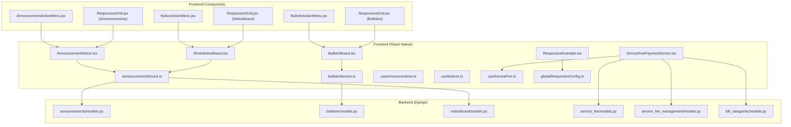
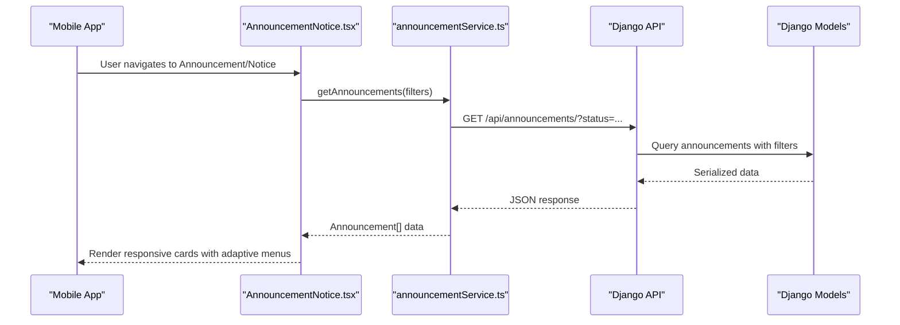
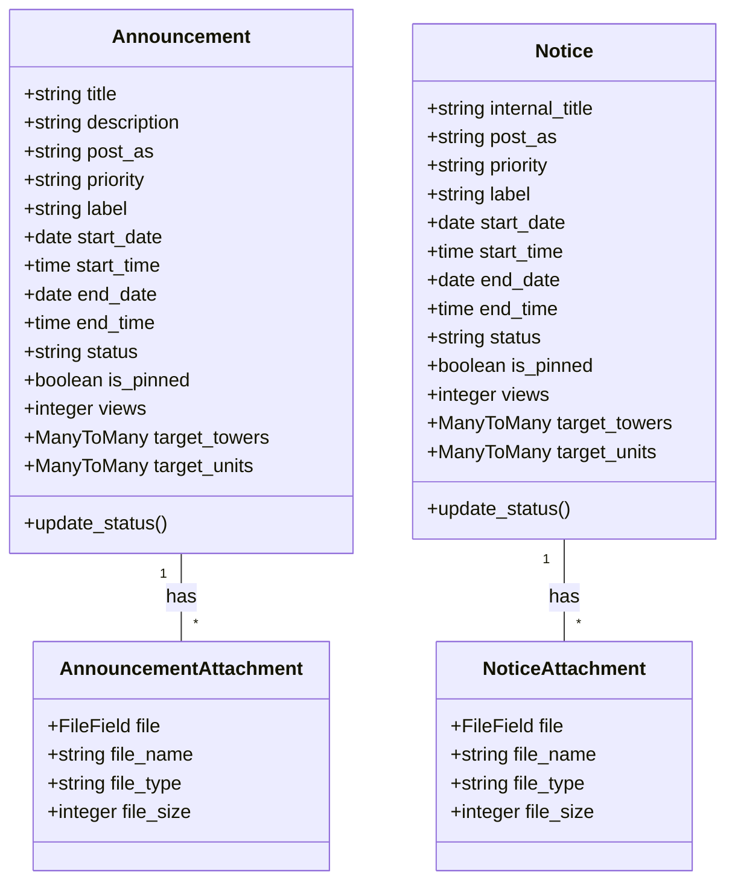
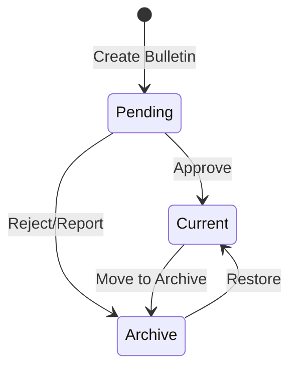
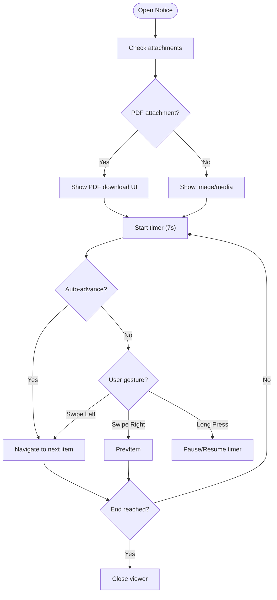
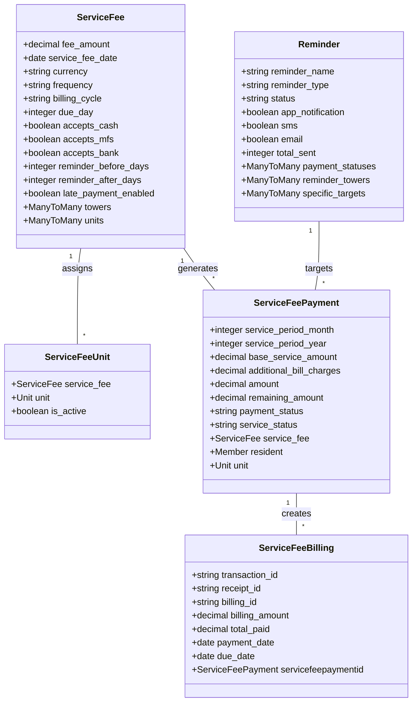
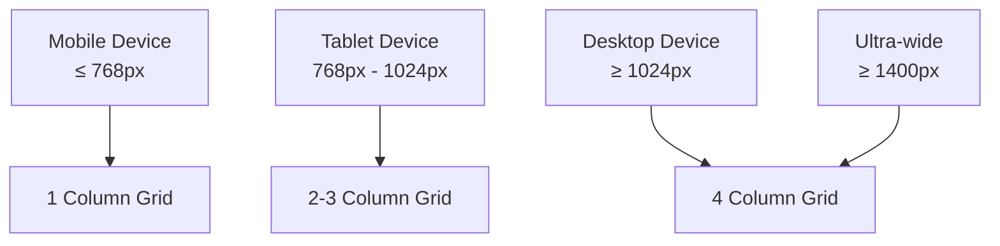
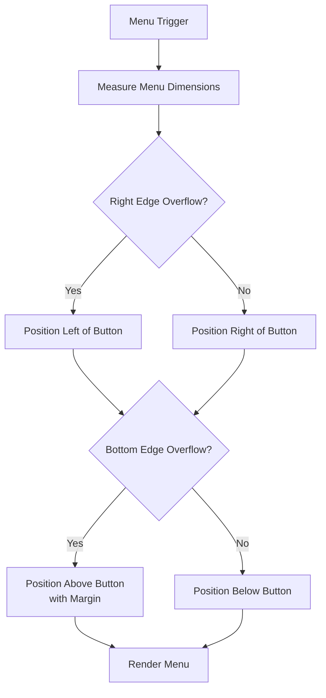
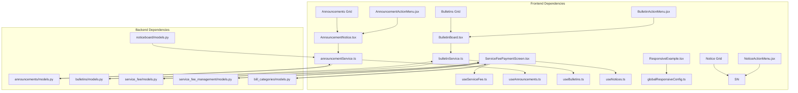

# Communication Portal

<cite>
**Referenced Files in This Document**
- [AnnouncementNotice.tsx](file://Estate_link_App/src/Features/Announcement&NoticeScreen/AnnouncementNotice.tsx)
- [BulletinBoard.tsx](file://Estate_link_App/src/Features/BulletinScreen/BulletinBoard.tsx)
- [ShowNoticeBoard.tsx](file://Estate_link_App/src/Features/NoticeBoardScreen/ShowNoticeBoard.tsx)
- [ServiceFeePaymentScreen.tsx](file://Estate_link_App/src/Features/ServiceFeePayment/ServiceFeePaymentScreen.tsx)
- [announcementService.ts](file://Estate_link_App/src/services/announcementService.ts)
- [bulletinService.ts](file://Estate_link_App/src/services/bulletinService.ts)
- [useAnnouncements.ts](file://Estate_link_App/src/hooks/useAnnouncements.ts)
- [useNotices.ts](file://Estate_link_App/src/hooks/useNotices.ts)
- [useServiceFee.ts](file://Estate_link_App/src/hooks/useServiceFee.ts)
- [models.py (announcements)](file://backend/announcements/models.py)
- [models.py (bulletins)](file://backend/bulletins/models.py)
- [models.py (noticeboard)](file://backend/noticeboard/models.py)
- [models.py (service_fee)](file://backend/service_fee/models.py)
- [models.py (service_fee_management)](file://backend/service_fee_management/models.py)
- [models.py (bill_categories)](file://backend/bill_categories/models.py)
- [AnnouncementActionMenu.jsx](file://frontend/src/Features/CommunicationPortal/Announcements/components/AnnouncementActionMenu.jsx)
- [BulletinActionMenu.jsx](file://frontend/src/Features/CommunicationPortal/Bulletins/components/BulletinActionMenu.jsx)
- [NoticeActionMenu.jsx](file://frontend/src/Features/CommunicationPortal/NoticeBoard/components/NoticeActionMenu.jsx)
- [ResponsiveGrid.jsx (Announcements)](file://frontend/src/Features/CommunicationPortal/Announcements/AnnouncementList/ResponsiveGrid.jsx)
- [ResponsiveGrid.jsx (Bulletins)](file://frontend/src/Features/CommunicationPortal/Bulletins/BulletinList/ResponsiveGrid.jsx)
- [ResponsiveGrid.jsx (NoticeBoard)](file://frontend/src/Features/CommunicationPortal/NoticeBoard/NoticeList/ResponsiveGrid.jsx)
- [ResponsiveExample.tsx](file://Estate_link_App/src/components/ResponsiveExample.tsx)
- [globalResponsiveConfig.ts](file://Estate_link_App/src/utils/globalResponsiveConfig.ts)
</cite>

## Update Summary
**Changes Made**
- Enhanced mobile responsiveness across communication portal components
- Updated action menu positioning system to prevent overflow and improve touch interaction
- Improved responsive grid layouts for announcements, bulletins, and notices
- Added comprehensive responsive design utilities and configuration
- Refined touch interaction patterns for mobile devices

## Table of Contents
1. [Introduction](#introduction)
2. [Project Structure](#project-structure)
3. [Core Components](#core-components)
4. [Architecture Overview](#architecture-overview)
5. [Detailed Component Analysis](#detailed-component-analysis)
6. [Mobile Responsiveness Enhancements](#mobile-responsiveness-enhancements)
7. [Action Menu Positioning System](#action-menu-positioning-system)
8. [Dependency Analysis](#dependency-analysis)
9. [Performance Considerations](#performance-considerations)
10. [Troubleshooting Guide](#troubleshooting-guide)
11. [Conclusion](#conclusion)

## Introduction
This document provides comprehensive documentation for the Communication Portal and Service Fee Management feature modules in the Estate Link project. It covers:
- Announcement and Notice system: creation, editing, visibility controls, and distribution mechanisms
- Bulletin Board: internal communications with approval workflows and history tracking
- Notice Board: official notices and regulatory communications
- Service Fee Management: bill categories, bill uploads, billing management, payment processing, and reminder systems
- Service Fee Settings: fee configuration, schedule management, and generation processes
- Reports and analytics: service fee tracking and payment monitoring
- Mobile responsiveness enhancements with improved UI components for announcements, bulletins, and notices
- Action menu positioning system to prevent overflow issues and improve touch interaction on mobile devices
- Examples of communication workflows, service fee cycles, and notification patterns

## Project Structure
The Communication Portal spans two primary layers:
- Frontend (React Native): Feature screens, services, hooks, and components for announcements, bulletins, notices, and service fee payments
- Backend (Django): Models, serializers, views, and management commands for announcements, bulletins, notices, service fees, and reminders

**Diagram sources**
- [AnnouncementNotice.tsx](file://Estate_link_App/src/Features/Announcement&NoticeScreen/AnnouncementNotice.tsx#L1-L120)
- [BulletinBoard.tsx](file://Estate_link_App/src/Features/BulletinScreen/BulletinBoard.tsx#L1-L120)
- [ShowNoticeBoard.tsx](file://Estate_link_App/src/Features/NoticeBoardScreen/ShowNoticeBoard.tsx#L1-L120)
- [ServiceFeePaymentScreen.tsx](file://Estate_link_App/src/Features/ServiceFeePayment/ServiceFeePaymentScreen.tsx#L1-L120)
- [announcementService.ts](file://Estate_link_App/src/services/announcementService.ts#L1-L60)
- [bulletinService.ts](file://Estate_link_App/src/services/bulletinService.ts#L1-L60)
- [ResponsiveExample.tsx](file://Estate_link_App/src/components/ResponsiveExample.tsx#L1-L427)
- [globalResponsiveConfig.ts](file://Estate_link_App/src/utils/globalResponsiveConfig.ts#L1-L279)
- [AnnouncementActionMenu.jsx](file://frontend/src/Features/CommunicationPortal/Announcements/components/AnnouncementActionMenu.jsx#L1-L248)
- [BulletinActionMenu.jsx](file://frontend/src/Features/CommunicationPortal/Bulletins/components/BulletinActionMenu.jsx#L1-L165)
- [NoticeActionMenu.jsx](file://frontend/src/Features/CommunicationPortal/NoticeBoard/components/NoticeActionMenu.jsx#L1-L153)
- [ResponsiveGrid.jsx (Announcements)](file://frontend/src/Features/CommunicationPortal/Announcements/AnnouncementList/ResponsiveGrid.jsx#L1-L44)
- [ResponsiveGrid.jsx (Bulletins)](file://frontend/src/Features/CommunicationPortal/Bulletins/BulletinList/ResponsiveGrid.jsx#L1-L31)
- [ResponsiveGrid.jsx (NoticeBoard)](file://frontend/src/Features/CommunicationPortal/NoticeBoard/NoticeList/ResponsiveGrid.jsx#L1-L35)
- [models.py (announcements)](file://backend/announcements/models.py#L1-L120)
- [models.py (bulletins)](file://backend/bulletins/models.py#L1-L120)
- [models.py (noticeboard)](file://backend/noticeboard/models.py#L1-L120)
- [models.py (service_fee)](file://backend/service_fee/models.py#L1-L120)
- [models.py (service_fee_management)](file://backend/service_fee_management/models.py#L1-L120)
- [models.py (bill_categories)](file://backend/bill_categories/models.py#L1-L86)

**Section sources**
- [AnnouncementNotice.tsx](file://Estate_link_App/src/Features/Announcement&NoticeScreen/AnnouncementNotice.tsx#L1-L120)
- [BulletinBoard.tsx](file://Estate_link_App/src/Features/BulletinScreen/BulletinBoard.tsx#L1-L120)
- [ShowNoticeBoard.tsx](file://Estate_link_App/src/Features/NoticeBoardScreen/ShowNoticeBoard.tsx#L1-L120)
- [ServiceFeePaymentScreen.tsx](file://Estate_link_App/src/Features/ServiceFeePayment/ServiceFeePaymentScreen.tsx#L1-L120)
- [announcementService.ts](file://Estate_link_App/src/services/announcementService.ts#L1-L60)
- [bulletinService.ts](file://Estate_link_App/src/services/bulletinService.ts#L1-L60)
- [models.py (announcements)](file://backend/announcements/models.py#L1-L120)
- [models.py (bulletins)](file://backend/bulletins/models.py#L1-L120)
- [models.py (noticeboard)](file://backend/noticeboard/models.py#L1-L120)
- [models.py (service_fee)](file://backend/service_fee/models.py#L1-L120)
- [models.py (service_fee_management)](file://backend/service_fee_management/models.py#L1-L120)
- [models.py (bill_categories)](file://backend/bill_categories/models.py#L1-L86)

## Core Components
- Announcement and Notice Hub: Unified screen combining announcements and notices with filtering, sorting, and navigation
- Bulletin Board: Internal communication platform with approval workflows, history tracking, and moderation features
- Notice Board Viewer: Rich media viewer for official notices with auto-advance, manual navigation, and PDF support
- Service Fee Payment: Comprehensive payment management with unit selection, upcoming bills, payment history, and gateway integration
- Responsive Action Menus: Enhanced mobile-first action menus with intelligent positioning to prevent overflow and improve touch interaction
- Adaptive Grid Systems: Dynamic grid layouts that automatically adjust column counts based on screen size and device type
- Global Responsive Configuration: Centralized responsive design system with breakpoint detection and adaptive styling
- Backend Models: Robust Django models supporting multi-tenant targeting, status management, attachments, and audit trails

**Section sources**
- [AnnouncementNotice.tsx](file://Estate_link_App/src/Features/Announcement&NoticeScreen/AnnouncementNotice.tsx#L729-L800)
- [BulletinBoard.tsx](file://Estate_link_App/src/Features/BulletinScreen/BulletinBoard.tsx#L601-L726)
- [ShowNoticeBoard.tsx](file://Estate_link_App/src/Features/NoticeBoardScreen/ShowNoticeBoard.tsx#L673-L773)
- [ServiceFeePaymentScreen.tsx](file://Estate_link_App/src/Features/ServiceFeePayment/ServiceFeePaymentScreen.tsx#L24-L120)
- [AnnouncementActionMenu.jsx](file://frontend/src/Features/CommunicationPortal/Announcements/components/AnnouncementActionMenu.jsx#L172-L209)
- [ResponsiveGrid.jsx (Announcements)](file://frontend/src/Features/CommunicationPortal/Announcements/AnnouncementList/ResponsiveGrid.jsx#L1-L44)
- [ResponsiveExample.tsx](file://Estate_link_App/src/components/ResponsiveExample.tsx#L1-L427)
- [globalResponsiveConfig.ts](file://Estate_link_App/src/utils/globalResponsiveConfig.ts#L1-L279)
- [models.py (announcements)](file://backend/announcements/models.py#L11-L184)
- [models.py (bulletins)](file://backend/bulletins/models.py#L10-L166)
- [models.py (noticeboard)](file://backend/noticeboard/models.py#L10-L195)

## Architecture Overview
The system follows a client-server architecture with React Native frontend and Django backend. The frontend communicates with backend APIs through typed services, while the backend enforces business rules, manages data integrity, and orchestrates notifications and reminders. Recent enhancements focus on mobile responsiveness and touch interaction optimization.

**Diagram sources**
- [AnnouncementNotice.tsx](file://Estate_link_App/src/Features/Announcement&NoticeScreen/AnnouncementNotice.tsx#L110-L177)
- [announcementService.ts](file://Estate_link_App/src/services/announcementService.ts#L16-L92)
- [models.py (announcements)](file://backend/announcements/models.py#L11-L184)

**Section sources**
- [AnnouncementNotice.tsx](file://Estate_link_App/src/Features/Announcement&NoticeScreen/AnnouncementNotice.tsx#L110-L177)
- [announcementService.ts](file://Estate_link_App/src/services/announcementService.ts#L16-L92)
- [models.py (announcements)](file://backend/announcements/models.py#L11-L184)

## Detailed Component Analysis

### Announcement and Notice System
The Announcement and Notice system provides a unified feed for community communications with robust filtering and status management.

Key capabilities:
- Real-time status updates (draft, upcoming, ongoing, expired)
- Multi-tenant targeting (towers, units)
- Priority-based visibility (urgent, high, normal, low)
- Rich media attachments (images, PDFs, documents)
- Author attribution (creator, group, member)
- Visibility windows (start/end date/time)
- Manual expiration and restoration

**Diagram sources**
- [models.py (announcements)](file://backend/announcements/models.py#L11-L184)
- [models.py (noticeboard)](file://backend/noticeboard/models.py#L10-L195)

**Section sources**
- [AnnouncementNotice.tsx](file://Estate_link_App/src/Features/Announcement&NoticeScreen/AnnouncementNotice.tsx#L578-L650)
- [models.py (announcements)](file://backend/announcements/models.py#L11-L184)
- [models.py (noticeboard)](file://backend/noticeboard/models.py#L10-L195)

### Bulletin Board System
The Bulletin Board enables internal community discussions with comprehensive approval workflows and moderation features.

Core features:
- Approval workflow (current, pending, archive states)
- Multi-tenant targeting with granular control
- Rich media support with base64 encoding
- History tracking with detailed audit trail
- Moderation reports (spam, harassment, inappropriate content)
- Priority-based sorting and filtering
- My Posts filtering for personal content

**Diagram sources**
- [models.py (bulletins)](file://backend/bulletins/models.py#L10-L166)

**Section sources**
- [BulletinBoard.tsx](file://Estate_link_App/src/Features/BulletinScreen/BulletinBoard.tsx#L38-L118)
- [bulletinService.ts](file://Estate_link_App/src/services/bulletinService.ts#L73-L213)
- [models.py (bulletins)](file://backend/bulletins/models.py#L10-L166)

### Notice Board Viewer
The Notice Board Viewer provides an immersive experience for official notices with auto-advance functionality and rich media support.

Key features:
- Auto-advance timer with configurable durations
- Manual navigation via swipe/tap gestures
- Long-press to pause/resume
- PDF download capability
- Multi-notice carousel
- Progress indicators and navigation controls

**Diagram sources**
- [ShowNoticeBoard.tsx](file://Estate_link_App/src/Features/NoticeBoardScreen/ShowNoticeBoard.tsx#L90-L392)

**Section sources**
- [ShowNoticeBoard.tsx](file://Estate_link_App/src/Features/NoticeBoardScreen/ShowNoticeBoard.tsx#L90-L392)

### Service Fee Management System
The Service Fee Management system provides end-to-end billing and payment processing with comprehensive tracking and reporting.

Core components:
- Service Fee Settings: Base fee configuration, due dates, payment methods, and penalty tiers
- Bill Categories: Categorization of additional charges (electricity, gas, water, etc.)
- Billing Management: Monthly billing generation, payment tracking, and partial payments
- Payment Processing: Multiple payment methods, gateway integration, and status tracking
- Reminder System: Automated reminders with flexible scheduling and multi-channel delivery
- Reporting: Analytics on collection rates, delinquency, and revenue trends

**Diagram sources**
- [models.py (service_fee)](file://backend/service_fee/models.py#L10-L470)
- [models.py (service_fee_management)](file://backend/service_fee_management/models.py#L11-L800)

**Section sources**
- [ServiceFeePaymentScreen.tsx](file://Estate_link_App/src/Features/ServiceFeePayment/ServiceFeePaymentScreen.tsx#L24-L120)
- [models.py (service_fee)](file://backend/service_fee/models.py#L10-L470)
- [models.py (service_fee_management)](file://backend/service_fee_management/models.py#L11-L800)
- [models.py (bill_categories)](file://backend/bill_categories/models.py#L5-L86)

### Service Fee Settings and Generation
The system supports flexible fee configuration with tower-level granularity and automated generation schedules.

Key capabilities:
- Tower-specific fee assignments
- Unit-level overrides with soft-delete support
- Frequency-based billing cycles (monthly, quarterly, yearly)
- Penalty tier configuration for overdue payments
- Automated generation schedules with recurrence
- Multi-method payment acceptance (cash, MFS, bank transfer)
- Reminder configuration for pre/post due dates

**Section sources**
- [models.py (service_fee)](file://backend/service_fee/models.py#L10-L470)
- [models.py (service_fee_management)](file://backend/service_fee_management/models.py#L711-L800)

### Reports and Analytics
The system provides comprehensive reporting capabilities for service fee tracking and payment monitoring.

Available reports:
- Collection analytics by tower/unit
- Delinquency trends and aging reports
- Revenue forecasting and variance analysis
- Payment method utilization statistics
- Reminder effectiveness metrics
- Unit engagement and payment history

Integration points:
- Real-time payment status updates
- Automated reporting schedules
- Export capabilities (CSV, Excel)
- Dashboard widgets for quick insights

**Section sources**
- [ServiceFeePaymentScreen.tsx](file://Estate_link_App/src/Features/ServiceFeePayment/ServiceFeePaymentScreen.tsx#L496-L631)
- [models.py (service_fee_management)](file://backend/service_fee_management/models.py#L11-L800)

## Mobile Responsiveness Enhancements

### Responsive Grid Systems
The communication portal now features adaptive grid layouts that automatically adjust based on screen size and device type:

**Announcements Grid**
- Dynamic column calculation based on container width
- Responsive breakpoints for different screen sizes
- Automatic adjustment on window resize events

**Bulletins Grid**
- Tailwind CSS-based responsive grid system
- Progressive enhancement from mobile to desktop
- Flexible item sizing with minimum width constraints

**Notice Board Grid**
- Mathematical column calculation for optimal fit
- Gap management for consistent spacing
- Minimum item width enforcement

**Diagram sources**
- [ResponsiveGrid.jsx (Announcements)](file://frontend/src/Features/CommunicationPortal/Announcements/AnnouncementList/ResponsiveGrid.jsx#L6-L28)
- [ResponsiveGrid.jsx (Bulletins)](file://frontend/src/Features/CommunicationPortal/Bulletins/BulletinList/ResponsiveGrid.jsx#L7-L28)
- [ResponsiveGrid.jsx (NoticeBoard)](file://frontend/src/Features/CommunicationPortal/NoticeBoard/NoticeList/ResponsiveGrid.jsx#L6-L18)

**Section sources**
- [ResponsiveGrid.jsx (Announcements)](file://frontend/src/Features/CommunicationPortal/Announcements/AnnouncementList/ResponsiveGrid.jsx#L1-L44)
- [ResponsiveGrid.jsx (Bulletins)](file://frontend/src/Features/CommunicationPortal/Bulletins/BulletinList/ResponsiveGrid.jsx#L1-L31)
- [ResponsiveGrid.jsx (NoticeBoard)](file://frontend/src/Features/CommunicationPortal/NoticeBoard/NoticeList/ResponsiveGrid.jsx#L1-L35)

### Global Responsive Configuration
A centralized responsive design system provides consistent styling across all components:

**Key Features:**
- Breakpoint detection for six device categories
- Adaptive spacing scales (xs to xxl)
- Dynamic font sizing based on screen dimensions
- Responsive icon sizing for touch targets
- Grid system with automatic column calculation
- Device type detection (phone, tablet, small device)

**Section sources**
- [ResponsiveExample.tsx](file://Estate_link_App/src/components/ResponsiveExample.tsx#L1-L427)
- [globalResponsiveConfig.ts](file://Estate_link_App/src/utils/globalResponsiveConfig.ts#L1-L279)

## Action Menu Positioning System

### Intelligent Overflow Prevention
Enhanced action menus now automatically adjust their position to prevent overflow and improve touch interaction on mobile devices:

**Positioning Logic:**
- Right-edge overflow detection with automatic left positioning
- Bottom-edge overflow detection with upward positioning
- Touch-friendly margin adjustments for better accessibility
- RequestAnimationFrame for optimal rendering timing

**Mobile Interaction Improvements:**
- Prevents menu overlap with card content
- Ensures full menu visibility on small screens
- Optimizes touch target sizing for mobile users
- Reduces accidental taps and improves usability

**Diagram sources**
- [AnnouncementActionMenu.jsx](file://frontend/src/Features/CommunicationPortal/Announcements/components/AnnouncementActionMenu.jsx#L172-L209)

**Section sources**
- [AnnouncementActionMenu.jsx](file://frontend/src/Features/CommunicationPortal/Announcements/components/AnnouncementActionMenu.jsx#L172-L209)
- [BulletinActionMenu.jsx](file://frontend/src/Features/CommunicationPortal/Bulletins/components/BulletinActionMenu.jsx#L138-L160)
- [NoticeActionMenu.jsx](file://frontend/src/Features/CommunicationPortal/NoticeBoard/components/NoticeActionMenu.jsx#L123-L149)

## Dependency Analysis
The system exhibits clear separation of concerns with well-defined dependencies between frontend and backend components, enhanced with responsive design utilities.

**Diagram sources**
- [AnnouncementNotice.tsx](file://Estate_link_App/src/Features/Announcement&NoticeScreen/AnnouncementNotice.tsx#L1-L50)
- [BulletinBoard.tsx](file://Estate_link_App/src/Features/BulletinScreen/BulletinBoard.tsx#L1-L50)
- [ServiceFeePaymentScreen.tsx](file://Estate_link_App/src/Features/ServiceFeePayment/ServiceFeePaymentScreen.tsx#L1-L50)
- [announcementService.ts](file://Estate_link_App/src/services/announcementService.ts#L1-L20)
- [bulletinService.ts](file://Estate_link_App/src/services/bulletinService.ts#L1-L20)
- [ResponsiveExample.tsx](file://Estate_link_App/src/components/ResponsiveExample.tsx#L1-L427)
- [globalResponsiveConfig.ts](file://Estate_link_App/src/utils/globalResponsiveConfig.ts#L1-L279)
- [AnnouncementActionMenu.jsx](file://frontend/src/Features/CommunicationPortal/Announcements/components/AnnouncementActionMenu.jsx#L1-L248)
- [BulletinActionMenu.jsx](file://frontend/src/Features/CommunicationPortal/Bulletins/components/BulletinActionMenu.jsx#L1-L165)
- [NoticeActionMenu.jsx](file://frontend/src/Features/CommunicationPortal/NoticeBoard/components/NoticeActionMenu.jsx#L1-L153)
- [ResponsiveGrid.jsx (Announcements)](file://frontend/src/Features/CommunicationPortal/Announcements/AnnouncementList/ResponsiveGrid.jsx#L1-L44)
- [ResponsiveGrid.jsx (Bulletins)](file://frontend/src/Features/CommunicationPortal/Bulletins/BulletinList/ResponsiveGrid.jsx#L1-L31)
- [ResponsiveGrid.jsx (NoticeBoard)](file://frontend/src/Features/CommunicationPortal/NoticeBoard/NoticeList/ResponsiveGrid.jsx#L1-L35)
- [models.py (announcements)](file://backend/announcements/models.py#L1-L30)
- [models.py (bulletins)](file://backend/bulletins/models.py#L1-L30)
- [models.py (service_fee)](file://backend/service_fee/models.py#L1-L30)
- [models.py (service_fee_management)](file://backend/service_fee_management/models.py#L1-L30)
- [models.py (bill_categories)](file://backend/bill_categories/models.py#L1-L30)

**Section sources**
- [AnnouncementNotice.tsx](file://Estate_link_App/src/Features/Announcement&NoticeScreen/AnnouncementNotice.tsx#L1-L50)
- [BulletinBoard.tsx](file://Estate_link_App/src/Features/BulletinScreen/BulletinBoard.tsx#L1-L50)
- [ServiceFeePaymentScreen.tsx](file://Estate_link_App/src/Features/ServiceFeePayment/ServiceFeePaymentScreen.tsx#L1-L50)
- [announcementService.ts](file://Estate_link_App/src/services/announcementService.ts#L1-L20)
- [bulletinService.ts](file://Estate_link_App/src/services/bulletinService.ts#L1-L20)
- [ResponsiveExample.tsx](file://Estate_link_App/src/components/ResponsiveExample.tsx#L1-L427)
- [globalResponsiveConfig.ts](file://Estate_link_App/src/utils/globalResponsiveConfig.ts#L1-L279)
- [AnnouncementActionMenu.jsx](file://frontend/src/Features/CommunicationPortal/Announcements/components/AnnouncementActionMenu.jsx#L1-L248)
- [BulletinActionMenu.jsx](file://frontend/src/Features/CommunicationPortal/Bulletins/components/BulletinActionMenu.jsx#L1-L165)
- [NoticeActionMenu.jsx](file://frontend/src/Features/CommunicationPortal/NoticeBoard/components/NoticeActionMenu.jsx#L1-L153)
- [ResponsiveGrid.jsx (Announcements)](file://frontend/src/Features/CommunicationPortal/Announcements/AnnouncementList/ResponsiveGrid.jsx#L1-L44)
- [ResponsiveGrid.jsx (Bulletins)](file://frontend/src/Features/CommunicationPortal/Bulletins/BulletinList/ResponsiveGrid.jsx#L1-L31)
- [ResponsiveGrid.jsx (NoticeBoard)](file://frontend/src/Features/CommunicationPortal/NoticeBoard/NoticeList/ResponsiveGrid.jsx#L1-L35)
- [models.py (announcements)](file://backend/announcements/models.py#L1-L30)
- [models.py (bulletins)](file://backend/bulletins/models.py#L1-L30)
- [models.py (service_fee)](file://backend/service_fee/models.py#L1-L30)
- [models.py (service_fee_management)](file://backend/service_fee_management/models.py#L1-L30)
- [models.py (bill_categories)](file://backend/bill_categories/models.py#L1-L30)

## Performance Considerations
- Frontend optimization: React.memo usage, useCallback hooks, and efficient FlatList rendering
- Backend indexing: Strategic database indexes on frequently queried fields (status, priority, dates)
- Lazy loading: Component-level lazy loading and optimized image handling
- Caching: Local storage for frequently accessed data and reduced network requests
- Batch operations: Efficient bulk updates and minimal API calls
- Memory management: Proper cleanup of timers, intervals, and event listeners
- **Updated**: Mobile responsiveness optimizations with efficient grid calculations and menu positioning
- **Updated**: Touch interaction improvements with overflow prevention and better accessibility
- **Updated**: Responsive utility system with optimized breakpoint detection and adaptive styling

## Troubleshooting Guide
Common issues and resolutions:
- Authentication failures: Verify token validity and refresh mechanism
- Network connectivity: Implement retry logic and offline queue management
- Attachment handling: Validate file types and sizes before upload
- Status synchronization: Handle race conditions in status updates
- Payment failures: Implement proper error handling and retry mechanisms
- Notification delivery: Monitor delivery status and implement fallback channels
- **Updated**: Mobile menu overflow: Check action menu positioning logic and viewport calculations
- **Updated**: Responsive grid misalignment: Verify column calculations and breakpoint configurations
- **Updated**: Touch interaction issues: Test menu positioning on various screen sizes and orientations

**Section sources**
- [announcementService.ts](file://Estate_link_App/src/services/announcementService.ts#L37-L83)
- [bulletinService.ts](file://Estate_link_App/src/services/bulletinService.ts#L169-L204)
- [ServiceFeePaymentScreen.tsx](file://Estate_link_App/src/Features/ServiceFeePayment/ServiceFeePaymentScreen.tsx#L399-L441)
- [AnnouncementActionMenu.jsx](file://frontend/src/Features/CommunicationPortal/Announcements/components/AnnouncementActionMenu.jsx#L172-L209)
- [ResponsiveGrid.jsx (Announcements)](file://frontend/src/Features/CommunicationPortal/Announcements/AnnouncementList/ResponsiveGrid.jsx#L6-L28)

## Conclusion
The Communication Portal and Service Fee Management modules provide a comprehensive solution for community communication and financial management. Recent enhancements focus heavily on mobile responsiveness and user experience optimization. The system balances flexibility with robustness, offering intuitive user experiences while maintaining strong backend governance through Django models and comprehensive APIs. The modular architecture supports future enhancements and maintains scalability for growing communities, with particular emphasis on mobile-first design principles and improved touch interaction patterns.