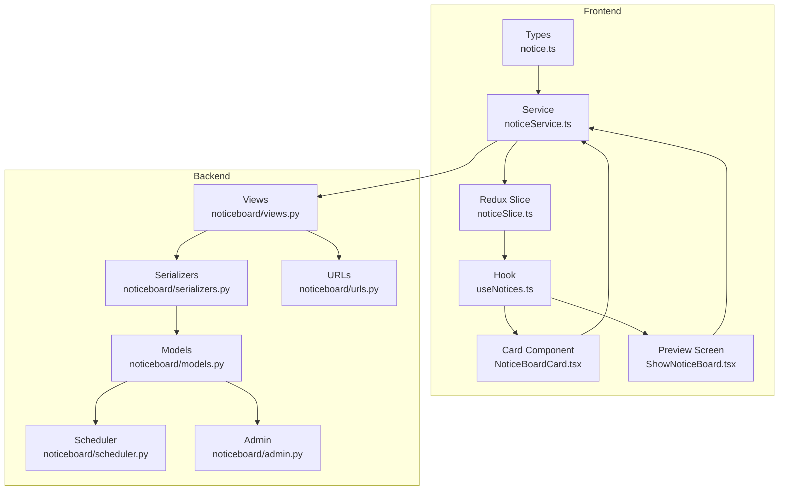
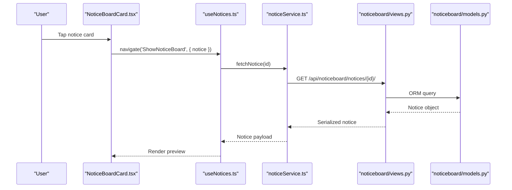
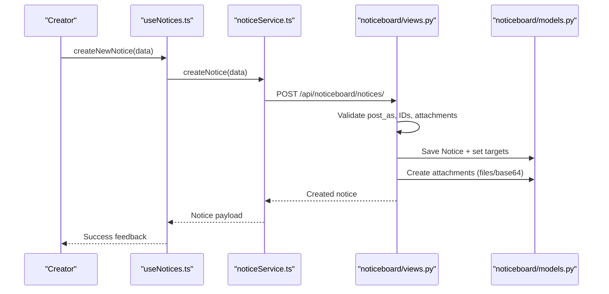
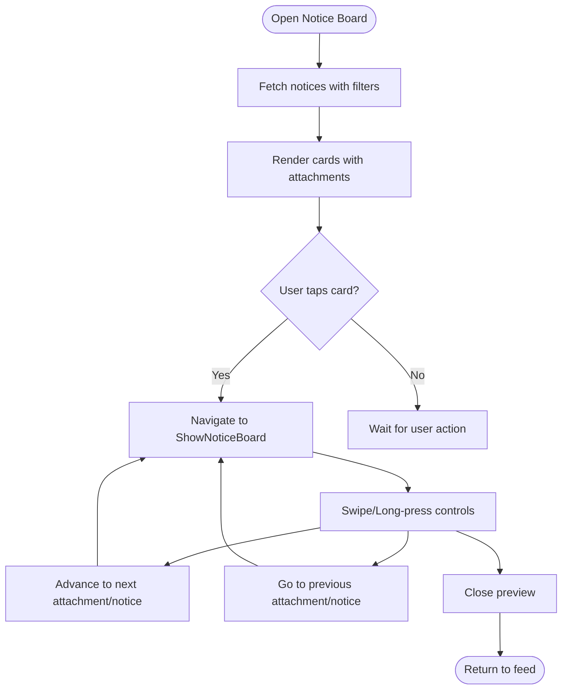
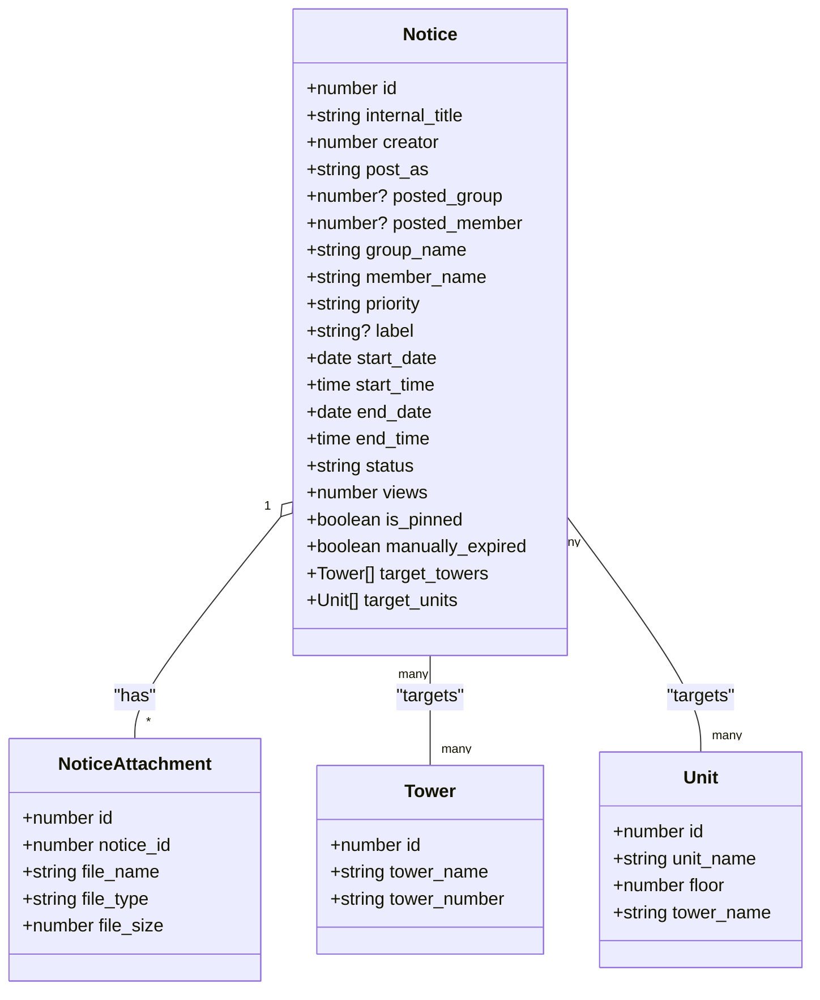
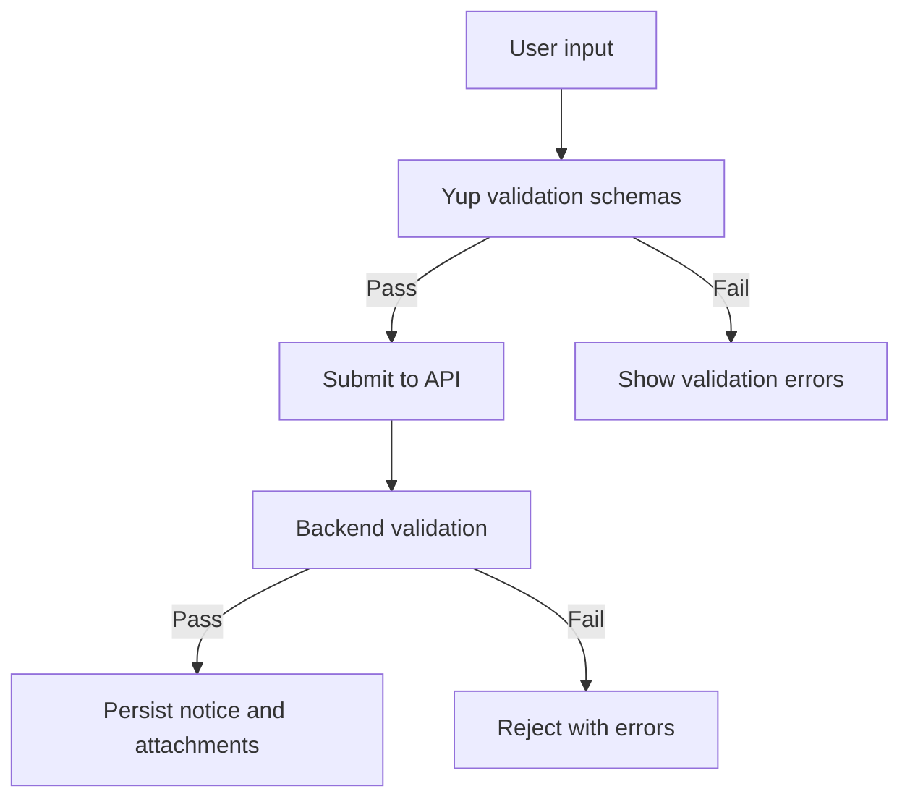
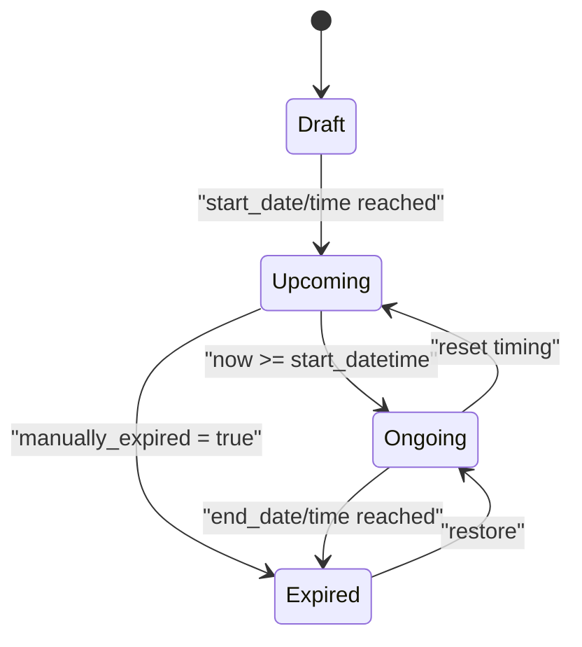
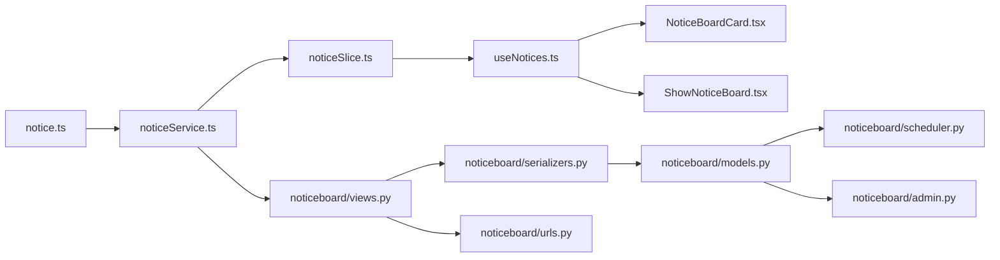

# Notice Board

<cite>
**Referenced Files in This Document**
- [notice.ts](file://Estate_link_App/src/types/notice.ts)
- [noticeService.ts](file://Estate_link_App/src/services/noticeService.ts)
- [useNotices.ts](file://Estate_link_App/src/hooks/useNotices.ts)
- [noticeSlice.ts](file://Estate_link_App/src/store/slices/noticeSlice.ts)
- [NoticeBoardCard.tsx](file://Estate_link_App/src/components/NoticeBoardCard.tsx)
- [ShowNoticeBoard.tsx](file://Estate_link_App/src/Features/NoticeBoardScreen/ShowNoticeBoard.tsx)
- [schemas.ts](file://Estate_link_App/src/validation/schemas.ts)
- [models.py](file://backend/noticeboard/models.py)
- [views.py](file://backend/noticeboard/views.py)
- [serializers.py](file://backend/noticeboard/serializers.py)
- [urls.py](file://backend/noticeboard/urls.py)
- [scheduler.py](file://backend/noticeboard/scheduler.py)
- [admin.py](file://backend/noticeboard/admin.py)
</cite>

## Table of Contents
1. [Introduction](#introduction)
2. [Project Structure](#project-structure)
3. [Core Components](#core-components)
4. [Architecture Overview](#architecture-overview)
5. [Detailed Component Analysis](#detailed-component-analysis)
6. [Dependency Analysis](#dependency-analysis)
7. [Performance Considerations](#performance-considerations)
8. [Troubleshooting Guide](#troubleshooting-guide)
9. [Conclusion](#conclusion)
10. [Appendices](#appendices)

## Introduction
This document describes the Notice Board system, covering creation and editing workflows, listing and preview interfaces, components for authoring and viewing, utilities for validation and formatting, and the approval/publication/archival lifecycle. It synthesizes frontend and backend implementations to provide a complete understanding of how notices are authored, distributed, and managed.

## Project Structure
The Notice Board spans both frontend and backend:
- Frontend (React Native): Types, services, Redux slices, hooks, UI components, and screens for listing and previewing notices.
- Backend (Django REST Framework): Models, serializers, views, URLs, scheduler, and admin configuration for notices and attachments.

**Diagram sources**
- [notice.ts](file://Estate_link_App/src/types/notice.ts#L24-L51)
- [noticeService.ts](file://Estate_link_App/src/services/noticeService.ts#L14-L376)
- [noticeSlice.ts](file://Estate_link_App/src/store/slices/noticeSlice.ts#L14-L320)
- [useNotices.ts](file://Estate_link_App/src/hooks/useNotices.ts#L24-L253)
- [NoticeBoardCard.tsx](file://Estate_link_App/src/components/NoticeBoardCard.tsx#L19-L251)
- [ShowNoticeBoard.tsx](file://Estate_link_App/src/Features/NoticeBoardScreen/ShowNoticeBoard.tsx#L28-L908)
- [models.py](file://backend/noticeboard/models.py#L10-L195)
- [serializers.py](file://backend/noticeboard/serializers.py#L107-L361)
- [views.py](file://backend/noticeboard/views.py#L32-L800)
- [urls.py](file://backend/noticeboard/urls.py#L1-L40)
- [scheduler.py](file://backend/noticeboard/scheduler.py#L13-L122)
- [admin.py](file://backend/noticeboard/admin.py#L17-L59)

**Section sources**
- [notice.ts](file://Estate_link_App/src/types/notice.ts#L24-L51)
- [noticeService.ts](file://Estate_link_App/src/services/noticeService.ts#L14-L376)
- [noticeSlice.ts](file://Estate_link_App/src/store/slices/noticeSlice.ts#L14-L320)
- [useNotices.ts](file://Estate_link_App/src/hooks/useNotices.ts#L24-L253)
- [NoticeBoardCard.tsx](file://Estate_link_App/src/components/NoticeBoardCard.tsx#L19-L251)
- [ShowNoticeBoard.tsx](file://Estate_link_App/src/Features/NoticeBoardScreen/ShowNoticeBoard.tsx#L28-L908)
- [models.py](file://backend/noticeboard/models.py#L10-L195)
- [serializers.py](file://backend/noticeboard/serializers.py#L107-L361)
- [views.py](file://backend/noticeboard/views.py#L32-L800)
- [urls.py](file://backend/noticeboard/urls.py#L1-L40)
- [scheduler.py](file://backend/noticeboard/scheduler.py#L13-L122)
- [admin.py](file://backend/noticeboard/admin.py#L17-L59)

## Core Components
- Types define the shape of notices, attachments, towers, units, filters, and state.
- Service encapsulates API interactions for listing, creating, updating, deleting, pinning, expiring, restoring, and status updates.
- Redux slice manages asynchronous actions, state, and UI filters.
- Hook exposes convenient functions to interact with notices and compute derived data.
- UI components render notice cards and a full-screen preview with gesture controls.
- Backend models define notice lifecycle, authoring, targeting, and status transitions.
- Serializers transform models to/from API representations and handle attachments and history.
- Views implement endpoints for CRUD, status management, and utilities.
- Scheduler automatically updates statuses and triggers notifications when notices become active.
- Admin provides management interfaces for notices, attachments, and history.

**Section sources**
- [notice.ts](file://Estate_link_App/src/types/notice.ts#L24-L104)
- [noticeService.ts](file://Estate_link_App/src/services/noticeService.ts#L14-L376)
- [noticeSlice.ts](file://Estate_link_App/src/store/slices/noticeSlice.ts#L14-L320)
- [useNotices.ts](file://Estate_link_App/src/hooks/useNotices.ts#L24-L253)
- [NoticeBoardCard.tsx](file://Estate_link_App/src/components/NoticeBoardCard.tsx#L19-L251)
- [ShowNoticeBoard.tsx](file://Estate_link_App/src/Features/NoticeBoardScreen/ShowNoticeBoard.tsx#L28-L908)
- [models.py](file://backend/noticeboard/models.py#L10-L195)
- [serializers.py](file://backend/noticeboard/serializers.py#L107-L361)
- [views.py](file://backend/noticeboard/views.py#L32-L800)
- [scheduler.py](file://backend/noticeboard/scheduler.py#L13-L122)
- [admin.py](file://backend/noticeboard/admin.py#L17-L59)

## Architecture Overview
The system follows a layered architecture:
- Frontend: React Native with Redux Toolkit for state management, Yup for validation, and native components for UI.
- Backend: Django REST Framework with explicit permissions, optimized serializers, and background scheduling.

**Diagram sources**
- [NoticeBoardCard.tsx](file://Estate_link_App/src/components/NoticeBoardCard.tsx#L76-L88)
- [useNotices.ts](file://Estate_link_App/src/hooks/useNotices.ts#L44-L50)
- [noticeService.ts](file://Estate_link_App/src/services/noticeService.ts#L118-L129)
- [views.py](file://backend/noticeboard/views.py#L404-L407)
- [models.py](file://backend/noticeboard/models.py#L10-L195)

## Detailed Component Analysis

### Notice Creation and Editing Workflows
- Creation supports multiple posting modes (creator, group, member), priority, labels, visibility windows, and attachments (files and base64).
- Editing allows updating timing, targets, labels, priority, and attachments, with history tracking for changes.
- Validation enforces file size/type limits and ID normalization for targets.

**Diagram sources**
- [useNotices.ts](file://Estate_link_App/src/hooks/useNotices.ts#L52-L58)
- [noticeService.ts](file://Estate_link_App/src/services/noticeService.ts#L132-L178)
- [views.py](file://backend/noticeboard/views.py#L142-L279)
- [models.py](file://backend/noticeboard/models.py#L10-L195)

**Section sources**
- [noticeService.ts](file://Estate_link_App/src/services/noticeService.ts#L132-L233)
- [views.py](file://backend/noticeboard/views.py#L142-L279)
- [serializers.py](file://backend/noticeboard/serializers.py#L107-L218)
- [models.py](file://backend/noticeboard/models.py#L10-L195)

### Notice Listing Interfaces and Preview Capabilities
- Listing supports filtering by status, search, priority, label, and author scope.
- Preview renders a fullscreen story-like experience with swipe gestures, long-press pause, and progress indicators.
- Cards display thumbnails for PDFs and images, with attachment counts and highlighting.

**Diagram sources**
- [ShowNoticeBoard.tsx](file://Estate_link_App/src/Features/NoticeBoardScreen/ShowNoticeBoard.tsx#L476-L564)
- [NoticeBoardCard.tsx](file://Estate_link_App/src/components/NoticeBoardCard.tsx#L164-L238)

**Section sources**
- [noticeService.ts](file://Estate_link_App/src/services/noticeService.ts#L16-L115)
- [useNotices.ts](file://Estate_link_App/src/hooks/useNotices.ts#L36-L42)
- [ShowNoticeBoard.tsx](file://Estate_link_App/src/Features/NoticeBoardScreen/ShowNoticeBoard.tsx#L28-L908)
- [NoticeBoardCard.tsx](file://Estate_link_App/src/components/NoticeBoardCard.tsx#L19-L251)

### Notice Components and Interactions
- Author information: creator, post_as, group/member names, photos via serializers.
- Detail modals: handled by navigation to the preview screen with full-featured controls.
- Label selectors: labels are stored as text; unique labels endpoint available.
- Priority management: four tiers mapped to backend choices.
- Targeting: towers and units via many-to-many relationships.

**Diagram sources**
- [notice.ts](file://Estate_link_App/src/types/notice.ts#L24-L51)
- [models.py](file://backend/noticeboard/models.py#L10-L195)

**Section sources**
- [notice.ts](file://Estate_link_App/src/types/notice.ts#L24-L51)
- [serializers.py](file://backend/noticeboard/serializers.py#L107-L361)
- [models.py](file://backend/noticeboard/models.py#L10-L195)

### Notice Utilities: Validation and Formatting
- Frontend validation schemas enforce word counts, label limits, attachment counts, and file size/type constraints.
- Backend enforces file size/type limits and normalizes target IDs from various input formats.

**Diagram sources**
- [schemas.ts](file://Estate_link_App/src/validation/schemas.ts#L226-L366)
- [views.py](file://backend/noticeboard/views.py#L281-L290)

**Section sources**
- [schemas.ts](file://Estate_link_App/src/validation/schemas.ts#L226-L366)
- [views.py](file://backend/noticeboard/views.py#L281-L290)

### Approval Workflow, Publication, and Archival Procedures
- Status lifecycle: draft → upcoming → ongoing → expired; expiration can be manual or automatic.
- Automatic status updates occur via scheduler when start time passes.
- Manual expiration and restoration endpoints allow administrative control.
- Notifications are triggered when notices transition from upcoming to ongoing.

**Diagram sources**
- [models.py](file://backend/noticeboard/models.py#L113-L146)
- [views.py](file://backend/noticeboard/views.py#L665-L690)
- [scheduler.py](file://backend/noticeboard/scheduler.py#L51-L102)

**Section sources**
- [models.py](file://backend/noticeboard/models.py#L113-L146)
- [views.py](file://backend/noticeboard/views.py#L665-L690)
- [scheduler.py](file://backend/noticeboard/scheduler.py#L51-L102)

### Compliance and Distribution Mechanisms
- Compliance: validation schemas constrain content length and attachment limits; backend validates file types and sizes.
- Distribution: notices target towers/units; status changes trigger notifications to recipients.

**Section sources**
- [schemas.ts](file://Estate_link_App/src/validation/schemas.ts#L226-L366)
- [views.py](file://backend/noticeboard/views.py#L281-L290)
- [models.py](file://backend/noticeboard/models.py#L147-L158)

## Dependency Analysis
The frontend depends on the backend through typed APIs and shared models. The backend enforces permissions and data integrity.

**Diagram sources**
- [notice.ts](file://Estate_link_App/src/types/notice.ts#L24-L104)
- [noticeService.ts](file://Estate_link_App/src/services/noticeService.ts#L14-L376)
- [noticeSlice.ts](file://Estate_link_App/src/store/slices/noticeSlice.ts#L14-L320)
- [useNotices.ts](file://Estate_link_App/src/hooks/useNotices.ts#L24-L253)
- [NoticeBoardCard.tsx](file://Estate_link_App/src/components/NoticeBoardCard.tsx#L19-L251)
- [ShowNoticeBoard.tsx](file://Estate_link_App/src/Features/NoticeBoardScreen/ShowNoticeBoard.tsx#L28-L908)
- [views.py](file://backend/noticeboard/views.py#L32-L800)
- [serializers.py](file://backend/noticeboard/serializers.py#L107-L361)
- [models.py](file://backend/noticeboard/models.py#L10-L195)
- [scheduler.py](file://backend/noticeboard/scheduler.py#L13-L122)
- [admin.py](file://backend/noticeboard/admin.py#L17-L59)
- [urls.py](file://backend/noticeboard/urls.py#L1-L40)

**Section sources**
- [notice.ts](file://Estate_link_App/src/types/notice.ts#L24-L104)
- [noticeService.ts](file://Estate_link_App/src/services/noticeService.ts#L14-L376)
- [noticeSlice.ts](file://Estate_link_App/src/store/slices/noticeSlice.ts#L14-L320)
- [useNotices.ts](file://Estate_link_App/src/hooks/useNotices.ts#L24-L253)
- [NoticeBoardCard.tsx](file://Estate_link_App/src/components/NoticeBoardCard.tsx#L19-L251)
- [ShowNoticeBoard.tsx](file://Estate_link_App/src/Features/NoticeBoardScreen/ShowNoticeBoard.tsx#L28-L908)
- [views.py](file://backend/noticeboard/views.py#L32-L800)
- [serializers.py](file://backend/noticeboard/serializers.py#L107-L361)
- [models.py](file://backend/noticeboard/models.py#L10-L195)
- [scheduler.py](file://backend/noticeboard/scheduler.py#L13-L122)
- [admin.py](file://backend/noticeboard/admin.py#L17-L59)
- [urls.py](file://backend/noticeboard/urls.py#L1-L40)

## Performance Considerations
- Frontend
  - Memoization and computed helpers minimize re-renders.
  - Lazy loading and pagination via server-side filters reduce payload sizes.
  - Optimized serializers prefetch related data to avoid N+1 queries.
- Backend
  - Select/prefetch related fields and limit results.
  - Indexes on frequently queried fields improve query performance.
  - Background scheduler runs at fixed intervals to avoid real-time overhead.

[No sources needed since this section provides general guidance]

## Troubleshooting Guide
- Permission errors: API returns 403 with detailed messages; frontend surfaces user-friendly errors.
- Validation failures: Both frontend and backend return structured error details; review field constraints.
- Status transitions: Use the status update endpoint to reconcile notices whose status did not change automatically.
- Attachment issues: Verify file size/type limits and ensure base64 format is correct.

**Section sources**
- [noticeService.ts](file://Estate_link_App/src/services/noticeService.ts#L42-L87)
- [views.py](file://backend/noticeboard/views.py#L245-L247)
- [noticeService.ts](file://Estate_link_App/src/services/noticeService.ts#L302-L313)

## Conclusion
The Notice Board system integrates robust frontend components with a secure, permissioned backend. It supports flexible creation/editing, precise targeting, rich previews, and automated lifecycle management. Compliance is enforced through validation and schema constraints, while distribution leverages status-driven notifications.

[No sources needed since this section summarizes without analyzing specific files]

## Appendices

### Official Notice Formatting and Compliance Checklist
- Title and description adhere to word limits.
- Priority and label chosen from allowed sets.
- Target towers/units selected; IDs normalized.
- Attachments within size/type limits; base64 properly formatted.
- Visibility window set appropriately; status transitions verified.

**Section sources**
- [schemas.ts](file://Estate_link_App/src/validation/schemas.ts#L226-L366)
- [views.py](file://backend/noticeboard/views.py#L281-L290)
- [serializers.py](file://backend/noticeboard/serializers.py#L107-L218)