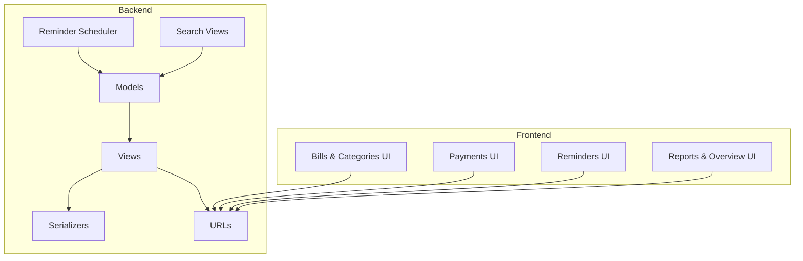
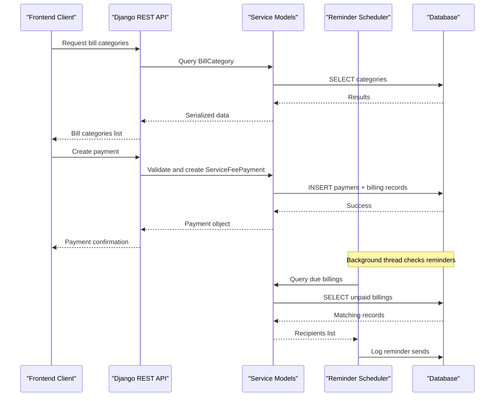
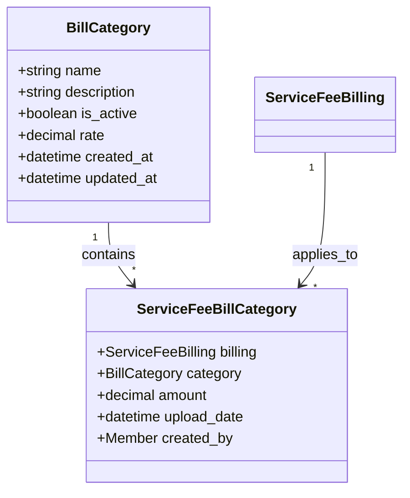
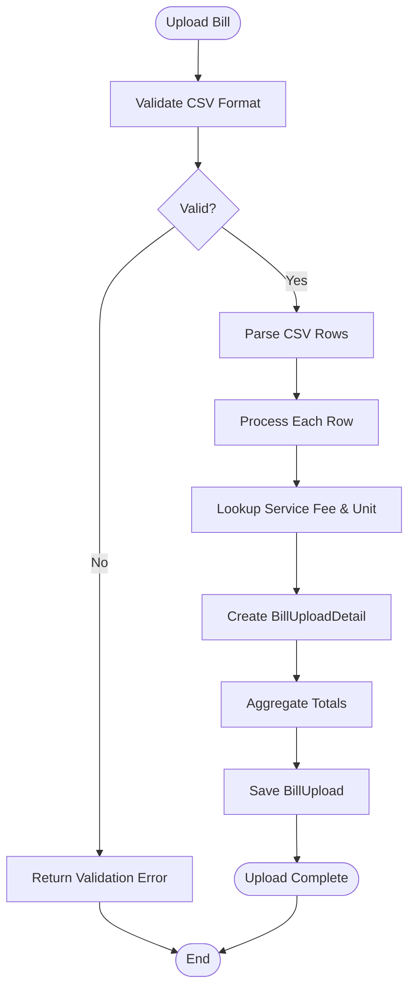
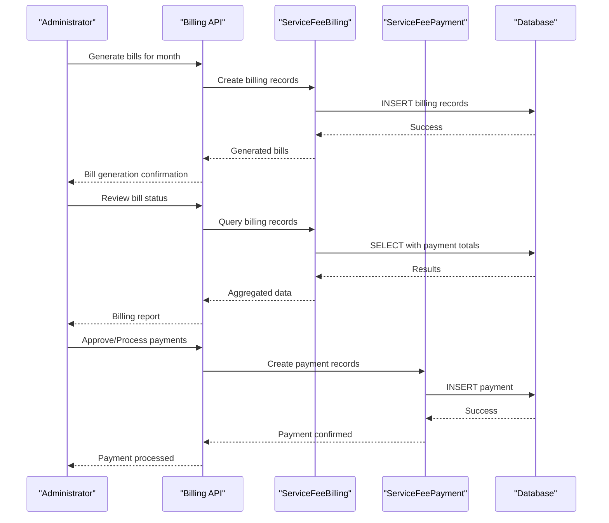
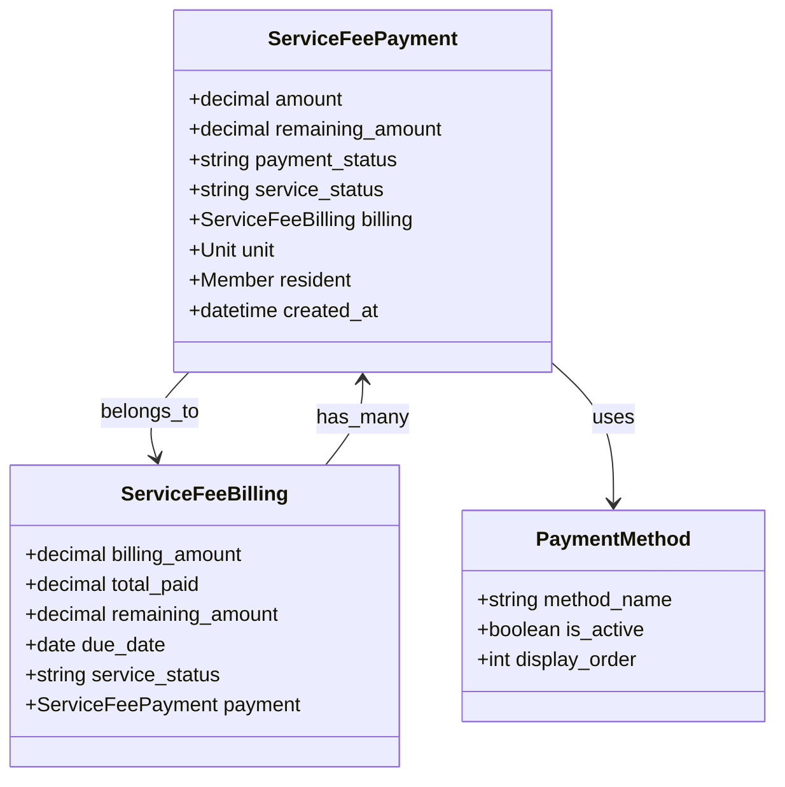
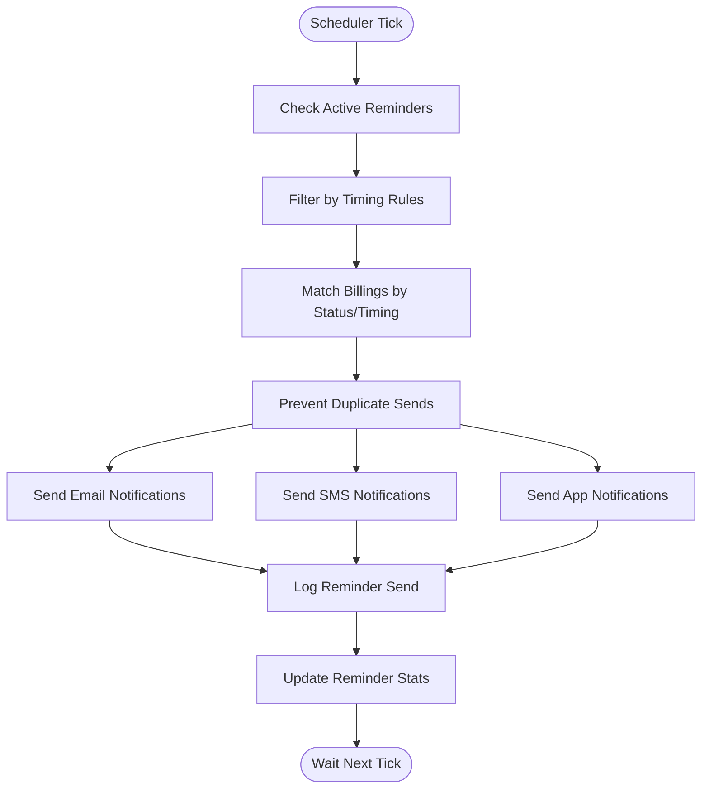
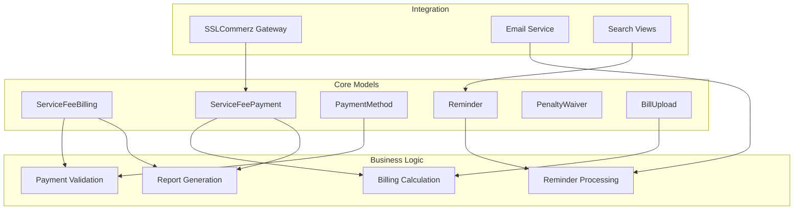

# Service Fee Management

<cite>
**Referenced Files in This Document**
- [models.py](file://backend/service_fee_management/models.py)
- [views.py](file://backend/service_fee_management/views.py)
- [serializers.py](file://backend/service_fee_management/serializers.py)
- [urls.py](file://backend/service_fee_management/urls.py)
- [reminder_scheduler.py](file://backend/service_fee_management/reminder_scheduler.py)
- [IMPLEMENTATION_SUMMARY.md](file://backend/service_fee_management/IMPLEMENTATION_SUMMARY.md)
- [QUICK_START.md](file://backend/service_fee_management/QUICK_START.md)
- [REMINDER_SCHEDULER_DOCS.md](file://backend/service_fee_management/REMINDER_SCHEDULER_DOCS.md)
- [search_views.py](file://backend/service_fee_management/search_views.py)
- [billCategoryService.js](file://frontend/src/Features/ServiceFeeManagement/BillCategories/services/billCategoryService.js)
- [paymentUtils.js](file://frontend/src/Features/ServiceFeeManagement/Payments/utils/paymentUtils.js)
- [paymentUtils.js](file://frontend/src/Features/ServiceFeeManagement/Overview/utils/paymentUtils.js)
</cite>

## Table of Contents
1. [Introduction](#introduction)
2. [Project Structure](#project-structure)
3. [Core Components](#core-components)
4. [Architecture Overview](#architecture-overview)
5. [Detailed Component Analysis](#detailed-component-analysis)
6. [Dependency Analysis](#dependency-analysis)
7. [Performance Considerations](#performance-considerations)
8. [Troubleshooting Guide](#troubleshooting-guide)
9. [Conclusion](#conclusion)

## Introduction
This document provides comprehensive documentation for the Service Fee Management system, covering bill categories management, bill uploads, billing generation and review, payment processing with partial payments and history tracking, automated reminder system, and reporting/analytics capabilities. The system integrates backend Django APIs with frontend React components to support property management workflows for service fee collection.

## Project Structure
The Service Fee Management system spans both backend and frontend layers:
- Backend: Django REST Framework APIs under `service_fee_management` app with models, views, serializers, URLs, scheduler, and utilities
- Frontend: React components and services under `ServiceFeeManagement` feature for bill categories, bill uploads, billing management, payments, reminders, reports, and overview

**Diagram sources**
- [models.py](file://backend/service_fee_management/models.py#L11-L800)
- [views.py](file://backend/service_fee_management/views.py#L1-L800)
- [serializers.py](file://backend/service_fee_management/serializers.py#L1-L800)
- [urls.py](file://backend/service_fee_management/urls.py#L1-L152)
- [reminder_scheduler.py](file://backend/service_fee_management/reminder_scheduler.py#L1-L473)
- [search_views.py](file://backend/service_fee_management/search_views.py#L1-L175)

**Section sources**
- [models.py](file://backend/service_fee_management/models.py#L1-L800)
- [views.py](file://backend/service_fee_management/views.py#L1-L800)
- [serializers.py](file://backend/service_fee_management/serializers.py#L1-L800)
- [urls.py](file://backend/service_fee_management/urls.py#L1-L152)

## Core Components
The system centers around several core models and workflows:

- ServiceFeeBilling: Represents monthly service fee charges with normalized payment tracking
- ServiceFeePayment: Individual payment transactions supporting multiple partial payments per month
- PaymentMethod: Defines available payment methods (Cash, bKash, Nagad, Rocket, Bank Transfer, SSLCommerz)
- Reminder: Automated reminder notifications with timing rules and audience targeting
- PenaltyWaiver: Records penalty waivers for billing periods
- BillUpload: Processes uploaded bills for additional service categories
- ServiceFeeGenerationSchedule: Configures automatic service fee generation schedules

Key workflows include:
- Bill category creation, editing, and deletion via dedicated endpoints
- Bill upload processing with CSV parsing and validation
- Billing generation with review and approval-like status tracking
- Payment recording with partial payments and payment history
- Automated reminder scheduling with duplicate prevention and logging
- Reporting and analytics through payment history and status dashboards

**Section sources**
- [models.py](file://backend/service_fee_management/models.py#L11-L800)
- [views.py](file://backend/service_fee_management/views.py#L1-L800)
- [serializers.py](file://backend/service_fee_management/serializers.py#L1-L800)

## Architecture Overview
The system follows a layered architecture with clear separation between data models, business logic, and presentation layers.

**Diagram sources**
- [models.py](file://backend/service_fee_management/models.py#L11-L800)
- [views.py](file://backend/service_fee_management/views.py#L1-L800)
- [reminder_scheduler.py](file://backend/service_fee_management/reminder_scheduler.py#L1-L473)

## Detailed Component Analysis

### Bill Categories Management
The bill categories system enables administrators to manage additional service categories beyond the base service fee:

**Diagram sources**
- [models.py](file://backend/service_fee_management/models.py#L1-L800)

Workflow:
- Create category: POST /api/bill-categories/ with category data
- Edit category: PUT /api/bill-categories/{id}/ with updated data
- Delete category: DELETE /api/bill-categories/{id}/ (soft-deleted via status toggle)
- Toggle status: PATCH /api/bill-categories/{id}/toggle-status/

Frontend integration:
- billCategoryService.js provides CRUD operations for bill categories
- Supports active-only filtering and bulk operations

**Section sources**
- [models.py](file://backend/service_fee_management/models.py#L1-L800)
- [billCategoryService.js](file://frontend/src/Features/ServiceFeeManagement/BillCategories/services/billCategoryService.js#L1-L119)

### Bill Upload Functionality
The bill upload system processes utility and service consumption bills:

**Diagram sources**
- [models.py](file://backend/service_fee_management/models.py#L1-L800)
- [serializers.py](file://backend/service_fee_management/serializers.py#L1-L800)

Key features:
- CSV parsing with validation rules
- Batch processing of multiple units
- Previous reading lookup for accurate consumption calculation
- Detailed error reporting for invalid rows
- Integration with bill categories for additional charges

**Section sources**
- [models.py](file://backend/service_fee_management/models.py#L1-L800)
- [serializers.py](file://backend/service_fee_management/serializers.py#L1-L800)

### Billing Management System
The billing system manages monthly service fee generation and payment tracking:

**Diagram sources**
- [models.py](file://backend/service_fee_management/models.py#L11-L800)
- [views.py](file://backend/service_fee_management/views.py#L1-L800)

Core capabilities:
- Monthly billing generation with configurable due dates
- Payment aggregation and status calculation
- Partial payment support with remaining amount tracking
- Penalty calculation and waiver management
- Multi-month payment distribution

**Section sources**
- [models.py](file://backend/service_fee_management/models.py#L11-L800)
- [views.py](file://backend/service_fee_management/views.py#L1-L800)

### Payment Processing System
The payment processing system handles various payment methods and partial payments:

**Diagram sources**
- [models.py](file://backend/service_fee_management/models.py#L11-L800)
- [serializers.py](file://backend/service_fee_management/serializers.py#L1-L800)

Payment workflow:
- Validate payment eligibility against remaining balance
- Support multiple partial payments per billing period
- Automatic service status calculation (Due/Partial/Paid/Overdue)
- Payment method tracking with detailed transaction information
- Receipt and transaction ID generation

**Section sources**
- [models.py](file://backend/service_fee_management/models.py#L11-L800)
- [serializers.py](file://backend/service_fee_management/serializers.py#L1-L800)

### Reminder System
The automated reminder system sends timely notifications via email, SMS, and app notifications:

**Diagram sources**
- [reminder_scheduler.py](file://backend/service_fee_management/reminder_scheduler.py#L1-L473)
- [models.py](file://backend/service_fee_management/models.py#L342-L800)

Key features:
- Configurable timing rules (before/after due dates, specific days)
- Audience targeting (All Towers, Specific Units, Overdue Only, etc.)
- Duplicate prevention using ReminderLog table
- Asynchronous email sending with threading
- Comprehensive logging and statistics tracking

**Section sources**
- [reminder_scheduler.py](file://backend/service_fee_management/reminder_scheduler.py#L1-L473)
- [models.py](file://backend/service_fee_management/models.py#L342-L800)

### Reporting and Analytics
The system provides comprehensive reporting capabilities:

- Payment history tracking with detailed filters
- Service fee monitoring dashboard
- Unit receivables tracking
- Payment method analytics
- Overdue account reporting
- Export functionality (CSV, Excel)

Frontend utilities:
- Status badge rendering for payment and service status
- Currency formatting and data export
- Bulk reminder sending capabilities
- Mock data for development and testing

**Section sources**
- [paymentUtils.js](file://frontend/src/Features/ServiceFeeManagement/Payments/utils/paymentUtils.js#L1-L311)
- [paymentUtils.js](file://frontend/src/Features/ServiceFeeManagement/Overview/utils/paymentUtils.js#L1-L312)

## Dependency Analysis
The system exhibits clear separation of concerns with well-defined dependencies:

**Diagram sources**
- [models.py](file://backend/service_fee_management/models.py#L11-L800)
- [views.py](file://backend/service_fee_management/views.py#L1-L800)
- [reminder_scheduler.py](file://backend/service_fee_management/reminder_scheduler.py#L1-L473)

**Section sources**
- [models.py](file://backend/service_fee_management/models.py#L11-L800)
- [views.py](file://backend/service_fee_management/views.py#L1-L800)

## Performance Considerations
The system is designed for scalability and performance:

- Database optimization through raw SQL queries and proper indexing
- Background threading for non-blocking operations
- Efficient payment aggregation using database-level calculations
- Caching strategies for frequently accessed data
- Asynchronous email processing to prevent request timeouts
- Pagination and filtering for large datasets

## Troubleshooting Guide
Common issues and resolutions:

**Reminder System Issues:**
- Scheduler not starting: Check Django startup logs for scheduler initialization
- No emails sent: Verify email configuration and unit contact information
- Duplicate emails: Check ReminderLog table for existing entries
- Timing mismatches: Validate billing due dates against reminder rules

**Payment Processing Issues:**
- Payment validation errors: Review remaining balance calculations
- Partial payment conflicts: Check for recent duplicate payments
- Overpayment attempts: System prevents exceeding billing amounts
- SSLCommerz integration: Verify callback URLs and IPN configuration

**Performance Issues:**
- Slow API responses: Check database query execution plans
- Memory leaks: Monitor background thread resource usage
- Email delivery failures: Review SMTP configuration and rate limits

**Section sources**
- [IMPLEMENTATION_SUMMARY.md](file://backend/service_fee_management/IMPLEMENTATION_SUMMARY.md#L410-L485)
- [QUICK_START.md](file://backend/service_fee_management/QUICK_START.md#L180-L253)

## Conclusion
The Service Fee Management system provides a comprehensive solution for property management organizations to handle service fee collections efficiently. Its modular architecture, automated workflows, and robust reporting capabilities make it suitable for both small and large-scale property management needs. The system's emphasis on automation, validation, and audit trails ensures reliable operations while maintaining flexibility for customization and growth.