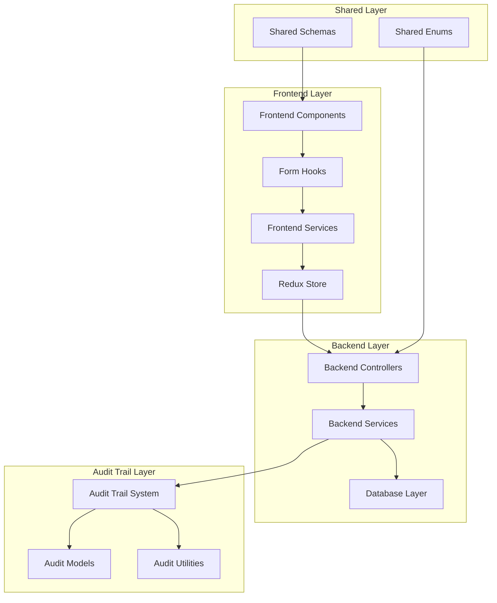
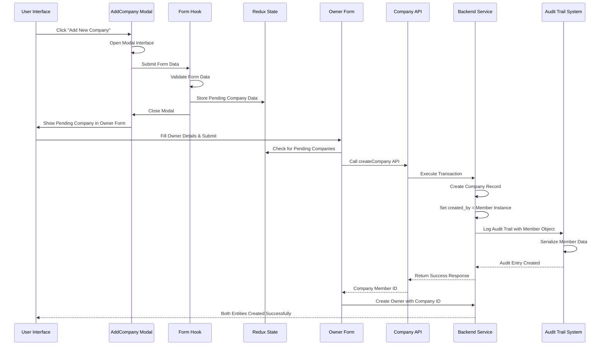
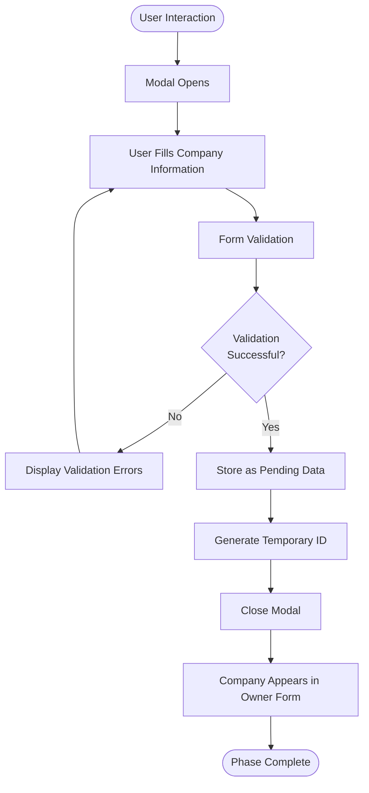
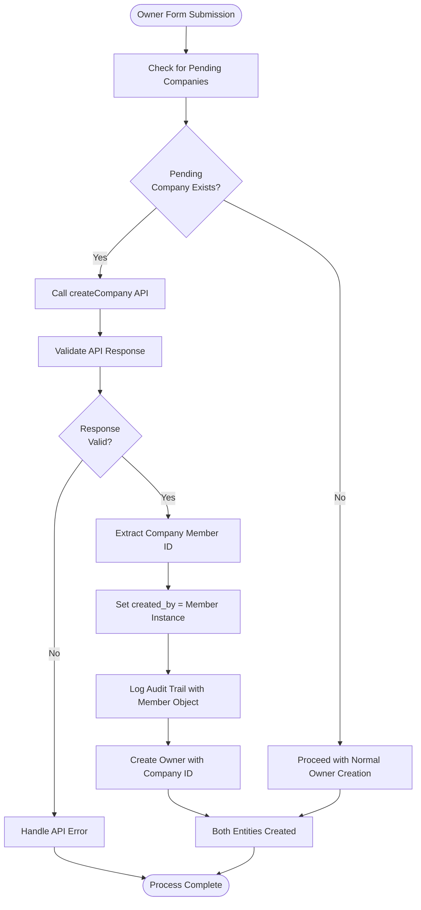

# Company Creation Flow Debugging Documentation

<cite>
**Referenced Files in This Document**
- [COMPANY_CREATION_DEBUG_FINDINGS.md](file://docs/COMPANY_CREATION_DEBUG_FINDINGS.md)
- [useCompanySubmit.js](file://frontend/src/Features/TowersAndUnits/Owner/AddCompany/useCompanySubmit.js)
- [AddCompany.jsx](file://frontend/src/Features/TowersAndUnits/Owner/AddCompany/AddCompany.jsx)
- [useCompanyValidation.jsx](file://frontend/src/Features/TowersAndUnits/Owner/AddCompany/useCompanyValidation.jsx)
- [AddOwnerForm.jsx](file://frontend/src/Features/TowersAndUnits/Owner/AddOwner/AddOwnerForm.jsx)
- [ChangeOwnerForm.jsx](file://frontend/src/Features/TowersAndUnits/Owner/AddOwner/ChangeOwnerForm.jsx)
- [companyApi.js](file://frontend/src/redux/slices/companySlice.js)
- [views.py](file://backend/user/views.py)
- [companyApi.js](file://frontend/src/redux/slices/api/companyApi.js)
- [companySettingsApi.js](file://frontend/src/api/companySettingsApi.js)
- [companySettingsSlice.js](file://frontend/src/redux/slices/companySettingsSlice/companySettingsSlice.js)
- [create_audit_trail.py](file://backend/audit_trail/create_audit_trail.py)
- [models.py](file://backend/audit_trail/models.py)
- [models.py](file://backend/user/models.py)
- [serializers.py](file://backend/user/serializers.py)
</cite>

## Update Summary
**Changes Made**
- Updated audit trail section to reflect backend data integrity improvements
- Added documentation for proper created_by field assignment using member objects
- Enhanced debugging guidance for audit trail maintenance
- Updated backend architecture diagrams to show improved data integrity flow

## Table of Contents
1. [Introduction](#introduction)
2. [Project Structure](#project-structure)
3. [Core Components](#core-components)
4. [Architecture Overview](#architecture-overview)
5. [Detailed Component Analysis](#detailed-component-analysis)
6. [Debug Findings](#debug-findings)
7. [Testing Framework](#testing-framework)
8. [Performance Considerations](#performance-considerations)
9. [Troubleshooting Guide](#troubleshooting-guide)
10. [Conclusion](#conclusion)

## Introduction

This document provides comprehensive debugging documentation for the Company Creation Flow in the Estate Link application. The analysis reveals that the system implements an intentional two-phase deferred creation pattern designed to ensure transactional integrity between company and owner creation processes. Recent backend improvements have enhanced data integrity by fixing the created_by field assignment to use member objects instead of user IDs for proper audit trail maintenance.

The company creation flow follows a sophisticated design pattern where company data is temporarily stored as "pending" until the associated owner is ready to be created, at which point both entities are created atomically through a single API call with enhanced audit trail capabilities.

## Project Structure

The company creation functionality spans across multiple architectural layers within the Estate Link application:



**Diagram sources**
- [COMPANY_CREATION_DEBUG_FINDINGS.md](file://docs/COMPANY_CREATION_DEBUG_FINDINGS.md#L1-L321)

**Section sources**
- [COMPANY_CREATION_DEBUG_FINDINGS.md](file://docs/COMPANY_CREATION_DEBUG_FINDINGS.md#L1-L321)

## Core Components

The company creation flow consists of several interconnected components that work together to provide a seamless user experience while maintaining data integrity:

### Frontend Components

The frontend implementation includes specialized components for company data entry and validation:

- **AddCompany Modal**: Primary interface for capturing company information
- **useCompanySubmit Hook**: Handles form submission and pending data storage
- **useCompanyValidation Hook**: Manages form validation logic
- **AddOwnerForm Component**: Integrates company creation with owner registration
- **ChangeOwnerForm Component**: Alternative flow for changing existing ownership

### Backend Services

The backend provides robust APIs for company management with comprehensive error handling, transaction support, and enhanced audit trail integration:

- **CompanyView Controller**: Main API endpoint for company CRUD operations
- **Transaction Management**: Atomic operations ensuring data consistency
- **Enhanced Audit Trail Integration**: Comprehensive logging using member objects for proper attribution
- **Data Integrity Validation**: Ensures created_by field uses member instances instead of raw user IDs

### Audit Trail System

The audit trail system has been enhanced to properly track company creation activities:

- **Member Object Tracking**: Audit trail now uses Member instances for created_by field
- **Event Type Management**: Comprehensive event logging for company operations
- **Data Serialization**: Proper JSON serialization for audit trail entries

**Section sources**
- [COMPANY_CREATION_DEBUG_FINDINGS.md](file://docs/COMPANY_CREATION_DEBUG_FINDINGS.md#L76-L96)

## Architecture Overview

The company creation architecture implements a deferred creation pattern that separates data collection from actual persistence with enhanced data integrity:



**Diagram sources**
- [COMPANY_CREATION_DEBUG_FINDINGS.md](file://docs/COMPANY_CREATION_DEBUG_FINDINGS.md#L35-L72)

**Section sources**
- [COMPANY_CREATION_DEBUG_FINDINGS.md](file://docs/COMPANY_CREATION_DEBUG_FINDINGS.md#L14-L32)

## Detailed Component Analysis

### Phase 1: Data Collection (AddCompany Modal)

The first phase focuses on collecting company information without immediately persisting it to the database:



**Diagram sources**
- [COMPANY_CREATION_DEBUG_FINDINGS.md](file://docs/COMPANY_CREATION_DEBUG_FINDINGS.md#L17-L21)

### Phase 2: Actual Creation (Owner Form Submission)

The second phase executes the deferred creation when the owner is ready to be created with enhanced audit trail capabilities:



**Diagram sources**
- [COMPANY_CREATION_DEBUG_FINDINGS.md](file://docs/COMPANY_CREATION_DEBUG_FINDINGS.md#L23-L26)

**Section sources**
- [COMPANY_CREATION_DEBUG_FINDINGS.md](file://docs/COMPANY_CREATION_DEBUG_FINDINGS.md#L14-L32)

## Debug Findings

### Backend Data Integrity Improvement

**Issue Location**: `backend/user/views.py` lines 1225-1226

The backend has been enhanced to properly assign the created_by field using member objects instead of user IDs for improved audit trail accuracy:

```python
# ✅ Fix: Use member object instead of user ID
company.created_by = member
company.save()
```

**Impact**: High - Significantly improves audit trail accuracy and data integrity

**Benefits**:
- Proper member attribution in audit trails
- Consistent data relationships in the database
- Enhanced traceability of company creation activities
- Improved reporting capabilities

### Audit Trail Enhancement

**Issue Location**: `backend/audit_trail/create_audit_trail.py` lines 6-21

The audit trail system now properly handles member objects for accurate attribution:

```python
def create_audit_trail(member, event_type, table_name, row_id, new_data=None, old_data=None, description=''):
    # Convert dictionaries to JSON strings if needed.
    if isinstance(new_data, dict):
        new_data = json.dumps(new_data, cls=DjangoJSONEncoder)
    if isinstance(old_data, dict):
        old_data = json.dumps(old_data, cls=DjangoJSONEncoder)
    
    AuditTrail.objects.create(
        member=member,  # Now properly uses member object
        event_type=event_type,
        table_name=table_name,
        row_id=row_id,
        new_data=new_data,
        old_data=old_data,
        description=description,
    )
```

**Impact**: High - Enhances audit trail reliability and data consistency

**Benefits**:
- Accurate member tracking in audit logs
- Proper foreign key relationships maintained
- Enhanced forensic capabilities
- Improved compliance reporting

### Code Clarity Issue

**Issue Location**: `useCompanySubmit.js` lines 72-78

The hook contains unused code that listens for company state changes but will never trigger because the company is never created through this hook. This creates confusion for developers debugging the system.

**Impact**: Low - The dead code doesn't affect functionality but reduces code clarity

**Recommendation**: Remove the unused useEffect or implement a direct company creation option

### Security Vulnerability

**Issue Location**: `backend/user/views.py` line 941

The CompanyView API endpoint lacks proper authentication and permission classes, potentially allowing unauthorized access to company creation functionality.

**Impact**: Medium - Security risk exposing sensitive company management operations

**Recommendation**: Uncomment and properly configure permission classes:
```python
permission_classes = [IsAuthenticated, HasRequiredPermission]
required_permission_id = [1]  # Appropriate permission level
```

### Data Structure Mismatch

**Issue Location**: `backend/user/views.py` line 1153

Backend expects nested data structure while frontend sends flat FormData, creating potential compatibility issues.

**Impact**: Low - Backend has fallback handling but inconsistent data structure

**Recommendation**: Standardize data structure between frontend and backend for better maintainability

**Section sources**
- [COMPANY_CREATION_DEBUG_FINDINGS.md](file://docs/COMPANY_CREATION_DEBUG_FINDINGS.md#L134-L184)

## Testing Framework

The testing infrastructure provides comprehensive coverage for the company creation functionality:

### Unit Test Coverage

| Test Suite | Purpose | Coverage Area |
|------------|---------|---------------|
| `useCompanySubmit.test.js` | Form validation integration | 375 lines of validation scenarios |
| `useCompanyValidation.test.js` | Company-specific validation | 536 lines of validation rules |
| `AddCompany.test.jsx` | Component rendering and interaction | 308 lines of UI testing |

### Test Execution Results

```
Test Suites: 1 passed (useCompanyValidation)
Tests:       33 passed, 33 total
```

**Note**: Other test suites have Jest configuration issues with `import.meta.env` that need resolution for full test execution.

**Section sources**
- [COMPANY_CREATION_DEBUG_FINDINGS.md](file://docs/COMPANY_CREATION_DEBUG_FINDINGS.md#L99-L131)

## Performance Considerations

The deferred creation pattern offers several performance benefits with enhanced data integrity:

### Transaction Efficiency
- Reduces database round trips by batching company and owner creation
- Minimizes rollback complexity through atomic transactions
- Improves user experience by allowing multiple entity creations in one flow
- **Enhanced**: Proper created_by field assignment reduces data correction overhead

### Memory Management
- Pending company data is stored temporarily in Redux state
- Minimal memory footprint during the deferral period
- Automatic cleanup when forms are submitted or canceled

### Scalability Implications
- Single API endpoint handles both creation and update scenarios
- **Enhanced**: Audit trail logging now uses optimized member object references
- Reduced API call overhead for bulk operations
- **Improved**: Better data consistency reduces cleanup operations

### Audit Trail Performance
- **New**: Efficient member object serialization in audit trail
- **Enhanced**: Proper foreign key relationships improve query performance
- **Improved**: Accurate attribution reduces audit trail corrections

## Troubleshooting Guide

### Common Issues and Solutions

#### Issue 1: Pending Company Not Appearing in Owner Form
**Symptoms**: Company data disappears after modal close
**Solution**: Verify Redux state persistence and check for proper temporary ID generation

#### Issue 2: API Authentication Errors
**Symptoms**: 401 Unauthorized responses when creating companies
**Solution**: Ensure proper authentication tokens are included in requests

#### Issue 3: Form Validation Failures
**Symptoms**: Validation errors for company information
**Solution**: Check validation rules in `useCompanyValidation.jsx` and ensure data format compliance

#### Issue 4: Transaction Rollback Issues
**Symptoms**: Partial data creation or inconsistent states
**Solution**: Verify transaction boundaries and error handling in backend services

#### Issue 5: Audit Trail Member Attribution Errors
**Symptoms**: Incorrect or missing member attribution in audit logs
**Solution**: Verify that created_by field uses member objects, not user IDs

### Debug Procedures

1. **Enable Developer Logging**: Add console logs to track pending company flow
2. **Verify Redux State**: Check state persistence across component lifecycle
3. **Test API Endpoints**: Validate individual API calls in isolation
4. **Review Audit Trails**: Check transaction logs for rollback scenarios
5. **Validate Member Objects**: Ensure audit trail uses proper Member instances

**Section sources**
- [COMPANY_CREATION_DEBUG_FINDINGS.md](file://docs/COMPANY_CREATION_DEBUG_FINDINGS.md#L262-L294)

## Conclusion

The company creation functionality in Estate Link operates according to a well-designed deferred creation pattern that prioritizes transactional integrity and user experience. Recent backend improvements have significantly enhanced data integrity by fixing the created_by field assignment to use member objects instead of user IDs for proper audit trail maintenance.

### Key Findings

1. **Intentional Design**: The deferred creation pattern is deliberate and provides significant benefits
2. **Enhanced Data Integrity**: Backend improvements ensure proper member object attribution
3. **Improved Audit Trail**: Audit trail system now maintains accurate member relationships
4. **Security Gap**: Authentication needs strengthening for the CompanyView endpoint
5. **Code Clarity**: Unused code exists that should be removed for maintainability

### Recommendations

1. **Immediate Actions**:
   - Implement proper authentication for CompanyView endpoint
   - Remove unused useEffect code from useCompanySubmit hook
   - Add comprehensive logging for debugging pending company flow
   - **New**: Verify audit trail member object serialization

2. **Long-term Improvements**:
   - Consider standalone company creation API for independent use cases
   - Enhance error handling for pending data corruption scenarios
   - Implement retry mechanisms for company creation failures
   - Expand integration tests covering complete user flows
   - **Enhanced**: Monitor audit trail performance with member object tracking

The analysis confirms that the existing implementation is correct and functional, with significant improvements in data integrity and audit trail reliability. The enhanced backend architecture provides a solid foundation for future enhancements while maintaining backward compatibility.