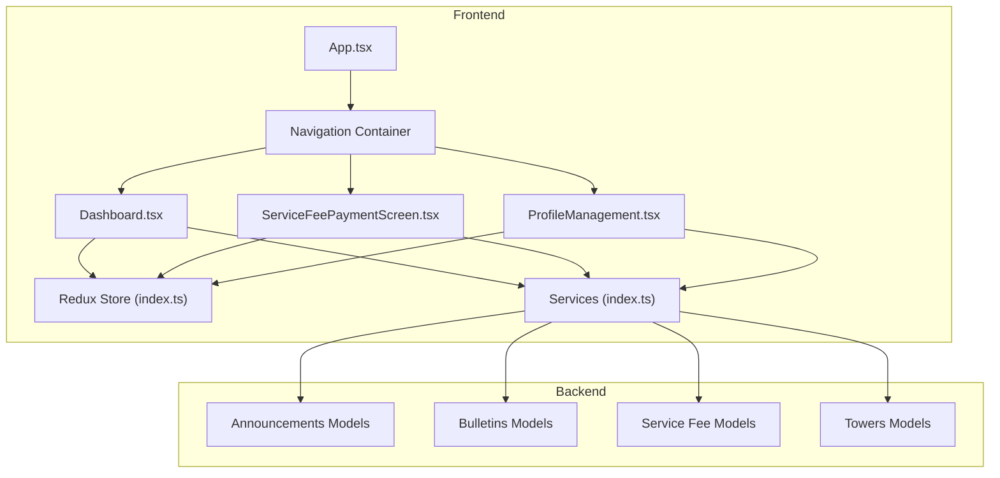
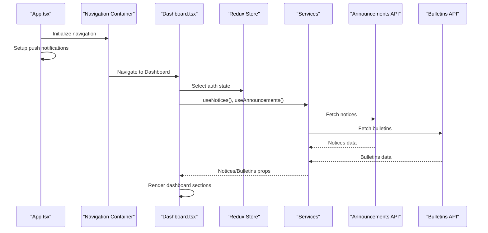
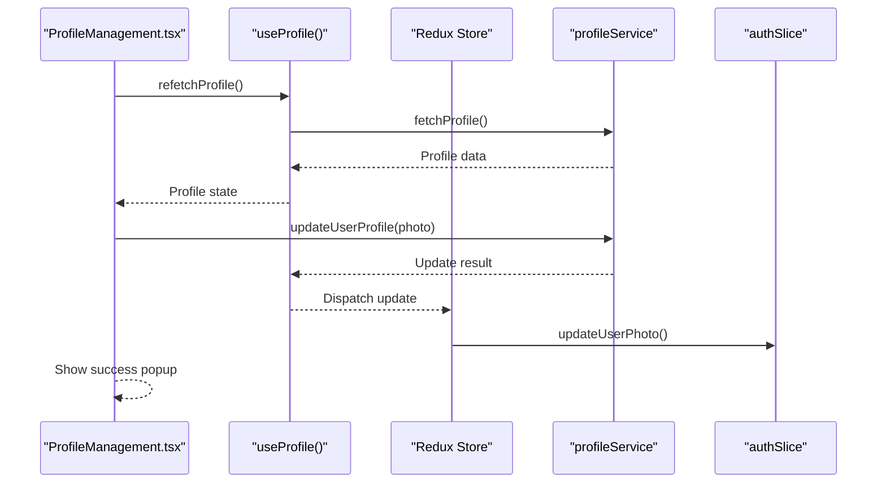
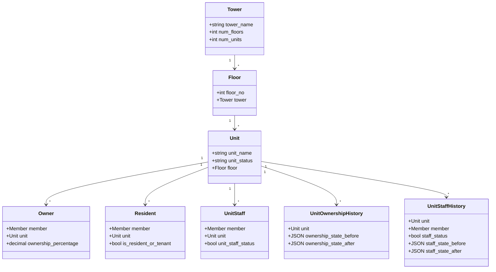
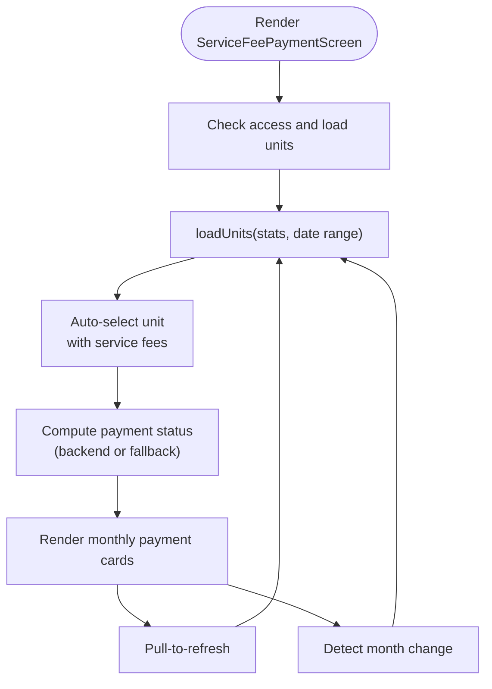
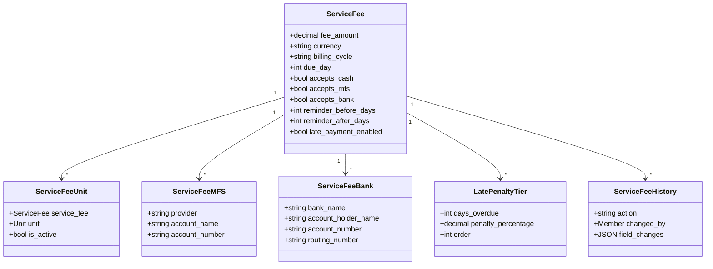
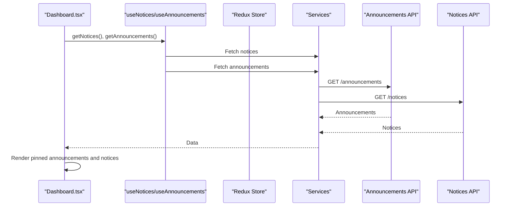
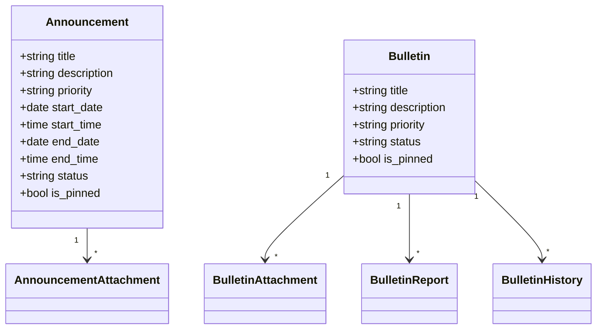
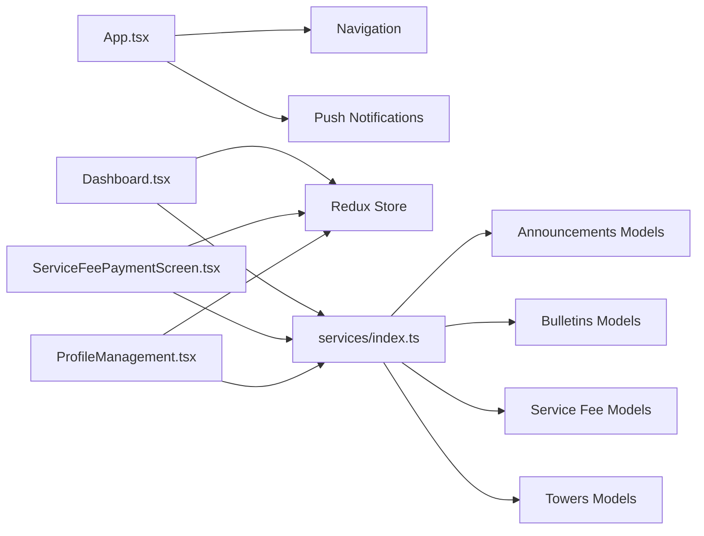

# Feature Modules

<cite>
**Referenced Files in This Document**
- [App.tsx](file://Estate_link_App/App.tsx)
- [Dashboard.tsx](file://Estate_link_App/src/Features/DashboardScreen/Dashboard.tsx)
- [ServiceFeePaymentScreen.tsx](file://Estate_link_App/src/Features/ServiceFeePayment/ServiceFeePaymentScreen.tsx)
- [ProfileManagement.tsx](file://Estate_link_App/src/Features/ProfileManagement/ProfileManagement.tsx)
- [index.ts (ServiceFeePayment)](file://Estate_link_App/src/Features/ServiceFeePayment/index.ts)
- [index.ts (BulletinScreen)](file://Estate_link_App/src/Features/BulletinScreen/index.ts)
- [index.ts (services)](file://Estate_link_App/src/services/index.ts)
- [index.ts (store)](file://Estate_link_App/src/store/index.ts)
- [models.py (service_fee)](file://backend/service_fee/models.py)
- [models.py (announcements)](file://backend/announcements/models.py)
- [models.py (bulletins)](file://backend/bulletins/models.py)
- [models.py (towers)](file://backend/towers/models.py)
</cite>

## Table of Contents
1. [Introduction](#introduction)
2. [Project Structure](#project-structure)
3. [Core Components](#core-components)
4. [Architecture Overview](#architecture-overview)
5. [Detailed Component Analysis](#detailed-component-analysis)
6. [Dependency Analysis](#dependency-analysis)
7. [Performance Considerations](#performance-considerations)
8. [Troubleshooting Guide](#troubleshooting-guide)
9. [Conclusion](#conclusion)

## Introduction
This document provides comprehensive documentation for the major feature modules within the Estate Link application. It focuses on user management, property management, financial management systems, and the communication portal components. The goal is to explain feature-specific data flows, component hierarchies, business logic implementation, integrations between modules, and shared services. It also includes examples of complex workflows, data visualization patterns, user interaction handling, and testing strategies grounded in the repository’s codebase.

## Project Structure
The application follows a hybrid architecture:
- Frontend (React Native) under Estate_link_App with feature modules, services, hooks, store, and components.
- Backend (Django) under backend with models, views, serializers, and management commands.

Key structural highlights:
- App.tsx orchestrates navigation, authentication monitoring, and push notification initialization.
- Feature modules are organized by domain (Dashboard, ServiceFeePayment, ProfileManagement, BulletinScreen).
- Shared services and store integrate with Redux for state management.
- Backend models define the canonical data structures for announcements, bulletins, service fees, and property units.

**Diagram sources**
- [App.tsx](file://Estate_link_App/App.tsx#L236-L413)
- [Dashboard.tsx](file://Estate_link_App/src/Features/DashboardScreen/Dashboard.tsx#L51-L800)
- [ServiceFeePaymentScreen.tsx](file://Estate_link_App/src/Features/ServiceFeePayment/ServiceFeePaymentScreen.tsx#L24-L800)
- [ProfileManagement.tsx](file://Estate_link_App/src/Features/ProfileManagement/ProfileManagement.tsx#L43-L800)
- [index.ts (store)](file://Estate_link_App/src/store/index.ts#L1-L79)
- [index.ts (services)](file://Estate_link_App/src/services/index.ts#L1-L5)
- [models.py (announcements)](file://backend/announcements/models.py#L11-L184)
- [models.py (bulletins)](file://backend/bulletins/models.py#L10-L166)
- [models.py (service_fee)](file://backend/service_fee/models.py#L10-L470)
- [models.py (towers)](file://backend/towers/models.py#L60-L1332)

**Section sources**
- [App.tsx](file://Estate_link_App/App.tsx#L118-L413)
- [index.ts (store)](file://Estate_link_App/src/store/index.ts#L1-L79)
- [index.ts (services)](file://Estate_link_App/src/services/index.ts#L1-L5)

## Core Components
- Dashboard: Aggregates notices, pinned announcements, and quick actions; enforces terms acceptance and handles push-notification-driven navigation.
- ServiceFeePayment: Manages unit selection, upcoming billings, payment status computation, and payment initiation.
- ProfileManagement: Displays and manages user profile, unit memberships, and identity documents.
- Communication Portal: Announcements and bulletins are surfaced via services and integrated into the dashboard feed.

**Section sources**
- [Dashboard.tsx](file://Estate_link_App/src/Features/DashboardScreen/Dashboard.tsx#L51-L800)
- [ServiceFeePaymentScreen.tsx](file://Estate_link_App/src/Features/ServiceFeePayment/ServiceFeePaymentScreen.tsx#L24-L800)
- [ProfileManagement.tsx](file://Estate_link_App/src/Features/ProfileManagement/ProfileManagement.tsx#L43-L800)
- [models.py (announcements)](file://backend/announcements/models.py#L11-L184)
- [models.py (bulletins)](file://backend/bulletins/models.py#L10-L166)

## Architecture Overview
The frontend integrates with backend services through typed hooks and Redux slices. Push notifications are initialized early in the app lifecycle and wired to navigation. The store persists authentication and company settings, while feature-specific slices manage announcements, notices, bulletins, profiles, and service fees.

**Diagram sources**
- [App.tsx](file://Estate_link_App/App.tsx#L149-L206)
- [Dashboard.tsx](file://Estate_link_App/src/Features/DashboardScreen/Dashboard.tsx#L104-L123)
- [index.ts (services)](file://Estate_link_App/src/services/index.ts#L1-L5)
- [index.ts (store)](file://Estate_link_App/src/store/index.ts#L1-L79)

## Detailed Component Analysis

### User Management Module
- ProfileManagement:
  - Loads profile data, unit relationships (owners/residents/staff), and supports photo upload/download.
  - Provides logout flow with confirmation modal and Redux state cleanup.
  - Uses hooks for profile fetching and updates, integrates with auth slice for photo updates.

**Diagram sources**
- [ProfileManagement.tsx](file://Estate_link_App/src/Features/ProfileManagement/ProfileManagement.tsx#L159-L367)
- [index.ts (store)](file://Estate_link_App/src/store/index.ts#L1-L79)

**Section sources**
- [ProfileManagement.tsx](file://Estate_link_App/src/Features/ProfileManagement/ProfileManagement.tsx#L43-L800)
- [index.ts (store)](file://Estate_link_App/src/store/index.ts#L1-L79)

### Property Management Module
- Towers and Units:
  - Models define towers, floors, units, ownership, residency, staff, and historical timelines.
  - Ownership history captures initial ownership, transfers, and attachment changes with JSON snapshots.
  - Unit staff history tracks assignments and status changes.

**Diagram sources**
- [models.py (towers)](file://backend/towers/models.py#L7-L1332)

**Section sources**
- [models.py (towers)](file://backend/towers/models.py#L60-L1332)

### Financial Management Systems
- ServiceFeePayment:
  - Computes payment status (paid/due/overdue/partial) from backend-provided fields or fallback calculations.
  - Manages unit selection, monthly billing lists, and upcoming billings.
  - Implements auto-refresh on month transitions and app foreground events.

**Diagram sources**
- [ServiceFeePaymentScreen.tsx](file://Estate_link_App/src/Features/ServiceFeePayment/ServiceFeePaymentScreen.tsx#L171-L393)

- Backend Service Fee Models:
  - ServiceFee: fee amount, currency, billing cycle, due day, payment methods, reminders, late penalties.
  - ServiceFeeUnit: soft-deletable assignment of units to fees.
  - MFS and Bank accounts for payment methods.
  - LatePenaltyTier and ServiceFeeHistory for auditability.

**Diagram sources**
- [models.py (service_fee)](file://backend/service_fee/models.py#L10-L470)

**Section sources**
- [ServiceFeePaymentScreen.tsx](file://Estate_link_App/src/Features/ServiceFeePayment/ServiceFeePaymentScreen.tsx#L24-L800)
- [models.py (service_fee)](file://backend/service_fee/models.py#L10-L470)

### Communication Portal Components
- Dashboard feed integration:
  - Dashboard renders pinned announcements and notices via dedicated hooks and components.
  - Handles push-notification-driven navigation and highlights specific notices.

**Diagram sources**
- [Dashboard.tsx](file://Estate_link_App/src/Features/DashboardScreen/Dashboard.tsx#L112-L123)
- [index.ts (services)](file://Estate_link_App/src/services/index.ts#L1-L5)

- Backend models:
  - Announcement: priority, visibility windows, audience targeting, status lifecycle.
  - Bulletin: priority, status lifecycle, attachments, reporting, and history.

**Diagram sources**
- [models.py (announcements)](file://backend/announcements/models.py#L11-L184)
- [models.py (bulletins)](file://backend/bulletins/models.py#L10-L166)

**Section sources**
- [Dashboard.tsx](file://Estate_link_App/src/Features/DashboardScreen/Dashboard.tsx#L51-L800)
- [models.py (announcements)](file://backend/announcements/models.py#L11-L184)
- [models.py (bulletins)](file://backend/bulletins/models.py#L10-L166)

## Dependency Analysis
- Frontend dependencies:
  - App.tsx depends on navigation, authentication monitor, and push notification service initialization.
  - Feature screens depend on Redux store slices and services.
  - Services index exports announcement, bulletin, notice, profile, and contact services.

**Diagram sources**
- [App.tsx](file://Estate_link_App/App.tsx#L149-L206)
- [Dashboard.tsx](file://Estate_link_App/src/Features/DashboardScreen/Dashboard.tsx#L51-L800)
- [ServiceFeePaymentScreen.tsx](file://Estate_link_App/src/Features/ServiceFeePayment/ServiceFeePaymentScreen.tsx#L24-L800)
- [ProfileManagement.tsx](file://Estate_link_App/src/Features/ProfileManagement/ProfileManagement.tsx#L43-L800)
- [index.ts (services)](file://Estate_link_App/src/services/index.ts#L1-L5)
- [index.ts (store)](file://Estate_link_App/src/store/index.ts#L1-L79)
- [models.py (announcements)](file://backend/announcements/models.py#L11-L184)
- [models.py (bulletins)](file://backend/bulletins/models.py#L10-L166)
- [models.py (service_fee)](file://backend/service_fee/models.py#L10-L470)
- [models.py (towers)](file://backend/towers/models.py#L60-L1332)

**Section sources**
- [index.ts (store)](file://Estate_link_App/src/store/index.ts#L1-L79)
- [index.ts (services)](file://Estate_link_App/src/services/index.ts#L1-L5)

## Performance Considerations
- Dashboard employs VirtualizedList and memoization to render pinned announcements and notices efficiently, reducing layout thrashing and improving scroll performance.
- ServiceFeePaymentScreen limits data to “current month only” and excludes future months to minimize payload sizes and rendering overhead.
- Auto-refresh mechanisms are throttled (e.g., periodic minute checks) to balance freshness with performance.

[No sources needed since this section provides general guidance]

## Troubleshooting Guide
- Terms acceptance enforcement:
  - Dashboard checks backend for terms acceptance on focus and redirects to Terms screen if not accepted.
- Push notification handling:
  - App initializes push notifications and registers listeners early; navigation ref is updated to route users upon notification taps.
- Profile photo upload/download:
  - ProfileManagement supports image picker permissions, upload via updateUserProfile, and downloads by opening image URLs in the browser.
- Service fee status computation:
  - Payment status prioritizes backend-provided service_status; falls back to due date and amounts if unavailable.

**Section sources**
- [Dashboard.tsx](file://Estate_link_App/src/Features/DashboardScreen/Dashboard.tsx#L62-L102)
- [App.tsx](file://Estate_link_App/App.tsx#L149-L206)
- [ProfileManagement.tsx](file://Estate_link_App/src/Features/ProfileManagement/ProfileManagement.tsx#L176-L367)
- [ServiceFeePaymentScreen.tsx](file://Estate_link_App/src/Features/ServiceFeePayment/ServiceFeePaymentScreen.tsx#L496-L601)

## Conclusion
The Estate Link application integrates user, property, financial, and communication features through a cohesive frontend-backend architecture. The dashboard aggregates real-time feeds, the service fee module computes and presents payment statuses, the profile module manages identities and documents, and the communication portal surfaces announcements and bulletins. Shared services and Redux enable scalable state management, while backend models enforce data integrity and auditability across modules.