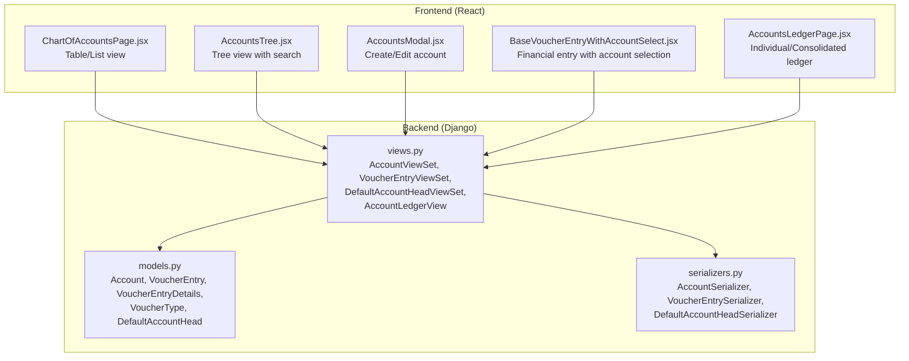
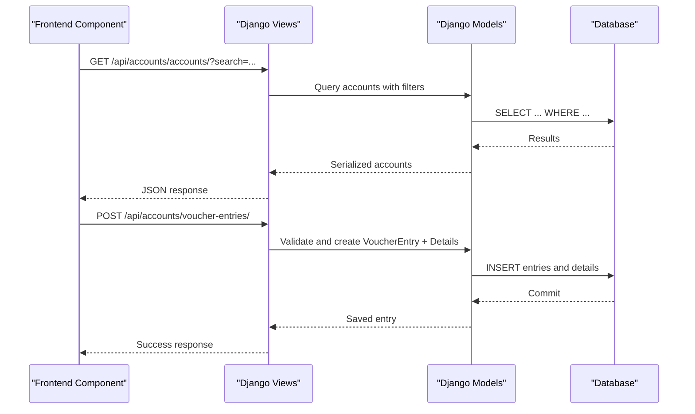
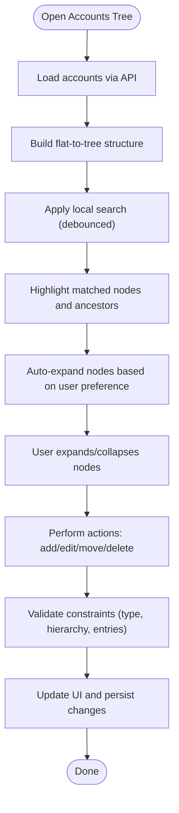
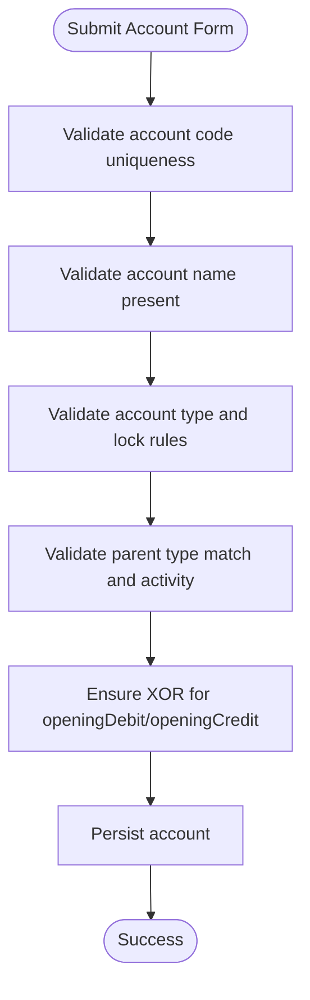
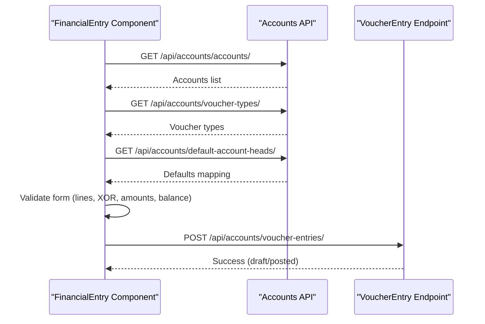
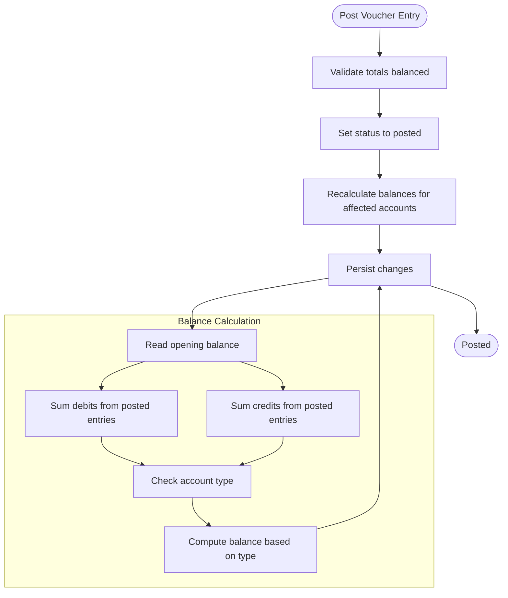
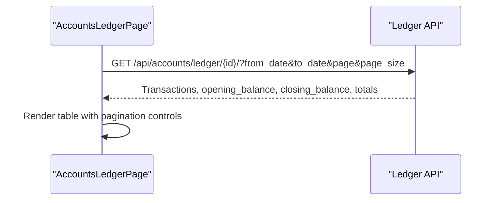
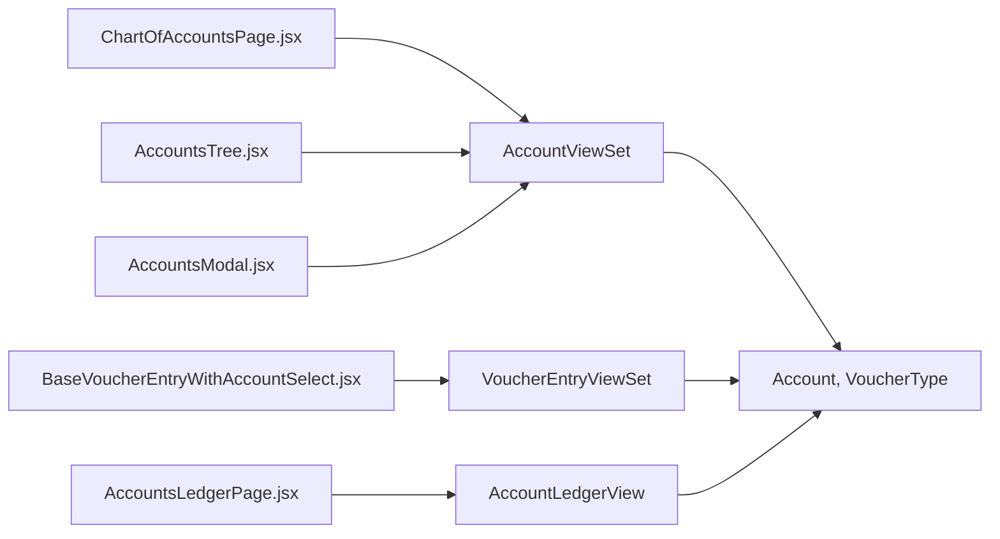

# Chart of Accounts Integration

<cite>
**Referenced Files in This Document**
- [models.py](file://backend/accounts/models.py)
- [views.py](file://backend/accounts/views.py)
- [serializers.py](file://backend/accounts/serializers.py)
- [ChartOfAccountsPage.jsx](file://frontend/src/Features/ChartOfAccounts/ChartOfAccountsPage.jsx)
- [AccountsTree.jsx](file://frontend/src/Features/ChartOfAccounts/components/AccountsTree.jsx)
- [AccountsModal.jsx](file://frontend/src/Features/ChartOfAccounts/components/AccountsModal.jsx)
- [BaseVoucherEntryWithAccountSelect.jsx](file://frontend/src/Features/FinancialEntry/BaseVoucherEntryWithAccountSelect.jsx)
- [AccountsLedgerPage.jsx](file://frontend/src/Features/AccountsLedger/AccountsLedgerPage.jsx)
</cite>

## Table of Contents
1. [Introduction](#introduction)
2. [Project Structure](#project-structure)
3. [Core Components](#core-components)
4. [Architecture Overview](#architecture-overview)
5. [Detailed Component Analysis](#detailed-component-analysis)
6. [Dependency Analysis](#dependency-analysis)
7. [Performance Considerations](#performance-considerations)
8. [Troubleshooting Guide](#troubleshooting-guide)
9. [Conclusion](#conclusion)

## Introduction
This document explains the chart of accounts integration within the financial entry system. It covers the account hierarchy structure, classification system, and how accounts are selected during financial entries. It documents the chart of accounts tree view, filtering capabilities, and dynamic loading. It also details ledger posting integration, account balance calculations, and financial report generation. Finally, it outlines validation rules, type restrictions, and proper classification for different transaction types, along with examples and maintenance procedures.

## Project Structure
The chart of accounts spans backend Django models and views, and frontend React components for display, selection, and entry creation.



**Diagram sources**
- [models.py](file://backend/accounts/models.py#L9-L410)
- [serializers.py](file://backend/accounts/serializers.py#L7-L513)
- [views.py](file://backend/accounts/views.py#L26-L800)
- [ChartOfAccountsPage.jsx](file://frontend/src/Features/ChartOfAccounts/ChartOfAccountsPage.jsx#L31-L756)
- [AccountsTree.jsx](file://frontend/src/Features/ChartOfAccounts/components/AccountsTree.jsx#L44-L955)
- [AccountsModal.jsx](file://frontend/src/Features/ChartOfAccounts/components/AccountsModal.jsx#L13-L892)
- [BaseVoucherEntryWithAccountSelect.jsx](file://frontend/src/Features/FinancialEntry/BaseVoucherEntryWithAccountSelect.jsx#L15-L712)
- [AccountsLedgerPage.jsx](file://frontend/src/Features/AccountsLedger/AccountsLedgerPage.jsx#L15-L429)

**Section sources**
- [models.py](file://backend/accounts/models.py#L9-L410)
- [views.py](file://backend/accounts/views.py#L26-L800)
- [ChartOfAccountsPage.jsx](file://frontend/src/Features/ChartOfAccounts/ChartOfAccountsPage.jsx#L31-L756)
- [AccountsTree.jsx](file://frontend/src/Features/ChartOfAccounts/components/AccountsTree.jsx#L44-L955)
- [AccountsModal.jsx](file://frontend/src/Features/ChartOfAccounts/components/AccountsModal.jsx#L13-L892)
- [BaseVoucherEntryWithAccountSelect.jsx](file://frontend/src/Features/FinancialEntry/BaseVoucherEntryWithAccountSelect.jsx#L15-L712)
- [AccountsLedgerPage.jsx](file://frontend/src/Features/AccountsLedger/AccountsLedgerPage.jsx#L15-L429)

## Core Components
- Backend models define the account hierarchy, classification, and financial posting structure.
- Serializers validate and transform data for API endpoints.
- Views expose CRUD and specialized operations for accounts, vouchers, and ledgers.
- Frontend components render the chart of accounts, enable selection, and integrate with financial entries and reporting.

Key backend models:
- Account: hierarchical chart of accounts with classification and balance tracking.
- VoucherEntry/VoucherEntryDetails: standardized journal entries with debits/credits.
- VoucherType: receipt, payment, journal, contra.
- DefaultAccountHead: configurable default mapping for transaction types.

Key frontend components:
- Chart of Accounts page: table/tree views with search and actions.
- Accounts tree: searchable hierarchical view with expand/collapse and move operations.
- Accounts modal: create/edit account with validation and parent selection.
- Financial entry: uses AccountHeadSelect for account selection and enforces validation rules.
- Accounts ledger: individual and consolidated ledger reports.

**Section sources**
- [models.py](file://backend/accounts/models.py#L9-L410)
- [serializers.py](file://backend/accounts/serializers.py#L7-L513)
- [views.py](file://backend/accounts/views.py#L26-L800)
- [ChartOfAccountsPage.jsx](file://frontend/src/Features/ChartOfAccounts/ChartOfAccountsPage.jsx#L31-L756)
- [AccountsTree.jsx](file://frontend/src/Features/ChartOfAccounts/components/AccountsTree.jsx#L44-L955)
- [AccountsModal.jsx](file://frontend/src/Features/ChartOfAccounts/components/AccountsModal.jsx#L13-L892)
- [BaseVoucherEntryWithAccountSelect.jsx](file://frontend/src/Features/FinancialEntry/BaseVoucherEntryWithAccountSelect.jsx#L15-L712)
- [AccountsLedgerPage.jsx](file://frontend/src/Features/AccountsLedger/AccountsLedgerPage.jsx#L15-L429)

## Architecture Overview
The system follows a layered architecture:
- Data layer: Django ORM models encapsulate business rules and validations.
- API layer: ViewSets and custom views expose endpoints for accounts, vouchers, defaults, and ledgers.
- Presentation layer: React components consume the API, manage state, and render UI.



**Diagram sources**
- [views.py](file://backend/accounts/views.py#L26-L800)
- [models.py](file://backend/accounts/models.py#L9-L410)
- [BaseVoucherEntryWithAccountSelect.jsx](file://frontend/src/Features/FinancialEntry/BaseVoucherEntryWithAccountSelect.jsx#L349-L372)

**Section sources**
- [views.py](file://backend/accounts/views.py#L26-L800)
- [models.py](file://backend/accounts/models.py#L9-L410)
- [BaseVoucherEntryWithAccountSelect.jsx](file://frontend/src/Features/FinancialEntry/BaseVoucherEntryWithAccountSelect.jsx#L349-L372)

## Detailed Component Analysis

### Account Hierarchy and Classification
- Hierarchical structure: Each account can have a parent, forming a tree. Children must match the parent’s account type.
- Classification: Five types—Asset, Liability, Equity, Revenue, Expense—dictate normal balance direction and calculation.
- Balance tracking: Opening balances and running totals are maintained per account; balances update on posted entries.

```mermaid
classDiagram
class Account {
+string accountCode
+string accountName
+string description
+enum accountType
+Account parentAccount
+decimal currentBalance
+decimal openingBalance
+date openingBalanceDate
+decimal openingDebit
+decimal openingCredit
+boolean isActive
+boolean isSystemAccount
+boolean hasSubAccounts
+recalculate_balance()
}
class VoucherEntry {
+string voucherNumber
+date entryDate
+string referenceNumber
+string narration
+VoucherType voucherType
+enum status
+decimal totalDebit
+decimal totalCredit
+calculate_totals()
}
class VoucherEntryDetails {
+integer lineNumber
+Account account
+string description
+decimal debitAmount
+decimal creditAmount
}
class VoucherType {
+enum name
+string displayName
+string prefix
}
class DefaultAccountHead {
+string transactionType
+enum defaultEntryType
+string customLabel
+Account defaultAccount
+boolean isActive
}
Account "1" o-- "*" Account : "parent/subAccounts"
Account "1" <-- "*" VoucherEntryDetails : "references"
VoucherEntry "1" "1" --> "*" VoucherEntryDetails : "has"
VoucherEntry "1" --> "1" VoucherType : "typed by"
```

**Diagram sources**
- [models.py](file://backend/accounts/models.py#L9-L410)

**Section sources**
- [models.py](file://backend/accounts/models.py#L9-L410)

### Chart of Accounts Tree View and Filtering
- Tree rendering: The tree component builds a hierarchy from flat account lists and supports expand/collapse, search, and filtering.
- Search: Local debounced search highlights matched nodes and shows ancestors/descendants.
- Actions: Add sub-account, edit, move, delete with safety checks (no sub-accounts, no voucher entries, not default account head).
- Move operation: Restricts parent selection to same account type and disallows moving into descendants.



**Diagram sources**
- [AccountsTree.jsx](file://frontend/src/Features/ChartOfAccounts/components/AccountsTree.jsx#L92-L227)
- [AccountsTree.jsx](file://frontend/src/Features/ChartOfAccounts/components/AccountsTree.jsx#L331-L346)

**Section sources**
- [AccountsTree.jsx](file://frontend/src/Features/ChartOfAccounts/components/AccountsTree.jsx#L92-L227)
- [AccountsTree.jsx](file://frontend/src/Features/ChartOfAccounts/components/AccountsTree.jsx#L331-L346)

### Account Maintenance and Validation
- Create/Edit: Modal validates account code uniqueness, name presence, type validity, XOR opening debit/credit, parent type matching, and prevents changes to accounts with entries or default mappings.
- Parent selection: Only accounts of the same type are eligible; parent must be active; cannot be self.
- Deletion: Enforced safety checks—no sub-accounts, no voucher entries, not used as default account head.



**Diagram sources**
- [AccountsModal.jsx](file://frontend/src/Features/ChartOfAccounts/components/AccountsModal.jsx#L193-L242)
- [serializers.py](file://backend/accounts/serializers.py#L39-L215)

**Section sources**
- [AccountsModal.jsx](file://frontend/src/Features/ChartOfAccounts/components/AccountsModal.jsx#L193-L242)
- [serializers.py](file://backend/accounts/serializers.py#L39-L215)

### Financial Entry Integration and Account Selection
- Financial entry uses a dedicated account selector component integrated into the base voucher entry form.
- The form loads accounts, voucher types, and default account heads, enabling intelligent prepopulation of debit/credit based on configured defaults.
- Validation enforces:
  - At least two lines (debit and credit).
  - XOR for each line (debit or credit).
  - Positive amounts only.
  - Balanced entry before posting.
  - Prevents same account appearing on both debit and credit sides.



**Diagram sources**
- [BaseVoucherEntryWithAccountSelect.jsx](file://frontend/src/Features/FinancialEntry/BaseVoucherEntryWithAccountSelect.jsx#L67-L75)
- [BaseVoucherEntryWithAccountSelect.jsx](file://frontend/src/Features/FinancialEntry/BaseVoucherEntryWithAccountSelect.jsx#L113-L139)
- [BaseVoucherEntryWithAccountSelect.jsx](file://frontend/src/Features/FinancialEntry/BaseVoucherEntryWithAccountSelect.jsx#L224-L314)
- [BaseVoucherEntryWithAccountSelect.jsx](file://frontend/src/Features/FinancialEntry/BaseVoucherEntryWithAccountSelect.jsx#L349-L372)

**Section sources**
- [BaseVoucherEntryWithAccountSelect.jsx](file://frontend/src/Features/FinancialEntry/BaseVoucherEntryWithAccountSelect.jsx#L67-L75)
- [BaseVoucherEntryWithAccountSelect.jsx](file://frontend/src/Features/FinancialEntry/BaseVoucherEntryWithAccountSelect.jsx#L113-L139)
- [BaseVoucherEntryWithAccountSelect.jsx](file://frontend/src/Features/FinancialEntry/BaseVoucherEntryWithAccountSelect.jsx#L224-L314)
- [BaseVoucherEntryWithAccountSelect.jsx](file://frontend/src/Features/FinancialEntry/BaseVoucherEntryWithAccountSelect.jsx#L349-L372)

### Ledger Posting Integration and Balance Calculation
- Posting a voucher entry sets status to posted, records postedBy/postedAt, and recalculates balances for all affected accounts.
- Balance calculation considers opening balance plus debits/credits depending on account type:
  - Debit accounts (Asset, Expense): Balance = Opening + Debits − Credits
  - Credit accounts (Liability, Equity, Revenue): Balance = Opening + Credits − Debits
- Ledger API computes opening and closing balances for a given date range and returns paginated transactions with running balances.



**Diagram sources**
- [views.py](file://backend/accounts/views.py#L401-L443)
- [models.py](file://backend/accounts/models.py#L127-L156)
- [views.py](file://backend/accounts/views.py#L727-L800)

**Section sources**
- [views.py](file://backend/accounts/views.py#L401-L443)
- [models.py](file://backend/accounts/models.py#L127-L156)
- [views.py](file://backend/accounts/views.py#L727-L800)

### Financial Reports and Ledger Views
- Individual ledger: Select an account and date range to view all transactions affecting that account, with opening/closing balances and totals.
- Consolidated ledger: Select a parent account to view aggregated transactions across all sub-accounts.
- Pagination: Controlled via page/page_size parameters.



**Diagram sources**
- [AccountsLedgerPage.jsx](file://frontend/src/Features/AccountsLedger/AccountsLedgerPage.jsx#L87-L138)
- [views.py](file://backend/accounts/views.py#L727-L800)

**Section sources**
- [AccountsLedgerPage.jsx](file://frontend/src/Features/AccountsLedger/AccountsLedgerPage.jsx#L87-L138)
- [views.py](file://backend/accounts/views.py#L727-L800)

### Account Validation Rules and Type Restrictions
- Account type restrictions:
  - Cannot change type/account name/parent if the account has associated voucher entries.
  - Parent account must match child’s account type.
  - Parent must be active and not equal to the child.
- Opening balance validation:
  - XOR for openingDebit and openingCredit.
  - Opening balance computed based on type.
- Default account head protection:
  - Cannot modify name, type, or parent if account is set as default for any transaction type.
- Voucher entry validation:
  - Minimum two lines.
  - XOR per line.
  - Positive amounts only.
  - Balanced entry required before posting.

**Section sources**
- [serializers.py](file://backend/accounts/serializers.py#L63-L215)
- [serializers.py](file://backend/accounts/serializers.py#L263-L277)
- [serializers.py](file://backend/accounts/serializers.py#L324-L339)
- [AccountsModal.jsx](file://frontend/src/Features/ChartOfAccounts/components/AccountsModal.jsx#L179-L191)

### Examples of Account Mapping for Financial Entries
- Income/Sales typically map to Revenue accounts (credit normal balance).
- Expenses typically map to Expense accounts (debit normal balance).
- Cash/Bank typically map to Asset accounts (debit normal balance).
- MFS (Mobile Financial Service) can map to Cash/Bank or Receivable depending on business logic.
- Defaults can be configured per transaction type to prepopulate debit/credit fields.

**Section sources**
- [models.py](file://backend/accounts/models.py#L333-L410)
- [serializers.py](file://backend/accounts/serializers.py#L466-L513)
- [BaseVoucherEntryWithAccountSelect.jsx](file://frontend/src/Features/FinancialEntry/BaseVoucherEntryWithAccountSelect.jsx#L67-L75)

### Chart of Accounts Maintenance Procedures
- Adding accounts:
  - Use the modal to specify code, name, type, optional parent, and opening balances.
  - Ensure parent type matches child type and parent is active.
- Editing accounts:
  - Cannot change name/type/parent if there are associated entries or if used as default account head.
- Deleting accounts:
  - Must have no sub-accounts, no voucher entries, and not be a default account head.
- Moving accounts:
  - Must remain same type; cannot move into descendants; parent must be active.

**Section sources**
- [AccountsModal.jsx](file://frontend/src/Features/ChartOfAccounts/components/AccountsModal.jsx#L244-L483)
- [views.py](file://backend/accounts/views.py#L147-L191)
- [AccountsTree.jsx](file://frontend/src/Features/ChartOfAccounts/components/AccountsTree.jsx#L331-L346)

## Dependency Analysis
- Frontend depends on backend APIs for accounts, voucher types, defaults, and ledgers.
- Backend enforces business rules in models and serializers; views orchestrate persistence and calculations.
- Cohesion is strong within models and serializers; coupling is primarily through well-defined API contracts.



**Diagram sources**
- [ChartOfAccountsPage.jsx](file://frontend/src/Features/ChartOfAccounts/ChartOfAccountsPage.jsx#L15-L27)
- [AccountsTree.jsx](file://frontend/src/Features/ChartOfAccounts/components/AccountsTree.jsx#L21-L42)
- [AccountsModal.jsx](file://frontend/src/Features/ChartOfAccounts/components/AccountsModal.jsx#L6-L8)
- [BaseVoucherEntryWithAccountSelect.jsx](file://frontend/src/Features/FinancialEntry/BaseVoucherEntryWithAccountSelect.jsx#L4-L5)
- [AccountsLedgerPage.jsx](file://frontend/src/Features/AccountsLedger/AccountsLedgerPage.jsx#L10-L11)
- [views.py](file://backend/accounts/views.py#L26-L800)
- [models.py](file://backend/accounts/models.py#L9-L410)

**Section sources**
- [views.py](file://backend/accounts/views.py#L26-L800)
- [models.py](file://backend/accounts/models.py#L9-L410)

## Performance Considerations
- Indexes on accountCode, isActive, accountType, and voucher entry fields improve query performance.
- Pagination for ledgers and listing endpoints reduces payload sizes.
- Debounced search in tree view minimizes unnecessary re-renders.
- Batch balance recalculation occurs only for affected accounts upon posting.

[No sources needed since this section provides general guidance]

## Troubleshooting Guide
Common issues and resolutions:
- Duplicate account code: Ensure uniqueness; error messages guide correction.
- Parent type mismatch: Select a parent with the same account type.
- Account with entries cannot be edited/deleted: Remove/reverse entries or create a new account.
- Posting fails due to imbalance: Ensure total debits equal total credits.
- Ledger shows no data: Verify date range and filters; ensure the account has transactions.

**Section sources**
- [serializers.py](file://backend/accounts/serializers.py#L39-L215)
- [views.py](file://backend/accounts/views.py#L401-L443)
- [AccountsLedgerPage.jsx](file://frontend/src/Features/AccountsLedger/AccountsLedgerPage.jsx#L87-L138)

## Conclusion
The chart of accounts integration provides a robust, validated foundation for financial data management. The hierarchical structure, classification system, and dynamic selection components work together with ledger reporting and posting logic to ensure accurate financial records. Adhering to validation rules and maintenance procedures ensures data integrity and smooth financial operations.