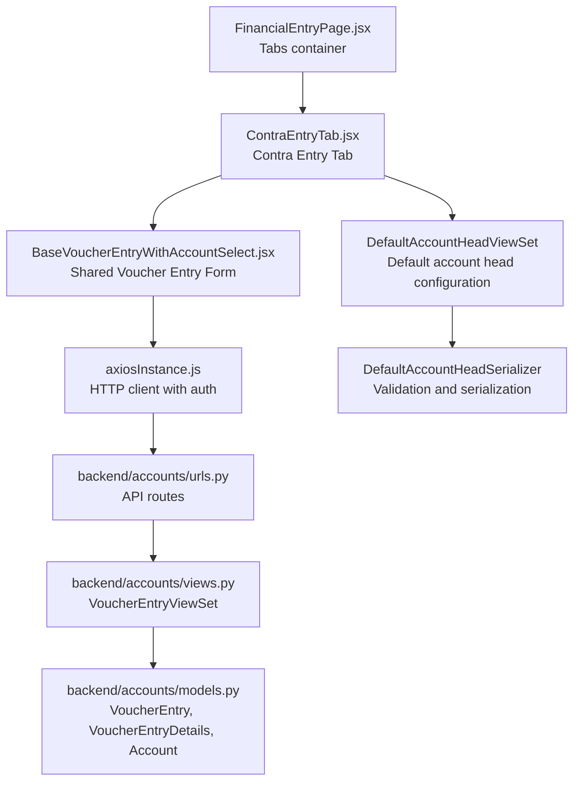
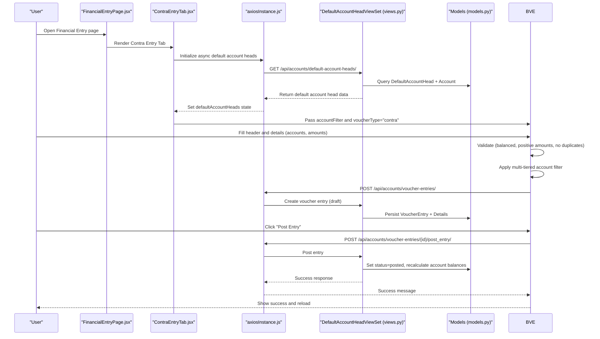
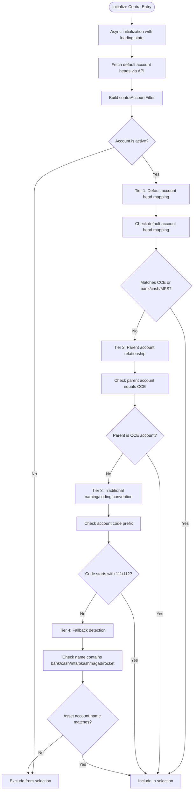
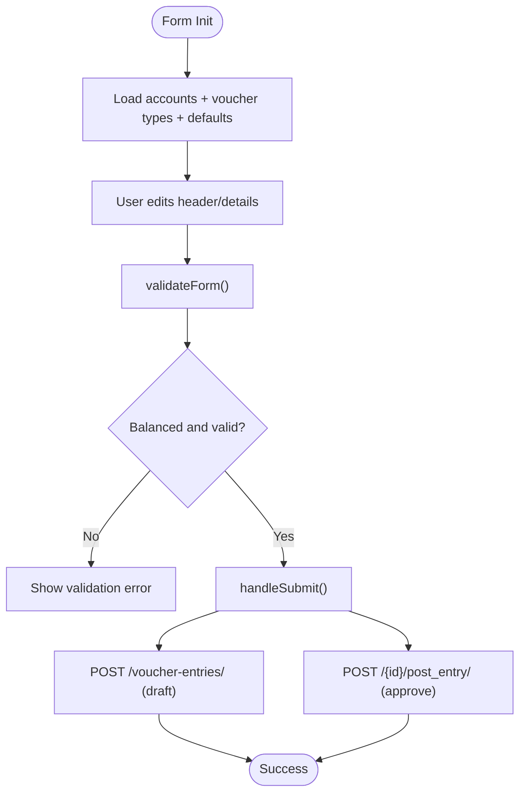
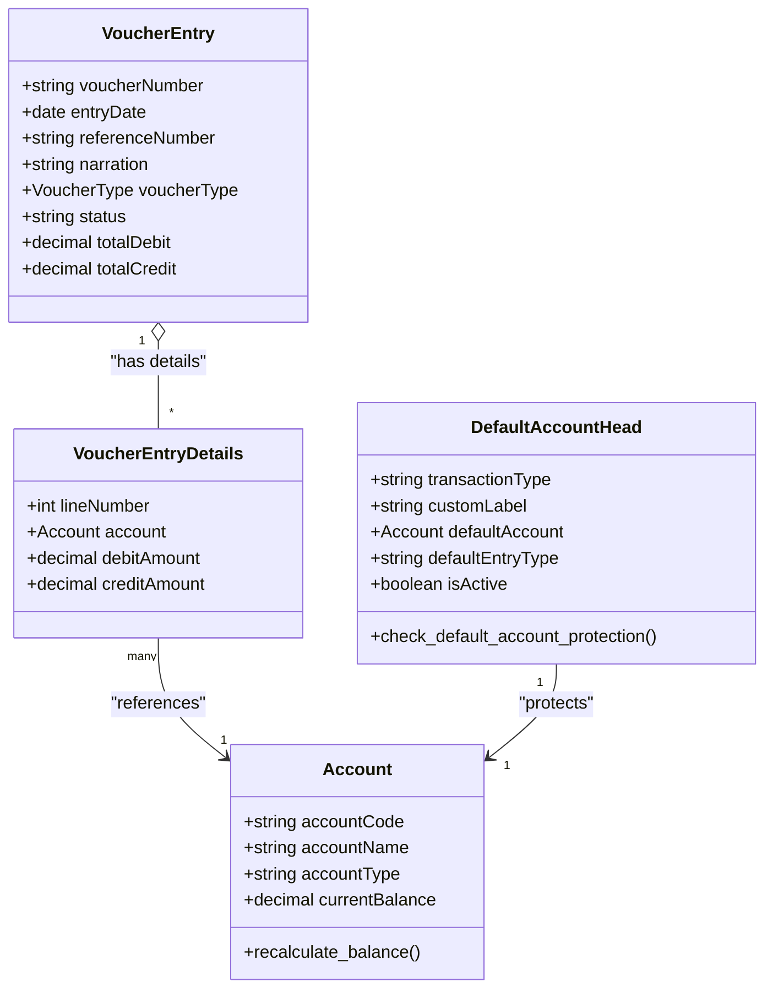
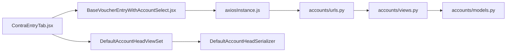

# Contra Entry Tab

<cite>
**Referenced Files in This Document**
- [ContraEntryTab.jsx](file://frontend/src/Features/FinancialEntry/ContraEntryTab.jsx)
- [BaseVoucherEntryWithAccountSelect.jsx](file://frontend/src/Features/FinancialEntry/BaseVoucherEntryWithAccountSelect.jsx)
- [FinancialEntryPage.jsx](file://frontend/src/Features/FinancialEntry/FinancialEntryPage.jsx)
- [axiosInstance.js](file://frontend/src/utils/axiosInstance.js)
- [VoucherListPage.jsx](file://frontend/src/Features/Vouchers/VoucherListPage.jsx)
- [urls.py](file://backend/accounts/urls.py)
- [views.py](file://backend/accounts/views.py)
- [models.py](file://backend/accounts/models.py)
- [DefaultAccountHeadViewSet](file://backend/accounts/views.py#L523-L717)
- [DefaultAccountHeadSerializer](file://backend/accounts/serializers.py#L466-L512)
</cite>

## Update Summary
**Changes Made**
- Updated account filtering logic section to reflect the new multi-tiered approach
- Added comprehensive error handling documentation for asynchronous initialization
- Enhanced validation rules documentation with parent account relationship checking
- Updated architecture diagrams to show default account head configuration integration
- Added new section on asynchronous initialization and loading states

## Table of Contents
1. [Introduction](#introduction)
2. [Project Structure](#project-structure)
3. [Core Components](#core-components)
4. [Architecture Overview](#architecture-overview)
5. [Detailed Component Analysis](#detailed-component-analysis)
6. [Dependency Analysis](#dependency-analysis)
7. [Performance Considerations](#performance-considerations)
8. [Troubleshooting Guide](#troubleshooting-guide)
9. [Conclusion](#conclusion)

## Introduction
The Contra Entry Tab enables creation of contra entries—dual-account transfers between cash, bank, mobile financial services (MFS), and petty cash accounts. It enforces strict validation rules to ensure balanced, non-duplicated transfers, supports draft and posted states, and integrates with backend APIs for account filtering, voucher creation, and approval workflows. This document explains the end-to-end flow from UI to backend, including validation, approval, and reconciliation.

**Updated** The account filtering logic now uses a sophisticated multi-tiered approach prioritizing default account head configuration, parent account relationship checking, traditional naming conventions, and intelligent fallback detection with comprehensive error handling.

## Project Structure
The Contra Entry Tab is part of the Financial Entry feature set and leverages a shared base component for voucher entry forms. It interacts with backend endpoints for accounts, voucher types, and voucher entries, utilizing default account head configurations for intelligent account filtering.

**Diagram sources**
- [FinancialEntryPage.jsx](file://frontend/src/Features/FinancialEntry/FinancialEntryPage.jsx#L14-L50)
- [ContraEntryTab.jsx](file://frontend/src/Features/FinancialEntry/ContraEntryTab.jsx#L1-L81)
- [BaseVoucherEntryWithAccountSelect.jsx](file://frontend/src/Features/FinancialEntry/BaseVoucherEntryWithAccountSelect.jsx#L1-L712)
- [axiosInstance.js](file://frontend/src/utils/axiosInstance.js#L1-L89)
- [urls.py](file://backend/accounts/urls.py#L1-L25)
- [views.py](file://backend/accounts/views.py#L261-L481)
- [models.py](file://backend/accounts/models.py#L201-L331)
- [DefaultAccountHeadViewSet](file://backend/accounts/views.py#L523-L717)
- [DefaultAccountHeadSerializer](file://backend/accounts/serializers.py#L466-L512)

**Section sources**
- [FinancialEntryPage.jsx](file://frontend/src/Features/FinancialEntry/FinancialEntryPage.jsx#L14-L50)
- [ContraEntryTab.jsx](file://frontend/src/Features/FinancialEntry/ContraEntryTab.jsx#L1-L81)
- [BaseVoucherEntryWithAccountSelect.jsx](file://frontend/src/Features/FinancialEntry/BaseVoucherEntryWithAccountSelect.jsx#L1-L712)
- [axiosInstance.js](file://frontend/src/utils/axiosInstance.js#L1-L89)
- [urls.py](file://backend/accounts/urls.py#L1-L25)

## Core Components
- ContraEntryTab: Initializes default account head configuration asynchronously, filters accounts suitable for contra entries using a multi-tiered approach, and renders the shared voucher entry form with contra-specific constraints.
- BaseVoucherEntryWithAccountSelect: Shared form handling debit/credit lines, totals calculation, validation rules, and submission to backend.
- FinancialEntryPage: Hosts the Contra Entry Tab alongside other financial entry types.
- Backend VoucherEntryViewSet: Handles creation, posting, voiding, and retrieval of voucher entries; recalculates account balances upon posting.
- DefaultAccountHeadViewSet: Manages default account head configurations with validation and protection mechanisms.

Key validations enforced:
- Balanced entry: total debits must equal total credits.
- Positive amounts only.
- No duplication of the same account on both debit and credit sides.
- At least two lines per entry.
- Parent account relationship validation for default account head protection.

**Section sources**
- [ContraEntryTab.jsx](file://frontend/src/Features/FinancialEntry/ContraEntryTab.jsx#L17-L79)
- [BaseVoucherEntryWithAccountSelect.jsx](file://frontend/src/Features/FinancialEntry/BaseVoucherEntryWithAccountSelect.jsx#L224-L314)
- [views.py](file://backend/accounts/views.py#L261-L481)

## Architecture Overview
End-to-end flow for creating and posting a contra entry with asynchronous initialization and multi-tiered account filtering:

**Diagram sources**
- [FinancialEntryPage.jsx](file://frontend/src/Features/FinancialEntry/FinancialEntryPage.jsx#L42-L49)
- [ContraEntryTab.jsx](file://frontend/src/Features/FinancialEntry/ContraEntryTab.jsx#L9-L25)
- [BaseVoucherEntryWithAccountSelect.jsx](file://frontend/src/Features/FinancialEntry/BaseVoucherEntryWithAccountSelect.jsx#L316-L372)
- [views.py](file://backend/accounts/views.py#L401-L443)
- [models.py](file://backend/accounts/models.py#L201-L331)

## Detailed Component Analysis

### ContraEntryTab
Responsibilities:
- Asynchronously initializes default account head configuration using useEffect hook.
- Applies a sophisticated multi-tiered account filter to restrict selectable accounts to cash, bank, MFS, petty cash, and children of the Cash-Cash Equivalents (CCE) head.
- Renders the shared voucher entry form with voucherType set to "contra".
- Handles loading states and error scenarios during initialization.

**Updated** Multi-tiered account filtering logic with priority order:

**Diagram sources**
- [ContraEntryTab.jsx](file://frontend/src/Features/FinancialEntry/ContraEntryTab.jsx#L32-L67)

**Section sources**
- [ContraEntryTab.jsx](file://frontend/src/Features/FinancialEntry/ContraEntryTab.jsx#L5-L81)

### BaseVoucherEntryWithAccountSelect
Responsibilities:
- Manages form state for header (entry date, reference, narration) and details (account, description, debit/credit).
- Provides account selection via a searchable component and applies the contra filter when used in the Contra Entry Tab.
- Implements robust validation:
  - Balanced totals.
  - Positive amounts only.
  - No duplicate accounts on both debit and credit sides.
- Submits to backend:
  - Draft creation: POST /api/accounts/voucher-entries/.
  - Posting: POST /api/accounts/voucher-entries/{id}/post_entry/.

Approval integration:
- The form supports a success callback to refresh the page after saving or posting.

**Diagram sources**
- [BaseVoucherEntryWithAccountSelect.jsx](file://frontend/src/Features/FinancialEntry/BaseVoucherEntryWithAccountSelect.jsx#L224-L372)
- [VoucherListPage.jsx](file://frontend/src/Features/Vouchers/VoucherListPage.jsx#L268-L295)

**Section sources**
- [BaseVoucherEntryWithAccountSelect.jsx](file://frontend/src/Features/FinancialEntry/BaseVoucherEntryWithAccountSelect.jsx#L15-L712)
- [VoucherListPage.jsx](file://frontend/src/Features/Vouchers/VoucherListPage.jsx#L268-L295)

### Backend: VoucherEntryViewSet and Models
Backend responsibilities:
- VoucherEntryViewSet handles creation, posting, and voiding of entries.
- On posting, it validates balance equality and recalculates account balances for all affected accounts.
- Models define the domain: VoucherEntry, VoucherEntryDetails, Account, and VoucherType.
- DefaultAccountHeadViewSet manages default account head configurations with validation and protection mechanisms.

**Updated** Default account head protection mechanisms:
- Prevents modification of accounts that are configured as default account heads.
- Validates that default accounts are always active.
- Provides user-friendly error messages when attempting to modify protected accounts.

**Diagram sources**
- [models.py](file://backend/accounts/models.py#L201-L331)
- [models.py](file://backend/accounts/models.py#L350-L410)

**Section sources**
- [views.py](file://backend/accounts/views.py#L261-L481)
- [models.py](file://backend/accounts/models.py#L201-L331)
- [DefaultAccountHeadViewSet](file://backend/accounts/views.py#L523-L717)
- [DefaultAccountHeadSerializer](file://backend/accounts/serializers.py#L466-L512)

## Dependency Analysis
- Frontend depends on axiosInstance for authenticated requests.
- ContraEntryTab depends on BaseVoucherEntryWithAccountSelect for rendering and validation.
- BaseVoucherEntryWithAccountSelect depends on:
  - AccountHeadSelect for searchable account selection.
  - Axios for API calls to accounts, voucher types, and voucher entries.
- Backend exposes endpoints via accounts/urls.py routed to views.py, which use models.py for persistence and balance calculations.
- Default account head configurations are managed through DefaultAccountHeadViewSet with comprehensive validation.

**Diagram sources**
- [ContraEntryTab.jsx](file://frontend/src/Features/FinancialEntry/ContraEntryTab.jsx#L1-L3)
- [BaseVoucherEntryWithAccountSelect.jsx](file://frontend/src/Features/FinancialEntry/BaseVoucherEntryWithAccountSelect.jsx#L1-L10)
- [axiosInstance.js](file://frontend/src/utils/axiosInstance.js#L1-L10)
- [urls.py](file://backend/accounts/urls.py#L1-L25)
- [views.py](file://backend/accounts/views.py#L261-L284)
- [models.py](file://backend/accounts/models.py#L9-L65)
- [DefaultAccountHeadViewSet](file://backend/accounts/views.py#L523-L528)

**Section sources**
- [ContraEntryTab.jsx](file://frontend/src/Features/FinancialEntry/ContraEntryTab.jsx#L1-L3)
- [BaseVoucherEntryWithAccountSelect.jsx](file://frontend/src/Features/FinancialEntry/BaseVoucherEntryWithAccountSelect.jsx#L1-L10)
- [urls.py](file://backend/accounts/urls.py#L1-L25)

## Performance Considerations
- Frontend:
  - Asynchronous initialization of default account heads prevents blocking the UI during account filtering.
  - Client-side filtering with multi-tiered approach reduces server round trips for account selection.
  - Loading states provide user feedback during initialization.
  - Debouncing or virtualization in account selection would improve performance for large datasets.
- Backend:
  - Default account head queries use database indexes on transactionType and isActive fields.
  - Posting triggers balance recalculation for all affected accounts; keep the number of affected accounts reasonable to minimize recalculation overhead.
  - Use database indexes on accountCode, isActive, and accountType to optimize account queries.

**Updated** Performance improvements:
- Asynchronous initialization prevents UI blocking during default account head loading.
- Multi-tiered filtering prioritizes the most accurate methods first, reducing unnecessary checks.
- Error boundaries prevent cascading failures during initialization.

## Troubleshooting Guide
Common issues and resolutions:
- Validation errors:
  - Unbalanced totals: Ensure total debits equal total credits before posting.
  - Negative or zero amounts: Enter positive numeric values only.
  - Duplicate accounts on both sides: Use separate accounts for debit and credit.
- Posting failures:
  - Entry must be balanced; correct amounts and re-submit.
  - Only draft entries can be posted; void posted entries and re-create if needed.
- Account selection:
  - Ensure target accounts are active assets and match the contra filter criteria.
  - Check that accounts are not protected as default account heads.
- Initialization failures:
  - Default account head API errors: Verify network connectivity and API availability.
  - Loading state issues: Check for proper error handling and fallback states.
- API connectivity:
  - Verify axiosInstance interceptors for Authorization headers and token refresh behavior.
  - Check DefaultAccountHeadViewSet endpoints for proper configuration.

**Updated** New troubleshooting scenarios:
- Asynchronous initialization errors: Check console for "Error fetching default account heads" messages.
- Default account head protection errors: Look for validation errors indicating accounts are configured as default heads.
- Multi-tiered filter failures: Verify account hierarchy and naming conventions meet filtering criteria.

**Section sources**
- [BaseVoucherEntryWithAccountSelect.jsx](file://frontend/src/Features/FinancialEntry/BaseVoucherEntryWithAccountSelect.jsx#L224-L314)
- [views.py](file://backend/accounts/views.py#L401-L443)
- [ContraEntryTab.jsx](file://frontend/src/Features/FinancialEntry/ContraEntryTab.jsx#L17-L25)

## Conclusion
The Contra Entry Tab provides a robust, validated pathway for creating dual-account transfers between cash, bank, MFS, and petty cash accounts. Its integration with backend APIs ensures proper validation, approval workflows, and automatic account balance updates. The new multi-tiered account filtering logic with asynchronous initialization provides enhanced accuracy and user experience. By adhering to the validation rules and leveraging the approval process, users can reliably maintain accurate financial records and reconcile contra entries efficiently.

**Updated** The sophisticated account filtering approach with default head configuration, parent relationship checking, and intelligent fallback detection ensures reliable identification of valid contra entry accounts while maintaining system integrity through comprehensive error handling and protection mechanisms.