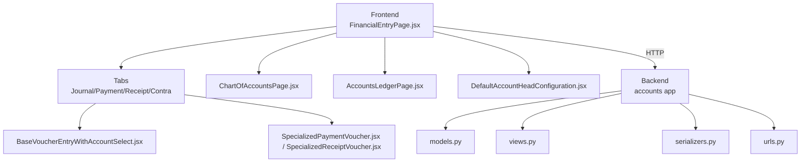
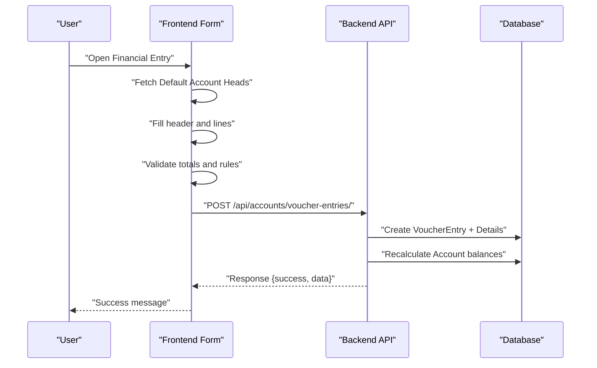
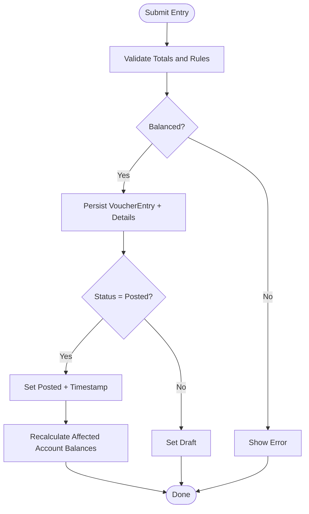
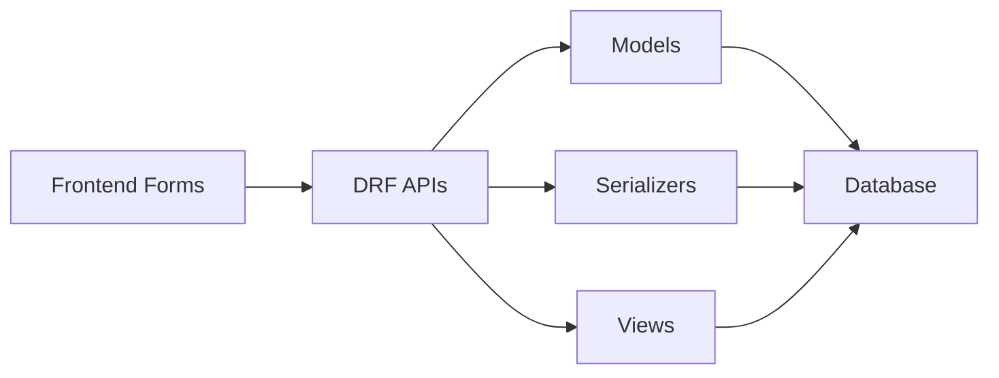

# Financial Entry System

<cite>
**Referenced Files in This Document**
- [FinancialEntryPage.jsx](file://frontend/src/Features/FinancialEntry/FinancialEntryPage.jsx)
- [JournalEntryTab.jsx](file://frontend/src/Features/FinancialEntry/JournalEntryTab.jsx)
- [ReceiptVoucherTab.jsx](file://frontend/src/Features/FinancialEntry/ReceiptVoucherTab.jsx)
- [PaymentVoucherTab.jsx](file://frontend/src/Features/FinancialEntry/PaymentVoucherTab.jsx)
- [ContraEntryTab.jsx](file://frontend/src/Features/FinancialEntry/ContraEntryTab.jsx)
- [BaseVoucherEntryWithAccountSelect.jsx](file://frontend/src/Features/FinancialEntry/BaseVoucherEntryWithAccountSelect.jsx)
- [SpecializedPaymentVoucher.jsx](file://frontend/src/Features/FinancialEntry/SpecializedPaymentVoucher.jsx)
- [SpecializedReceiptVoucher.jsx](file://frontend/src/Features/FinancialEntry/SpecializedReceiptVoucher.jsx)
- [DefaultAccountHeadConfiguration.jsx](file://frontend/src/Features/GlobalOptions/DefaultAccountHeads/DefaultAccountHeadConfiguration.jsx)
- [ChartOfAccountsPage.jsx](file://frontend/src/Features/ChartOfAccounts/ChartOfAccountsPage.jsx)
- [AccountsLedgerPage.jsx](file://frontend/src/Features/AccountsLedger/AccountsLedgerPage.jsx)
- [models.py](file://backend/accounts/models.py)
- [views.py](file://backend/accounts/views.py)
- [serializers.py](file://backend/accounts/serializers.py)
- [urls.py](file://backend/accounts/urls.py)
</cite>

## Update Summary
**Changes Made**
- Enhanced default account head system documentation with multi-tiered account filtering logic
- Added comprehensive coverage of asynchronous initialization for fetching default account heads
- Improved error handling documentation for default account head operations
- Comprehensive account classification system documentation prioritizing business configuration over hardcoded patterns
- Updated frontend integration details for default account head usage in financial entry forms

## Table of Contents
1. [Introduction](#introduction)
2. [Project Structure](#project-structure)
3. [Core Components](#core-components)
4. [Architecture Overview](#architecture-overview)
5. [Detailed Component Analysis](#detailed-component-analysis)
6. [Enhanced Default Account Head System](#enhanced-default-account-head-system)
7. [Dependency Analysis](#dependency-analysis)
8. [Performance Considerations](#performance-considerations)
9. [Troubleshooting Guide](#troubleshooting-guide)
10. [Conclusion](#conclusion)

## Introduction
This document describes the Financial Entry System responsible for capturing, validating, posting, and reporting financial transactions. It covers journal entries, payment vouchers, receipt vouchers, and contra entries. The system integrates a robust chart of accounts with specialized data entry forms, enforces strict validation rules, and maintains accurate ledger records. The system now features an enhanced default account head system with multi-tiered account filtering logic, asynchronous initialization for fetching default account heads, improved error handling, and comprehensive account classification system prioritizing business configuration over hardcoded patterns.

## Project Structure
The Financial Entry System spans both frontend and backend:
- Frontend: React-based forms and tabs for different voucher types, integrated with chart of accounts, ledger views, and default account head configuration.
- Backend: Django REST Framework APIs for accounts, voucher types, voucher entries, default account heads, ledgers, and trial balance.

**Diagram sources**
- [FinancialEntryPage.jsx](file://frontend/src/Features/FinancialEntry/FinancialEntryPage.jsx#L14-L50)
- [BaseVoucherEntryWithAccountSelect.jsx](file://frontend/src/Features/FinancialEntry/BaseVoucherEntryWithAccountSelect.jsx#L15-L80)
- [SpecializedPaymentVoucher.jsx](file://frontend/src/Features/FinancialEntry/SpecializedPaymentVoucher.jsx#L17-L21)
- [SpecializedReceiptVoucher.jsx](file://frontend/src/Features/FinancialEntry/SpecializedReceiptVoucher.jsx#L17-L21)
- [DefaultAccountHeadConfiguration.jsx](file://frontend/src/Features/GlobalOptions/DefaultAccountHeads/DefaultAccountHeadConfiguration.jsx#L10-L829)
- [ChartOfAccountsPage.jsx](file://frontend/src/Features/ChartOfAccounts/ChartOfAccountsPage.jsx#L31-L48)
- [AccountsLedgerPage.jsx](file://frontend/src/Features/AccountsLedger/AccountsLedgerPage.jsx#L15-L30)
- [models.py](file://backend/accounts/models.py#L9-L410)
- [views.py](file://backend/accounts/views.py#L26-L1128)
- [serializers.py](file://backend/accounts/serializers.py#L1-L513)
- [urls.py](file://backend/accounts/urls.py#L1-L25)

**Section sources**
- [FinancialEntryPage.jsx](file://frontend/src/Features/FinancialEntry/FinancialEntryPage.jsx#L14-L50)
- [urls.py](file://backend/accounts/urls.py#L13-L24)

## Core Components
- Voucher Entry Models: Account, VoucherType, VoucherEntry, VoucherEntryDetails, DefaultAccountHead.
- Voucher Entry Views: Account management, VoucherType lookup, VoucherEntry CRUD, posting/voiding, ledger retrieval, trial balance.
- Frontend Tabs: Journal Entry, Receipt Voucher, Payment Voucher, Contra Entry.
- Specialized Forms: Automated debit/credit assignment for receipts and payments.
- Chart of Accounts: Full CRUD, tree/table views, filtering, and balance display.
- Accounts Ledger: Individual and consolidated ledger reports with pagination and export.
- **Enhanced Default Account Head System**: Multi-tiered account filtering logic, asynchronous initialization, comprehensive error handling, and business-configured account classification.

**Section sources**
- [models.py](file://backend/accounts/models.py#L9-L410)
- [views.py](file://backend/accounts/views.py#L26-L1128)
- [serializers.py](file://backend/accounts/serializers.py#L1-L513)
- [FinancialEntryPage.jsx](file://frontend/src/Features/FinancialEntry/FinancialEntryPage.jsx#L14-L50)
- [BaseVoucherEntryWithAccountSelect.jsx](file://frontend/src/Features/FinancialEntry/BaseVoucherEntryWithAccountSelect.jsx#L15-L80)
- [SpecializedPaymentVoucher.jsx](file://frontend/src/Features/FinancialEntry/SpecializedPaymentVoucher.jsx#L17-L792)
- [SpecializedReceiptVoucher.jsx](file://frontend/src/Features/FinancialEntry/SpecializedReceiptVoucher.jsx#L17-L792)
- [ChartOfAccountsPage.jsx](file://frontend/src/Features/ChartOfAccounts/ChartOfAccountsPage.jsx#L31-L48)
- [AccountsLedgerPage.jsx](file://frontend/src/Features/AccountsLedger/AccountsLedgerPage.jsx#L15-L30)
- [DefaultAccountHeadConfiguration.jsx](file://frontend/src/Features/GlobalOptions/DefaultAccountHeads/DefaultAccountHeadConfiguration.jsx#L10-L829)

## Architecture Overview
End-to-end flow:
- Users select a voucher type tab.
- They fill header fields (date, reference, narration) and lines (account, description, amounts).
- Validation ensures balanced entries and prevents duplicates.
- On submit, the frontend posts to backend APIs.
- Backend validates totals, persists entries, recalculates account balances, and marks status as posted or draft.
- Ledgers and reports are generated via dedicated endpoints.

**Diagram sources**
- [BaseVoucherEntryWithAccountSelect.jsx](file://frontend/src/Features/FinancialEntry/BaseVoucherEntryWithAccountSelect.jsx#L67-L75)
- [views.py](file://backend/accounts/views.py#L261-L480)
- [models.py](file://backend/accounts/models.py#L201-L331)

## Detailed Component Analysis

### Voucher Entry Models and Validation
- Account: Hierarchical chart of accounts with type, balances, and constraints.
- VoucherType: Enumerated types (receipt, payment, journal, contra) with prefixes.
- VoucherEntry: Header with status (draft/posted/void), totals, and audit fields.
- VoucherEntryDetails: Lines with debit/credit exclusive validation.
- DefaultAccountHead: Maps transaction types to default account heads and entry types with comprehensive validation.

Key validations:
- Opening balance XOR for debit/credit.
- Posted entries must balance.
- Line items must have exactly one of debit or credit.
- Account deletions blocked if used in defaults or has voucher entries.
- Default account head validation ensures active accounts and unique transaction types.

**Section sources**
- [models.py](file://backend/accounts/models.py#L9-L410)

### Backend Voucher Entry API
Endpoints and actions:
- GET/POST/PUT/DELETE on voucher entries with permission checks.
- post_entry: Validates balancing and sets status to posted; recalculates affected account balances.
- void_entry: Marks posted entries as void and recalculates balances.
- next_voucher_number: Generates sequential numbers by type and date.
- AccountLedgerView: Returns individual account ledger with opening/closing balances and totals.

**Section sources**
- [views.py](file://backend/accounts/views.py#L261-L521)
- [views.py](file://backend/accounts/views.py#L727-L804)

### Frontend Tabs and Specialized Forms
- FinancialEntryPage: Tabbed interface for Journal, Receipt, Payment, Contra entries.
- JournalEntryTab: Uses BaseVoucherEntryWithAccountSelect.
- ReceiptVoucherTab: Uses SpecializedReceiptVoucher.
- PaymentVoucherTab: Uses SpecializedPaymentVoucher.
- ContraEntryTab: Filters accounts to cash-equivalent defaults and naming conventions.

Specialized forms enforce:
- Money-in/money-out direction with automatic debit/credit assignment.
- Restrictions to appropriate account categories (cash/bank for main, receivable/payable for lines).
- Real-time balancing and duplication prevention.
- **Enhanced default account head integration**: Asynchronous loading and application of default account mappings.

**Section sources**
- [FinancialEntryPage.jsx](file://frontend/src/Features/FinancialEntry/FinancialEntryPage.jsx#L14-L50)
- [JournalEntryTab.jsx](file://frontend/src/Features/FinancialEntry/JournalEntryTab.jsx#L3-L12)
- [ReceiptVoucherTab.jsx](file://frontend/src/Features/FinancialEntry/ReceiptVoucherTab.jsx#L3-L12)
- [PaymentVoucherTab.jsx](file://frontend/src/Features/FinancialEntry/PaymentVoucherTab.jsx#L3-L12)
- [ContraEntryTab.jsx](file://frontend/src/Features/FinancialEntry/ContraEntryTab.jsx#L5-L78)
- [BaseVoucherEntryWithAccountSelect.jsx](file://frontend/src/Features/FinancialEntry/BaseVoucherEntryWithAccountSelect.jsx#L15-L712)
- [SpecializedPaymentVoucher.jsx](file://frontend/src/Features/FinancialEntry/SpecializedPaymentVoucher.jsx#L17-L792)
- [SpecializedReceiptVoucher.jsx](file://frontend/src/Features/FinancialEntry/SpecializedReceiptVoucher.jsx#L17-L792)

### Chart of Accounts Integration
- Displays accounts with type badges, parent relationships, and balances.
- Supports search, pagination, and tree/table view modes.
- Integrates with voucher forms to restrict account selections based on voucher type and default mappings.

**Section sources**
- [ChartOfAccountsPage.jsx](file://frontend/src/Features/ChartOfAccounts/ChartOfAccountsPage.jsx#L31-L48)
- [ChartOfAccountsPage.jsx](file://frontend/src/Features/ChartOfAccounts/ChartOfAccountsPage.jsx#L130-L144)

### Accounts Ledger Reporting
- Individual and consolidated ledger views.
- Date-range filtering, pagination, and summary totals.
- Exports and print support.

**Section sources**
- [AccountsLedgerPage.jsx](file://frontend/src/Features/AccountsLedger/AccountsLedgerPage.jsx#L15-L30)
- [AccountsLedgerPage.jsx](file://frontend/src/Features/AccountsLedger/AccountsLedgerPage.jsx#L87-L138)

### Transaction Posting Logic

**Diagram sources**
- [BaseVoucherEntryWithAccountSelect.jsx](file://frontend/src/Features/FinancialEntry/BaseVoucherEntryWithAccountSelect.jsx#L316-L372)
- [views.py](file://backend/accounts/views.py#L401-L480)
- [models.py](file://backend/accounts/models.py#L127-L156)

## Enhanced Default Account Head System

### Multi-Tiered Account Filtering Logic
The enhanced default account head system implements sophisticated filtering mechanisms:

- **Business Configuration Priority**: Business-defined default account heads take precedence over hardcoded patterns.
- **Multi-Level Filtering**: Search by transaction type, custom label, account code, account name, and description.
- **Real-Time Filtering**: Dynamic filtering applied as users type or adjust filters.
- **Unique Transaction Type Management**: Prevents duplicate transaction types while allowing custom configurations.

### Asynchronous Initialization for Fetching Default Account Heads
The system implements robust asynchronous loading:

- **Initial Load**: Default account heads are fetched during component initialization.
- **Background Loading**: Asynchronous fetching prevents UI blocking during data retrieval.
- **Error Handling**: Comprehensive error handling with user-friendly messages.
- **Loading States**: Proper loading indicators during data fetching operations.

### Comprehensive Account Classification System
The system prioritizes business configuration over hardcoded patterns:

- **Custom Transaction Types**: Support for unlimited custom transaction types beyond predefined categories.
- **Flexible Entry Types**: Optional default entry types (debit/credit) for each transaction type.
- **Business-Centric Mapping**: Accounts are mapped based on business needs rather than rigid categorization.
- **Dynamic Configuration**: Real-time updates to default mappings without system restarts.

### Frontend Integration Details
The enhanced system integrates seamlessly with existing forms:

- **Asynchronous Loading**: Default account heads are loaded asynchronously in BaseVoucherEntryWithAccountSelect.
- **Real-Time Application**: Default mappings are applied immediately when accounts are selected.
- **Error Propagation**: Errors in default account head loading are handled gracefully.
- **Performance Optimization**: Efficient caching and minimal re-rendering during updates.

**Section sources**
- [DefaultAccountHeadConfiguration.jsx](file://frontend/src/Features/GlobalOptions/DefaultAccountHeads/DefaultAccountHeadConfiguration.jsx#L38-L76)
- [DefaultAccountHeadConfiguration.jsx](file://frontend/src/Features/GlobalOptions/DefaultAccountHeads/DefaultAccountHeadConfiguration.jsx#L78-L112)
- [BaseVoucherEntryWithAccountSelect.jsx](file://frontend/src/Features/FinancialEntry/BaseVoucherEntryWithAccountSelect.jsx#L67-L75)
- [BaseVoucherEntryWithAccountSelect.jsx](file://frontend/src/Features/FinancialEntry/BaseVoucherEntryWithAccountSelect.jsx#L165-L179)
- [models.py](file://backend/accounts/models.py#L333-L410)
- [views.py](file://backend/accounts/views.py#L523-L717)
- [serializers.py](file://backend/accounts/serializers.py#L466-L513)

## Dependency Analysis
- Frontend depends on backend APIs for accounts, voucher types, entries, ledgers, trial balance, and default account heads.
- Backend models define relationships among accounts, voucher types, entries, details, and default account heads.
- Serializers encapsulate validation and creation/update logic for default account heads.
- URLs route requests to viewsets and custom actions for default account head management.

**Diagram sources**
- [urls.py](file://backend/accounts/urls.py#L13-L24)
- [models.py](file://backend/accounts/models.py#L9-L410)
- [serializers.py](file://backend/accounts/serializers.py#L1-L513)
- [views.py](file://backend/accounts/views.py#L26-L1128)

**Section sources**
- [urls.py](file://backend/accounts/urls.py#L13-L24)
- [models.py](file://backend/accounts/models.py#L9-L410)
- [serializers.py](file://backend/accounts/serializers.py#L1-L513)
- [views.py](file://backend/accounts/views.py#L26-L1128)

## Performance Considerations
- Database indexes on frequently queried fields (account code, status, dates, transaction types) improve lookup performance.
- Pagination for ledgers, account lists, and default account head configurations reduces memory footprint.
- Batch balance recalculation occurs after posting to minimize redundant computations.
- Frontend debounced search and minimal re-renders keep UI responsive.
- **Enhanced**: Asynchronous loading of default account heads improves initial page load performance.

## Troubleshooting Guide
Common issues and resolutions:
- Entry not balanced: Ensure total debits equal total credits before posting.
- Duplicate account usage: Accounts cannot appear in both debit and credit sides within the same entry.
- Posted entry modification: Posted entries cannot be edited; create a reversing entry instead.
- Account deletion blocked: Remove associated voucher entries or update defaults before deletion.
- Ledger empty: Verify date range and account selection; ensure entries exist within the period.
- **Default Account Head Issues**: 
  - Transaction type conflicts: Ensure unique transaction types when creating new mappings.
  - Inactive account errors: Use only active accounts for default mappings.
  - Loading failures: Check network connectivity and API endpoint availability.
  - Filter not working: Verify search terms match expected transaction types or account details.

**Section sources**
- [BaseVoucherEntryWithAccountSelect.jsx](file://frontend/src/Features/FinancialEntry/BaseVoucherEntryWithAccountSelect.jsx#L224-L314)
- [views.py](file://backend/accounts/views.py#L348-L374)
- [views.py](file://backend/accounts/views.py#L147-L190)
- [views.py](file://backend/accounts/views.py#L445-L480)
- [DefaultAccountHeadConfiguration.jsx](file://frontend/src/Features/GlobalOptions/DefaultAccountHeads/DefaultAccountHeadConfiguration.jsx#L148-L200)
- [serializers.py](file://backend/accounts/serializers.py#L494-L513)

## Conclusion
The Financial Entry System provides a comprehensive, validated, and auditable framework for financial data capture across multiple voucher types. Its integration with chart of accounts, specialized forms, and ledger/reporting capabilities ensures accurate posting, reliable balance tracking, and compliance-ready financial records. The enhanced default account head system with multi-tiered filtering, asynchronous initialization, comprehensive error handling, and business-configured account classification provides unprecedented flexibility and control over financial data mapping, ensuring the system adapts to diverse organizational needs while maintaining robust validation and performance standards.