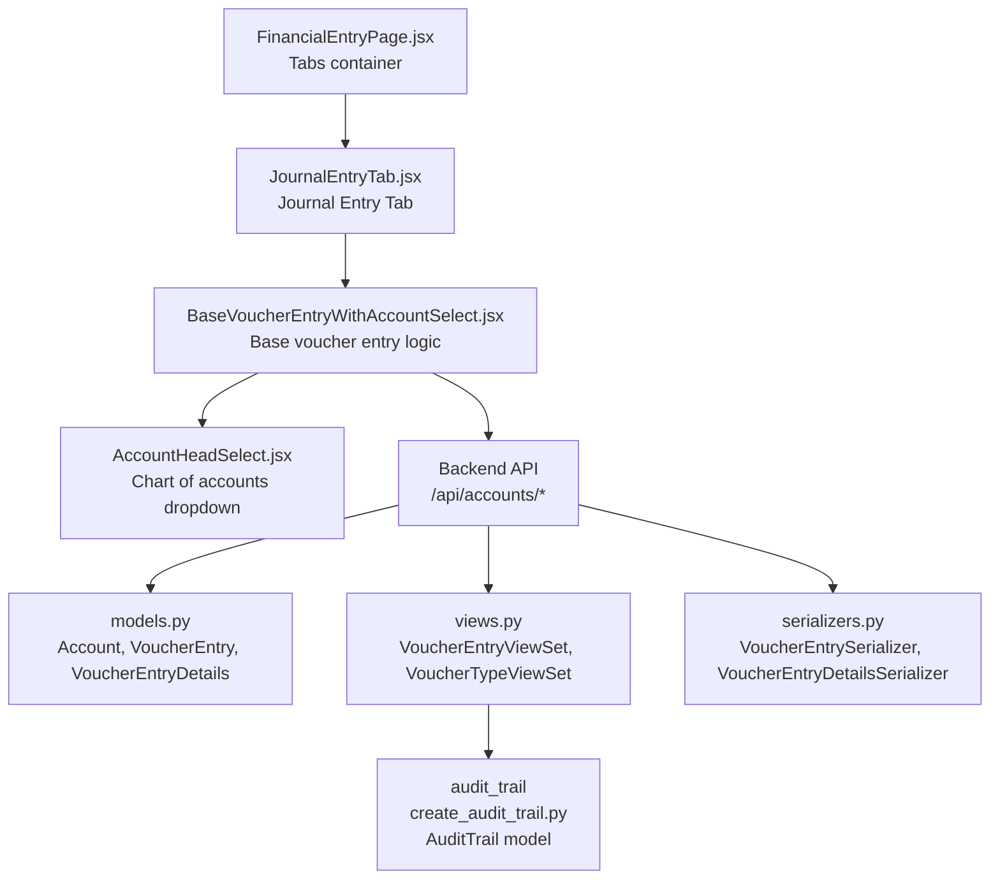
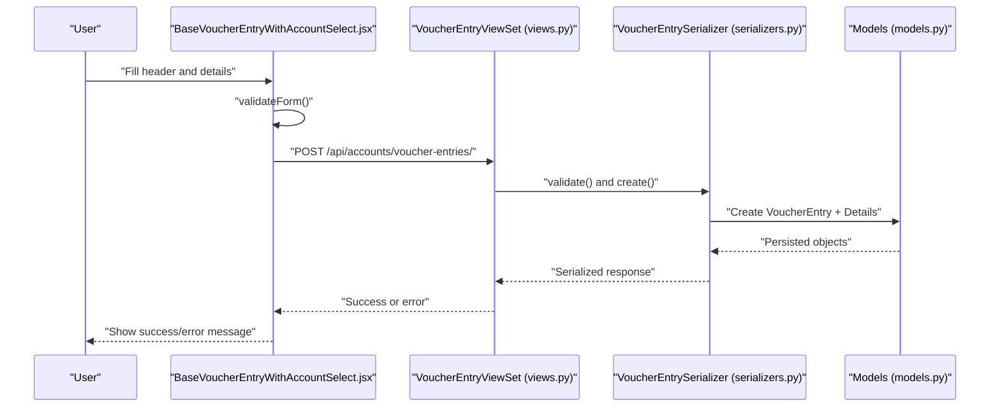
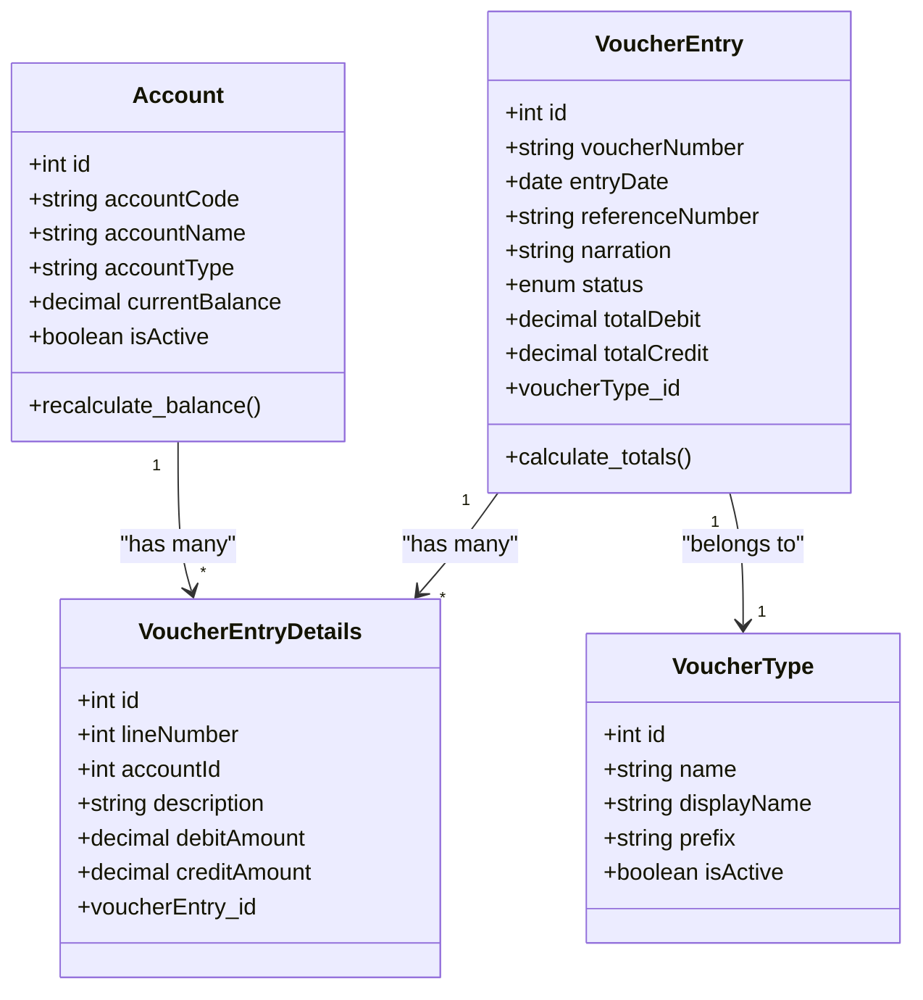
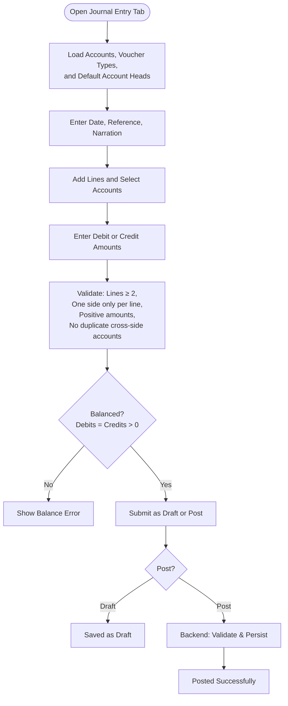
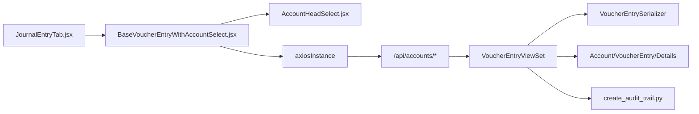

# Journal Entry Tab

<cite>
**Referenced Files in This Document**
- [JournalEntryTab.jsx](file://frontend/src/Features/FinancialEntry/JournalEntryTab.jsx)
- [BaseVoucherEntryWithAccountSelect.jsx](file://frontend/src/Features/FinancialEntry/BaseVoucherEntryWithAccountSelect.jsx)
- [AccountHeadSelect.jsx](file://frontend/src/Components/AccountHeadSelect/AccountHeadSelect.jsx)
- [FinancialEntryPage.jsx](file://frontend/src/Features/FinancialEntry/FinancialEntryPage.jsx)
- [models.py](file://backend/accounts/models.py)
- [views.py](file://backend/accounts/views.py)
- [serializers.py](file://backend/accounts/serializers.py)
- [create_audit_trail.py](file://backend/audit_trail/create_audit_trail.py)
- [models.py](file://backend/audit_trail/models.py)
</cite>

## Table of Contents
1. [Introduction](#introduction)
2. [Project Structure](#project-structure)
3. [Core Components](#core-components)
4. [Architecture Overview](#architecture-overview)
5. [Detailed Component Analysis](#detailed-component-analysis)
6. [Dependency Analysis](#dependency-analysis)
7. [Performance Considerations](#performance-considerations)
8. [Troubleshooting Guide](#troubleshooting-guide)
9. [Conclusion](#conclusion)
10. [Appendices](#appendices)

## Introduction
This document explains the Journal Entry Tab component that powers the creation and posting of general ledger journal entries. It covers the end-to-end workflow: selecting accounts via a searchable dropdown integrated with the chart of accounts, entering debit and credit amounts, validating narration and amounts, ensuring transaction balancing, and posting entries. It also documents the base voucher entry functionality shared across voucher types, the approval and audit trail mechanisms, and how the system integrates with financial reporting.

## Project Structure
The Journal Entry Tab is part of the Financial Entry feature set and uses a reusable base component that supports multi-line entries and chart of accounts integration. The frontend communicates with backend APIs for accounts, voucher types, and voucher entries. Backend models define the accounting domain, and serializers and views enforce validation and persistence.

**Diagram sources**
- [FinancialEntryPage.jsx](file://frontend/src/Features/FinancialEntry/FinancialEntryPage.jsx#L14-L50)
- [JournalEntryTab.jsx](file://frontend/src/Features/FinancialEntry/JournalEntryTab.jsx#L1-L16)
- [BaseVoucherEntryWithAccountSelect.jsx](file://frontend/src/Features/FinancialEntry/BaseVoucherEntryWithAccountSelect.jsx#L1-L712)
- [AccountHeadSelect.jsx](file://frontend/src/Components/AccountHeadSelect/AccountHeadSelect.jsx#L1-L416)
- [models.py](file://backend/accounts/models.py#L9-L410)
- [views.py](file://backend/accounts/views.py#L261-L522)
- [serializers.py](file://backend/accounts/serializers.py#L280-L436)
- [create_audit_trail.py](file://backend/audit_trail/create_audit_trail.py#L1-L22)
- [models.py](file://backend/audit_trail/models.py#L1-L69)

**Section sources**
- [FinancialEntryPage.jsx](file://frontend/src/Features/FinancialEntry/FinancialEntryPage.jsx#L14-L50)
- [JournalEntryTab.jsx](file://frontend/src/Features/FinancialEntry/JournalEntryTab.jsx#L1-L16)
- [BaseVoucherEntryWithAccountSelect.jsx](file://frontend/src/Features/FinancialEntry/BaseVoucherEntryWithAccountSelect.jsx#L1-L712)
- [AccountHeadSelect.jsx](file://frontend/src/Components/AccountHeadSelect/AccountHeadSelect.jsx#L1-L416)
- [models.py](file://backend/accounts/models.py#L9-L410)
- [views.py](file://backend/accounts/views.py#L261-L522)
- [serializers.py](file://backend/accounts/serializers.py#L280-L436)
- [create_audit_trail.py](file://backend/audit_trail/create_audit_trail.py#L1-L22)
- [models.py](file://backend/audit_trail/models.py#L1-L69)

## Core Components
- JournalEntryTab: Thin wrapper that instantiates the base voucher entry component with the journal voucher type.
- BaseVoucherEntryWithAccountSelect: Centralized logic for header fields (date, reference, narration), multi-line details (account, description, debit/credit), totals, validation, and submission.
- AccountHeadSelect: Reusable searchable dropdown for selecting accounts from the chart of accounts.
- Backend VoucherEntryViewSet: Handles creation, posting, voiding, and retrieval of voucher entries with strict validation and balance enforcement.
- Models and Serializers: Define the accounting domain, enforce business rules, and serialize/deserialize requests/responses.

Key capabilities:
- Multi-line journal entries with automatic balancing checks.
- Chart of accounts integration via a searchable dropdown.
- Draft vs posted status with post/void actions.
- Validation for required fields, amounts, and duplicate account usage.

**Section sources**
- [JournalEntryTab.jsx](file://frontend/src/Features/FinancialEntry/JournalEntryTab.jsx#L1-L16)
- [BaseVoucherEntryWithAccountSelect.jsx](file://frontend/src/Features/FinancialEntry/BaseVoucherEntryWithAccountSelect.jsx#L1-L712)
- [AccountHeadSelect.jsx](file://frontend/src/Components/AccountHeadSelect/AccountHeadSelect.jsx#L1-L416)
- [views.py](file://backend/accounts/views.py#L261-L522)
- [models.py](file://backend/accounts/models.py#L201-L331)
- [serializers.py](file://backend/accounts/serializers.py#L280-L436)

## Architecture Overview
The Journal Entry Tab follows a layered architecture:
- Frontend: React components manage UI state, user interactions, and API calls.
- Backend: Django REST Framework exposes endpoints for accounts, voucher types, and voucher entries.
- Domain Models: Enforce accounting rules (balances, validations).
- Audit Trail: Records significant events for compliance and traceability.

**Diagram sources**
- [BaseVoucherEntryWithAccountSelect.jsx](file://frontend/src/Features/FinancialEntry/BaseVoucherEntryWithAccountSelect.jsx#L316-L372)
- [views.py](file://backend/accounts/views.py#L327-L346)
- [serializers.py](file://backend/accounts/serializers.py#L341-L394)
- [models.py](file://backend/accounts/models.py#L201-L331)

## Detailed Component Analysis

### JournalEntryTab
- Purpose: Provides a journal-specific tab that delegates to the base voucher entry component.
- Behavior: Sets the title, passes onSaved callback, and sets voucherType to "journal".
- Integration: Works within the FinancialEntryPage tabs container.

**Section sources**
- [JournalEntryTab.jsx](file://frontend/src/Features/FinancialEntry/JournalEntryTab.jsx#L1-L16)
- [FinancialEntryPage.jsx](file://frontend/src/Features/FinancialEntry/FinancialEntryPage.jsx#L14-L50)

### BaseVoucherEntryWithAccountSelect
- Responsibilities:
  - Fetch accounts, voucher types, and default account heads.
  - Manage form state for header fields and line items.
  - Validate inputs and enforce balancing rules.
  - Submit entries to the backend and handle responses.
- Key features:
  - Multi-line details with add/remove and renumbering.
  - Real-time totals and balance status display.
  - AccountHeadSelect integration for searchable account selection.
  - Draft vs posted submission paths.

Validation rules enforced:
- At least two lines.
- Each line requires an account and exactly one of debit/credit.
- Amounts must be numeric and greater than zero.
- Duplicate accounts cannot appear on both debit and credit sides.

Balancing:
- calculateTotals sums debit and credit across all lines.
- isBalanced requires totalDebit equals totalCredit and both > 0.

Submission:
- Payload includes entryDate, voucherNumber/referenceNumber/narration, status ("draft" or "posted"), and details array with accountId, description, debitAmount, creditAmount.

**Section sources**
- [BaseVoucherEntryWithAccountSelect.jsx](file://frontend/src/Features/FinancialEntry/BaseVoucherEntryWithAccountSelect.jsx#L1-L712)

#### Class Diagram: Accounting Models

**Diagram sources**
- [models.py](file://backend/accounts/models.py#L9-L331)

### AccountHeadSelect
- Purpose: A reusable, searchable dropdown for selecting accounts from the chart of accounts.
- Features: Search by code/name, keyboard navigation, clear selection, accessibility attributes, and optional code display.
- Integration: Used inside BaseVoucherEntryWithAccountSelect to populate account dropdowns for each line.

**Section sources**
- [AccountHeadSelect.jsx](file://frontend/src/Components/AccountHeadSelect/AccountHeadSelect.jsx#L1-L416)

### Backend: VoucherEntry Management
- VoucherEntryViewSet:
  - Create: Validates and persists entries; generates voucher numbers when missing.
  - Post: Changes status to posted after verifying balance and recalculates account balances.
  - Void: Marks posted entries as voided and recalculates balances.
  - Retrieve/List: Supports filtering and searching by status, type, and date range.
- Serializers:
  - VoucherEntrySerializer enforces minimum two lines and balance equality for posted entries.
  - VoucherEntryDetailsSerializer ensures each line has exactly one of debit/credit.
- Models:
  - VoucherEntry stores header fields and totals.
  - VoucherEntryDetails stores per-line debit/credit and links to accounts.

Approval and audit trail:
- While posting and voiding are supported, explicit approval workflows are not implemented in the referenced files. Audit trail can be integrated via create_audit_trail utility.

**Section sources**
- [views.py](file://backend/accounts/views.py#L261-L522)
- [serializers.py](file://backend/accounts/serializers.py#L280-L436)
- [models.py](file://backend/accounts/models.py#L201-L331)
- [create_audit_trail.py](file://backend/audit_trail/create_audit_trail.py#L1-L22)
- [models.py](file://backend/audit_trail/models.py#L1-L69)

### Journal Entry Creation Workflow

**Diagram sources**
- [BaseVoucherEntryWithAccountSelect.jsx](file://frontend/src/Features/FinancialEntry/BaseVoucherEntryWithAccountSelect.jsx#L224-L372)
- [views.py](file://backend/accounts/views.py#L401-L443)
- [serializers.py](file://backend/accounts/serializers.py#L324-L339)

## Dependency Analysis
- Frontend depends on:
  - axiosInstance for API calls.
  - AccountHeadSelect for account selection.
  - MessageBox and ConfirmationMessageBox for user feedback.
- Backend depends on:
  - DRF ViewSets and Serializers.
  - Django ORM models enforcing accounting rules.
  - Optional audit trail integration.

**Diagram sources**
- [JournalEntryTab.jsx](file://frontend/src/Features/FinancialEntry/JournalEntryTab.jsx#L1-L16)
- [BaseVoucherEntryWithAccountSelect.jsx](file://frontend/src/Features/FinancialEntry/BaseVoucherEntryWithAccountSelect.jsx#L1-L712)
- [AccountHeadSelect.jsx](file://frontend/src/Components/AccountHeadSelect/AccountHeadSelect.jsx#L1-L416)
- [views.py](file://backend/accounts/views.py#L261-L522)
- [serializers.py](file://backend/accounts/serializers.py#L280-L436)
- [models.py](file://backend/accounts/models.py#L201-L331)
- [create_audit_trail.py](file://backend/audit_trail/create_audit_trail.py#L1-L22)

**Section sources**
- [JournalEntryTab.jsx](file://frontend/src/Features/FinancialEntry/JournalEntryTab.jsx#L1-L16)
- [BaseVoucherEntryWithAccountSelect.jsx](file://frontend/src/Features/FinancialEntry/BaseVoucherEntryWithAccountSelect.jsx#L1-L712)
- [AccountHeadSelect.jsx](file://frontend/src/Components/AccountHeadSelect/AccountHeadSelect.jsx#L1-L416)
- [views.py](file://backend/accounts/views.py#L261-L522)
- [serializers.py](file://backend/accounts/serializers.py#L280-L436)
- [models.py](file://backend/accounts/models.py#L201-L331)
- [create_audit_trail.py](file://backend/audit_trail/create_audit_trail.py#L1-L22)

## Performance Considerations
- Frontend:
  - Debounce search in AccountHeadSelect to reduce API calls.
  - Paginate account lists on the backend to limit payload sizes.
- Backend:
  - Use indexes on accountCode, isActive, and voucher entry filters (date, status, type).
  - Batch calculations for balance recomputations when posting multiple entries.
- Validation:
  - Perform client-side pre-validation to minimize server round trips.

[No sources needed since this section provides general guidance]

## Troubleshooting Guide
Common issues and resolutions:
- Entry not balanced:
  - Ensure total debits equal total credits and both are greater than zero.
  - Review duplicate account usage across debit and credit sides.
- Minimum lines requirement:
  - A journal entry must have at least two lines.
- Amount validation:
  - Amounts must be numeric, positive, and only one side per line can have a value.
- Posting blocked:
  - Posted entries require balance and cannot be edited; create a reversing entry instead.
- Account selection:
  - Use the searchable dropdown to select active accounts; inactive accounts are excluded.

**Section sources**
- [BaseVoucherEntryWithAccountSelect.jsx](file://frontend/src/Features/FinancialEntry/BaseVoucherEntryWithAccountSelect.jsx#L224-L314)
- [views.py](file://backend/accounts/views.py#L348-L374)
- [serializers.py](file://backend/accounts/serializers.py#L316-L339)

## Conclusion
The Journal Entry Tab leverages a robust base component and backend services to provide a reliable journal entry creation experience. It enforces strong validation rules, supports multi-line entries, integrates with the chart of accounts, and ensures balanced transactions. While explicit approval workflows are not present in the referenced code, the system’s design allows for straightforward extension to include approvals and comprehensive audit trails.

[No sources needed since this section summarizes without analyzing specific files]

## Appendices

### Examples of Common Journal Entries
- Adjustments:
  - Debit: Income Summary, Credit: Retained Earnings (to close temporary accounts).
  - Validation: Ensure only one side per line and amounts are positive.
- Transfers:
  - Debit: Cash, Credit: Bank (or vice versa) for internal transfers.
  - Validation: One side per line, balanced totals.
- Corrections:
  - Debit: Suspense, Credit: Incorrect Account (to correct prior error).
  - Post a reversing entry if the original is posted; otherwise edit/delete the draft.

[No sources needed since this section provides general guidance]