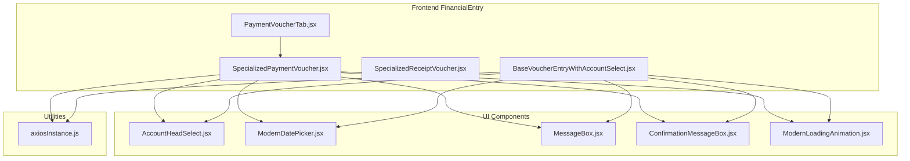
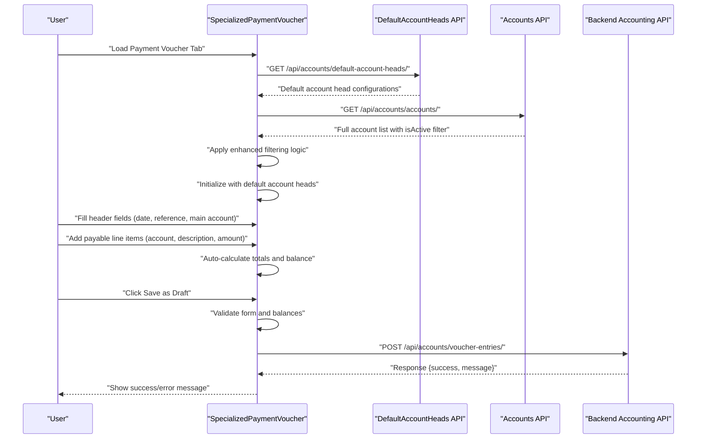
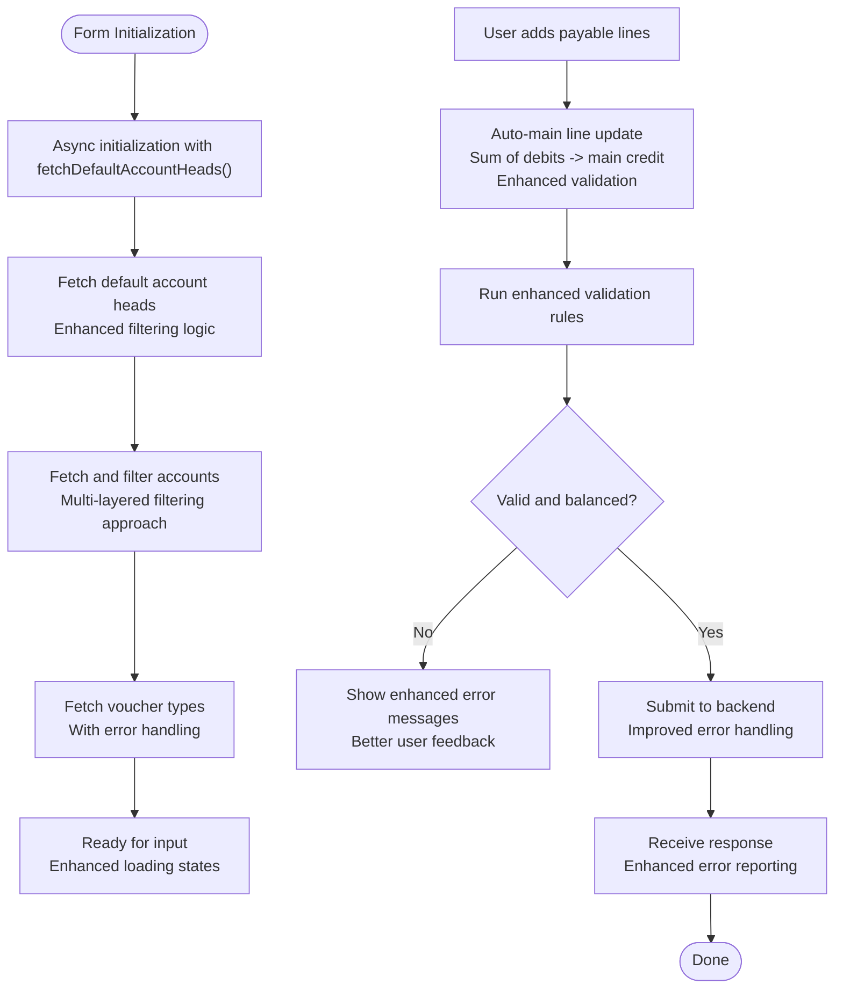
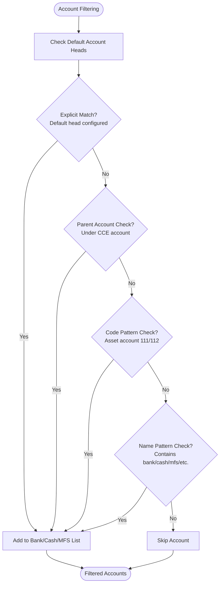
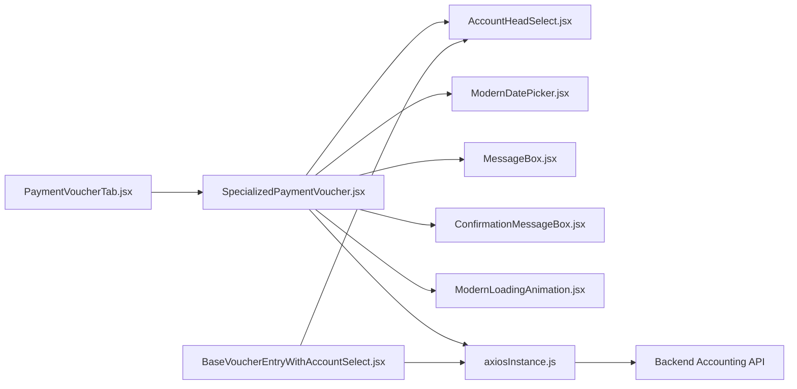

# Payment Voucher Tab

<cite>
**Referenced Files in This Document**
- [PaymentVoucherTab.jsx](file://frontend/src/Features/FinancialEntry/PaymentVoucherTab.jsx)
- [SpecializedPaymentVoucher.jsx](file://frontend/src/Features/FinancialEntry/SpecializedPaymentVoucher.jsx)
- [SpecializedReceiptVoucher.jsx](file://frontend/src/Features/FinancialEntry/SpecializedReceiptVoucher.jsx)
- [AccountHeadSelect.jsx](file://frontend/src/Components/AccountHeadSelect/AccountHeadSelect.jsx)
- [axiosInstance.js](file://frontend/src/utils/axiosInstance.js)
- [ModernDatePicker.jsx](file://frontend/src/Components/FormComponent/ModernDatePicker.jsx)
- [MessageBox.jsx](file://frontend/src/Components/MessageBox/MessageBox.jsx)
- [ConfirmationMessageBox.jsx](file://frontend/src/Components/MessageBox/ConfirmationMessageBox.jsx)
- [ModernLoadingAnimation.jsx](file://frontend/src/Components/Loaders/ModernLoadingAnimation.jsx)
</cite>

## Update Summary
**Changes Made**
- Enhanced account filtering logic with comprehensive default account head integration
- Improved loading states and error handling mechanisms
- Added asynchronous initialization with proper error boundaries
- Updated account classification system with multi-layered filtering approach
- Enhanced loading indicators and user feedback systems

## Table of Contents
1. [Introduction](#introduction)
2. [Project Structure](#project-structure)
3. [Core Components](#core-components)
4. [Architecture Overview](#architecture-overview)
5. [Detailed Component Analysis](#detailed-component-analysis)
6. [Enhanced Account Classification System](#enhanced-account-classification-system)
7. [Dependency Analysis](#dependency-analysis)
8. [Performance Considerations](#performance-considerations)
9. [Troubleshooting Guide](#troubleshooting-guide)
10. [Conclusion](#conclusion)

## Introduction
This document describes the Payment Voucher Tab component responsible for creating payment entries in the financial system. The component has been significantly enhanced with improved account filtering logic, comprehensive default account head integration, and better error handling mechanisms. It covers the end-to-end payment voucher creation process, including intelligent payee/account selection, payment method configuration via bank/cash accounts, amount validation, balancing rules, and submission to the backend. The enhanced system now includes asynchronous initialization and a sophisticated account classification system that leverages default account head configurations for accurate account identification.

## Project Structure
The Payment Voucher Tab is implemented as a thin wrapper around a specialized payment form component. The specialized component encapsulates all business logic for payment voucher creation, validation, and persistence with enhanced account filtering capabilities.

**Diagram sources**
- [PaymentVoucherTab.jsx](file://frontend/src/Features/FinancialEntry/PaymentVoucherTab.jsx#L1-L15)
- [SpecializedPaymentVoucher.jsx](file://frontend/src/Features/FinancialEntry/SpecializedPaymentVoucher.jsx#L1-L792)
- [SpecializedReceiptVoucher.jsx](file://frontend/src/Features/FinancialEntry/SpecializedReceiptVoucher.jsx#L1-L792)
- [BaseVoucherEntryWithAccountSelect.jsx](file://frontend/src/Features/FinancialEntry/BaseVoucherEntryWithAccountSelect.jsx#L1-L712)
- [AccountHeadSelect.jsx](file://frontend/src/Components/AccountHeadSelect/AccountHeadSelect.jsx#L1-L416)
- [axiosInstance.js](file://frontend/src/utils/axiosInstance.js)

**Section sources**
- [PaymentVoucherTab.jsx](file://frontend/src/Features/FinancialEntry/PaymentVoucherTab.jsx#L1-L15)
- [SpecializedPaymentVoucher.jsx](file://frontend/src/Features/FinancialEntry/SpecializedPaymentVoucher.jsx#L1-L792)

## Core Components
- **PaymentVoucherTab**: A container component that renders the specialized payment voucher form with predefined configuration for payment entries.
- **SpecializedPaymentVoucher**: The core form component handling payment voucher creation, validation, totals calculation, and submission to the backend with enhanced account filtering.
- **SpecializedReceiptVoucher**: A related component for receipts/income entries (used for comparison and understanding dual-entry mechanics).
- **BaseVoucherEntryWithAccountSelect**: A foundational component that provides shared functionality for voucher entries with enhanced account selection capabilities.
- **Supporting UI components**: AccountHeadSelect (with comprehensive search and filtering), ModernDatePicker, MessageBox, ConfirmationMessageBox, ModernLoadingAnimation.
- **Backend integration**: axiosInstance for API communication to account/voucher endpoints.

Key responsibilities:
- Intelligent account filtering using default account head configurations
- Enhanced payee/account selection with multi-layered filtering logic
- Comprehensive bank/cash/MFS account identification through default head integration
- Automatic debit/credit assignment based on entry direction
- Real-time totals and balance verification with improved error handling
- Validation rules for amounts, account duplication, and balancing
- Submission to backend with voucher type and status
- Asynchronous initialization with proper loading states

**Section sources**
- [PaymentVoucherTab.jsx](file://frontend/src/Features/FinancialEntry/PaymentVoucherTab.jsx#L1-L15)
- [SpecializedPaymentVoucher.jsx](file://frontend/src/Features/FinancialEntry/SpecializedPaymentVoucher.jsx#L1-L792)
- [SpecializedReceiptVoucher.jsx](file://frontend/src/Features/FinancialEntry/SpecializedReceiptVoucher.jsx#L1-L792)
- [BaseVoucherEntryWithAccountSelect.jsx](file://frontend/src/Features/FinancialEntry/BaseVoucherEntryWithAccountSelect.jsx#L1-L712)

## Architecture Overview
The Payment Voucher Tab integrates with backend services to persist voucher entries through an enhanced account filtering system. The specialized component manages state, validation, and UI interactions with improved asynchronous initialization and comprehensive account classification.

**Diagram sources**
- [SpecializedPaymentVoucher.jsx](file://frontend/src/Features/FinancialEntry/SpecializedPaymentVoucher.jsx#L60-L67)
- [SpecializedPaymentVoucher.jsx](file://frontend/src/Features/FinancialEntry/SpecializedPaymentVoucher.jsx#L69-L79)
- [SpecializedPaymentVoucher.jsx](file://frontend/src/Features/FinancialEntry/SpecializedPaymentVoucher.jsx#L94-L154)
- [axiosInstance.js](file://frontend/src/utils/axiosInstance.js)

## Detailed Component Analysis

### PaymentVoucherTab Wrapper
- **Purpose**: Renders the specialized payment voucher form pre-configured for payment entries.
- **Configuration**: Sets title, voucher type, and onSaved callback for seamless integration.

**Section sources**
- [PaymentVoucherTab.jsx](file://frontend/src/Features/FinancialEntry/PaymentVoucherTab.jsx#L1-L15)

### SpecializedPaymentVoucher: Enhanced Payment Entry Form
- **State management**:
  - **Enhanced account filtering**: Default account head integration with multi-layered filtering logic
  - **Intelligent account classification**: Bank/Cash/MFS/CCE defaults and naming conventions
  - **Payable accounts**: Restricted to expense-type accounts with enhanced validation
  - **Voucher types**: Fetched and normalized from backend with error handling
  - **Main account head**: Bank/Cash/MFS selection with comprehensive validation
  - **Form data**: Entry date, reference number, narration, details with auto-generated main account line
  - **Default account heads**: State for storing and managing default account head configurations
- **Enhanced validation rules**:
  - Voucher type resolution with fallback mechanisms
  - Main account selection required with comprehensive validation
  - Entry date required and not in the future
  - At least one payable line item required
  - Each payable line requires an account and a positive amount in one side only
  - Duplicate account usage across debit and credit sides is prevented
  - Balancing requirement enforced for both draft and posted entries
- **Advanced auto-debit/credit logic**:
  - Sum of payable debits drives the main account credit
  - Main account line is added/updated/removed automatically
  - Enhanced error handling for edge cases
- **Improved submission**:
  - Prepares payload with normalized details and enhanced validation
  - Posts to backend endpoint with status draft or posted
  - Generates default voucher number if empty
  - Comprehensive error handling with user-friendly messages

**Diagram sources**
- [SpecializedPaymentVoucher.jsx](file://frontend/src/Features/FinancialEntry/SpecializedPaymentVoucher.jsx#L60-L67)
- [SpecializedPaymentVoucher.jsx](file://frontend/src/Features/FinancialEntry/SpecializedPaymentVoucher.jsx#L94-L154)
- [SpecializedPaymentVoucher.jsx](file://frontend/src/Features/FinancialEntry/SpecializedPaymentVoucher.jsx#L301-L402)
- [SpecializedPaymentVoucher.jsx](file://frontend/src/Features/FinancialEntry/SpecializedPaymentVoucher.jsx#L404-L473)

**Section sources**
- [SpecializedPaymentVoucher.jsx](file://frontend/src/Features/FinancialEntry/SpecializedPaymentVoucher.jsx#L1-L792)

### SpecializedReceiptVoucher: Comparative Context
- **Purpose**: Demonstrates the symmetric counterpart for income entries.
- **Differences relevant to payment workflow**:
  - Receivable accounts vs payable accounts.
  - Main account debited vs credited.
  - Credit-only line items vs debit-only line items.
- **Useful for understanding dual-entry mechanics and ensuring correct directionality in payment entries.**

**Section sources**
- [SpecializedReceiptVoucher.jsx](file://frontend/src/Features/FinancialEntry/SpecializedReceiptVoucher.jsx#L1-L792)

### BaseVoucherEntryWithAccountSelect: Foundational Component
- **Purpose**: Provides shared functionality for voucher entries with enhanced account selection capabilities.
- **Key features**:
  - Default account head integration for intelligent account filtering.
  - Comprehensive account classification system.
  - Enhanced loading states and error handling.
  - Reusable component architecture for different voucher types.

**Section sources**
- [BaseVoucherEntryWithAccountSelect.jsx](file://frontend/src/Features/FinancialEntry/BaseVoucherEntryWithAccountSelect.jsx#L1-L712)

### UI Components and Integrations
- **AccountHeadSelect**: Enhanced component with comprehensive search functionality, real-time filtering, dropdown list with keyboard navigation, clear selection button, responsive design, accessibility support, and visual indication of selected account.
- **ModernDatePicker**: Enforces entry date constraints and formatting.
- **MessageBox and ConfirmationMessageBox**: Present success/error messages and confirmations with enhanced user feedback.
- **ModernLoadingAnimation**: Provides feedback during asynchronous operations with improved loading states.

**Section sources**
- [AccountHeadSelect.jsx](file://frontend/src/Components/AccountHeadSelect/AccountHeadSelect.jsx#L1-L416)
- [ModernDatePicker.jsx](file://frontend/src/Components/FormComponent/ModernDatePicker.jsx)
- [MessageBox.jsx](file://frontend/src/Components/MessageBox/MessageBox.jsx)
- [ConfirmationMessageBox.jsx](file://frontend/src/Components/MessageBox/ConfirmationMessageBox.jsx)
- [ModernLoadingAnimation.jsx](file://frontend/src/Components/Loaders/ModernLoadingAnimation.jsx)

## Enhanced Account Classification System

The Payment Voucher Tab now features a sophisticated multi-layered account classification system that leverages default account head configurations for accurate account identification:

### Default Account Head Integration
- **Primary identification**: Uses default account head configurations to identify bank/cash/MFS accounts
- **Fallback mechanisms**: Traditional naming/coding conventions as backup
- **Parent account relationships**: Supports hierarchical account structures through parent account identification

### Multi-Layered Filtering Logic
1. **Default Account Head Configuration**: Most accurate identification using configured default accounts
2. **Parent Account Relationship**: Identifies child accounts under CCE (Cash/Cash Equivalent) accounts
3. **Traditional Naming Conventions**: Account codes starting with '111' or '112' for asset accounts
4. **Descriptive Naming Patterns**: Names containing 'bank', 'cash', 'mfs', 'bkash', 'nagad', or 'rocket'

### Enhanced Account Filtering Process

**Diagram sources**
- [SpecializedPaymentVoucher.jsx](file://frontend/src/Features/FinancialEntry/SpecializedPaymentVoucher.jsx#L106-L141)

**Section sources**
- [SpecializedPaymentVoucher.jsx](file://frontend/src/Features/FinancialEntry/SpecializedPaymentVoucher.jsx#L94-L154)

## Dependency Analysis
- **Internal dependencies**:
  - PaymentVoucherTab depends on SpecializedPaymentVoucher.
  - SpecializedPaymentVoucher depends on AccountHeadSelect, ModernDatePicker, MessageBox, ConfirmationMessageBox, ModernLoadingAnimation, and axiosInstance.
  - BaseVoucherEntryWithAccountSelect provides foundational functionality for enhanced account selection.
- **External dependencies**:
  - axiosInstance for HTTP communication to backend endpoints with enhanced error handling.
- **Backend endpoints used**:
  - GET /api/accounts/default-account-heads/ (enhanced with comprehensive filtering)
  - GET /api/accounts/accounts/ (with isActive filtering)
  - GET /api/accounts/voucher-types/ (with error handling)
  - POST /api/accounts/voucher-entries/ (with enhanced validation)

**Diagram sources**
- [PaymentVoucherTab.jsx](file://frontend/src/Features/FinancialEntry/PaymentVoucherTab.jsx#L1-L15)
- [SpecializedPaymentVoucher.jsx](file://frontend/src/Features/FinancialEntry/SpecializedPaymentVoucher.jsx#L1-L792)
- [BaseVoucherEntryWithAccountSelect.jsx](file://frontend/src/Features/FinancialEntry/BaseVoucherEntryWithAccountSelect.jsx#L1-L712)
- [axiosInstance.js](file://frontend/src/utils/axiosInstance.js)

**Section sources**
- [PaymentVoucherTab.jsx](file://frontend/src/Features/FinancialEntry/PaymentVoucherTab.jsx#L1-L15)
- [SpecializedPaymentVoucher.jsx](file://frontend/src/Features/FinancialEntry/SpecializedPaymentVoucher.jsx#L1-L792)

## Performance Considerations
- **Enhanced filtering accounts**: Efficient filtering by default account heads and naming conventions reduces render overhead with improved caching mechanisms.
- **Real-time totals**: Calculations are lightweight and triggered on input changes; keep debounce if needed for large datasets.
- **Network calls**: Minimize redundant fetches by caching default account heads and voucher types where appropriate with enhanced error handling.
- **Rendering**: Avoid re-rendering unnecessary nodes by using stable keys and memoization for derived data.
- **Loading states**: Improved loading indicators provide better user experience during asynchronous operations.
- **Error boundaries**: Enhanced error handling prevents application crashes and provides graceful degradation.

## Troubleshooting Guide
Common issues and resolutions with enhanced error handling:

### Account Selection Issues
- **Missing default account heads**:
  - **Symptom**: Error message indicating default account heads could not be fetched.
  - **Resolution**: Check backend connectivity and default account head configuration. The system now provides better error messages and fallback mechanisms.
- **Inaccurate account filtering**:
  - **Symptom**: Bank/cash accounts not appearing in selection dropdown.
  - **Resolution**: Verify default account head configurations and ensure proper transaction type settings. The enhanced filtering logic now provides better debugging information.

### Form Validation Issues
- **Missing main account head**:
  - **Symptom**: Error message indicating main account is required.
  - **Resolution**: Select a bank/cash/MFS account from the dropdown. Enhanced validation now provides clearer error messages.
- **Unbalanced entry**:
  - **Symptom**: Entry status shows not balanced; submit disabled.
  - **Resolution**: Ensure total debits equal total credits; adjust payable amounts accordingly. Enhanced error messages now show exact differences.
- **Validation errors on line items**:
  - **Symptom**: Messages about missing account, both sides filled, or neither side filled.
  - **Resolution**: Select an account, enter a positive amount on one side only. Enhanced validation provides line-specific error messages.
- **Duplicate account usage**:
  - **Symptom**: Error stating an account cannot be used on both sides.
  - **Resolution**: Remove duplicates or split into separate line items with distinct accounts. Enhanced error messages now show the specific account causing issues.
- **Submission failures**:
  - **Symptom**: Error message after submit.
  - **Resolution**: Check backend logs and response; ensure voucher type and dates are valid. Enhanced error handling now provides more detailed error information.

### Loading and Performance Issues
- **Slow account loading**:
  - **Symptom**: Long loading times for account dropdowns.
  - **Resolution**: Check network connectivity and backend performance. Enhanced loading states now provide better user feedback.
- **Memory leaks**:
  - **Symptom**: Application slowdown over time.
  - **Resolution**: Ensure proper cleanup of event listeners and subscriptions. Enhanced component lifecycle management addresses this issue.

**Section sources**
- [SpecializedPaymentVoucher.jsx](file://frontend/src/Features/FinancialEntry/SpecializedPaymentVoucher.jsx#L301-L402)
- [SpecializedPaymentVoucher.jsx](file://frontend/src/Features/FinancialEntry/SpecializedPaymentVoucher.jsx#L404-L473)

## Conclusion
The Payment Voucher Tab provides a robust, validated interface for creating payment entries with automatic balancing and dual-entry semantics. The enhanced component now features sophisticated account filtering logic with default account head integration, comprehensive loading states, and improved error handling mechanisms. By leveraging asynchronous initialization and a multi-layered account classification system, it ensures accurate financial records while providing excellent user experience. The component supports specialized payment scenarios through flexible payable line items and can be extended to integrate with payment gateways and approval workflows as needed. The enhanced error handling and loading states make the system more resilient and user-friendly compared to previous versions.