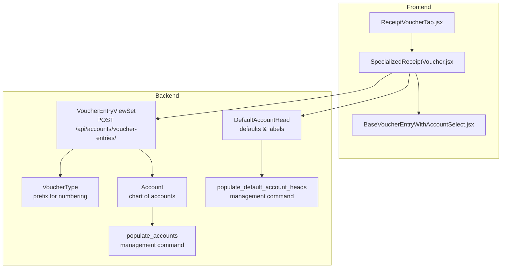
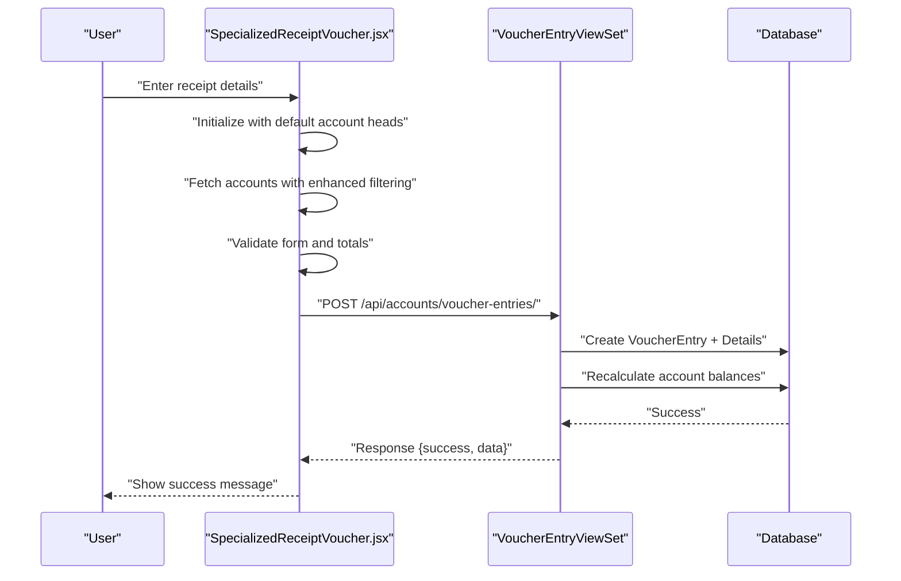
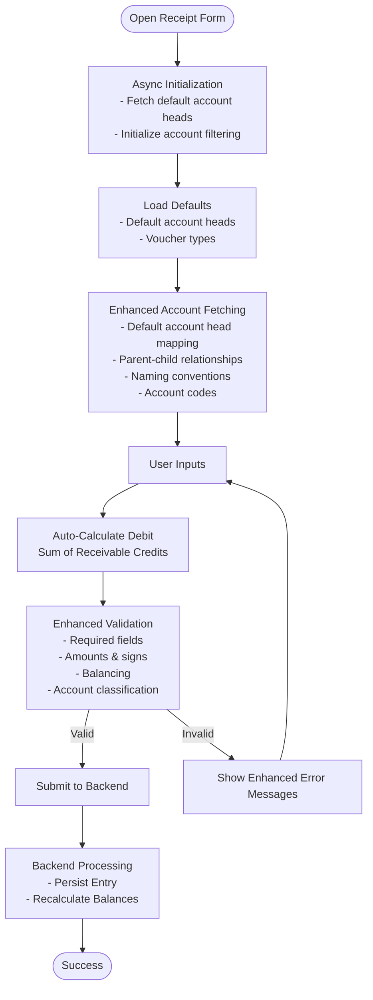
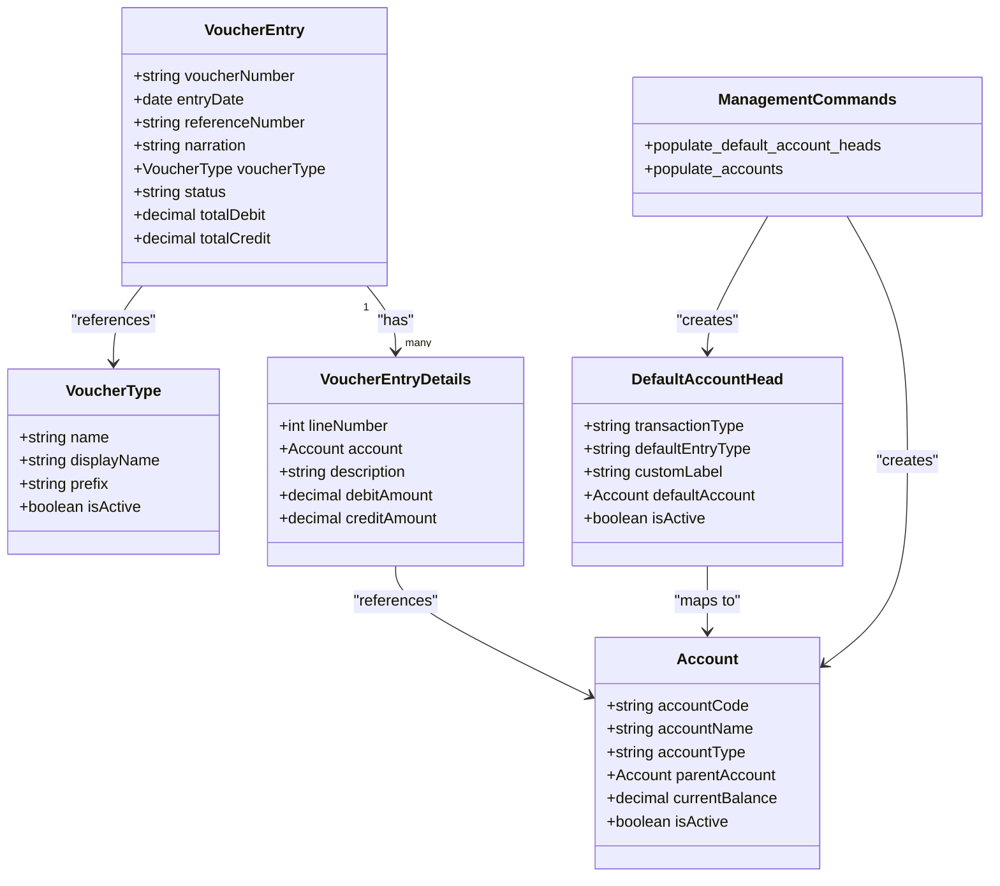
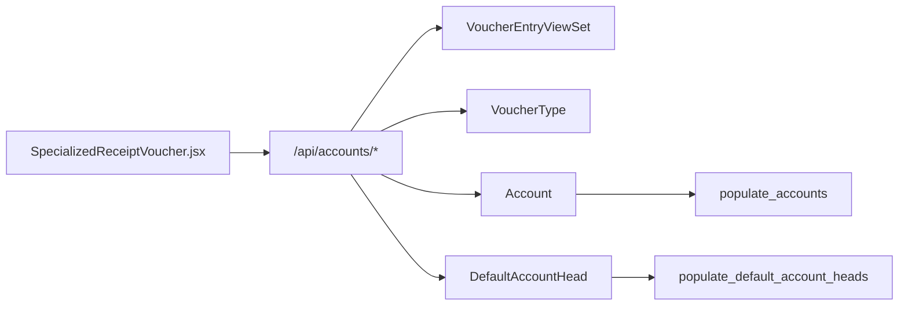

# Receipt Voucher Tab

<cite>
**Referenced Files in This Document**
- [ReceiptVoucherTab.jsx](file://frontend/src/Features/FinancialEntry/ReceiptVoucherTab.jsx)
- [SpecializedReceiptVoucher.jsx](file://frontend/src/Features/FinancialEntry/SpecializedReceiptVoucher.jsx)
- [BaseVoucherEntryWithAccountSelect.jsx](file://frontend/src/Features/FinancialEntry/BaseVoucherEntryWithAccountSelect.jsx)
- [models.py](file://backend/accounts/models.py)
- [views.py](file://backend/accounts/views.py)
- [serializers.py](file://backend/accounts/serializers.py)
- [urls.py](file://backend/accounts/urls.py)
- [populate_default_account_heads.py](file://backend/accounts/management/commands/populate_default_account_heads.py)
- [populate_accounts.py](file://backend/accounts/management/commands/populate_accounts.py)
</cite>

## Update Summary
**Changes Made**
- Enhanced account filtering logic with comprehensive default account head integration
- Improved asynchronous initialization with better loading states and error handling
- Added sophisticated account classification system with multiple filtering criteria
- Updated backend models to support enhanced account head management
- Integrated management commands for systematic account configuration

## Table of Contents
1. [Introduction](#introduction)
2. [Project Structure](#project-structure)
3. [Core Components](#core-components)
4. [Architecture Overview](#architecture-overview)
5. [Detailed Component Analysis](#detailed-component-analysis)
6. [Enhanced Account Classification System](#enhanced-account-classification-system)
7. [Dependency Analysis](#dependency-analysis)
8. [Performance Considerations](#performance-considerations)
9. [Troubleshooting Guide](#troubleshooting-guide)
10. [Conclusion](#conclusion)

## Introduction
This document explains the Receipt Voucher Tab component responsible for creating cash receipts, bank deposits, and customer payment entries. The component now features enhanced account filtering logic with default account head integration, improved loading states, and comprehensive account classification system. It covers the income account classification, receipt numbering system, automated receipt generation, integration with the chart of accounts for proper income categorization and tax reporting, and the end-to-end workflow for saving and posting entries. It also outlines validation rules, compliance requirements, and practical examples of different receipt scenarios.

## Project Structure
The Receipt Voucher Tab is implemented as a specialized financial entry form integrated into the Financial Entry feature set. The frontend component orchestrates user input, validation, and submission, while the backend enforces accounting rules, maintains balances, and persists entries. The system now includes enhanced account classification through default account head configurations.

**Diagram sources**
- [ReceiptVoucherTab.jsx](file://frontend/src/Features/FinancialEntry/ReceiptVoucherTab.jsx#L1-L16)
- [SpecializedReceiptVoucher.jsx](file://frontend/src/Features/FinancialEntry/SpecializedReceiptVoucher.jsx#L1-L792)
- [BaseVoucherEntryWithAccountSelect.jsx](file://frontend/src/Features/FinancialEntry/BaseVoucherEntryWithAccountSelect.jsx#L1-L712)
- [views.py](file://backend/accounts/views.py#L261-L481)
- [models.py](file://backend/accounts/models.py#L159-L225)
- [models.py](file://backend/accounts/models.py#L9-L65)
- [models.py](file://backend/accounts/models.py#L333-L410)
- [populate_default_account_heads.py](file://backend/accounts/management/commands/populate_default_account_heads.py#L1-L382)
- [populate_accounts.py](file://backend/accounts/management/commands/populate_accounts.py#L1-L911)

**Section sources**
- [ReceiptVoucherTab.jsx](file://frontend/src/Features/FinancialEntry/ReceiptVoucherTab.jsx#L1-L16)
- [SpecializedReceiptVoucher.jsx](file://frontend/src/Features/FinancialEntry/SpecializedReceiptVoucher.jsx#L1-L792)
- [BaseVoucherEntryWithAccountSelect.jsx](file://frontend/src/Features/FinancialEntry/BaseVoucherEntryWithAccountSelect.jsx#L1-L712)
- [views.py](file://backend/accounts/views.py#L261-L481)
- [models.py](file://backend/accounts/models.py#L9-L65)
- [models.py](file://backend/accounts/models.py#L159-L225)
- [models.py](file://backend/accounts/models.py#L333-L410)

## Core Components
- **ReceiptVoucherTab**: Thin wrapper that renders the specialized receipt form with preset title and save callback.
- **SpecializedReceiptVoucher**: Full-featured receipt form with automatic debit/credit assignment, income account filtering, and validation tailored for receipts.
- **BaseVoucherEntryWithAccountSelect**: Shared base logic for voucher entry forms using the AccountHeadSelect component.

**Updated** Enhanced with asynchronous initialization, comprehensive account classification, and improved error handling.

Key capabilities:
- **Income account classification**: Receivable accounts are filtered and used as credit entries for receipts.
- **Main account restriction**: Bank/Cash/MFS accounts are used as the single debit entry.
- **Automated receipt generation**: Total credits from receivable lines automatically populate the main bank/cash debit line.
- **Receipt numbering**: Backend generates sequential numbers using voucher type prefixes and date-based sequences.
- **Integration with chart of accounts**: Uses default account heads and account hierarchy for classification and validation.
- **Enhanced account filtering**: Multiple criteria including default account heads, parent-child relationships, naming conventions, and account codes.
- **Asynchronous initialization**: Improved loading states and better user experience.
- **Validation and compliance**: Enforces balancing, positive amounts, and duplicate prevention across accounts.

**Section sources**
- [ReceiptVoucherTab.jsx](file://frontend/src/Features/FinancialEntry/ReceiptVoucherTab.jsx#L1-L16)
- [SpecializedReceiptVoucher.jsx](file://frontend/src/Features/FinancialEntry/SpecializedReceiptVoucher.jsx#L1-L792)
- [BaseVoucherEntryWithAccountSelect.jsx](file://frontend/src/Features/FinancialEntry/BaseVoucherEntryWithAccountSelect.jsx#L1-L712)

## Architecture Overview
The Receipt Voucher Tab integrates frontend form logic with backend accounting services. The frontend filters accounts by type, computes totals, and submits entries. The backend validates totals, applies posting rules, recalculates balances, and persists entries. The system now includes enhanced account classification through default account head configurations.

**Diagram sources**
- [SpecializedReceiptVoucher.jsx](file://frontend/src/Features/FinancialEntry/SpecializedReceiptVoucher.jsx#L60-L67)
- [SpecializedReceiptVoucher.jsx](file://frontend/src/Features/FinancialEntry/SpecializedReceiptVoucher.jsx#L94-L154)
- [SpecializedReceiptVoucher.jsx](file://frontend/src/Features/FinancialEntry/SpecializedReceiptVoucher.jsx#L404-L473)
- [views.py](file://backend/accounts/views.py#L327-L346)
- [models.py](file://backend/accounts/models.py#L201-L284)

**Section sources**
- [SpecializedReceiptVoucher.jsx](file://frontend/src/Features/FinancialEntry/SpecializedReceiptVoucher.jsx#L60-L67)
- [SpecializedReceiptVoucher.jsx](file://frontend/src/Features/FinancialEntry/SpecializedReceiptVoucher.jsx#L94-L154)
- [SpecializedReceiptVoucher.jsx](file://frontend/src/Features/FinancialEntry/SpecializedReceiptVoucher.jsx#L404-L473)
- [views.py](file://backend/accounts/views.py#L327-L346)
- [models.py](file://backend/accounts/models.py#L201-L284)

## Detailed Component Analysis

### ReceiptVoucherTab
- **Purpose**: Renders the specialized receipt form with a fixed title and reloads the page after successful save.
- **Behavior**: Passes props to SpecializedReceiptVoucher to configure the form for receipts.

**Section sources**
- [ReceiptVoucherTab.jsx](file://frontend/src/Features/FinancialEntry/ReceiptVoucherTab.jsx#L1-L16)

### SpecializedReceiptVoucher
- **Purpose**: Handles receipt creation with automatic debit/credit assignment and strict validation.
- **Main account head (Bank/Cash/MFS)**: Required and restricted to asset-type accounts via filtering.
- **Receivable accounts**: Filtered to revenue-type accounts for credit entries.
- **Automatic calculation**: Total credits from receivable lines populate the main bank/cash debit line.
- **Enhanced account filtering**: Uses default account heads, parent-child relationships, naming conventions, and account codes.
- **Asynchronous initialization**: Improved loading states and better user experience.
- **Validation rules**:
  - Voucher type must be resolved.
  - Main Bank/Cash account is mandatory.
  - At least one receivable line is required.
  - Each line requires a valid account and exactly one of debit/credit.
  - Amounts must be positive and greater than zero.
  - Duplicate accounts cannot appear on both debit and credit sides.
  - Totals must balance for saving.
- **Submission**:
  - Draft mode saves as "draft".
  - Posting requires balanced totals and sets status to "posted".

**Updated** Enhanced with comprehensive account classification system and improved error handling.

**Diagram sources**
- [SpecializedReceiptVoucher.jsx](file://frontend/src/Features/FinancialEntry/SpecializedReceiptVoucher.jsx#L60-L67)
- [SpecializedReceiptVoucher.jsx](file://frontend/src/Features/FinancialEntry/SpecializedReceiptVoucher.jsx#L69-L79)
- [SpecializedReceiptVoucher.jsx](file://frontend/src/Features/FinancialEntry/SpecializedReceiptVoucher.jsx#L94-L154)
- [SpecializedReceiptVoucher.jsx](file://frontend/src/Features/FinancialEntry/SpecializedReceiptVoucher.jsx#L301-L402)
- [SpecializedReceiptVoucher.jsx](file://frontend/src/Features/FinancialEntry/SpecializedReceiptVoucher.jsx#L404-L473)

**Section sources**
- [SpecializedReceiptVoucher.jsx](file://frontend/src/Features/FinancialEntry/SpecializedReceiptVoucher.jsx#L1-L792)

### Backend Accounting Model and Workflow
- **Voucher types** define prefixes for numbering (e.g., "Receipt Voucher" uses a prefix).
- **Voucher entries** enforce:
  - Balanced totals for posted entries.
  - Positive amounts.
  - Unique line numbers.
- **Default account heads** provide mapping for transaction types and default entry types, enabling consistent classification.
- **Account model** supports hierarchical chart of accounts with balance calculations.
- **Enhanced account filtering** through default account head configurations.

**Updated** Enhanced with comprehensive default account head management and systematic account population.

**Diagram sources**
- [models.py](file://backend/accounts/models.py#L159-L225)
- [models.py](file://backend/accounts/models.py#L201-L331)
- [models.py](file://backend/accounts/models.py#L9-L65)
- [models.py](file://backend/accounts/models.py#L333-L410)
- [populate_default_account_heads.py](file://backend/accounts/management/commands/populate_default_account_heads.py#L1-L382)
- [populate_accounts.py](file://backend/accounts/management/commands/populate_accounts.py#L1-L911)

**Section sources**
- [models.py](file://backend/accounts/models.py#L9-L65)
- [models.py](file://backend/accounts/models.py#L159-L225)
- [models.py](file://backend/accounts/models.py#L201-L331)
- [models.py](file://backend/accounts/models.py#L333-L410)
- [populate_default_account_heads.py](file://backend/accounts/management/commands/populate_default_account_heads.py#L1-L382)
- [populate_accounts.py](file://backend/accounts/management/commands/populate_accounts.py#L1-L911)

## Enhanced Account Classification System

### Default Account Head Integration
The system now includes comprehensive default account head configurations that provide intelligent account filtering and classification:

- **Transaction Type Mapping**: Maps common financial transaction types to default accounts
- **Entry Type Classification**: Automatically determines whether accounts should be debited or credited
- **Hierarchical Organization**: Supports complex account structures with parent-child relationships
- **Flexible Configuration**: Allows custom transaction types beyond predefined categories

### Enhanced Account Filtering Logic
The account filtering system now employs multiple criteria for accurate classification:

1. **Default Account Head Configuration**: Primary method using predefined mappings
2. **Parent-Child Relationships**: Identifies accounts based on hierarchical relationships
3. **Naming Conventions**: Filters accounts based on descriptive naming patterns
4. **Account Codes**: Uses standardized accounting code structures
5. **Account Types**: Traditional classification by account type (asset, revenue, etc.)

### Management Commands
Systematic account configuration through management commands:

- **populate_default_account_heads**: Creates comprehensive default mappings for all financial categories
- **populate_accounts**: Generates complete chart of accounts with proper hierarchies
- **Automated Setup**: Streamlines initial system configuration

**Section sources**
- [populate_default_account_heads.py](file://backend/accounts/management/commands/populate_default_account_heads.py#L1-L382)
- [populate_accounts.py](file://backend/accounts/management/commands/populate_accounts.py#L1-L911)
- [SpecializedReceiptVoucher.jsx](file://frontend/src/Features/FinancialEntry/SpecializedReceiptVoucher.jsx#L106-L154)

## Dependency Analysis
- **Frontend depends on**:
  - AccountHeadSelect for searchable account selection.
  - axiosInstance for API calls.
  - Backend endpoints for accounts, voucher types, and voucher entries.
  - Default account head configurations for enhanced filtering.
- **Backend depends on**:
  - VoucherEntryViewSet for CRUD operations and posting.
  - VoucherType for numbering prefixes.
  - Account and DefaultAccountHead for classification and validation.
  - Management commands for systematic account configuration.

**Diagram sources**
- [SpecializedReceiptVoucher.jsx](file://frontend/src/Features/FinancialEntry/SpecializedReceiptVoucher.jsx#L1-L10)
- [urls.py](file://backend/accounts/urls.py#L13-L24)
- [views.py](file://backend/accounts/views.py#L261-L481)
- [models.py](file://backend/accounts/models.py#L159-L225)
- [models.py](file://backend/accounts/models.py#L9-L65)
- [models.py](file://backend/accounts/models.py#L333-L410)
- [populate_default_account_heads.py](file://backend/accounts/management/commands/populate_default_account_heads.py#L1-L382)
- [populate_accounts.py](file://backend/accounts/management/commands/populate_accounts.py#L1-L911)

**Section sources**
- [SpecializedReceiptVoucher.jsx](file://frontend/src/Features/FinancialEntry/SpecializedReceiptVoucher.jsx#L1-L10)
- [urls.py](file://backend/accounts/urls.py#L13-L24)
- [views.py](file://backend/accounts/views.py#L261-L481)
- [models.py](file://backend/accounts/models.py#L159-L225)
- [models.py](file://backend/accounts/models.py#L9-L65)
- [models.py](file://backend/accounts/models.py#L333-L410)

## Performance Considerations
- **Enhanced filtering accounts by type** reduces UI rendering and selection complexity.
- **Client-side totals computation** avoids unnecessary server round trips during editing.
- **Backend validation** prevents invalid entries from persisting, reducing downstream corrections.
- **Balance recalculation** occurs only upon posting, minimizing overhead for drafts.
- **Asynchronous initialization** improves user experience with better loading states.
- **Default account head caching** reduces repeated API calls for account classification.

## Troubleshooting Guide
Common issues and resolutions:
- **Entry not balanced**: Ensure total debits equal total credits before saving or posting.
- **Missing main Bank/Cash account**: Select a valid asset-type account for the main line.
- **No receivable accounts available**: Confirm revenue-type accounts exist and are active.
- **Validation errors on save**: Review per-line requirements (account, amounts, sign exclusivity).
- **Posting blocked**: Verify the entry is balanced and not already posted.
- **Account filtering issues**: Check default account head configurations and account hierarchies.
- **Loading state problems**: Verify asynchronous initialization and error handling.

**Updated** Enhanced troubleshooting for new account classification features.

Operational checks:
- Confirm voucher types and prefixes are configured in the backend.
- Verify default account heads for income and cash categories.
- Ensure accounts are active and properly categorized.
- Check management command execution for systematic account setup.
- Validate account hierarchy relationships and naming conventions.

**Section sources**
- [SpecializedReceiptVoucher.jsx](file://frontend/src/Features/FinancialEntry/SpecializedReceiptVoucher.jsx#L301-L402)
- [views.py](file://backend/accounts/views.py#L401-L443)
- [models.py](file://backend/accounts/models.py#L267-L276)

## Conclusion
The Receipt Voucher Tab provides a robust, validated interface for recording cash receipts, bank deposits, and customer payments. The enhanced system leverages comprehensive account classification through default account head integration, enforces strict accounting rules, and integrates seamlessly with backend services for numbering, persistence, and balance maintenance. The component ensures compliance through client-side validation and server-side enforcement, supporting accurate financial reporting and tax categorization. The asynchronous initialization and improved error handling provide a superior user experience while maintaining the system's reliability and accuracy.