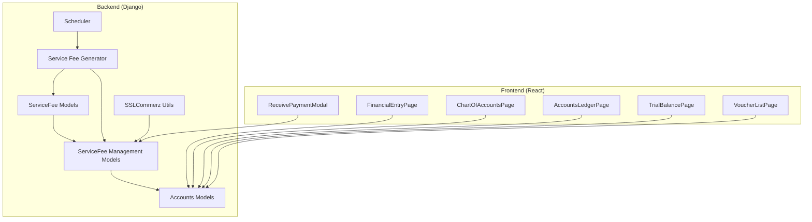
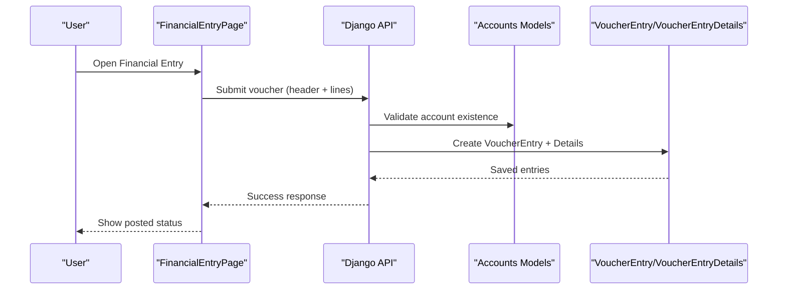
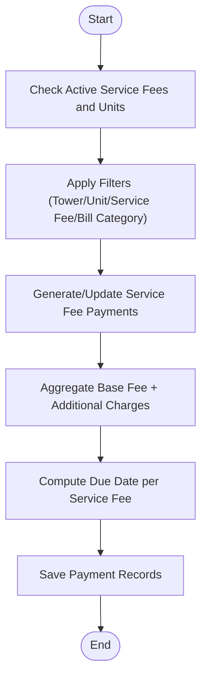
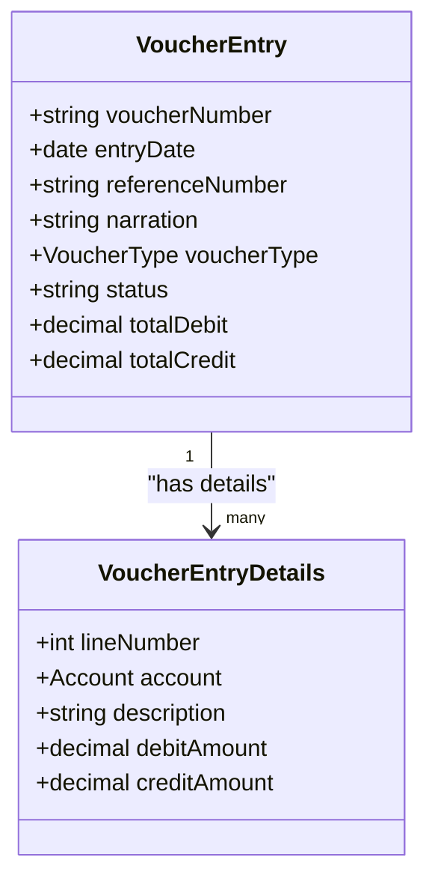
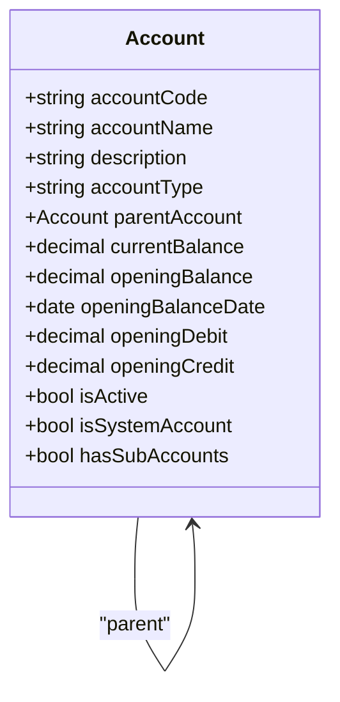
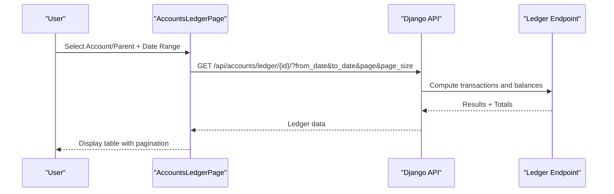
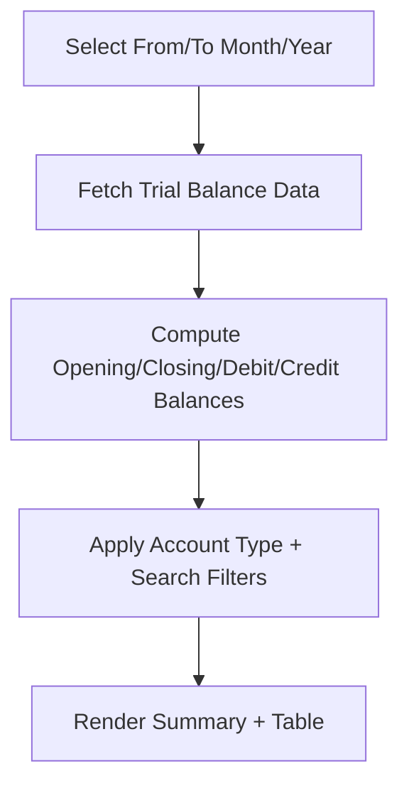
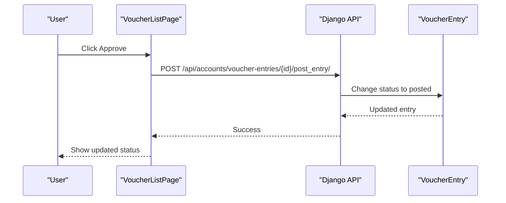
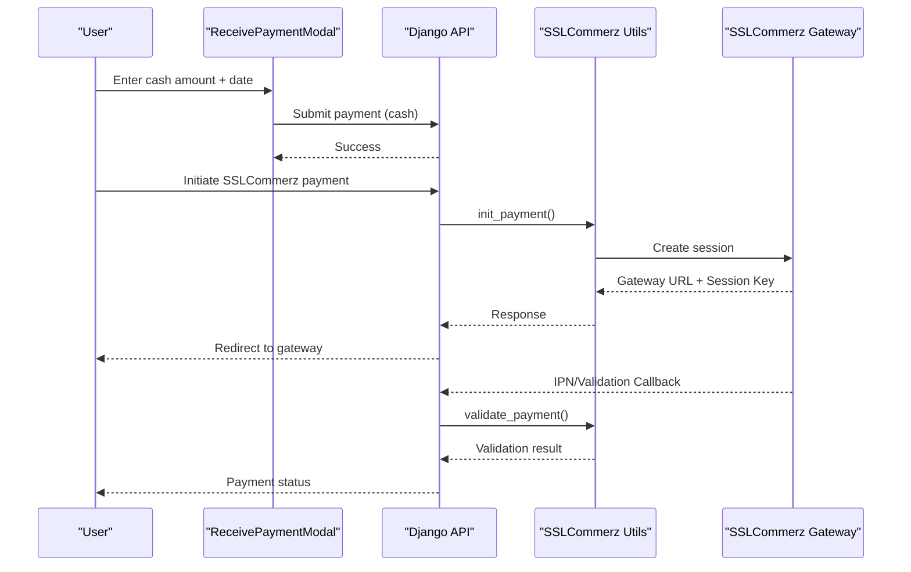
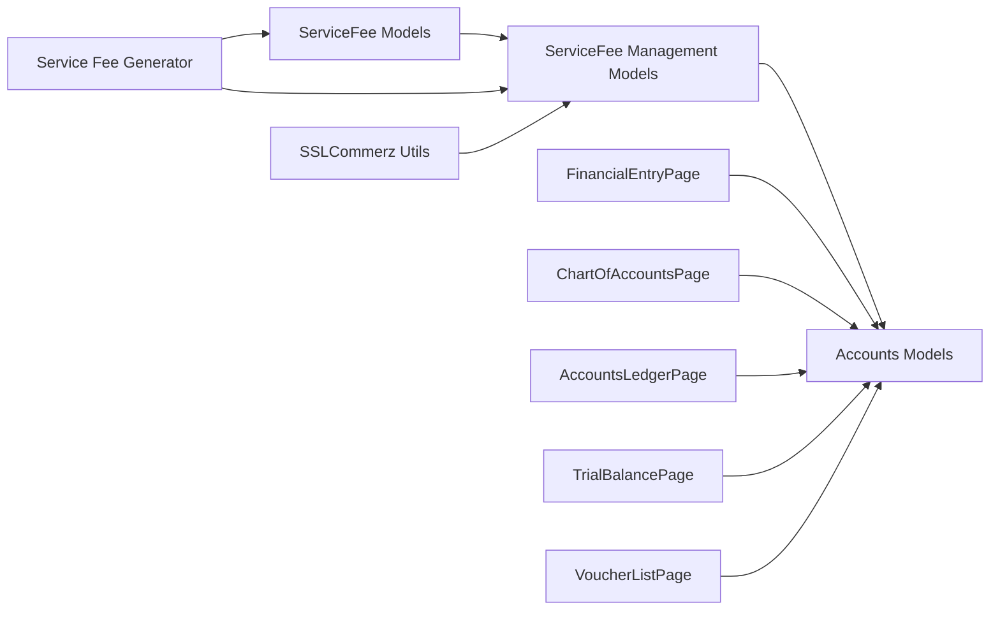

# Financial Systems

<cite>
**Referenced Files in This Document**
- [models.py](file://backend/service_fee/models.py)
- [models.py](file://backend/accounts/models.py)
- [models.py](file://backend/service_fee_management/models.py)
- [service_fee_generator.py](file://backend/service_fee_management/utils/service_fee_generator.py)
- [sslcommerz_utils.py](file://backend/service_fee_management/utils/sslcommerz_utils.py)
- [scheduler.py](file://backend/service_fee_management/scheduler.py)
- [FinancialEntryPage.jsx](file://frontend/src/Features/FinancialEntry/FinancialEntryPage.jsx)
- [ReceivePaymentModal.jsx](file://frontend/src/Features/ServiceFeeManagement/Payments/components/ReceivePaymentModal.jsx)
- [ChartOfAccountsPage.jsx](file://frontend/src/Features/ChartOfAccounts/ChartOfAccountsPage.jsx)
- [AccountsLedgerPage.jsx](file://frontend/src/Features/AccountsLedger/AccountsLedgerPage.jsx)
- [TrialBalancePage.jsx](file://frontend/src/Features/TrialBalance/TrialBalancePage.jsx)
- [VoucherListPage.jsx](file://frontend/src/Features/Vouchers/VoucherListPage.jsx)
</cite>

## Table of Contents
1. [Introduction](#introduction)
2. [Project Structure](#project-structure)
3. [Core Components](#core-components)
4. [Architecture Overview](#architecture-overview)
5. [Detailed Component Analysis](#detailed-component-analysis)
6. [Dependency Analysis](#dependency-analysis)
7. [Performance Considerations](#performance-considerations)
8. [Troubleshooting Guide](#troubleshooting-guide)
9. [Conclusion](#conclusion)

## Introduction
This document provides comprehensive documentation for the financial systems within the Estate Link application. It covers the service fee payment processing system, financial entry management, chart of accounts, ledger management, trial balance reporting, and voucher management. The documentation explains automated billing generation, payment collection workflows, penalty calculations, payment history tracking, and integration patterns with external payment gateways.

## Project Structure
The financial systems span both the backend (Django) and frontend (React) layers:
- Backend: Django models define service fees, billing, payments, reminders, chart of accounts, ledgers, and trial balance. Utilities orchestrate automated generation and payment gateway integration.
- Frontend: React pages implement financial entry forms, chart of accounts management, ledger viewing, trial balance reports, and voucher list management with detail/edit capabilities.

**Diagram sources**
- [models.py](file://backend/service_fee/models.py#L10-L470)
- [models.py](file://backend/accounts/models.py#L9-L410)
- [models.py](file://backend/service_fee_management/models.py#L11-L800)
- [service_fee_generator.py](file://backend/service_fee_management/utils/service_fee_generator.py#L15-L800)
- [sslcommerz_utils.py](file://backend/service_fee_management/utils/sslcommerz_utils.py#L20-L336)
- [scheduler.py](file://backend/service_fee_management/scheduler.py#L10-L78)
- [FinancialEntryPage.jsx](file://frontend/src/Features/FinancialEntry/FinancialEntryPage.jsx#L14-L145)
- [ChartOfAccountsPage.jsx](file://frontend/src/Features/ChartOfAccounts/ChartOfAccountsPage.jsx#L31-L756)
- [AccountsLedgerPage.jsx](file://frontend/src/Features/AccountsLedger/AccountsLedgerPage.jsx#L15-L429)
- [TrialBalancePage.jsx](file://frontend/src/Features/TrialBalance/TrialBalancePage.jsx#L17-L877)
- [VoucherListPage.jsx](file://frontend/src/Features/Vouchers/VoucherListPage.jsx#L24-L1016)
- [ReceivePaymentModal.jsx](file://frontend/src/Features/ServiceFeeManagement/Payments/components/ReceivePaymentModal.jsx#L6-L164)

**Section sources**
- [models.py](file://backend/service_fee/models.py#L10-L470)
- [models.py](file://backend/accounts/models.py#L9-L410)
- [models.py](file://backend/service_fee_management/models.py#L11-L800)
- [service_fee_generator.py](file://backend/service_fee_management/utils/service_fee_generator.py#L15-L800)
- [sslcommerz_utils.py](file://backend/service_fee_management/utils/sslcommerz_utils.py#L20-L336)
- [scheduler.py](file://backend/service_fee_management/scheduler.py#L10-L78)
- [FinancialEntryPage.jsx](file://frontend/src/Features/FinancialEntry/FinancialEntryPage.jsx#L14-L145)
- [ChartOfAccountsPage.jsx](file://frontend/src/Features/ChartOfAccounts/ChartOfAccountsPage.jsx#L31-L756)
- [AccountsLedgerPage.jsx](file://frontend/src/Features/AccountsLedger/AccountsLedgerPage.jsx#L15-L429)
- [TrialBalancePage.jsx](file://frontend/src/Features/TrialBalance/TrialBalancePage.jsx#L17-L877)
- [VoucherListPage.jsx](file://frontend/src/Features/Vouchers/VoucherListPage.jsx#L24-L1016)
- [ReceivePaymentModal.jsx](file://frontend/src/Features/ServiceFeeManagement/Payments/components/ReceivePaymentModal.jsx#L6-L164)

## Core Components
- Service Fee Models: Define fee settings, payment methods, due dates, late penalty tiers, and history tracking.
- Service Fee Management Models: Separate billing and payment transactions, supporting partial payments, waivers, reminders, and payment methods.
- Accounts Models: Chart of accounts, voucher types, voucher entries, and default account heads for standardized posting.
- Service Fee Generator: Automated monthly billing generation with filtering and regeneration logic.
- SSLCommerz Integration: Payment initiation and validation utilities for online payments.
- Scheduler: Background thread to periodically generate missing months of service fees.
- Frontend Financial Entry: Unified interface for journal, receipt, payment, and contra entries.
- Frontend Chart of Accounts: Manage accounts with tree/table views, search, and CRUD operations.
- Frontend Ledger: Individual and consolidated ledger views with filters and pagination.
- Frontend Trial Balance: Period-based trial balance with summaries and export/print.
- Frontend Vouchers: List, detail, edit, and approval workflows for voucher entries.

**Section sources**
- [models.py](file://backend/service_fee/models.py#L10-L470)
- [models.py](file://backend/service_fee_management/models.py#L11-L800)
- [models.py](file://backend/accounts/models.py#L9-L410)
- [service_fee_generator.py](file://backend/service_fee_management/utils/service_fee_generator.py#L15-L800)
- [sslcommerz_utils.py](file://backend/service_fee_management/utils/sslcommerz_utils.py#L20-L336)
- [scheduler.py](file://backend/service_fee_management/scheduler.py#L10-L78)
- [FinancialEntryPage.jsx](file://frontend/src/Features/FinancialEntry/FinancialEntryPage.jsx#L14-L145)
- [ChartOfAccountsPage.jsx](file://frontend/src/Features/ChartOfAccounts/ChartOfAccountsPage.jsx#L31-L756)
- [AccountsLedgerPage.jsx](file://frontend/src/Features/AccountsLedger/AccountsLedgerPage.jsx#L15-L429)
- [TrialBalancePage.jsx](file://frontend/src/Features/TrialBalance/TrialBalancePage.jsx#L17-L877)
- [VoucherListPage.jsx](file://frontend/src/Features/Vouchers/VoucherListPage.jsx#L24-L1016)

## Architecture Overview
The financial architecture follows a layered pattern:
- Data Layer: Django models encapsulate domain entities for service fees, billing, payments, accounts, and vouchers.
- Business Logic Layer: Utilities orchestrate billing generation and payment gateway integration.
- API Layer: Django REST Framework endpoints serve data to the frontend.
- Presentation Layer: React pages implement financial workflows and reporting.

**Diagram sources**
- [FinancialEntryPage.jsx](file://frontend/src/Features/FinancialEntry/FinancialEntryPage.jsx#L14-L145)
- [models.py](file://backend/accounts/models.py#L201-L331)

**Section sources**
- [FinancialEntryPage.jsx](file://frontend/src/Features/FinancialEntry/FinancialEntryPage.jsx#L14-L145)
- [models.py](file://backend/accounts/models.py#L201-L331)

## Detailed Component Analysis

### Service Fee Payment Processing System
The system automates billing generation, payment collection, penalty calculations, and payment history tracking.

- Automated Billing Generation
  - Monthly generation based on active service fees and units with owners.
  - Filters by tower, unit, service fee, and bill categories.
  - Supports force regeneration and partial updates.
  - Calculates due dates per service fee and aggregates base fee plus additional bill categories.

- Payment Collection and History
  - Separate billing and payment records to support partial payments.
  - Tracks payment status, result status, and remaining amounts.
  - Payment methods include cash, MFS providers, bank transfer, and SSLCommerz.

- Penalty Calculations
  - Configurable late penalty tiers per service fee.
  - Penalty waiver history with types (full, partial percentage, partial fixed).

- Reminders and Scheduling
  - Reminder configurations with timing rules, audiences, and channels.
  - Scheduler thread periodically generates missing months.

**Diagram sources**
- [service_fee_generator.py](file://backend/service_fee_management/utils/service_fee_generator.py#L15-L800)
- [models.py](file://backend/service_fee/models.py#L10-L470)
- [models.py](file://backend/service_fee_management/models.py#L11-L800)

**Section sources**
- [service_fee_generator.py](file://backend/service_fee_management/utils/service_fee_generator.py#L15-L800)
- [models.py](file://backend/service_fee/models.py#L10-L470)
- [models.py](file://backend/service_fee_management/models.py#L11-L800)
- [scheduler.py](file://backend/service_fee_management/scheduler.py#L10-L78)

### Financial Entry System
The financial entry system supports journal entries, receipt vouchers, payment vouchers, and contra entries with specialized forms.

- Tabs and Components
  - Journal Entry, Receipt Voucher, Payment Voucher, Contra Entry tabs.
  - Specialized forms for each entry type with dynamic line items.

- Accounting Principles
  - Voucher entries maintain debits and credits equality when posted.
  - Default account heads configured for standardized posting.

**Diagram sources**
- [models.py](file://backend/accounts/models.py#L201-L331)

**Section sources**
- [FinancialEntryPage.jsx](file://frontend/src/Features/FinancialEntry/FinancialEntryPage.jsx#L14-L145)
- [models.py](file://backend/accounts/models.py#L201-L331)

### Chart of Accounts Management
Manages account hierarchy, selection components, and tree visualization.

- Features
  - Table and Tree view modes.
  - Search by account code/name/description/type/parent.
  - CRUD operations with validation (opening debit/credit XOR, system account protection).
  - Balance recalculation on opening balance changes.

- Account Hierarchy
  - Self-referencing parent-child relationships.
  - Sub-account presence flag updated automatically.

**Diagram sources**
- [models.py](file://backend/accounts/models.py#L9-L156)

**Section sources**
- [ChartOfAccountsPage.jsx](file://frontend/src/Features/ChartOfAccounts/ChartOfAccountsPage.jsx#L31-L756)
- [models.py](file://backend/accounts/models.py#L9-L156)

### Ledger Management System
Provides individual and consolidated ledger views with filters and pagination.

- Capabilities
  - Individual account ledger with opening/closing balances and totals.
  - Consolidated ledger for parent accounts including sub-accounts.
  - Date range filtering and export/print support.

**Diagram sources**
- [AccountsLedgerPage.jsx](file://frontend/src/Features/AccountsLedger/AccountsLedgerPage.jsx#L87-L138)
- [models.py](file://backend/accounts/models.py#L201-L331)

**Section sources**
- [AccountsLedgerPage.jsx](file://frontend/src/Features/AccountsLedger/AccountsLedgerPage.jsx#L15-L429)
- [models.py](file://backend/accounts/models.py#L201-L331)

### Trial Balance Reporting System
Generates trial balance for a selected period with summaries and filtering.

- Features
  - Period selection (month/year).
  - Account type filter and search.
  - Summary cards (total accounts, total debit, total credit, balance status).
  - Paginated desktop/tablet/mobile views.

**Diagram sources**
- [TrialBalancePage.jsx](file://frontend/src/Features/TrialBalance/TrialBalancePage.jsx#L53-L133)
- [models.py](file://backend/accounts/models.py#L201-L331)

**Section sources**
- [TrialBalancePage.jsx](file://frontend/src/Features/TrialBalance/TrialBalancePage.jsx#L17-L877)
- [models.py](file://backend/accounts/models.py#L201-L331)

### Voucher Management
Encompasses list, detail, edit, and approval workflows.

- List Page
  - Filters: voucher type, status, date range, search.
  - Actions: view details, edit (draft only), approve (draft to posted), delete (draft only).
  - Pagination and skeleton loading.

- Detail/Edit Modals
  - Detail modal displays voucher header and lines.
  - Edit modal enables modifications for draft entries.

**Diagram sources**
- [VoucherListPage.jsx](file://frontend/src/Features/Vouchers/VoucherListPage.jsx#L268-L318)
- [models.py](file://backend/accounts/models.py#L201-L331)

**Section sources**
- [VoucherListPage.jsx](file://frontend/src/Features/Vouchers/VoucherListPage.jsx#L24-L1016)
- [models.py](file://backend/accounts/models.py#L201-L331)

### Payment Workflow Integrations
Integrates with SSLCommerz for online payments.

- Payment Initiation
  - Builds session with SSLCommerz using store credentials and transaction details.
  - Returns gateway URL and session key for redirect.

- Payment Validation
  - Validates payment using SSLCommerz validation API.
  - Verifies transaction ID and amount.

- Hash Verification
  - Verifies IPN callback hashes using store password and verify key.

**Diagram sources**
- [ReceivePaymentModal.jsx](file://frontend/src/Features/ServiceFeeManagement/Payments/components/ReceivePaymentModal.jsx#L26-L41)
- [sslcommerz_utils.py](file://backend/service_fee_management/utils/sslcommerz_utils.py#L52-L266)

**Section sources**
- [ReceivePaymentModal.jsx](file://frontend/src/Features/ServiceFeeManagement/Payments/components/ReceivePaymentModal.jsx#L6-L164)
- [sslcommerz_utils.py](file://backend/service_fee_management/utils/sslcommerz_utils.py#L20-L336)

### Financial Reporting Patterns and Compliance
- Compliance Features
  - Voucher entries enforce debits equal credits on posting.
  - Opening balance validation (XOR of debit/credit).
  - System account protection against deletions.
  - Audit trails for service fee changes and payment actions.

- Reporting Patterns
  - Ledger: individual and consolidated views with totals.
  - Trial Balance: period-based with summary cards and balanced status.
  - Voucher List: filtered by type/status/date range with approval workflow.

**Section sources**
- [models.py](file://backend/accounts/models.py#L66-L156)
- [models.py](file://backend/service_fee/models.py#L410-L470)
- [AccountsLedgerPage.jsx](file://frontend/src/Features/AccountsLedger/AccountsLedgerPage.jsx#L15-L429)
- [TrialBalancePage.jsx](file://frontend/src/Features/TrialBalance/TrialBalancePage.jsx#L17-L877)
- [VoucherListPage.jsx](file://frontend/src/Features/Vouchers/VoucherListPage.jsx#L24-L1016)

### Examples of Financial Workflows
- Automated Billing Generation
  - Scenario: Generate service fees for a specific month and tower.
  - Steps: Select filters → Trigger generator → Review created/updated records.

- Payment Processing
  - Scenario: Receive cash payment for a due service fee.
  - Steps: Open ReceivePaymentModal → Enter amount and date → Confirm → Close modal.

- Voucher Approval
  - Scenario: Approve a draft receipt voucher.
  - Steps: Navigate to Voucher List → Click Approve → Confirm → Observe posted status.

- Ledger Viewing
  - Scenario: View consolidated ledger for a parent account.
  - Steps: Select parent account → Choose consolidated view → Set date range → View transactions.

**Section sources**
- [service_fee_generator.py](file://backend/service_fee_management/utils/service_fee_generator.py#L15-L800)
- [ReceivePaymentModal.jsx](file://frontend/src/Features/ServiceFeeManagement/Payments/components/ReceivePaymentModal.jsx#L26-L41)
- [VoucherListPage.jsx](file://frontend/src/Features/Vouchers/VoucherListPage.jsx#L268-L318)
- [AccountsLedgerPage.jsx](file://frontend/src/Features/AccountsLedger/AccountsLedgerPage.jsx#L140-L144)

## Dependency Analysis
The system exhibits clear separation of concerns:
- Backend models depend on each other to maintain referential integrity (ServiceFee → ServiceFeePayment → ServiceFeeBilling).
- Frontend pages depend on shared components and axiosInstance for API communication.
- Payment gateway utilities are isolated and reusable across payment flows.

**Diagram sources**
- [models.py](file://backend/service_fee/models.py#L10-L470)
- [models.py](file://backend/service_fee_management/models.py#L11-L800)
- [models.py](file://backend/accounts/models.py#L9-L410)
- [service_fee_generator.py](file://backend/service_fee_management/utils/service_fee_generator.py#L15-L800)
- [sslcommerz_utils.py](file://backend/service_fee_management/utils/sslcommerz_utils.py#L20-L336)
- [FinancialEntryPage.jsx](file://frontend/src/Features/FinancialEntry/FinancialEntryPage.jsx#L14-L145)
- [ChartOfAccountsPage.jsx](file://frontend/src/Features/ChartOfAccounts/ChartOfAccountsPage.jsx#L31-L756)
- [AccountsLedgerPage.jsx](file://frontend/src/Features/AccountsLedger/AccountsLedgerPage.jsx#L15-L429)
- [TrialBalancePage.jsx](file://frontend/src/Features/TrialBalance/TrialBalancePage.jsx#L17-L877)
- [VoucherListPage.jsx](file://frontend/src/Features/Vouchers/VoucherListPage.jsx#L24-L1016)

**Section sources**
- [models.py](file://backend/service_fee/models.py#L10-L470)
- [models.py](file://backend/service_fee_management/models.py#L11-L800)
- [models.py](file://backend/accounts/models.py#L9-L410)
- [service_fee_generator.py](file://backend/service_fee_management/utils/service_fee_generator.py#L15-L800)
- [sslcommerz_utils.py](file://backend/service_fee_management/utils/sslcommerz_utils.py#L20-L336)
- [FinancialEntryPage.jsx](file://frontend/src/Features/FinancialEntry/FinancialEntryPage.jsx#L14-L145)
- [ChartOfAccountsPage.jsx](file://frontend/src/Features/ChartOfAccounts/ChartOfAccountsPage.jsx#L31-L756)
- [AccountsLedgerPage.jsx](file://frontend/src/Features/AccountsLedger/AccountsLedgerPage.jsx#L15-L429)
- [TrialBalancePage.jsx](file://frontend/src/Features/TrialBalance/TrialBalancePage.jsx#L17-L877)
- [VoucherListPage.jsx](file://frontend/src/Features/Vouchers/VoucherListPage.jsx#L24-L1016)

## Performance Considerations
- Database Indexes
  - Accounts: accountCode, isActive, accountType.
  - VoucherEntry: voucherNumber, entryDate, status, voucherType.
  - ServiceFeePayment: created_at, unit, service_fee, service_period_month/year.
- Bulk Operations
  - Service fee generator uses bulk_create/bulk_update to minimize database round trips.
- Pagination
  - Ledger and trial balance pages implement pagination to limit payload sizes.
- Asynchronous Processing
  - Scheduler runs in a background thread to avoid blocking the main process.

[No sources needed since this section provides general guidance]

## Troubleshooting Guide
- Voucher Posting Failures
  - Ensure debits equal credits before posting.
  - Verify account existence and activation.

- Payment Issues
  - Validate SSLCommerz credentials and session API endpoints.
  - Confirm transaction ID and amount match during validation.

- Ledger Discrepancies
  - Recalculate account balances after opening balance changes.
  - Check voucher posting status and timing.

- Missing Billing Records
  - Use scheduler to generate missing months.
  - Verify filters and date ranges in billing generation.

**Section sources**
- [models.py](file://backend/accounts/models.py#L267-L277)
- [sslcommerz_utils.py](file://backend/service_fee_management/utils/sslcommerz_utils.py#L164-L266)
- [models.py](file://backend/accounts/models.py#L127-L156)
- [scheduler.py](file://backend/service_fee_management/scheduler.py#L10-L78)

## Conclusion
The Estate Link financial systems provide a robust foundation for managing service fees, accounting entries, chart of accounts, ledgers, trial balance reporting, and voucher workflows. The backend leverages Django models and utilities to automate billing and integrate with payment gateways, while the frontend offers intuitive interfaces for financial operations and reporting. The modular design supports scalability, compliance, and efficient maintenance.