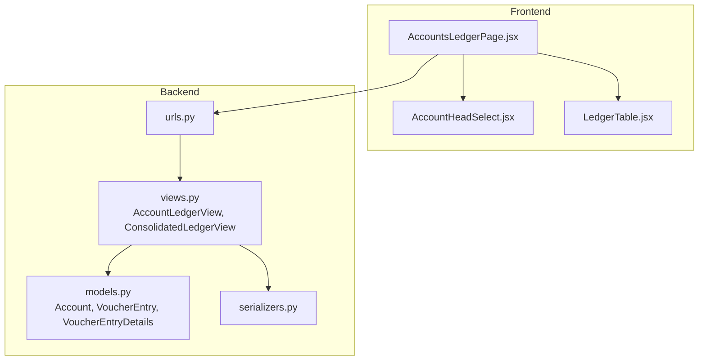
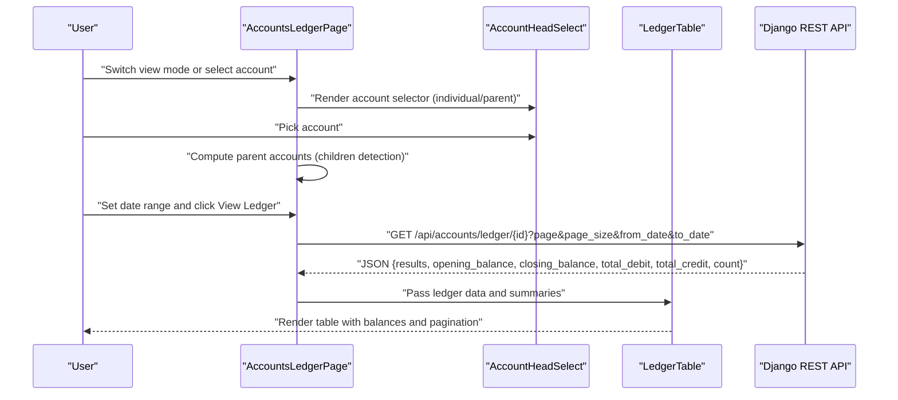
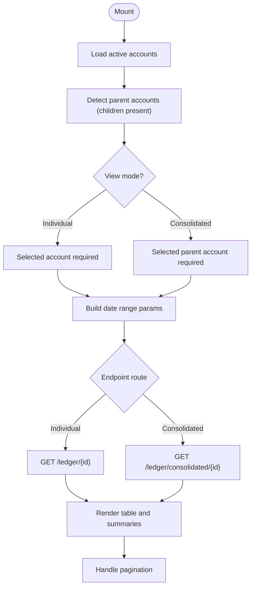
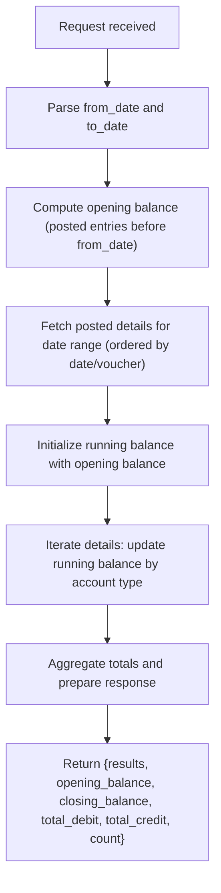
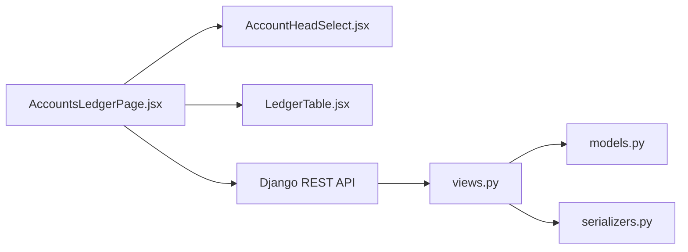

# Accounts Ledger Management

<cite>
**Referenced Files in This Document**
- [AccountsLedgerPage.jsx](file://frontend/src/Features/AccountsLedger/AccountsLedgerPage.jsx)
- [LedgerTable.jsx](file://frontend/src/Features/AccountsLedger/components/LedgerTable.jsx)
- [AccountHeadSelect.jsx](file://frontend/src/Components/AccountHeadSelect/AccountHeadSelect.jsx)
- [views.py](file://backend/accounts/views.py)
- [models.py](file://backend/accounts/models.py)
- [urls.py](file://backend/accounts/urls.py)
- [serializers.py](file://backend/accounts/serializers.py)
</cite>

## Table of Contents
1. [Introduction](#introduction)
2. [Project Structure](#project-structure)
3. [Core Components](#core-components)
4. [Architecture Overview](#architecture-overview)
5. [Detailed Component Analysis](#detailed-component-analysis)
6. [Dependency Analysis](#dependency-analysis)
7. [Performance Considerations](#performance-considerations)
8. [Troubleshooting Guide](#troubleshooting-guide)
9. [Conclusion](#conclusion)

## Introduction
This document explains the Accounts Ledger Management system, focusing on:
- Individual account ledger functionality for tracking transaction histories and maintaining account balances
- Consolidated ledger view for parent accounts showing all sub-account transactions combined
- Filtering capabilities (date range selection, account selection, view mode switching)
- Ledger table display with transaction details, debit/credit amounts, running balances, and pagination
- Account head selection component, parent account detection logic, and dynamic endpoint routing
- Example workflows for ledger viewing, account balance calculations, and report generation

## Project Structure
The Accounts Ledger feature spans the frontend React application and the backend Django REST API:
- Frontend: A dedicated page component orchestrates filters, requests, and renders the ledger table
- Backend: Dedicated API endpoints compute balances, paginate results, and return structured data

**Diagram sources**
- [AccountsLedgerPage.jsx](file://frontend/src/Features/AccountsLedger/AccountsLedgerPage.jsx#L1-L429)
- [AccountHeadSelect.jsx](file://frontend/src/Components/AccountHeadSelect/AccountHeadSelect.jsx#L1-L416)
- [LedgerTable.jsx](file://frontend/src/Features/AccountsLedger/components/LedgerTable.jsx#L1-L263)
- [urls.py](file://backend/accounts/urls.py#L1-L25)
- [views.py](file://backend/accounts/views.py#L727-L800)
- [models.py](file://backend/accounts/models.py#L9-L410)
- [serializers.py](file://backend/accounts/serializers.py#L1-L513)

**Section sources**
- [AccountsLedgerPage.jsx](file://frontend/src/Features/AccountsLedger/AccountsLedgerPage.jsx#L1-L429)
- [urls.py](file://backend/accounts/urls.py#L1-L25)

## Core Components
- AccountsLedgerPage: Orchestrates filters, loads accounts, computes parent accounts, selects endpoints, fetches ledger data, and renders summary and pagination
- LedgerTable: Renders the ledger table, summary cards, and pagination controls
- AccountHeadSelect: Provides searchable account selection with optional account code display
- Backend Views: Implements individual and consolidated ledger endpoints, pagination, and balance calculations

Key responsibilities:
- Frontend
  - Manage view mode (individual vs consolidated)
  - Detect parent accounts from the account tree
  - Build dynamic endpoints based on selection and date range
  - Paginate and render ledger data
- Backend
  - Compute opening/closing balances and running balances per transaction
  - Aggregate totals and counts for pagination and summaries
  - Enforce permissions and return structured JSON

**Section sources**
- [AccountsLedgerPage.jsx](file://frontend/src/Features/AccountsLedger/AccountsLedgerPage.jsx#L15-L138)
- [LedgerTable.jsx](file://frontend/src/Features/AccountsLedger/components/LedgerTable.jsx#L3-L263)
- [AccountHeadSelect.jsx](file://frontend/src/Components/AccountHeadSelect/AccountHeadSelect.jsx#L32-L416)
- [views.py](file://backend/accounts/views.py#L727-L800)

## Architecture Overview
The system follows a client-server pattern:
- Frontend React page triggers requests with filters and pagination
- Backend REST endpoints compute balances and return paginated results
- Frontend renders summaries, transaction rows, and pagination controls

**Diagram sources**
- [AccountsLedgerPage.jsx](file://frontend/src/Features/AccountsLedger/AccountsLedgerPage.jsx#L87-L138)
- [AccountHeadSelect.jsx](file://frontend/src/Components/AccountHeadSelect/AccountHeadSelect.jsx#L86-L107)
- [LedgerTable.jsx](file://frontend/src/Features/AccountsLedger/components/LedgerTable.jsx#L33-L246)
- [views.py](file://backend/accounts/views.py#L727-L800)

## Detailed Component Analysis

### AccountsLedgerPage
Responsibilities:
- Loads active accounts and detects parent accounts (accounts with children)
- Switches between individual and consolidated view modes
- Builds dynamic endpoints based on selection and date range
- Handles pagination and displays summaries and empty states

Key behaviors:
- Parent account detection: An account is considered a parent if any account lists it as parentAccount
- Endpoint routing:
  - Individual: GET /api/accounts/ledger/{account_id}/
  - Consolidated: GET /api/accounts/ledger/consolidated/{parent_account_id}/
- Pagination: Uses page and page_size query parameters; computes total pages and records
- Summaries: Displays opening balance, closing balance, total debit, and total credit

**Diagram sources**
- [AccountsLedgerPage.jsx](file://frontend/src/Features/AccountsLedger/AccountsLedgerPage.jsx#L60-L138)

**Section sources**
- [AccountsLedgerPage.jsx](file://frontend/src/Features/AccountsLedger/AccountsLedgerPage.jsx#L21-L138)

### LedgerTable
Responsibilities:
- Renders summary cards for opening balance, total debit, total credit, and closing balance
- Renders transaction rows with date, voucher number, particulars, and amounts
- Shows running balance per row and supports consolidated view with account column
- Provides pagination controls with previous/next and page buttons

Rendering highlights:
- Opening balance row and closing balance row
- Conditional rendering of account column in consolidated mode
- Currency formatting and color-coded balances (green/red)
- Pagination UI with ellipsis for large page ranges

**Section sources**
- [LedgerTable.jsx](file://frontend/src/Features/AccountsLedger/components/LedgerTable.jsx#L33-L246)

### AccountHeadSelect
Responsibilities:
- Provides searchable dropdown for account selection
- Supports optional account code display alongside names
- Handles selection, clearing, keyboard navigation, and outside clicks
- Displays loading state and filtered results

Selection logic:
- Filters accounts by name/code search
- Maintains selected account state and invokes onChange callback
- Supports accessibility attributes and focus management

**Section sources**
- [AccountHeadSelect.jsx](file://frontend/src/Components/AccountHeadSelect/AccountHeadSelect.jsx#L86-L107)

### Backend Ledger Endpoints and Calculations
Endpoints:
- Individual ledger: GET /api/accounts/ledger/{account_id}/
- Consolidated ledger: GET /api/accounts/ledger/consolidated/{parent_account_id}/

Core calculations:
- Opening balance: Sum of posted debits minus credits before from_date (account-type dependent)
- Running balance: Updated per transaction row based on account type
- Totals: Total debit and total credit for the period
- Pagination: Page size 20 with page_size parameter

**Diagram sources**
- [views.py](file://backend/accounts/views.py#L727-L800)
- [models.py](file://backend/accounts/models.py#L127-L156)

**Section sources**
- [views.py](file://backend/accounts/views.py#L727-L800)
- [models.py](file://backend/accounts/models.py#L127-L156)

## Dependency Analysis
Frontend dependencies:
- AccountsLedgerPage depends on AccountHeadSelect for account selection and LedgerTable for rendering
- Uses axiosInstance for API calls and manages loading/error/success states

Backend dependencies:
- AccountLedgerView and ConsolidatedLedgerView depend on Account, VoucherEntry, and VoucherEntryDetails models
- Serializers and models define data shapes and validations

**Diagram sources**
- [AccountsLedgerPage.jsx](file://frontend/src/Features/AccountsLedger/AccountsLedgerPage.jsx#L1-L13)
- [urls.py](file://backend/accounts/urls.py#L19-L24)
- [views.py](file://backend/accounts/views.py#L727-L800)
- [models.py](file://backend/accounts/models.py#L9-L410)
- [serializers.py](file://backend/accounts/serializers.py#L1-L513)

**Section sources**
- [AccountsLedgerPage.jsx](file://frontend/src/Features/AccountsLedger/AccountsLedgerPage.jsx#L1-L13)
- [urls.py](file://backend/accounts/urls.py#L19-L24)

## Performance Considerations
- Pagination: Page size is fixed at 20; backend enforces max_page_size to limit payload
- Indexes: Models include database indexes on frequently queried fields (e.g., accountCode, isActive, accountType)
- Query efficiency: Backend queries are scoped to posted status and date ranges; ordering ensures consistent pagination
- Frontend rendering: Large tables are paginated; skeleton loaders improve perceived performance during initial load

Recommendations:
- Ensure database indexes remain aligned with query filters (accountCode, isActive, accountType)
- Monitor pagination performance for very large date ranges and consider server-side optimizations
- Debounce search in AccountHeadSelect for large datasets

**Section sources**
- [views.py](file://backend/accounts/views.py#L721-L725)
- [models.py](file://backend/accounts/models.py#L55-L61)

## Troubleshooting Guide
Common issues and resolutions:
- Missing selections
  - Individual mode requires a selected account; consolidated mode requires a selected parent account
  - Resolution: Ensure a valid selection before clicking View Ledger
- Empty results
  - No transactions found for the selected account/date range
  - Resolution: Adjust date range or select a different account
- API errors
  - Backend returns user-friendly messages for validation or permission issues
  - Resolution: Check console/network tab for error details and adjust filters accordingly
- Parent account mismatch
  - Parent account type must match child account type
  - Resolution: Select a compatible parent account or adjust account type

**Section sources**
- [AccountsLedgerPage.jsx](file://frontend/src/Features/AccountsLedger/AccountsLedgerPage.jsx#L87-L138)
- [views.py](file://backend/accounts/views.py#L733-L755)

## Conclusion
The Accounts Ledger Management system provides a robust, user-friendly interface for viewing both individual and consolidated account ledgers. It integrates seamlessly with backend calculations for balances and pagination, offering:
- Flexible filtering by date range and account selection
- Clear presentation of transaction details, running balances, and totals
- Efficient pagination and responsive rendering
- Secure, permission-enforced access to financial data