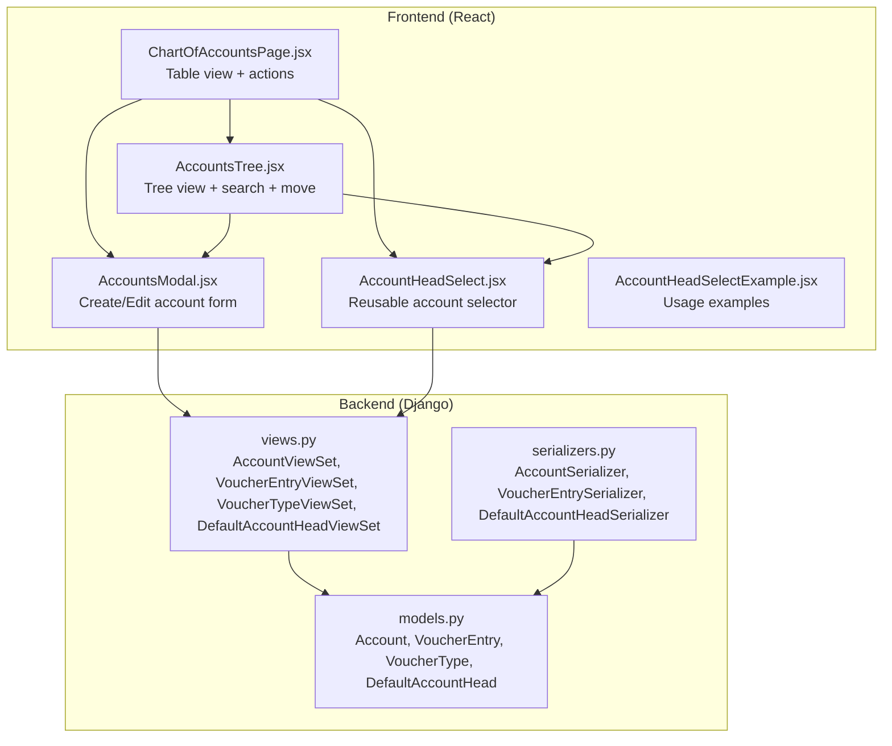
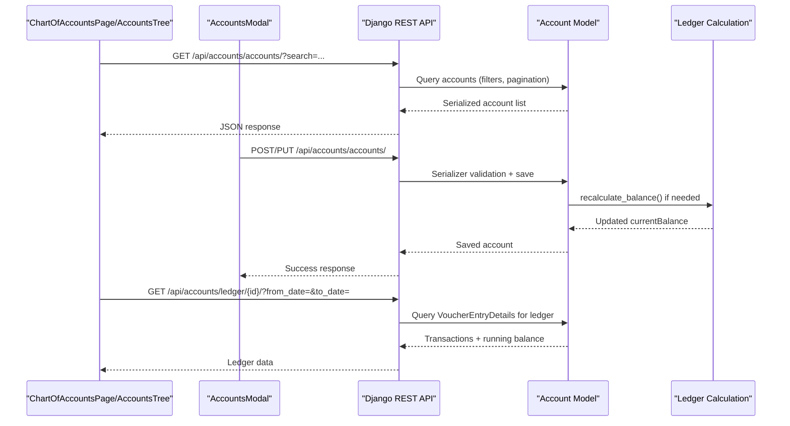
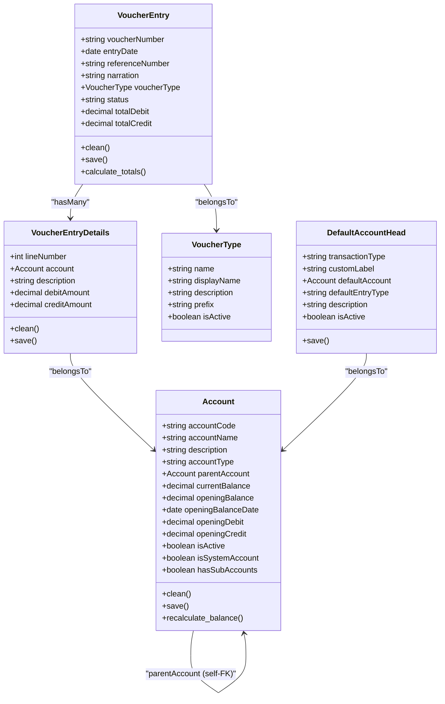
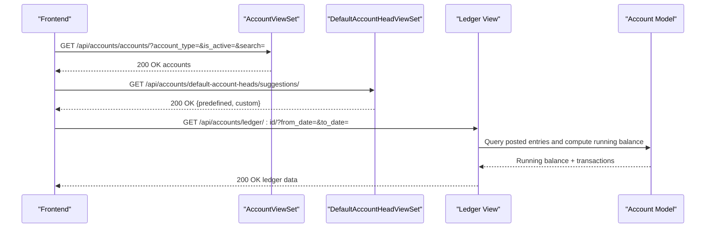
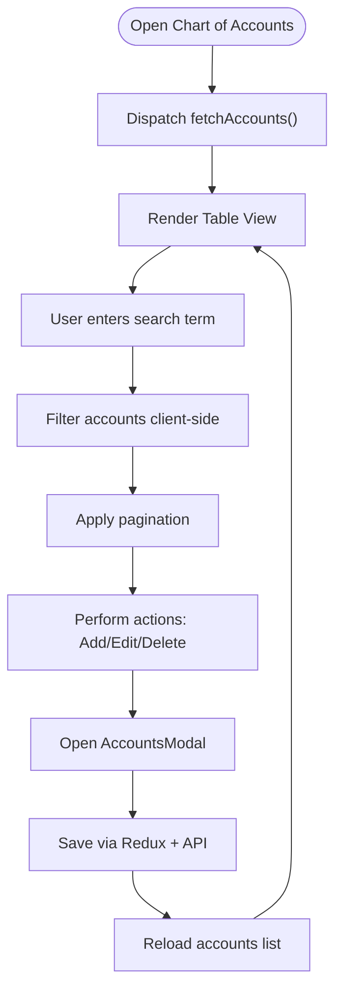
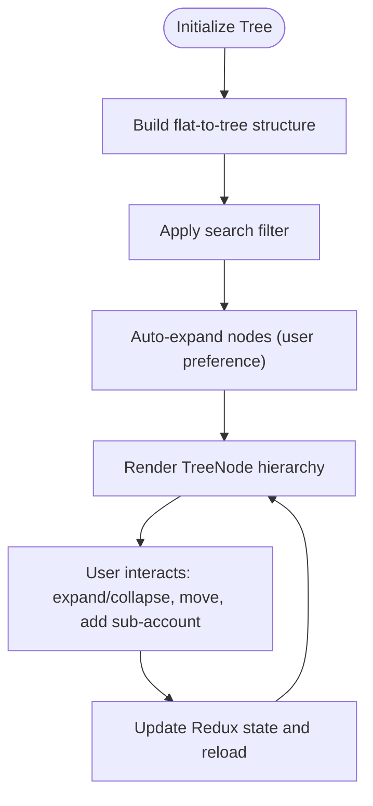
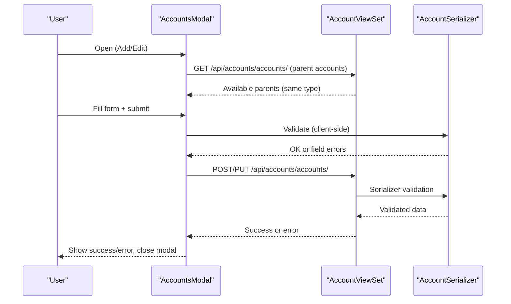
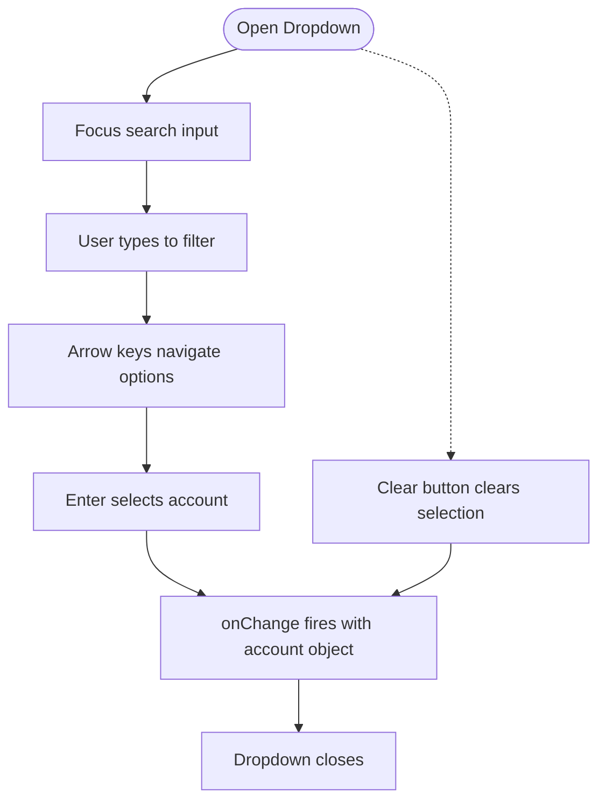
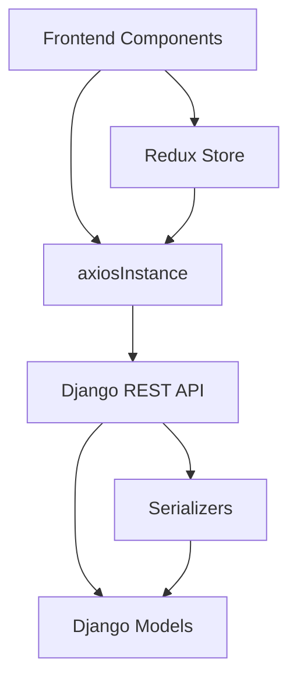

# Chart of Accounts Integration

<cite>
**Referenced Files in This Document**
- [models.py](file://backend/accounts/models.py)
- [views.py](file://backend/accounts/views.py)
- [serializers.py](file://backend/accounts/serializers.py)
- [ChartOfAccountsPage.jsx](file://frontend/src/Features/ChartOfAccounts/ChartOfAccountsPage.jsx)
- [AccountsTree.jsx](file://frontend/src/Features/ChartOfAccounts/components/AccountsTree.jsx)
- [AccountsModal.jsx](file://frontend/src/Features/ChartOfAccounts/components/AccountsModal.jsx)
- [AccountHeadSelect.jsx](file://frontend/src/Components/AccountHeadSelect/AccountHeadSelect.jsx)
- [AccountHeadSelectExample.jsx](file://frontend/src/Components/AccountHeadSelect/AccountHeadSelectExample.jsx)
</cite>

## Table of Contents
1. [Introduction](#introduction)
2. [Project Structure](#project-structure)
3. [Core Components](#core-components)
4. [Architecture Overview](#architecture-overview)
5. [Detailed Component Analysis](#detailed-component-analysis)
6. [Dependency Analysis](#dependency-analysis)
7. [Performance Considerations](#performance-considerations)
8. [Troubleshooting Guide](#troubleshooting-guide)
9. [Conclusion](#conclusion)

## Introduction
This document provides comprehensive documentation for the chart of accounts integration system. It explains the hierarchical account structure with parent-child relationships and account classifications, details the accounts tree visualization for navigating the chart hierarchy, describes the account modal system for creating, editing, and managing account configurations, covers the account head selection components used across financial modules, documents validation rules and classification schemes, and includes practical examples of chart configuration workflows and integration with financial reporting systems.

## Project Structure
The chart of accounts integration spans both backend Django models and frontend React components:
- Backend: Defines the Account model with hierarchical relationships, validation rules, and balance calculation logic; exposes REST APIs via ViewSets for CRUD operations and ledger queries.
- Frontend: Provides two primary views—table and tree—to browse and manage accounts, along with modals for creation/editing and a reusable account head selection component integrated across financial modules.

**Diagram sources**
- [models.py](file://backend/accounts/models.py#L9-L156)
- [views.py](file://backend/accounts/views.py#L26-L235)
- [serializers.py](file://backend/accounts/serializers.py#L7-L215)
- [ChartOfAccountsPage.jsx](file://frontend/src/Features/ChartOfAccounts/ChartOfAccountsPage.jsx#L31-L756)
- [AccountsTree.jsx](file://frontend/src/Features/ChartOfAccounts/components/AccountsTree.jsx#L44-L955)
- [AccountsModal.jsx](file://frontend/src/Features/ChartOfAccounts/components/AccountsModal.jsx#L13-L892)
- [AccountHeadSelect.jsx](file://frontend/src/Components/AccountHeadSelect/AccountHeadSelect.jsx#L32-L416)
- [AccountHeadSelectExample.jsx](file://frontend/src/Components/AccountHeadSelect/AccountHeadSelectExample.jsx#L9-L307)

**Section sources**
- [models.py](file://backend/accounts/models.py#L9-L156)
- [views.py](file://backend/accounts/views.py#L26-L235)
- [ChartOfAccountsPage.jsx](file://frontend/src/Features/ChartOfAccounts/ChartOfAccountsPage.jsx#L31-L756)
- [AccountsTree.jsx](file://frontend/src/Features/ChartOfAccounts/components/AccountsTree.jsx#L44-L955)
- [AccountsModal.jsx](file://frontend/src/Features/ChartOfAccounts/components/AccountsModal.jsx#L13-L892)
- [AccountHeadSelect.jsx](file://frontend/src/Components/AccountHeadSelect/AccountHeadSelect.jsx#L32-L416)
- [AccountHeadSelectExample.jsx](file://frontend/src/Components/AccountHeadSelect/AccountHeadSelectExample.jsx#L9-L307)

## Core Components
This section outlines the core components and their responsibilities:

- Backend Models
  - Account: Hierarchical chart of accounts with parent-child relationships, classification types, opening balances, and current balance recalculation.
  - VoucherEntry/VoucherEntryDetails: Transaction recording linked to accounts for financial reporting.
  - VoucherType: Defines voucher categories (Receipt, Payment, Journal, Contra).
  - DefaultAccountHead: Maps transaction types to default accounts for streamlined financial entry workflows.

- Frontend Views
  - ChartOfAccountsPage: Table view with search, pagination, and actions; toggles between table and tree modes.
  - AccountsTree: Interactive tree view with search, expand/collapse, add sub-account, move account, and delete controls.
  - AccountsModal: Unified form for creating and editing accounts with client-side and server-side validation.
  - AccountHeadSelect: Reusable searchable dropdown for selecting account heads across financial forms.

**Section sources**
- [models.py](file://backend/accounts/models.py#L9-L156)
- [views.py](file://backend/accounts/views.py#L26-L235)
- [ChartOfAccountsPage.jsx](file://frontend/src/Features/ChartOfAccounts/ChartOfAccountsPage.jsx#L31-L756)
- [AccountsTree.jsx](file://frontend/src/Features/ChartOfAccounts/components/AccountsTree.jsx#L44-L955)
- [AccountsModal.jsx](file://frontend/src/Features/ChartOfAccounts/components/AccountsModal.jsx#L13-L892)
- [AccountHeadSelect.jsx](file://frontend/src/Components/AccountHeadSelect/AccountHeadSelect.jsx#L32-L416)

## Architecture Overview
The system follows a layered architecture:
- Backend REST APIs expose account management and ledger capabilities.
- Frontend components consume these APIs to render interactive charts and forms.
- Validation occurs both on the client and server to ensure data integrity.

**Diagram sources**
- [views.py](file://backend/accounts/views.py#L26-L235)
- [models.py](file://backend/accounts/models.py#L127-L156)
- [ChartOfAccountsPage.jsx](file://frontend/src/Features/ChartOfAccounts/ChartOfAccountsPage.jsx#L61-L63)
- [AccountsTree.jsx](file://frontend/src/Features/ChartOfAccounts/components/AccountsTree.jsx#L88-L90)
- [AccountsModal.jsx](file://frontend/src/Features/ChartOfAccounts/components/AccountsModal.jsx#L244-L296)

## Detailed Component Analysis

### Backend: Account Model and Validation
The Account model defines:
- Classification types: Asset, Liability, Equity, Revenue, Expense.
- Hierarchical structure via parentAccount with related_name "subAccounts".
- Opening balance inputs (debit/credit) with XOR validation and automatic balance computation.
- Current balance recalculated from posted voucher entries.

Key behaviors:
- clean() enforces XOR for openingDebit/openingCredit and computes openingBalance based on account type.
- save() triggers recalculation when opening balance values change and updates hasSubAccounts.
- recalculate_balance() aggregates posted debit/credit entries and adjusts balance per account type.

**Diagram sources**
- [models.py](file://backend/accounts/models.py#L9-L156)

**Section sources**
- [models.py](file://backend/accounts/models.py#L9-L156)

### Backend: REST API Endpoints and Permissions
The backend exposes ViewSets with granular permissions:
- AccountViewSet: CRUD for accounts with filtering by type, activity, and search; includes toggle_status and parent_accounts endpoints.
- VoucherEntryViewSet: CRUD for transactions with posting/voiding and balance recalculation.
- VoucherTypeViewSet: Read-only list of active voucher types.
- DefaultAccountHeadViewSet: Manage default account mappings with suggestions and uniqueness validation.

**Diagram sources**
- [views.py](file://backend/accounts/views.py#L26-L235)
- [views.py](file://backend/accounts/views.py#L524-L718)
- [views.py](file://backend/accounts/views.py#L727-L892)

**Section sources**
- [views.py](file://backend/accounts/views.py#L26-L235)
- [views.py](file://backend/accounts/views.py#L524-L718)
- [views.py](file://backend/accounts/views.py#L727-L892)

### Frontend: Chart of Accounts Page (Table View)
The ChartOfAccountsPage provides:
- Search across account code, name, description, type, and parent name.
- Pagination and sorting.
- Action buttons: Add, Edit, Delete with appropriate constraints (system accounts, sub-accounts, voucher entries).
- Real-time updates after modal saves.

**Diagram sources**
- [ChartOfAccountsPage.jsx](file://frontend/src/Features/ChartOfAccounts/ChartOfAccountsPage.jsx#L61-L116)

**Section sources**
- [ChartOfAccountsPage.jsx](file://frontend/src/Features/ChartOfAccounts/ChartOfAccountsPage.jsx#L31-L756)

### Frontend: Accounts Tree (Hierarchical Navigation)
The AccountsTree offers:
- Hierarchical rendering with indentation and connecting lines.
- Search that expands ancestor/descendant paths for matched nodes.
- Actions: Add sub-account, Edit, Move, Delete with constraints.
- Expand/collapse state persisted per node and across filtered views.

**Diagram sources**
- [AccountsTree.jsx](file://frontend/src/Features/ChartOfAccounts/components/AccountsTree.jsx#L92-L175)

**Section sources**
- [AccountsTree.jsx](file://frontend/src/Features/ChartOfAccounts/components/AccountsTree.jsx#L44-L955)

### Frontend: Accounts Modal (Create/Edit)
The AccountsModal provides:
- Client-side validation (XOR for opening debit/credit, required fields).
- Server-side validation via Redux actions and serializers.
- Dynamic parent account filtering by type and availability.
- Error handling with preserved form data for user continuity.

**Diagram sources**
- [AccountsModal.jsx](file://frontend/src/Features/ChartOfAccounts/components/AccountsModal.jsx#L54-L76)
- [AccountsModal.jsx](file://frontend/src/Features/ChartOfAccounts/components/AccountsModal.jsx#L193-L242)
- [AccountsModal.jsx](file://frontend/src/Features/ChartOfAccounts/components/AccountsModal.jsx#L244-L483)
- [serializers.py](file://backend/accounts/serializers.py#L7-L215)

**Section sources**
- [AccountsModal.jsx](file://frontend/src/Features/ChartOfAccounts/components/AccountsModal.jsx#L13-L892)
- [serializers.py](file://backend/accounts/serializers.py#L7-L215)

### Frontend: Account Head Selection Component
The AccountHeadSelect component:
- Implements a searchable dropdown with keyboard navigation and accessibility.
- Supports optional account code display and clearable selection.
- Integrates with financial forms requiring account selection.

**Diagram sources**
- [AccountHeadSelect.jsx](file://frontend/src/Components/AccountHeadSelect/AccountHeadSelect.jsx#L140-L176)

**Section sources**
- [AccountHeadSelect.jsx](file://frontend/src/Components/AccountHeadSelect/AccountHeadSelect.jsx#L32-L416)
- [AccountHeadSelectExample.jsx](file://frontend/src/Components/AccountHeadSelect/AccountHeadSelectExample.jsx#L9-L307)

## Dependency Analysis
The system exhibits clear separation of concerns:
- Backend depends on Django ORM and DRF for models, serializers, and views.
- Frontend depends on Redux for state management and axiosInstance for API calls.
- Frontend components depend on shared UI utilities and styles.

**Diagram sources**
- [ChartOfAccountsPage.jsx](file://frontend/src/Features/ChartOfAccounts/ChartOfAccountsPage.jsx#L15-L27)
- [AccountsTree.jsx](file://frontend/src/Features/ChartOfAccounts/components/AccountsTree.jsx#L21-L42)
- [AccountsModal.jsx](file://frontend/src/Features/ChartOfAccounts/components/AccountsModal.jsx#L9-L25)
- [views.py](file://backend/accounts/views.py#L11-L18)
- [models.py](file://backend/accounts/models.py#L9-L156)
- [serializers.py](file://backend/accounts/serializers.py#L7-L215)

**Section sources**
- [ChartOfAccountsPage.jsx](file://frontend/src/Features/ChartOfAccounts/ChartOfAccountsPage.jsx#L15-L27)
- [AccountsTree.jsx](file://frontend/src/Features/ChartOfAccounts/components/AccountsTree.jsx#L21-L42)
- [AccountsModal.jsx](file://frontend/src/Features/ChartOfAccounts/components/AccountsModal.jsx#L9-L25)
- [views.py](file://backend/accounts/views.py#L11-L18)
- [models.py](file://backend/accounts/models.py#L9-L156)
- [serializers.py](file://backend/accounts/serializers.py#L7-L215)

## Performance Considerations
- Backend
  - Indexes on accountCode, isActive, accountType, and voucher-related fields improve query performance.
  - Balance recalculation is triggered only when opening balance values change to minimize unnecessary computations.
  - Posting/voiding entries recalculates balances for affected accounts to maintain consistency.

- Frontend
  - Debounced search in tree view reduces API calls during typing.
  - Client-side filtering and pagination reduce payload sizes and improve responsiveness.
  - Minimal re-renders through memoization and controlled component updates.

[No sources needed since this section provides general guidance]

## Troubleshooting Guide
Common issues and resolutions:
- Duplicate account code: Validation prevents duplicates; adjust code or contact support.
- Parent type mismatch: Parent must match child account type; select a compatible parent.
- Cannot change account name/type/parent with existing entries: Create a new account instead.
- Cannot delete account with sub-accounts or voucher entries: Remove dependencies first.
- Move conflicts: Target cannot be a descendant of source; choose a compatible parent.

**Section sources**
- [serializers.py](file://backend/accounts/serializers.py#L83-L215)
- [views.py](file://backend/accounts/views.py#L147-L190)
- [AccountsTree.jsx](file://frontend/src/Features/ChartOfAccounts/components/AccountsTree.jsx#L331-L346)
- [AccountsModal.jsx](file://frontend/src/Features/ChartOfAccounts/components/AccountsModal.jsx#L179-L190)

## Conclusion
The chart of accounts integration provides a robust, hierarchical structure for financial management with strong validation, intuitive navigation via tree/table views, and reusable components for seamless integration across financial modules. The backend ensures data integrity and accurate balance tracking, while the frontend delivers a responsive and accessible user experience for managing accounts and generating financial reports.