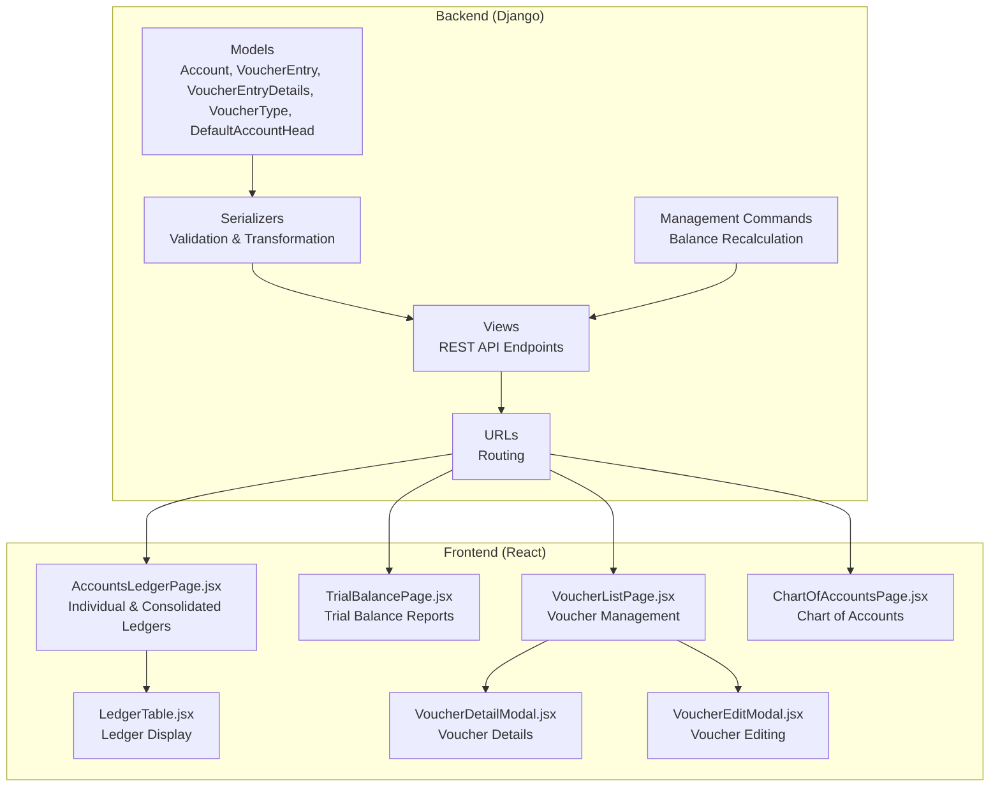
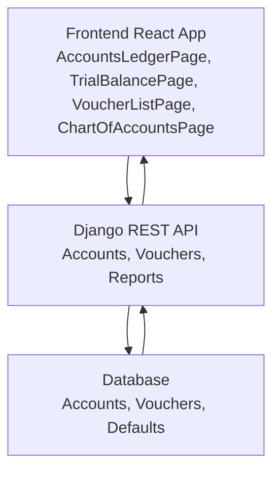
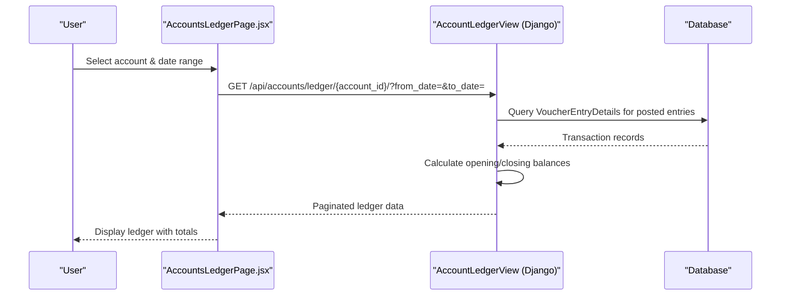
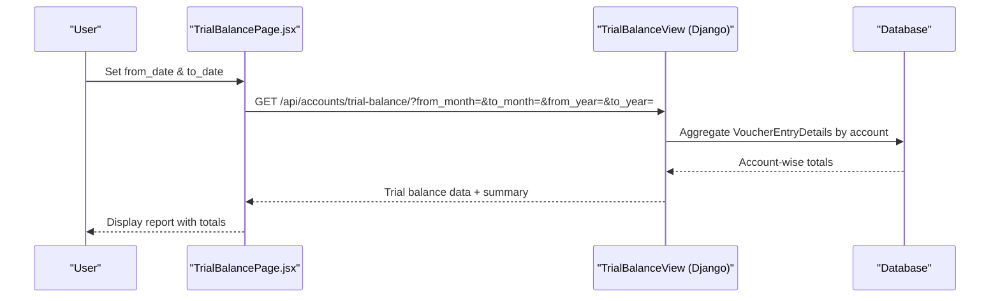
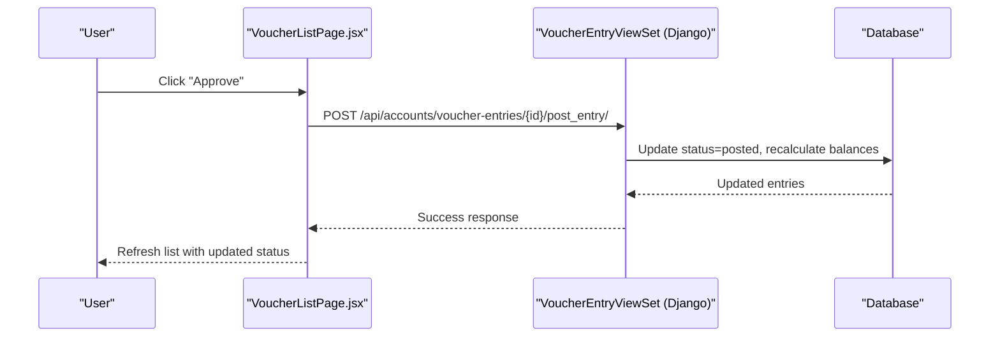
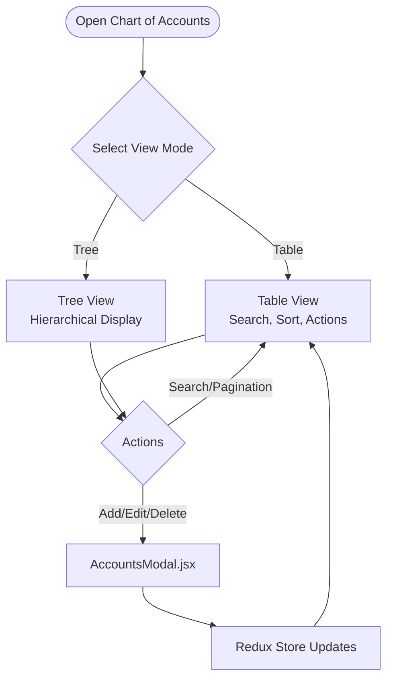
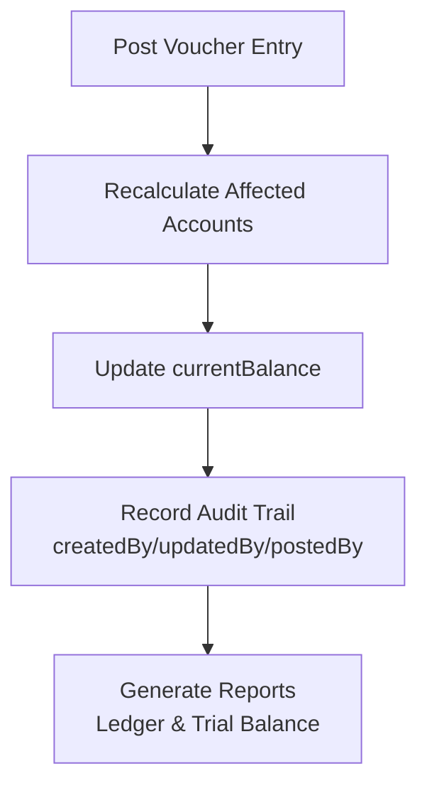
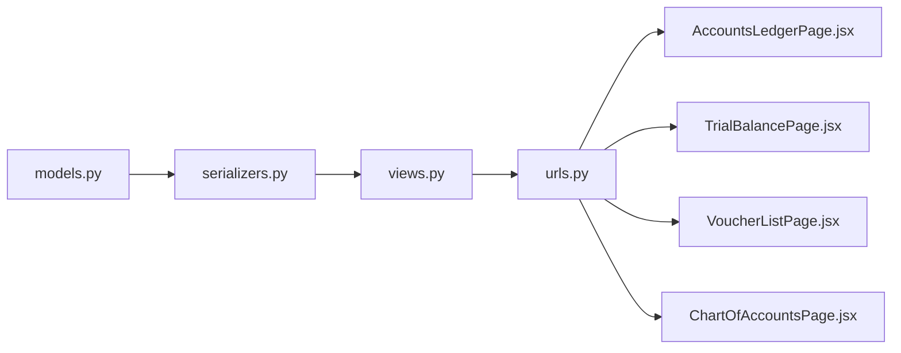

# Ledger & Accounting System

<cite>
**Referenced Files in This Document**
- [models.py](file://backend/accounts/models.py)
- [views.py](file://backend/accounts/views.py)
- [serializers.py](file://backend/accounts/serializers.py)
- [urls.py](file://backend/accounts/urls.py)
- [recalculate_account_balances.py](file://backend/accounts/management/commands/recalculate_account_balances.py)
- [AccountsLedgerPage.jsx](file://frontend/src/Features/AccountsLedger/AccountsLedgerPage.jsx)
- [LedgerTable.jsx](file://frontend/src/Features/AccountsLedger/components/LedgerTable.jsx)
- [TrialBalancePage.jsx](file://frontend/src/Features/TrialBalance/TrialBalancePage.jsx)
- [VoucherListPage.jsx](file://frontend/src/Features/Vouchers/VoucherListPage.jsx)
- [VoucherDetailModal.jsx](file://frontend/src/Features/Vouchers/VoucherDetailModal.jsx)
- [VoucherEditModal.jsx](file://frontend/src/Features/Vouchers/VoucherEditModal.jsx)
- [ChartOfAccountsPage.jsx](file://frontend/src/Features/ChartOfAccounts/ChartOfAccountsPage.jsx)
</cite>

## Table of Contents
1. [Introduction](#introduction)
2. [Project Structure](#project-structure)
3. [Core Components](#core-components)
4. [Architecture Overview](#architecture-overview)
5. [Detailed Component Analysis](#detailed-component-analysis)
6. [Dependency Analysis](#dependency-analysis)
7. [Performance Considerations](#performance-considerations)
8. [Troubleshooting Guide](#troubleshooting-guide)
9. [Conclusion](#conclusion)

## Introduction
This document provides comprehensive documentation for the ledger and accounting system components within the estate-link project. It covers the accounts ledger functionality for maintaining transaction histories and account balances, the trial balance reporting system for balance sheet generation and financial statement preparation, the voucher management system including detail views, edit capabilities, and approval workflows, the chart of accounts integration for proper account classification and reporting, and financial reporting capabilities including balance tracking and audit trail maintenance. The document also includes practical examples of ledger posting scenarios, trial balance generation, and financial report creation workflows.

## Project Structure
The accounting system spans both the backend Django REST API and the frontend React application:

- Backend (Django):
  - Models define the core accounting entities: Account, VoucherType, VoucherEntry, VoucherEntryDetails, and DefaultAccountHead.
  - Views provide REST endpoints for CRUD operations, ledger retrieval, consolidated ledgers, trial balance reports, and voucher posting/voiding.
  - Serializers handle data validation, transformation, and nested relationships.
  - Management commands support batch balance recalculations.
  - URLs route requests to appropriate viewsets and API views.

- Frontend (React):
  - Accounts Ledger page displays individual and consolidated ledgers with filtering and pagination.
  - Trial Balance page presents trial balance reports with filtering and summary cards.
  - Voucher List page manages voucher lifecycle including viewing, editing, approving, and deleting.
  - Chart of Accounts page provides account structure management with tree/table views.

**Diagram sources**
- [models.py](file://backend/accounts/models.py#L9-L410)
- [serializers.py](file://backend/accounts/serializers.py#L1-L513)
- [views.py](file://backend/accounts/views.py#L1-L1128)
- [urls.py](file://backend/accounts/urls.py#L1-L25)
- [recalculate_account_balances.py](file://backend/accounts/management/commands/recalculate_account_balances.py#L1-L90)
- [AccountsLedgerPage.jsx](file://frontend/src/Features/AccountsLedger/AccountsLedgerPage.jsx#L1-L429)
- [LedgerTable.jsx](file://frontend/src/Features/AccountsLedger/components/LedgerTable.jsx)
- [TrialBalancePage.jsx](file://frontend/src/Features/TrialBalance/TrialBalancePage.jsx#L1-L877)
- [VoucherListPage.jsx](file://frontend/src/Features/Vouchers/VoucherListPage.jsx#L1-L1016)
- [VoucherDetailModal.jsx](file://frontend/src/Features/Vouchers/VoucherDetailModal.jsx)
- [VoucherEditModal.jsx](file://frontend/src/Features/Vouchers/VoucherEditModal.jsx)
- [ChartOfAccountsPage.jsx](file://frontend/src/Features/ChartOfAccounts/ChartOfAccountsPage.jsx#L1-L756)

**Section sources**
- [models.py](file://backend/accounts/models.py#L1-L410)
- [views.py](file://backend/accounts/views.py#L1-L1128)
- [serializers.py](file://backend/accounts/serializers.py#L1-L513)
- [urls.py](file://backend/accounts/urls.py#L1-L25)
- [recalculate_account_balances.py](file://backend/accounts/management/commands/recalculate_account_balances.py#L1-L90)
- [AccountsLedgerPage.jsx](file://frontend/src/Features/AccountsLedger/AccountsLedgerPage.jsx#L1-L429)
- [LedgerTable.jsx](file://frontend/src/Features/AccountsLedger/components/LedgerTable.jsx)
- [TrialBalancePage.jsx](file://frontend/src/Features/TrialBalance/TrialBalancePage.jsx#L1-L877)
- [VoucherListPage.jsx](file://frontend/src/Features/Vouchers/VoucherListPage.jsx#L1-L1016)
- [VoucherDetailModal.jsx](file://frontend/src/Features/Vouchers/VoucherDetailModal.jsx)
- [VoucherEditModal.jsx](file://frontend/src/Features/Vouchers/VoucherEditModal.jsx)
- [ChartOfAccountsPage.jsx](file://frontend/src/Features/ChartOfAccounts/ChartOfAccountsPage.jsx#L1-L756)

## Core Components
This section outlines the primary accounting components and their responsibilities:

- Account Model
  - Defines chart of accounts structure with hierarchical parent-child relationships.
  - Tracks current and opening balances, account types (Asset, Liability, Equity, Revenue, Expense), and activity status.
  - Provides automatic balance recalculation upon changes to opening balances or posted transactions.

- VoucherEntry and VoucherEntryDetails
  - VoucherEntry serves as the header for journal entries with status tracking (Draft, Posted, Void).
  - VoucherEntryDetails captures individual debit/credit lines linked to specific accounts.
  - Enforces balanced entries for posted status and supports posting/voiding operations.

- VoucherType
  - Defines voucher categories (Receipt, Payment, Journal, Contra) with prefixes for numbering.

- DefaultAccountHead
  - Maps transaction types to default accounts for streamlined entry creation.

- Ledger APIs
  - Individual account ledger retrieval with opening/closing balances and running totals.
  - Consolidated ledger for parent accounts aggregating sub-account transactions.
  - Trial balance report generation with period selection and summary statistics.

- Voucher Management
  - Full CRUD lifecycle for vouchers with approval workflow via posting.
  - Edit restrictions for posted entries; deletion allowed only for draft entries.

- Chart of Accounts Management
  - Hierarchical account structure with tree/table views.
  - Account creation, editing, activation/deactivation, and deletion with safeguards against dependencies.

**Section sources**
- [models.py](file://backend/accounts/models.py#L9-L410)
- [views.py](file://backend/accounts/views.py#L261-L522)
- [serializers.py](file://backend/accounts/serializers.py#L280-L436)
- [urls.py](file://backend/accounts/urls.py#L1-L25)

## Architecture Overview
The system follows a layered architecture with clear separation between data modeling, API orchestration, and presentation:

- Data Layer
  - Models encapsulate business rules, validations, and balance calculations.
  - Signals and management commands support operational tasks like balance recalculation.

- API Layer
  - ViewSets and APIViews expose REST endpoints for accounts, vouchers, and reports.
  - Permission classes enforce access control aligned with chart of accounts operations.

- Presentation Layer
  - React components render interactive dashboards for ledgers, trial balances, vouchers, and chart of accounts.
  - Modals provide detailed views and editing capabilities.

**Diagram sources**
- [AccountsLedgerPage.jsx](file://frontend/src/Features/AccountsLedger/AccountsLedgerPage.jsx#L1-L429)
- [TrialBalancePage.jsx](file://frontend/src/Features/TrialBalance/TrialBalancePage.jsx#L1-L877)
- [VoucherListPage.jsx](file://frontend/src/Features/Vouchers/VoucherListPage.jsx#L1-L1016)
- [ChartOfAccountsPage.jsx](file://frontend/src/Features/ChartOfAccounts/ChartOfAccountsPage.jsx#L1-L756)
- [views.py](file://backend/accounts/views.py#L1-L1128)
- [models.py](file://backend/accounts/models.py#L1-L410)

## Detailed Component Analysis

### Accounts Ledger Functionality
The Accounts Ledger feature provides detailed transaction history for individual accounts and consolidated views for parent accounts:

- Individual Ledger
  - Retrieves transactions within a specified date range for a single account.
  - Calculates opening and closing balances and maintains a running balance per transaction.
  - Returns paginated results with totals and metadata.

- Consolidated Ledger
  - Aggregates transactions across all sub-accounts under a given parent account.
  - Recursively collects sub-accounts and computes consolidated balances.

- Frontend Implementation
  - AccountsLedgerPage.jsx orchestrates filters (account selection, date range), fetches data, and renders LedgerTable.jsx.
  - Supports printing and future export capabilities.

**Diagram sources**
- [AccountsLedgerPage.jsx](file://frontend/src/Features/AccountsLedger/AccountsLedgerPage.jsx#L87-L138)
- [views.py](file://backend/accounts/views.py#L727-L844)

**Section sources**
- [views.py](file://backend/accounts/views.py#L727-L844)
- [AccountsLedgerPage.jsx](file://frontend/src/Features/AccountsLedger/AccountsLedgerPage.jsx#L1-L429)
- [LedgerTable.jsx](file://frontend/src/Features/AccountsLedger/components/LedgerTable.jsx)

### Trial Balance Reporting System
The Trial Balance system generates financial statements by computing account balances over a specified period:

- Data Calculation
  - Computes opening balances (before from_date), movement during the period, and closing balances.
  - Sums debit and credit balances separately for balance verification.

- Filtering and Presentation
  - Allows filtering by account type and search term.
  - Provides summary cards and paginated tables for desktop and mobile views.

**Diagram sources**
- [TrialBalancePage.jsx](file://frontend/src/Features/TrialBalance/TrialBalancePage.jsx#L53-L87)
- [views.py](file://backend/accounts/views.py#L985-L1127)

**Section sources**
- [views.py](file://backend/accounts/views.py#L985-L1127)
- [TrialBalancePage.jsx](file://frontend/src/Features/TrialBalance/TrialBalancePage.jsx#L1-L877)

### Voucher Management System
The Voucher Management system supports the complete lifecycle of financial vouchers:

- Voucher Lifecycle
  - Creation with nested detail lines; validation ensures balanced entries for posted status.
  - Approval workflow via posting; edits restricted for posted entries.
  - Deletion allowed only for draft entries; voiding supported for posted entries.

- Frontend Workflow
  - VoucherListPage.jsx lists vouchers with filters (type, status, date range, search).
  - Approval triggers API call to post_entry; editing opens VoucherEditModal.jsx; details displayed via VoucherDetailModal.jsx.

**Diagram sources**
- [VoucherListPage.jsx](file://frontend/src/Features/Vouchers/VoucherListPage.jsx#L268-L318)
- [views.py](file://backend/accounts/views.py#L401-L443)

**Section sources**
- [views.py](file://backend/accounts/views.py#L261-L522)
- [serializers.py](file://backend/accounts/serializers.py#L280-L436)
- [VoucherListPage.jsx](file://frontend/src/Features/Vouchers/VoucherListPage.jsx#L1-L1016)
- [VoucherDetailModal.jsx](file://frontend/src/Features/Vouchers/VoucherDetailModal.jsx)
- [VoucherEditModal.jsx](file://frontend/src/Features/Vouchers/VoucherEditModal.jsx)

### Chart of Accounts Integration
The Chart of Accounts module manages the hierarchical structure of accounts:

- Account Management
  - Supports creation, editing, activation/deactivation, and deletion with safeguards.
  - Prevents deletion of accounts with sub-accounts, existing voucher entries, or default account head assignments.

- Frontend Views
  - ChartOfAccountsPage.jsx provides table and tree views with search, pagination, and modals for add/edit/delete operations.

**Diagram sources**
- [ChartOfAccountsPage.jsx](file://frontend/src/Features/ChartOfAccounts/ChartOfAccountsPage.jsx#L1-L756)
- [models.py](file://backend/accounts/models.py#L9-L126)

**Section sources**
- [models.py](file://backend/accounts/models.py#L9-L126)
- [ChartOfAccountsPage.jsx](file://frontend/src/Features/ChartOfAccounts/ChartOfAccountsPage.jsx#L1-L756)

### Balance Tracking and Audit Trail Maintenance
The system maintains accurate balances and audit trails:

- Balance Tracking
  - Account.recalculate_balance() computes balances from opening balances and posted transactions.
  - Management command supports batch recalculation for existing data.

- Audit Trail
  - VoucherEntry tracks createdBy, updatedBy, postedBy with timestamps.
  - Account tracks createdBy, updatedBy, and audit timestamps.

**Diagram sources**
- [models.py](file://backend/accounts/models.py#L127-L156)
- [views.py](file://backend/accounts/views.py#L425-L431)
- [recalculate_account_balances.py](file://backend/accounts/management/commands/recalculate_account_balances.py#L1-L90)

**Section sources**
- [models.py](file://backend/accounts/models.py#L127-L156)
- [views.py](file://backend/accounts/views.py#L425-L431)
- [recalculate_account_balances.py](file://backend/accounts/management/commands/recalculate_account_balances.py#L1-L90)

## Dependency Analysis
The system exhibits clear separation of concerns with minimal coupling between layers:

- Backend Dependencies
  - Models depend on Django ORM and validation utilities.
  - Views depend on serializers and permission classes.
  - URLs register routers and API views.

- Frontend Dependencies
  - Pages depend on axiosInstance for API communication.
  - Modals and tables encapsulate rendering logic.
  - Redux slices manage chart of accounts state.

**Diagram sources**
- [models.py](file://backend/accounts/models.py#L1-L410)
- [serializers.py](file://backend/accounts/serializers.py#L1-L513)
- [views.py](file://backend/accounts/views.py#L1-L1128)
- [urls.py](file://backend/accounts/urls.py#L1-L25)
- [AccountsLedgerPage.jsx](file://frontend/src/Features/AccountsLedger/AccountsLedgerPage.jsx#L1-L429)
- [TrialBalancePage.jsx](file://frontend/src/Features/TrialBalance/TrialBalancePage.jsx#L1-L877)
- [VoucherListPage.jsx](file://frontend/src/Features/Vouchers/VoucherListPage.jsx#L1-L1016)
- [ChartOfAccountsPage.jsx](file://frontend/src/Features/ChartOfAccounts/ChartOfAccountsPage.jsx#L1-L756)

**Section sources**
- [models.py](file://backend/accounts/models.py#L1-L410)
- [serializers.py](file://backend/accounts/serializers.py#L1-L513)
- [views.py](file://backend/accounts/views.py#L1-L1128)
- [urls.py](file://backend/accounts/urls.py#L1-L25)
- [AccountsLedgerPage.jsx](file://frontend/src/Features/AccountsLedger/AccountsLedgerPage.jsx#L1-L429)
- [TrialBalancePage.jsx](file://frontend/src/Features/TrialBalance/TrialBalancePage.jsx#L1-L877)
- [VoucherListPage.jsx](file://frontend/src/Features/Vouchers/VoucherListPage.jsx#L1-L1016)
- [ChartOfAccountsPage.jsx](file://frontend/src/Features/ChartOfAccounts/ChartOfAccountsPage.jsx#L1-L756)

## Performance Considerations
- Database Indexes
  - Strategic indexes on accountCode, isActive, accountType, voucherNumber, entryDate, status, and account fields optimize queries for filtering and sorting.
- Pagination
  - Ledger and trial balance endpoints implement pagination to limit result sets and improve responsiveness.
- Aggregation Queries
  - Use of aggregate functions (Sum) reduces memory overhead for large datasets.
- Batch Operations
  - Management command for balance recalculation processes accounts in batches with transaction atomicity.

[No sources needed since this section provides general guidance]

## Troubleshooting Guide
Common issues and resolutions:

- Voucher Posting Failures
  - Ensure total debits equal total credits for posted entries.
  - Verify that draft entries are edited before posting; posted entries require reversal entries.

- Account Deletion Blocked
  - Accounts with sub-accounts, existing voucher entries, or default account head assignments cannot be deleted.
  - Remove dependencies or deactivate default mappings before deletion.

- Ledger Balance Discrepancies
  - Use the management command to recalculate balances for specific accounts or account types.
  - Verify posting/voiding operations have been applied and balances updated.

- Trial Balance Unbalanced
  - Confirm the selected date range includes all relevant entries.
  - Review account types and ensure correct classification.

**Section sources**
- [views.py](file://backend/accounts/views.py#L401-L480)
- [models.py](file://backend/accounts/models.py#L14-L126)
- [recalculate_account_balances.py](file://backend/accounts/management/commands/recalculate_account_balances.py#L1-L90)

## Conclusion
The ledger and accounting system provides a robust foundation for financial record-keeping with comprehensive features for ledger maintenance, trial balance reporting, voucher management, and chart of accounts administration. The modular design enables maintainability and scalability, while the frontend components deliver intuitive user experiences for financial operations. Adhering to the outlined workflows and best practices ensures accurate financial reporting and reliable audit trails.