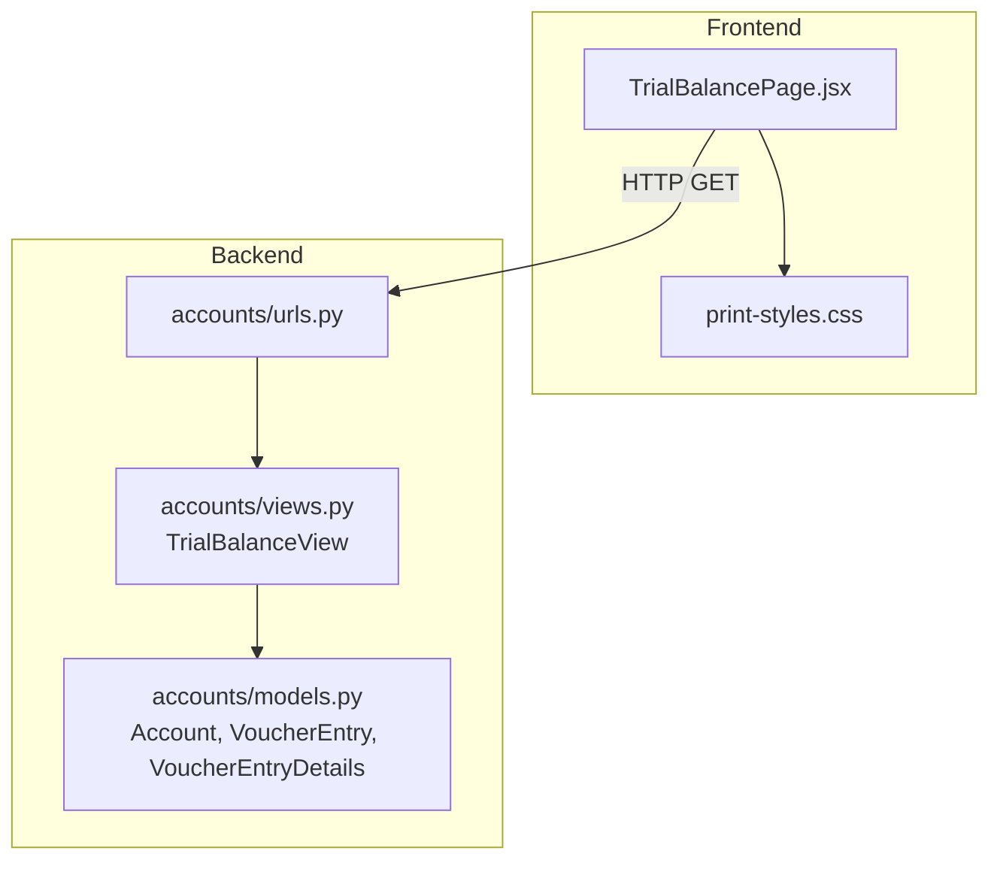
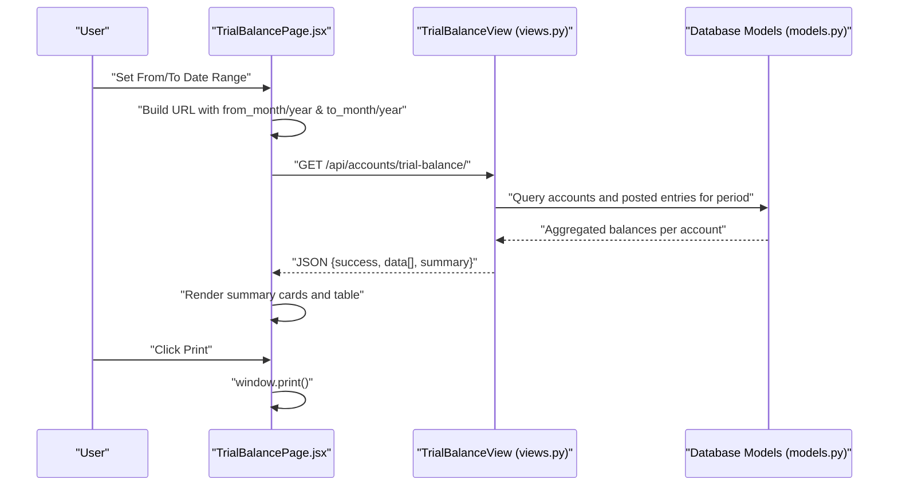
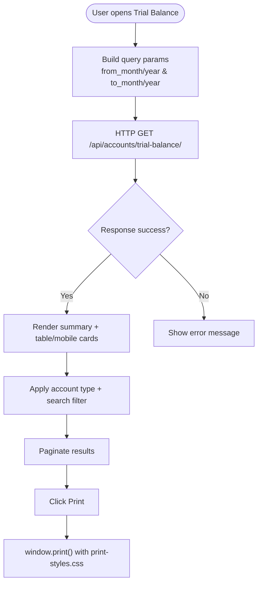
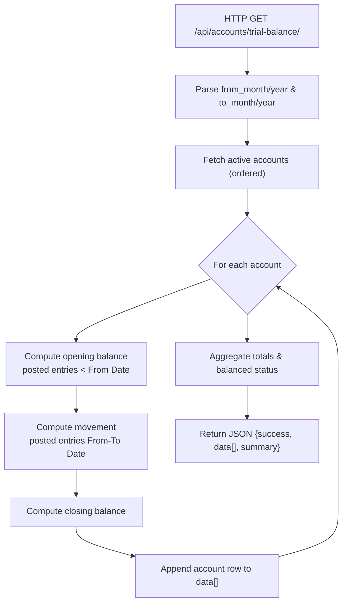
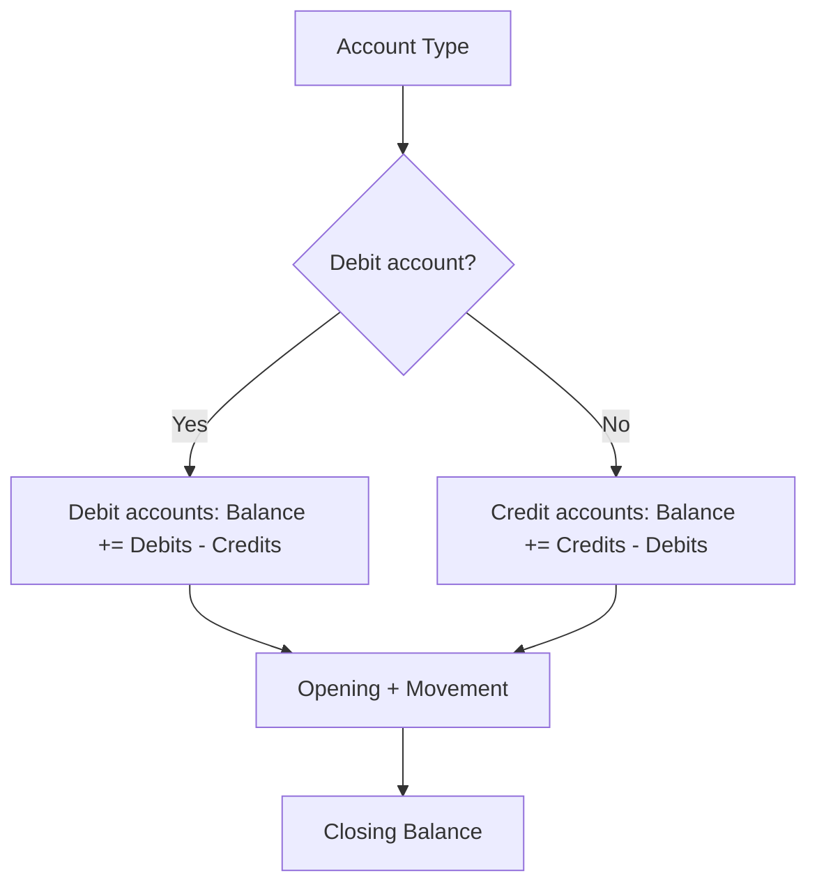
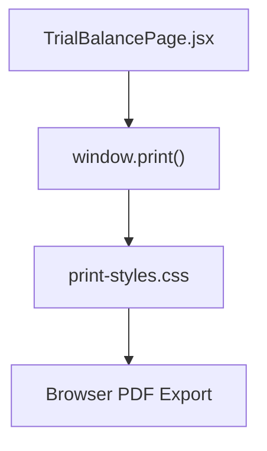
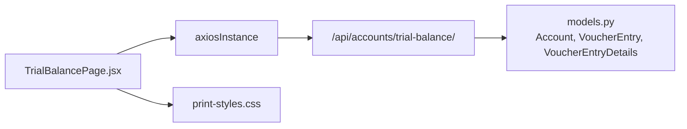

# Trial Balance Reports

<cite>
**Referenced Files in This Document**
- [TrialBalancePage.jsx](file://frontend/src/Features/TrialBalance/TrialBalancePage.jsx)
- [print-styles.css](file://frontend/src/Features/TrialBalance/print-styles.css)
- [urls.py](file://backend/accounts/urls.py)
- [views.py](file://backend/accounts/views.py)
- [models.py](file://backend/accounts/models.py)
</cite>

## Table of Contents
1. [Introduction](#introduction)
2. [Project Structure](#project-structure)
3. [Core Components](#core-components)
4. [Architecture Overview](#architecture-overview)
5. [Detailed Component Analysis](#detailed-component-analysis)
6. [Dependency Analysis](#dependency-analysis)
7. [Performance Considerations](#performance-considerations)
8. [Troubleshooting Guide](#troubleshooting-guide)
9. [Conclusion](#conclusion)

## Introduction
This document explains the trial balance reporting system in the project. It covers how trial balance data is generated, presented, and printed/exported, along with the underlying accounting principles and integration with the chart of accounts. It also describes period-based balance tracking, account hierarchies, and the financial statement preparation workflow.

## Project Structure
The trial balance feature spans the frontend and backend:
- Frontend: React page that renders the trial balance, applies filters, paginates, and handles print/export.
- Backend: Django REST framework endpoint that computes trial balances across accounts for a given period.

**Diagram sources**
- [TrialBalancePage.jsx](file://frontend/src/Features/TrialBalance/TrialBalancePage.jsx#L64-L66)
- [print-styles.css](file://frontend/src/Features/TrialBalance/print-styles.css#L1-L440)
- [urls.py](file://backend/accounts/urls.py#L19-L24)
- [views.py](file://backend/accounts/views.py#L985-L1128)
- [models.py](file://backend/accounts/models.py#L9-L410)

**Section sources**
- [TrialBalancePage.jsx](file://frontend/src/Features/TrialBalance/TrialBalancePage.jsx#L1-L877)
- [print-styles.css](file://frontend/src/Features/TrialBalance/print-styles.css#L1-L440)
- [urls.py](file://backend/accounts/urls.py#L1-L25)
- [views.py](file://backend/accounts/views.py#L985-L1128)
- [models.py](file://backend/accounts/models.py#L1-L410)

## Core Components
- Frontend Trial Balance Page
  - Fetches trial balance via HTTP GET to the backend endpoint with from_month/from_year and to_month/to_year query parameters.
  - Renders a summary card and a paginated table or mobile cards for account-wise balances.
  - Supports filtering by account type and free-text search on account code/name.
  - Provides a print action that triggers browser print dialog after a short render delay.
  - Uses dedicated print styles for professional A4 output.

- Backend Trial Balance Endpoint
  - Computes trial balances for all active accounts within the requested period.
  - Calculates opening and closing balances per account based on posted voucher entries.
  - Aggregates totals and returns a balanced status indicator.

- Accounting Models and Principles
  - Account types drive balance direction: debit accounts increase with debits, credit accounts increase with credits.
  - Opening balances are derived from prior-period posted entries; current balances reflect posted activity up to the To Date.
  - Trial balance ensures total debits equal total credits across all accounts.

**Section sources**
- [TrialBalancePage.jsx](file://frontend/src/Features/TrialBalance/TrialBalancePage.jsx#L47-L87)
- [TrialBalancePage.jsx](file://frontend/src/Features/TrialBalance/TrialBalancePage.jsx#L105-L123)
- [TrialBalancePage.jsx](file://frontend/src/Features/TrialBalance/TrialBalancePage.jsx#L176-L101)
- [print-styles.css](file://frontend/src/Features/TrialBalance/print-styles.css#L1-L440)
- [views.py](file://backend/accounts/views.py#L985-L1128)
- [models.py](file://backend/accounts/models.py#L9-L410)

## Architecture Overview
The trial balance workflow connects the UI to the backend and database:

**Diagram sources**
- [TrialBalancePage.jsx](file://frontend/src/Features/TrialBalance/TrialBalancePage.jsx#L53-L87)
- [urls.py](file://backend/accounts/urls.py#L23-L23)
- [views.py](file://backend/accounts/views.py#L985-L1128)
- [models.py](file://backend/accounts/models.py#L127-L156)

## Detailed Component Analysis

### Frontend: Trial Balance Page
Responsibilities:
- Build and send HTTP requests with period parameters.
- Apply client-side filters and pagination.
- Render desktop/tablet and mobile views.
- Provide print functionality with dedicated styles.

Key behaviors:
- Request construction and error handling for trial balance retrieval.
- Filtering by account type and search term.
- Pagination with configurable items per page.
- Currency formatting and badge coloring by account type.
- Print header and summary cards for A4 output.

**Diagram sources**
- [TrialBalancePage.jsx](file://frontend/src/Features/TrialBalance/TrialBalancePage.jsx#L53-L87)
- [TrialBalancePage.jsx](file://frontend/src/Features/TrialBalance/TrialBalancePage.jsx#L105-L123)
- [TrialBalancePage.jsx](file://frontend/src/Features/TrialBalance/TrialBalancePage.jsx#L176-L101)
- [print-styles.css](file://frontend/src/Features/TrialBalance/print-styles.css#L1-L440)

**Section sources**
- [TrialBalancePage.jsx](file://frontend/src/Features/TrialBalance/TrialBalancePage.jsx#L1-L877)
- [print-styles.css](file://frontend/src/Features/TrialBalance/print-styles.css#L1-L440)

### Backend: Trial Balance Endpoint
Responsibilities:
- Compute trial balance for all accounts within a date range.
- Aggregate movement (debit/credit) and balances (opening/closing/debit/credit).
- Return summary totals and balanced status.

Processing logic:
- Retrieve all active accounts ordered by code.
- For each account:
  - Compute opening balance from posted entries before the From Date.
  - Compute movement (debit/credit) from posted entries within the period.
  - Compute closing balance and per-side balances (debit/credit).
- Aggregate totals and balanced status.

**Diagram sources**
- [views.py](file://backend/accounts/views.py#L985-L1128)
- [models.py](file://backend/accounts/models.py#L127-L156)

**Section sources**
- [views.py](file://backend/accounts/views.py#L985-L1128)
- [models.py](file://backend/accounts/models.py#L127-L156)

### Accounting Principles and Balance Calculations
- Account types:
  - Debit accounts: asset, expense; increase with debits.
  - Credit accounts: liability, equity, revenue; increase with credits.
- Opening balance:
  - Sum of prior-period posted debits minus credits (or vice versa depending on account type).
- Movement:
  - Sum of posted debits and credits within the selected period.
- Closing balance:
  - Opening plus movement, respecting account type direction.
- Trial balance totals:
  - Sum of all debit balances and credit balances across accounts.
  - Balanced status indicates equality of total debits and total credits.

**Diagram sources**
- [models.py](file://backend/accounts/models.py#L144-L151)

**Section sources**
- [models.py](file://backend/accounts/models.py#L144-L151)

### Report Formatting, Currency Display, and Print/Export
- Currency formatting:
  - Frontend uses locale-aware formatting for display.
- Print styles:
  - Dedicated stylesheet targets A4 paper, hides non-essential UI, and formats tables and summary cards for print.
- Export:
  - The page does not implement CSV/XLSX export; printing is the primary output mechanism.

**Diagram sources**
- [TrialBalancePage.jsx](file://frontend/src/Features/TrialBalance/TrialBalancePage.jsx#L96-L101)
- [print-styles.css](file://frontend/src/Features/TrialBalance/print-styles.css#L1-L440)

**Section sources**
- [TrialBalancePage.jsx](file://frontend/src/Features/TrialBalance/TrialBalancePage.jsx#L146-L152)
- [print-styles.css](file://frontend/src/Features/TrialBalance/print-styles.css#L1-L440)

### Financial Statement Preparation and Balance Sheet Presentation
- The trial balance page presents account-wise balances suitable for preparing financial statements.
- Classification:
  - Accounts are classified by type (asset, liability, equity, revenue, expense).
- Balance sheet presentation:
  - Assets, liabilities, and equity are commonly grouped on a single report.
  - The trial balance view aggregates totals per side and provides a balanced status indicator useful for verifying equality of debits and credits before preparing the balance sheet.

Note: The trial balance view focuses on account-level balances and totals. Balance sheet formatting (grouping assets/liabilities/equity) is typically performed in higher-level reporting modules or by post-processing the trial balance data.

**Section sources**
- [TrialBalancePage.jsx](file://frontend/src/Features/TrialBalance/TrialBalancePage.jsx#L124-L132)
- [TrialBalancePage.jsx](file://frontend/src/Features/TrialBalance/TrialBalancePage.jsx#L279-L376)
- [views.py](file://backend/accounts/views.py#L1085-L1106)

### Examples and Workflows

#### Example: Trial Balance Generation Workflow
- User selects a From/To period and clicks “View Trial Balance”.
- Frontend builds query parameters and requests the backend endpoint.
- Backend computes opening, movement, and closing balances for each account.
- Frontend displays summary cards and a paginated table.

#### Example: Balance Verification Process
- After generating the trial balance, verify:
  - Total debits equal total credits.
  - Individual account balances align with posted activity.
- If unbalanced, investigate posting discrepancies or missing entries.

#### Example: Financial Statement Creation
- Use the trial balance totals to prepare the balance sheet:
  - Group assets, liabilities, and equity.
  - Confirm debits equal credits across the entire ledger.

**Section sources**
- [TrialBalancePage.jsx](file://frontend/src/Features/TrialBalance/TrialBalancePage.jsx#L47-L93)
- [views.py](file://backend/accounts/views.py#L1085-L1106)

## Dependency Analysis
- Frontend depends on:
  - Axios instance for HTTP requests.
  - Local state for filters, pagination, and rendering.
  - Print styles for A4 output.
- Backend depends on:
  - Account model for account metadata and balances.
  - VoucherEntry and VoucherEntryDetails for posted activity.
  - URL routing to expose the trial balance endpoint.

**Diagram sources**
- [TrialBalancePage.jsx](file://frontend/src/Features/TrialBalance/TrialBalancePage.jsx#L14-L66)
- [urls.py](file://backend/accounts/urls.py#L23-L23)
- [views.py](file://backend/accounts/views.py#L985-L1128)
- [models.py](file://backend/accounts/models.py#L9-L410)

**Section sources**
- [TrialBalancePage.jsx](file://frontend/src/Features/TrialBalance/TrialBalancePage.jsx#L14-L66)
- [urls.py](file://backend/accounts/urls.py#L19-L24)
- [views.py](file://backend/accounts/views.py#L985-L1128)
- [models.py](file://backend/accounts/models.py#L9-L410)

## Performance Considerations
- Backend aggregation:
  - The endpoint iterates accounts and performs per-account aggregations on posted entries. Indexes on account fields and voucher entry status/date improve query performance.
- Frontend rendering:
  - Client-side filtering and pagination reduce DOM load for large datasets.
- Printing:
  - Dedicated print styles minimize layout overhead and improve print quality.

[No sources needed since this section provides general guidance]

## Troubleshooting Guide
Common issues and resolutions:
- Empty or partial data:
  - Ensure the selected period includes posted entries; verify account activity within the range.
- Unbalanced totals:
  - Investigate posting errors or missing reversing entries; confirm that debits equal credits across all accounts.
- Print artifacts:
  - Confirm A4 page size and margins in print-styles.css; adjust browser print settings if necessary.
- Slow loading:
  - Reduce the date range or apply filters to limit returned rows.

**Section sources**
- [views.py](file://backend/accounts/views.py#L1085-L1106)
- [print-styles.css](file://frontend/src/Features/TrialBalance/print-styles.css#L1-L440)

## Conclusion
The trial balance reporting system integrates a robust backend calculation engine with a user-friendly frontend interface. It supports period-based balance tracking, account hierarchies, classification, and professional print output. By leveraging posted voucher entries and applying standard accounting principles, it provides reliable data for financial statement preparation and balance verification.