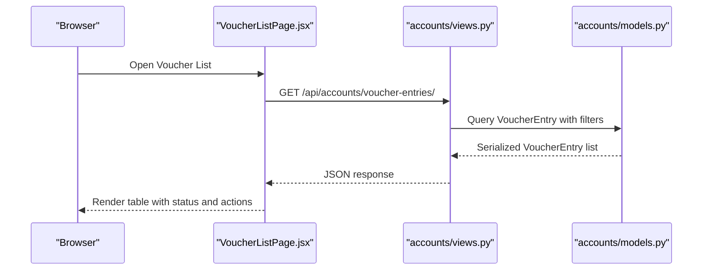
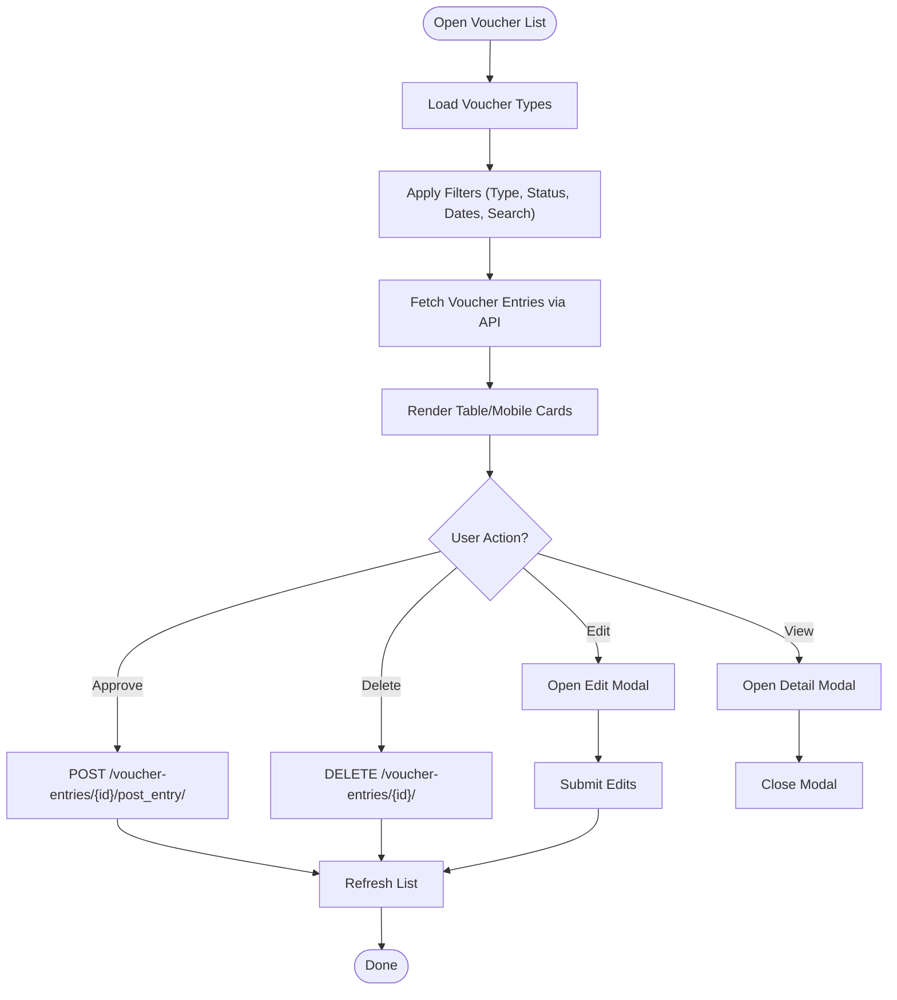
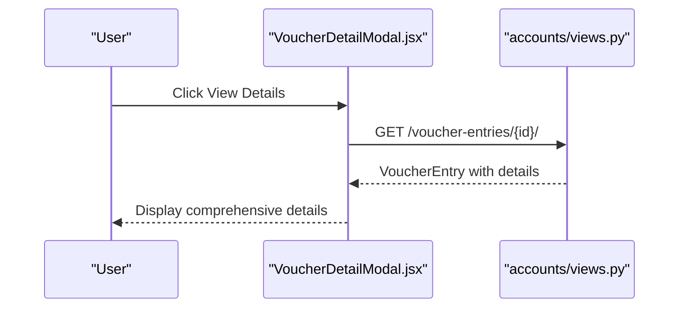
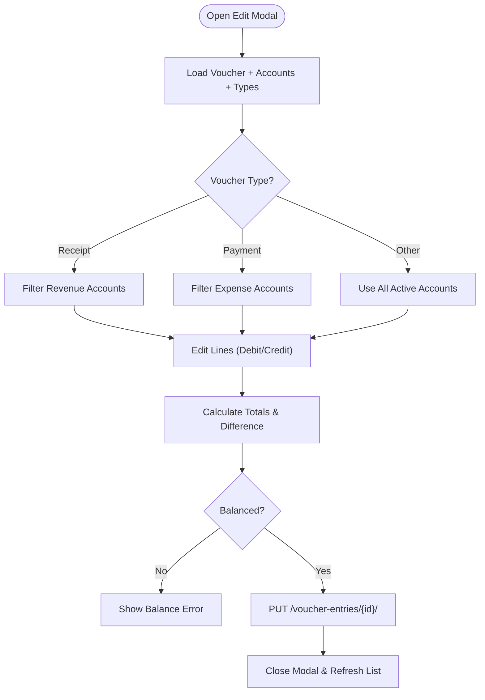
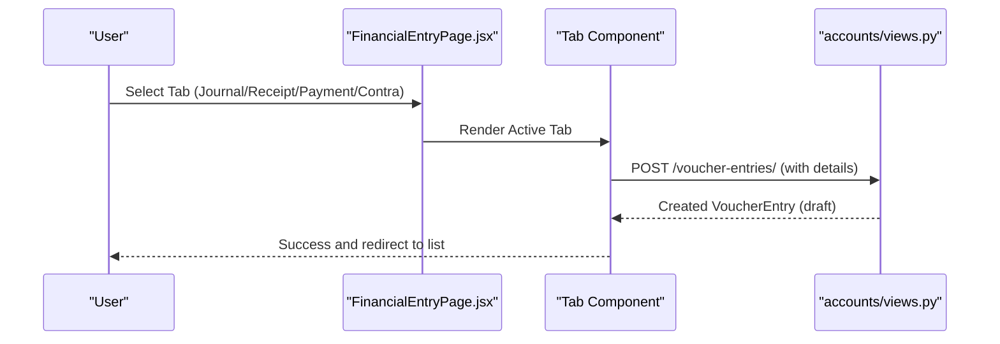
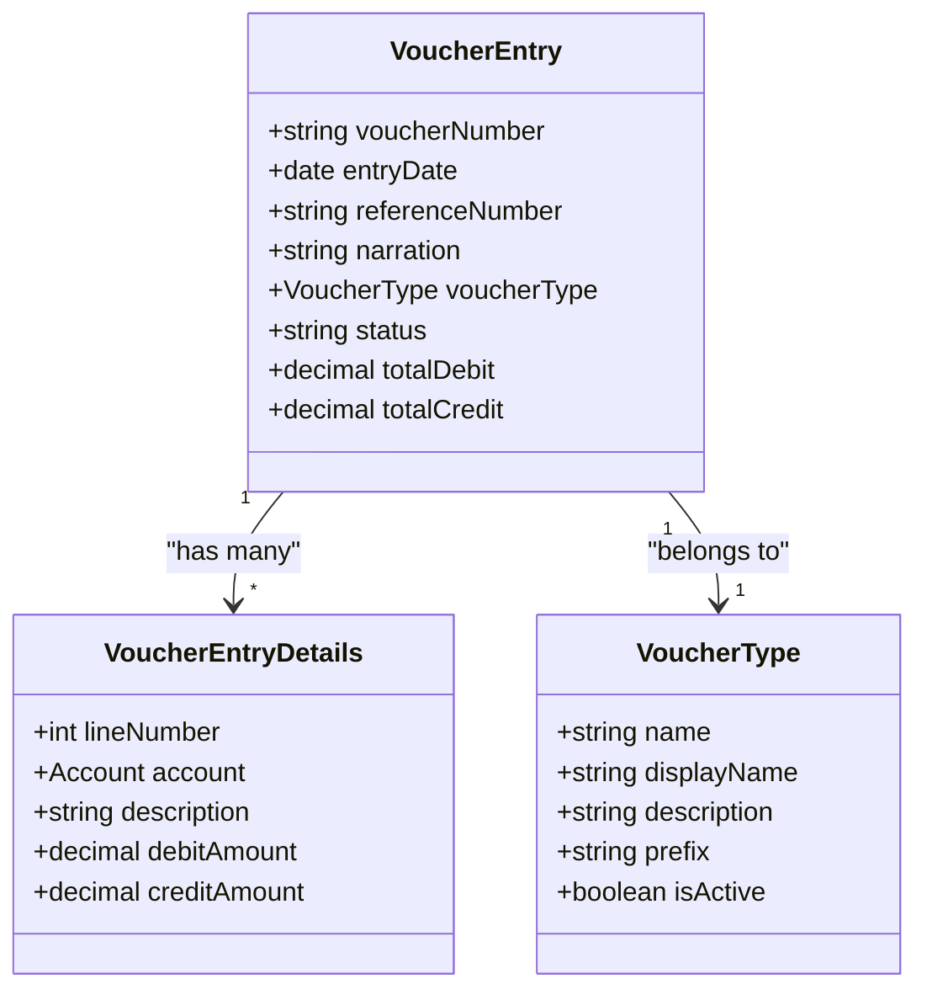
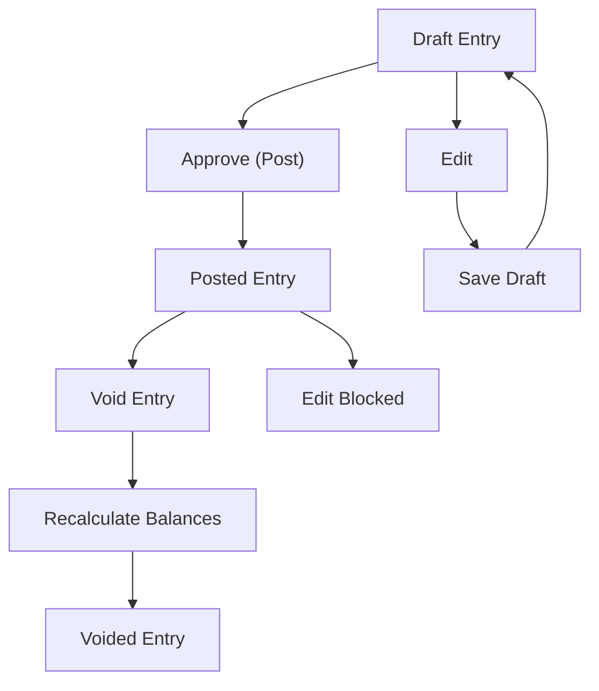
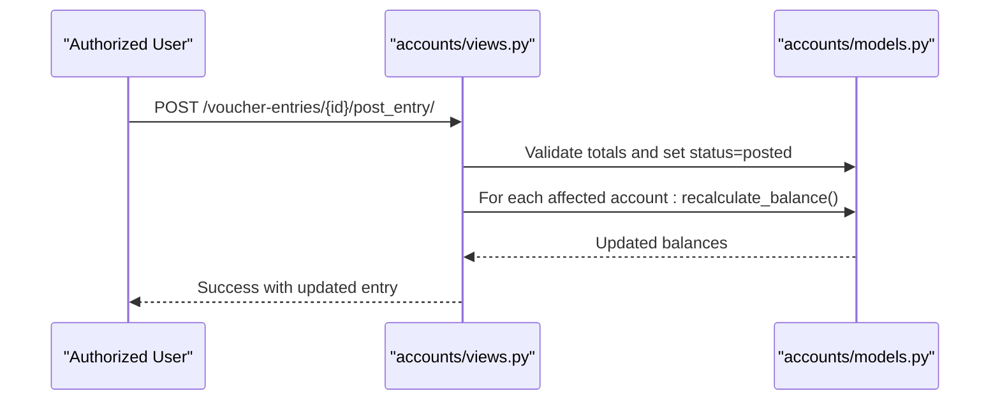
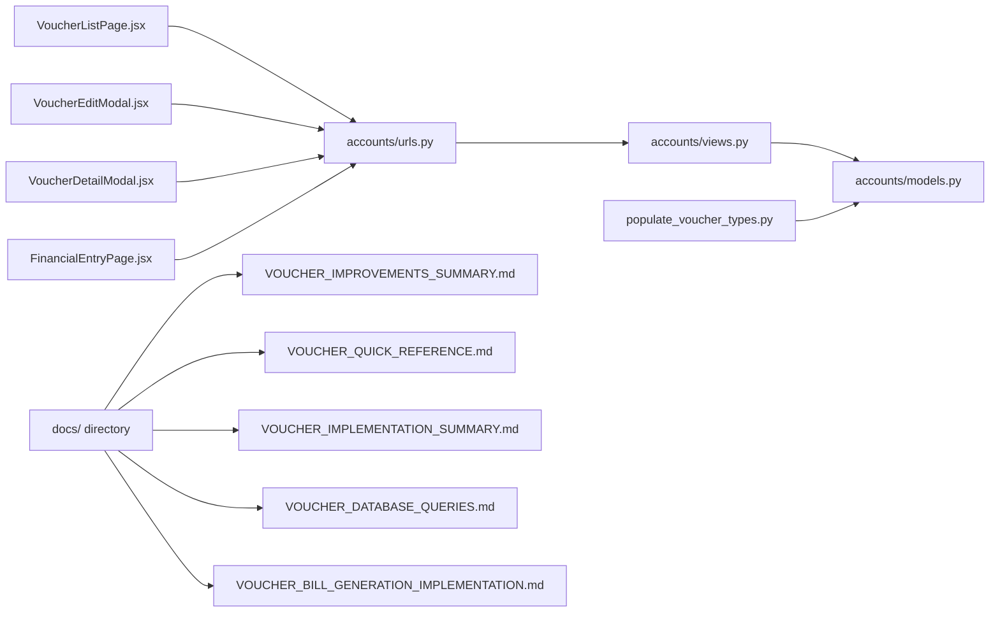

# Voucher Management System

<cite>
**Referenced Files in This Document**
- [VoucherListPage.jsx](file://frontend/src/Features/Vouchers/VoucherListPage.jsx)
- [VoucherDetailModal.jsx](file://frontend/src/Features/Vouchers/VoucherDetailModal.jsx)
- [VoucherEditModal.jsx](file://frontend/src/Features/Vouchers/VoucherEditModal.jsx)
- [FinancialEntryPage.jsx](file://frontend/src/Features/FinancialEntry/FinancialEntryPage.jsx)
- [JournalEntryTab.jsx](file://frontend/src/Features/FinancialEntry/JournalEntryTab.jsx)
- [ReceiptVoucherTab.jsx](file://frontend/src/Features/FinancialEntry/ReceiptVoucherTab.jsx)
- [PaymentVoucherTab.jsx](file://frontend/src/Features/FinancialEntry/PaymentVoucherTab.jsx)
- [ContraEntryTab.jsx](file://frontend/src/Features/FinancialEntry/ContraEntryTab.jsx)
- [accounts/models.py](file://backend/accounts/models.py)
- [accounts/views.py](file://backend/accounts/views.py)
- [accounts/serializers.py](file://backend/accounts/serializers.py)
- [accounts/urls.py](file://backend/accounts/urls.py)
- [populate_voucher_types.py](file://backend/accounts/management/commands/populate_voucher_types.py)
- [docs/VOUCHER_IMPROVEMENTS_SUMMARY.md](file://docs/VOUCHER_IMPROVEMENTS_SUMMARY.md)
- [docs/VOUCHER_QUICK_REFERENCE.md](file://docs/VOUCHER_QUICK_REFERENCE.md)
- [docs/VOUCHER_IMPLEMENTATION_SUMMARY.md](file://docs/VOUCHER_IMPLEMENTATION_SUMMARY.md)
- [docs/VOUCHER_DOUBLE_ENTRY_IMPROVEMENTS.md](file://docs/VOUCHER_DOUBLE_ENTRY_IMPROVEMENTS.md)
- [docs/VOUCHER_DATABASE_QUERIES.md](file://docs/VOUCHER_DATABASE_QUERATIONS.md)
- [docs/VOUCHER_BILL_GENERATION_IMPLEMENTATION.md](file://docs/VOUCHER_BILL_GENERATION_IMPLEMENTATION.md)
</cite>

## Update Summary
**Changes Made**
- Updated file references to reflect voucher documentation files moved from root to docs/ directory
- Added new section documenting the centralized documentation structure in docs/ directory
- Updated architecture diagrams to show improved documentation organization
- Enhanced troubleshooting guide with documentation accessibility information

## Table of Contents
1. [Introduction](#introduction)
2. [Project Structure](#project-structure)
3. [Core Components](#core-components)
4. [Architecture Overview](#architecture-overview)
5. [Detailed Component Analysis](#detailed-component-analysis)
6. [Documentation Organization](#documentation-organization)
7. [Dependency Analysis](#dependency-analysis)
8. [Performance Considerations](#performance-considerations)
9. [Troubleshooting Guide](#troubleshooting-guide)
10. [Conclusion](#conclusion)

## Introduction
This document describes the voucher management system within the estate-link project. It covers the voucher listing interface with transaction categorization and status tracking, the voucher detail modal for viewing transaction specifics, editing capabilities for authorized users, supported voucher types and their business rules, integration with the accounting ledger system, and automatic posting mechanisms. It also includes examples of voucher creation workflows, approval processes, and reconciliation procedures.

**Updated** The documentation has been reorganized to centralize all voucher-related materials in the docs/ directory for better maintainability and accessibility.

## Project Structure
The voucher management system spans both frontend and backend components:
- Frontend: React-based user interface for listing, viewing, editing, and creating vouchers.
- Backend: Django REST Framework APIs for voucher entries, types, and ledger integration.
- Documentation: Centralized in docs/ directory with comprehensive coverage of voucher implementation details.

```mermaid
graph TB
subgraph "Frontend"
VLP["VoucherListPage.jsx"]
VDM["VoucherDetailModal.jsx"]
VEM["VoucherEditModal.jsx"]
FEP["FinancialEntryPage.jsx"]
TABS["Journal/Receipt/Payment/Contra Tabs"]
end
subgraph "Backend"
URLS["accounts/urls.py"]
MODELS["accounts/models.py"]
VIEWS["accounts/views.py"]
SERIALIZERS["accounts/serializers.py"]
CMD["populate_voucher_types.py"]
end
subgraph "Documentation"
DOCS["docs/ directory"]
SUMMARY["VOUCHER_IMPROVEMENTS_SUMMARY.md"]
QUICKREF["VOUCHER_QUICK_REFERENCE.md"]
IMPSUM["VOUCHER_IMPLEMENTATION_SUMMARY.md"]
DBQUERIES["VOUCHER_DATABASE_QUERIES.md"]
BILLCOMP["VOUCHER_BILL_GENERATION_IMPLEMENTATION.md"]
END
VLP --> URLS
VDM --> URLS
VEM --> URLS
FEP --> TABS
TABS --> URLS
URLS --> VIEWS
VIEWS --> MODELS
VIEWS --> SERIALIZERS
CMD --> MODELS
DOCS --> SUMMARY
DOCS --> QUICKREF
DOCS --> IMPSUM
DOCS --> DBQUERIES
DOCS --> BILLCOMP
```

**Diagram sources**
- [VoucherListPage.jsx](file://frontend/src/Features/Vouchers/VoucherListPage.jsx#L1-L1016)
- [VoucherDetailModal.jsx](file://frontend/src/Features/Vouchers/VoucherDetailModal.jsx#L1-L462)
- [VoucherEditModal.jsx](file://frontend/src/Features/Vouchers/VoucherEditModal.jsx#L1-L760)
- [FinancialEntryPage.jsx](file://frontend/src/Features/FinancialEntry/FinancialEntryPage.jsx#L1-L145)
- [accounts/urls.py](file://backend/accounts/urls.py#L1-L25)
- [accounts/models.py](file://backend/accounts/models.py#L1-L410)
- [accounts/views.py](file://backend/accounts/views.py#L1-L1128)
- [accounts/serializers.py](file://backend/accounts/serializers.py#L1-L513)
- [populate_voucher_types.py](file://backend/accounts/management/commands/populate_voucher_types.py#L1-L106)
- [docs/VOUCHER_IMPROVEMENTS_SUMMARY.md](file://docs/VOUCHER_IMPROVEMENTS_SUMMARY.md#L1-L1)
- [docs/VOUCHER_QUICK_REFERENCE.md](file://docs/VOUCHER_QUICK_REFERENCE.md#L1-L1)
- [docs/VOUCHER_IMPLEMENTATION_SUMMARY.md](file://docs/VOUCHER_IMPLEMENTATION_SUMMARY.md#L1-L1)
- [docs/VOUCHER_DATABASE_QUERIES.md](file://docs/VOUCHER_DATABASE_QUERIES.md#L1-L1)
- [docs/VOUCHER_BILL_GENERATION_IMPLEMENTATION.md](file://docs/VOUCHER_BILL_GENERATION_IMPLEMENTATION.md#L1-L1)

**Section sources**
- [accounts/urls.py](file://backend/accounts/urls.py#L1-L25)
- [VoucherListPage.jsx](file://frontend/src/Features/Vouchers/VoucherListPage.jsx#L1-L1016)
- [FinancialEntryPage.jsx](file://frontend/src/Features/FinancialEntry/FinancialEntryPage.jsx#L1-L145)
- [docs/VOUCHER_IMPROVEMENTS_SUMMARY.md](file://docs/VOUCHER_IMPROVEMENTS_SUMMARY.md#L1-L1)

## Core Components
- Voucher Listing Interface: Provides filtering by type, status, date range, and search term; displays summarized voucher details with status badges and actions.
- Voucher Detail Modal: Presents comprehensive transaction details including header information, entry lines, totals, and audit trail.
- Voucher Edit Modal: Enables authorized users to edit draft entries with specialized validation per voucher type and real-time balance calculation.
- Financial Entry Page: Hosts specialized tabs for creating journal, receipt, payment, and contra entries with appropriate account filtering and validation.
- Backend APIs: Manage voucher entries, types, and ledger queries with strict validation and posting controls.
- Documentation System: Centralized documentation in docs/ directory covering implementation details, database queries, and business rules.

**Section sources**
- [VoucherListPage.jsx](file://frontend/src/Features/Vouchers/VoucherListPage.jsx#L1-L1016)
- [VoucherDetailModal.jsx](file://frontend/src/Features/Vouchers/VoucherDetailModal.jsx#L1-L462)
- [VoucherEditModal.jsx](file://frontend/src/Features/Vouchers/VoucherEditModal.jsx#L1-L760)
- [FinancialEntryPage.jsx](file://frontend/src/Features/FinancialEntry/FinancialEntryPage.jsx#L1-L145)

## Architecture Overview
The system follows a client-server architecture:
- Frontend React components communicate with backend REST endpoints via Axios.
- Backend enforces business rules through Django models and serializers, and exposes endpoints via ViewSets and APIViews.
- Posting and voiding operations trigger automatic ledger balance recalculations.
- Documentation is centrally organized in the docs/ directory for improved maintainability.



**Diagram sources**
- [VoucherListPage.jsx](file://frontend/src/Features/Vouchers/VoucherListPage.jsx#L139-L206)
- [accounts/views.py](file://backend/accounts/views.py#L261-L325)
- [accounts/models.py](file://backend/accounts/models.py#L201-L284)

## Detailed Component Analysis

### Voucher Listing Interface
The listing interface supports:
- Filtering: Voucher type(s), status(es), date range, and free-text search across voucher number, reference, and narration.
- Sorting: Defaults to newest first by entry date and voucher number.
- Actions: Approve (post), edit, view details, and delete (only for draft entries).
- Status tracking: Visual indicators for draft, posted, and void statuses.



**Diagram sources**
- [VoucherListPage.jsx](file://frontend/src/Features/Vouchers/VoucherListPage.jsx#L139-L392)
- [accounts/views.py](file://backend/accounts/views.py#L401-L480)

**Section sources**
- [VoucherListPage.jsx](file://frontend/src/Features/Vouchers/VoucherListPage.jsx#L1-L1016)
- [accounts/views.py](file://backend/accounts/views.py#L285-L325)

### Voucher Detail Modal
The detail modal presents:
- Header: Voucher number, status, type, entry date, reference, and creator.
- Entry details: Line-by-line breakdown with account code/name, description, debit/credit amounts, and totals footer.
- Audit information: Created by/ at, posted by/ at, and last updated by/ at.
- Balance verification: Real-time check indicating whether debits equal credits.



**Diagram sources**
- [VoucherDetailModal.jsx](file://frontend/src/Features/Vouchers/VoucherDetailModal.jsx#L27-L44)
- [accounts/views.py](file://backend/accounts/views.py#L323-L325)

**Section sources**
- [VoucherDetailModal.jsx](file://frontend/src/Features/Vouchers/VoucherDetailModal.jsx#L1-L462)
- [accounts/serializers.py](file://backend/accounts/serializers.py#L280-L340)

### Voucher Edit Modal
The edit modal enables:
- Editing draft entries with specialized validation per voucher type.
- Dynamic account filtering based on voucher type (e.g., receipts/payments restrict to revenue/expense accounts).
- Real-time balance calculation and difference display.
- Validation feedback for missing or conflicting amounts.



**Diagram sources**
- [VoucherEditModal.jsx](file://frontend/src/Features/Vouchers/VoucherEditModal.jsx#L64-L154)
- [VoucherEditModal.jsx](file://frontend/src/Features/Vouchers/VoucherEditModal.jsx#L308-L389)
- [accounts/views.py](file://backend/accounts/views.py#L348-L374)

**Section sources**
- [VoucherEditModal.jsx](file://frontend/src/Features/Vouchers/VoucherEditModal.jsx#L1-L760)
- [accounts/serializers.py](file://backend/accounts/serializers.py#L280-L435)

### Voucher Creation Workflows
The Financial Entry page hosts four specialized tabs:
- Journal Entry: General ledger entries with flexible account selection.
- Receipt Voucher: Income/inflow transactions with revenue account restriction.
- Payment Voucher: Expense/outflow transactions with expense account restriction.
- Contra Entry: Balance transfers between cash/bank/MFS accounts with specialized filtering.



**Diagram sources**
- [FinancialEntryPage.jsx](file://frontend/src/Features/FinancialEntry/FinancialEntryPage.jsx#L14-L145)
- [JournalEntryTab.jsx](file://frontend/src/Features/FinancialEntry/JournalEntryTab.jsx#L1-L16)
- [ReceiptVoucherTab.jsx](file://frontend/src/Features/FinancialEntry/ReceiptVoucherTab.jsx#L1-L16)
- [PaymentVoucherTab.jsx](file://frontend/src/Features/FinancialEntry/PaymentVoucherTab.jsx#L1-L15)
- [ContraEntryTab.jsx](file://frontend/src/Features/FinancialEntry/ContraEntryTab.jsx#L1-L81)
- [accounts/views.py](file://backend/accounts/views.py#L327-L346)

**Section sources**
- [FinancialEntryPage.jsx](file://frontend/src/Features/FinancialEntry/FinancialEntryPage.jsx#L1-L145)
- [ContraEntryTab.jsx](file://frontend/src/Features/FinancialEntry/ContraEntryTab.jsx#L29-L67)

### Voucher Types and Business Rules
Supported voucher types and their business rules:
- Journal Voucher: General entries; requires at least two lines; debits must equal credits.
- Receipt Voucher: Income/inflow; restricted to revenue accounts; at least one line item.
- Payment Voucher: Expense/outflow; restricted to expense accounts; at least one line item.
- Contra Voucher: Transfers between cash/bank/MFS accounts; both sides must be cash equivalents.



**Diagram sources**
- [accounts/models.py](file://backend/accounts/models.py#L159-L208)
- [accounts/models.py](file://backend/accounts/models.py#L201-L330)

**Section sources**
- [accounts/models.py](file://backend/accounts/models.py#L159-L208)
- [populate_voucher_types.py](file://backend/accounts/management/commands/populate_voucher_types.py#L24-L53)

### Approval and Modification Controls
- Draft vs Posted: Only draft entries can be edited or deleted; posted entries require voiding or reversal.
- Approval Workflow: Authorized users can post draft entries via a dedicated endpoint; backend validates debits equal credits.
- Voiding: Posted entries can be voided, updating status and recalculating affected account balances.
- Modification Restrictions: Updates to posted entries are blocked; edits enforce strict validation.



**Diagram sources**
- [accounts/views.py](file://backend/accounts/views.py#L401-L480)
- [accounts/models.py](file://backend/accounts/models.py#L267-L276)

**Section sources**
- [accounts/views.py](file://backend/accounts/views.py#L348-L374)
- [accounts/views.py](file://backend/accounts/views.py#L401-L480)

### Ledger Integration and Automatic Posting
- Ledger Endpoint: Retrieve account-specific ledger statements with date range support.
- Balance Recalculation: On posting or voiding, affected accounts have their balances recalculated based on posted entries.
- Audit Trail: Created/updated/posted timestamps and user references are maintained.



**Diagram sources**
- [accounts/views.py](file://backend/accounts/views.py#L401-L443)
- [accounts/models.py](file://backend/accounts/models.py#L127-L156)

**Section sources**
- [accounts/views.py](file://backend/accounts/views.py#L727-L800)
- [accounts/models.py](file://backend/accounts/models.py#L127-L156)

## Documentation Organization

**Updated** All voucher-related documentation has been centralized in the docs/ directory for improved organization and maintainability.

The docs/ directory now contains comprehensive voucher documentation covering:
- Implementation improvements and best practices
- Quick reference guides for common operations
- Database query implementations and optimization
- Bill generation workflows and integration
- Complete system architecture and business rules

This centralization improves:
- Accessibility: All voucher documentation in one location
- Maintainability: Easier updates and version control
- Consistency: Standardized formatting and structure
- Collaboration: Clear separation between implementation and documentation

**Section sources**
- [docs/VOUCHER_IMPROVEMENTS_SUMMARY.md](file://docs/VOUCHER_IMPROVEMENTS_SUMMARY.md#L1-L1)
- [docs/VOUCHER_QUICK_REFERENCE.md](file://docs/VOUCHER_QUICK_REFERENCE.md#L1-L1)
- [docs/VOUCHER_IMPLEMENTATION_SUMMARY.md](file://docs/VOUCHER_IMPLEMENTATION_SUMMARY.md#L1-L1)
- [docs/VOUCHER_DATABASE_QUERIES.md](file://docs/VOUCHER_DATABASE_QUERIES.md#L1-L1)
- [docs/VOUCHER_BILL_GENERATION_IMPLEMENTATION.md](file://docs/VOUCHER_BILL_GENERATION_IMPLEMENTATION.md#L1-L1)

## Dependency Analysis
- Frontend depends on backend REST endpoints defined in accounts/urls.py routed via ViewSets and APIViews.
- Backend models define relationships among VoucherType, VoucherEntry, and VoucherEntryDetails.
- Commands populate default voucher types for consistent system behavior.
- Documentation dependencies are managed through centralized file references in the docs/ directory.



**Diagram sources**
- [accounts/urls.py](file://backend/accounts/urls.py#L13-L24)
- [accounts/views.py](file://backend/accounts/views.py#L261-L266)
- [accounts/models.py](file://backend/accounts/models.py#L159-L330)
- [populate_voucher_types.py](file://backend/accounts/management/commands/populate_voucher_types.py#L6-L106)
- [docs/VOUCHER_IMPROVEMENTS_SUMMARY.md](file://docs/VOUCHER_IMPROVEMENTS_SUMMARY.md#L1-L1)
- [docs/VOUCHER_QUICK_REFERENCE.md](file://docs/VOUCHER_QUICK_REFERENCE.md#L1-L1)
- [docs/VOUCHER_IMPLEMENTATION_SUMMARY.md](file://docs/VOUCHER_IMPLEMENTATION_SUMMARY.md#L1-L1)
- [docs/VOUCHER_DATABASE_QUERIES.md](file://docs/VOUCHER_DATABASE_QUERIES.md#L1-L1)
- [docs/VOUCHER_BILL_GENERATION_IMPLEMENTATION.md](file://docs/VOUCHER_BILL_GENERATION_IMPLEMENTATION.md#L1-L1)

**Section sources**
- [accounts/urls.py](file://backend/accounts/urls.py#L1-L25)
- [accounts/views.py](file://backend/accounts/views.py#L261-L266)

## Performance Considerations
- Indexes on VoucherEntry fields (voucherNumber, entryDate, status, voucherType) improve query performance for filtering and sorting.
- Prefetching related details reduces N+1 queries in list views.
- Pagination for ledger queries prevents large result sets.
- Real-time balance recalculation occurs only for affected accounts upon posting/voiding.
- Centralized documentation in docs/ directory improves development workflow efficiency.

[No sources needed since this section provides general guidance]

## Troubleshooting Guide
Common issues and resolutions:
- Voucher not balanced: Ensure total debits equal total credits before saving or posting.
- Cannot edit posted entry: Create a reversing entry instead of attempting to edit.
- Cannot delete posted entry: Void the entry instead of deleting.
- Account filtering issues: For receipt/payment entries, ensure the selected accounts belong to the correct type (revenue/expense).
- Ledger discrepancies: After posting/voiding, balances are recalculated automatically; verify affected account activity.
- Documentation access issues: All voucher documentation is now located in the docs/ directory for centralized access.

**Updated** Documentation files have been moved to docs/ directory for better organization and accessibility.

**Section sources**
- [accounts/views.py](file://backend/accounts/views.py#L355-L374)
- [accounts/views.py](file://backend/accounts/views.py#L445-L480)
- [accounts/serializers.py](file://backend/accounts/serializers.py#L316-L339)
- [docs/VOUCHER_IMPROVEMENTS_SUMMARY.md](file://docs/VOUCHER_IMPROVEMENTS_SUMMARY.md#L1-L1)

## Conclusion
The voucher management system provides a robust, user-friendly interface for creating, reviewing, editing, and posting financial entries while maintaining strict accounting principles. The frontend offers intuitive filtering, validation, and real-time feedback, while the backend enforces business rules, ensures ledger integrity, and integrates seamlessly with the broader accounting framework.

**Updated** The documentation has been successfully reorganized to improve maintainability and accessibility through centralization in the docs/ directory, while the core functionality and architecture remain unchanged.