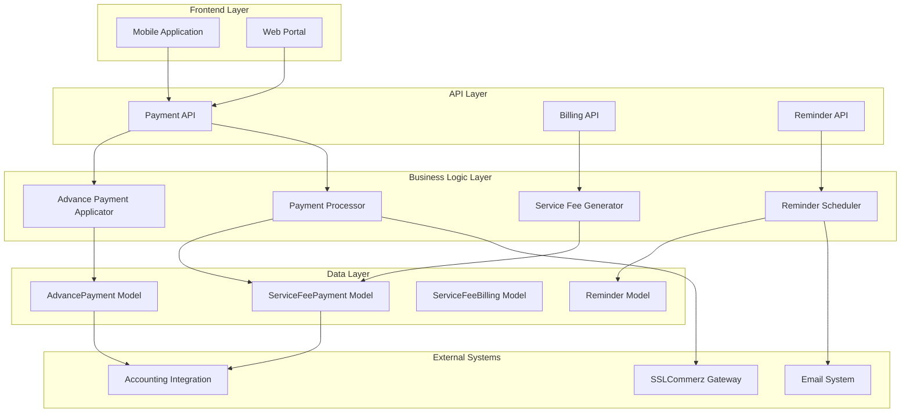
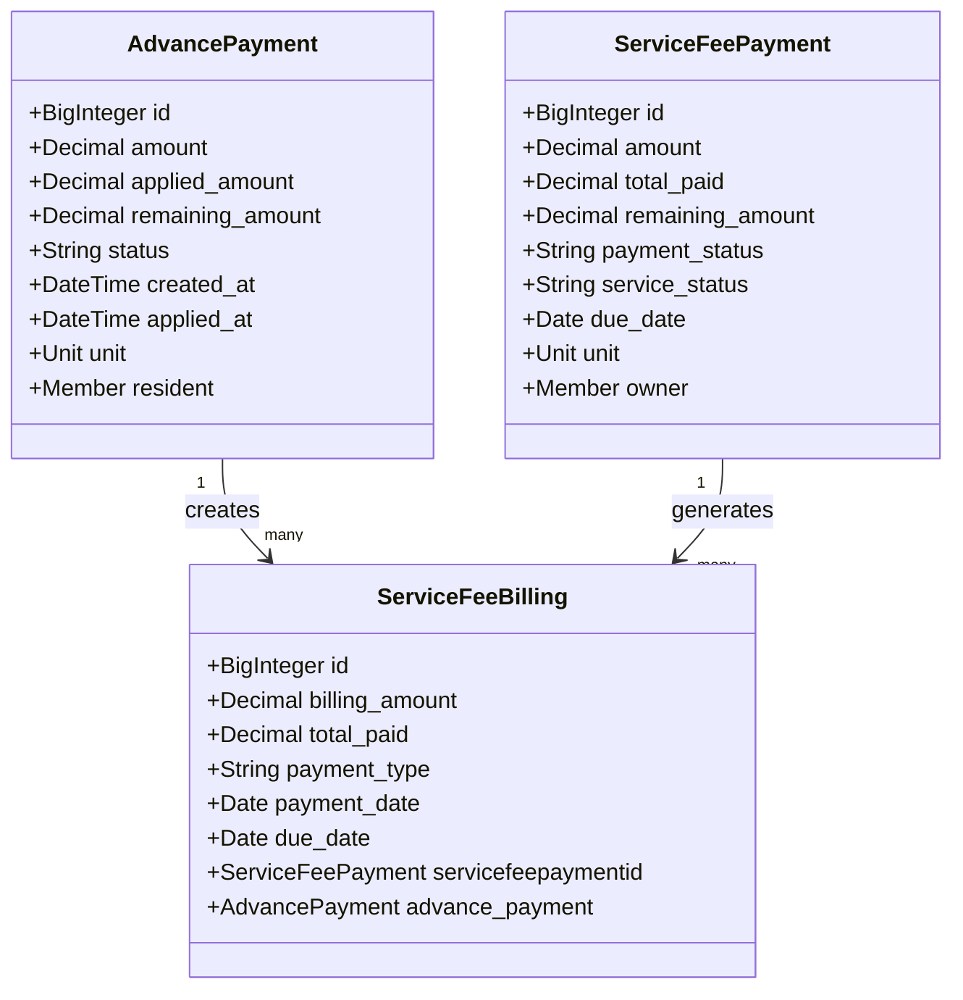
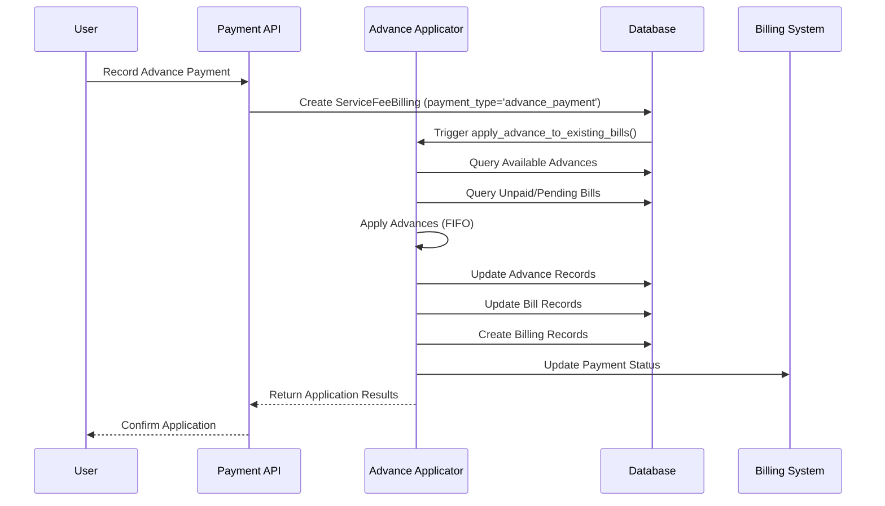
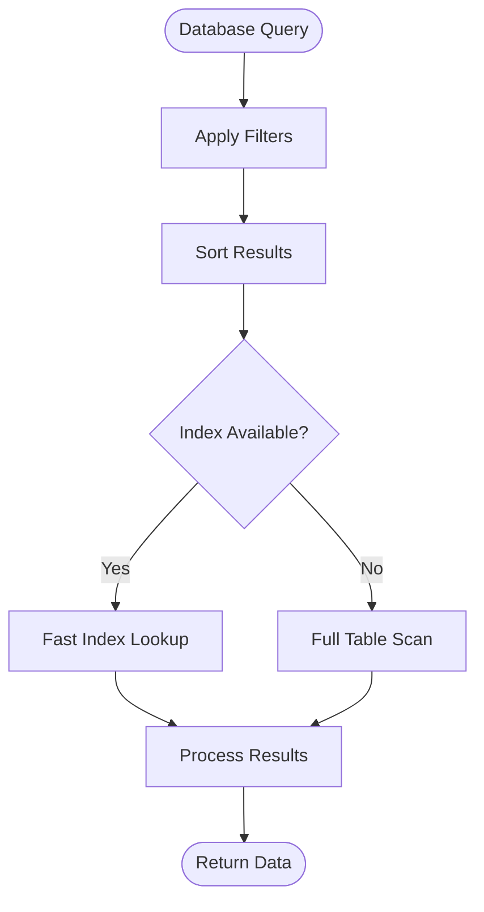
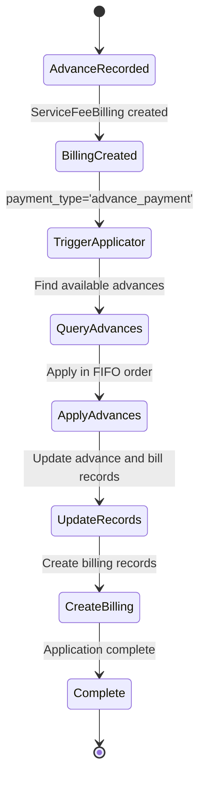

# Advance Payment System

<cite>
**Referenced Files in This Document**
- [ADVANCE_PAYMENT_IMPLEMENTATION.md](file://backend/service_fee_management/ADVANCE_PAYMENT_IMPLEMENTATION.md)
- [ARCHITECTURE_DIAGRAM.md](file://backend/service_fee_management/ARCHITECTURE_DIAGRAM.md)
- [IMPLEMENTATION_SUMMARY.md](file://backend/service_fee_management/IMPLEMENTATION_SUMMARY.md)
- [QUICK_START.md](file://backend/service_fee_management/QUICK_START.md)
- [advance_payment_applicator.py](file://backend/service_fee_management/utils/advance_payment_applicator.py)
- [models.py](file://backend/service_fee_management/models.py)
- [signals.py](file://backend/service_fee_management/signals.py)
- [0088_advancepayment.py](file://backend/service_fee_management/migrations/0088_advancepayment.py)
- [test_payment_system.py](file://backend/service_fee_management/tests/test_payment_system.py)
- [service_fee_generator.py](file://backend/service_fee_management/utils/service_fee_generator.py)
- [views.py](file://backend/service_fee_management/views.py)
- [urls.py](file://backend/service_fee_management/urls.py)
</cite>

## Table of Contents
1. [Introduction](#introduction)
2. [System Architecture](#system-architecture)
3. [Core Components](#core-components)
4. [Advance Payment Application Logic](#advance-payment-application-logic)
5. [Database Schema](#database-schema)
6. [API Endpoints](#api-endpoints)
7. [Testing Framework](#testing-framework)
8. [Implementation Details](#implementation-details)
9. [Monitoring and Logging](#monitoring-and-logging)
10. [Troubleshooting Guide](#troubleshooting-guide)
11. [Conclusion](#conclusion)

## Introduction

The Advance Payment System is a sophisticated financial management solution integrated into the Estate Link property management platform. This system enables property managers and residents to handle advance payments for service fees, ensuring seamless payment processing and automatic application of advances to existing bills.

The system addresses a critical problem where advance payments made in one month were not properly applied to bills generated in subsequent months. The solution implements a separation of concerns between bill generation and advance application, creating a robust trigger-based system that automatically applies advances when payments are recorded.

## System Architecture

The Advance Payment System follows a modular architecture with clear separation of concerns:



**Diagram sources**
- [ARCHITECTURE_DIAGRAM.md](file://backend/service_fee_management/ARCHITECTURE_DIAGRAM.md#L1-L396)
- [models.py](file://backend/service_fee_management/models.py#L12-L800)

## Core Components

### Advance Payment Applicator

The core of the system is the `advance_payment_applicator.py` module, which provides the centralized logic for applying advance payments to existing bills. This utility function implements a First-In-First-Out (FIFO) application strategy to ensure fair distribution of advance credits across outstanding bills.

Key features include:
- **Transaction Safety**: Atomic database operations prevent partial updates
- **FIFO Application**: Oldest advances applied first
- **Automatic Status Updates**: Advance records updated with new status
- **Audit Trail**: Comprehensive logging for debugging and monitoring
- **Bulk Operations**: Efficient processing of multiple advances and bills

### Service Fee Payment System

The payment system manages the lifecycle of service fee payments through multiple interconnected models:



**Diagram sources**
- [models.py](file://backend/service_fee_management/models.py#L12-L800)

**Section sources**
- [advance_payment_applicator.py](file://backend/service_fee_management/utils/advance_payment_applicator.py#L15-L211)
- [models.py](file://backend/service_fee_management/models.py#L12-L800)

## Advance Payment Application Logic

The system implements a sophisticated trigger-based mechanism for automatic advance application:

### Application Flow



**Diagram sources**
- [advance_payment_applicator.py](file://backend/service_fee_management/utils/advance_payment_applicator.py#L15-L211)
- [models.py](file://backend/service_fee_management/models.py#L12-L800)

### Application Algorithm

The system uses a greedy algorithm with the following steps:

1. **Advance Collection**: Gather all available and partially applied advances for the unit
2. **Bill Sorting**: Sort unpaid/partial bills by due date (oldest first)
3. **Application Loop**: For each bill, apply available advances until either:
   - The bill is fully paid, or
   - All available advances are exhausted
4. **Status Updates**: Update advance and bill statuses accordingly
5. **Record Creation**: Create billing records for each application

**Section sources**
- [advance_payment_applicator.py](file://backend/service_fee_management/utils/advance_payment_applicator.py#L86-L183)

## Database Schema

The system utilizes a normalized database schema with clear relationships between entities:

### Key Tables and Relationships

| Table | Purpose | Key Relationships |
|-------|---------|-------------------|
| `service_fee_advance_payments` | Stores advance payment records | Links to Units, Members |
| `service_fee_management_servicefeegenerate` | Service fee payment transactions | Links to Units, Owners |
| `service_fee_payment_details` | Detailed billing records | Links to Payments, Advances |
| `service_fee_reminders` | Reminder configuration | Links to timing rules |

### Index Strategy

The database employs strategic indexing for optimal performance:



**Diagram sources**
- [models.py](file://backend/service_fee_management/models.py#L77-L88)

**Section sources**
- [models.py](file://backend/service_fee_management/models.py#L12-L800)
- [0088_advancepayment.py](file://backend/service_fee_management/migrations/0088_advancepayment.py#L17-L42)

## API Endpoints

The system exposes comprehensive REST API endpoints for payment management:

### Payment Management Endpoints

| Endpoint | Method | Description |
|----------|--------|-------------|
| `/api/service-fee-management/payments/` | GET/POST | List and create payments |
| `/api/service-fee-management/payments/<int:payment_id>/` | GET/PUT/DELETE | Retrieve, update, or delete specific payment |
| `/api/service-fee-management/billings/` | GET/POST | Manage billing records |
| `/api/service-fee-management/billings/<int:billing_id>/` | GET/PUT/DELETE | Manage individual billing records |
| `/api/service-fee-management/payment-details/` | GET | Get detailed payment information |

### Generation and Management Endpoints

| Endpoint | Method | Description |
|----------|--------|-------------|
| `/api/service-fee-management/generate-service-fee/` | POST | Generate service fees for specified period |
| `/api/service-fee-management/delete-generated-fee/` | DELETE | Remove generated service fees |
| `/api/service-fee-management/payment-history/` | GET | Retrieve payment history |
| `/api/service-fee-management/unpaid-periods/` | GET | Get list of unpaid periods |

**Section sources**
- [urls.py](file://backend/service_fee_management/urls.py#L68-L155)
- [views.py](file://backend/service_fee_management/views.py#L1-L800)

## Testing Framework

The system includes comprehensive testing infrastructure:

### Test Categories

1. **Payment System Tests**: Validate payment processing and validation logic
2. **SSLCommerz Integration Tests**: Test third-party payment gateway integration
3. **Mobile API Tests**: Validate mobile application endpoint functionality
4. **Billing Integration Tests**: Test payment and billing record synchronization

### Test Coverage Areas

| Test Area | Coverage | Validation |
|-----------|----------|------------|
| Payment Eligibility | Amount validation, duplicate prevention | Serializer validation, business rules |
| SSLCommerz Integration | Payment initiation, success callbacks | Gateway communication, status updates |
| Mobile Endpoints | Resident listings, payment creation | API response formats, data integrity |
| Billing Records | Record creation, updates, deletions | Atomic operations, audit trails |

**Section sources**
- [test_payment_system.py](file://backend/service_fee_management/tests/test_payment_system.py#L1-L612)

## Implementation Details

### Signal-Based Architecture

The system implements a signal-driven architecture for automatic advance application:



**Diagram sources**
- [advance_payment_applicator.py](file://backend/service_fee_management/utils/advance_payment_applicator.py#L15-L211)

### Business Logic Rules

The system enforces several critical business rules:

1. **FIFO Application**: Advances applied in chronological order
2. **Status Management**: Automatic status updates (available → partial → depleted)
3. **Atomic Transactions**: All database operations occur within single transactions
4. **Audit Trail**: Complete logging of all application activities
5. **Duplicate Prevention**: Prevention of double-application scenarios

**Section sources**
- [ADVANCE_PAYMENT_IMPLEMENTATION.md](file://backend/service_fee_management/ADVANCE_PAYMENT_IMPLEMENTATION.md#L1-L148)

## Monitoring and Logging

The system implements comprehensive monitoring and logging capabilities:

### Log Categories

| Log Type | Purpose | Trigger Conditions |
|----------|---------|-------------------|
| Advance Application Logs | Track advance usage | Advance payment recorded |
| System Status Logs | Monitor system health | Scheduler operations |
| Error Logs | Capture exceptions | Database errors, validation failures |
| Audit Logs | Compliance tracking | Payment modifications |

### Monitoring Metrics

| Metric | Collection Point | Purpose |
|--------|------------------|---------|
| Application Success Rate | Advance applicator | System reliability |
| Processing Time | All operations | Performance optimization |
| Error Rates | Exception handlers | System stability |
| User Activity | API endpoints | Usage patterns |

**Section sources**
- [advance_payment_applicator.py](file://backend/service_fee_management/utils/advance_payment_applicator.py#L12-L211)

## Troubleshooting Guide

### Common Issues and Solutions

#### Issue: Advance Not Applied Automatically
**Symptoms**: Advance payments appear but bills remain unpaid
**Causes**:
- Signal handler not properly configured
- Database transaction rollback
- Missing billing records

**Solutions**:
1. Verify signal registration in Django app configuration
2. Check database transaction logs for rollback errors
3. Ensure billing records exist for advance payments

#### Issue: Partial Advance Application
**Symptoms**: Only portion of advance applied to bills
**Causes**:
- Insufficient funds in advance account
- Bill amounts exceeding advance balance
- Application limit reached

**Solutions**:
1. Verify advance account balance
2. Check bill amounts and due dates
3. Review application limits and constraints

#### Issue: Duplicate Application Errors
**Symptoms**: Database constraint violations during application
**Causes**:
- Concurrent application attempts
- Database lock contention
- Race conditions

**Solutions**:
1. Implement proper locking mechanisms
2. Use atomic database operations
3. Add retry logic with exponential backoff

### Diagnostic Commands

```bash
# Check system status
python manage.py reminder_scheduler status

# Test advance application
python manage.py test_scheduler

# Monitor application logs
tail -f django.log | grep "Advance Application"

# Verify database integrity
python manage.py dbshell -c "SELECT COUNT(*) FROM service_fee_advance_payments WHERE status='available'"
```

**Section sources**
- [QUICK_START.md](file://backend/service_fee_management/QUICK_START.md#L180-L253)

## Conclusion

The Advance Payment System represents a comprehensive solution for property management payment processing. Through its modular architecture, robust business logic, and extensive testing framework, the system provides reliable advance payment management with automatic application capabilities.

Key achievements include:

- **Seamless Integration**: Advanced payment functionality integrated with existing service fee management
- **Automatic Application**: Trigger-based system eliminates manual intervention requirements
- **Financial Integrity**: Atomic transactions and comprehensive audit trails ensure data consistency
- **Scalable Design**: Optimized database schema and efficient algorithms support growth
- **Developer-Friendly**: Clear APIs, comprehensive documentation, and extensive testing support

The system successfully addresses the original problem of advance payment application delays while providing a foundation for future enhancements and extensions. Its modular design allows for easy maintenance and adaptation to evolving business requirements.