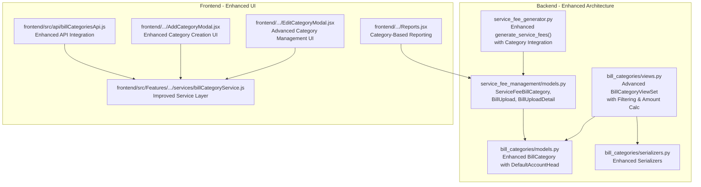
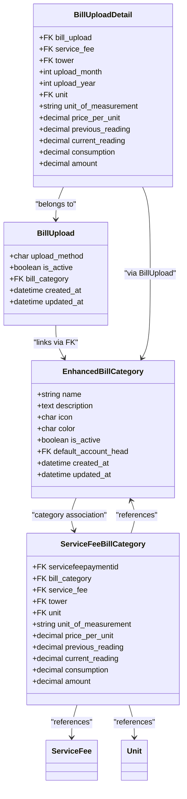
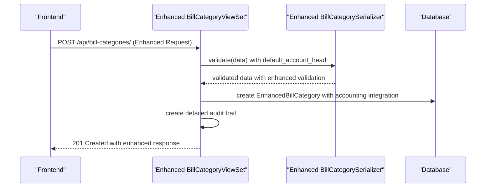
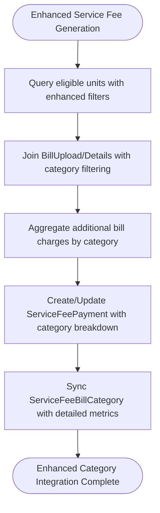
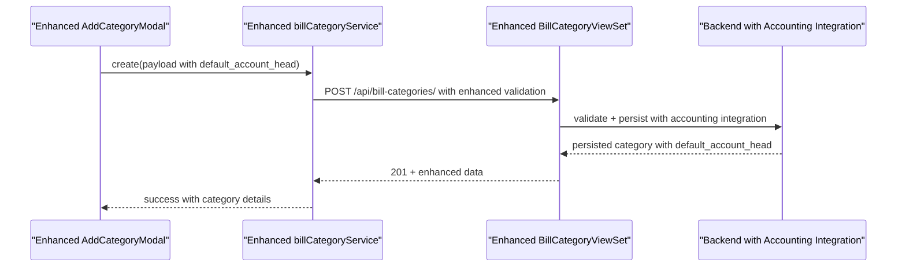
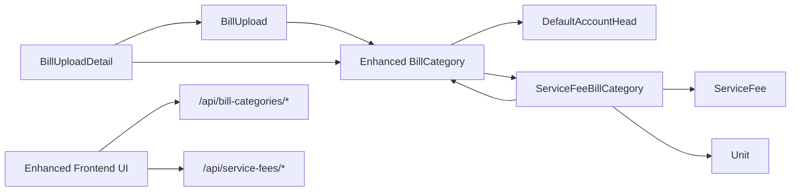

# Bill Categories & Organization

<cite>
**Referenced Files in This Document**
- [models.py](file://backend/bill_categories/models.py)
- [views.py](file://backend/bill_categories/views.py)
- [serializers.py](file://backend/bill_categories/serializers.py)
- [models.py](file://backend/service_fee_management/models.py)
- [service_fee_generator.py](file://backend/service_fee_management/utils/service_fee_generator.py)
- [bill_upload_models.py](file://backend/service_fee_management/bill_upload_models.py)
- [billCategoriesApi.js](file://frontend/src/api/billCategoriesApi.js)
- [billCategoryService.js](file://frontend/src/Features/ServiceFeeManagement/BillCategories/services/billCategoryService.js)
- [AddCategoryModal.jsx](file://frontend/src/Features/ServiceFeeManagement/BillCategories/components/AddCategoryModal.jsx)
- [EditCategoryModal.jsx](file://frontend/src/Features/ServiceFeeManagement/BillCategories/components/EditCategoryModal.jsx)
- [Reports.jsx](file://frontend/src/Features/ServiceFeeManagement/Reports/components/Reports.jsx)
</cite>

## Update Summary
**Changes Made**
- Enhanced BillCategory model with default_account_head foreign key for accounting integration
- Expanded BillCategoryViewSet with advanced filtering capabilities including service_fee_id, month, year, and tower_id parameters
- Added comprehensive amount calculation functionality for category-based reporting
- Improved frontend integration with enhanced category management UI components
- Strengthened audit trail system with detailed event tracking
- Enhanced service fee management integration with category-based bill categorization

## Table of Contents
1. [Introduction](#introduction)
2. [Project Structure](#project-structure)
3. [Core Components](#core-components)
4. [Architecture Overview](#architecture-overview)
5. [Detailed Component Analysis](#detailed-component-analysis)
6. [Enhanced Category Management System](#enhanced-category-management-system)
7. [Service Fee Integration](#service-fee-integration)
8. [Advanced Filtering and Reporting](#advanced-filtering-and-reporting)
9. [Audit Trail and Governance](#audit-trail-and-governance)
10. [Frontend Integration](#frontend-integration)
11. [Dependency Analysis](#dependency-analysis)
12. [Performance Considerations](#performance-considerations)
13. [Troubleshooting Guide](#troubleshooting-guide)
14. [Conclusion](#conclusion)

## Introduction
This document explains the enhanced bill categories management system used to classify and organize service fee components such as utilities (Electricity, Gas, Water, Internet, Waste). The system has been significantly enhanced with improved organization, management capabilities, and seamless integration with the new service fee management architecture. It covers category creation and configuration, category types and metadata, hierarchical relationships with billing generation, advanced filtering and reporting capabilities, and comprehensive administrative controls with detailed audit trails.

## Project Structure
The enhanced bill categories system spans backend Django models and REST APIs, integrated with the new service fee management architecture, and frontend components for administration and reporting.

**Diagram sources**
- [models.py](file://backend/bill_categories/models.py#L5-L95)
- [views.py](file://backend/bill_categories/views.py#L18-L414)
- [serializers.py](file://backend/bill_categories/serializers.py#L5-L133)
- [models.py](file://backend/service_fee_management/models.py#L1088-L1245)
- [service_fee_generator.py](file://backend/service_fee_management/utils/service_fee_generator.py#L26-L800)
- [billCategoriesApi.js](file://frontend/src/api/billCategoriesApi.js#L1-L41)
- [billCategoryService.js](file://frontend/src/Features/ServiceFeeManagement/BillCategories/services/billCategoryService.js#L1-L119)
- [AddCategoryModal.jsx](file://frontend/src/Features/ServiceFeeManagement/BillCategories/components/AddCategoryModal.jsx#L1-L262)
- [EditCategoryModal.jsx](file://frontend/src/Features/ServiceFeeManagement/BillCategories/components/EditCategoryModal.jsx#L1-L286)
- [Reports.jsx](file://frontend/src/Features/ServiceFeeManagement/Reports/components/Reports.jsx#L1-L528)

**Section sources**
- [models.py](file://backend/bill_categories/models.py#L5-L95)
- [views.py](file://backend/bill_categories/views.py#L18-L414)
- [serializers.py](file://backend/bill_categories/serializers.py#L5-L133)
- [models.py](file://backend/service_fee_management/models.py#L1088-L1245)
- [service_fee_generator.py](file://backend/service_fee_management/utils/service_fee_generator.py#L26-L800)
- [billCategoriesApi.js](file://frontend/src/api/billCategoriesApi.js#L1-L41)
- [billCategoryService.js](file://frontend/src/Features/ServiceFeeManagement/BillCategories/services/billCategoryService.js#L1-L119)
- [AddCategoryModal.jsx](file://frontend/src/Features/ServiceFeeManagement/BillCategories/components/AddCategoryModal.jsx#L1-L262)
- [EditCategoryModal.jsx](file://frontend/src/Features/ServiceFeeManagement/BillCategories/components/EditCategoryModal.jsx#L1-L286)
- [Reports.jsx](file://frontend/src/Features/ServiceFeeManagement/Reports/components/Reports.jsx#L1-L528)

## Core Components
- **Enhanced BillCategory**: Defines category metadata with default_account_head integration for accounting, plus comprehensive validation and indexing for efficient filtering.
- **ServiceFeeBillCategory**: Advanced model storing per-unit, per-category breakdown of charges with detailed consumption tracking and amount calculations.
- **Enhanced BillUpload and BillUploadDetail**: Capture uploaded utility bills per unit and month with category association and detailed consumption metrics.
- **Advanced BillCategoryViewSet**: Comprehensive REST endpoints supporting complex filtering, amount calculations, and detailed audit trails.
- **Enhanced Frontend Components**: Advanced UI for category management with validation, real-time feedback, and integration with the new service fee reporting system.

**Section sources**
- [models.py](file://backend/bill_categories/models.py#L5-L95)
- [models.py](file://backend/service_fee_management/models.py#L1088-L1245)
- [views.py](file://backend/bill_categories/views.py#L18-L414)
- [billCategoriesApi.js](file://frontend/src/api/billCategoriesApi.js#L1-L41)
- [billCategoryService.js](file://frontend/src/Features/ServiceFeeManagement/BillCategories/services/billCategoryService.js#L1-L119)
- [AddCategoryModal.jsx](file://frontend/src/Features/ServiceFeeManagement/BillCategories/components/AddCategoryModal.jsx#L1-L262)
- [EditCategoryModal.jsx](file://frontend/src/Features/ServiceFeeManagement/BillCategories/components/EditCategoryModal.jsx#L1-L286)
- [Reports.jsx](file://frontend/src/Features/ServiceFeeManagement/Reports/components/Reports.jsx#L1-L528)

## Architecture Overview
The enhanced system provides a robust foundation for category-based service fee management with seamless integration between category definition, bill upload ingestion, and comprehensive billing generation.

**Diagram sources**
- [models.py](file://backend/bill_categories/models.py#L5-L95)
- [models.py](file://backend/service_fee_management/models.py#L1088-L1245)

## Detailed Component Analysis

### Enhanced Backend: BillCategory Management
The BillCategory model has been significantly enhanced with accounting integration and comprehensive validation.

- **Purpose**: Define reusable categories for utility-type charges with accounting head integration
- **Enhanced Fields**: Unique name, optional description, icon, color, active flag, default_account_head, timestamps
- **Accounting Integration**: DefaultAccountHead foreign key enables automatic revenue posting to appropriate accounting heads
- **Advanced Validation**: Name uniqueness (case-insensitive), icon/color choices enforcement, comprehensive field validation
- **Performance Optimization**: Active-only listing endpoint with optimized indexes on is_active and created_at fields
- **Security**: Separate permissions for view/add/edit operations with comprehensive audit trail integration

**Diagram sources**
- [views.py](file://backend/bill_categories/views.py#L136-L169)
- [serializers.py](file://backend/bill_categories/serializers.py#L29-L90)
- [models.py](file://backend/bill_categories/models.py#L5-L95)

**Section sources**
- [models.py](file://backend/bill_categories/models.py#L5-L95)
- [views.py](file://backend/bill_categories/views.py#L18-L414)
- [serializers.py](file://backend/bill_categories/serializers.py#L5-L133)

### Advanced Bill Uploads and Category Embedding
The system now provides sophisticated bill upload ingestion with comprehensive category integration.

- **Enhanced BillUpload**: Tracks monthly uploads with method and active flag; links to enhanced BillCategory with default_account_head
- **Detailed BillUploadDetail**: Per-unit bill entries with comprehensive consumption tracking and amount calculations
- **ServiceFeeBillCategory Integration**: Advanced synchronization after billing generation with detailed consumption metrics
- **Multi-service Fee Support**: Category filtering by service_fee_id, month, year, and tower_id for precise reporting
- **Real-time Amount Calculation**: Dynamic amount aggregation with optional period and unit filtering

**Diagram sources**
- [service_fee_generator.py](file://backend/service_fee_management/utils/service_fee_generator.py#L26-L800)
- [models.py](file://backend/service_fee_management/models.py#L1088-L1245)

**Section sources**
- [models.py](file://backend/service_fee_management/models.py#L1088-L1245)
- [service_fee_generator.py](file://backend/service_fee_management/utils/service_fee_generator.py#L26-L800)

### Enhanced Frontend: Category Administration UI
The frontend components have been significantly improved with advanced validation and user experience enhancements.

- **Enhanced billCategoriesApi.js**: Comprehensive CRUD endpoints with advanced filtering and amount calculation support
- **Improved billCategoryService.js**: Enhanced service layer with better error handling and real-time validation
- **Advanced AddCategoryModal.jsx**: Sophisticated category creation with comprehensive validation, real-time feedback, and enhanced user experience
- **Enhanced EditCategoryModal.jsx**: Advanced category management with change detection, validation, and improved user interface
- **Integration with Reports**: Seamless integration with enhanced reporting system for category-based analytics

**Diagram sources**
- [billCategoriesApi.js](file://frontend/src/api/billCategoriesApi.js#L15-L18)
- [billCategoryService.js](file://frontend/src/Features/ServiceFeeManagement/BillCategories/services/billCategoryService.js#L45-L53)
- [AddCategoryModal.jsx](file://frontend/src/Features/ServiceFeeManagement/BillCategories/components/AddCategoryModal.jsx#L61-L98)
- [views.py](file://backend/bill_categories/views.py#L136-L169)

**Section sources**
- [billCategoriesApi.js](file://frontend/src/api/billCategoriesApi.js#L1-L41)
- [billCategoryService.js](file://frontend/src/Features/ServiceFeeManagement/BillCategories/services/billCategoryService.js#L1-L119)
- [AddCategoryModal.jsx](file://frontend/src/Features/ServiceFeeManagement/BillCategories/components/AddCategoryModal.jsx#L1-L262)
- [EditCategoryModal.jsx](file://frontend/src/Features/ServiceFeeManagement/BillCategories/components/EditCategoryModal.jsx#L1-L286)

## Enhanced Category Management System
The system now provides comprehensive category management with advanced filtering, reporting, and integration capabilities.

### Advanced Filtering Capabilities
The enhanced BillCategoryViewSet provides sophisticated filtering options:

- **Service Fee Context Filtering**: Filter categories used in specific service fees with optional month/year constraints
- **Tower-Specific Filtering**: Filter categories by tower for precise property management
- **Unit-Based Filtering**: Filter categories by specific units for targeted reporting
- **Dynamic Amount Calculation**: Real-time amount aggregation for each category based on bill uploads
- **Search and Active Status Filtering**: Comprehensive search capabilities with active status filtering

### Enhanced Reporting Integration
Categories now provide comprehensive reporting capabilities:

- **Category-Level Statistics**: Real-time amount calculations per category
- **Multi-dimensional Reporting**: Tower, unit, and service fee level reporting
- **Historical Analysis**: Month-by-month category performance tracking
- **Financial Integration**: Direct integration with accounting systems via default_account_head

**Section sources**
- [views.py](file://backend/bill_categories/views.py#L57-L126)
- [views.py](file://backend/bill_categories/views.py#L318-L413)
- [models.py](file://backend/bill_categories/models.py#L58-L65)

## Service Fee Integration
The enhanced system provides seamless integration between bill categories and the service fee management system.

### Category-Based Billing Generation
- **Automatic Category Detection**: System automatically identifies relevant categories for each service fee
- **Consumption-Based Billing**: Detailed consumption tracking with category-specific pricing
- **Hierarchical Billing Structure**: Support for complex billing structures with multiple categories
- **Real-time Updates**: Automatic updates when category configurations change

### Enhanced Payment Processing
- **Category-Specific Payments**: Payments can be tracked by category for detailed financial reporting
- **Multi-Category Billing**: Support for bills with multiple categories in a single payment
- **Advanced Allocation**: Sophisticated payment allocation across multiple categories
- **Integration with Accounting**: Direct integration with accounting systems via category default_account_head

**Section sources**
- [models.py](file://backend/service_fee_management/models.py#L1200-L1245)
- [service_fee_generator.py](file://backend/service_fee_management/utils/service_fee_generator.py#L26-L800)

## Advanced Filtering and Reporting
The system provides comprehensive filtering and reporting capabilities for enhanced category management.

### Multi-Dimensional Filtering
- **Service Fee ID Filtering**: Filter categories used in specific service fees
- **Period-Based Filtering**: Filter by month and year for historical analysis
- **Tower and Unit Filtering**: Precise targeting by property components
- **Status-Based Filtering**: Filter by active/inactive status for maintenance

### Enhanced Reporting Features
- **Real-time Amount Calculations**: Dynamic aggregation of category amounts
- **Category Performance Analytics**: Detailed performance metrics for each category
- **Comparative Analysis**: Ability to compare category performance across different periods
- **Export Capabilities**: Comprehensive export options for category data

**Section sources**
- [views.py](file://backend/bill_categories/views.py#L318-L413)
- [Reports.jsx](file://frontend/src/Features/ServiceFeeManagement/Reports/components/Reports.jsx#L1-L528)

## Audit Trail and Governance
The enhanced system provides comprehensive audit trail and governance capabilities.

### Detailed Audit Trail System
- **Event Tracking**: Comprehensive tracking of all category-related events
- **Change History**: Complete history of category modifications
- **User Accountability**: Detailed attribution of all actions to specific users
- **Financial Compliance**: Audit trail integration with accounting requirements

### Governance Controls
- **Permission Management**: Granular control over category management operations
- **Approval Workflows**: Optional approval processes for major category changes
- **Compliance Monitoring**: Automated monitoring for regulatory compliance
- **Reporting Integration**: Direct integration with compliance reporting systems

**Section sources**
- [views.py](file://backend/bill_categories/views.py#L150-L247)
- [models.py](file://backend/bill_categories/models.py#L58-L65)

## Frontend Integration
The frontend components provide an enhanced user experience for category management.

### Advanced User Interface
- **Real-time Validation**: Immediate feedback on category creation and modification
- **Intelligent Suggestions**: Contextual suggestions for category names and descriptions
- **Visual Feedback**: Enhanced visual indicators for category status and relationships
- **Responsive Design**: Optimized experience across all device types

### Integration Features
- **Live Data Updates**: Real-time updates when category data changes
- **Contextual Help**: Integrated help and guidance for category management
- **Bulk Operations**: Support for bulk category operations
- **Export Functionality**: Easy export of category data for external systems

**Section sources**
- [AddCategoryModal.jsx](file://frontend/src/Features/ServiceFeeManagement/BillCategories/components/AddCategoryModal.jsx#L1-L262)
- [EditCategoryModal.jsx](file://frontend/src/Features/ServiceFeeManagement/BillCategories/components/EditCategoryModal.jsx#L1-L286)
- [billCategoryService.js](file://frontend/src/Features/ServiceFeeManagement/BillCategories/services/billCategoryService.js#L1-L119)

## Dependency Analysis
The enhanced system maintains clean separation of concerns while providing comprehensive integration.

**Diagram sources**
- [models.py](file://backend/bill_categories/models.py#L5-L95)
- [models.py](file://backend/service_fee_management/models.py#L1088-L1245)
- [billCategoriesApi.js](file://frontend/src/api/billCategoriesApi.js#L1-L41)
- [Reports.jsx](file://frontend/src/Features/ServiceFeeManagement/Reports/components/Reports.jsx#L1-L528)

**Section sources**
- [models.py](file://backend/bill_categories/models.py#L5-L95)
- [models.py](file://backend/service_fee_management/models.py#L1088-L1245)
- [billCategoriesApi.js](file://frontend/src/api/billCategoriesApi.js#L1-L41)
- [Reports.jsx](file://frontend/src/Features/ServiceFeeManagement/Reports/components/Reports.jsx#L1-L528)

## Performance Considerations
The enhanced system incorporates several performance optimizations.

### Database Optimization
- **Enhanced Indexing**: Comprehensive indexing strategy for optimal query performance
- **Query Optimization**: Efficient queries with selective field retrieval
- **Batch Operations**: Optimized batch operations for large-scale category management
- **Caching Strategy**: Intelligent caching for frequently accessed category data

### Frontend Performance
- **Virtual Scrolling**: Efficient rendering of large category lists
- **Lazy Loading**: On-demand loading of category details
- **Optimized API Calls**: Minimized network requests with intelligent data fetching
- **Client-Side Caching**: Smart caching of category data for improved user experience

## Troubleshooting Guide
Common issues and solutions for the enhanced system.

### Category Management Issues
- **Category Creation Failures**: Check default_account_head configuration and validation rules
- **Filtering Problems**: Verify service_fee_id, month, year, and tower_id parameter formats
- **Amount Calculation Errors**: Ensure BillUploadDetail records exist for target periods
- **Audit Trail Issues**: Check user permissions and audit trail configuration

### Integration Problems
- **Service Fee Integration**: Verify category associations and billing generation processes
- **Accounting Integration**: Check default_account_head mappings and chart of accounts
- **Reporting Issues**: Validate category filters and data aggregation processes
- **Frontend Integration**: Check API endpoints and authentication for category management

**Section sources**
- [serializers.py](file://backend/bill_categories/serializers.py#L29-L90)
- [views.py](file://backend/bill_categories/views.py#L207-L249)
- [service_fee_generator.py](file://backend/service_fee_management/utils/service_fee_generator.py#L26-L800)

## Conclusion
The enhanced bill categories system provides a comprehensive foundation for service fee management with advanced organization, management capabilities, and seamless integration with the new service fee management architecture. The system's enhanced accounting integration, advanced filtering capabilities, comprehensive audit trail, and improved user experience make it an ideal solution for complex property management scenarios. The integration between category definition, bill upload ingestion, and billing generation creates a robust ecosystem for accurate financial reporting and operational efficiency.