# Billing Generation & Management

<cite>
**Referenced Files in This Document**
- [service_fee/models.py](file://backend/service_fee/models.py)
- [service_fee_management/models.py](file://backend/service_fee_management/models.py)
- [service_fee_management/utils/service_fee_generator.py](file://backend/service_fee_management/utils/service_fee_generator.py)
- [service_fee_management/scheduler.py](file://backend/service_fee_management/scheduler.py)
- [service_fee_management/views.py](file://backend/service_fee_management/views.py)
- [bill_categories/models.py](file://backend/bill_categories/models.py)
- [towers/models.py](file://backend/towers/models.py)
- [BillingManagement.jsx](file://frontend/src/Features/ServiceFeeManagement/BillingManagement/components/BillingManagement.jsx)
- [GenerateBillsWizard.jsx](file://frontend/src/Features/ServiceFeeManagement/BillingManagement/components/GenerateBillsWizard.jsx)
- [SelectMonthStep.jsx](file://frontend/src/Features/ServiceFeeManagement/BillingManagement/components/SelectMonthStep.jsx)
- [SelectScopeStep.jsx](file://frontend/src/Features/ServiceFeeManagement/BillingManagement/components/SelectScopeStep.jsx)
- [ReviewStep.jsx](file://frontend/src/Features/ServiceFeeManagement/BillingManagement/components/ReviewStep.jsx)
- [ConfirmStep.jsx](file://frontend/src/Features/ServiceFeeManagement/BillingManagement/components/ConfirmStep.jsx)
- [advance_payment_applicator.py](file://backend/service_fee_management/utils/advance_payment_applicator.py)
- [ADVANCE_PAYMENT_FLOW_DIAGRAM.txt](file://backend/service_fee_management/ADVANCE_PAYMENT_FLOW_DIAGRAM.txt)
- [SERVICE_FEE_PAYMENT_DETAIL_IMPLEMENTATION.md](file://backend/SERVICE_FEE_PAYMENT_DETAIL_IMPLEMENTATION.md)
- [0104_servicefeepayment_account_holder_id_and_more.py](file://backend/service_fee_management/migrations/0104_servicefeepayment_account_holder_id_and_more.py)
- [0105_advancepayment_account_holder_id_and_more.py](file://backend/service_fee_management/migrations/0105_advancepayment_account_holder_id_and_more.py)
</cite>

## Update Summary
**Changes Made**
- Enhanced account holder detection logic with improved owner prioritization over resident accounts
- Added two-table update synchronization for unit contact information during billing generation
- Improved error handling for units missing primary contact information
- Updated billing generation workflow to include unit contact synchronization
- Enhanced payment processing with better account holder identification

## Table of Contents
1. [Introduction](#introduction)
2. [Project Structure](#project-structure)
3. [Core Components](#core-components)
4. [Architecture Overview](#architecture-overview)
5. [Detailed Component Analysis](#detailed-component-analysis)
6. [Enhanced Account Holder Detection](#enhanced-account-holder-detection)
7. [Two-Table Update Synchronization](#two-table-update-synchronization)
8. [Wizard Interface System](#wizard-interface-system)
9. [Advanced Payment Tracking](#advanced-payment-tracking)
10. [Dependency Analysis](#dependency-analysis)
11. [Performance Considerations](#performance-considerations)
12. [Troubleshooting Guide](#troubleshooting-guide)
13. [Conclusion](#conclusion)
14. [Appendices](#appendices)

## Introduction
This document explains the enhanced billing generation and management system for service fees. It covers the new wizard interface for streamlined bill creation, automated monthly billing generation with improved account holder detection, advanced payment tracking with automatic advance application, recurring schedule configuration, batch billing workflows, calculation algorithms, due date management, and service period tracking. The system now features comprehensive filtering and management capabilities through the frontend wizard interface, robust payment allocation logic with penalty-first hierarchy, and advanced audit trails for payment tracking. **Updated** Enhanced with improved account holder detection logic prioritizing owner accounts over resident accounts, two-table update synchronization for unit contact information, and better error handling for units missing primary contact information.

## Project Structure
The billing system spans backend Django models and utilities, enhanced frontend wizard interface, a scheduler for automation, and advanced payment tracking systems with improved account holder management.

```mermaid
graph TB
subgraph "Backend"
SF["ServiceFee<br/>Models"]
SFM["ServiceFeeManagement<br/>Models & Views"]
GEN["Service Fee Generator<br/>Utilities"]
SCH["Scheduler"]
CAT["Bill Categories"]
CONFIG["ServiceFeeGenerationConfig<br/>Snapshot System"]
PENALTY["ServiceFeePaymentLatePenaltyTier<br/>Penalty Management"]
ADVANCE["AdvancePayment<br/>System"]
APPLICATOR["advance_payment_applicator<br/>Utilities"]
TOWERS["Towers Models<br/>Unit & Owner Management"]
END
subgraph "Frontend"
BM["BillingManagement.jsx"]
WIZARD["GenerateBillsWizard.jsx"]
MONTH["SelectMonthStep.jsx"]
SCOPE["SelectScopeStep.jsx"]
REVIEW["ReviewStep.jsx"]
CONFIRM["ConfirmStep.jsx"]
END
SF --> SFM
GEN --> SFM
SCH --> GEN
CAT --> SFM
CONFIG --> SFM
PENALTY --> SFM
ADVANCE --> APPLICATOR
APPLICATOR --> SFM
BM --> WIZARD
WIZARD --> SFM
MONTH --> WIZARD
SCOPE --> WIZARD
REVIEW --> WIZARD
CONFIRM --> WIZARD
SFM --> TOWERS
```

**Diagram sources**
- [service_fee/models.py](file://backend/service_fee/models.py#L10-L180)
- [service_fee_management/models.py](file://backend/service_fee_management/models.py#L1231-L1300)
- [service_fee_management/utils/advance_payment_applicator.py](file://backend/service_fee_management/utils/advance_payment_applicator.py#L15-L211)
- [service_fee_management/ADVANCE_PAYMENT_FLOW_DIAGRAM.txt](file://backend/service_fee_management/ADVANCE_PAYMENT_FLOW_DIAGRAM.txt#L1-L168)
- [BillingManagement.jsx](file://frontend/src/Features/ServiceFeeManagement/BillingManagement/components/BillingManagement.jsx#L450-L455)
- [GenerateBillsWizard.jsx](file://frontend/src/Features/ServiceFeeManagement/BillingManagement/components/GenerateBillsWizard.jsx#L1-L386)
- [towers/models.py](file://backend/towers/models.py#L70-L136)

**Section sources**
- [service_fee/models.py](file://backend/service_fee/models.py#L10-L180)
- [service_fee_management/models.py](file://backend/service_fee_management/models.py#L1231-L1300)
- [service_fee_management/utils/advance_payment_applicator.py](file://backend/service_fee_management/utils/advance_payment_applicator.py#L15-L211)
- [service_fee_management/ADVANCE_PAYMENT_FLOW_DIAGRAM.txt](file://backend/service_fee_management/ADVANCE_PAYMENT_FLOW_DIAGRAM.txt#L1-L168)
- [BillingManagement.jsx](file://frontend/src/Features/ServiceFeeManagement/BillingManagement/components/BillingManagement.jsx#L450-L455)
- [GenerateBillsWizard.jsx](file://frontend/src/Features/ServiceFeeManagement/BillingManagement/components/GenerateBillsWizard.jsx#L1-L386)
- [towers/models.py](file://backend/towers/models.py#L70-L136)

## Core Components
- ServiceFee: Defines fee settings, billing cycle, due day, accepted payment methods, reminders, and late payment penalties.
- ServiceFeePayment: Represents monthly billing records with amounts, due dates, payment status, and service status, now with enhanced account holder tracking.
- ServiceFeeBilling: Stores payment transactions linked to ServiceFeePayment, including payment method, reference number, and notes with enhanced payment tracking.
- ServiceFeeGenerationConfig: **NEW** Snapshot configuration capturing ServiceFee settings at generation time for historical consistency.
- ServiceFeePaymentLatePenaltyTier: **NEW** Comprehensive penalty tier management with active/inactive status tracking and calculation basis.
- BillUpload and BillUploadDetail: Enable manual and CSV-based bill entry for categories like electricity, gas, water.
- ServiceFeeBillCategory: Normalized category details linked to ServiceFeePayment.
- ServiceFeeGenerationSchedule: Configures automated generation schedules with recurring frequency and targeting.
- AdvancePayment: **NEW** Advanced payment tracking system for overpayments and advance applications.
- advance_payment_applicator: **NEW** Utility for automatic advance payment application to existing bills.
- Scheduler: Periodically generates missing months of billing with enhanced workflow integration.
- **NEW** Enhanced account holder detection with owner prioritization logic.
- **NEW** Two-table update synchronization for unit contact information.

**Section sources**
- [service_fee/models.py](file://backend/service_fee/models.py#L10-L180)
- [service_fee_management/models.py](file://backend/service_fee_management/models.py#L1231-L1300)
- [service_fee_management/utils/advance_payment_applicator.py](file://backend/service_fee_management/utils/advance_payment_applicator.py#L15-L211)
- [service_fee_management/ADVANCE_PAYMENT_FLOW_DIAGRAM.txt](file://backend/service_fee_management/ADVANCE_PAYMENT_FLOW_DIAGRAM.txt#L1-L168)
- [towers/models.py](file://backend/towers/models.py#L70-L136)

## Architecture Overview
The system features a comprehensive architecture with wizard-based interfaces and advanced payment tracking. ServiceFee defines the master fee configuration. The generator creates ServiceFeePayment records per unit and month with enhanced configuration snapshots. Transactions are recorded as ServiceFeeBilling entries with payment type differentiation for regular and advance payments. Bill categories are uploaded and synchronized into ServiceFeeBillCategory for each payment. **NEW** The wizard interface streamlines the billing generation process with step-by-step guidance. **NEW** Advanced payment tracking automatically applies available advances to existing unpaid bills. **NEW** Enhanced account holder detection logic prioritizes owner accounts over resident accounts during payment processing. **NEW** Two-table update synchronization ensures unit contact information stays consistent with actual account holders.

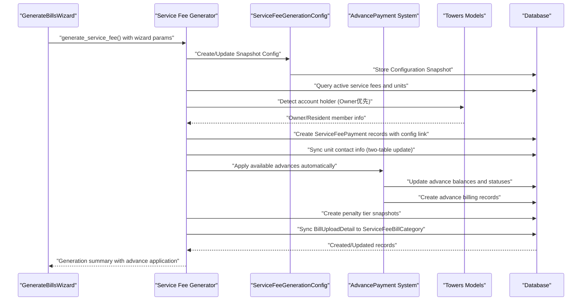

**Diagram sources**
- [GenerateBillsWizard.jsx](file://frontend/src/Features/ServiceFeeManagement/BillingManagement/components/GenerateBillsWizard.jsx#L257-L291)
- [service_fee_management/utils/advance_payment_applicator.py](file://backend/service_fee_management/utils/advance_payment_applicator.py#L15-L211)
- [service_fee_management/ADVANCE_PAYMENT_FLOW_DIAGRAM.txt](file://backend/service_fee_management/ADVANCE_PAYMENT_FLOW_DIAGRAM.txt#L33-L90)
- [service_fee_management/utils/service_fee_generator.py](file://backend/service_fee_management/utils/service_fee_generator.py#L796-L823)
- [service_fee_management/views.py](file://backend/service_fee_management/views.py#L1750-L1777)

## Detailed Component Analysis

### Automated Monthly Billing Generation
- Purpose: Generate monthly billing records for active service fees and units with owners through enhanced wizard interface.
- Inputs: Year, month, optional filters (unit IDs, tower ID, service fee IDs, bill category IDs), force regeneration flag.
- Workflow:
  - Validate year/month through wizard interface.
  - Query active service fees and units with owners.
  - Optionally filter by bill categories, service fees, units, or towers via wizard selections.
  - **NEW** Create/update ServiceFeeGenerationConfig snapshots for each service fee with fee_amount, currency, frequency, billing_cycle, due_day, payment methods, and reminder settings.
  - **NEW** Enhanced account holder detection: Prioritize owner accounts over resident accounts when determining billing contact information.
  - For each eligible combination, compute due date from service fee's due day (with month-end fallback).
  - Aggregate base fee plus additional bill categories from uploads.
  - **NEW** Automatically apply available advance payments to existing unpaid bills during generation.
  - **NEW** Two-table update synchronization: Sync unit contact information from matched account holder if unit fields are empty.
  - Create or update ServiceFeePayment records atomically with generation_config linkage.
  - **NEW** Snapshot penalty tiers for each payment based on active penalty settings.
  - Sync BillUploadDetail to ServiceFeeBillCategory for each payment.
- Outputs: Summary with created/regenerated/skipped counts and records, including advance application details.

**Section sources**
- [GenerateBillsWizard.jsx](file://frontend/src/Features/ServiceFeeManagement/BillingManagement/components/GenerateBillsWizard.jsx#L257-L291)
- [service_fee_management/utils/advance_payment_applicator.py](file://backend/service_fee_management/utils/advance_payment_applicator.py#L15-L211)
- [service_fee_management/utils/service_fee_generator.py](file://backend/service_fee_management/utils/service_fee_generator.py#L796-L823)
- [service_fee_management/views.py](file://backend/service_fee_management/views.py#L1750-L1777)

### Enhanced Account Holder Detection Logic
- Purpose: Improve accuracy of account holder identification by prioritizing owner accounts over resident accounts.
- Priority Logic:
  1. Use explicit account holder info from request if available
  2. Fallback to resident_id/identity_id if account holder NOT provided - **Priority Change**: Try Owner ONLY
  3. Final Fallback to Unit Owner if still no identity
- Implementation Details:
  - When account holder type and ID are provided, use them directly
  - If only identity_id is provided, prioritize owner lookup over resident lookup
  - Final fallback searches for unit owner if both previous attempts fail
  - Ensures resident_member is populated with correct account holder information
- Benefits: Reduces billing errors by ensuring owner information is used when available, improving payment tracking accuracy.

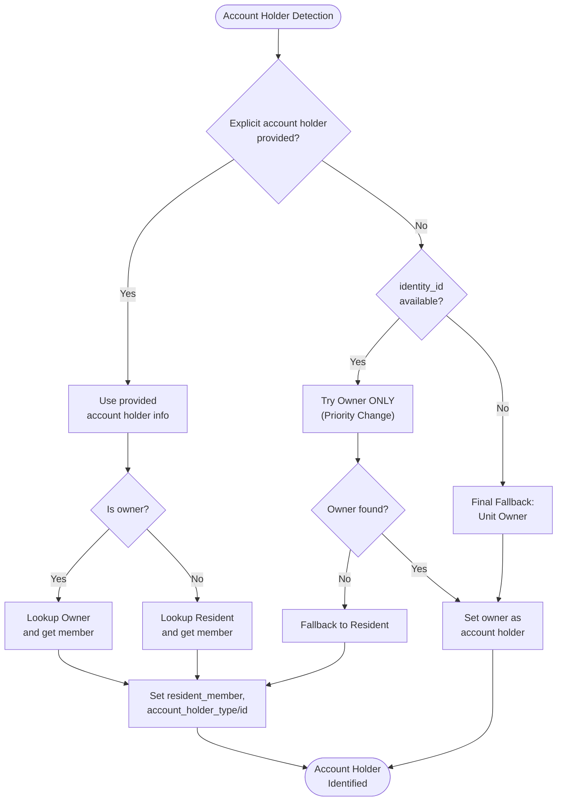

**Diagram sources**
- [service_fee_management/views.py](file://backend/service_fee_management/views.py#L1750-L1777)

**Section sources**
- [service_fee_management/views.py](file://backend/service_fee_management/views.py#L1750-L1777)

### Two-Table Update Synchronization
- Purpose: Ensure unit contact information stays synchronized with actual account holders during billing generation.
- Process: After generating billing records, synchronize unit contact fields (primary_name, primary_email, primary_number) from matched account holder information.
- Logic:
  - Execute bulk UPDATE operation using SQL join between towers_unit and member tables
  - Prioritize owner member over resident member when multiple options exist
  - Only update empty fields to avoid overwriting manual overrides
  - Uses ROW_NUMBER() window function to select highest priority member per unit
- Performance: Direct SQL UPDATE for efficiency, avoiding Python-side processing overhead.
- Data Integrity: Ensures unit primary contact matches the actual person responsible for billing.

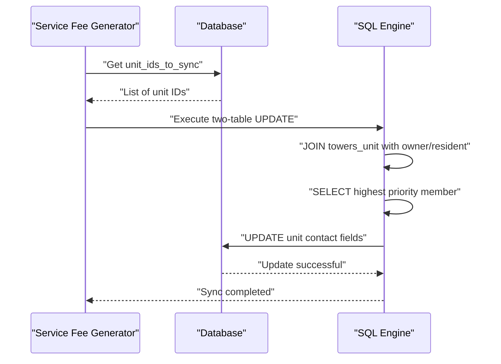

**Diagram sources**
- [service_fee_management/utils/service_fee_generator.py](file://backend/service_fee_management/utils/service_fee_generator.py#L796-L823)

**Section sources**
- [service_fee_management/utils/service_fee_generator.py](file://backend/service_fee_management/utils/service_fee_generator.py#L796-L823)

### Wizard Interface System
- Purpose: Provide step-by-step guided interface for billing generation with enhanced user experience.
- Components:
  - SelectMonthStep: Month selection with navigation controls and validation.
  - SelectScopeStep: Tower and unit selection with category filtering.
  - ReviewStep: Billing summary with calculations and warnings.
  - ConfirmStep: Success confirmation with action buttons.
- Features: Real-time unit counting, category loading, validation, and progress tracking.

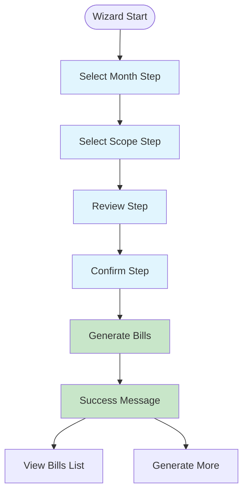

**Diagram sources**
- [GenerateBillsWizard.jsx](file://frontend/src/Features/ServiceFeeManagement/BillingManagement/components/GenerateBillsWizard.jsx#L71-L76)
- [SelectMonthStep.jsx](file://frontend/src/Features/ServiceFeeManagement/BillingManagement/components/SelectMonthStep.jsx#L1-L68)
- [SelectScopeStep.jsx](file://frontend/src/Features/ServiceFeeManagement/BillingManagement/components/SelectScopeStep.jsx#L1-L258)
- [ReviewStep.jsx](file://frontend/src/Features/ServiceFeeManagement/BillingManagement/components/ReviewStep.jsx#L1-L234)
- [ConfirmStep.jsx](file://frontend/src/Features/ServiceFeeManagement/BillingManagement/components/ConfirmStep.jsx#L1-L120)

**Section sources**
- [GenerateBillsWizard.jsx](file://frontend/src/Features/ServiceFeeManagement/BillingManagement/components/GenerateBillsWizard.jsx#L1-L386)
- [SelectMonthStep.jsx](file://frontend/src/Features/ServiceFeeManagement/BillingManagement/components/SelectMonthStep.jsx#L1-L68)
- [SelectScopeStep.jsx](file://frontend/src/Features/ServiceFeeManagement/BillingManagement/components/SelectScopeStep.jsx#L1-L258)
- [ReviewStep.jsx](file://frontend/src/Features/ServiceFeeManagement/BillingManagement/components/ReviewStep.jsx#L1-L234)
- [ConfirmStep.jsx](file://frontend/src/Features/ServiceFeeManagement/BillingManagement/components/ConfirmStep.jsx#L1-L120)

### Advanced Payment Tracking
- Purpose: Track and manage payment applications with automatic advance payment handling and detailed audit trails.
- Key features: Payment type differentiation (service_fee_bill_payment vs advance_payment), detailed payment tracking, audit trail creation, and automatic advance application.
- Payment allocation hierarchy: Penalty → Base Fee → Bill Categories → Excess Amount (Advance Payment).
- Automatic advance application: When advance payments are recorded, system automatically applies them to existing unpaid bills in FIFO order.

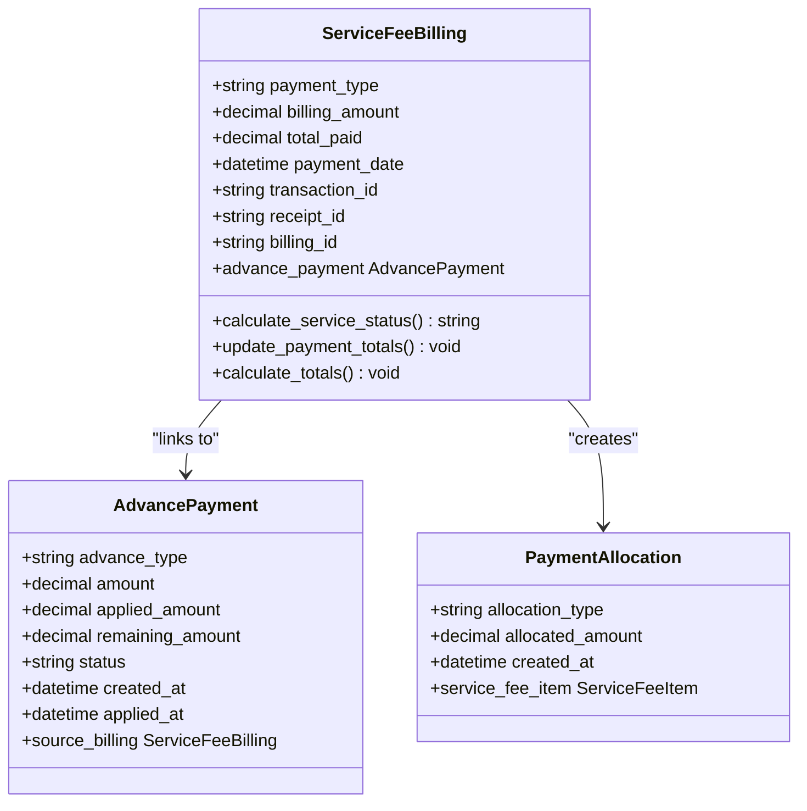

**Diagram sources**
- [service_fee_management/models.py](file://backend/service_fee_management/models.py#L12-L150)
- [service_fee_management/models.py](file://backend/service_fee_management/models.py#L1231-L1300)
- [service_fee_management/utils/advance_payment_applicator.py](file://backend/service_fee_management/utils/advance_payment_applicator.py#L15-L211)

**Section sources**
- [service_fee_management/models.py](file://backend/service_fee_management/models.py#L12-L150)
- [service_fee_management/models.py](file://backend/service_fee_management/models.py#L1231-L1300)
- [service_fee_management/utils/advance_payment_applicator.py](file://backend/service_fee_management/utils/advance_payment_applicator.py#L15-L211)
- [ADVANCE_PAYMENT_FLOW_DIAGRAM.txt](file://backend/service_fee_management/ADVANCE_PAYMENT_FLOW_DIAGRAM.txt#L1-L168)
- [SERVICE_FEE_PAYMENT_DETAIL_IMPLEMENTATION.md](file://backend/SERVICE_FEE_PAYMENT_DETAIL_IMPLEMENTATION.md#L129-L166)

### ServiceFeeGenerationConfig - Snapshot Configuration Management
- Purpose: Capture and store ServiceFee configuration snapshots at generation time to ensure historical consistency.
- Key fields: service_fee (FK), year, month, fee_amount, currency, frequency, billing_cycle, due_day, payment method flags, reminder settings.
- Behavior: Creates one configuration per ServiceFee per billing period, linked to all payments in that period.
- Historical tracking: Prevents changes to global ServiceFee settings from affecting past billing records.

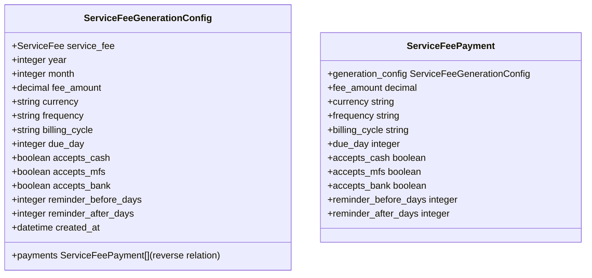

**Diagram sources**
- [service_fee_management/models.py](file://backend/service_fee_management/models.py#L1590-L1636)
- [service_fee_management/models.py](file://backend/service_fee_management/models.py#L366-L374)

**Section sources**
- [service_fee_management/models.py](file://backend/service_fee_management/models.py#L1590-L1636)
- [service_fee_management/models.py](file://backend/service_fee_management/models.py#L366-L374)

### ServiceFeePaymentLatePenaltyTier - Comprehensive Penalty Management
- Purpose: Manage penalty tiers with active/inactive status tracking and calculation basis.
- Key fields: payment (FK), days_overdue, penalty_percentage, tier_name, penalty_calculation_basis, order, status.
- Active tier determination: Automatically selects the appropriate penalty tier based on days overdue.
- Historical preservation: Tiers are snapshotted at generation time to maintain historical accuracy.
- Calculation basis: Supports different penalty calculation bases (base_amount, total_amount).

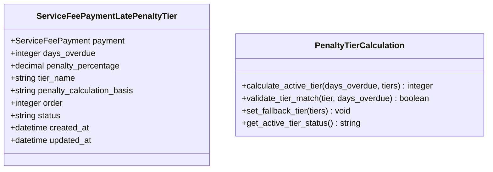

**Diagram sources**
- [service_fee_management/models.py](file://backend/service_fee_management/models.py#L1522-L1587)
- [service_fee_management/utils/service_fee_generator.py](file://backend/service_fee_management/utils/service_fee_generator.py#L900-L950)

**Section sources**
- [service_fee_management/models.py](file://backend/service_fee_management/models.py#L1522-L1587)
- [service_fee_management/utils/service_fee_generator.py](file://backend/service_fee_management/utils/service_fee_generator.py#L900-L950)

### Recurring Schedule Configuration
- Purpose: Configure automated generation schedules with daily/weekly/monthly recurrence and targeting.
- Key fields: schedule_name, tower (optional), service_fee (optional), unit IDs filter, generation_day, generation_hour, generation_minute, recurring_frequency, is_recurring, status, last_executed, last_execution_result.
- Behavior: Schedules determine when to run generation logic; non-recurring schedules run once; recurring schedules align with frequency and day/time.

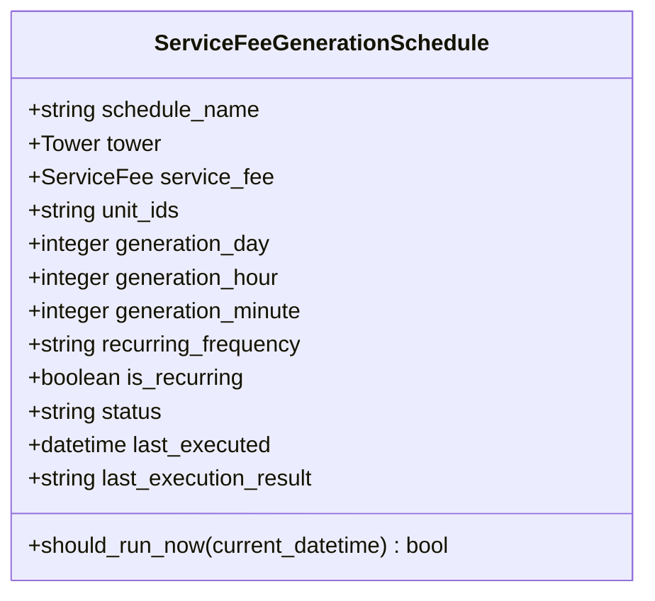

**Diagram sources**
- [service_fee_management/models.py](file://backend/service_fee_management/models.py#L851-L1021)

**Section sources**
- [service_fee_management/models.py](file://backend/service_fee_management/models.py#L851-L1021)

### Batch Billing Workflows
- Purpose: Support batch generation and regeneration of billing records across multiple months with enhanced wizard integration.
- Functionality: generate_all_missing_months iterates through a date range and invokes generate_service_fees for each month.
- Atomicity: Uses transaction.atomic to ensure consistency across created/updated records and category sync.
- **NEW** Includes ServiceFeeGenerationConfig snapshot creation, penalty tier management, automatic advance application, and two-table update synchronization within batch operations.

**Section sources**
- [service_fee_management/utils/service_fee_generator.py](file://backend/service_fee_management/utils/service_fee_generator.py#L710-L807)

### Billing Calculation Algorithms
- Due date calculation: Uses service fee's due_day; if invalid for the month (e.g., 31st in February), falls back to the last day of the month.
- Amount calculation: Base fee amount plus aggregated additional bill category charges from uploads.
- Payment status: ServiceFeePayment.service_status reflects due/partial/paid/overdue based on total paid versus the fixed billing amount.
- Cumulative status: When listing payments, cumulative totals across billing records are computed to reflect overall payment progress.
- **NEW** Penalty calculation: Applies penalty tiers based on days overdue, with active tier determination and calculation basis selection.
- **NEW** Advance payment integration: Automatically applies available advances to existing unpaid bills during generation.
- **NEW** Enhanced account holder detection: Improved logic for determining billing contact information during payment processing.

**Section sources**
- [service_fee_management/utils/service_fee_generator.py](file://backend/service_fee_management/utils/service_fee_generator.py#L266-L280)
- [service_fee_management/utils/service_fee_generator.py](file://backend/service_fee_management/utils/service_fee_generator.py#L514-L660)
- [service_fee_management/utils/service_fee_generator.py](file://backend/service_fee_management/utils/service_fee_generator.py#L1040-L1068)
- [service_fee_management/views.py](file://backend/service_fee_management/views.py#L919-L983)

### Due Date Management and Service Period Tracking
- Due date: Derived from service fee's due_day per month-year period.
- Service period: ServiceFeePayment stores service_period_month and service_period_year to track billing periods.
- Overdue logic: Service status considers current date versus due_date.
- **NEW** Penalty tier activation: Automatically activates appropriate penalty tier based on days overdue during generation.
- **NEW** Advance payment tracking: Tracks advance balances and application status for each unit.
- **NEW** Enhanced account holder tracking: Maintains owner information snapshot for historical reference.

**Section sources**
- [service_fee_management/utils/service_fee_generator.py](file://backend/service_fee_management/utils/service_fee_generator.py#L1430-L1439)
- [service_fee_management/models.py](file://backend/service_fee_management/models.py#L190-L340)
- [service_fee_management/utils/service_fee_generator.py](file://backend/service_fee_management/utils/service_fee_generator.py#L916-L927)

### Billing Management Interface
- Filtering and search: Payments can be filtered by status, payment method, resident, unit, tower, and service period date range; supports search across transaction ID, resident name, unit name, and reference number.
- Pagination and ordering: Controlled via query parameters.
- Display: Expands payment records to show individual billing records with cumulative status and remaining amounts.
- **NEW** Configuration view: Can display ServiceFeeGenerationConfig details linked to payments for historical reference.
- **NEW** Wizard integration: Seamless integration with wizard interface for bill generation and management.
- **NEW** Enhanced payment processing: Improved account holder detection and two-table update synchronization.

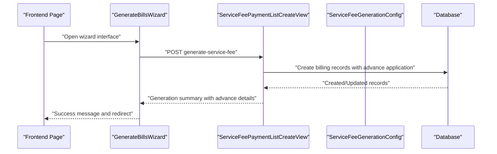

**Diagram sources**
- [BillingManagement.jsx](file://frontend/src/Features/ServiceFeeManagement/BillingManagement/components/BillingManagement.jsx#L281-L285)
- [GenerateBillsWizard.jsx](file://frontend/src/Features/ServiceFeeManagement/BillingManagement/components/GenerateBillsWizard.jsx#L257-L291)
- [service_fee_management/views.py](file://backend/service_fee_management/views.py#L769-L1005)

**Section sources**
- [BillingManagement.jsx](file://frontend/src/Features/ServiceFeeManagement/BillingManagement/components/BillingManagement.jsx#L281-L285)
- [GenerateBillsWizard.jsx](file://frontend/src/Features/ServiceFeeManagement/BillingManagement/components/GenerateBillsWizard.jsx#L257-L291)
- [service_fee_management/views.py](file://backend/service_fee_management/views.py#L769-L1005)

### Bill Upload Functionality (Manual and Bulk)
- Manual entry: BillUpload and BillUploadDetail enable per-unit bill entries with unit-of-measurement, readings, and amounts.
- Category synchronization: ServiceFeeBillCategory is populated from BillUploadDetail for each payment, ensuring additional charges are included in billing totals.
- Category model: BillCategory defines category metadata (name, description, icon, color, active flag).

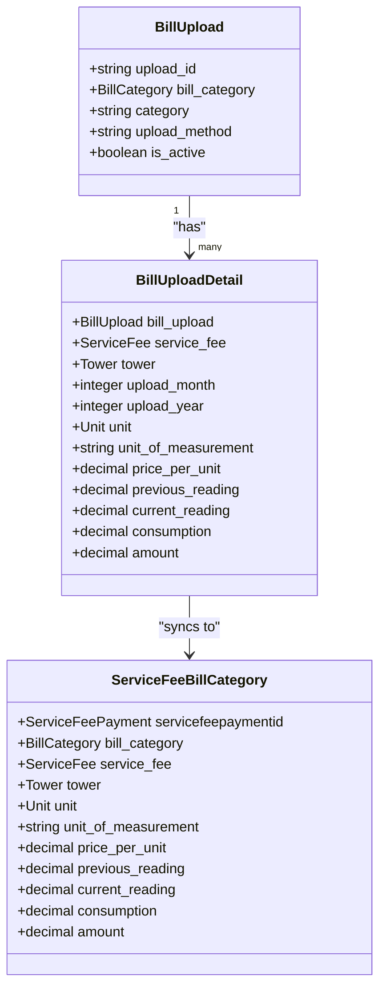

**Diagram sources**
- [service_fee_management/models.py](file://backend/service_fee_management/models.py#L1088-L1182)
- [service_fee_management/models.py](file://backend/service_fee_management/models.py#L1184-L1229)
- [bill_categories/models.py](file://backend/bill_categories/models.py#L5-L86)

**Section sources**
- [service_fee_management/models.py](file://backend/service_fee_management/models.py#L1088-L1182)
- [service_fee_management/models.py](file://backend/service_fee_management/models.py#L1184-L1229)
- [bill_categories/models.py](file://backend/bill_categories/models.py#L5-L86)

### Relationship Between Service Fee Settings and Billing Generation
- Fee amount and currency: ServiceFee defines fee_amount and currency; used as the base amount in billing.
- Billing cycle and due day: ServiceFee.billing_cycle and due_day determine how billing periods are aligned and when due dates fall.
- Frequency: ServiceFee.frequency influences how often service fees are charged (monthly, quarterly, yearly).
- Payment methods: ServiceFee.accepts_cash, accepts_mfs, accepts_bank define supported payment modes.
- Reminders: ServiceFee.reminder_before_days and reminder_after_days inform reminder scheduling.
- Late penalties: ServiceFee.late_payment_enabled and LatePenaltyTier tiers define penalty computation.
- **NEW** Configuration snapshots: ServiceFeeGenerationConfig captures settings at generation time for historical consistency.
- **NEW** Advance payment system: AdvancedPayment model tracks overpayments and enables automatic application to future bills.
- **NEW** Enhanced account holder tracking: Improved owner/resident detection logic for accurate billing contact information.

**Section sources**
- [service_fee/models.py](file://backend/service_fee/models.py#L14-L79)
- [service_fee/models.py](file://backend/service_fee/models.py#L316-L346)
- [service_fee_management/models.py](file://backend/service_fee_management/models.py#L1590-L1636)
- [service_fee_management/models.py](file://backend/service_fee_management/models.py#L1231-L1300)

### Examples of Billing Scenarios
- Monthly generation: The scheduler runs periodically to generate missing months from the earliest service fee date to the current month.
- Category-driven billing: Additional bill categories (e.g., electricity) are aggregated per unit and month and added to the base fee.
- Partial payments: Multiple billing records can accumulate toward full payment; cumulative status reflects overall progress.
- Overdue handling: Service status transitions to overdue when the current date passes the due date.
- **NEW** Penalty tier application: Penalty tiers are automatically applied based on days overdue during generation, with active tier determination.
- **NEW** Historical consistency: ServiceFeeGenerationConfig ensures that changes to global settings don't affect past billing records.
- **NEW** Advance payment application: Automatic application of available advances to existing unpaid bills during payment processing.
- **NEW** Wizard interface: Streamlined bill generation process with step-by-step guidance and real-time validation.
- **NEW** Enhanced account holder detection: Improved logic ensures owner information is prioritized over resident information when determining billing contacts.
- **NEW** Two-table update synchronization: Automatic synchronization of unit contact information with actual account holders during billing generation.

**Section sources**
- [service_fee_management/scheduler.py](file://backend/service_fee_management/scheduler.py#L10-L65)
- [service_fee_management/utils/service_fee_generator.py](file://backend/service_fee_management/utils/service_fee_generator.py#L514-L660)
- [service_fee_management/utils/service_fee_generator.py](file://backend/service_fee_management/utils/service_fee_generator.py#L900-L950)
- [service_fee_management/views.py](file://backend/service_fee_management/views.py#L919-L983)
- [GenerateBillsWizard.jsx](file://frontend/src/Features/ServiceFeeManagement/BillingManagement/components/GenerateBillsWizard.jsx#L1-L386)

## Dependency Analysis
The system exhibits clear separation of concerns with enhanced wizard interface, advanced payment tracking, and improved account holder management:
- ServiceFee holds master fee configuration.
- ServiceFeePayment represents monthly billing records with enhanced account holder tracking.
- ServiceFeeBilling captures payment transactions linked to payments with payment type differentiation.
- **NEW** ServiceFeeGenerationConfig captures snapshot configurations at generation time.
- **NEW** ServiceFeePaymentLatePenaltyTier manages penalty tier snapshots.
- BillUpload and BillUploadDetail capture category-specific charges.
- ServiceFeeBillCategory normalizes category details for each payment.
- AdvancePayment tracks overpayments and enables automatic application.
- advance_payment_applicator handles automatic advance payment application logic.
- Scheduler orchestrates generation via the generator utility.
- **NEW** GenerateBillsWizard provides enhanced user interface for billing generation.
- **NEW** Enhanced account holder detection logic with owner prioritization.
- **NEW** Two-table update synchronization for unit contact information.

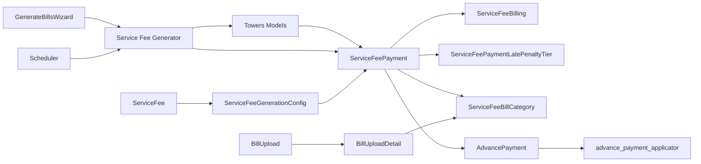

**Diagram sources**
- [service_fee/models.py](file://backend/service_fee/models.py#L10-L180)
- [service_fee_management/models.py](file://backend/service_fee_management/models.py#L1590-L1636)
- [service_fee_management/models.py](file://backend/service_fee_management/models.py#L1522-L1587)
- [service_fee_management/models.py](file://backend/service_fee_management/models.py#L1231-L1300)
- [service_fee_management/utils/advance_payment_applicator.py](file://backend/service_fee_management/utils/advance_payment_applicator.py#L15-L211)
- [GenerateBillsWizard.jsx](file://frontend/src/Features/ServiceFeeManagement/BillingManagement/components/GenerateBillsWizard.jsx#L1-L386)
- [service_fee_management/utils/service_fee_generator.py](file://backend/service_fee_management/utils/service_fee_generator.py#L796-L823)

**Section sources**
- [service_fee/models.py](file://backend/service_fee/models.py#L10-L180)
- [service_fee_management/models.py](file://backend/service_fee_management/models.py#L1590-L1636)
- [service_fee_management/models.py](file://backend/service_fee_management/models.py#L1522-L1587)
- [service_fee_management/models.py](file://backend/service_fee_management/models.py#L1231-L1300)
- [service_fee_management/utils/advance_payment_applicator.py](file://backend/service_fee_management/utils/advance_payment_applicator.py#L15-L211)
- [GenerateBillsWizard.jsx](file://frontend/src/Features/ServiceFeeManagement/BillingManagement/components/GenerateBillsWizard.jsx#L1-L386)
- [service_fee_management/utils/service_fee_generator.py](file://backend/service_fee_management/utils/service_fee_generator.py#L796-L823)

## Performance Considerations
- Bulk operations: The generator uses bulk_create and bulk_update to minimize database round-trips.
- Atomic transactions: All generation steps occur within a single transaction to ensure consistency.
- Efficient queries: Raw SQL with joins and direct column aliases minimizes Python-side processing.
- Indexes: Bill category and other frequently queried fields have database indexes to speed lookups.
- **NEW** Configuration caching: ServiceFeeGenerationConfig snapshots are cached per service fee per period to avoid repeated queries.
- **NEW** Penalty tier optimization: Penalty tier snapshots are bulk-created and verified for performance.
- **NEW** Advance payment batching: Automatic advance application uses efficient database queries and bulk operations.
- **NEW** Wizard interface optimization: Frontend components use efficient state management and conditional rendering.
- **NEW** Two-table update efficiency: Direct SQL UPDATE operations for unit contact synchronization minimize processing overhead.
- **NEW** Enhanced account holder detection: Optimized owner/resident lookup logic reduces database queries.

## Troubleshooting Guide
- Duplicate unit assignment: ServiceFee.clean logs warnings when units are assigned to multiple active service fees; serializers handle validation feedback.
- Validation errors: ServiceFeeMFS and ServiceFeeBank enforce strict validation for mobile and bank account numbers.
- Payment eligibility: Utility functions validate remaining amounts and total paid to ensure accurate payment processing.
- Scheduler errors: The scheduler catches exceptions and logs stack traces to prevent termination.
- **NEW** Configuration errors: ServiceFeeGenerationConfig validation ensures proper snapshot creation and linking to payments.
- **NEW** Penalty tier errors: ServiceFeePaymentLatePenaltyTier validation prevents duplicate tier entries and ensures proper active tier selection.
- **NEW** Advance payment errors: advance_payment_applicator handles edge cases like zero balances and ensures data consistency.
- **NEW** Wizard interface errors: Comprehensive error handling and user feedback for wizard steps and validation failures.
- **NEW** Account holder detection errors: Enhanced error handling for cases where owner or resident information cannot be determined.
- **NEW** Two-table update errors: Database-level error handling for unit contact synchronization operations.

**Section sources**
- [service_fee/models.py](file://backend/service_fee/models.py#L86-L149)
- [service_fee/models.py](file://backend/service_fee/models.py#L210-L249)
- [service_fee/models.py](file://backend/service_fee/models.py#L279-L310)
- [service_fee_management/utils/service_fee_generator.py](file://backend/service_fee_management/utils/service_fee_generator.py#L695-L707)
- [service_fee_management/scheduler.py](file://backend/service_fee_management/scheduler.py#L60-L63)
- [service_fee_management/utils/service_fee_generator.py](file://backend/service_fee_management/utils/service_fee_generator.py#L650-L669)
- [service_fee_management/utils/service_fee_generator.py](file://backend/service_fee_management/utils/service_fee_generator.py#L900-L950)
- [service_fee_management/utils/advance_payment_applicator.py](file://backend/service_fee_management/utils/advance_payment_applicator.py#L202-L210)
- [service_fee_management/views.py](file://backend/service_fee_management/views.py#L1750-L1777)

## Conclusion
The enhanced billing generation and management system integrates configurable service fee settings with automated monthly billing, robust payment tracking with automatic advance application, and a comprehensive wizard interface for streamlined user experience. **UPDATED** The system now includes advanced wizard interface components for improved user interaction, sophisticated payment allocation logic with penalty-first hierarchy, comprehensive snapshot configuration management through ServiceFeeGenerationConfig, and advanced penalty tier management via ServiceFeePaymentLatePenaltyTier. **NEW** Enhanced account holder detection logic prioritizes owner accounts over resident accounts, improving billing accuracy and payment tracking. **NEW** Two-table update synchronization ensures unit contact information stays consistent with actual account holders, reducing billing errors and improving communication. The system provides powerful filtering and management capabilities through the enhanced frontend wizard interface and maintains data integrity via atomic operations, validations, and historical consistency mechanisms.

## Appendices

### Frontend Pages and Components
- BillingManagement.jsx: Main billing management interface with wizard integration.
- GenerateBillsWizard.jsx: Comprehensive wizard interface for bill generation.
- SelectMonthStep.jsx: Month selection component with navigation controls.
- SelectScopeStep.jsx: Tower and unit selection with category filtering.
- ReviewStep.jsx: Billing summary review with calculations.
- ConfirmStep.jsx: Success confirmation and next steps.

**Section sources**
- [BillingManagement.jsx](file://frontend/src/Features/ServiceFeeManagement/BillingManagement/components/BillingManagement.jsx#L450-L455)
- [GenerateBillsWizard.jsx](file://frontend/src/Features/ServiceFeeManagement/BillingManagement/components/GenerateBillsWizard.jsx#L1-L386)
- [SelectMonthStep.jsx](file://frontend/src/Features/ServiceFeeManagement/BillingManagement/components/SelectMonthStep.jsx#L1-L68)
- [SelectScopeStep.jsx](file://frontend/src/Features/ServiceFeeManagement/BillingManagement/components/SelectScopeStep.jsx#L1-L258)
- [ReviewStep.jsx](file://frontend/src/Features/ServiceFeeManagement/BillingManagement/components/ReviewStep.jsx#L1-L234)
- [ConfirmStep.jsx](file://frontend/src/Features/ServiceFeeManagement/BillingManagement/components/ConfirmStep.jsx#L1-L120)

### Enhanced Account Holder Detection Migration
- **NEW** ServiceFeePayment model enhancements: Added account_holder_id and account_holder_type fields for backward compatibility.
- **NEW** AdvancePayment model enhancements: Added account_holder_id and account_holder_type fields for consistency.
- **NEW** Allocation type changes: Updated servicefeepaymentallocation to include 'advance' type for advance adjustments.

**Section sources**
- [0104_servicefeepayment_account_holder_id_and_more.py](file://backend/service_fee_management/migrations/0104_servicefeepayment_account_holder_id_and_more.py#L1-L24)
- [0105_advancepayment_account_holder_id_and_more.py](file://backend/service_fee_management/migrations/0105_advancepayment_account_holder_id_and_more.py#L1-L29)
- [service_fee_management/models.py](file://backend/service_fee_management/models.py#L318-L331)