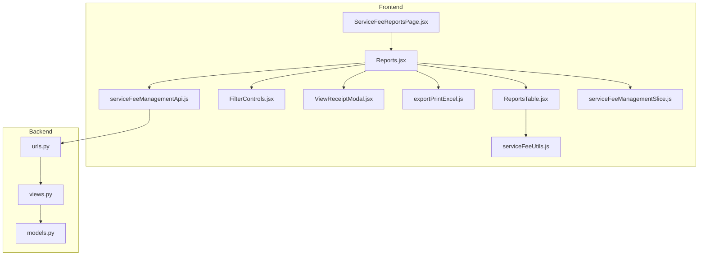
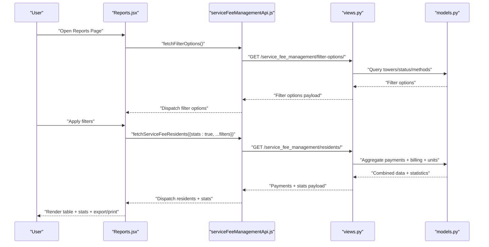
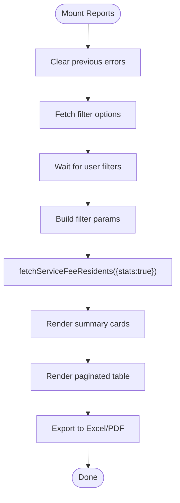
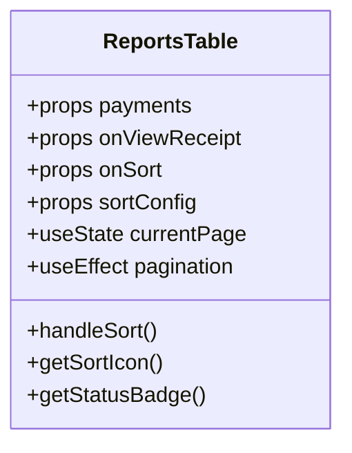
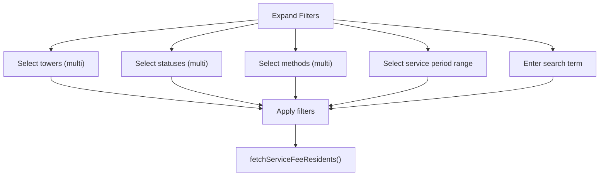
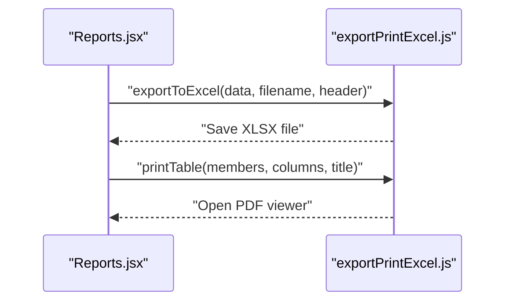
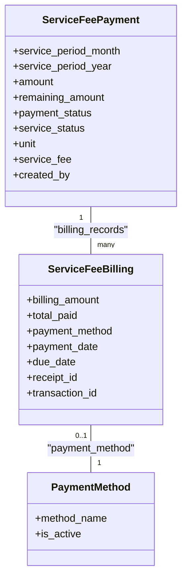
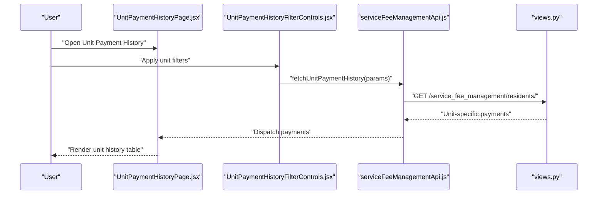
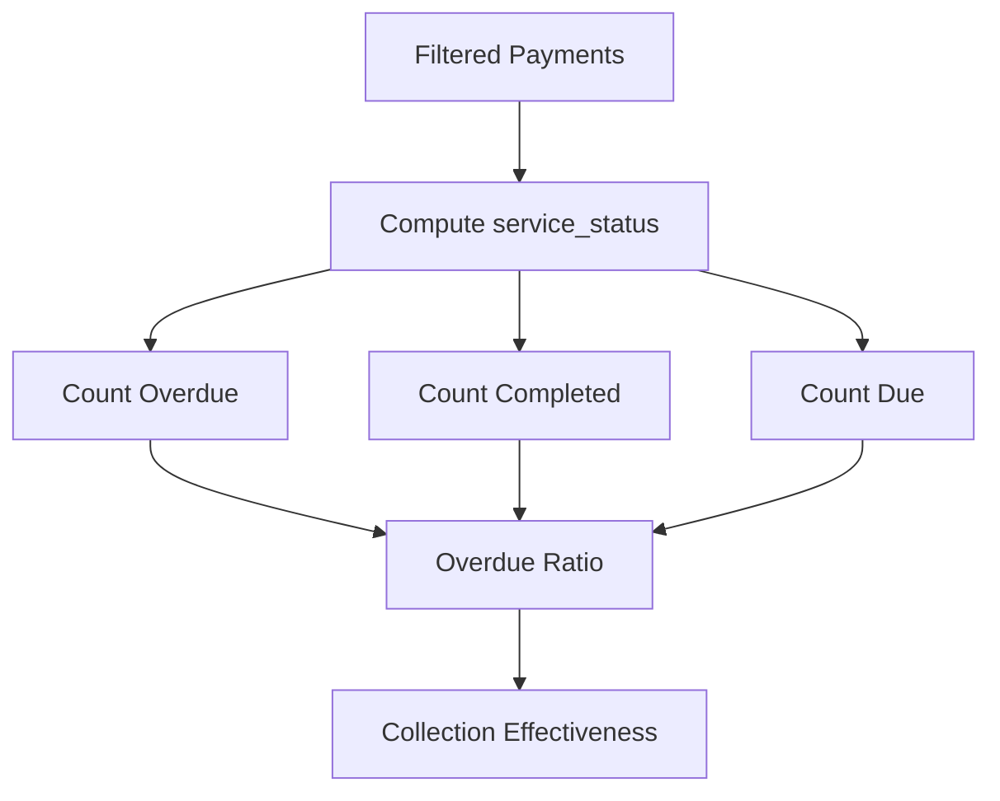
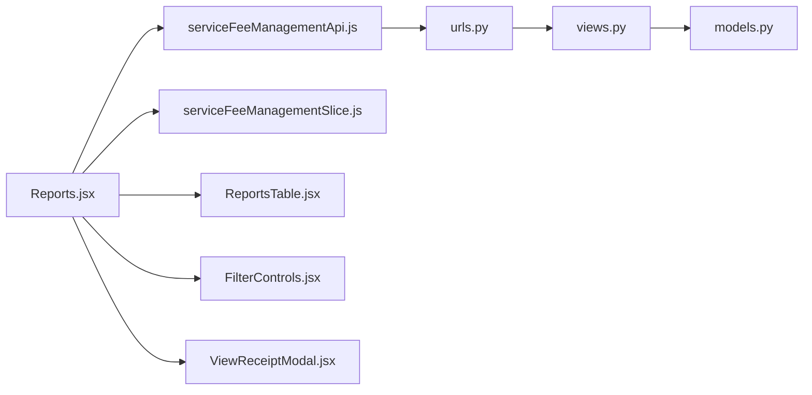

# Financial Reporting & Analytics

<cite>
**Referenced Files in This Document**
- [ServiceFeeReportsPage.jsx](file://frontend/src/pages/ServiceFeeReportsPage.jsx)
- [Reports.jsx](file://frontend/src/Features/ServiceFeeManagement/Reports/components/Reports.jsx)
- [ReportsTable.jsx](file://frontend/src/Features/ServiceFeeManagement/Reports/components/ReportsTable.jsx)
- [FilterControls.jsx](file://frontend/src/Features/ServiceFeeManagement/Reports/components/FilterControls.jsx)
- [ViewReceiptModal.jsx](file://frontend/src/Features/ServiceFeeManagement/components/ViewReceiptModal.jsx)
- [exportPrintExcel.js](file://frontend/src/utils/exportPrintExcel.js)
- [serviceFeeUtils.js](file://frontend/src/utils/serviceFeeUtils.js)
- [serviceFeeManagementApi.js](file://frontend/src/redux/slices/api/serviceFeeManagement/serviceFeeManagementApi.js)
- [serviceFeeManagementSlice.js](file://frontend/src/redux/slices/serviceFeeManagement/serviceFeeManagementSlice.js)
- [UnitPaymentHistoryPage.jsx](file://frontend/src/pages/UnitPaymentHistoryPage.jsx)
- [UnitPaymentHistoryFilterControls.jsx](file://frontend/src/Features/ServiceFeeManagement/pages/UnitPaymentHistory/components/UnitPaymentHistoryFilterControls.jsx)
- [UnitPaymentHistoryPage.jsx](file://backend/service_fee_management/views.py)
- [urls.py](file://backend/service_fee_management/urls.py)
- [models.py](file://backend/service_fee_management/models.py)
</cite>

## Table of Contents
1. [Introduction](#introduction)
2. [Project Structure](#project-structure)
3. [Core Components](#core-components)
4. [Architecture Overview](#architecture-overview)
5. [Detailed Component Analysis](#detailed-component-analysis)
6. [Dependency Analysis](#dependency-analysis)
7. [Performance Considerations](#performance-considerations)
8. [Troubleshooting Guide](#troubleshooting-guide)
9. [Conclusion](#conclusion)

## Introduction
This document explains the financial reporting and analytics capabilities for service fee collections, payment trends, and revenue analytics. It covers the reporting interfaces, data visualization components, filter controls, export capabilities, unit payment history reports, overdue analysis, and collection effectiveness metrics. It also documents the integration between reporting and the underlying billing and payment systems, including how reports aggregate and present financial data.

## Project Structure
The reporting system spans the frontend React application and the backend Django REST API:
- Frontend pages and components render reports, apply filters, and export data.
- Backend APIs provide residents’ payment data, filter options, and statistics.
- Utilities support Excel/PDF exports and currency/date formatting.
- Redux slices orchestrate API calls and state for the reports page.

**Diagram sources**
- [ServiceFeeReportsPage.jsx](file://frontend/src/pages/ServiceFeeReportsPage.jsx#L1-L8)
- [Reports.jsx](file://frontend/src/Features/ServiceFeeManagement/Reports/components/Reports.jsx#L1-L528)
- [ReportsTable.jsx](file://frontend/src/Features/ServiceFeeManagement/Reports/components/ReportsTable.jsx#L1-L351)
- [FilterControls.jsx](file://frontend/src/Features/ServiceFeeManagement/Reports/components/FilterControls.jsx)
- [ViewReceiptModal.jsx](file://frontend/src/Features/ServiceFeeManagement/components/ViewReceiptModal.jsx)
- [exportPrintExcel.js](file://frontend/src/utils/exportPrintExcel.js#L1-L545)
- [serviceFeeUtils.js](file://frontend/src/utils/serviceFeeUtils.js)
- [serviceFeeManagementApi.js](file://frontend/src/redux/slices/api/serviceFeeManagement/serviceFeeManagementApi.js)
- [serviceFeeManagementSlice.js](file://frontend/src/redux/slices/serviceFeeManagement/serviceFeeManagementSlice.js)
- [urls.py](file://backend/service_fee_management/urls.py#L67-L152)
- [views.py](file://backend/service_fee_management/views.py#L577-L663)
- [models.py](file://backend/service_fee_management/models.py#L11-L340)

**Section sources**
- [ServiceFeeReportsPage.jsx](file://frontend/src/pages/ServiceFeeReportsPage.jsx#L1-L8)
- [Reports.jsx](file://frontend/src/Features/ServiceFeeManagement/Reports/components/Reports.jsx#L1-L528)
- [urls.py](file://backend/service_fee_management/urls.py#L67-L152)

## Core Components
- Reports page container orchestrates state, filters, statistics, and export/print actions.
- Reports table renders paginated, sortable rows with status badges and action buttons.
- Filter controls enable multi-select and date-range filtering across towers, statuses, and payment methods.
- Export utilities support Excel and PDF generation with localized currency formatting.
- Backend endpoints supply filter options, combined payment data, and statistics.

Key capabilities:
- Service fee collections overview with totals, completed, due, and overdue counts.
- Payment trends by month/year and tower.
- Revenue analytics including fee amounts, penalties, waivers, and paid/due balances.
- Unit payment history and overdue analysis.
- Collection effectiveness metrics derived from status distributions and payment results.

**Section sources**
- [Reports.jsx](file://frontend/src/Features/ServiceFeeManagement/Reports/components/Reports.jsx#L19-L528)
- [ReportsTable.jsx](file://frontend/src/Features/ServiceFeeManagement/Reports/components/ReportsTable.jsx#L10-L351)
- [exportPrintExcel.js](file://frontend/src/utils/exportPrintExcel.js#L7-L40)

## Architecture Overview
The reporting pipeline integrates frontend and backend:
- Frontend dispatches filter and statistics requests to Redux slices.
- Redux slices call API endpoints to fetch combined payment data and filter options.
- Backend aggregates payment records with related billing and unit data, computes statistics, and returns structured results.
- Frontend renders statistics cards, filters, and paginated tables, and supports export/print.

**Diagram sources**
- [Reports.jsx](file://frontend/src/Features/ServiceFeeManagement/Reports/components/Reports.jsx#L76-L113)
- [serviceFeeManagementApi.js](file://frontend/src/redux/slices/api/serviceFeeManagement/serviceFeeManagementApi.js)
- [views.py](file://backend/service_fee_management/views.py#L577-L663)
- [models.py](file://backend/service_fee_management/models.py#L190-L340)

## Detailed Component Analysis

### Reports Page and Statistics
- Initializes with current month/year as default service period.
- Loads filter options on mount and fetches combined payment data with statistics.
- Displays four summary cards: total records, completed, due, and overdue counts.
- Provides export (Excel) and print actions with localized formatting.

**Diagram sources**
- [Reports.jsx](file://frontend/src/Features/ServiceFeeManagement/Reports/components/Reports.jsx#L76-L113)
- [Reports.jsx](file://frontend/src/Features/ServiceFeeManagement/Reports/components/Reports.jsx#L464-L493)
- [exportPrintExcel.js](file://frontend/src/utils/exportPrintExcel.js#L121-L217)

**Section sources**
- [Reports.jsx](file://frontend/src/Features/ServiceFeeManagement/Reports/components/Reports.jsx#L19-L528)

### Reports Table and Sorting
- Paginates results and supports column sorting with visual indicators.
- Renders status badges and action buttons (view receipt).
- Uses skeleton loaders for improved perceived performance.

**Diagram sources**
- [ReportsTable.jsx](file://frontend/src/Features/ServiceFeeManagement/Reports/components/ReportsTable.jsx#L10-L351)

**Section sources**
- [ReportsTable.jsx](file://frontend/src/Features/ServiceFeeManagement/Reports/components/ReportsTable.jsx#L10-L351)

### Filter Controls and Multi-Select
- Supports multi-select for towers, statuses, and payment methods.
- Allows date-range selection for service periods.
- Provides “Clear All” to reset filters and service period to current month/year.

**Diagram sources**
- [Reports.jsx](file://frontend/src/Features/ServiceFeeManagement/Reports/components/Reports.jsx#L122-L171)

**Section sources**
- [Reports.jsx](file://frontend/src/Features/ServiceFeeManagement/Reports/components/Reports.jsx#L122-L171)

### Export and Print Capabilities
- Excel export: transforms filtered payments into a structured sheet with currency formatting and column widths.
- Print: generates a printer-friendly HTML table with status-specific styling and localized date formatting.
- PDF export utilities support multi-page tables and Bengali/English fonts.

**Diagram sources**
- [Reports.jsx](file://frontend/src/Features/ServiceFeeManagement/Reports/components/Reports.jsx#L212-L270)
- [Reports.jsx](file://frontend/src/Features/ServiceFeeManagement/Reports/components/Reports.jsx#L272-L359)
- [exportPrintExcel.js](file://frontend/src/utils/exportPrintExcel.js#L7-L40)
- [exportPrintExcel.js](file://frontend/src/utils/exportPrintExcel.js#L121-L217)

**Section sources**
- [Reports.jsx](file://frontend/src/Features/ServiceFeeManagement/Reports/components/Reports.jsx#L212-L359)
- [exportPrintExcel.js](file://frontend/src/utils/exportPrintExcel.js#L7-L40)
- [exportPrintExcel.js](file://frontend/src/utils/exportPrintExcel.js#L121-L217)

### Backend Integration and Data Aggregation
- Filter options endpoint returns towers, status choices, and payment methods.
- Residents endpoint returns combined payment records with statistics when requested.
- Models define normalized billing and payment relationships for accurate aggregation.

**Diagram sources**
- [models.py](file://backend/service_fee_management/models.py#L190-L340)
- [models.py](file://backend/service_fee_management/models.py#L11-L83)
- [models.py](file://backend/service_fee_management/models.py#L168-L188)

**Section sources**
- [views.py](file://backend/service_fee_management/views.py#L577-L663)
- [urls.py](file://backend/service_fee_management/urls.py#L74-L106)
- [models.py](file://backend/service_fee_management/models.py#L11-L340)

### Unit Payment History Reports
- Dedicated page and filter controls for unit-centric payment history.
- Enables drill-down from reports to unit-level details for targeted analysis.

**Diagram sources**
- [UnitPaymentHistoryPage.jsx](file://frontend/src/pages/UnitPaymentHistoryPage.jsx)
- [UnitPaymentHistoryFilterControls.jsx](file://frontend/src/Features/ServiceFeeManagement/pages/UnitPaymentHistory/components/UnitPaymentHistoryFilterControls.jsx)
- [views.py](file://backend/service_fee_management/views.py#L769-L800)

**Section sources**
- [UnitPaymentHistoryPage.jsx](file://frontend/src/pages/UnitPaymentHistoryPage.jsx)
- [UnitPaymentHistoryFilterControls.jsx](file://frontend/src/Features/ServiceFeeManagement/pages/UnitPaymentHistory/components/UnitPaymentHistoryFilterControls.jsx)
- [views.py](file://backend/service_fee_management/views.py#L769-L800)

### Overdue Analysis and Collection Effectiveness Metrics
- Overdue status is represented in summary cards and table rows.
- Collection effectiveness can be inferred from:
  - Completed vs. due/overdue ratios.
  - Payment result displays (partial/full/overpayment) for historical context.
  - Penalty and waiver amounts to assess policy impact.

**Diagram sources**
- [Reports.jsx](file://frontend/src/Features/ServiceFeeManagement/Reports/components/Reports.jsx#L464-L493)
- [ReportsTable.jsx](file://frontend/src/Features/ServiceFeeManagement/Reports/components/ReportsTable.jsx#L70-L78)
- [models.py](file://backend/service_fee_management/models.py#L190-L340)

**Section sources**
- [Reports.jsx](file://frontend/src/Features/ServiceFeeManagement/Reports/components/Reports.jsx#L464-L493)
- [ReportsTable.jsx](file://frontend/src/Features/ServiceFeeManagement/Reports/components/ReportsTable.jsx#L70-L78)
- [models.py](file://backend/service_fee_management/models.py#L190-L340)

## Dependency Analysis
- Frontend depends on Redux slices for state and API utilities for HTTP calls.
- Reports.jsx coordinates with FilterControls.jsx, ReportsTable.jsx, and ViewReceiptModal.jsx.
- Backend endpoints are defined in urls.py and implemented in views.py, backed by models.py.

**Diagram sources**
- [Reports.jsx](file://frontend/src/Features/ServiceFeeManagement/Reports/components/Reports.jsx#L1-L18)
- [serviceFeeManagementApi.js](file://frontend/src/redux/slices/api/serviceFeeManagement/serviceFeeManagementApi.js)
- [serviceFeeManagementSlice.js](file://frontend/src/redux/slices/serviceFeeManagement/serviceFeeManagementSlice.js)
- [ReportsTable.jsx](file://frontend/src/Features/ServiceFeeManagement/Reports/components/ReportsTable.jsx#L1-L10)
- [FilterControls.jsx](file://frontend/src/Features/ServiceFeeManagement/Reports/components/FilterControls.jsx)
- [ViewReceiptModal.jsx](file://frontend/src/Features/ServiceFeeManagement/components/ViewReceiptModal.jsx)
- [urls.py](file://backend/service_fee_management/urls.py#L67-L152)
- [views.py](file://backend/service_fee_management/views.py#L577-L663)
- [models.py](file://backend/service_fee_management/models.py#L11-L340)

**Section sources**
- [Reports.jsx](file://frontend/src/Features/ServiceFeeManagement/Reports/components/Reports.jsx#L1-L18)
- [urls.py](file://backend/service_fee_management/urls.py#L67-L152)
- [views.py](file://backend/service_fee_management/views.py#L577-L663)
- [models.py](file://backend/service_fee_management/models.py#L11-L340)

## Performance Considerations
- Backend aggregation uses optimized SQL queries to minimize Python-side loops and reduce latency.
- Frontend employs skeleton loaders and pagination to maintain responsiveness during large datasets.
- Export operations transform client-side data; consider server-side export for very large datasets to offload processing.

## Troubleshooting Guide
Common issues and resolutions:
- Empty export: Ensure filteredPayments exists and is non-empty before exporting.
- Incorrect currency formatting: Verify localized currency formatting in export utilities.
- Missing filter options: Confirm filter options endpoint returns expected data.
- Overdue counts discrepancy: Validate service_status computation and backend statistics.

**Section sources**
- [Reports.jsx](file://frontend/src/Features/ServiceFeeManagement/Reports/components/Reports.jsx#L212-L270)
- [exportPrintExcel.js](file://frontend/src/utils/exportPrintExcel.js#L7-L40)
- [views.py](file://backend/service_fee_management/views.py#L577-L663)

## Conclusion
The financial reporting and analytics system provides a comprehensive view of service fee collections, payment trends, and revenue analytics. It combines robust frontend filtering and visualization with backend aggregation and normalization, enabling actionable insights, efficient exports, and scalable performance.