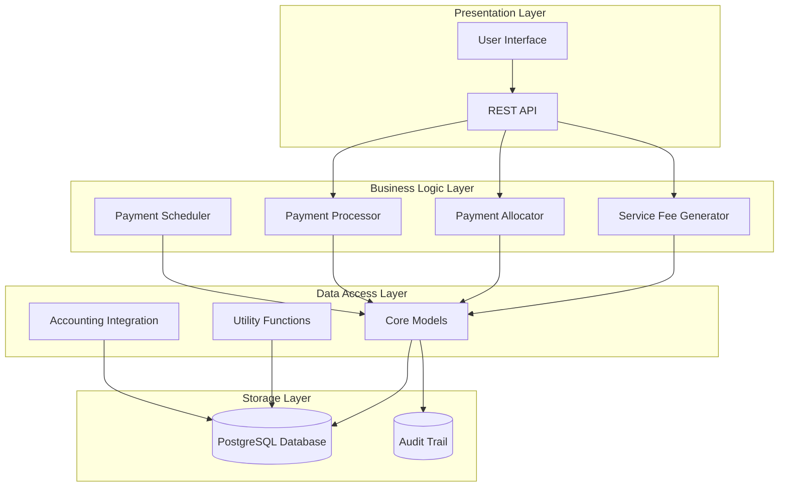
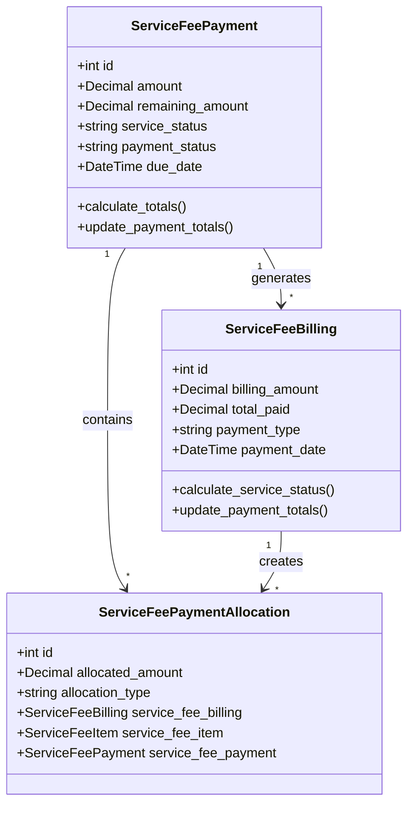
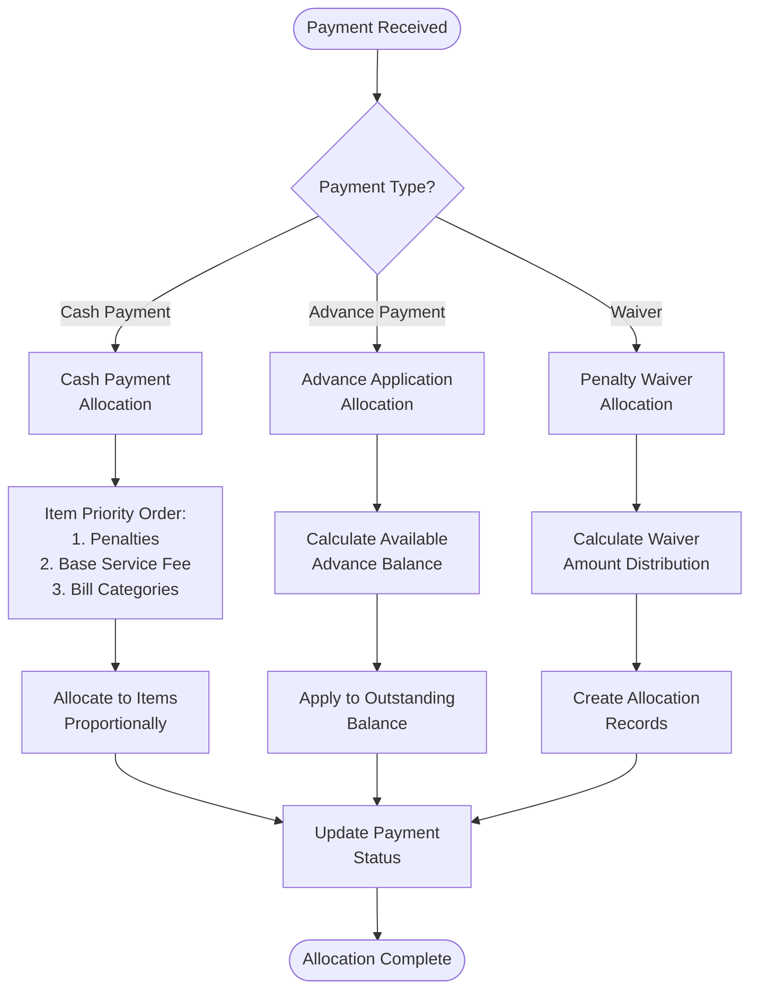
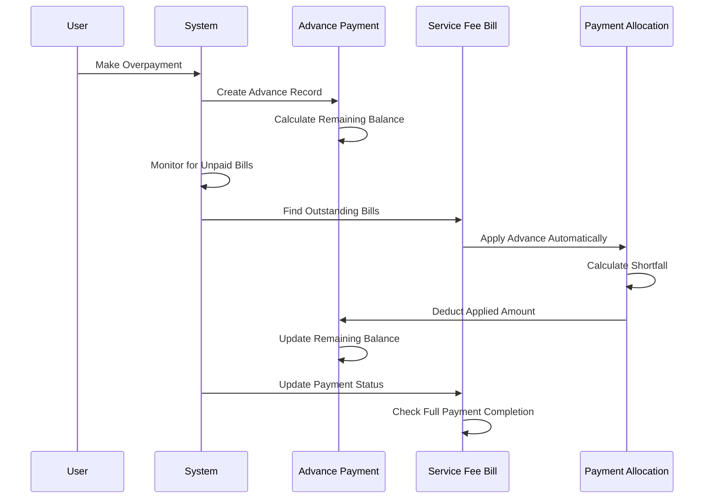
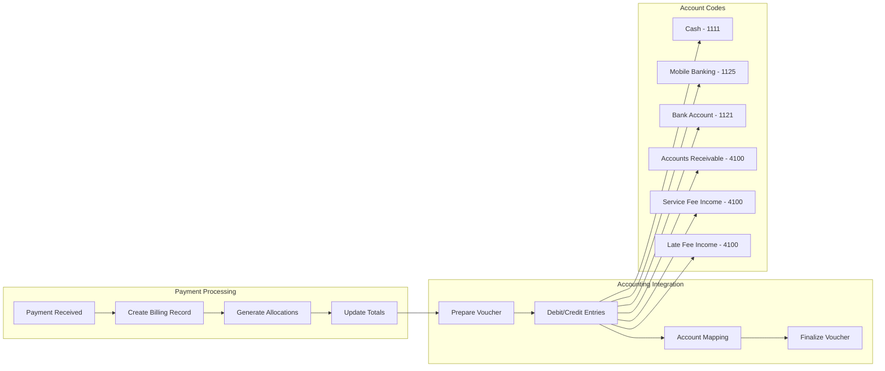
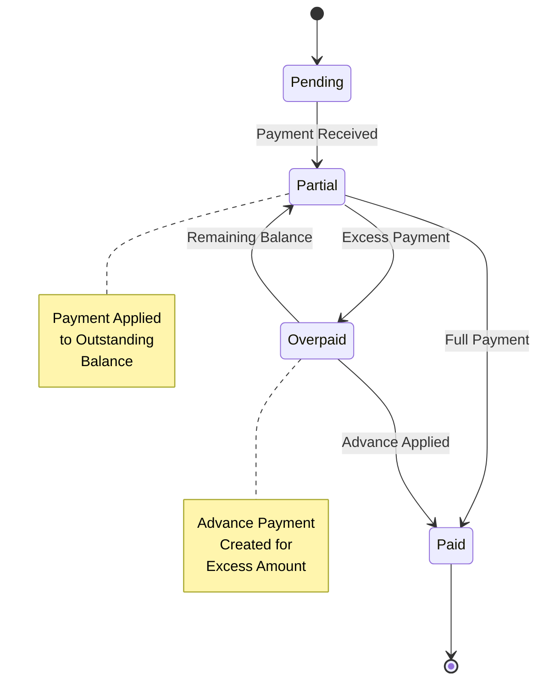
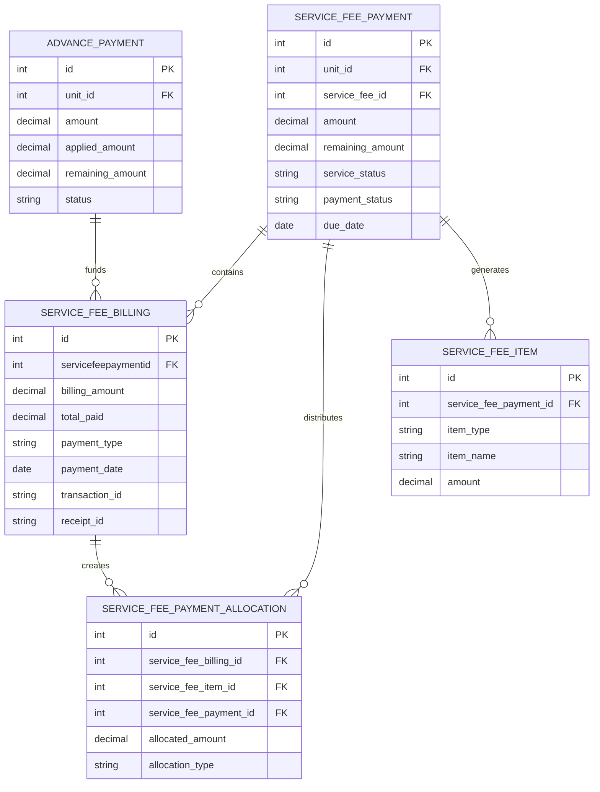

# Payment Allocation System

<cite>
**Referenced Files in This Document**
- [models.py](file://backend/service_fee_management/models.py)
- [payment_processor.py](file://backend/service_fee_management/utils/payment_processor.py)
- [advance_payment_applicator.py](file://backend/service_fee_management/utils/advance_payment_applicator.py)
- [item_helper.py](file://backend/service_fee_management/utils/item_helper.py)
- [voucher_generator.py](file://backend/service_fee_management/utils/voucher_generator.py)
- [views.py](file://backend/service_fee_management/views.py)
- [service_fee_generator.py](file://backend/service_fee_management/utils/service_fee_generator.py)
</cite>

## Table of Contents
1. [Introduction](#introduction)
2. [System Architecture](#system-architecture)
3. [Core Components](#core-components)
4. [Payment Allocation Engine](#payment-allocation-engine)
5. [Advance Payment System](#advance-payment-system)
6. [Accounting Integration](#accounting-integration)
7. [Hierarchical Payment Structure](#hierarchical-payment-structure)
8. [Payment Processing Workflows](#payment-processing-workflows)
9. [Data Models and Relationships](#data-models-and-relationships)
10. [Performance Considerations](#performance-considerations)
11. [Troubleshooting Guide](#troubleshooting-guide)
12. [Conclusion](#conclusion)

## Introduction

The Payment Allocation System is a sophisticated financial management framework designed for multi-unit residential complexes. This system manages service fee collections, penalty calculations, advance payments, and detailed payment allocations across multiple billing periods and units. The system provides hierarchical payment tracking, automatic penalty application, and comprehensive accounting integration.

The system operates on a three-tier architecture: generation layer (bill creation), allocation layer (payment distribution), and accounting layer (financial recording). It supports both manual and automated payment processing with real-time status tracking and audit capabilities.

## System Architecture

The Payment Allocation System follows a modular architecture with clear separation of concerns:

**Diagram sources**
- [models.py](file://backend/service_fee_management/models.py#L12-L1636)
- [views.py](file://backend/service_fee_management/views.py#L1-L10731)

The architecture ensures scalability through:
- **Modular Design**: Separate concerns for generation, allocation, and processing
- **Transaction Management**: Atomic operations for payment updates
- **Caching Strategies**: Efficient query optimization for large datasets
- **Audit Trail Integration**: Complete transaction history tracking

## Core Components

### ServiceFeePayment (Generated Bill)

The ServiceFeePayment model represents generated service fee bills rather than actual payments. This semantic distinction is crucial for understanding the system's architecture.

Key characteristics:
- **Semantic Alias**: ServiceFeeGenerate serves as an alias for ServiceFeePayment
- **Hierarchical Structure**: Links to multiple ServiceFeeBilling records
- **Status Tracking**: Comprehensive payment and service status monitoring
- **Owner Integration**: Direct association with property owners

### ServiceFeeBilling (Payment Transaction)

ServiceFeeBilling captures individual payment transactions with detailed allocation tracking:

**Diagram sources**
- [models.py](file://backend/service_fee_management/models.py#L12-L1636)

**Section sources**
- [models.py](file://backend/service_fee_management/models.py#L228-L480)

### Payment Method Management

The system supports multiple payment methods with configurable accounting integration:

| Payment Method | Account Code | Default Account |
|---|---|---|
| Cash | 1111 | Cash Account |
| bKash | 1125 | Mobile Banking Services |
| Nagad | 1125 | Mobile Banking Services |
| Rocket | 1125 | Mobile Banking Services |
| Bank Transfer | 1121 | Bank Account |
| SSLCommerz | 1122 | Online Payment Account |

**Section sources**
- [models.py](file://backend/service_fee_management/models.py#L205-L226)
- [voucher_generator.py](file://backend/service_fee_management/utils/voucher_generator.py#L18-L26)

## Payment Allocation Engine

The payment allocation engine provides sophisticated hierarchical payment distribution mechanisms:

### Allocation Types

**Diagram sources**
- [payment_processor.py](file://backend/service_fee_management/utils/payment_processor.py#L16-L268)

### Hierarchical Allocation Logic

The system implements a priority-based allocation mechanism:

1. **Penalty Items**: Highest priority for late payment fees
2. **Base Service Fee**: Standard monthly service charge
3. **Bill Categories**: Utility and additional charges
4. **Remaining Amount**: Distributed proportionally across items

**Section sources**
- [payment_processor.py](file://backend/service_fee_management/utils/payment_processor.py#L172-L211)

## Advance Payment System

The advance payment system manages overpayments and credit applications:

### Advance Payment Lifecycle

**Diagram sources**
- [advance_payment_applicator.py](file://backend/service_fee_management/utils/advance_payment_applicator.py#L15-L211)
- [models.py](file://backend/service_fee_management/models.py#L1231-L1341)

### Automatic Advance Application

The system automatically applies advances to outstanding bills using FIFO (First-In-First-Out) methodology:

**Section sources**
- [advance_payment_applicator.py](file://backend/service_fee_management/utils/advance_payment_applicator.py#L86-L183)

## Accounting Integration

The system provides comprehensive accounting integration with double-entry bookkeeping:

### Voucher Generation Workflow

**Diagram sources**
- [voucher_generator.py](file://backend/service_fee_management/utils/voucher_generator.py#L429-L643)

### Account Mapping Strategy

The system uses intelligent account mapping for different payment methods:

| Payment Method | Account Code | Account Type | Purpose |
|---|---|---|---|
| Cash | 1111 | Asset | Physical cash receipts |
| bKash/Nagad/Rocket | 1125 | Asset | Mobile banking transfers |
| Bank Transfer | 1121 | Asset | Bank account deposits |
| Accounts Receivable | 4100 | Asset | Service fee receivables |
| Service Fee Income | 4100 | Revenue | Standard service fees |
| Late Fee Income | 4100 | Revenue | Penalty revenues |

**Section sources**
- [voucher_generator.py](file://backend/service_fee_management/utils/voucher_generator.py#L18-L26)

## Hierarchical Payment Structure

The system implements a three-level hierarchy for payment tracking:

### Level 1: ServiceFeePayment (Generated Bill)
- Represents the monthly service fee liability
- Contains overall payment status and totals
- Links to multiple billing records

### Level 2: ServiceFeeBilling (Individual Transactions)
- Records specific payment transactions
- Tracks payment method and reference numbers
- Maintains detailed payment history

### Level 3: ServiceFeePaymentAllocation (Item-Level Allocation)
- Allocates payments to specific service items
- Provides granular payment distribution tracking
- Supports hierarchical payment scenarios

**Section sources**
- [models.py](file://backend/service_fee_management/models.py#L1343-L1427)

## Payment Processing Workflows

### Multi-Month Payment Processing

The system handles complex multi-month payment scenarios:

### Payment Eligibility Validation

The system validates payment eligibility before processing:

**Section sources**
- [views.py](file://backend/service_fee_management/views.py#L160-L248)

## Data Models and Relationships

### Core Entity Relationships

**Diagram sources**
- [models.py](file://backend/service_fee_management/models.py#L12-L1636)

### Index Strategy

The system employs strategic indexing for optimal query performance:

| Index | Purpose | Columns |
|---|---|---|
| idx_payment_owner_period | Payment lookup by owner | owner_id, service_period_year, service_period_month |
| idx_payment_unit_period | Payment lookup by unit | unit_id, service_period_year, service_period_month |
| idx_payment_status_combo | Status filtering | service_status, payment_status |
| idx_billing_payment_date | Transaction history | servicefeepaymentid, payment_date |
| idx_allocation_type | Allocation type filtering | allocation_type |

**Section sources**
- [models.py](file://backend/service_fee_management/models.py#L385-L391)

## Performance Considerations

### Query Optimization

The system implements several performance optimization strategies:

1. **Bulk Operations**: Utilizes bulk_create and bulk_update for large-scale operations
2. **Prefetch Related**: Minimizes N+1 query problems through strategic prefetching
3. **Database Indexes**: Strategic indexing for frequently queried fields
4. **Raw SQL**: Uses optimized raw SQL for complex aggregations

### Memory Management

- **Streaming Results**: Processes large result sets in chunks
- **Lazy Loading**: Defers expensive operations until necessary
- **Connection Pooling**: Efficient database connection management

### Scalability Features

- **Asynchronous Processing**: Background tasks for heavy computations
- **Caching Strategy**: Redis caching for frequently accessed data
- **Partitioning**: Database partitioning for historical data

## Troubleshooting Guide

### Common Issues and Solutions

#### Payment Status Inconsistencies

**Symptoms**: Payment status shows inconsistent values across different views
**Causes**: 
- Race conditions in concurrent payment processing
- Incomplete allocation updates
- Database transaction isolation issues

**Solutions**:
- Implement proper locking mechanisms
- Use atomic transactions for payment updates
- Add validation checks for payment status consistency

#### Advance Payment Application Failures

**Symptoms**: Advance payments not applying to bills
**Causes**:
- Incorrect account holder type matching
- Insufficient advance balance
- Billing record creation failures

**Solutions**:
- Verify account holder type and ID matching
- Check advance payment status (available/partial)
- Review billing record creation logs

#### Accounting Integration Errors

**Symptoms**: Voucher creation failures or balance mismatches
**Causes**:
- Missing account mappings
- Invalid account codes
- Double-entry validation failures

**Solutions**:
- Verify account code existence in chart of accounts
- Check payment method account mappings
- Validate debit/credit balance equality

### Debugging Tools

The system provides comprehensive debugging capabilities:

- **Audit Trail**: Complete transaction history tracking
- **Logging Framework**: Structured logging for all operations
- **Performance Metrics**: Real-time monitoring of system performance
- **Error Reporting**: Automated error reporting and notification

**Section sources**
- [models.py](file://backend/service_fee_management/models.py#L1415-L1423)

## Conclusion

The Payment Allocation System represents a comprehensive solution for managing complex multi-unit payment scenarios. Its hierarchical architecture, sophisticated allocation engine, and robust accounting integration provide the foundation for scalable property management systems.

Key strengths of the system include:

- **Hierarchical Payment Tracking**: Clear separation between generated bills and actual payments
- **Advanced Allocation Logic**: Priority-based payment distribution with penalty consideration
- **Automatic Advance Management**: Seamless handling of overpayments and credit applications
- **Comprehensive Accounting Integration**: Full double-entry bookkeeping with audit trails
- **Scalable Architecture**: Designed for high-volume transaction processing

The system's modular design and extensive documentation make it suitable for adaptation to various property management scenarios while maintaining financial accuracy and operational efficiency.

Future enhancements could include:
- Enhanced mobile payment integration
- Real-time payment notification systems
- Advanced reporting and analytics capabilities
- Integration with external payment gateways
- Enhanced multi-currency support