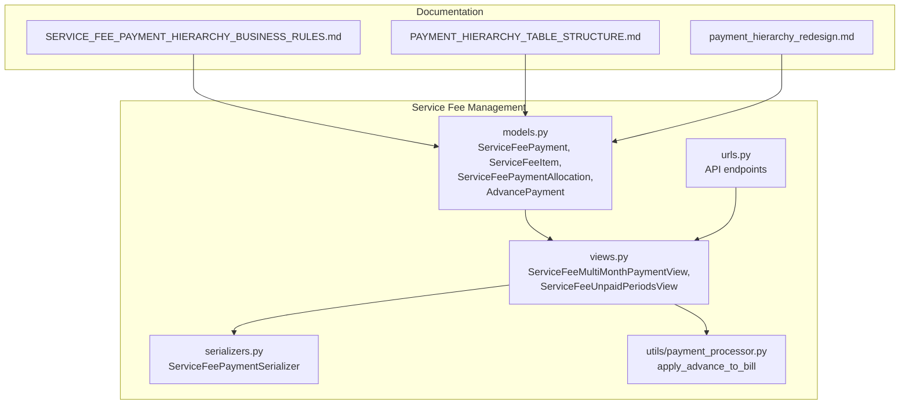
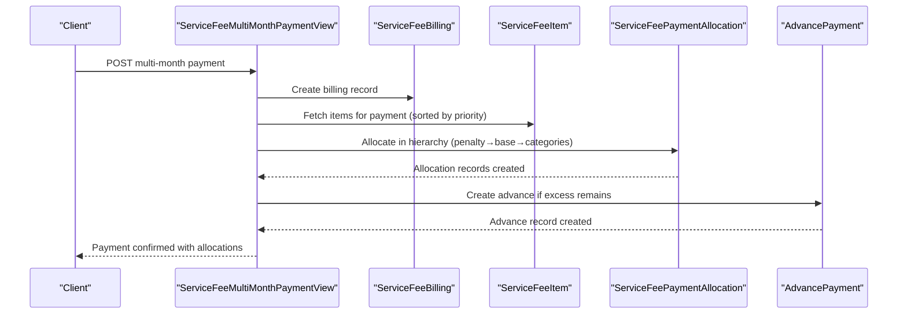
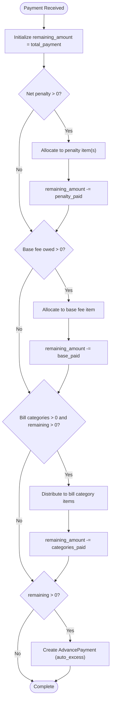
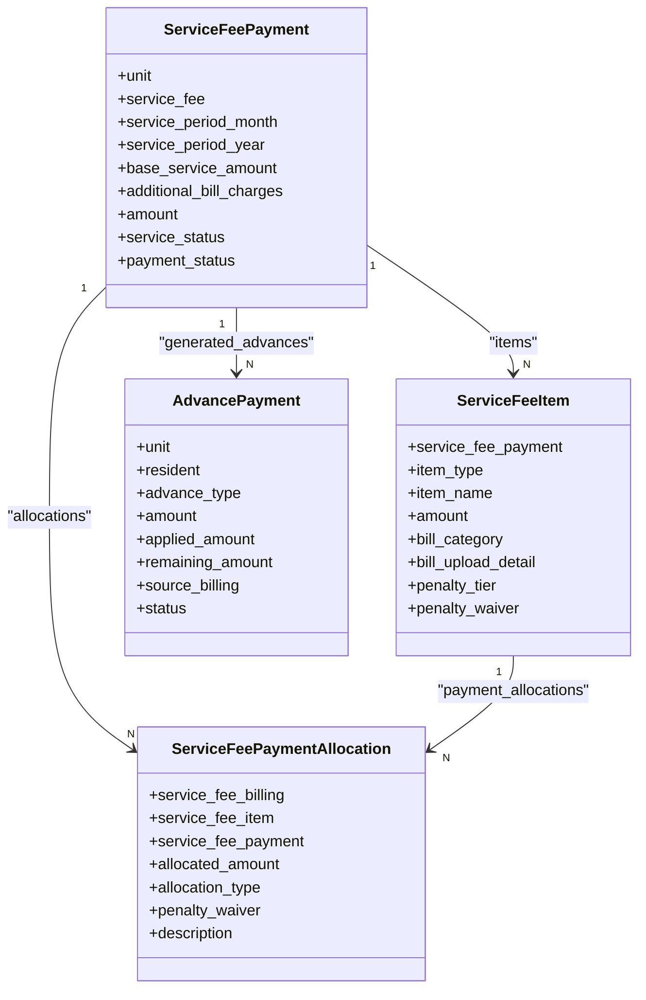
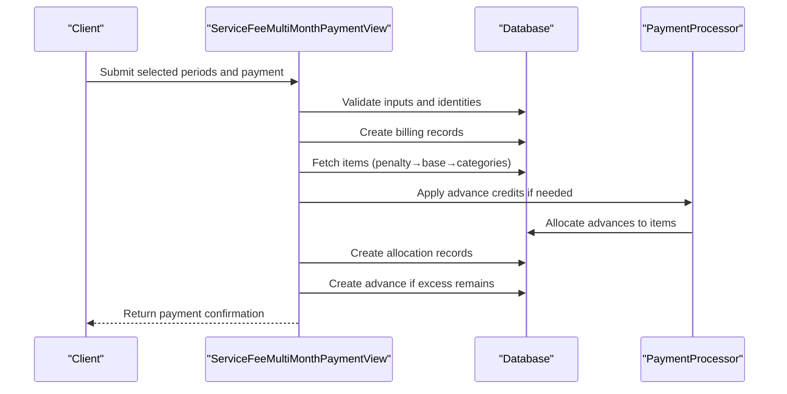
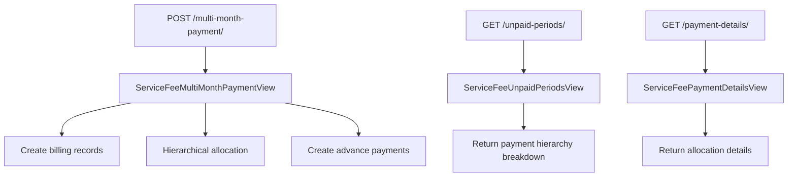
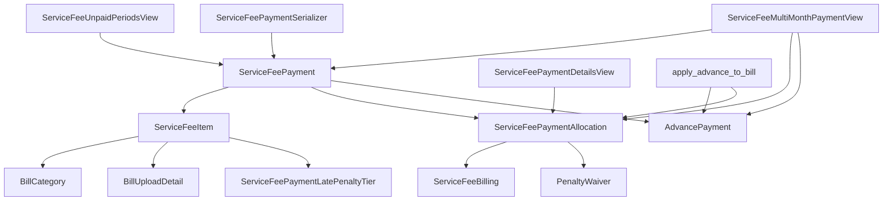

# Payment Hierarchy Business Rules

<cite>
**Referenced Files in This Document**
- [SERVICE_FEE_PAYMENT_HIERARCHY_BUSINESS_RULES.md](file://backend/SERVICE_FEE_PAYMENT_HIERARCHY_BUSINESS_RULES.md)
- [PAYMENT_HIERARCHY_TABLE_STRUCTURE.md](file://backend/PAYMENT_HIERARCHY_TABLE_STRUCTURE.md)
- [payment_hierarchy_redesign.md](file://backend/docs/payment_hierarchy_redesign.md)
- [models.py](file://backend/service_fee_management/models.py)
- [views.py](file://backend/service_fee_management/views.py)
- [urls.py](file://backend/service_fee_management/urls.py)
- [serializers.py](file://backend/service_fee_management/serializers.py)
- [payment_processor.py](file://backend/service_fee_management/utils/payment_processor.py)
</cite>

## Table of Contents
1. [Introduction](#introduction)
2. [Project Structure](#project-structure)
3. [Core Components](#core-components)
4. [Architecture Overview](#architecture-overview)
5. [Detailed Component Analysis](#detailed-component-analysis)
6. [Dependency Analysis](#dependency-analysis)
7. [Performance Considerations](#performance-considerations)
8. [Troubleshooting Guide](#troubleshooting-guide)
9. [Conclusion](#conclusion)

## Introduction
This document defines the Payment Hierarchy Business Rules that govern how service fee payments are allocated across multiple charge components. The system enforces a strict priority order: penalty (late fee) is paid first, followed by the base service fee, then bill categories (utilities), with any remaining amount becoming an advance payment for future use. These rules ensure accurate financial tracking, compliance with billing obligations, and transparent audit trails.

## Project Structure
The payment hierarchy implementation spans backend Django models, views, serializers, and utility modules within the service fee management application. Supporting documentation provides business rule definitions and table structures.

**Diagram sources**
- [models.py](file://backend/service_fee_management/models.py#L1180-L1578)
- [views.py](file://backend/service_fee_management/views.py#L1582-L2077)
- [serializers.py](file://backend/service_fee_management/serializers.py#L132-L773)
- [urls.py](file://backend/service_fee_management/urls.py#L68-L155)
- [payment_processor.py](file://backend/service_fee_management/utils/payment_processor.py#L16-L268)
- [SERVICE_FEE_PAYMENT_HIERARCHY_BUSINESS_RULES.md](file://backend/SERVICE_FEE_PAYMENT_HIERARCHY_BUSINESS_RULES.md#L1-L586)
- [PAYMENT_HIERARCHY_TABLE_STRUCTURE.md](file://backend/PAYMENT_HIERARCHY_TABLE_STRUCTURE.md#L1-L222)
- [payment_hierarchy_redesign.md](file://backend/docs/payment_hierarchy_redesign.md#L1-L100)

**Section sources**
- [models.py](file://backend/service_fee_management/models.py#L1180-L1578)
- [views.py](file://backend/service_fee_management/views.py#L1582-L2077)
- [serializers.py](file://backend/service_fee_management/serializers.py#L132-L773)
- [urls.py](file://backend/service_fee_management/urls.py#L68-L155)
- [payment_processor.py](file://backend/service_fee_management/utils/payment_processor.py#L16-L268)
- [SERVICE_FEE_PAYMENT_HIERARCHY_BUSINESS_RULES.md](file://backend/SERVICE_FEE_PAYMENT_HIERARCHY_BUSINESS_RULES.md#L1-L586)
- [PAYMENT_HIERARCHY_TABLE_STRUCTURE.md](file://backend/PAYMENT_HIERARCHY_TABLE_STRUCTURE.md#L1-L222)
- [payment_hierarchy_redesign.md](file://backend/docs/payment_hierarchy_redesign.md#L1-L100)

## Core Components
This section outlines the key components that implement the payment hierarchy business rules.

- ServiceFeePayment: Main payment transaction record containing unit, service fee, period, base amount, additional charges, total amount, and status fields.
- ServiceFeeItem: Represents individual line items (penalty, base fee, bill categories) generated for a unit and period, carrying item type, name, amount, and related foreign keys.
- ServiceFeePaymentAllocation: New allocation model replacing legacy payment details, linking a specific billing record to a specific item with allocated amount and allocation type (debit, credit, advance).
- AdvancePayment: Tracks overpayments as advance credits with type, amount, applied amount, remaining amount, and status.
- PenaltyWaiver: Records penalty waivers applied to items, supporting net penalty calculations.
- ServiceFeeBilling: Transaction record capturing payment method, billing amount, total paid, and payment metadata.

These components collectively enforce the strict payment hierarchy and maintain auditability.

**Section sources**
- [models.py](file://backend/service_fee_management/models.py#L1180-L1578)
- [SERVICE_FEE_PAYMENT_HIERARCHY_BUSINESS_RULES.md](file://backend/SERVICE_FEE_PAYMENT_HIERARCHY_BUSINESS_RULES.md#L222-L265)

## Architecture Overview
The payment hierarchy architecture enforces strict allocation order and maintains detailed allocation records.

**Diagram sources**
- [views.py](file://backend/service_fee_management/views.py#L1582-L2077)
- [models.py](file://backend/service_fee_management/models.py#L1343-L1427)
- [serializers.py](file://backend/service_fee_management/serializers.py#L550-L640)

## Detailed Component Analysis

### Payment Hierarchy Business Rules
The system enforces a strict allocation order:
1. Penalty (Late Fee): Paid first, net penalty equals gross penalty minus waived amount.
2. Base Service Fee: Paid second, amount equals original fixed amount minus already paid.
3. Bill Categories: Paid third, distributed across categories (equal distribution or per-category).
4. Excess Amount: Remaining amount becomes an advance payment (auto_excess type).

**Diagram sources**
- [SERVICE_FEE_PAYMENT_HIERARCHY_BUSINESS_RULES.md](file://backend/SERVICE_FEE_PAYMENT_HIERARCHY_BUSINESS_RULES.md#L5-L72)
- [PAYMENT_HIERARCHY_TABLE_STRUCTURE.md](file://backend/PAYMENT_HIERARCHY_TABLE_STRUCTURE.md#L33-L72)

**Section sources**
- [SERVICE_FEE_PAYMENT_HIERARCHY_BUSINESS_RULES.md](file://backend/SERVICE_FEE_PAYMENT_HIERARCHY_BUSINESS_RULES.md#L5-L72)
- [PAYMENT_HIERARCHY_TABLE_STRUCTURE.md](file://backend/PAYMENT_HIERARCHY_TABLE_STRUCTURE.md#L33-L72)

### Allocation Model and Hierarchy Logic
The allocation model replaces legacy payment details and supports hierarchical payment processing.

**Diagram sources**
- [models.py](file://backend/service_fee_management/models.py#L1180-L1578)

**Section sources**
- [models.py](file://backend/service_fee_management/models.py#L1180-L1578)

### Multi-Month Payment Processing
The multi-month payment view orchestrates payment processing across multiple periods with hierarchical allocation and advance application.

**Diagram sources**
- [views.py](file://backend/service_fee_management/views.py#L1582-L2077)
- [payment_processor.py](file://backend/service_fee_management/utils/payment_processor.py#L16-L268)

**Section sources**
- [views.py](file://backend/service_fee_management/views.py#L1582-L2077)
- [payment_processor.py](file://backend/service_fee_management/utils/payment_processor.py#L16-L268)

### API Endpoints and Data Flow
The service fee management API exposes endpoints for multi-month payments, unpaid periods, and payment details, integrating with the payment hierarchy logic.

**Diagram sources**
- [urls.py](file://backend/service_fee_management/urls.py#L68-L155)
- [views.py](file://backend/service_fee_management/views.py#L1582-L2077)

**Section sources**
- [urls.py](file://backend/service_fee_management/urls.py#L68-L155)
- [views.py](file://backend/service_fee_management/views.py#L1582-L2077)

## Dependency Analysis
The payment hierarchy implementation depends on several models and utilities working together to enforce business rules and maintain data integrity.

**Diagram sources**
- [models.py](file://backend/service_fee_management/models.py#L1180-L1578)
- [views.py](file://backend/service_fee_management/views.py#L1582-L2077)
- [serializers.py](file://backend/service_fee_management/serializers.py#L132-L773)
- [payment_processor.py](file://backend/service_fee_management/utils/payment_processor.py#L16-L268)

**Section sources**
- [models.py](file://backend/service_fee_management/models.py#L1180-L1578)
- [views.py](file://backend/service_fee_management/views.py#L1582-L2077)
- [serializers.py](file://backend/service_fee_management/serializers.py#L132-L773)
- [payment_processor.py](file://backend/service_fee_management/utils/payment_processor.py#L16-L268)

## Performance Considerations
- Efficient querying: Use database indexes on payment type, billing records, and allocation types to optimize hierarchical allocation queries.
- Bulk operations: Leverage bulk create for allocation records to minimize database round trips during payment processing.
- Atomic transactions: Wrap payment processing in atomic blocks to ensure consistency and rollback on errors.
- Advance application: Implement FIFO logic for advance application to maintain predictable credit utilization.

## Troubleshooting Guide
Common issues and resolutions:
- Payment exceeding due amount: Validation prevents overpayments; adjust payment amount or remove excess.
- Duplicate payments: Recent payment detection prevents duplicate entries within a short time window.
- Allocation mismatches: Verify item priorities and balances; ensure penalty items are processed before base fees.
- Advance application failures: Check advance status and remaining amounts; ensure proper filtering by account holder type and ID.

**Section sources**
- [serializers.py](file://backend/service_fee_management/serializers.py#L244-L345)
- [views.py](file://backend/service_fee_management/views.py#L1878-L2077)
- [payment_processor.py](file://backend/service_fee_management/utils/payment_processor.py#L16-L268)

## Conclusion
The Payment Hierarchy Business Rules establish a robust framework for allocating payments across penalty, base fee, and bill categories while maintaining transparency and auditability. The implementation leverages dedicated models, serializers, and views to enforce strict priority ordering and provide comprehensive tracking of payment allocations and advance credits.