# Payment Processing & Collection

<cite>
**Referenced Files in This Document**
- [models.py](file://backend/service_fee_management/models.py)
- [views.py](file://backend/service_fee_management/views.py)
- [urls.py](file://backend/service_fee_management/urls.py)
- [sslcommerz_utils.py](file://backend/service_fee_management/utils/sslcommerz_utils.py)
- [payment_processor.py](file://backend/service_fee_management/utils/payment_processor.py)
- [0050_sslcommerztransactionmapping.py](file://backend/service_fee_management/migrations/0050_sslcommerztransactionmapping.py)
- [test_payment_system.py](file://backend/service_fee_management/tests/test_payment_system.py)
- [SERVICE_FEE_PAYMENT_DETAIL_IMPLEMENTATION.md](file://backend/SERVICE_FEE_PAYMENT_DETAIL_IMPLEMENTATION.md)
- [RecordPaymentModal.jsx](file://frontend/src/Features/ServiceFeeManagement/Payments/components/RecordPaymentModal.jsx)
- [update_penalty_tiers.py](file://backend/service_fee_management/management/commands/update_penalty_tiers.py)
- [WaivePenaltyModal.jsx](file://frontend/src/Features/ServiceFeeManagement/Payments/components/WaivePenaltyModal.jsx)
- [PaymentAllocationModal.tsx](file://Estate_link_App/src/Features/ServiceFeePayment/PaymentAllocationModal.tsx)
- [MakePaymentScreen.tsx](file://Estate_link_App/src/Features/ServiceFeePayment/MakePaymentScreen.tsx)
- [PaymentHistoryScreen.tsx](file://Estate_link_App/src/Features/ServiceFeePayment/PaymentHistoryScreen.tsx)
</cite>

## Update Summary
**Changes Made**
- Enhanced PaymentAllocationModal.tsx provides real-time visualization of payment distribution across multiple service fee bills
- Integrated penalty-first allocation with advance payment tracking and comprehensive payment breakdowns
- Updated frontend payment processing with enhanced allocation confirmation interface
- Improved multi-month payment distribution with penalty-first priority and automatic advance application
- Added comprehensive payment allocation tracking across payment lifecycle

## Table of Contents
1. [Introduction](#introduction)
2. [Project Structure](#project-structure)
3. [Core Components](#core-components)
4. [Architecture Overview](#architecture-overview)
5. [Detailed Component Analysis](#detailed-component-analysis)
6. [Hierarchical Payment Allocation System](#hierarchical-payment-allocation-system)
7. [Advanced Payment Features](#advanced-payment-features)
8. [Enhanced Payment Recording Modal](#enhanced-payment-recording-modal)
9. [Real-Time Payment Allocation Visualization](#real-time-payment-allocation-visualization)
10. [Penalty Calculation and Management](#penalty-calculation-and-management)
11. [Dependency Analysis](#dependency-analysis)
12. [Performance Considerations](#performance-considerations)
13. [Troubleshooting Guide](#troubleshooting-guide)
14. [Conclusion](#conclusion)

## Introduction
This document describes the redesigned payment processing and collection system built around the SSLCommerz payment gateway with comprehensive enhancements. The system now features a sophisticated hierarchical allocation approach that provides precise payment-to-item mapping, advanced overpayment tracking through AdvancePayment, and detailed payment breakdown implementations. The system supports itemized payment processing, automatic allocation tracking, and seamless integration with billing management while maintaining robust callback handling and notification systems. Recent enhancements include an advanced payment recording modal with allocation visualization, comprehensive penalty waiver management, and improved handling of complex payment scenarios where partial payments may be applied across multiple months or categories.

## Project Structure
The payment system spans several backend modules with enhanced architectural components:
- Models define payment, billing, allocation, and payment methods with new hierarchical tracking
- Views implement SSLCommerz endpoints and multi-month payment processing with allocation logic
- Utils encapsulate payment processing logic including advance application and allocation management
- Utilities handle SSLCommerz integration and payment detail implementations
- Tests validate payment flows, allocation hierarchies, and gateway callbacks
- Frontend components provide enhanced payment recording interfaces with allocation visualization
- New PaymentAllocationModal.tsx provides real-time payment distribution visualization

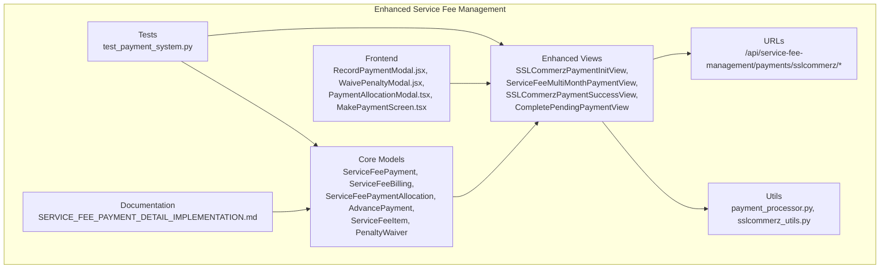

**Diagram sources**
- [models.py](file://backend/service_fee_management/models.py#L11-L1652)
- [views.py](file://backend/service_fee_management/views.py#L1613-L10861)
- [urls.py](file://backend/service_fee_management/urls.py#L128-L135)
- [payment_processor.py](file://backend/service_fee_management/utils/payment_processor.py#L1-L268)
- [sslcommerz_utils.py](file://backend/service_fee_management/utils/sslcommerz_utils.py#L20-L336)
- [test_payment_system.py](file://backend/service_fee_management/tests/test_payment_system.py#L1-L612)
- [SERVICE_FEE_PAYMENT_DETAIL_IMPLEMENTATION.md](file://backend/SERVICE_FEE_PAYMENT_DETAIL_IMPLEMENTATION.md#L1-L410)
- [RecordPaymentModal.jsx](file://frontend/src/Features/ServiceFeeManagement/Payments/components/RecordPaymentModal.jsx#L269-L2482)
- [WaivePenaltyModal.jsx](file://frontend/src/Features/ServiceFeeManagement/Payments/components/WaivePenaltyModal.jsx#L1-L480)
- [PaymentAllocationModal.tsx](file://Estate_link_App/src/Features/ServiceFeePayment/PaymentAllocationModal.tsx#L1-L211)
- [MakePaymentScreen.tsx](file://Estate_link_App/src/Features/ServiceFeePayment/MakePaymentScreen.tsx#L1-L835)

**Section sources**
- [models.py](file://backend/service_fee_management/models.py#L11-L1652)
- [views.py](file://backend/service_fee_management/views.py#L1613-L10861)
- [urls.py](file://backend/service_fee_management/urls.py#L128-L135)
- [payment_processor.py](file://backend/service_fee_management/utils/payment_processor.py#L1-L268)
- [sslcommerz_utils.py](file://backend/service_fee_management/utils/sslcommerz_utils.py#L20-L336)
- [test_payment_system.py](file://backend/service_fee_management/tests/test_payment_system.py#L1-L612)
- [SERVICE_FEE_PAYMENT_DETAIL_IMPLEMENTATION.md](file://backend/SERVICE_FEE_PAYMENT_DETAIL_IMPLEMENTATION.md#L1-L410)
- [RecordPaymentModal.jsx](file://frontend/src/Features/ServiceFeeManagement/Payments/components/RecordPaymentModal.jsx#L269-L2482)
- [WaivePenaltyModal.jsx](file://frontend/src/Features/ServiceFeeManagement/Payments/components/WaivePenaltyModal.jsx#L1-L480)
- [PaymentAllocationModal.tsx](file://Estate_link_App/src/Features/ServiceFeePayment/PaymentAllocationModal.tsx#L1-L211)
- [MakePaymentScreen.tsx](file://Estate_link_App/src/Features/ServiceFeePayment/MakePaymentScreen.tsx#L1-L835)

## Core Components
- **ServiceFeePayment**: Tracks individual payment transactions with enhanced status tracking and allocation management
- **ServiceFeeBilling**: Stores per-period billing records with comprehensive payment detail tracking and allocation references
- **ServiceFeePaymentAllocation**: NEW - Precise mapping of payment amounts to specific service fee items with allocation types
- **AdvancePayment**: NEW - Tracks overpayments and automatic application to future bills with detailed status management
- **ServiceFeeItem**: NEW - Represents individual service fee components (base fee, penalties, bill categories) with hierarchical organization
- **PenaltyWaiver**: NEW - Tracks penalty waivers with detailed history and accounting integration
- **ServiceFeePaymentLatePenaltyTier**: NEW - Snapshot of penalty tiers at generation time for historical accuracy
- **PaymentMethod**: Defines available payment methods including SSLCommerz with enhanced integration
- **SSLCommerzTransactionMapping**: Temporary mapping of SSLCommerz transaction IDs to payment IDs with expiration controls
- **PaymentAllocationModal**: NEW - Real-time visualization of payment distribution across multiple service fee bills

Key capabilities:
- **Hierarchical payment allocation** with penalty-first, base fee-second, bill categories-third priority
- **Automatic advance payment application** with intelligent allocation tracking
- **Multi-month payment distribution** with precise itemized breakdowns
- **Enhanced status propagation** across payment allocations and billing records
- **Comprehensive audit trails** for all payment allocation activities
- **Advanced penalty calculation** with tier-based snapshots and waiver tracking
- **Real-time allocation visualization** through frontend payment recording modal
- **Penalty waiver management** with comprehensive approval workflow
- **Multi-month selection support** with intelligent allocation distribution
- **Real-time payment allocation visualization** with PaymentAllocationModal.tsx

**Section sources**
- [models.py](file://backend/service_fee_management/models.py#L11-L1652)
- [models.py](file://backend/service_fee_management/models.py#L1359-L1443)
- [models.py](file://backend/service_fee_management/models.py#L1247-L1357)
- [models.py](file://backend/service_fee_management/models.py#L1445-L1536)
- [sslcommerz_utils.py](file://backend/service_fee_management/utils/sslcommerz_utils.py#L20-L336)
- [views.py](file://backend/service_fee_management/views.py#L1613-L10861)
- [PaymentAllocationModal.tsx](file://Estate_link_App/src/Features/ServiceFeePayment/PaymentAllocationModal.tsx#L1-L211)

## Architecture Overview
The redesigned payment lifecycle integrates advanced hierarchical allocation, automatic advance application, and comprehensive payment detail tracking. The system processes payments through a structured allocation hierarchy ensuring precise mapping from payment amounts to specific service fee items. Recent enhancements include a sophisticated payment recording modal that provides real-time allocation visualization and confirmation, along with comprehensive penalty waiver management.

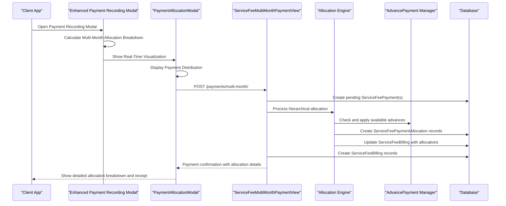

**Diagram sources**
- [views.py](file://backend/service_fee_management/views.py#L1613-L2380)
- [payment_processor.py](file://backend/service_fee_management/utils/payment_processor.py#L16-L268)
- [models.py](file://backend/service_fee_management/models.py#L1359-L1443)
- [RecordPaymentModal.jsx](file://frontend/src/Features/ServiceFeeManagement/Payments/components/RecordPaymentModal.jsx#L287-L422)
- [PaymentAllocationModal.tsx](file://Estate_link_App/src/Features/ServiceFeePayment/PaymentAllocationModal.tsx#L29-L207)

## Detailed Component Analysis

### SSLCommerz Payment Initialization
- Validates input parameters and unit/service fee existence
- Determines eligible months to pay with enhanced allocation tracking
- Creates pending ServiceFeePayment records with allocation-ready structures
- Initializes SSLCommerz session with comprehensive metadata for callback processing
- Integrates with SSLCommerzTransactionMapping for improved callback resolution

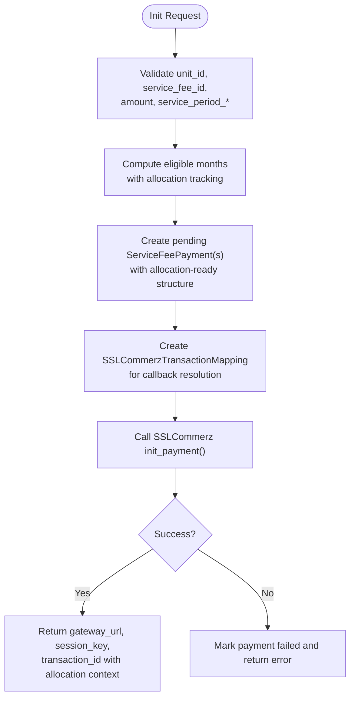

**Diagram sources**
- [views.py](file://backend/service_fee_management/views.py#L5025-L5400)
- [sslcommerz_utils.py](file://backend/service_fee_management/utils/sslcommerz_utils.py#L52-L163)
- [0050_sslcommerztransactionmapping.py](file://backend/service_fee_management/migrations/0050_sslcommerztransactionmapping.py#L12-L30)

**Section sources**
- [views.py](file://backend/service_fee_management/views.py#L5025-L5400)
- [sslcommerz_utils.py](file://backend/service_fee_management/utils/sslcommerz_utils.py#L52-L163)
- [0050_sslcommerztransactionmapping.py](file://backend/service_fee_management/migrations/0050_sslcommerztransactionmapping.py#L12-L30)

### Enhanced Payment Success Processing
- Receives SSLCommerz callback with comprehensive allocation context
- Resolves payment records using enhanced transaction mapping and allocation tracking
- Processes hierarchical allocation with penalty-first priority and automatic advance application
- Creates detailed ServiceFeePaymentAllocation records for precise payment-to-item mapping
- Updates billing totals with allocation-aware calculations

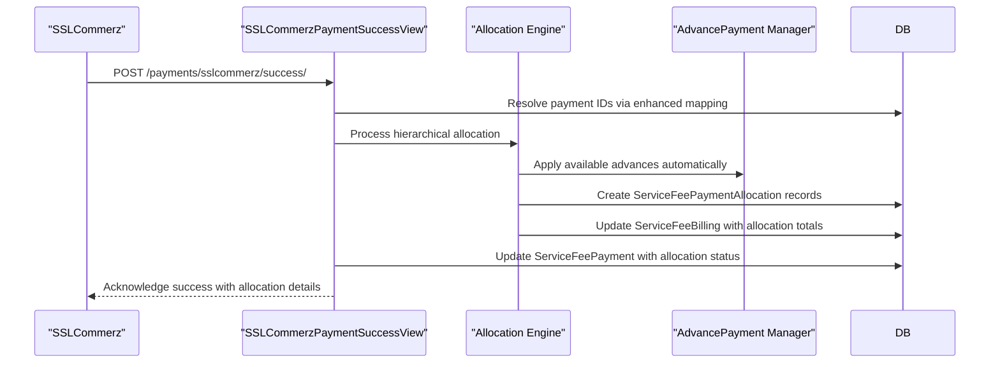

**Diagram sources**
- [views.py](file://backend/service_fee_management/views.py#L5404-L5930)
- [payment_processor.py](file://backend/service_fee_management/utils/payment_processor.py#L16-L268)

**Section sources**
- [views.py](file://backend/service_fee_management/views.py#L5404-L5930)
- [payment_processor.py](file://backend/service_fee_management/utils/payment_processor.py#L16-L268)

### Multi-Month Payment Processing with Hierarchical Allocation
- Processes payments across multiple months with allocation-aware distribution
- Implements penalty-first allocation priority followed by base fee and bill categories
- Automatically applies available advance payments to reduce outstanding balances
- Creates comprehensive allocation records for each payment component
- Maintains detailed audit trails for all allocation activities

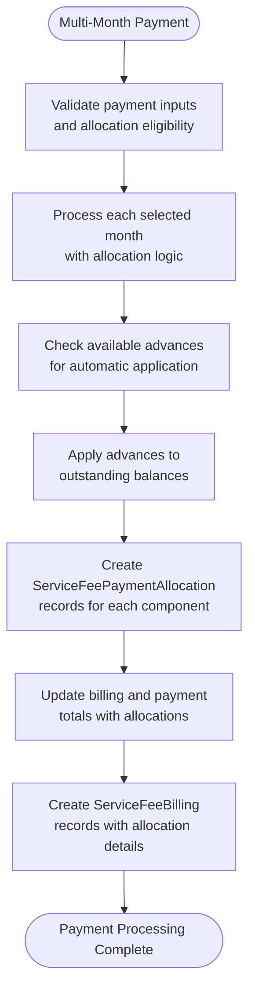

**Diagram sources**
- [views.py](file://backend/service_fee_management/views.py#L1613-L2380)
- [models.py](file://backend/service_fee_management/models.py#L1359-L1443)

**Section sources**
- [views.py](file://backend/service_fee_management/views.py#L1613-L2380)
- [models.py](file://backend/service_fee_management/models.py#L1359-L1443)

### Payment Methods and Bank Account Mappings
- PaymentMethod defines available methods (Cash, bKash, Nagad, Rocket, Bank Transfer, SSLCommerz)
- ServiceFeeBilling stores payment_method, reference_number, and account details with allocation context
- SSLCommerz integration enhanced with comprehensive metadata for allocation tracking
- Advanced payment method integration supporting hierarchical allocation requirements

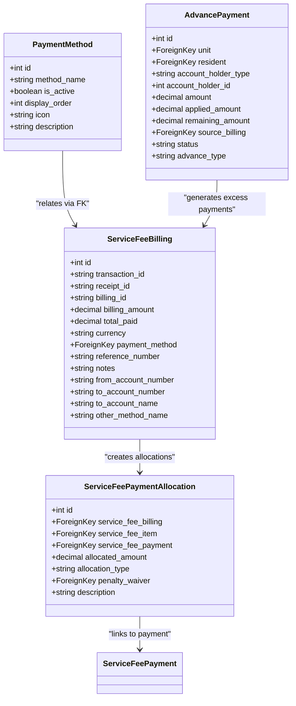

**Diagram sources**
- [models.py](file://backend/service_fee_management/models.py#L205-L226)
- [models.py](file://backend/service_fee_management/models.py#L12-L111)
- [models.py](file://backend/service_fee_management/models.py#L1359-L1443)
- [models.py](file://backend/service_fee_management/models.py#L1247-L1357)

**Section sources**
- [models.py](file://backend/service_fee_management/models.py#L205-L226)
- [models.py](file://backend/service_fee_management/models.py#L12-L111)
- [models.py](file://backend/service_fee_management/models.py#L1359-L1443)
- [models.py](file://backend/service_fee_management/models.py#L1247-L1357)

### Payment Status Tracking and Allocation Management
- Enhanced payment statuses with allocation-aware tracking
- Service status propagation across allocation boundaries
- Payment result status tracking with allocation context
- Multi-month payments with precise allocation distribution
- Automatic status updates based on allocation completion

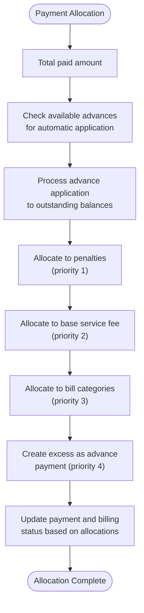

**Diagram sources**
- [views.py](file://backend/service_fee_management/views.py#L2222-L2437)
- [models.py](file://backend/service_fee_management/models.py#L1359-L1443)

**Section sources**
- [views.py](file://backend/service_fee_management/views.py#L2222-L2437)
- [models.py](file://backend/service_fee_management/models.py#L1359-L1443)

### Receipt Generation and Allocation-Based Confirmation
- Generates detailed receipts with comprehensive allocation breakdowns
- Creates ServiceFeePaymentAllocation records for each payment component
- Provides itemized payment details showing penalty, base fee, and bill category allocations
- Supports email receipt dispatch with allocation-aware payment summaries
- Maintains audit trails for all allocation activities

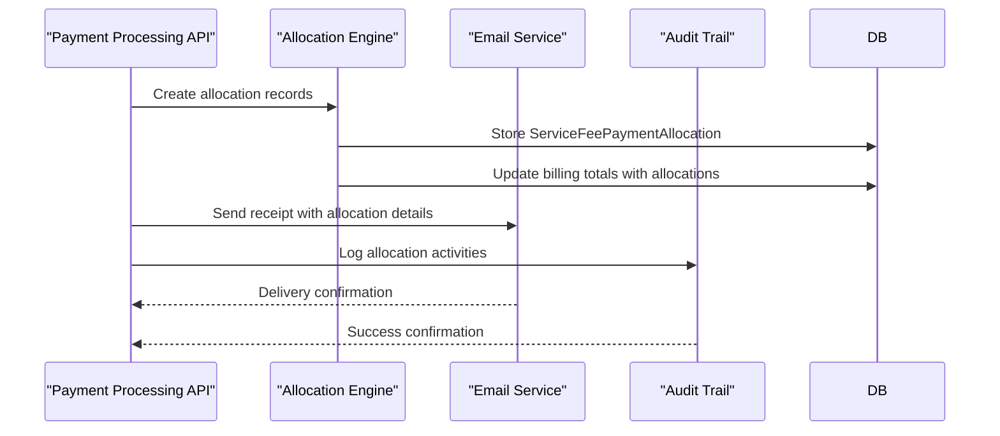

**Diagram sources**
- [views.py](file://backend/service_fee_management/views.py#L5748-L5926)
- [models.py](file://backend/service_fee_management/models.py#L1359-L1443)

**Section sources**
- [views.py](file://backend/service_fee_management/views.py#L5748-L5926)
- [models.py](file://backend/service_fee_management/models.py#L1359-L1443)

### Refund Processing with Allocation Awareness
- Processes refunds with allocation-aware calculations
- Handles partial and full refund scenarios with precise allocation tracking
- Updates ServiceFeePaymentAllocation records to reflect refund activities
- Manages advance payment reversals with allocation context
- Maintains comprehensive audit trails for all refund operations

### Payment Validation Processes
- Enhanced validation with allocation-aware amount verification
- Duplicate payment prevention with allocation tracking
- Amount validation comparing callback amounts with allocation expectations
- Hash verification with allocation context validation
- Allocation integrity checking for payment-to-item mapping accuracy

**Section sources**
- [views.py](file://backend/service_fee_management/views.py#L5124-L5185)
- [sslcommerz_utils.py](file://backend/service_fee_management/utils/sslcommerz_utils.py#L164-L266)
- [sslcommerz_utils.py](file://backend/service_fee_management/utils/sslcommerz_utils.py#L268-L300)

### Integration Between Payment Processing and Billing Management
- ServiceFeePayment serves as allocation hub for monthly obligations
- ServiceFeeBilling stores per-month transaction details with allocation context
- ServiceFeePaymentAllocation provides precise payment-to-item mapping
- AdvancePayment integrates seamlessly with billing and allocation systems
- Enhanced service status propagation across allocation boundaries

**Section sources**
- [models.py](file://backend/service_fee_management/models.py#L228-L400)
- [models.py](file://backend/service_fee_management/models.py#L12-L111)
- [models.py](file://backend/service_fee_management/models.py#L1359-L1443)

## Hierarchical Payment Allocation System

### Payment Allocation Hierarchy Logic
The system implements a four-tier payment allocation hierarchy ensuring precise payment-to-item mapping:

```
┌─────────────────────────────────────────────────────┐
│     TOTAL PAYMENT AMOUNT RECEIVED                    │
└──────────────────┬──────────────────────────────────┘
                   │
         ┌─────────▼─────────┐
         │ STEP 1: PAY PENALTY│
         │ (if exists)       │
         │ ─────────────────│
         │ Net Penalty =     │
         │ Penalty - Waived  │
         └─────────┬─────────┘
                   │
         ┌─────────▼──────────────┐
         │ STEP 2: PAY BASE FEE   │
         │ ─────────────────────  │
         │ Amount = Original Fee  │
         │ Already Paid Subtracted│
         └─────────┬──────────────┘
                   │
         ┌─────────▼──────────────────────┐
         │ STEP 3: PAY BILL CATEGORIES    │
         │ ─────────────────────────────  │
         │ Amount = Additional Charges    │
         │ Distribute if multiple exist   │
         └─────────┬──────────────────────┘
                   │
         ┌─────────▼─────────────┐
         │ STEP 4: EXCESS AMOUNT │
         │ ─────────────────────│
         │ If Amount > 0        │
         │ → AdvancePayment     │
         └───────────────────────┘
```

### Allocation Priority Implementation
The allocation engine prioritizes payment application across different item types:

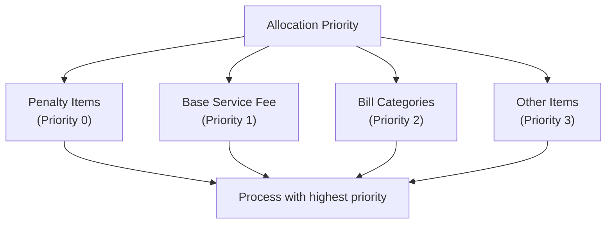

**Diagram sources**
- [views.py](file://backend/service_fee_management/views.py#L2256-L2262)
- [models.py](file://backend/service_fee_management/models.py#L1359-L1443)

### Advance Payment Integration
The system automatically manages overpayments through AdvancePayment integration:

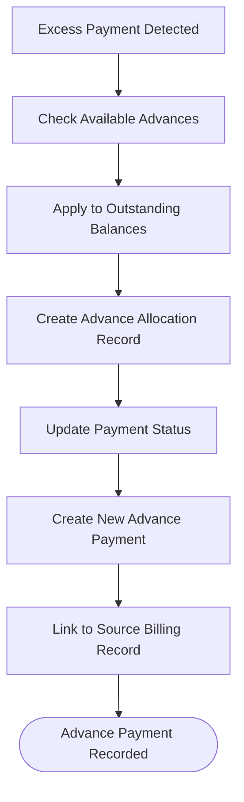

**Diagram sources**
- [views.py](file://backend/service_fee_management/views.py#L2515-L2680)
- [models.py](file://backend/service_fee_management/models.py#L1247-L1357)

**Section sources**
- [SERVICE_FEE_PAYMENT_DETAIL_IMPLEMENTATION.md](file://backend/SERVICE_FEE_PAYMENT_DETAIL_IMPLEMENTATION.md#L129-L166)
- [views.py](file://backend/service_fee_management/views.py#L2256-L2262)
- [views.py](file://backend/service_fee_management/views.py#L2515-L2680)
- [models.py](file://backend/service_fee_management/models.py#L1247-L1357)

## Advanced Payment Features

### Comprehensive Payment Detail Tracking
The system provides detailed tracking of payment components through ServiceFeePaymentAllocation:

- **Precise Allocation Mapping**: Each payment amount is precisely mapped to specific service fee items
- **Allocation Type Tracking**: Differentiates between cash payments, credit adjustments, and advance applications
- **Hierarchical Allocation Support**: Supports multi-level allocation with priority-based processing
- **Real-time Allocation Updates**: Dynamic allocation updates as payments are processed
- **Allocation History Tracking**: Comprehensive audit trail of all allocation activities

### Enhanced Advance Payment Management
The AdvancePayment model provides sophisticated overpayment management:

- **Automatic Advance Application**: Intelligent application of advance payments to outstanding balances
- **Advance Status Tracking**: Detailed status management (available, partial, applied, cancelled)
- **Advance Source Tracking**: Links advances to specific billing records and payment sources
- **Advance Expiration Management**: Optional expiration tracking for time-sensitive advances
- **Advance Balance Calculation**: Real-time calculation of available advance balances

### Itemized Payment Breakdowns
The system generates comprehensive payment breakdowns showing:

- **Penalty Allocation Details**: Separate tracking of penalty payments and waivers
- **Base Fee Allocation**: Precise allocation of base service fee payments
- **Bill Category Allocations**: Detailed breakdown of additional bill category payments
- **Advance Payment Applications**: Clear tracking of advance payment applications
- **Payment Method Details**: Comprehensive payment method and reference information

**Section sources**
- [models.py](file://backend/service_fee_management/models.py#L1359-L1443)
- [models.py](file://backend/service_fee_management/models.py#L1247-L1357)
- [models.py](file://backend/service_fee_management/models.py#L1445-L1536)
- [payment_processor.py](file://backend/service_fee_management/utils/payment_processor.py#L16-L268)

## Enhanced Payment Recording Modal

### Multi-Month Selection and Allocation Visualization
The enhanced payment recording modal provides comprehensive allocation visualization and confirmation:

- **Multi-Month Selection Interface**: Interactive calendar for selecting multiple payment periods
- **Real-time Allocation Calculation**: Dynamic calculation of payment distribution across selected months
- **Cash vs Advance Allocation Display**: Clear separation of cash payments from advance applications
- **Detailed Allocation Breakdown**: Comprehensive display of how payment amounts are distributed
- **Multi-Month Payment Support**: Intelligent handling of payments spanning multiple billing periods

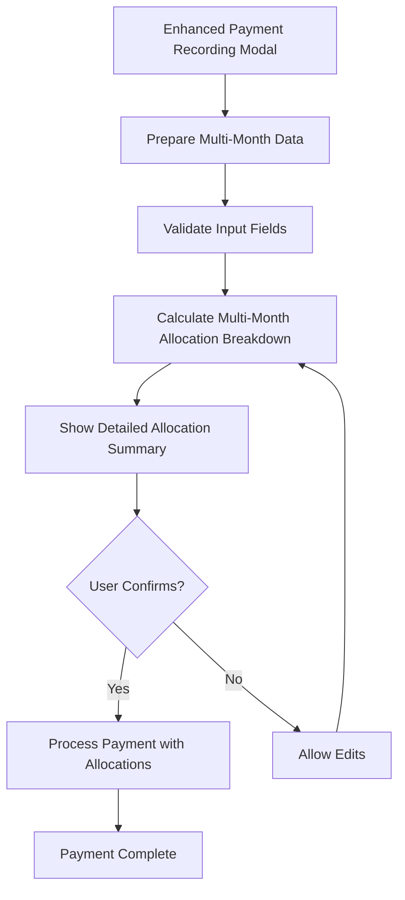

**Diagram sources**
- [RecordPaymentModal.jsx](file://frontend/src/Features/ServiceFeeManagement/Payments/components/RecordPaymentModal.jsx#L287-L422)

### Advanced Allocation Summary Features
The modal displays comprehensive allocation information:

- **Payment Amount Entered**: Shows total cash amount entered by user
- **Applied from Cash**: Displays portion allocated from cash payments
- **Applied from Advance**: Shows portion allocated from advance payments
- **Saved as Advance**: Indicates remaining amount saved as new advance
- **Total Cash Accounted For**: Confirms total allocation matches payment amount
- **Multi-Month Distribution**: Visualizes payment distribution across selected months
- **Real-time Updates**: Dynamic updates as user modifies payment details

### Penalty Waiver Management Integration
The enhanced modal includes comprehensive penalty waiver management:

- **Waiver Application Interface**: Dedicated interface for applying penalty waivers
- **Real-time Waiver Calculation**: Dynamic calculation of waiver effects on payment amounts
- **Waiver History Tracking**: Display of existing waiver history for selected months
- **Waiver Approval Workflow**: Streamlined approval process for penalty reductions
- **Waiver Limit Validation**: Automatic validation against available penalty limits

**Section sources**
- [RecordPaymentModal.jsx](file://frontend/src/Features/ServiceFeeManagement/Payments/components/RecordPaymentModal.jsx#L269-L2482)
- [WaivePenaltyModal.jsx](file://frontend/src/Features/ServiceFeeManagement/Payments/components/WaivePenaltyModal.jsx#L1-L480)

## Real-Time Payment Allocation Visualization

### PaymentAllocationModal Implementation
The new PaymentAllocationModal.tsx provides comprehensive real-time visualization of payment distribution:

- **Real-time Allocation Calculation**: Dynamic calculation of payment distribution across multiple bills
- **Visual Bill Allocation Display**: Clear visualization of how payment amounts are allocated to each bill
- **Advance Payment Tracking**: Real-time tracking of advance payment applications and balances
- **Multi-Month Distribution Visualization**: Interactive display of payment distribution across selected months
- **Allocation Breakdown Summary**: Comprehensive summary of payment allocation breakdowns

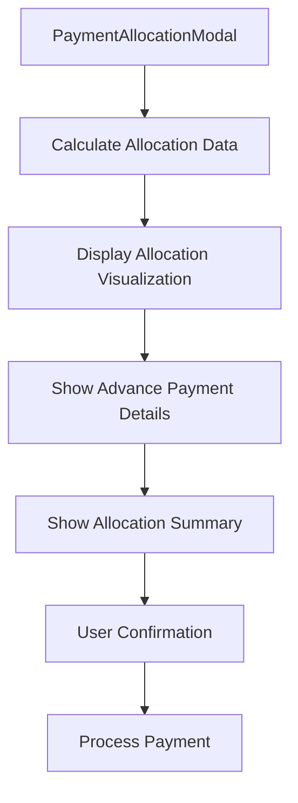

**Diagram sources**
- [PaymentAllocationModal.tsx](file://Estate_link_App/src/Features/ServiceFeePayment/PaymentAllocationModal.tsx#L29-L207)

### Real-time Allocation Features
The modal provides comprehensive real-time allocation visualization:

- **Total Payment Display**: Shows total payment amount entered by user
- **Allocated to Bills**: Visual display of payment allocation across multiple bills
- **Advance Payment Section**: Dedicated section for advance payment tracking and visualization
- **Allocation Breakdown**: Detailed breakdown of payment allocation across different components
- **Payment Status Indicators**: Visual indicators for fully paid and partially paid bills
- **How Advance Payments Work**: Educational section explaining advance payment mechanics

### Integration with MakePaymentScreen
The PaymentAllocationModal integrates seamlessly with the MakePaymentScreen:

- **Automatic Allocation Calculation**: Real-time calculation of payment allocation based on user input
- **Allocation Data Preparation**: Preparation of allocation data for modal display
- **Allocation Confirmation Flow**: Seamless flow from allocation calculation to payment confirmation
- **Error Handling**: Comprehensive error handling for allocation calculation failures
- **User Experience**: Smooth user experience with real-time feedback and updates

**Section sources**
- [PaymentAllocationModal.tsx](file://Estate_link_App/src/Features/ServiceFeePayment/PaymentAllocationModal.tsx#L1-L211)
- [MakePaymentScreen.tsx](file://Estate_link_App/src/Features/ServiceFeePayment/MakePaymentScreen.tsx#L278-L365)

## Penalty Calculation and Management

### Advanced Penalty Tier System
The system implements sophisticated penalty calculation with tier-based snapshots:

- **Penalty Tier Snapshots**: Historical penalty tiers captured at generation time
- **Dynamic Penalty Calculation**: Penalty calculated based on days overdue and applicable tier
- **Penalty Waiver Integration**: Waivers reduce penalty amounts with detailed tracking
- **Penalty Tier Management**: Configurable penalty tiers with basis calculation options

### Penalty Calculation Process
Penalty calculations follow a structured approach:

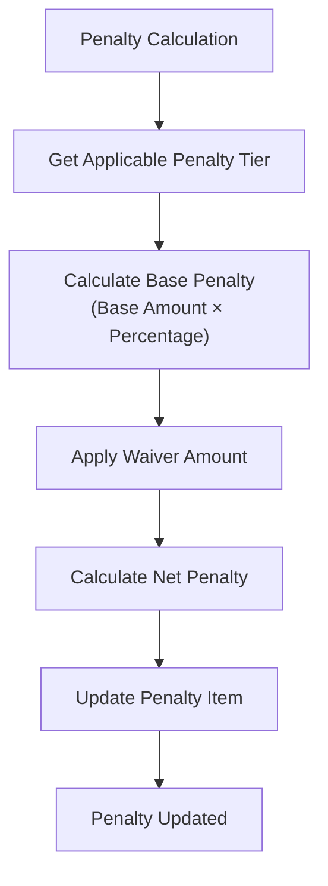

**Diagram sources**
- [update_penalty_tiers.py](file://backend/service_fee_management/management/commands/update_penalty_tiers.py#L158-L169)

**Section sources**
- [models.py](file://backend/service_fee_management/models.py#L1538-L1604)
- [update_penalty_tiers.py](file://backend/service_fee_management/management/commands/update_penalty_tiers.py#L158-L169)

## Dependency Analysis
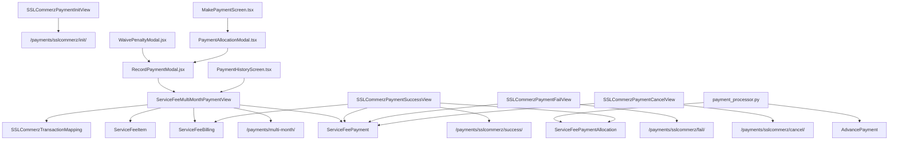

**Diagram sources**
- [urls.py](file://backend/service_fee_management/urls.py#L128-L135)
- [views.py](file://backend/service_fee_management/views.py#L1613-L10861)
- [models.py](file://backend/service_fee_management/models.py#L11-L1652)
- [payment_processor.py](file://backend/service_fee_management/utils/payment_processor.py#L1-L268)
- [sslcommerz_utils.py](file://backend/service_fee_management/utils/sslcommerz_utils.py#L20-L336)
- [RecordPaymentModal.jsx](file://frontend/src/Features/ServiceFeeManagement/Payments/components/RecordPaymentModal.jsx#L269-L2482)
- [WaivePenaltyModal.jsx](file://frontend/src/Features/ServiceFeeManagement/Payments/components/WaivePenaltyModal.jsx#L1-L480)
- [PaymentAllocationModal.tsx](file://Estate_link_App/src/Features/ServiceFeePayment/PaymentAllocationModal.tsx#L1-L211)
- [MakePaymentScreen.tsx](file://Estate_link_App/src/Features/ServiceFeePayment/MakePaymentScreen.tsx#L1-L835)
- [PaymentHistoryScreen.tsx](file://Estate_link_App/src/Features/ServiceFeePayment/PaymentHistoryScreen.tsx#L1-L1151)

**Section sources**
- [urls.py](file://backend/service_fee_management/urls.py#L128-L135)
- [views.py](file://backend/service_fee_management/views.py#L1613-L10861)
- [models.py](file://backend/service_fee_management/models.py#L11-L1652)
- [payment_processor.py](file://backend/service_fee_management/utils/payment_processor.py#L1-L268)
- [sslcommerz_utils.py](file://backend/service_fee_management/utils/sslcommerz_utils.py#L20-L336)
- [RecordPaymentModal.jsx](file://frontend/src/Features/ServiceFeeManagement/Payments/components/RecordPaymentModal.jsx#L269-L2482)
- [WaivePenaltyModal.jsx](file://frontend/src/Features/ServiceFeeManagement/Payments/components/WaivePenaltyModal.jsx#L1-L480)
- [PaymentAllocationModal.tsx](file://Estate_link_App/src/Features/ServiceFeePayment/PaymentAllocationModal.tsx#L1-L211)
- [MakePaymentScreen.tsx](file://Estate_link_App/src/Features/ServiceFeePayment/MakePaymentScreen.tsx#L1-L835)
- [PaymentHistoryScreen.tsx](file://Estate_link_App/src/Features/ServiceFeePayment/PaymentHistoryScreen.tsx#L1-L1151)

## Performance Considerations
- **Connection pooling and retry strategy** for SSLCommerz API calls with allocation-aware processing
- **Asynchronous tasks** for validation, audit trails, and email dispatch with allocation tracking
- **Efficient queries** using select_related and prefetch_related for payment lists with allocation context
- **Transaction mapping** reduces reliance on gateway-provided metadata for callback resolution
- **Allocation optimization** through bulk creation of allocation records and efficient status updates
- **Advance payment caching** to minimize database queries for available advance balances
- **Frontend allocation caching** to reduce computation overhead in payment recording modal
- **Real-time allocation validation** to prevent invalid payment configurations
- **Multi-month allocation optimization** to handle complex payment scenarios efficiently
- **Penalty waiver calculation caching** to improve performance in penalty management workflows
- **PaymentAllocationModal optimization** to handle real-time allocation calculations efficiently
- **Mobile payment processing** optimization for MakePaymentScreen with allocation visualization

## Troubleshooting Guide
Common issues and resolutions:
- **Missing or invalid callback parameters**: Ensure SSLCommerz returns val_id, tran_id, amount, and value_a with allocation context
- **Payment not found by transaction ID**: Verify transaction mapping exists and is not expired; fallback to unit/service fee filters with allocation tracking
- **Allocation discrepancies**: Review multi-month allocation logic and billing totals with allocation-aware calculations
- **Advance payment issues**: Check advance application logic and allocation tracking for proper status updates
- **Duplicate payments**: Check recent payment window prevention and existing completed payments with allocation context
- **Sandbox limitations**: value_a may be empty; rely on server-side mapping with allocation tracking
- **Allocation priority conflicts**: Verify allocation priority logic and item type categorization for proper payment application
- **Payment recording modal errors**: Check allocation calculations and ensure payment amount matches allocation breakdown
- **Penalty calculation mismatches**: Verify penalty tier snapshots and waiver calculations for historical accuracy
- **Multi-month allocation failures**: Validate month selection logic and ensure proper allocation distribution across periods
- **Penalty waiver application errors**: Check waiver limits and approval workflows for proper processing
- **PaymentAllocationModal display issues**: Verify allocation data preparation and real-time calculation logic
- **MakePaymentScreen allocation errors**: Check allocation calculation logic and modal integration
- **PaymentHistoryScreen allocation display issues**: Verify allocation data retrieval and display logic

**Section sources**
- [views.py](file://backend/service_fee_management/views.py#L5411-L5583)
- [views.py](file://backend/service_fee_management/views.py#L5934-L6151)
- [views.py](file://backend/service_fee_management/views.py#L2222-L2437)
- [sslcommerz_utils.py](file://backend/service_fee_management/utils/sslcommerz_utils.py#L164-L266)
- [0050_sslcommerztransactionmapping.py](file://backend/service_fee_management/migrations/0050_sslcommerztransactionmapping.py#L12-L30)
- [RecordPaymentModal.jsx](file://frontend/src/Features/ServiceFeeManagement/Payments/components/RecordPaymentModal.jsx#L287-L422)
- [WaivePenaltyModal.jsx](file://frontend/src/Features/ServiceFeeManagement/Payments/components/WaivePenaltyModal.jsx#L235-L243)
- [PaymentAllocationModal.tsx](file://Estate_link_App/src/Features/ServiceFeePayment/PaymentAllocationModal.tsx#L35-L37)
- [MakePaymentScreen.tsx](file://Estate_link_App/src/Features/ServiceFeePayment/MakePaymentScreen.tsx#L367-L407)
- [PaymentHistoryScreen.tsx](file://Estate_link_App/src/Features/ServiceFeePayment/PaymentHistoryScreen.tsx#L281-L307)

## Conclusion
The redesigned payment processing and collection system provides a robust, hierarchical payment pipeline with precise allocation tracking and comprehensive overpayment management. The integration of ServiceFeePaymentAllocation, AdvancePayment, and enhanced payment detail implementations ensures accurate distribution of payments across due periods while maintaining detailed audit trails and allocation awareness. Recent enhancements include an advanced payment recording modal with real-time allocation visualization, comprehensive penalty waiver management with approval workflows, and improved handling of complex payment scenarios where partial payments may be applied across multiple months or categories. The addition of PaymentAllocationModal.tsx provides real-time visualization of payment distribution, enhancing transparency and user confidence in the payment process. The modular design with clear separation of concerns enables maintainability and scalability while preserving strong validation and reconciliation capabilities across the entire payment lifecycle.