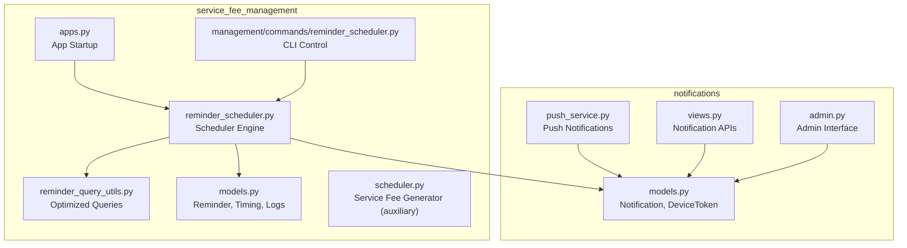
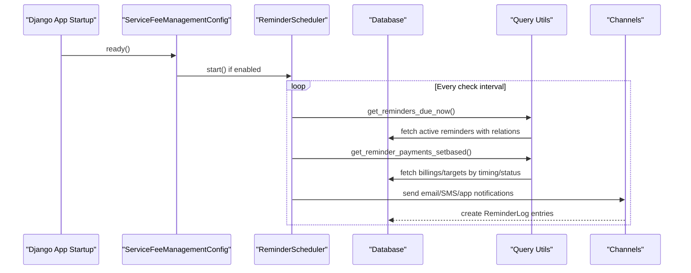
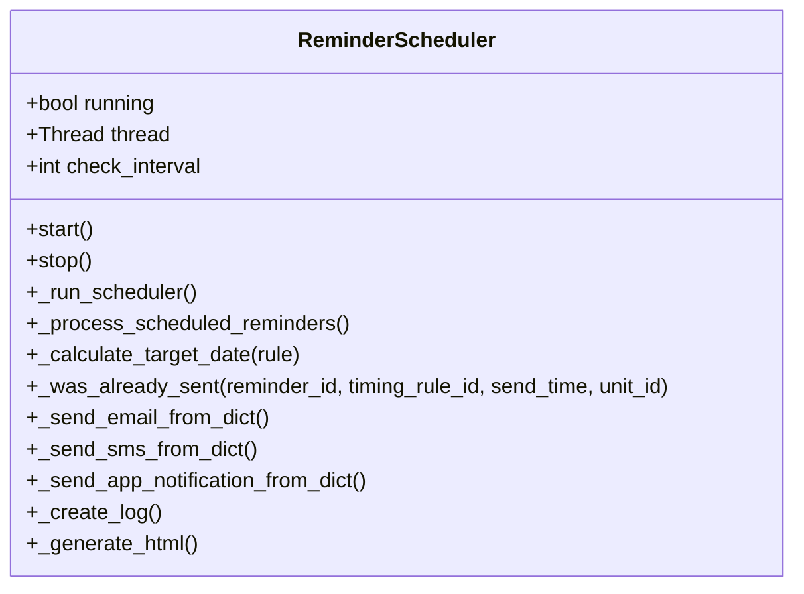
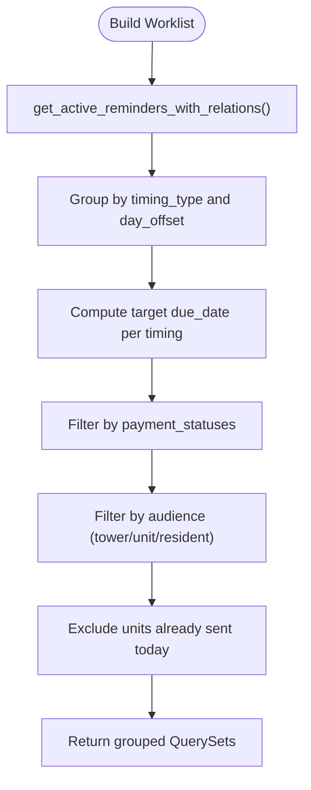
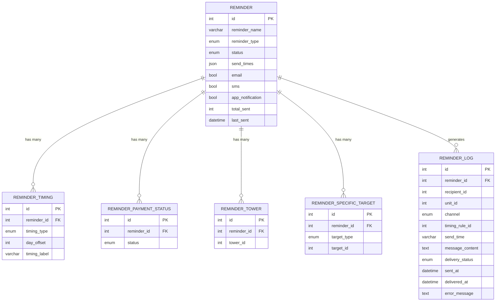
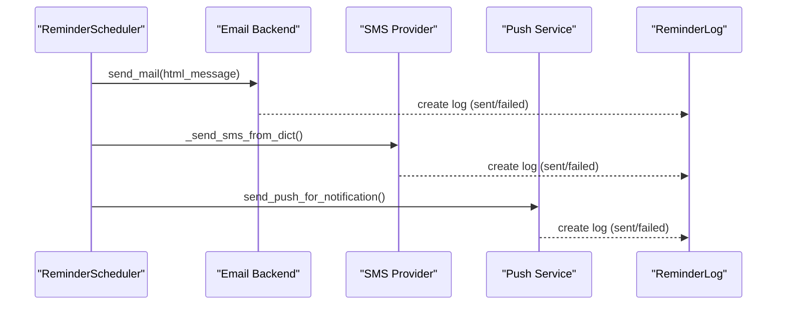
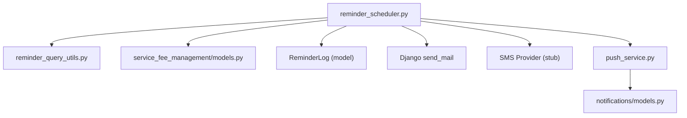

# Reminder & Notification System

<cite>
**Referenced Files in This Document**
- [REMINDER_SCHEDULER_DOCS.md](file://backend/service_fee_management/REMINDER_SCHEDULER_DOCS.md)
- [IMPLEMENTATION_SUMMARY.md](file://backend/service_fee_management/IMPLEMENTATION_SUMMARY.md)
- [scheduler.py](file://backend/service_fee_management/scheduler.py)
- [reminder_scheduler.py](file://backend/service_fee_management/reminder_scheduler.py)
- [reminder_query_utils.py](file://backend/service_fee_management/reminder_query_utils.py)
- [models.py](file://backend/service_fee_management/models.py)
- [apps.py](file://backend/service_fee_management/apps.py)
- [reminder_scheduler.py](file://backend/service_fee_management/management/commands/reminder_scheduler.py)
- [models.py](file://backend/notifications/models.py)
- [push_service.py](file://backend/notifications/push_service.py)
- [views.py](file://backend/notifications/views.py)
- [admin.py](file://backend/notifications/admin.py)
</cite>

## Table of Contents
1. [Introduction](#introduction)
2. [Project Structure](#project-structure)
3. [Core Components](#core-components)
4. [Architecture Overview](#architecture-overview)
5. [Detailed Component Analysis](#detailed-component-analysis)
6. [Dependency Analysis](#dependency-analysis)
7. [Performance Considerations](#performance-considerations)
8. [Troubleshooting Guide](#troubleshooting-guide)
9. [Conclusion](#conclusion)
10. [Appendices](#appendices)

## Introduction
This document describes the reminder and notification system for automated service fee reminders and broader organizational notifications. It explains how reminders are generated, scheduled, targeted, and delivered across email, SMS, and in-app channels. It also documents configuration workflows, timing and frequency controls, escalation procedures, logging and retry behavior, and integration points with payment processing.

## Project Structure
The reminder system is implemented primarily in the service_fee_management Django app, with supporting notification infrastructure in the notifications app. Key elements include:
- Reminder models and normalized timing/payment-status/target configurations
- A background scheduler that evaluates timing rules and sends notifications
- Optimized query utilities to minimize database overhead
- Management commands for manual control and diagnostics
- Notification models and push service for broader app notifications

**Diagram sources**
- [reminder_scheduler.py](file://backend/service_fee_management/reminder_scheduler.py#L33-L473)
- [reminder_query_utils.py](file://backend/service_fee_management/reminder_query_utils.py#L1-L800)
- [models.py](file://backend/service_fee_management/models.py#L342-L710)
- [apps.py](file://backend/service_fee_management/apps.py#L66-L140)
- [reminder_scheduler.py](file://backend/service_fee_management/management/commands/reminder_scheduler.py#L1-L29)
- [scheduler.py](file://backend/service_fee_management/scheduler.py#L1-L78)
- [models.py](file://backend/notifications/models.py#L6-L229)
- [push_service.py](file://backend/notifications/push_service.py#L1-L332)
- [views.py](file://backend/notifications/views.py#L1-L602)
- [admin.py](file://backend/notifications/admin.py#L1-L81)

**Section sources**
- [REMINDER_SCHEDULER_DOCS.md](file://backend/service_fee_management/REMINDER_SCHEDULER_DOCS.md#L21-L72)
- [IMPLEMENTATION_SUMMARY.md](file://backend/service_fee_management/IMPLEMENTATION_SUMMARY.md#L42-L90)

## Core Components
- Reminder Scheduler: Background thread that periodically evaluates active reminders and sends notifications across channels.
- Optimized Query Utilities: Efficient database queries to fetch reminders, billings, and audience lists with minimal overhead.
- Reminder Models: Normalized models for timing rules, payment status filters, audience targets, and logs.
- Notification Infrastructure: Generic notification types, device tokens, and push service for in-app/mobile notifications.
- Management Commands: CLI tools to start/stop/status/test the scheduler and inspect configuration.

Key capabilities:
- Automated scheduling with configurable send times
- Audience targeting by tower, units, residents, or status filters
- Multi-channel delivery (email, SMS, app)
- Duplicate prevention and detailed logging
- Integration with payment status for escalation

**Section sources**
- [reminder_scheduler.py](file://backend/service_fee_management/reminder_scheduler.py#L33-L473)
- [reminder_query_utils.py](file://backend/service_fee_management/reminder_query_utils.py#L171-L399)
- [models.py](file://backend/service_fee_management/models.py#L342-L710)
- [models.py](file://backend/notifications/models.py#L6-L229)
- [push_service.py](file://backend/notifications/push_service.py#L1-L332)
- [reminder_scheduler.py](file://backend/service_fee_management/management/commands/reminder_scheduler.py#L1-L29)

## Architecture Overview
The reminder system operates as a background scheduler integrated into Django’s app lifecycle. It evaluates active reminders at precise times, computes target audiences based on timing rules and filters, and dispatches notifications asynchronously. Delivery logs capture outcomes and prevent duplicates.

**Diagram sources**
- [apps.py](file://backend/service_fee_management/apps.py#L70-L140)
- [reminder_scheduler.py](file://backend/service_fee_management/reminder_scheduler.py#L70-L90)
- [reminder_query_utils.py](file://backend/service_fee_management/reminder_query_utils.py#L171-L399)
- [reminder_scheduler.py](file://backend/service_fee_management/reminder_scheduler.py#L278-L370)
- [models.py](file://backend/service_fee_management/models.py#L666-L710)

## Detailed Component Analysis

### Reminder Scheduler Engine
The scheduler runs in a daemon thread, checking for reminders due at the current time and dispatching notifications. It supports configurable send times and prevents duplicate sends by checking ReminderLog.

**Diagram sources**
- [reminder_scheduler.py](file://backend/service_fee_management/reminder_scheduler.py#L33-L473)

**Section sources**
- [reminder_scheduler.py](file://backend/service_fee_management/reminder_scheduler.py#L46-L90)
- [reminder_scheduler.py](file://backend/service_fee_management/reminder_scheduler.py#L91-L195)
- [reminder_scheduler.py](file://backend/service_fee_management/reminder_scheduler.py#L227-L277)
- [reminder_scheduler.py](file://backend/service_fee_management/reminder_scheduler.py#L278-L370)
- [reminder_scheduler.py](file://backend/service_fee_management/reminder_scheduler.py#L371-L406)

### Optimized Query Utilities
The query utilities encapsulate complex joins and filters to efficiently fetch reminders, billings, and audience data. They support timing-based grouping, audience filtering, and duplicate suppression.

**Diagram sources**
- [reminder_query_utils.py](file://backend/service_fee_management/reminder_query_utils.py#L171-L399)
- [reminder_query_utils.py](file://backend/service_fee_management/reminder_query_utils.py#L471-L644)

**Section sources**
- [reminder_query_utils.py](file://backend/service_fee_management/reminder_query_utils.py#L26-L144)
- [reminder_query_utils.py](file://backend/service_fee_management/reminder_query_utils.py#L147-L169)
- [reminder_query_utils.py](file://backend/service_fee_management/reminder_query_utils.py#L171-L399)
- [reminder_query_utils.py](file://backend/service_fee_management/reminder_query_utils.py#L471-L644)

### Reminder Models and Normalization
The reminder system uses normalized models to store timing rules, payment status filters, audience targets, and logs. This enables flexible configuration and efficient querying.

**Diagram sources**
- [models.py](file://backend/service_fee_management/models.py#L342-L710)

**Section sources**
- [models.py](file://backend/service_fee_management/models.py#L342-L540)
- [models.py](file://backend/service_fee_management/models.py#L542-L664)
- [models.py](file://backend/service_fee_management/models.py#L666-L710)

### Notification Infrastructure (Email, SMS, App)
- Email: Implemented in the scheduler; emails are sent asynchronously in separate threads and logged in ReminderLog.
- SMS: Stubbed in the scheduler; can be integrated with an SMS provider.
- App (Push): Separate notification system with DeviceToken storage and push service for mobile/web.

**Diagram sources**
- [reminder_scheduler.py](file://backend/service_fee_management/reminder_scheduler.py#L278-L370)
- [push_service.py](file://backend/notifications/push_service.py#L195-L286)
- [models.py](file://backend/service_fee_management/models.py#L666-L710)

**Section sources**
- [reminder_scheduler.py](file://backend/service_fee_management/reminder_scheduler.py#L278-L370)
- [push_service.py](file://backend/notifications/push_service.py#L29-L130)
- [push_service.py](file://backend/notifications/push_service.py#L132-L193)
- [push_service.py](file://backend/notifications/push_service.py#L195-L332)

### Management Commands and App Startup
- App startup: The Django app initializes schedulers when the server starts, avoiding background threads during migrations or management commands.
- CLI control: A management command allows manual start/stop/status/test of the reminder scheduler.

**Section sources**
- [apps.py](file://backend/service_fee_management/apps.py#L70-L140)
- [reminder_scheduler.py](file://backend/service_fee_management/management/commands/reminder_scheduler.py#L1-L29)

## Dependency Analysis
The reminder system depends on:
- Django ORM and timezone utilities
- Optimized query utilities for efficient batching
- ReminderLog for duplicate prevention and auditing
- Notification models and push service for broader in-app/mobile notifications

**Diagram sources**
- [reminder_scheduler.py](file://backend/service_fee_management/reminder_scheduler.py#L1-L40)
- [reminder_query_utils.py](file://backend/service_fee_management/reminder_query_utils.py#L1-L30)
- [models.py](file://backend/service_fee_management/models.py#L666-L710)
- [push_service.py](file://backend/notifications/push_service.py#L1-L32)

**Section sources**
- [reminder_scheduler.py](file://backend/service_fee_management/reminder_scheduler.py#L1-L40)
- [reminder_query_utils.py](file://backend/service_fee_management/reminder_query_utils.py#L1-L30)
- [models.py](file://backend/service_fee_management/models.py#L666-L710)
- [push_service.py](file://backend/notifications/push_service.py#L1-L32)

## Performance Considerations
- Background threading: Two-level threading (scheduler + email/SMS/app threads) ensures non-blocking operation.
- Query optimization: Prefetch-related data and use set-based grouping to reduce database round-trips.
- Duplicate prevention: Uses ReminderLog to avoid redundant sends within a given time window.
- Scalability: Check intervals and concurrent threads scale with workload; rate-limiting applies to email providers.

[No sources needed since this section provides general guidance]

## Troubleshooting Guide
Common issues and resolutions:
- Scheduler not starting: Verify app startup conditions and environment variables.
- No emails sent: Confirm reminder status, send times, unit contacts, and due dates.
- Duplicate emails: Check ReminderLog for existing entries; the system prevents duplicates.
- SMS/Push not firing: Integrate providers or verify push tokens and device registration.

Operational commands and checks:
- Status and test: Use the management command to check status and simulate sends.
- Logs: Inspect ReminderLog and Django logs for errors and delivery outcomes.
- Configuration: Validate email settings, reminder send times, and audience filters.

**Section sources**
- [reminder_scheduler.py](file://backend/service_fee_management/management/commands/reminder_scheduler.py#L1-L29)
- [reminder_scheduler.py](file://backend/service_fee_management/reminder_scheduler.py#L227-L277)
- [REMINDER_SCHEDULER_DOCS.md](file://backend/service_fee_management/REMINDER_SCHEDULER_DOCS.md#L307-L364)

## Conclusion
The reminder and notification system provides a robust, self-contained solution for automated service fee reminders and broader notifications. It leverages background threading, normalized models, and optimized queries to deliver timely, targeted communications across email, SMS, and app channels while maintaining auditability and preventing duplicates.

[No sources needed since this section summarizes without analyzing specific files]

## Appendices

### Reminder Types and Scheduling Algorithms
- Reminder types: Scheduled vs Manual Send
- Timing rules: Before due, On due, After due, Specific day of month
- Frequency: Controlled by send_times (per-reminder) and check_interval (global)
- Escalation: Use multiple timing rules and payment status filters to escalate reminders

**Section sources**
- [models.py](file://backend/service_fee_management/models.py#L342-L540)
- [reminder_query_utils.py](file://backend/service_fee_management/reminder_query_utils.py#L471-L644)
- [reminder_scheduler.py](file://backend/service_fee_management/reminder_scheduler.py#L196-L226)

### Audience Targeting
- All Towers/Residents
- Specific Tower
- Specific Units
- Specific Resident
- Status-based filters: Due, Overdue, Paid, Partial, All

**Section sources**
- [models.py](file://backend/service_fee_management/models.py#L356-L462)
- [reminder_query_utils.py](file://backend/service_fee_management/reminder_query_utils.py#L402-L469)
- [reminder_query_utils.py](file://backend/service_fee_management/reminder_query_utils.py#L626-L643)

### Reminder Configuration Workflows
- Create reminders with send_times and timing rules
- Define audience and payment status filters
- Enable channels (email, SMS, app)
- Monitor ReminderLog for delivery outcomes

**Section sources**
- [models.py](file://backend/service_fee_management/models.py#L406-L540)
- [reminder_query_utils.py](file://backend/service_fee_management/reminder_query_utils.py#L171-L399)
- [reminder_scheduler.py](file://backend/service_fee_management/reminder_scheduler.py#L371-L406)

### Reminder Log Tracking, Delivery Monitoring, and Retry Mechanisms
- ReminderLog captures channel, timing_rule_id, send_time, delivery_status, timestamps, and errors
- Duplicate prevention: Checks ReminderLog for same reminder/timing/time/unit
- Retries: Not implemented; rely on periodic scheduler re-checks and logs for remediation

**Section sources**
- [models.py](file://backend/service_fee_management/models.py#L666-L710)
- [reminder_scheduler.py](file://backend/service_fee_management/reminder_scheduler.py#L227-L277)

### Examples of Reminder Setup Scenarios
- Monthly due-date reminder: “1 day before due”
- Overdue escalation: “3 days after due”, “7 days after due”, “14 days after due”
- Tower-specific reminder: “1 day before due” for a specific tower

**Section sources**
- [REMINDER_SCHEDULER_DOCS.md](file://backend/service_fee_management/REMINDER_SCHEDULER_DOCS.md#L600-L674)

### Notification Workflows (Email, SMS, App)
- Email: Asynchronous threading with HTML templates and logging
- SMS: Stubbed; integrate provider and implement sender
- App: Push notifications via Expo with device token management

**Section sources**
- [reminder_scheduler.py](file://backend/service_fee_management/reminder_scheduler.py#L278-L370)
- [push_service.py](file://backend/notifications/push_service.py#L29-L130)
- [models.py](file://backend/notifications/models.py#L177-L229)

### Reminder History Tracking
- ReminderLog provides historical records of sends, statuses, and errors
- Reminder model tracks total_sent and last_sent for summary analytics

**Section sources**
- [models.py](file://backend/service_fee_management/models.py#L666-L710)
- [models.py](file://backend/service_fee_management/models.py#L466-L475)

### Integration Between Reminders and Payment Processing
- Reminders target ServiceFeePayment records with computed service_status
- Overdue reminders leverage computed_service_status annotations
- Logs include timing_rule_id and send_time for traceability

**Section sources**
- [reminder_query_utils.py](file://backend/service_fee_management/reminder_query_utils.py#L583-L643)
- [reminder_scheduler.py](file://backend/service_fee_management/reminder_scheduler.py#L176-L192)