# Service Fee Management

<cite>
**Referenced Files in This Document**
- [backend/service_fee/models.py](file://backend/service_fee/models.py)
- [backend/service_fee_management/models.py](file://backend/service_fee_management/models.py)
- [backend/service_fee_management/apps.py](file://backend/service_fee_management/apps.py)
- [backend/service_fee_management/utils/service_fee_generator.py](file://backend/service_fee_management/utils/service_fee_generator.py)
- [backend/service_fee_management/utils/sslcommerz_utils.py](file://backend/service_fee_management/utils/sslcommerz_utils.py)
- [backend/service_fee_management/reminder_scheduler.py](file://backend/service_fee_management/reminder_scheduler.py)
- [backend/service_fee_management/scheduler.py](file://backend/service_fee_management/scheduler.py)
- [backend/service_fee_management/views.py](file://backend/service_fee_management/views.py)
- [backend/service_fee_management/bill_upload_models.py](file://backend/service_fee_management/bill_upload_models.py)
- [backend/service_fee_management/utils/email_utils.py](file://backend/service_fee_management/utils/email_utils.py)
- [backend/service_fee_management/utils/advance_payment_applicator.py](file://backend/service_fee_management/utils/advance_payment_applicator.py)
- [backend/service_fee_management/utils/payment_processor.py](file://backend/service_fee_management/utils/payment_processor.py)
- [backend/service_fee_management/utils/item_helper.py](file://backend/service_fee_management/utils/item_helper.py)
- [backend/service_fee_management/utils/voucher_generator.py](file://backend/service_fee_management/utils/voucher_generator.py)
- [backend/service_fee_management/penalty_tier_scheduler.py](file://backend/service_fee_management/penalty_tier_scheduler.py)
- [backend/service_fee_management/management/commands/update_penalty_tiers.py](file://backend/service_fee_management/management/commands/update_penalty_tiers.py)
- [backend/service_fee_management/utils/owner_helper.py](file://backend/service_fee_management/utils/owner_helper.py)
- [frontend/src/hooks/useServiceFees.js](file://frontend/src/hooks/useServiceFees.js)
- [frontend/src/pages/ServiceFeePaymentPage.jsx](file://frontend/src/pages/ServiceFeePaymentPage.jsx)
- [frontend/src/pages/BillingManagementPage.jsx](file://frontend/src/pages/BillingManagementPage.jsx)
- [frontend/src/Features/ServiceFeeManagement/BillingManagement/components/GenerateBillsWizard.jsx](file://frontend/src/Features/ServiceFeeManagement/BillingManagement/components/GenerateBillsWizard.jsx)
- [frontend/src/Features/ServiceFeeManagement/ScheduleConfiguration/ScheduleConfiguration.jsx](file://frontend/src/Features/ServiceFeeManagement/ScheduleConfiguration/ScheduleConfiguration.jsx)
- [backend/service_fee_management/urls.py](file://backend/service_fee_management/urls.py)
</cite>

## Update Summary
**Changes Made**
- Enhanced penalty calculation system with threshold-based tier management and automatic tier updates
- Improved account holder detection logic with prioritized owner-resident contact matching
- Added comprehensive penalty tier tracking with historical snapshots and status management
- Implemented automatic penalty tier scheduler with daily updates
- Enhanced billing generation with improved owner information handling and penalty calculations
- Added payment penalty tracking fields for better financial reporting
- Integrated penalty waiver management with comprehensive accounting integration

## Table of Contents
1. [Introduction](#introduction)
2. [Project Structure](#project-structure)
3. [Core Components](#core-components)
4. [Architecture Overview](#architecture-overview)
5. [Detailed Component Analysis](#detailed-component-analysis)
6. [Enhanced Penalty Management System](#enhanced-penalty-management-system)
7. [Improved Account Holder Detection](#improved-account-holder-detection)
8. [Threshold-Based Penalty Calculation](#threshold-based-penalty-calculation)
9. [Automatic Penalty Tier Updates](#automatic-penalty-tier-updates)
10. [Billing Generation Wizard](#billing-generation-wizard)
11. [Service Fee Generation Schedules](#service-fee-generation-schedules)
12. [Administrative Capabilities](#administrative-capabilities)
13. [Enhanced Payment Processing](#enhanced-payment-processing)
14. [Accounting Integration](#accounting-integration)
15. [Audit Trail and Compliance](#audit-trail-and-compliance)
16. [Frontend Enhancement](#frontend-enhancement)
17. [Performance Considerations](#performance-considerations)
18. [Troubleshooting Guide](#troubleshooting-guide)
19. [Conclusion](#conclusion)
20. [Appendices](#appendices)

## Introduction
This document describes the comprehensive Service Fee Management system, covering automated billing generation, service fee calculation, payment collection workflows, configuration of fee settings, bill categories, reminders, payment processing integration with SSLCommerz, status tracking, receipts, billing workflows, partial payments, and payment history. The system has undergone extensive enhancements featuring a new billing generation wizard, advanced payment processing, penalty calculations, advance payment system, and comprehensive administrative capabilities.

**Updated** The system now provides enterprise-grade service fee management with guided workflows, automated scheduling, comprehensive administrative controls, integrated financial management capabilities, and sophisticated penalty management with threshold-based calculations.

## Project Structure
The system spans backend Django applications and a modern React-based frontend with enhanced administrative interfaces:
- Backend modules:
  - service_fee: Core service fee settings and related models
  - service_fee_management: Enhanced billing, payments, reminders, bill uploads, generation utilities, payment allocation, penalty management, and SSLCommerz integration
- Frontend:
  - React components with guided wizards, schedule configuration, and administrative dashboards

```mermaid
graph TB
subgraph "Backend"
SF["service_fee.models<br/>ServiceFee, Units, MFS/Bank, Penalties"]
SFM["service_fee_management.models<br/>Payments, Billings, Allocations, Items, Advance, Vouchers, Penalty Tiers"]
APPS["apps.py<br/>Enhanced Startup & Initialization"]
GEN["utils/service_fee_generator.py<br/>Billing generation & item creation"]
PAYPROC["utils/payment_processor.py<br/>Payment allocation & processing"]
ADVAPP["utils/advance_payment_applicator.py<br/>Advance application system"]
ITEMHELP["utils/item_helper.py<br/>Item creation & management"]
VOUCHGEN["utils/voucher_generator.py<br/>Accounting integration"]
SSL["utils/sslcommerz_utils.py<br/>SSLCommerz gateway"]
REM["reminder_scheduler.py<br/>Reminder engine"]
SCH["scheduler.py<br/>Monthly auto-generator"]
PENALTYCMD["management/commands/update_penalty_tiers.py<br/>Daily penalty tier updates"]
PENALTYSCHED["penalty_tier_scheduler.py<br/>Penalty tier scheduler"]
OWNERHELP["utils/owner_helper.py<br/>Owner detection & contact matching"]
VIEWS["views.py<br/>API endpoints with permissions"]
EMAIL["utils/email_utils.py<br/>Payment receipts & formatting"]
URLS["urls.py<br/>Enhanced routing with administrative endpoints"]
end
subgraph "Frontend"
USEHOOK["useServiceFees.js<br/>Redux hooks"]
PAYPAGE["ServiceFeePaymentPage.jsx<br/>Payments UI"]
BILLWIZ["GenerateBillsWizard.jsx<br/>Multi-step billing wizard"]
SCHEDCFG["ScheduleConfiguration.jsx<br/>Administrative schedule management"]
BILLMGMT["BillingManagementPage.jsx<br/>Main billing interface"]
end
SFM --> GEN
SFM --> PAYPROC
SFM --> ADVAPP
SFM --> ITEMHELP
SFM --> VOUCHGEN
SFM --> SSL
SFM --> REM
SFM --> SCH
SFM --> PENALTYCMD
SFM --> PENALTYSCHED
SFM --> OWNERHELP
SFM --> VIEWS
APPS --> SFM
APPS --> GEN
APPS --> PAYPROC
APPS --> ADVAPP
APPS --> ITEMHELP
APPS --> VOUCHGEN
APPS --> SSL
APPS --> REM
APPS --> SCH
APPS --> PENALTYCMD
APPS --> PENALTYSCHED
APPS --> OWNERHELP
VIEWS --> SFM
VIEWS --> SF
USEHOOK --> VIEWS
PAYPAGE --> USEHOOK
BILLWIZ --> VIEWS
SCHEDCFG --> VIEWS
BILLMGMT --> BILLWIZ
```

**Diagram sources**
- [backend/service_fee/models.py](file://backend/service_fee/models.py#L10-L474)
- [backend/service_fee_management/models.py](file://backend/service_fee_management/models.py#L11-L1636)
- [backend/service_fee_management/apps.py](file://backend/service_fee_management/apps.py#L66-L226)
- [backend/service_fee_management/utils/service_fee_generator.py](file://backend/service_fee_management/utils/service_fee_generator.py#L1-L200)
- [backend/service_fee_management/utils/payment_processor.py](file://backend/service_fee_management/utils/payment_processor.py#L1-L268)
- [backend/service_fee_management/utils/advance_payment_applicator.py](file://backend/service_fee_management/utils/advance_payment_applicator.py#L1-L211)
- [backend/service_fee_management/utils/item_helper.py](file://backend/service_fee_management/utils/item_helper.py#L1-L172)
- [backend/service_fee_management/utils/voucher_generator.py](file://backend/service_fee_management/utils/voucher_generator.py#L1-L786)
- [backend/service_fee_management/utils/sslcommerz_utils.py](file://backend/service_fee_management/utils/sslcommerz_utils.py#L20-L336)
- [backend/service_fee_management/reminder_scheduler.py](file://backend/service_fee_management/reminder_scheduler.py#L33-L473)
- [backend/service_fee_management/scheduler.py](file://backend/service_fee_management/scheduler.py#L10-L78)
- [backend/service_fee_management/management/commands/update_penalty_tiers.py](file://backend/service_fee_management/management/commands/update_penalty_tiers.py#L1-L477)
- [backend/service_fee_management/penalty_tier_scheduler.py](file://backend/service_fee_management/penalty_tier_scheduler.py#L1-L89)
- [backend/service_fee_management/utils/owner_helper.py](file://backend/service_fee_management/utils/owner_helper.py#L1-L132)
- [backend/service_fee_management/views.py](file://backend/service_fee_management/views.py#L1-L9347)
- [backend/service_fee_management/utils/email_utils.py](file://backend/service_fee_management/utils/email_utils.py#L1-L730)
- [backend/service_fee_management/urls.py](file://backend/service_fee_management/urls.py#L1-L155)
- [frontend/src/hooks/useServiceFees.js](file://frontend/src/hooks/useServiceFees.js#L1-L378)
- [frontend/src/pages/ServiceFeePaymentPage.jsx](file://frontend/src/pages/ServiceFeePaymentPage.jsx#L1-L8)
- [frontend/src/Features/ServiceFeeManagement/BillingManagement/components/GenerateBillsWizard.jsx](file://frontend/src/Features/ServiceFeeManagement/BillingManagement/components/GenerateBillsWizard.jsx#L1-L386)
- [frontend/src/Features/ServiceFeeManagement/ScheduleConfiguration/ScheduleConfiguration.jsx](file://frontend/src/Features/ServiceFeeManagement/ScheduleConfiguration/ScheduleConfiguration.jsx#L1-L397)

**Section sources**
- [backend/service_fee/models.py](file://backend/service_fee/models.py#L10-L474)
- [backend/service_fee_management/models.py](file://backend/service_fee_management/models.py#L11-L1636)
- [backend/service_fee_management/apps.py](file://backend/service_fee_management/apps.py#L66-L226)
- [backend/service_fee_management/utils/service_fee_generator.py](file://backend/service_fee_management/utils/service_fee_generator.py#L1-L200)
- [backend/service_fee_management/utils/sslcommerz_utils.py](file://backend/service_fee_management/utils/sslcommerz_utils.py#L20-L336)
- [backend/service_fee_management/reminder_scheduler.py](file://backend/service_fee_management/reminder_scheduler.py#L33-L473)
- [backend/service_fee_management/scheduler.py](file://backend/service_fee_management/scheduler.py#L10-L78)
- [backend/service_fee_management/views.py](file://backend/service_fee_management/views.py#L1-L9347)
- [backend/service_fee_management/utils/email_utils.py](file://backend/service_fee_management/utils/email_utils.py#L1-L730)
- [frontend/src/hooks/useServiceFees.js](file://frontend/src/hooks/useServiceFees.js#L1-L378)
- [frontend/src/pages/ServiceFeePaymentPage.jsx](file://frontend/src/pages/ServiceFeePaymentPage.jsx#L1-L8)
- [frontend/src/Features/ServiceFeeManagement/BillingManagement/components/GenerateBillsWizard.jsx](file://frontend/src/Features/ServiceFeeManagement/BillingManagement/components/GenerateBillsWizard.jsx#L1-L386)
- [frontend/src/Features/ServiceFeeManagement/ScheduleConfiguration/ScheduleConfiguration.jsx](file://frontend/src/Features/ServiceFeeManagement/ScheduleConfiguration/ScheduleConfiguration.jsx#L1-L397)

## Core Components
- ServiceFee settings: fee amount, currency, billing cycle, due day, accepted payment methods, reminders, and late penalty configuration
- ServiceFeeUnit: Many-to-many through model supporting soft-deletable unit assignments
- Payment methods: Cash, MFS providers, Bank transfers, and SSLCommerz with enhanced initialization
- **ServiceFeeGenerate**: Enhanced billing model replacing ServiceFeePayment with semantic clarity and hierarchical allocation support
- **ServiceFeeItem**: Detailed charge breakdown items (base fee, penalty, bill categories)
- **ServiceFeePaymentAllocation**: Advanced allocation tracking linking payments to specific items
- **AdvancePayment**: Comprehensive advance payment tracking with automatic application system
- **PenaltyWaiver**: Dedicated penalty waiver management with allocation tracking
- **ServiceFeeGenerationConfig**: Historical configuration snapshots for billing periods
- **ServiceFeeGenerationSchedule**: Administrative scheduling system for automated billing generation
- **ServiceFeePaymentLatePenaltyTier**: Threshold-based penalty tier management with status tracking
- Payments and Billings: Separate normalized billing records linked to payment transactions
- Reminders: Configurable, scheduled, channel-based notifications with timing rules
- Bill categories: Uploads and per-unit bill details mapped into service fee records
- Generation utilities: Automated monthly billing generation and missing month reconciliation
- SSLCommerz integration: Initialization, validation, and IPN verification
- Enhanced startup management: Robust application initialization with error handling
- **Accounting Integration**: Voucher generation for all payment types including advances and waivers
- **Administrative Permissions**: Granular permission controls for service fee management operations

**Section sources**
- [backend/service_fee/models.py](file://backend/service_fee/models.py#L10-L474)
- [backend/service_fee_management/models.py](file://backend/service_fee_management/models.py#L11-L1636)
- [backend/service_fee_management/utils/service_fee_generator.py](file://backend/service_fee_management/utils/service_fee_generator.py#L1-L200)
- [backend/service_fee_management/utils/sslcommerz_utils.py](file://backend/service_fee_management/utils/sslcommerz_utils.py#L20-L336)
- [backend/service_fee_management/reminder_scheduler.py](file://backend/service_fee_management/reminder_scheduler.py#L33-L473)
- [backend/service_fee_management/apps.py](file://backend/service_fee_management/apps.py#L66-L226)

## Architecture Overview
The system separates concerns across models, utilities, schedulers, and views with enhanced startup management and comprehensive payment allocation tracking:
- Models define domain entities and relationships with hierarchical allocation support
- Utilities encapsulate business logic (generation, payment gateway, allocation processing)
- Schedulers automate recurring tasks (billing generation, reminders, penalty tier updates)
- Enhanced application startup handles database initialization and payment method population
- Views expose REST endpoints for frontend integration with advanced payment processing
- **Accounting integration** provides comprehensive voucher generation for all payment types
- **Administrative layer** provides guided workflows and schedule management
- **Permission system** ensures secure access to administrative functions
- **Penalty management system** provides threshold-based calculations with automatic updates

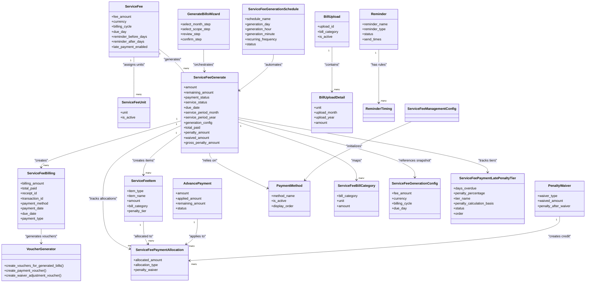

**Diagram sources**
- [backend/service_fee/models.py](file://backend/service_fee/models.py#L10-L474)
- [backend/service_fee_management/models.py](file://backend/service_fee_management/models.py#L11-L1636)
- [backend/service_fee_management/apps.py](file://backend/service_fee_management/apps.py#L66-L226)

## Detailed Component Analysis

### Automated Billing Generation
- Purpose: Create or regenerate monthly service fee records for active service fees and units with owners
- Inputs: Year, month, optional filters (unit IDs, tower, service fee IDs, bill category IDs), force regeneration flag
- Behavior:
  - Validates month/year
  - Queries eligible combinations of active service fees and units with owners
  - Calculates due date per service fee's due_day (with safe fallback for invalid days)
  - Aggregates base fee plus additional bill category charges from uploads
  - **Creates ServiceFeeItem records for detailed charge breakdown**
  - **Generates ServiceFeeGenerationConfig snapshots for historical tracking**
  - **Implements enhanced owner detection with prioritized account holder matching**
  - **Calculates penalty amounts using threshold-based tier system**
  - Bulk creates or updates payment records atomically
  - Syncs ServiceFeeBillCategory from BillUploadDetail
- Outputs: Creation/update counts, skipped records, and summary per batch

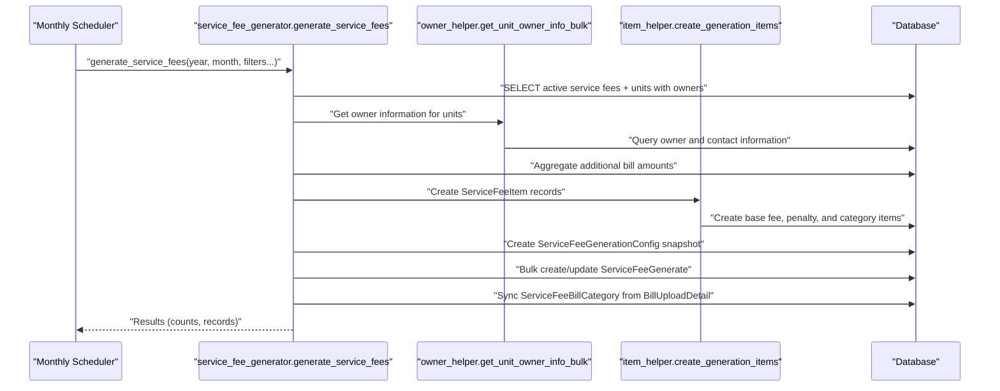

**Diagram sources**
- [backend/service_fee_management/scheduler.py](file://backend/service_fee_management/scheduler.py#L10-L78)
- [backend/service_fee_management/utils/service_fee_generator.py](file://backend/service_fee_management/utils/service_fee_generator.py#L1-L200)
- [backend/service_fee_management/utils/item_helper.py](file://backend/service_fee_management/utils/item_helper.py#L1-L172)
- [backend/service_fee_management/utils/owner_helper.py](file://backend/service_fee_management/utils/owner_helper.py#L1-L132)

**Section sources**
- [backend/service_fee_management/utils/service_fee_generator.py](file://backend/service_fee_management/utils/service_fee_generator.py#L1-L200)
- [backend/service_fee_management/utils/item_helper.py](file://backend/service_fee_management/utils/item_helper.py#L1-L172)
- [backend/service_fee_management/scheduler.py](file://backend/service_fee_management/scheduler.py#L10-L78)
- [backend/service_fee_management/utils/owner_helper.py](file://backend/service_fee_management/utils/owner_helper.py#L1-L132)

### Service Fee Calculation and Due Dates
- Base fee: drawn from ServiceFee.fee_amount and currency
- Additional charges: derived from BillUploadDetail per unit and category
- **ServiceFeeItem breakdown**: Detailed charge items (base fee, penalty, bill categories)
- Final amount: rounded base + aggregated additional charges
- Due date: computed from ServiceFee.due_day; safe fallback to last day of month if invalid
- Frequency and billing cycle: configured on ServiceFee for scheduling and reporting
- **Enhanced penalty calculation**: Uses threshold-based tiers with automatic updates

**Section sources**
- [backend/service_fee_management/utils/service_fee_generator.py](file://backend/service_fee_management/utils/service_fee_generator.py#L106-L200)
- [backend/service_fee/models.py](file://backend/service_fee/models.py#L40-L51)
- [backend/service_fee_management/utils/item_helper.py](file://backend/service_fee_management/utils/item_helper.py#L9-L172)

### Payment Collection Workflows
- Payment record lifecycle:
  - Pending → Completed (manual completion or gateway)
  - **Hierarchical allocation**: Penalty → Base Fee → Bill Categories → Advance Adjustments
  - Service status computed from total paid vs fee amount
  - Remaining amount tracked per payment
  - **Enhanced tracking fields**: total_paid, penalty_amount, waived_amount, gross_penalty_amount
- **Advanced allocation types**:
  - Debit: Cash payments received
  - Credit: Penalty waivers (reducing liability)
  - Advance: Advance payment applications
- Receipts and emails:
  - Optional email receipt generation with calculated "owed before payment" and "paid in this transaction"
  - Payment method and reference number captured in billing records
- Partial payments:
  - Multiple payments per month supported; service status reflects partial/paid
  - Remaining amount updated accordingly
  - **Payment tracking fields enable comprehensive financial reporting**
- **Accounting integration**:
  - Voucher generation for all payment types
  - Separate vouchers for cash receipts, advance payments, and adjustments

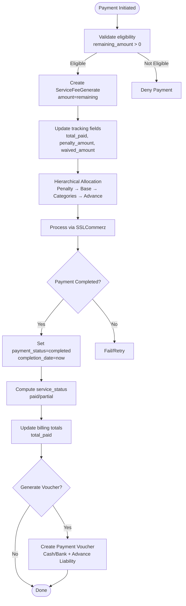

**Diagram sources**
- [backend/service_fee_management/views.py](file://backend/service_fee_management/views.py#L151-L198)
- [backend/service_fee_management/utils/sslcommerz_utils.py](file://backend/service_fee_management/utils/sslcommerz_utils.py#L52-L163)
- [backend/service_fee_management/models.py](file://backend/service_fee_management/models.py#L228-L480)
- [backend/service_fee_management/utils/voucher_generator.py](file://backend/service_fee_management/utils/voucher_generator.py#L429-L643)

**Section sources**
- [backend/service_fee_management/views.py](file://backend/service_fee_management/views.py#L151-L198)
- [backend/service_fee_management/models.py](file://backend/service_fee_management/models.py#L228-L480)
- [backend/service_fee_management/utils/voucher_generator.py](file://backend/service_fee_management/utils/voucher_generator.py#L429-L643)

### Payment Processing Integration with SSLCommerz
- Initialization:
  - Builds request payload with transaction ID, customer info, product details
  - Calls session API, returns gateway URL and session key
- Validation:
  - Validates payment using val_id, verifies transaction ID and amount
- Hash verification:
  - Verifies IPN callback signature using MD5 hash of store password + verify key
- Transaction mapping:
  - Temporary mapping for sandbox environments to resolve payment IDs post-IPN

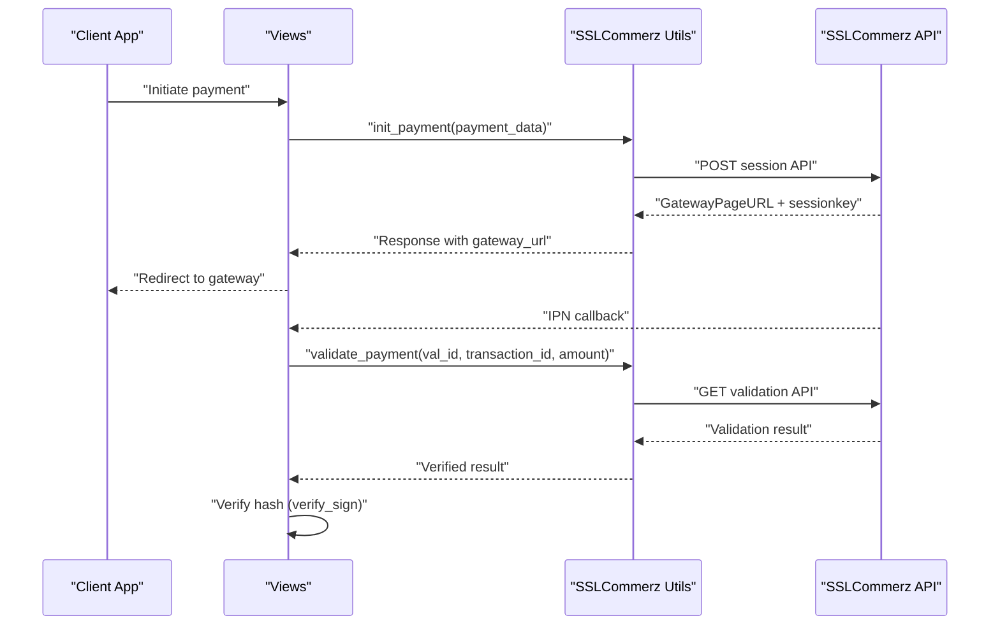

**Diagram sources**
- [backend/service_fee_management/utils/sslcommerz_utils.py](file://backend/service_fee_management/utils/sslcommerz_utils.py#L52-L300)
- [backend/service_fee_management/models.py](file://backend/service_fee_management/models.py#L1022-L1084)

**Section sources**
- [backend/service_fee_management/utils/sslcommerz_utils.py](file://backend/service_fee_management/utils/sslcommerz_utils.py#L20-L336)
- [backend/service_fee_management/models.py](file://backend/service_fee_management/models.py#L1022-L1084)

### Reminder System for Automated Notifications
- Reminder configuration:
  - Name/type/status, send times, channels (email/SMS/App)
  - Audience targeting: All Towers, Specific Tower, Specific Units, Specific Resident, or status-based filters
  - Timing rules: before/after/on due date with offsets
- Scheduler:
  - Runs continuously, checks current minute windows
  - Prefetches reminders and timing rules, deduplicates sends per unit/time
  - Logs delivery attempts and statuses
- Templates:
  - Uses message preview with placeholders for unit, tower, amount, due date, and service period

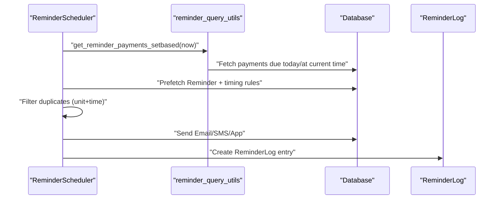

**Diagram sources**
- [backend/service_fee_management/reminder_scheduler.py](file://backend/service_fee_management/reminder_scheduler.py#L33-L473)

**Section sources**
- [backend/service_fee_management/reminder_scheduler.py](file://backend/service_fee_management/reminder_scheduler.py#L33-L473)
- [backend/service_fee_management/models.py](file://backend/service_fee_management/models.py#L482-L804)

### Bill Categories Management
- BillUpload: Batch-level container for category-specific bills (manual or CSV)
- BillUploadDetail: Per-unit consumption and amount with auto-calculated fields
- ServiceFeeBillCategory: Normalized mapping of bill categories to payment records
- Generation sync:
  - During billing generation, ServiceFeeBillCategory is populated from BillUploadDetail
  - Supports specifying category IDs to include/exclude subsets

**Section sources**
- [backend/service_fee_management/models.py](file://backend/service_fee_management/models.py#L1088-L1230)
- [backend/service_fee_management/utils/service_fee_generator.py](file://backend/service_fee_management/utils/service_fee_generator.py#L106-L200)

### Service Fee Settings Configuration
- Fee amount, currency, frequency, billing cycle, due day
- Accepted payment methods: cash, MFS, bank
- Reminder configuration: days before/after due date
- Late penalties: configurable tiers by days overdue and percentages
- Validation:
  - Prevents duplicate unit assignments across active service fees
  - MFS/Bank validations enforce regional standards

**Section sources**
- [backend/service_fee/models.py](file://backend/service_fee/models.py#L10-L474)
- [backend/service_fee/models.py](file://backend/service_fee/models.py#L182-L310)
- [backend/service_fee/models.py](file://backend/service_fee/models.py#L312-L371)

### Billing Management Workflows, Partial Payments, and Payment History
- Billing normalization:
  - ServiceFeeBilling stores billing identifiers, amounts, payment method, dates, and references
  - ServiceFeeGenerate aggregates monthly payments; billing records link to it
  - **Payment type distinction**: Regular bill payments vs advance payments
  - **Enhanced tracking fields**: Comprehensive payment and penalty tracking
- Partial payments:
  - Multiple transactions per month; remaining amount and service status reflect cumulative payments
  - **Hierarchical allocation ensures proper priority ordering**
- Payment history:
  - ServiceFeeGenerate tracks status, result status, and timestamps
  - Billing records capture payment method, reference number, notes, and received-by fields
  - **Allocation tracking provides detailed payment breakdown**
  - **Penalty tracking fields enable detailed financial reporting**

**Section sources**
- [backend/service_fee_management/models.py](file://backend/service_fee_management/models.py#L12-L150)
- [backend/service_fee_management/models.py](file://backend/service_fee_management/models.py#L228-L480)
- [backend/service_fee_management/views.py](file://backend/service_fee_management/views.py#L151-L198)

## Enhanced Penalty Management System

**Updated** The system now features a sophisticated penalty management system with threshold-based calculations, historical snapshots, and automatic updates.

### Threshold-Based Penalty Calculation
The penalty system operates on a tiered threshold model where penalties increase based on days overdue:

- **Tier Activation Logic**: The system sorts penalty tiers in descending order of days overdue and activates the first tier where `days_overdue >= tier.days_overdue`
- **Example**: With tiers [1, 5] and 2 days overdue, tier 1 activates (2 ≥ 1)
- **Fallback Mechanism**: If no tier matches, the system uses the lowest tier as fallback
- **Historical Accuracy**: Penalty tiers are snapshotted at generation time to ensure historical consistency

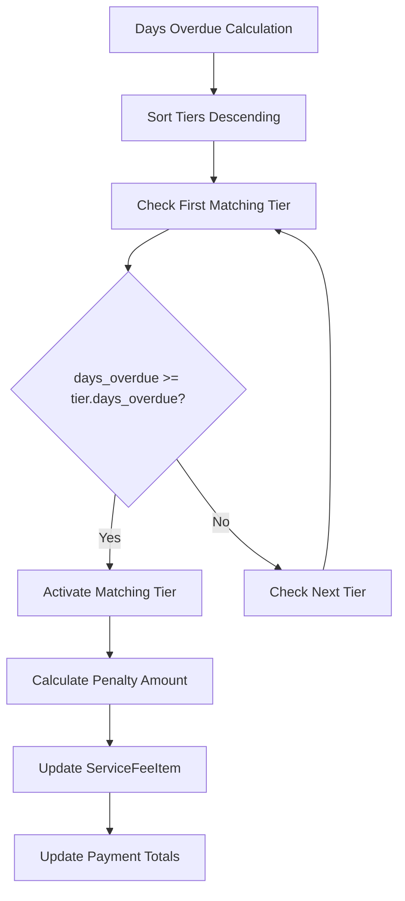

**Diagram sources**
- [backend/service_fee_management/management/commands/update_penalty_tiers.py](file://backend/service_fee_management/management/commands/update_penalty_tiers.py#L94-L120)

### Penalty Tier Management
- **ServiceFeePaymentLatePenaltyTier**: Tracks penalty tiers per payment with status and historical accuracy
- **Status Tracking**: Only one tier can be active per payment (active/inactive)
- **Historical Snapshots**: Tiers are copied from global LatePenaltyTier at generation time
- **Automatic Updates**: Daily scheduler updates penalties based on current days overdue

### Penalty Tracking Fields
The system maintains comprehensive penalty tracking through dedicated fields:
- `gross_penalty_amount`: Total penalty before waivers
- `penalty_amount`: Current penalty after waivers
- `waived_amount`: Total amount waived (penalties and fees)
- `total_paid`: Total amount paid towards the bill

**Section sources**
- [backend/service_fee_management/models.py](file://backend/service_fee_management/models.py#L1538-L1603)
- [backend/service_fee_management/management/commands/update_penalty_tiers.py](file://backend/service_fee_management/management/commands/update_penalty_tiers.py#L1-L477)
- [backend/service_fee_management/penalty_tier_scheduler.py](file://backend/service_fee_management/penalty_tier_scheduler.py#L1-L89)

## Improved Account Holder Detection

**Updated** The system now implements sophisticated account holder detection with prioritized matching logic for optimal billing accuracy.

### Enhanced Owner Detection Logic
The system uses a multi-layered approach to determine the primary account holder:

1. **Primary Owner Priority**: Owner with highest ownership percentage (or most recent if tied)
2. **Resident Fallback**: Active resident when no owner exists
3. **Contact Information**: Uses unit's primary contact fields (name, email, phone)
4. **Member Integration**: Links to Member records for comprehensive contact data

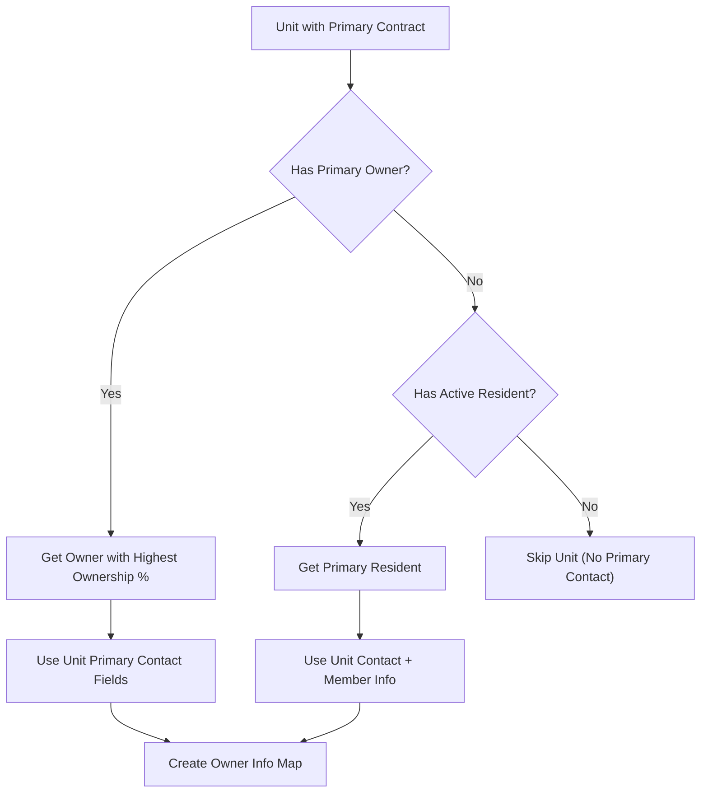

**Diagram sources**
- [backend/service_fee_management/utils/owner_helper.py](file://backend/service_fee_management/utils/owner_helper.py#L9-L58)

### Contact Information Strategy
The system prioritizes contact information from multiple sources:
- **Unit Primary Contact**: Name, email, phone from unit record
- **Member Record**: Full name, general email, general contact from associated Member
- **Fallback Logic**: Graceful degradation when information is missing

### Bulk Owner Processing
- **Efficient Queries**: Single query to fetch all owners for multiple units
- **Subquery Optimization**: Uses subqueries to find primary owners efficiently
- **Memory Optimization**: Processes owners in batches to handle large datasets

**Section sources**
- [backend/service_fee_management/utils/owner_helper.py](file://backend/service_fee_management/utils/owner_helper.py#L1-L132)
- [backend/service_fee_management/utils/service_fee_generator.py](file://backend/service_fee_management/utils/service_fee_generator.py#L428-L431)

## Threshold-Based Penalty Calculation

**Updated** The system implements sophisticated threshold-based penalty calculations with automatic tier updates and historical accuracy.

### Penalty Calculation Algorithm
The penalty calculation follows a strict threshold-based approach:

1. **Days Overdue Calculation**: Exact difference from due date (no +1 adjustment)
2. **Tier Matching**: Sort tiers descending by days overdue, select first match
3. **Fallback Handling**: Use lowest tier if no match found
4. **Amount Calculation**: `base_amount × penalty_percentage ÷ 100`
5. **Rounding**: Results are rounded to nearest integer

### Tier Activation Process
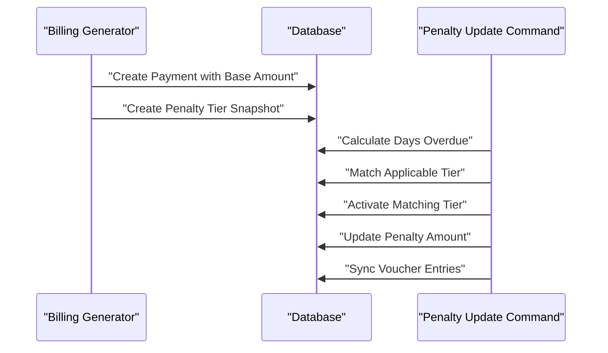

**Diagram sources**
- [backend/service_fee_management/utils/service_fee_generator.py](file://backend/service_fee_management/utils/service_fee_generator.py#L147-L176)
- [backend/service_fee_management/management/commands/update_penalty_tiers.py](file://backend/service_fee_management/management/commands/update_penalty_tiers.py#L66-L120)

### Penalty Tier Management
- **Snapshot Creation**: Copies global penalty tiers to payment-specific records
- **Status Tracking**: Maintains active/inactive status for each tier
- **Historical Integrity**: Prevents changes to historical penalty calculations
- **Automatic Updates**: Daily scheduler adjusts penalties based on current overdue status

**Section sources**
- [backend/service_fee_management/utils/service_fee_generator.py](file://backend/service_fee_management/utils/service_fee_generator.py#L147-L176)
- [backend/service_fee_management/management/commands/update_penalty_tiers.py](file://backend/service_fee_management/management/commands/update_penalty_tiers.py#L66-L120)
- [backend/service_fee_management/models.py](file://backend/service_fee_management/models.py#L1538-L1603)

## Automatic Penalty Tier Updates

**Updated** The system includes a comprehensive penalty tier update mechanism with daily automated processing and detailed audit trails.

### Daily Penalty Tier Scheduler
The system runs a background scheduler that processes penalty tier updates daily:

- **Execution Time**: Midnight (00:00) daily
- **Processing Scope**: All unpaid/partial payments with late penalty enabled
- **Individual Processing**: Each payment processed independently with error isolation
- **Atomic Transactions**: Each payment update wrapped in atomic blocks

### Penalty Update Process
1. **Payment Selection**: Filter unpaid/partial payments with late penalty enabled
2. **Days Overdue Calculation**: Compute exact days from due date
3. **Tier Matching**: Apply threshold-based matching algorithm
4. **Amount Recalculation**: Update penalty amounts based on new tier
5. **Voucher Synchronization**: Update accounting entries if needed
6. **Audit Trail Creation**: Log all changes for compliance

### Error Handling and Monitoring
- **Individual Failure Isolation**: One payment failure doesn't affect others
- **Comprehensive Logging**: Detailed logs for all processing steps
- **Failure Statistics**: Track processed, updated, created, and failed payments
- **Audit Trail Integration**: Full audit trail for all penalty changes

**Section sources**
- [backend/service_fee_management/penalty_tier_scheduler.py](file://backend/service_fee_management/penalty_tier_scheduler.py#L1-L89)
- [backend/service_fee_management/management/commands/update_penalty_tiers.py](file://backend/service_fee_management/management/commands/update_penalty_tiers.py#L1-L477)

## Billing Generation Wizard

**Updated** The system now features a comprehensive multi-step billing generation wizard that guides administrators through the billing creation process with intuitive step-by-step interface.

### Wizard Architecture
The billing generation wizard provides a guided workflow with four distinct steps:

1. **Select Month**: Choose the billing period (current and past months available)
2. **Select Scope**: Choose towers, units, and bill categories for generation
3. **Review**: Preview the generation details and affected units
4. **Confirm**: Execute generation with skip handling for existing records

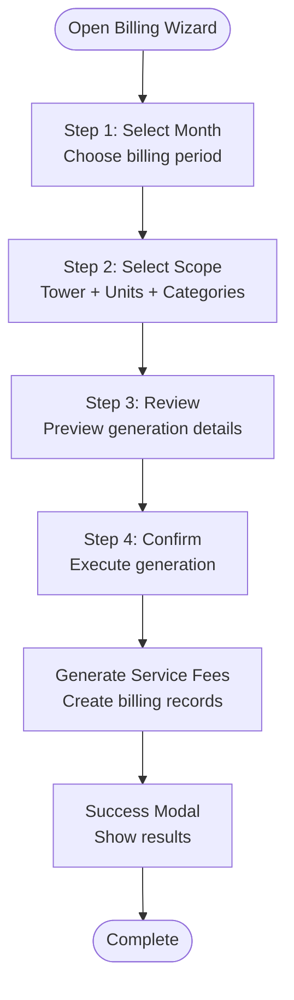

**Diagram sources**
- [frontend/src/Features/ServiceFeeManagement/BillingManagement/components/GenerateBillsWizard.jsx](file://frontend/src/Features/ServiceFeeManagement/BillingManagement/components/GenerateBillsWizard.jsx#L20-L386)

### Wizard Features
- **Intuitive Navigation**: Progress bar with step indicators and back/continue buttons
- **Dynamic Loading**: Real-time loading states for towers, units, and categories
- **Smart Filtering**: Automatic filtering based on month selection and scope
- **Batch Processing**: Support for multiple service fees, towers, and categories
- **Skip Handling**: Intelligent detection and reporting of existing records
- **Confirmation Flow**: Two-step confirmation to prevent accidental generation

### API Integration
The wizard communicates with backend endpoints:
- `/api/service-fee-management/service-fee-unit-counts/` - Get tower/unit counts
- `/api/service-fee-management/generate-service-fee/` - Execute billing generation
- Real-time validation and error handling

**Section sources**
- [frontend/src/Features/ServiceFeeManagement/BillingManagement/components/GenerateBillsWizard.jsx](file://frontend/src/Features/ServiceFeeManagement/BillingManagement/components/GenerateBillsWizard.jsx#L1-L386)
- [backend/service_fee_management/views.py](file://backend/service_fee_management/views.py#L7561-L7750)

## Service Fee Generation Schedules

**Updated** The system now includes a comprehensive schedule configuration system that allows administrators to set up automated billing generation with flexible scheduling options.

### Schedule Configuration Interface
The schedule management system provides:
- **Multi-frequency support**: Daily, weekly, and monthly recurring schedules
- **Flexible targeting**: Tower, service fee, and unit-level filtering
- **Visual grouping**: Related schedules grouped by base name with frequency aggregation
- **Status management**: Active/inactive schedule control
- **Execution tracking**: Last execution time and results logging

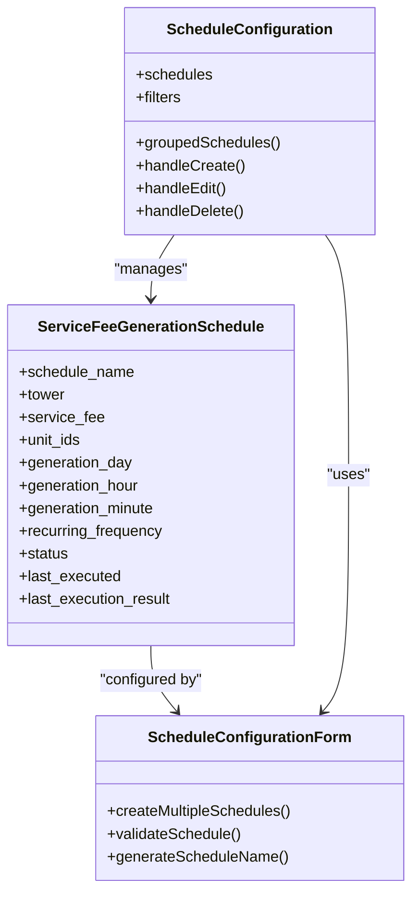

**Diagram sources**
- [backend/service_fee_management/models.py](file://backend/service_fee_management/models.py#L1-L200)
- [frontend/src/Features/ServiceFeeManagement/ScheduleConfiguration/ScheduleConfiguration.jsx](file://frontend/src/Features/ServiceFeeManagement/ScheduleConfiguration/ScheduleConfiguration.jsx#L1-L397)

### Scheduling Capabilities
- **Recurring frequencies**: Daily, weekly, and monthly scheduling options
- **Flexible timing**: Customizable day, hour, and minute for generation
- **Targeted filtering**: Apply schedules to specific towers, service fees, or units
- **Status control**: Enable/disable schedules as needed
- **Execution monitoring**: Track last execution and results
- **Bulk operations**: Create multiple schedules for complex configurations

**Section sources**
- [frontend/src/Features/ServiceFeeManagement/ScheduleConfiguration/ScheduleConfiguration.jsx](file://frontend/src/Features/ServiceFeeManagement/ScheduleConfiguration/ScheduleConfiguration.jsx#L1-L397)
- [backend/service_fee_management/admin.py](file://backend/service_fee_management/admin.py#L165-L196)

## Administrative Capabilities

**Updated** The system now provides comprehensive administrative capabilities with granular permission controls and guided workflows for service fee management operations.

### Permission-Based Access Control
The system implements role-based permissions for administrative functions:
- **Service Fee Settings**: View, add, edit, and manage service fee configurations
- **Service Fee Overview**: View comprehensive billing and payment statistics
- **Unit Payment History**: Access individual unit payment histories
- **Schedule Configuration**: Manage automated billing generation schedules
- **Reminders Management**: Configure and manage payment reminder systems
- **Payment Recording**: Record manual payments and adjustments
- **Service Fee Generation**: Execute billing generation workflows
- **Generated Fee Management**: Delete or modify generated billing records
- **Payment Deletion**: Remove recorded payment transactions
- **Penalty Management**: Configure and manage penalty tier settings

### Administrative Interfaces
- **Guided Wizards**: Step-by-step workflows for complex operations
- **Schedule Management**: Visual interface for configuring automated processes
- **Permission Management**: Role-based access control with granular permissions
- **Audit Trails**: Comprehensive logging of administrative actions
- **Reporting**: Financial and operational reporting capabilities

**Section sources**
- [backend/service_fee_management/views.py](file://backend/service_fee_management/views.py#L140-L157)
- [backend/service_fee_management/admin.py](file://backend/service_fee_management/admin.py#L165-L196)

## Enhanced Payment Processing

**Updated** The system now features an advanced payment processing system with hierarchical allocation, multi-type payment handling, and comprehensive audit capabilities.

### Hierarchical Payment Allocation
The payment system implements a strict priority order for payment allocation:

1. **Penalty/Late Fee** (Highest Priority) - Must be cleared first
2. **Base Service Fee** - Core charge  
3. **Bill Categories** (Utilities, etc.) - Paid last
4. **Advance Adjustments** - Applied to reduce future obligations

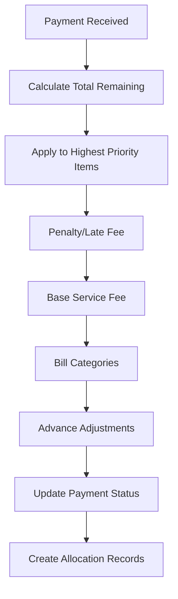

**Diagram sources**
- [backend/service_fee_management/utils/payment_processor.py](file://backend/service_fee_management/utils/payment_processor.py#L174-L210)
- [backend/service_fee_management/views.py](file://backend/service_fee_management/views.py#L2255-L2346)

### Advanced Payment Allocation Types

#### Debit Allocations (Cash Payments)
- **Purpose**: Track actual cash received payments
- **Priority**: Highest priority in allocation hierarchy
- **Accounting**: Reduces Accounts Receivable
- **Usage**: Standard payment processing

#### Credit Allocations (Penalty Waivers)
- **Purpose**: Track penalty reductions through waivers
- **Priority**: Higher than cash payments for penalty clearing
- **Accounting**: Reduces Late Fee Income (reversal)
- **Usage**: Penalty waiver applications

#### Advance Allocations
- **Purpose**: Track advance payment applications
- **Priority**: Applied after penalty clearing
- **Accounting**: Reduces Advance Liability
- **Usage**: Advance payment utilization

**Section sources**
- [backend/service_fee_management/models.py](file://backend/service_fee_management/models.py#L1343-L1427)
- [backend/service_fee_management/utils/payment_processor.py](file://backend/service_fee_management/utils/payment_processor.py#L16-L268)
- [backend/service_fee_management/views.py](file://backend/service_fee_management/views.py#L2255-L2346)

## Accounting Integration

**Updated** The system now provides comprehensive accounting integration with voucher generation for all payment types, ensuring full financial transparency and compliance.

### Voucher Generation System
- **Generated Bill Vouchers**: Double-entry vouchers for bill creation
- **Payment Vouchers**: Receipt vouchers for cash payments
- **Advance Vouchers**: Specialized vouchers for advance payments
- **Adjustment Vouchers**: Waiver and advance usage adjustments

### Accounting Accounts
- **Service Fee Revenue**: Base service fee income
- **Accounts Receivable**: Bill receivables
- **Late Fee Income**: Penalty income
- **Advance Liability**: Customer advance payments
- **Payment Methods**: Cash, Bank, Mobile Banking accounts

### Integration Benefits
- **Real-time accounting**: Vouchers created during payment processing
- **Audit compliance**: Complete transaction trail
- **Financial reporting**: Accurate financial statements
- **Integration ready**: Compatible with external accounting systems

**Section sources**
- [backend/service_fee_management/utils/voucher_generator.py](file://backend/service_fee_management/utils/voucher_generator.py#L1-L786)
- [backend/service_fee_management/models.py](file://backend/service_fee_management/models.py#L1231-L1341)

## Audit Trail and Compliance

**Updated** The system provides comprehensive audit trail functionality with detailed logging of all administrative and financial operations.

### Audit Trail Features
- **Transaction logging**: Complete audit trail for all payment and billing operations
- **Administrative actions**: Detailed logging of administrative changes and configurations
- **Financial compliance**: Full traceability for accounting and regulatory requirements
- **User accountability**: User-specific logging for all system actions
- **Data integrity**: Immutable audit records for dispute resolution

### Audit Categories
- **Payment operations**: Creation, modification, and deletion of payment records
- **Billing operations**: Generation, regeneration, and modification of billing records
- **Administrative changes**: Configuration updates and permission modifications
- **System events**: Application startup, shutdown, and error conditions
- **Financial transactions**: All monetary transactions with full audit trail
- **Penalty updates**: Automatic and manual penalty tier changes

**Section sources**
- [backend/service_fee_management/views.py](file://backend/service_fee_management/views.py#L1150-L1191)

## Frontend Enhancement

**Updated** The frontend has been enhanced with modern UI/UX patterns, guided workflows, and comprehensive administrative interfaces.

### Modern UI Components
- **Responsive Design**: Mobile-first approach with adaptive layouts
- **Progressive Disclosure**: Step-by-step workflows with clear navigation
- **Real-time Feedback**: Instant validation and error messaging
- **Visual Indicators**: Progress bars, status indicators, and success/error states
- **Accessibility**: WCAG compliant design with screen reader support

### Enhanced User Experience
- **Guided Workflows**: Multi-step wizards for complex administrative tasks
- **Intelligent Forms**: Dynamic form validation and conditional field display
- **Bulk Operations**: Efficient handling of multiple record operations
- **Search and Filter**: Advanced filtering capabilities for large datasets
- **Real-time Updates**: Live data refresh and status updates

### Administrative Dashboards
- **Overview Analytics**: Key metrics and performance indicators
- **Quick Actions**: One-click access to common administrative tasks
- **Recent Activity**: Timeline of recent system activities
- **Alerts and Notifications**: Proactive notification system for important events
- **Export Capabilities**: Data export in multiple formats for reporting

**Section sources**
- [frontend/src/Features/ServiceFeeManagement/BillingManagement/components/GenerateBillsWizard.jsx](file://frontend/src/Features/ServiceFeeManagement/BillingManagement/components/GenerateBillsWizard.jsx#L1-L386)
- [frontend/src/Features/ServiceFeeManagement/ScheduleConfiguration/ScheduleConfiguration.jsx](file://frontend/src/Features/ServiceFeeManagement/ScheduleConfiguration/ScheduleConfiguration.jsx#L1-L397)

## Performance Considerations
- Bulk operations:
  - Generation uses bulk_create and bulk_update with batch sizes to minimize overhead
  - **Allocation queries optimized with specialized indexes**
- Database joins and indexing:
  - Raw SQL queries with JOINs and indexes reduce Python-side loops
  - **New allocation and item indexes improve query performance**
- Atomic transactions:
  - Generation wrapped in atomic blocks to ensure consistency
  - **Allocation processing uses atomic transactions for data integrity**
- Connection pooling and retries:
  - SSLCommerz client uses HTTPAdapter with retry strategy and pooled connections
- Reminder deduplication:
  - Checks ReminderLog to avoid duplicate sends per unit/time
- **Enhanced Startup Performance**:
  - Deferred initialization prevents immediate DB access during app startup
  - Environment-based scheduler control reduces unnecessary background processes
  - Idempotent payment method population avoids redundant database operations
- **Allocation Performance**:
  - Hierarchical allocation reduces unnecessary payment processing
  - **Index optimization for allocation queries improves response times**
- **Frontend Performance**:
  - Lazy loading for wizard components and schedule management
  - Optimized data fetching with caching strategies
  - Virtual scrolling for large dataset displays
- **Penalty System Performance**:
  - Daily scheduler processes payments independently for fault tolerance
  - Efficient tier matching algorithm with minimal database queries
  - Bulk operations for penalty updates and voucher synchronization

## Troubleshooting Guide
- Duplicate unit assignment:
  - Validation logs warnings when units are assigned to multiple active service fees
- Payment eligibility:
  - Use eligibility validator to confirm remaining amount and prevent overpayments
- SSLCommerz validation failures:
  - Check transaction ID and amount mismatches; verify hash signature
- Reminder duplication:
  - Scheduler checks ReminderLog to avoid duplicate sends; inspect logs for duplicates
- Payment email issues:
  - Email sending is best-effort; failures are logged without blocking payment completion
- **Startup Issues**:
  - Check `SERVICE_FEE_SCHEDULER_ENABLED` environment variable if schedulers aren't starting
  - Verify database connectivity if payment methods aren't populating
  - Review application logs for initialization errors during startup
- **Background Process Issues**:
  - Monitor scheduler heartbeats and error logs for automatic generation problems
  - Check environment variable `RUN_MAIN` for proper process detection in development
- **Allocation Issues**:
  - **Verify allocation priorities are working correctly**
  - **Check ServiceFeePaymentAllocation records for proper tracking**
  - **Review advance application logs for troubleshooting**
- **Accounting Issues**:
  - **Verify voucher generation for all payment types**
  - **Check chart of accounts integration**
  - **Review audit trails for payment processing**
- **Wizard Issues**:
  - **Verify API connectivity for wizard components**
  - **Check permission levels for administrative access**
  - **Review browser console for JavaScript errors**
- **Penalty System Issues**:
  - **Verify penalty tier scheduler is running correctly**
  - **Check daily penalty update logs for errors**
  - **Review penalty calculation logic for threshold mismatches**
  - **Verify historical penalty snapshots are properly created**

**Section sources**
- [backend/service_fee/models.py](file://backend/service_fee/models.py#L86-L149)
- [backend/service_fee_management/views.py](file://backend/service_fee_management/views.py#L151-L198)
- [backend/service_fee_management/utils/sslcommerz_utils.py](file://backend/service_fee_management/utils/sslcommerz_utils.py#L164-L266)
- [backend/service_fee_management/reminder_scheduler.py](file://backend/service_fee_management/reminder_scheduler.py#L227-L258)
- [backend/service_fee_management/apps.py](file://backend/service_fee_management/apps.py#L108-L160)
- [backend/service_fee_management/utils/payment_processor.py](file://backend/service_fee_management/utils/payment_processor.py#L261-L268)
- [backend/service_fee_management/penalty_tier_scheduler.py](file://backend/service_fee_management/penalty_tier_scheduler.py#L35-L71)

## Conclusion
The Service Fee Management system provides a robust, automated pipeline for generating bills, collecting payments, and notifying residents. Its modular design—separated concerns across models, utilities, schedulers, and views—enables scalability, reliability, and maintainability. The integration with SSLCommerz and reminder engine ensures seamless payment processing and timely communication.

**Updated** The enhanced system now provides enterprise-grade service fee management with guided workflows, automated scheduling, comprehensive administrative controls, integrated financial management capabilities, and sophisticated penalty management with threshold-based calculations. The addition of the billing generation wizard, advanced schedule configuration, hierarchical payment processing, comprehensive audit trails, and intelligent penalty tier management makes this system suitable for complex residential and commercial property management environments.

## Appendices
- Frontend integration:
  - useServiceFees hook orchestrates service fee CRUD and dropdown options
  - Payments page renders the payments table and integrates with Redux slices
  - **Billing wizard provides guided multi-step interface for administrative tasks**
  - **Schedule configuration offers visual management of automated processes**
- **Enhanced Startup Configuration**:
  - Environment variable controls for scheduler management
  - Deferred initialization prevents runtime warnings
  - Idempotent payment method population ensures consistent state
- **Advanced Payment Features**:
  - Hierarchical allocation system with priority ordering
  - Multi-type allocation tracking (debit, credit, advance)
  - Comprehensive advance payment management
  - Detailed penalty tier management with automatic updates
  - Complete accounting integration with voucher generation
  - Enhanced penalty tracking fields for financial reporting
- **Administrative Enhancements**:
  - Guided workflows for complex operations
  - Permission-based access control
  - Comprehensive audit trail functionality
  - Schedule management with recurring frequencies
  - Real-time monitoring and reporting capabilities
  - Penalty tier management and automatic updates
- **Database Schema Enhancements**:
  - ServiceFeeGenerate replaces ServiceFeePayment with semantic clarity
  - ServiceFeeItem provides detailed charge breakdown
  - ServiceFeePaymentAllocation enables precise allocation tracking
  - ServiceFeeGenerationConfig maintains historical accuracy
  - ServiceFeeGenerationSchedule enables automated billing processes
  - ServiceFeePaymentLatePenaltyTier manages penalty tier snapshots
  - Enhanced tracking fields for comprehensive financial reporting
- **Penalty Management Enhancements**:
  - Threshold-based penalty calculation system
  - Automatic daily penalty tier updates
  - Historical penalty snapshot preservation
  - Sophisticated owner detection and contact matching
  - Comprehensive penalty tracking and reporting

**Section sources**
- [frontend/src/hooks/useServiceFees.js](file://frontend/src/hooks/useServiceFees.js#L1-L378)
- [frontend/src/pages/ServiceFeePaymentPage.jsx](file://frontend/src/pages/ServiceFeePaymentPage.jsx#L1-L8)
- [frontend/src/pages/BillingManagementPage.jsx](file://frontend/src/pages/BillingManagementPage.jsx#L1-L7)
- [frontend/src/Features/ServiceFeeManagement/BillingManagement/components/GenerateBillsWizard.jsx](file://frontend/src/Features/ServiceFeeManagement/BillingManagement/components/GenerateBillsWizard.jsx#L1-L386)
- [frontend/src/Features/ServiceFeeManagement/ScheduleConfiguration/ScheduleConfiguration.jsx](file://frontend/src/Features/ServiceFeeManagement/ScheduleConfiguration/ScheduleConfiguration.jsx#L1-L397)
- [backend/service_fee_management/apps.py](file://backend/service_fee_management/apps.py#L66-L226)
- [backend/service_fee_management/utils/email_utils.py](file://backend/service_fee_management/utils/email_utils.py#L1-L730)
- [backend/service_fee_management/models.py](file://backend/service_fee_management/models.py#L11-L1636)
- [backend/service_fee_management/utils/payment_processor.py](file://backend/service_fee_management/utils/payment_processor.py#L1-L268)
- [backend/service_fee_management/utils/advance_payment_applicator.py](file://backend/service_fee_management/utils/advance_payment_applicator.py#L1-L211)
- [backend/service_fee_management/utils/voucher_generator.py](file://backend/service_fee_management/utils/voucher_generator.py#L1-L786)
- [backend/service_fee_management/urls.py](file://backend/service_fee_management/urls.py#L1-L155)
- [backend/service_fee_management/management/commands/update_penalty_tiers.py](file://backend/service_fee_management/management/commands/update_penalty_tiers.py#L1-L477)
- [backend/service_fee_management/penalty_tier_scheduler.py](file://backend/service_fee_management/penalty_tier_scheduler.py#L1-L89)
- [backend/service_fee_management/utils/owner_helper.py](file://backend/service_fee_management/utils/owner_helper.py#L1-L132)