# Service Fee Settings & Configuration

<cite>
**Referenced Files in This Document**
- [models.py](file://backend/service_fee/models.py)
- [models.py](file://backend/service_fee_management/models.py)
- [scheduler.py](file://backend/service_fee_management/scheduler.py)
- [service_fee_generator.py](file://backend/service_fee_management/utils/service_fee_generator.py)
- [penalty_tier_scheduler.py](file://backend/service_fee_management/penalty_tier_scheduler.py)
- [update_penalty_tiers.py](file://backend/service_fee_management/management/commands/update_penalty_tiers.py)
- [CreateServiceFeeForm.jsx](file://frontend/src/Features/ServiceFeeSettings/ServiceFeeSettings/ServiceFeeCreateForm/CreateServiceFeeForm.jsx)
- [EditServiceFeeForm.jsx](file://frontend/src/Features/ServiceFeeSettings/ServiceFeeSettings/ServiceFeeEditForm/EditServiceFeeForm.jsx)
- [ServiceFeeSettingsList.jsx](file://frontend/src/Features/ServiceFeeSettings/ServiceFeeSettings/ServiceFeeList/ServiceFeeSettingsList.jsx)
- [ViewServiceFeeSettings.jsx](file://frontend/src/Features/ServiceFeeSettings/ServiceFeeSettings/PreviewServiceFeeSettings/ViewServiceFeeSettings.jsx)
- [ServiceFeeHistoryModal.jsx](file://frontend/src/Features/ServiceFeeSettings/ServiceFeeHistory/ServiceFeeHistoryModal.jsx)
- [ServiceFeeFormView.jsx](file://frontend/src/Features/ServiceFeeSettings/ServiceFeeSettings/ServiceFeeCreateForm/ServiceFeeFormView.jsx)
</cite>

## Update Summary
**Changes Made**
- Enhanced penalty tier management system with improved threshold-based calculation logic
- Added automated penalty tier scheduler with daily updates
- Implemented penalty tier snapshot system for historical accuracy
- Updated penalty calculation to use base amount only, not total amounts
- Added penalty tier validation and ordering requirements
- Enhanced penalty tier visualization and configuration in frontend

## Table of Contents
1. [Introduction](#introduction)
2. [Project Structure](#project-structure)
3. [Core Components](#core-components)
4. [Architecture Overview](#architecture-overview)
5. [Detailed Component Analysis](#detailed-component-analysis)
6. [Enhanced Penalty Tier Management](#enhanced-penalty-tier-management)
7. [Dependency Analysis](#dependency-analysis)
8. [Performance Considerations](#performance-considerations)
9. [Troubleshooting Guide](#troubleshooting-guide)
10. [Conclusion](#conclusion)

## Introduction
This document provides comprehensive guidance for managing service fee settings and configurations within the Estate Link platform. It covers the end-to-end lifecycle of service fee creation and editing, including fee amount configuration, due date settings, late penalty calculations, recurring billing scheduling, and history tracking. The system now features an enhanced penalty tier management system with threshold-based calculations, automated daily updates, and historical accuracy preservation through penalty tier snapshots.

## Project Structure
The service fee system spans both the backend Django application and the frontend React application:

- Backend (Django):
  - Core models define service fee settings, payment methods, late penalties, and history.
  - Management models handle billing records, payments, reminders, schedules, and penalty tier snapshots.
  - Scheduler utilities automate monthly fee generation, penalty tier updates, and reminder processing.
  - Management commands handle penalty tier calculations and updates.
- Frontend (React):
  - Forms for creating and editing service fee settings with enhanced penalty tier configuration.
  - Views for listing, previewing, and archiving service fee settings.
  - History modal for auditing changes and tracking modifications.

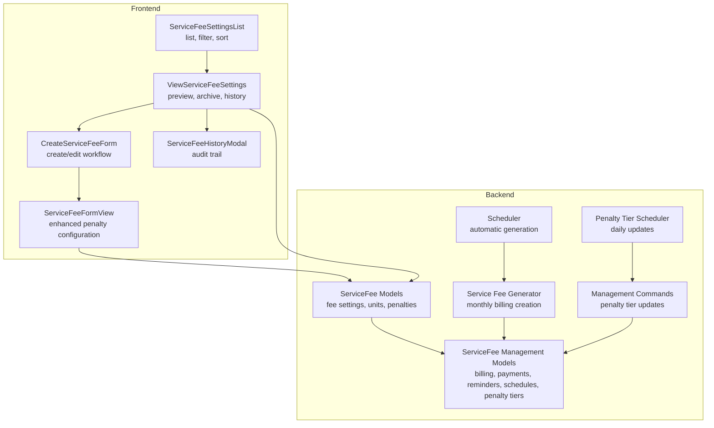

**Diagram sources**
- [models.py](file://backend/service_fee/models.py#L10-L179)
- [models.py](file://backend/service_fee_management/models.py#L11-L800)
- [models.py](file://backend/service_fee_management/models.py#L1537-L1604)
- [scheduler.py](file://backend/service_fee_management/scheduler.py#L10-L78)
- [penalty_tier_scheduler.py](file://backend/service_fee_management/penalty_tier_scheduler.py#L1-L89)
- [service_fee_generator.py](file://backend/service_fee_management/utils/service_fee_generator.py#L15-L800)
- [update_penalty_tiers.py](file://backend/service_fee_management/management/commands/update_penalty_tiers.py#L1-L477)
- [ServiceFeeSettingsList.jsx](file://frontend/src/Features/ServiceFeeSettings/ServiceFeeSettings/ServiceFeeList/ServiceFeeSettingsList.jsx#L24-L679)
- [CreateServiceFeeForm.jsx](file://frontend/src/Features/ServiceFeeSettings/ServiceFeeSettings/ServiceFeeCreateForm/CreateServiceFeeForm.jsx#L16-L903)
- [ViewServiceFeeSettings.jsx](file://frontend/src/Features/ServiceFeeSettings/ServiceFeeSettings/PreviewServiceFeeSettings/ViewServiceFeeSettings.jsx#L37-L493)
- [ServiceFeeHistoryModal.jsx](file://frontend/src/Features/ServiceFeeSettings/ServiceFeeHistory/ServiceFeeHistoryModal.jsx#L7-L406)
- [ServiceFeeFormView.jsx](file://frontend/src/Features/ServiceFeeSettings/ServiceFeeSettings/ServiceFeeCreateForm/ServiceFeeFormView.jsx#L2200-L2318)

**Section sources**
- [models.py](file://backend/service_fee/models.py#L10-L179)
- [models.py](file://backend/service_fee_management/models.py#L11-L800)
- [models.py](file://backend/service_fee_management/models.py#L1537-L1604)
- [scheduler.py](file://backend/service_fee_management/scheduler.py#L10-L78)
- [penalty_tier_scheduler.py](file://backend/service_fee_management/penalty_tier_scheduler.py#L1-L89)
- [service_fee_generator.py](file://backend/service_fee_management/utils/service_fee_generator.py#L15-L800)
- [update_penalty_tiers.py](file://backend/service_fee_management/management/commands/update_penalty_tiers.py#L1-L477)
- [ServiceFeeSettingsList.jsx](file://frontend/src/Features/ServiceFeeSettings/ServiceFeeSettings/ServiceFeeList/ServiceFeeSettingsList.jsx#L24-L679)
- [CreateServiceFeeForm.jsx](file://frontend/src/Features/ServiceFeeSettings/ServiceFeeSettings/ServiceFeeCreateForm/CreateServiceFeeForm.jsx#L16-L903)
- [ViewServiceFeeSettings.jsx](file://frontend/src/Features/ServiceFeeSettings/ServiceFeeSettings/PreviewServiceFeeSettings/ViewServiceFeeSettings.jsx#L37-L493)
- [ServiceFeeHistoryModal.jsx](file://frontend/src/Features/ServiceFeeSettings/ServiceFeeHistory/ServiceFeeHistoryModal.jsx#L7-L406)
- [ServiceFeeFormView.jsx](file://frontend/src/Features/ServiceFeeSettings/ServiceFeeSettings/ServiceFeeCreateForm/ServiceFeeFormView.jsx#L2200-L2318)

## Core Components
This section outlines the primary building blocks of the service fee configuration system.

- ServiceFee model
  - Stores fee configuration: amount, currency, frequency, billing cycle, due day, acceptance of payment methods (cash, MFS, bank), and late payment settings.
  - Manages unit assignments via a soft-delete through ServiceFeeUnit.
  - Enforces uniqueness constraints to prevent overlapping unit assignments across active service fees.
- LatePenaltyTier model
  - Defines penalty tiers based on days overdue with percentage thresholds.
  - **Updated**: Enhanced validation with strict bounds (1-31 days overdue, 1.01-100% penalty).
  - **Updated**: Added order field for tier prioritization and unique constraints.
- ServiceFeePaymentLatePenaltyTier model
  - **New**: Snapshot model that captures penalty tier configuration at generation time.
  - Preserves historical accuracy by locking in penalty tiers for past payments.
  - Tracks active/inactive status per payment for proper penalty application.
- ServiceFeeHistory model
  - Tracks all changes to service fee settings with field-level diffs, actor, IP, and timestamps.
- ServiceFeeBilling and ServiceFeePayment models
  - Separate billing records from payment transactions for normalization and reporting.
  - Support partial payments, multiple payment methods, and detailed tracking.
  - **Updated**: Enhanced penalty tracking with gross penalty amount, net penalty after waivers, and penalty tier snapshots.
- Reminder and ReminderTiming models
  - Configure automated reminders with flexible timing rules (before/after/on due date, specific day).
  - Support targeting by audience (all, due, overdue, paid, specific units/residents).
- ServiceFeeGenerationSchedule model
  - Configures automatic monthly generation with tower/unit filters and recurrence settings.
- PenaltyWaiver model
  - **New**: Manages penalty waivers with different types (full, partial percentage, partial fixed).
  - Tracks waiver history with accounting integration.

**Section sources**
- [models.py](file://backend/service_fee/models.py#L10-L179)
- [models.py](file://backend/service_fee/models.py#L316-L375)
- [models.py](file://backend/service_fee_management/models.py#L1537-L1604)
- [models.py](file://backend/service_fee_management/models.py#L152-L203)
- [models.py](file://backend/service_fee_management/models.py#L11-L122)
- [models.py](file://backend/service_fee_management/models.py#L190-L341)
- [models.py](file://backend/service_fee_management/models.py#L342-L540)
- [models.py](file://backend/service_fee_management/models.py#L711-L800)

## Architecture Overview
The system follows a layered architecture with enhanced penalty management capabilities:
- Frontend React components handle user interactions for creating, editing, viewing, and archiving service fee settings with enhanced penalty tier configuration.
- Backend Django REST APIs expose CRUD operations for service fee settings, payment methods, penalty tiers, and history.
- Background scheduler and generator orchestrate recurring billing creation, penalty tier updates, and reminder processing.
- Management commands handle penalty tier calculations and updates with historical accuracy preservation.
- Database models enforce data integrity, normalization, auditability, and penalty tier snapshots.

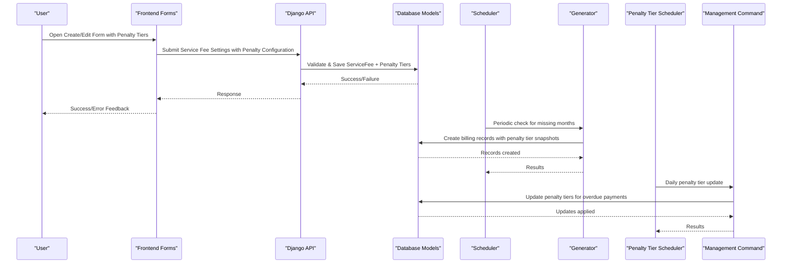

**Diagram sources**
- [CreateServiceFeeForm.jsx](file://frontend/src/Features/ServiceFeeSettings/ServiceFeeSettings/ServiceFeeCreateForm/CreateServiceFeeForm.jsx#L202-L379)
- [EditServiceFeeForm.jsx](file://frontend/src/Features/ServiceFeeSettings/ServiceFeeSettings/ServiceFeeEditForm/EditServiceFeeForm.jsx#L556-L638)
- [scheduler.py](file://backend/service_fee_management/scheduler.py#L10-L78)
- [service_fee_generator.py](file://backend/service_fee_management/utils/service_fee_generator.py#L15-L800)
- [penalty_tier_scheduler.py](file://backend/service_fee_management/penalty_tier_scheduler.py#L1-L89)
- [update_penalty_tiers.py](file://backend/service_fee_management/management/commands/update_penalty_tiers.py#L1-L477)
- [models.py](file://backend/service_fee/models.py#L10-L179)
- [models.py](file://backend/service_fee_management/models.py#L11-L122)

## Detailed Component Analysis

### Service Fee Creation Workflow
The frontend form collects fee configuration, validates required fields, and submits to the backend. The backend enforces validation and persists the settings along with penalty tier configurations.

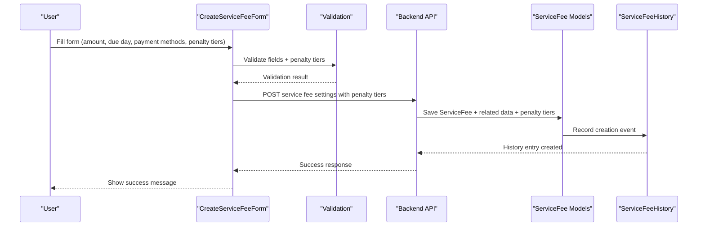

**Diagram sources**
- [CreateServiceFeeForm.jsx](file://frontend/src/Features/ServiceFeeSettings/ServiceFeeSettings/ServiceFeeCreateForm/CreateServiceFeeForm.jsx#L202-L379)
- [models.py](file://backend/service_fee/models.py#L10-L179)
- [models.py](file://backend/service_fee/models.py#L373-L470)

**Section sources**
- [CreateServiceFeeForm.jsx](file://frontend/src/Features/ServiceFeeSettings/ServiceFeeSettings/ServiceFeeCreateForm/CreateServiceFeeForm.jsx#L202-L379)
- [models.py](file://backend/service_fee/models.py#L10-L179)
- [models.py](file://backend/service_fee/models.py#L373-L470)

### Service Fee Editing Workflow
The edit form loads existing settings, allows selective changes, and submits updates. The system prevents duplicate unit assignments and handles validation errors gracefully, including penalty tier updates.

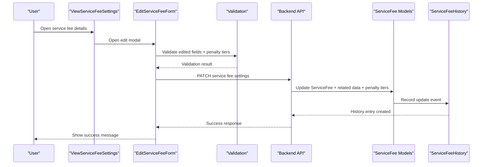

**Diagram sources**
- [ViewServiceFeeSettings.jsx](file://frontend/src/Features/ServiceFeeSettings/ServiceFeeSettings/PreviewServiceFeeSettings/ViewServiceFeeSettings.jsx#L96-L107)
- [EditServiceFeeForm.jsx](file://frontend/src/Features/ServiceFeeSettings/ServiceFeeSettings/ServiceFeeEditForm/EditServiceFeeForm.jsx#L556-L638)
- [models.py](file://backend/service_fee/models.py#L373-L470)

**Section sources**
- [ViewServiceFeeSettings.jsx](file://frontend/src/Features/ServiceFeeSettings/ServiceFeeSettings/PreviewServiceFeeSettings/ViewServiceFeeSettings.jsx#L96-L107)
- [EditServiceFeeForm.jsx](file://frontend/src/Features/ServiceFeeSettings/ServiceFeeSettings/ServiceFeeEditForm/EditServiceFeeForm.jsx#L556-L638)
- [models.py](file://backend/service_fee/models.py#L373-L470)

### Recurring Billing Scheduling and Generation
Automatic monthly generation ensures that billing records are created for active service fees and eligible units. The scheduler runs periodically and delegates to the generator utility, which now includes penalty tier snapshot creation.

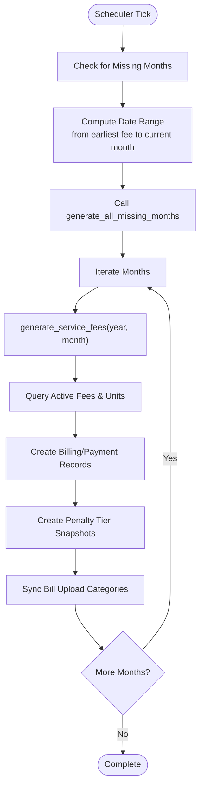

**Diagram sources**
- [scheduler.py](file://backend/service_fee_management/scheduler.py#L10-L78)
- [service_fee_generator.py](file://backend/service_fee_management/utils/service_fee_generator.py#L710-L800)
- [service_fee_generator.py](file://backend/service_fee_management/utils/service_fee_generator.py#L15-L200)

**Section sources**
- [scheduler.py](file://backend/service_fee_management/scheduler.py#L10-L78)
- [service_fee_generator.py](file://backend/service_fee_management/utils/service_fee_generator.py#L710-L800)
- [service_fee_generator.py](file://backend/service_fee_management/utils/service_fee_generator.py#L15-L200)

### Schedule Configuration Interface
The schedule configuration allows defining automatic generation rules with:
- Tower/unit filters
- Frequency (daily, weekly, monthly)
- Specific generation day/time
- Status (active/inactive)
- Execution tracking

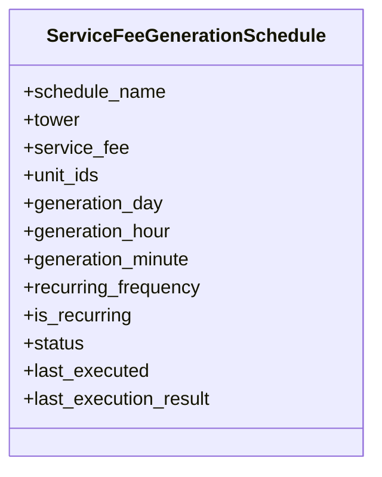

**Diagram sources**
- [models.py](file://backend/service_fee_management/models.py#L711-L800)

**Section sources**
- [models.py](file://backend/service_fee_management/models.py#L711-L800)

### Reminder System Configuration
Reminders support flexible timing rules and audience targeting:
- Timing rules: before due, after due, on due date, specific day
- Audience: all, due, overdue, paid, specific units/residents
- Channels: app notification, SMS, email

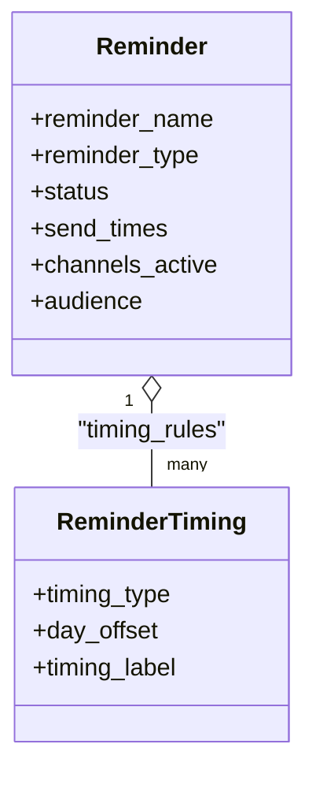

**Diagram sources**
- [models.py](file://backend/service_fee_management/models.py#L342-L540)

**Section sources**
- [models.py](file://backend/service_fee_management/models.py#L342-L540)

### History Tracking and Cancellation
History captures all changes with field-level diffs, actor, IP, and timestamps. Cancellation moves a service fee to the archived state and records the event.

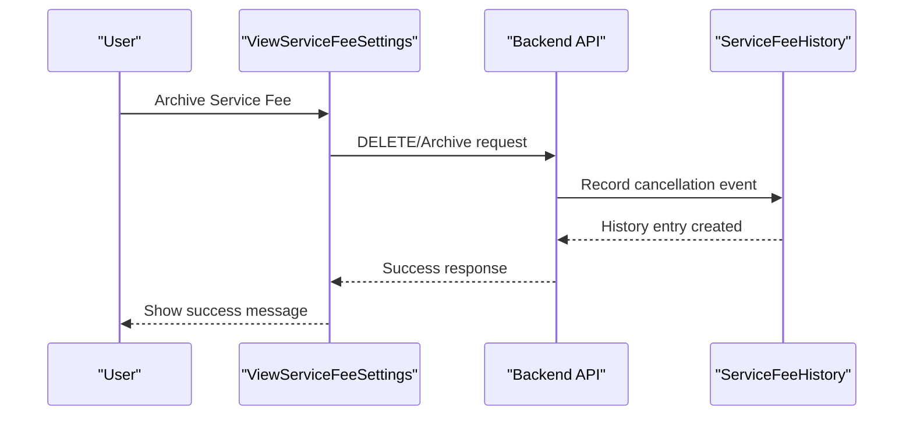

**Diagram sources**
- [ViewServiceFeeSettings.jsx](file://frontend/src/Features/ServiceFeeSettings/ServiceFeeSettings/PreviewServiceFeeSettings/ViewServiceFeeSettings.jsx#L104-L117)
- [models.py](file://backend/service_fee/models.py#L373-L470)

**Section sources**
- [ViewServiceFeeSettings.jsx](file://frontend/src/Features/ServiceFeeSettings/ServiceFeeSettings/PreviewServiceFeeSettings/ViewServiceFeeSettings.jsx#L104-L117)
- [models.py](file://backend/service_fee/models.py#L373-L470)

### Examples and Scenarios
- Creating a monthly service fee:
  - Set fee amount, currency, frequency, billing cycle, due day.
  - Select accepted payment methods (cash, MFS, bank).
  - Configure penalty tiers with days overdue and percentages in ascending order.
  - Submit form; backend validates and saves settings with penalty tier snapshots.
- Editing an existing service fee:
  - Load current settings, modify selective fields, validate, and submit.
  - Backend prevents duplicate unit assignments across active fees.
  - Penalty tiers are validated for proper ordering and bounds.
- Setting up automatic generation:
  - Define schedule with tower/unit filters, frequency, and generation time.
  - Scheduler periodically generates missing months with penalty tier snapshots.
- Viewing history:
  - Use history modal to review creation, edits, and cancellations with field-level changes.

**Section sources**
- [CreateServiceFeeForm.jsx](file://frontend/src/Features/ServiceFeeSettings/ServiceFeeSettings/ServiceFeeCreateForm/CreateServiceFeeForm.jsx#L202-L379)
- [EditServiceFeeForm.jsx](file://frontend/src/Features/ServiceFeeSettings/ServiceFeeSettings/ServiceFeeEditForm/EditServiceFeeForm.jsx#L556-L638)
- [scheduler.py](file://backend/service_fee_management/scheduler.py#L10-L78)
- [ServiceFeeHistoryModal.jsx](file://frontend/src/Features/ServiceFeeSettings/ServiceFeeHistory/ServiceFeeHistoryModal.jsx#L96-L150)

## Enhanced Penalty Tier Management

### Penalty Tier Configuration
The enhanced penalty tier system provides sophisticated late payment management with threshold-based calculations:

- **Threshold-based Calculation**: Penalty tiers are activated based on days overdue thresholds, not simple percentage increases.
- **Ascending Order Validation**: Tiers must be configured in ascending order of days overdue (1, 5, 10 days).
- **Strict Bounds**: Days overdue must be between 1-31, penalty percentages between 1.01-100%.
- **Historical Accuracy**: Penalty tiers are snapshotted at generation time to preserve historical accuracy.

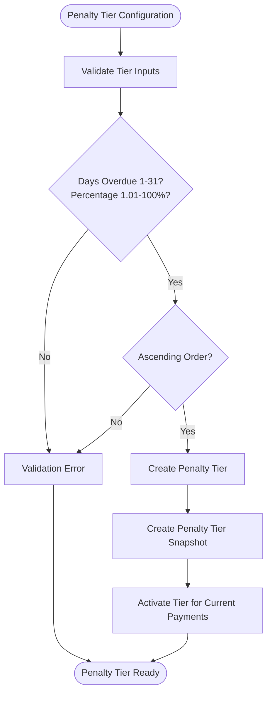

**Diagram sources**
- [models.py](file://backend/service_fee/models.py#L316-L375)
- [models.py](file://backend/service_fee_management/models.py#L1537-L1604)
- [update_penalty_tiers.py](file://backend/service_fee_management/management/commands/update_penalty_tiers.py#L66-L477)

### Automated Penalty Tier Updates
The system includes a dedicated penalty tier scheduler that automatically updates penalty tiers for overdue payments:

- **Daily Updates**: Runs at midnight daily to check overdue payments.
- **Threshold-based Activation**: Activates appropriate penalty tiers based on days overdue.
- **Historical Preservation**: Updates penalty tiers without affecting historical payment records.
- **Voucher Synchronization**: Automatically synchronizes accounting vouchers with penalty changes.

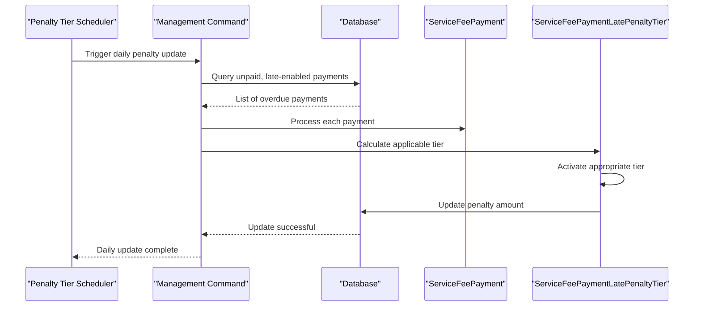

**Diagram sources**
- [penalty_tier_scheduler.py](file://backend/service_fee_management/penalty_tier_scheduler.py#L15-L70)
- [update_penalty_tiers.py](file://backend/service_fee_management/management/commands/update_penalty_tiers.py#L22-L64)

### Penalty Calculation Logic
The penalty calculation system has been enhanced to ensure accuracy and fairness:

- **Base Amount Only**: Penalties are calculated only on the base service fee, not on additional charges.
- **Threshold-based Application**: Uses the highest applicable tier based on days overdue.
- **Rounding Precision**: Penalties are rounded to whole numbers for practicality.
- **Net vs Gross Amounts**: Maintains both gross penalty (before waivers) and net penalty (after waivers) tracking.

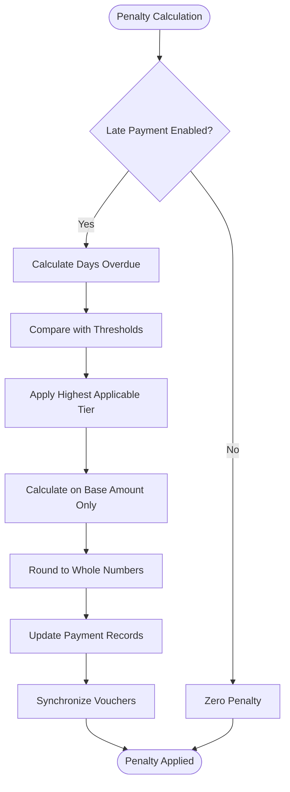

**Diagram sources**
- [service_fee_generator.py](file://backend/service_fee_management/utils/service_fee_generator.py#L1177-L1204)
- [update_penalty_tiers.py](file://backend/service_fee_management/management/commands/update_penalty_tiers.py#L146-L151)

### Frontend Penalty Configuration
The frontend provides enhanced penalty tier configuration with real-time validation and user-friendly interfaces:

- **Real-time Validation**: Immediate feedback for penalty tier inputs.
- **Visual Tier Ordering**: Clear indication of tier order and thresholds.
- **Helpful Guidance**: Contextual help for proper penalty tier configuration.
- **Responsive Design**: Mobile-friendly penalty tier management interface.

**Section sources**
- [models.py](file://backend/service_fee/models.py#L316-L375)
- [models.py](file://backend/service_fee_management/models.py#L1537-L1604)
- [penalty_tier_scheduler.py](file://backend/service_fee_management/penalty_tier_scheduler.py#L1-L89)
- [update_penalty_tiers.py](file://backend/service_fee_management/management/commands/update_penalty_tiers.py#L1-L477)
- [ServiceFeeFormView.jsx](file://frontend/src/Features/ServiceFeeSettings/ServiceFeeSettings/ServiceFeeCreateForm/ServiceFeeFormView.jsx#L2200-L2318)

## Dependency Analysis
The system exhibits clear separation of concerns with enhanced penalty management:
- Frontend forms depend on backend APIs for CRUD operations and penalty tier validation.
- Backend models encapsulate business rules (validations, uniqueness, penalties, tier snapshots).
- Scheduler and generator utilities depend on models to create billing records and penalty tier snapshots.
- Penalty tier scheduler and management commands coordinate penalty calculations and updates.
- Reminder models coordinate with the broader notification system.
- Penalty waiver system integrates with accounting and payment tracking.

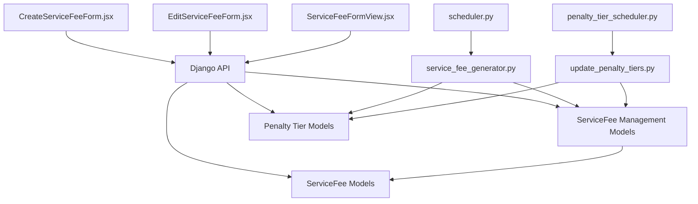

**Diagram sources**
- [CreateServiceFeeForm.jsx](file://frontend/src/Features/ServiceFeeSettings/ServiceFeeSettings/ServiceFeeCreateForm/CreateServiceFeeForm.jsx#L16-L903)
- [EditServiceFeeForm.jsx](file://frontend/src/Features/ServiceFeeSettings/ServiceFeeSettings/ServiceFeeEditForm/EditServiceFeeForm.jsx#L15-L1102)
- [ServiceFeeFormView.jsx](file://frontend/src/Features/ServiceFeeSettings/ServiceFeeSettings/ServiceFeeCreateForm/ServiceFeeFormView.jsx#L2200-L2318)
- [models.py](file://backend/service_fee/models.py#L10-L179)
- [models.py](file://backend/service_fee_management/models.py#L11-L800)
- [models.py](file://backend/service_fee_management/models.py#L1537-L1604)
- [scheduler.py](file://backend/service_fee_management/scheduler.py#L10-L78)
- [service_fee_generator.py](file://backend/service_fee_management/utils/service_fee_generator.py#L15-L800)
- [penalty_tier_scheduler.py](file://backend/service_fee_management/penalty_tier_scheduler.py#L1-L89)
- [update_penalty_tiers.py](file://backend/service_fee_management/management/commands/update_penalty_tiers.py#L1-L477)

**Section sources**
- [CreateServiceFeeForm.jsx](file://frontend/src/Features/ServiceFeeSettings/ServiceFeeSettings/ServiceFeeCreateForm/CreateServiceFeeForm.jsx#L16-L903)
- [EditServiceFeeForm.jsx](file://frontend/src/Features/ServiceFeeSettings/ServiceFeeSettings/ServiceFeeEditForm/EditServiceFeeForm.jsx#L15-L1102)
- [ServiceFeeFormView.jsx](file://frontend/src/Features/ServiceFeeSettings/ServiceFeeSettings/ServiceFeeCreateForm/ServiceFeeFormView.jsx#L2200-L2318)
- [models.py](file://backend/service_fee/models.py#L10-L179)
- [models.py](file://backend/service_fee_management/models.py#L11-L800)
- [models.py](file://backend/service_fee_management/models.py#L1537-L1604)
- [scheduler.py](file://backend/service_fee_management/scheduler.py#L10-L78)
- [service_fee_generator.py](file://backend/service_fee_management/utils/service_fee_generator.py#L15-L800)
- [penalty_tier_scheduler.py](file://backend/service_fee_management/penalty_tier_scheduler.py#L1-L89)
- [update_penalty_tiers.py](file://backend/service_fee_management/management/commands/update_penalty_tiers.py#L1-L477)

## Performance Considerations
- Bulk operations: The generator uses bulk creation and updates to minimize database overhead.
- Atomic transactions: Generation and penalty updates occur within atomic blocks to maintain consistency.
- Indexes and queries: Queries leverage indexes on towers, units, service fee dates, and penalty tier snapshots to optimize retrieval.
- Scheduler cadence: The scheduler checks every few seconds to balance responsiveness and resource usage.
- **Updated**: Penalty tier scheduler runs daily at midnight to minimize performance impact.
- **Updated**: Penalty tier snapshots ensure historical queries don't require complex recalculations.

## Troubleshooting Guide
Common issues and resolutions:
- Duplicate unit assignment:
  - Symptom: Validation error indicating unit already assigned to another active service fee.
  - Resolution: Adjust unit selections to ensure exclusivity or deactivate conflicting fees.
- Payment method validation failures:
  - Symptom: Errors for missing MFS account details or bank account fields.
  - Resolution: Ensure required fields are filled and MFS numbers are unique per provider.
- History discrepancies:
  - Symptom: Missing cancellation or edit entries.
  - Resolution: Use the history modal to verify recorded events and timestamps.
- **Updated**: Penalty tier validation failures:
  - Symptom: Errors for invalid penalty tier configuration (out of bounds, wrong order).
  - Resolution: Ensure days overdue are between 1-31, percentages between 1.01-100%, and tiers are in ascending order.
- **Updated**: Penalty tier not activating:
  - Symptom: Penalty tiers not updating despite days overdue threshold met.
  - Resolution: Check penalty tier scheduler logs and ensure daily updates are running correctly.
- **Updated**: Historical penalty accuracy:
  - Symptom: Past payments showing incorrect penalty amounts after penalty tier changes.
  - Resolution: Verify penalty tier snapshots are properly created and historical payments reference correct snapshots.

**Section sources**
- [CreateServiceFeeForm.jsx](file://frontend/src/Features/ServiceFeeSettings/ServiceFeeSettings/ServiceFeeCreateForm/CreateServiceFeeForm.jsx#L564-L678)
- [EditServiceFeeForm.jsx](file://frontend/src/Features/ServiceFeeSettings/ServiceFeeSettings/ServiceFeeEditForm/EditServiceFeeForm.jsx#L768-L808)
- [ServiceFeeHistoryModal.jsx](file://frontend/src/Features/ServiceFeeSettings/ServiceFeeHistory/ServiceFeeHistoryModal.jsx#L195-L291)
- [update_penalty_tiers.py](file://backend/service_fee_management/management/commands/update_penalty_tiers.py#L22-L64)

## Conclusion
The service fee settings and configuration system provides a robust foundation for managing recurring billing, payment methods, late penalties, and automated generation. The enhanced penalty tier management system with threshold-based calculations, automated daily updates, and historical accuracy preservation ensures reliable and fair late payment processing. Its modular design, strong validation, comprehensive history tracking, and integrated penalty tier snapshots ensure reliability and transparency across the billing lifecycle. Integrating reminders, archival processes, and penalty waiver management further enhances operational efficiency and compliance.